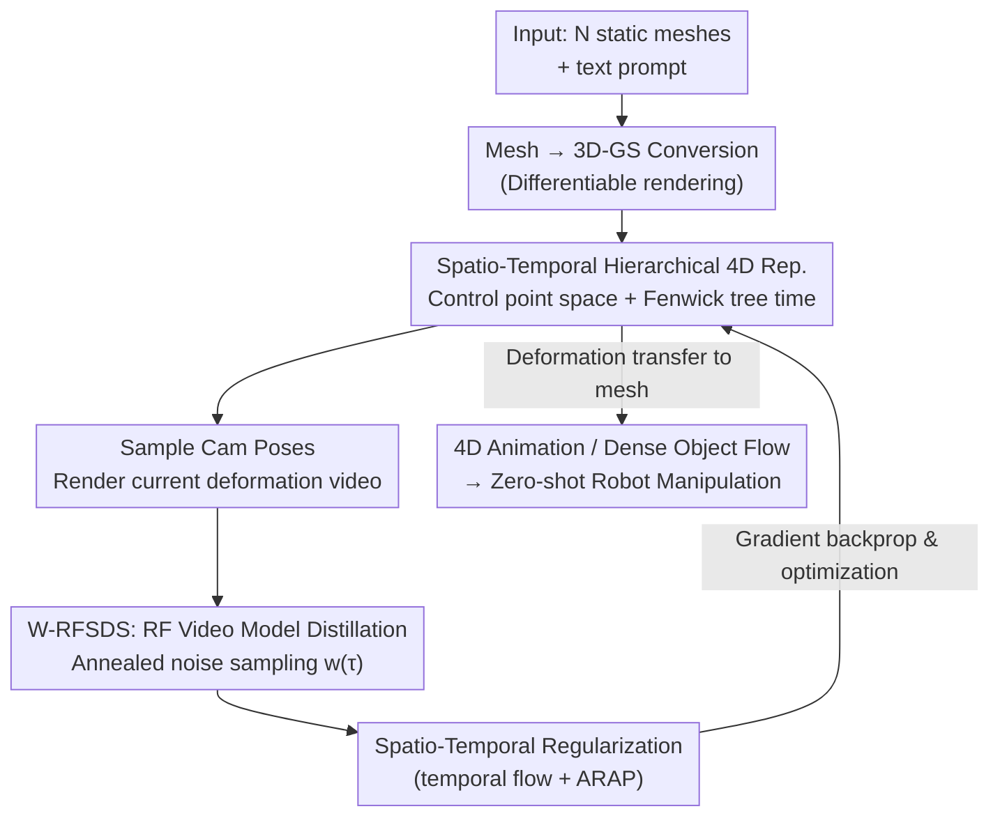

# Choreographing a World of Dynamic Objects

**Conference**: CVPR 2026  
**Paper**: [CVF OpenAccess](https://openaccess.thecvf.com/content/CVPR2026/html/Lyu_Choreographing_a_World_of_Dynamic_Objects_CVPR_2026_paper.html)  
**Code**: Project Page https://yanzhelyu.github.io/chord (Code not explicitly released; ⚠️ refer to original text)  
**Area**: 3D Vision / 4D Generation  
**Keywords**: 4D scene generation, Score Distillation, Rectified Flow, 3D Gaussian Splatting, Fenwick Tree

## TL;DR
CHORD treats static 3D objects as "actors" and a video generation model as a "choreographer." Through a distillation objective customized for rectified-flow video models and a spatio-temporal hierarchical 4D motion representation, it generates physically plausible 4D animations of multi-object interactions using only 3D shapes and a text prompt. It further enables zero-shot robot manipulation.

## Background & Motivation

**Background**: Adding a temporal dimension to static scenes composed of multiple dynamic objects—allowing them to deform, move, and interact—is a core capability for building world models in robotics and embodied AI. Traditional methods rely on graphics rule pipelines (rigging category-specific skeletons), while recent works employ data-driven end-to-end 4D generators.

**Limitations of Prior Work**: Rule-based pipelines depend on category-specific heuristics, requiring intensive manual modeling and expert annotation, which lacks scalability. Data-driven methods are bottlenecked by data: existing 4D datasets (e.g., DeformingThings) primarily cover **internal deformations of single objects**, with almost no **multi-object interactions**. Scene-level 4D data describing both deformation and interaction is extremely scarce. Consequently, existing methods struggle to generalize beyond common categories like humans.

**Key Challenge**: The goal is to achieve "universal, category-agnostic 4D generation with interactions," yet there is a fundamental conflict between the desired universality and the lack of available 4D supervision signals.

**Goal**: Given a static 3D snapshot of multiple objects and a text prompt describing scene changes over time (e.g., "a man's hand pushing down a lamp head"), the goal is to generate a sequence of 3D deformations where the resulting animation aligns with the text without category priors or large-scale 4D data.

**Key Insight**: General video generation models (e.g., Wan 2.2) have learned rich world motion priors from massive real-world videos. These priors exist in an **Eulerian (pixel-wise)** form within 2D videos, while 4D generation requires a **Lagrangian (point-tracking)** 3D deformation trajectory. The authors propose using distillation to treat the video model as a "high-level choreographer" that scores rendered deformations, thereby "translating" Eulerian motion into Lagrangian deformation.

**Core Idea**: Use Score Distillation to extract motion priors from video generation models to optimize a 4D deformation representation. To make this feasible, two obstacles must be addressed: (1) high-dimensional 4D deformation spaces are unstable to optimize without temporal regularization, and (2) modern video models use rectified-flow (RF) architectures, which are incompatible with classical SDS algorithms. CHORD addresses these via a "spatio-temporal hierarchical 4D representation" and a "weighted SDS objective reformulated for RF models."

## Method

### Overall Architecture

CHORD is an **iterative optimization** distillation pipeline that requires no training dataset, only an "input scene + text prompt." The process begins by converting $N$ input meshes into 3D Gaussian Splatting (3D-GS) for differentiable rendering. A spatio-temporal hierarchical 4D motion representation is then initialized. Repeatedly, the system samples camera poses, renders the current deformation into a video, adds noise, and passes it to the video model. The 4D representation is updated using W-RFSDS gradients while applying spatio-temporal smoothing. Once converged, the learned deformation is transferred from Gaussians back to mesh vertices.

The three core components correspond to Sec 3.2 / 3.3 / 3.4: **Distillation objective for RF models** (extracting gradients), **Spatio-temporal hierarchical 4D representation** (stable optimization targets), and **Spatio-temporal regularization** (suppressing jitter).

### Key Designs

**1. W-RFSDS: Weighted SDS for Rectified-Flow Video Models**

Classic SDS (Score Distillation Sampling) is designed for **diffusion models**: it noise-adds an image $z$ to $z_\tau$, predicts noise $\hat\epsilon$, and updates via $\nabla_\theta \mathcal{L}_{SDS}=\mathbb{E}_{\tau,\epsilon}[w(\tau)(\hat\epsilon(z_\tau;\tau,y)-\epsilon)\frac{\partial z}{\partial\theta}]$. Modern models like Wan 2.2 use rectified-flow where the network predicts a **velocity field** $\hat v$ rather than noise. Following the SDS derivation logic aligned with RF training loss, the authors derive the RF version:

$$\nabla_\theta \mathcal{L}_{RFSDS}=\mathbb{E}_{\tau,\epsilon}\Big[w(\tau)\big(\hat v(z_\tau;\tau,y)-\epsilon+z\big)\tfrac{\partial z}{\partial\theta}\Big]$$

Crucially, deformation is only triggered at **high noise levels $\tau$**. Therefore, instead of uniform sampling, $\tau$ is sampled according to the normalized weight $\hat w(\tau)$. This yields the unbiased W-RFSDS:

$$\nabla_\theta \mathcal{L}_{W\text{-}RFSDS}=\mathbb{E}_{\tau\sim\hat w(\tau),\epsilon}\Big[\big(\hat v(z_\tau;\tau,y)-\epsilon+z\big)\tfrac{\partial z}{\partial\theta}\Big]$$

An **annealed noise schedule** is used where $\tau$ decreases during training to initialize coarse motion at high noise and refine details at low noise.

**2. Spatial Control Point Hierarchy: Compressing Deformation into Low-Dimensional Parameters**

Directly optimizing every Gaussian's motion is unstable. Inspired by SC-GS, sparse **control points** (with means $p$ and covariances $\Sigma$) drive local deformation via SE(3) sequences $(R^t, T^t)$. Gaussian deformation is computed via **Linear Blend Skinning (LBS)**:

$$\mu^t=\sum_{k\in\mathcal{N}}\beta_k\big(R_k^t(\mu-p_k)+p_k+T_k^t\big),\quad q^t=\big(\sum_{k\in\mathcal{N}}\beta_k r_k^t\big)\otimes q$$

The weights $\beta_k$ are normalized. A **coarse-to-fine** strategy is used: coarse points determine global motion, while fine points add residual details. Fine points are introduced only after noise $\tau$ anneals to lower levels.

**3. Fenwick Tree Temporal Hierarchy: Enforcing Long-range Consistency**

Independent per-frame modeling of $(R^t, T^t)$ leads to error accumulation. CHORD uses a **Fenwick Tree (Binary Indexed Tree)** for each control point $k$. Nodes $F_k=\{(r_k^{[j]},T_k^{[j]})\}_{j=1}^T$ encode **cumulative deformation over intervals**. Deformation at frame $t$ is queried via:

$$T_k^t=\sum_{j\in\mathrm{BIT}(t)}T_k^{[j]},\quad r_k^t=\mathrm{norm}\Big(\sum_{j\in\mathrm{BIT}(t)}r_k^{[j]}\Big)$$

Interval sharing implicitly enforces temporal continuity and significantly improves the learnability of long-duration motion.

**4. Spatio-temporal Regularization: 3D Flow and ARAP**

Gradient noise is mitigated by **temporal regularization**, penalizing large pixel-wise 3D flow $F$ between frames ($\mathcal{L}_{temp}$), and **spatial regularization** using the As-Rigid-As-Possible (ARAP) loss ($\mathcal{L}_{ARAP}$) on a surface point cloud to prevent geometric distortion.

## Key Experimental Results

### Main Results
Evaluated across 6 scenarios (e.g., "man petting a dog," "robot grasping a cube") against baselines like Animate3D (A3D) and MotionDreamer (MD). Metrics include a user study ($n=99$) and VideoPhy-2 (Semantic Adherence SA, Physical Commonsense PC).

| Method | User Pref. (Alignment) ↑ | User Pref. (Realism) ↑ | SA ↑ | PC ↑ |
|------|------|------|------|------|
| Animate3D | 0.34% | 0.51% | 3.83 | 3.42 |
| AnimateAnyMesh | 1.01% | 0.51% | 3.5 | **4.5** |
| MotionDreamer (Wan) | 0.84% | 0.34% | 3.5 | 3.83 |
| TrajectoryCrafter | 9.60% | 10.44% | 4.17 | 3.83 |
| **CHORD (Ours)** | **87.71%** | **87.37%** | **4.33** | 4.25 |

> CHORD significantly outperforms baselines in user preference (~87%). While AnimateAnyMesh scores higher in PC, it is noted that this is due to a failure mode where objects remain static (physically plausible but poor alignment).

### Ablation Study

| Configuration | Observation | Description |
|------|------|------|
| Full model | Natural, follows prompt | Complete model |
| w/o Noise Sampling | Unnatural motion | Fails to reach the high-noise region required for motion injection |
| w/o Fenwick Tree | Serious artifacts in later frames | Independent per-frame modeling cannot handle long sequences |
| w/o Fine Points | Loss of精细动作 (e.g., grasping) | Lacks local degrees of freedom |
| w/o Coarse Points | Global distortion | Lacking large-scale structural motion |
| w/o Regularization | Jitter and distortion | Temporal/spatial smoothness is lost |

### Key Findings
- **Noise sampling strategy** and the **Fenwick tree** are the most critical contributions for motion excitation and long-term consistency, respectively.
- Coarse-to-fine timing must be coupled with noise annealing for stability.
- The PC metric can be misled by "static solutions," emphasizing the need for combined semantic and human evaluation.

## Highlights & Insights
- **Video Model as "Choreographer"**: Instead of generating 2D videos directly (which lack 3D consistency), CHORD uses the video model to score 3D deformations, maintaining a consistent 3D-GS/mesh representation.
- **Eulerian-to-Lagrangian Conversion**: CHORD translates pixel-wise motion priors into particle-wise 3D trajectories, bridging the gap between video generation and robotics.
- **Fenwick Tree Innovation**: Applying a cumulative interval data structure to temporal modeling is a novel way to ensure long-term consistency in 4D optimization.
- **Zero-shot Manipulation**: The output dense object flow serves as a guidance signal for robot motion planners, demonstrating the practical value for embodied AI.

## Limitations & Future Work
- **Per-scene Optimization**: The iterative distillation process is computationally expensive compared to feed-forward models.
- **Upper Bound by Video Model**: Quality is limited by the underlying video model's motion priors (e.g., Wan 2.2).
- **Static 3D Requirement**: Requires existing multi-object mesh/scans as input.
- **Future Directions**: Developing amortized models for speed, introducing explicit contact physics, and scaling to complex open-world scenes.

## Related Work & Insights
- **vs. Data-driven 4D (Animate3D)**: CHORD avoids the limitations of human-centric 4D datasets by leveraging universal video priors.
- **vs. MotionDreamer**: Avoids fragile feature matching by using end-to-end differentiable SDS gradients.
- **vs. TrajectoryCrafter**: CHORD's single consistent 3D representation is superior to multi-view reconstruction which often suffers from temporal flickering.

## Rating
- Novelty: ⭐⭐⭐⭐⭐ 
- Experimental Thoroughness: ⭐⭐⭐⭐ 
- Writing Quality: ⭐⭐⭐⭐⭐ 
- Value: ⭐⭐⭐⭐⭐ 

<!-- RELATED:START -->

## Related Papers

- [\[CVPR 2026\] ICTPolarReal: A Polarized Reflection and Material Dataset of Real World Objects](ictpolarreal_a_polarized_reflection_and_material_dataset_of_real_world_objects.md)
- [\[CVPR 2026\] AssemblyBench: Physics-Aware Assembly of Complex Industrial Objects](assemblybench_physics-aware_assembly_of_complex_industrial_objects.md)
- [\[CVPR 2026\] Artiverse: A Diverse and Physically Grounded Dataset for Articulated Objects](artiverse_a_diverse_and_physically_grounded_dataset_for_articulated_objects.md)
- [\[CVPR 2026\] GenMatter: Perceiving Physical Objects with Generative Matter Models](genmatter_perceiving_physical_objects_with_generative_matter_models.md)
- [\[CVPR 2026\] GaussianFluent: Gaussian Simulation for Dynamic Scenes with Mixed Materials](gaussianfluent_gaussian_simulation_for_dynamic_scenes_with_mixed_materials.md)

<!-- RELATED:END -->
