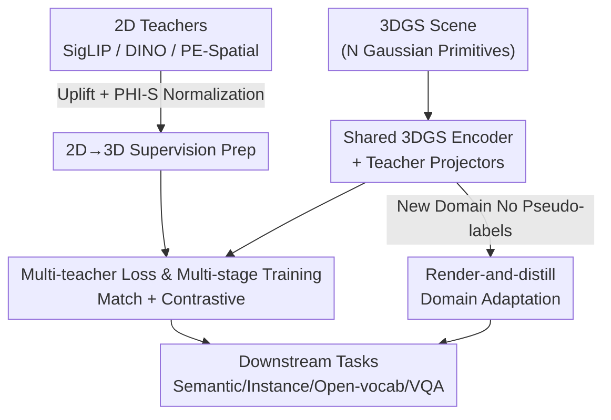

# Chorus: Multi-Teacher Pretraining for Holistic 3D Gaussian Scene Encoding

**Conference**: CVPR 2026  
**Paper**: [CVF Open Access](https://openaccess.thecvf.com/content/CVPR2026/html/Li_Chorus_Multi-Teacher_Pretraining_for_Holistic_3D_Gaussian_Scene_Encoding_CVPR_2026_paper.html)  
**Code**: Available (Original text states code and models are open-sourced; refer to the CVF paper page for specific URLs ⚠️)  
**Area**: 3D Vision  
**Keywords**: 3D Gaussian Splatting, Multi-teacher Distillation, Scene Encoding Pre-training, Open-vocabulary Segmentation, Cross-modal Distillation  

## TL;DR
Chorus utilizes three types of 2D foundation models—language-aligned (SigLIP2), general vision (DINOv3), and object-aware (PE-Spatial)—as teachers. By employing a "shared 3DGS encoder + independent projectors for each teacher," it distills a versatile feed-forward 3D Gaussian scene encoder in a single pass. It achieves SOTA performance across a wide range of tasks including semantic/instance segmentation, open-vocabulary tasks, and VQA, while requiring $8.32\times$ to $39.9\times$ fewer training scenes compared to point cloud pre-training baselines.

## Background & Motivation
**Background**: 3DGS (3D Gaussian Splatting) has become a mainstream scene representation for high-fidelity, real-time differentiable rendering. Consequently, the community has produced significant work on "attaching semantics to 3DGS"—lifting 2D vision-language features onto Gaussians for open-vocabulary segmentation. Representative works like SceneSplat established the "lift-then-align" paradigm: lifting dense 2D language features to 3D Gaussians as pseudo-labels to train a feed-forward 3DGS encoder.

**Limitations of Prior Work**: Methods like SceneSplat primarily align **semantic information** and are validated only on semantic segmentation. The features learned by the encoder tend to be uni-modal—capabilities such as instance grouping, fine-grained structure, and reasoning (VQA) remain largely unexplored. In other words, 3DGS itself has been undervalued as a "modality capable of directly extracting general transferable features"; it has been treated mostly as a rendering container rather than a representation source.

**Key Challenge**: Distillation from a single teacher or for a single objective naturally teaches the encoder only one type of prior. To obtain a truly "holistic" 3D encoder, it must absorb complementary signals. however, different 2D foundation models vary significantly in feature scales and distributions, making simple concatenation prone to interference and difficult loss balancing.

**Goal**: To train a **native 3DGS** feed-forward encoder whose embedding space simultaneously covers high-level semantics, instance grouping, and fine-grained spatial structures, serving both 3DGS inputs and transferable point cloud-only tasks.

**Key Insight**: Borrowing from the 2D domain's experience that "multi-teacher distillation is stronger than single-teacher," this work specifically adapts this concept to 3DGS for the first time—utilizing 3DGS's inherent rendering capabilities to make "switching to new data domains" computationally inexpensive.

**Core Idea**: Use "one shared 3D backbone + one lightweight projector per teacher" to simultaneously distill knowledge from three complementary teachers—language-aligned, general, and object-aware—into the same 3D embedding space.

## Method

### Overall Architecture
The goal of Chorus is to pre-train a feed-forward Gaussian scene encoder $g_\theta$: given a 3DGS scene (a set of Gaussian primitive parameters), it outputs latent features $Z \in \mathbb{R}^{N\times d_z}$ for each Gaussian. The pipeline consists of four steps: (1) **uplifting** features from three 2D teachers onto 3D Gaussians as supervision signals, accompanied by cross-teacher scale normalization; (2) after the shared encoder produces $Z$, an independent projector for each teacher maps $Z$ to that teacher's specific feature space, using a multi-teacher loss to approximate the uplifted pseudo-labels; (3) teachers are incorporated via **multi-stage** training, with optional contrastive regularization in the loss; (4) for new data domains without pseudo-labels, a "render-and-distill" approach is used for online supervision via 2D views and teachers, enabling lightweight fine-tuning. Once trained, the encoder (or a specific projector) handles downstream heads for semantic/instance segmentation, open-vocabulary tasks, and VQA.

### Key Designs

**1. Complementary Multi-Teacher Distillation: Learning Semantics, Instances, and Spatial Structure in One Shared Backbone**

This is the core of Chorus, directly addressing the limitation that "SceneSplat only learns semantics, resulting in singular features." The authors selected three **functionally complementary** 2D teachers: SigLIP2 provides language-aligned semantics (supporting open-vocabulary), DINOv3 provides general visual features (good generalization), and PE-Spatial (a spatial variant of Perception Encoder combining self-alignment and SAM-logit alignment) provides object-aware fine spatial structures (supporting instance grouping). Architecturally, a **shared 3DGS encoder** $g_\theta$ generates per-Gaussian features $Z = g_\theta(\mathcal{G}) \in \mathbb{R}^{N\times d_z}$, while each teacher $t\in\{\text{lang}, \text{dino}, \text{pe}\}$ is assigned a lightweight projector $h_t$ (2-layer MLP + LayerNorm + GELU) to produce predictions $\hat{F}^{(t)}=h_t(Z)$.

A shared backbone forces knowledge from different teachers into the **same embedding space**, compelling "breadth + complementarity"—the encoder must make semantics separable, instances groupable, and spatial structures preserved. The projectors allow teachers to have distinct exits without crowding the backbone capacity.

**2. Uplifting 2D Teacher Features to 3DGS with PHI-S Normalization: Making Supervision Accurate and Balanced**

To distill, 3D supervision targets are required. The challenges are mapping 2D features onto each Gaussian and handling inconsistent scales among teachers. The authors reuse 3DGS's composition weights for uplifting: 3DGS renders a pixel color as a weighted sum of sorted Gaussians along a ray $\mathbf{C}(\mathbf{u}\mid p)=\sum_{i} w_i(p,\mathbf{u})\,\mathbf{c}_i$, where $w_i = T_i\,\alpha_i$. By replacing color with 2D teacher features $F_{p,\mathbf{u}}$, the target feature for each Gaussian is obtained using the **same normalized weights**:

$$f_i = \sum_{(p,\mathbf{u})\in \mathcal{S}_i} \bar{w}_i(p,\mathbf{u})\,F_{p,\mathbf{u}}, \qquad \bar{w}_i(p,\mathbf{u}) = \frac{w_i(p,\mathbf{u})}{\sum_{(p',\mathbf{u}')\in \mathcal{S}_i} w_i(p',\mathbf{u}')}$$

This represents a "weighted average of rendering weights," where $\mathcal{S}_i$ is the set of all view-pixel pairs contributing to Gaussian $i$. Since the uplifted features' activation scales and variances differ significantly, the authors use **PHI-S** (PCA rotation + isotropic Hadamard scaling) to normalize the mean variance of each channel while preserving cross-channel relationships, yielding normalized features $\widetilde{F}_{p,\mathbf{u}}$. This step allows **equal weighting** $\lambda_t$ for all three teachers, eliminating the complex loss tuning typical of multi-teacher distillation.

**3. Multi-Teacher Loss + Multi-stage Training: Balancing Alignment, Fidelity, and Structural Cues**

The matching loss handles both "direction" and "magnitude"—cosine similarity for alignment and SmoothL1 for preserving magnitude:

$$\mathcal{L}_{\text{match}}^{(t)} = \frac{1}{|M^{(t)}|}\sum_{i\in M^{(t)}}\Big[\lambda_1\big(1-\cos(\hat{F}^{(t)}_i,\widetilde{F}^{(t)}_i)\big) + \lambda_2\,\mathrm{SmoothL1}(\hat{F}^{(t)}_i,\widetilde{F}^{(t)}_i)\Big]$$

where $M^{(t)}$ is an effective mask derived from feature norms/visibility. For datasets with semantic/instance labels, an **optional contrastive regularization** $\mathcal{L}_{\text{con}}^{(t)}$ is added: category-level for SigLIP2 and instance-level for PE-Spatial. Teachers are activated in **stages**: let $\mathcal{A}(e)$ be the set of active teachers at epoch $e$ (e.g., starting with {lang, dino}, then adding pe). The total objective is:

$$\mathcal{L}_{\text{total}}(e) = \sum_{t\in \mathcal{A}(e)} \lambda_t\Big(\mathcal{L}_{\text{match}}^{(t)} + \eta_t\,\mathcal{L}_{\text{con}}^{(t)}\Big)$$

By default, $\lambda_t=1.0$ and $\eta_t=0.02$. Multi-stage introduction stabilizes training by allowing the encoder to solidify semantic and general features before superimposing more complex spatial/instance signals.

**4. Render-and-distill Domain Adaptation: Lightweight Adaptation for New Domains**

The uplift paradigm usually requires heavy offline pre-computation of 3D pseudo-labels, which is storage-expensive (~1TB for 800 scenes). Chorus moves this **online** using 3DGS rendering: for a new scene, it samples camera poses, performs visibility culling, and computes 2D teacher features on the fly. Simultaneously, the encoder-projector predictions are **rendered back to 2D feature maps** using the same weights $w_i(p,\mathbf{u})$: $\hat{F}^{(t)}_{p,\mathbf{u}}=\sum_i w_i(p,\mathbf{u})\,\hat{F}^{(t)}_i$. Supervision is then applied in the pixel plane using the match loss. This reduces pre-processing time from 3.4h to 0.2h and storage from ~1080GB to 8GB.

### Loss & Training
The backbone is a 5-stage transformer encoder adapted from Sonata with a 512-dimensional bottleneck. Teachers include SigLIP2-so400m-p16-512, DINOv3-ViTL16, and PE-Spatial-L14-448. Pre-training uses 3DGS scenes from SceneSplat-7K with regenerated pseudo-labels. The standard model (denoted ✾) takes all Gaussian parameters as input. A **point cloud variant** (denoted •) takes only center, color, and estimated normals as input for comparison with point cloud encoders. Chorus also introduces **3DGS-aware augmentations** (Rendering-Equivalent noise and Immature-Manifold perturbations) to replace point cloud augmentations like jitter/dropout, which can be detrimental to rendering consistency.

## Key Experimental Results

### Main Results
Zero-shot open-vocabulary semantic segmentation (foreground mIoU / mAcc, ✾=3DGS input):

| Dataset | Metric | Chorus (Joint) | SceneSplat (Joint) | Gain |
|--------|------|------|----------|------|
| ScanNet200 | f-mIoU | 24.6 | 22.5 | +2.1 |
| ScanNet200 | f-mAcc | 47.7 | 41.7 | +6.0 |
| Matterport3D | f-mIoU | 18.7 | 14.0 | +4.7 |
| ScanNet++ | f-mIoU | 29.6 | 28.6 | +1.0 |
| InteriorGS (New) | f-mIoU | 15.7 | 10.0 | +5.7 |
| InteriorGS (New) | f-mAcc | 24.1 | 18.3 | +5.8 |

Chorus uses the same data scale as SceneSplat but requires **$8.32\times$ fewer scenes** than the point-cloud-pretrained Mosaic3D. On instance segmentation (ScanNet200), Chorus achieves mAP25=19.6, a SOTA for 3D-only methods, with a **+7.6 mAP** gain on rare classes.

Point cloud task transfer (Linear probing vs. Full fine-tuning, mIoU):

| Setting | Dataset | • Chorus | Sonata | Gain |
|------|--------|----------|--------|------|
| Linear Probe | ScanNet200 | 36.0 | 28.8 | +7.2 |
| Linear Probe | ScanNet++ | 48.8 | 40.7 | +8.1 |
| Full Fine-tune | ScanNet200 | 40.9 | 34.4 | +6.5 |
| Full Fine-tune | ScanNet | 79.4 | 78.6 | +0.8 |

Notably, the point cloud-only variant • Chorus matches or exceeds the SOTA self-supervised point cloud model Sonata while using **$39.9\times$ fewer** training scenes.

### Ablation Study

| Configuration | Observation | Explanation |
|------|------|------|
| Full model | Best | 3 Teachers + match + contrastive + multi-stage + aug |
| w/o SmoothL1 | Drop | Loss of magnitude information |
| w/o 3DGS-aware aug | Drop | Traditional jitter is harmful to splats |
| Simultaneous (no stages) | Drop | Harder teachers interfere early on |
| w/o Instance contrastive | Drop | Decreased instance separability |

### Key Findings
- **Complementary Teachers + Shared Space is the key to multi-tasking**: A single encoder captures semantics, instances, and VQA SOTA because these signals are distilled into one embedding space.
- **PHI-S normalization enables equal weights**: It solves the headache of manual loss balancing in multi-teacher distillation.
- **Unexpectedly strong point cloud transfer**: 3DGS pre-training acts as a noise-robust augmentation, which, combined with multi-teacher signals, makes it far more data-efficient than pure 3D self-supervision.
- **Render-and-distill slashes costs**: It reduces the storage and pre-processing overhead of OOD adaptation by two orders of magnitude (1080GB to 8GB).

## Highlights & Insights
- **3DGS as a "Modality"**: Extracting general features directly from Gaussian primitives is a substantial upgrade to the lift-then-align paradigm, cleverly utilizing rendering weights for both uplifting and render-back.
- **Symmetric reuse of weights**: Using the same $w_i(p,\mathbf{u})$ for both training supervision and domain adaptation provides elegant conceptual and implementation unity.
- **PHI-S + Multi-stage rollout**: This combination for preventing teacher interference is a transferable lesson for any multi-teacher context beyond 3D.
- **Augmentation awareness**: 3DGS is an optimized parameter space, not an i.i.d. point set; augmentations must be designed based on the rendering equation.

## Limitations & Future Work
- **Dependence on 2D teachers**: The upper bound of the 3D encoder is determined by the teachers; performance in domains where teachers are weak (e.g., outdoor scenes) may suffer.
- **Indoor scene focus**: Evaluation is primarily on indoor datasets (ScanNet, Matterport3D); outdoor generalization is not fully validated.
- **Point cloud transfer mechanism**: The precise reason why 3DGS pre-training boosts point cloud robustness is empirically supported but lacks full theoretical explanation.

## Related Work & Insights
- **vs. SceneSplat**: Chorus expands the single-semantic-teacher approach to three complementary teachers and adds VQA and instance capabilities via multi-task pre-training.
- **vs. Sonata**: While Sonata relies on self-supervision, Chorus uses cross-modal distillation to achieve similar results with $39.9\times$ less data.
- **vs. 2D Multi-teacher (e.g., AM-RADIO)**: Chorus takes the "multi-teacher aggregation" concept and adapts it to the unique rendering properties of 3DGS.

## Rating
- Novelty: ⭐⭐⭐⭐⭐ 
- Experimental Thoroughness: ⭐⭐⭐⭐⭐ 
- Writing Quality: ⭐⭐⭐⭐ 
- Value: ⭐⭐⭐⭐⭐ 

<!-- RELATED:START -->

## Related Papers

- [\[CVPR 2026\] 3D-Aware Multi-Task Learning with Cross-View Correlations for Dense Scene Understanding](3d-aware_multi-task_learning_with_cross-view_correlations_for_dense_scene_unders.md)
- [\[CVPR 2026\] ClipGStream: Clip-Stream Gaussian Splatting for Any Length and Any Motion Multi-View Dynamic Scene Reconstruction](clipgstream_clip-stream_gaussian_splatting_for_any_length_and_any_motion_multi-v.md)
- [\[CVPR 2026\] CustomTex: High-fidelity Indoor Scene Texturing via Multi-Reference Customization](customtex_high-fidelity_indoor_scene_texturing_via_multi-reference_customization.md)
- [\[CVPR 2026\] Changes in Real Time: Online Scene Change Detection with Multi-View Fusion](changes_in_real_time_online_scene_change_detection_with_multi-view_fusion.md)
- [\[CVPR 2026\] EcoSplat: Efficiency-controllable Feed-forward 3D Gaussian Splatting from Multi-view Images](ecosplat_efficiency-controllable_feed-forward_3d_gaussian_splatting_from_multi-v.md)

<!-- RELATED:END -->
