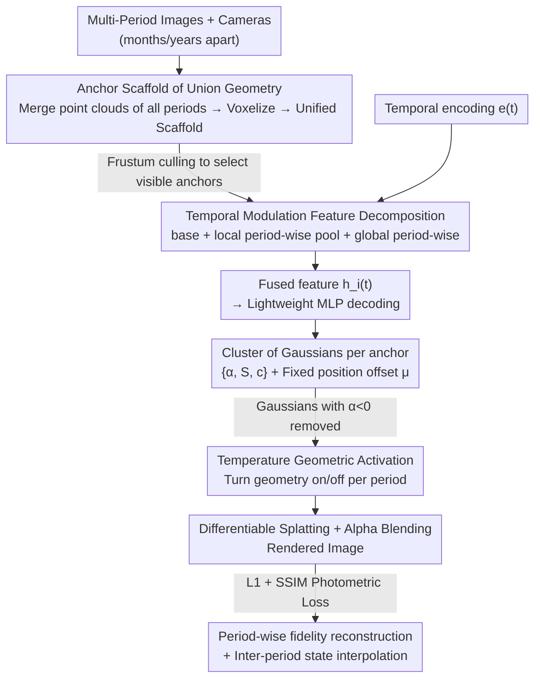

# ChronoGS: Disentangling Invariants and Changes in Multi-Period Scenes

**Conference**: CVPR 2026  
**Paper**: [CVF Open Access](https://openaccess.thecvf.com/content/CVPR2026/html/Wang_ChronoGS_Disentangling_Invariants_and_Changes_in_Multi-Period_Scenes_CVPR_2026_paper.html)  
**Code**: https://github.com/ZhongtaoWang/ChronoGS  
**Area**: 3D Vision  
**Keywords**: 3D Gaussian Splatting, Multi-Period Scene Reconstruction, Temporal Disentanglement, Anchor Scaffold, Geometric Activation

## TL;DR
ChronoGS uses a mechanism of "cross-period shared anchor scaffold + period-modulated features + opacity geometric activation" to unify the reconstruction of multi-period images captured months or years apart, which exhibit discontinuous changes in both geometry and appearance, into a single differentiable Gaussian model. This approach not only disentangles invariant structures from period-wise changes, but also comprehensively outperforms static, in-the-wild, and dynamic Gaussian baselines across 12 real-world and synthetic scenes.

## Background & Motivation

**Background**: 3D Gaussian Splatting (3DGS) and its anchored variant, Scaffold-GS, have achieved high-quality real-time reconstruction of static scenes. In-the-wild methods like NeRF-W / GS-W can handle lighting variations and transient occlusions, while dynamic methods such as 4DGS / Realtime4DGS can model scenes moving continuously over time.

**Limitations of Prior Work**: In reality, a vast amount of data is "multi-period" — cities are periodically re-scanned for mapping, construction sites are repeatedly surveyed to monitor progress, and disaster areas are revisited for damage assessment. These images are captured over the exact same spatial region but years apart. During these intervals, both appearance changes (seasons, illumination, construction cladding) and geometric changes (newly constructed/demolished buildings, vegetation growth) occur. None of the existing methods can directly handle this. Static/in-the-wild methods assume all viewpoints share a time-invariant geometry; training them on multi-period data leads to "temporal averaging" and ghosting artifacts. Dynamic methods assume smooth, continuous motion, causing them to hallucinate non-existent intermediate states when encountering non-continuous mutations spanning several years.

**Key Challenge**: Multi-period reconstruction is neither "static" (since geometry does change) nor "smoothly dynamic" (since changes are discrete jumps and discontinuous). Its essence lies in being **period-discrete and subject-shared** — the majority of spatial content remains invariant across periods, and changes are sparse and mutually independent. Because existing paradigms bet entirely on one extreme (either completely static or continuously dynamic), they cannot simultaneously represent a single consistent representation and flexible period-wise differences.

**Goal**: To decompose a scene into a shared canonical geometry and period-specific changes, and to model them separately within a unified differentiable framework, achieving cross-period consistency and period-wise fidelity.

**Key Insight**: The authors leverage a key observation of "disentangleability" — since most structures remain invariant across periods and changes are independent, rather than modeling continuous motion using timestamps, the scene is factorized into an "invariant base + period-wise modulation", allowing the model to learn which anchors should be activated for a given period.

**Core Idea**: A unified anchor scaffold covering the "geometric union" of all periods is used as the geometric backbone. Each anchor carries a time-invariant base feature and a pool of period-wise variant features, complemented by a global period-wise feature to model scene-level appearance. A geometry that should not appear in a specific period is "turned off" by setting its opacity to less than zero, thereby reconstructing non-continuous geometric and appearance changes within a single model.

## Method

### Overall Architecture
The input consists of multiple sets of images and camera parameters $\{(I^{(t)}_j, C^{(t)}_j)\}$ acquired during discrete periods $t=1\ldots T$ over the same spatial region. The output is a unified 3D representation capable of rendering period-consistent images at any period (or even interpolating between them). The overall framework follows the anchor paradigm of Scaffold-GS: the sparse point clouds from all periods are first merged and voxelized to initialize a unified anchor scaffold covering the "geometric union". During rendering, frustum culling is performed for a given camera to select visible anchors. Each anchor's features are decomposed into "invariant base + local period-wise pool + global period-wise" components, which are fused after modulation by a temporal encoding $e(t)$. A lightweight MLP decodes the fused features into a small cluster of Gaussians, and standard differentiable alpha-blended splatting is performed to render the image, supervised by photometric loss.

ChronoGS introduces three key modifications to this scaffold to make it "dynamic": the features of each anchor are split into three parts (invariant base, local period-wise pool, and global period-wise features) and fused after modulation by the temporal encoding $e(t)$. For the decoded Gaussians, the opacity is treated as a "geometric switch" — Gaussians with opacity less than zero are excluded from blending and backpropagation in that period, enabling period-wise geometric activation/deactivation. Meanwhile, the Gaussian position offsets are explicitly fixed to be cross-period invariant, constraining "geometric changes" to be expressed solely through visibility. The entire pipeline is as follows:

### Key Designs

**1. Unified Anchor Scaffold of Cross-Period Geometric Union: Replacing 'one model per period' with a single canonical backbone**

The first challenge in multi-period reconstruction is where to place the geometry: static methods squeeze everything into a time-invariant geometry, tangling structures from different periods (e.g., overlapping ghost buildings when training Scaffold-GS on all periods). Training a separate model for each period, on the other hand, wastes computational resources and storage, and loses the opportunity for periods to assist one another. ChronoGS addresses this by merging and voxelizing the sparse point clouds of all periods during initialization, creating a unified anchor scaffold that covers the "geometric union"—meaning the scaffold covers both stable geometry and period-specific changes from the very beginning. During training, only this single scaffold is optimized in a unified manner, rather than $T$ independent models. This strategy brings two major benefits: first, the scaffold serves as a shared cross-period geometric backbone, ensuring cross-period structural consistency; second, joint cross-period training serves as an implicit regularization for "cross-period invariant" regions—persistently existing anchors receive denser, complementary supervision from multiple periods, leading to sharper textures, more reliable geometry, and less overfitting to single-period noise. Tab. 2 shows that on the Overstreet scene, compared to the static baseline trained independently for three periods for 40k iterations each (totaling 120k iterations, 0.65GB storage), ChronoGS achieves higher PSNR across all periods with a single training run of 40k iterations (0.57GB storage).

**2. Three-Way Feature Disentanglement (Time-Invariant / Local Period-wise / Global Period-wise): Allowing invariants and variables to be managed separately**

After placing the geometry into the unified scaffold, the next issue is how to switch between "consistency" and "period-wise differences". ChronoGS allocates two sets of features to each anchor $a_i$ — a time-invariant base feature $f^{\text{base}}_i\in\mathbb{R}^{d_b}$ describing cross-period shared geometry and appearance, and a local period-wise variation feature pool $f^{\text{var}}_i=[f^{(1)}_i,\ldots,f^{(T)}_i]\in\mathbb{R}^{T\times d_v}$ storing period-specific information. Additionally, a global period-wise feature $g(t)\in\mathbb{R}^{T\times d_g}$ shared across all anchors is introduced to model scene-level appearance factors such as illumination and season. These three components are modulated by a temporal encoding and fused channel-wise:

$$h_i(t) = g(t)\odot e(t) + f^{\text{var}}_i(t)\odot e(t) + f^{\text{base}}_i$$

where the temporal encoding $e(t)$ utilizes one-hot base vectors for integer periods, and linearly interpolates adjacent period embeddings for intermediate temporal positions: $e(t)=(1-w)e_{\lfloor t\rfloor}+w\,e_{\lceil t\rceil},\ w=t-\lfloor t\rfloor$. This ensures that observed periods maintain precise encoding while enabling smooth transitions in-between. The significance of this decomposition lies in explicitly disentangling "invariant structure (base) / local variation (var) / global appearance (global)" to be learned independently. Ablations (Tab. 3) demonstrate that all three are indispensable: removing the base compromises geometric stability, removing var fails to represent local temporal changes, and removing global significantly degrades scene-level illumination and color consistency.

**3. Opacity Geometric Activation + Fixed Gaussian Offset: Translating 'abrupt geometric changes' into 'visibility switches'**

The most challenging aspect is non-continuous geometric changes — e.g., a building exists in one period but is demolished in the next. Rather than explicitly moving, adding, or deleting anchors, ChronoGS reduces geometric changes to a simple yet effective "visibility" problem. On one hand, each anchor explicitly stores $K$ **period-invariant** Gaussian center offsets $\{\Delta\mu_{ik}\}$, keeping the local spatial arrangement of Gaussians around each anchor fixed across periods (Gaussian center $\mu_{ik}=x_i+\Delta\mu_{ik}$), thereby stabilizing the local layout of geometry. On the other hand, during rendering, any decoded Gaussian with an opacity of $\alpha_{ik}(t)<0$ is directly excluded from alpha blending and gradient backpropagation. This effectively allows the model to automatically "turn off" geometry that is occluded or non-existent in a given period (Fig. 3). The synergy of these two components is elegant: because the spatial layout is fixed, "which geometric component appears in this period" is entirely controlled by a single learnable switch (opacity). Abrupt geometric changes no longer require moving points but only switching visibility, making the process stable and reliable. The scaffold thus acts as a "global geometric prior", dynamically activating relevant anchors for each period while maintaining structural consistency.

### Loss & Training
Supervision uses a hybrid photometric objective combining L1 and SSIM: $\mathcal{L}=\lambda\|\hat I-I\|_1+(1-\lambda)(1-\text{SSIM}(\hat I,I))$. Following Scaffold-GS, adaptive density control is employed: the accumulated gradient magnitudes of each anchor feature are tracked, and anchors with low gradients over time are pruned to eliminate redundancy. Meanwhile, the view-space position gradients of the Gaussians generated by each anchor are monitored, and new anchors are grown at corresponding 3D positions when a threshold is exceeded. Pruning and growing are triggered at fixed training intervals, progressively refining the scaffold to cover the "geometric union" while maintaining canonical consistency. In practice, $d_b=16,\ d_v=16,\ d_g=32$, with $K=10$ Gaussians decoded per anchor. All scenes are trained for 40k iterations.

## Key Experimental Results

### Main Results
Evaluated on the self-built ChronoScene dataset (12 scenes / 42 sub-scenes / 8,891 images, including 6 real-world and 6 synthetic scenes), comparing against 7 representative baselines. PSNR/SSIM/LPIPS are averaged across periods. The table below shows the Avg. columns for the real-world and synthetic scenes (ours in bold):

| Dataset | Method | Mem.↓ | PSNR↑ | SSIM↑ | LPIPS↓ |
|--------|------|-------|-------|-------|--------|
| Real Avg. | 3DGS | 1.01GB | 18.29 | 0.4658 | 0.4862 |
| Real Avg. | GS-W (in-the-wild) | 0.23GB | 20.33 | 0.4018 | 0.5638 |
| Real Avg. | 4DGS (Dynamic) | 0.18GB | 19.03 | 0.4674 | 0.6085 |
| Real Avg. | Realtime4DGS | 5.53GB | 20.91 | 0.5124 | 0.4943 |
| Real Avg. | **ChronoGS** | 0.52GB | **22.16** | **0.6533** | **0.3390** |
| Synth Avg. | 3DGS | 1.05GB | 20.79 | 0.7831 | 0.3179 |
| Synth Avg. | GS-W | 0.22GB | 25.11 | 0.7581 | 0.3754 |
| Synth Avg. | Realtime4DGS | 7.41GB | 22.29 | 0.7774 | 0.3351 |
| Synth Avg. | **ChronoGS** | 0.65GB | **28.80** | **0.8562** | **0.2509** |

ChronoGS ranks first across all three metrics (PSNR/SSIM/LPIPS) in both real-world and synthetic datasets while maintaining a compact GPU memory footprint (0.65GB for synthetic, far below Realtime4DGS's 7.41GB). GS-W is close in synthetic PSNR but significantly lags behind in SSIM/LPIPS, indicating it can handle appearance differences but fails to resolve abrupt geometric changes.

Joint training vs. independent period-wise training (Overstreet scene):

| Method | Training Scheme | PSNR↑ | Mem.↓ | Iters. |
|------|----------|-------|-------|--------|
| 3DGS | Indep. per period × 3 | 22.23 | 4.9GB | 120k |
| Scaffold-GS | Indep. per period × 3 | 21.87 | 0.65GB | 120k |
| ChronoGS | Unified joint training | **22.66** | **0.57GB** | **40k** |

### Ablation Study
Removing the three-way feature components one by one on the real-world Lawncourt / Canteen scenes (reporting the Lawncourt column):

| Configuration | PSNR↑ | SSIM↑ | LPIPS↓ | Description |
|------|-------|-------|--------|------|
| w/o Var.&Global. | 18.18 | 0.4609 | 0.4928 | Removing all temporal behavior, most significant degradation |
| w/o Base. | 21.60 | 0.6055 | 0.3918 | No shared base → unstable geometry |
| w/o Var. | 21.96 | 0.6440 | 0.3526 | No local period-wise features → local temporal changes distorted |
| w/o Global. | 22.11 | 0.6466 | 0.3497 | No global period-wise features → degraded scene-level illumination/color consistency |
| Ours (full) | **22.16** | **0.6533** | **0.3390** | Full model |

### Key Findings
- **Removing both local and global period-wise features simultaneously** (w/o Var.&Global.) results in the most severe drop (PSNR 22.16 → 18.18), illustrating that temporal modulation is the core driving force behind the model's ability to handle scene changes. Removing any single component causes only minor degradation, proving that the three components perform distinct, complementary roles without redundancy.
- **Joint training on a unified scaffold wins in both quality and cost**: Compared to static baselines trained independently per period, ChronoGS achieves higher PSNR with only 1/3 of the total iterations and lower GPU memory usage. This is a dividend of the implicit regularization where "invariant regions obtain denser, complementary cross-period supervision".
- **Dynamic baselines hallucinate intermediate states on non-continuous scenes**: Methods assuming smooth motion, like 4DGS, fabricate non-existent transition structures or leave residual contents from adjacent periods during inter-period interpolation. In contrast, ChronoGS cleanly switches between periods due to its period-discrete geometric activation (Fig. 7).

## Highlights & Insights
- **Reducing geometric mutation to an opacity switch**: Instead of explicitly moving or adding/deleting points, the model fixes the spatial layout of Gaussians and uses $\alpha < 0$ exclusion to determine the presence of geometry in each period. This mechanism is simple yet stably differentiable—representing an elegant transformation of a difficult "non-continuous geometric editing" task into "period-wise visibility learning".
- **The 'period-discrete, subject-shared' observation directly shapes the architecture**: Instead of treating multi-period data as a continuous 4D motion, the authors factorize it into "one canonical geometry + sparse independent variations". This framing naturally leads to the three-way base/var/global feature factorization.
- The **complementary cross-period supervision** enabled by a unified scaffold is a highly transferable insight: when multiple observations share most structures, joint optimization not only saves computation but also acts as an implicit regularizer to enhance the quality of invariant areas. This has migration value for tasks like incremental mapping and multi-visit scanning.
- The released **ChronoScene** benchmark (real-world intervals of one to three years, synthetic scenes based on controllable editing of Matrix City) fills the gap for test suites containing both geometric and appearance non-continuous evolution.

## Limitations & Future Work
- **Periods must be manually defined**: The authors categorize periods manually based on metadata or priors, assuming that intra-period changes are much smaller than inter-period changes. When the acquisition times are continuously or fuzzily distributed, and period boundaries are hard to define, whether the one-hot + adjacent interpolation temporal encoding remains appropriate is questionable.
- **Geometric changes rely entirely on opacity activation**: While highly effective for binary occlusion/appearance ("is there or not"), this approach may have limited expressiveness for continuous transitions (such as gradual collapse or slow vegetation growth) where fixed offsets and binary-like switches are insufficient.
- **Inter-period interpolation is 'plausible' rather than ground-truth constrained**: Although the model cleanly switches between periods, intermediate states lack real-world supervision, and the physical plausibility of synthesized transitional states lacks quantitative evaluation (the paper mainly relies on qualitative visualizations).
- Main results are concentrated on ChronoScene; generalization to external datasets like WAT / CL-Splat / NeuSC is only briefly covered in the supplementary material and not elaborated in the main text.

## Related Work & Insights
- **vs. Static / In-the-wild (3DGS, Scaffold-GS, GS-W, NeuSC)**: These methods assume a single time-invariant geometry, modeling at most image-wise appearance variations. Jointly training on multiple periods leads to geometric entanglement and ghosting. ChronoGS explicitly represents the geometric union with a unified scaffold and activates it period-by-period, enabling authentic reconstruction of different geometries per period, which prior methods cannot achieve.
- **vs. Dynamic (4DGS, Realtime4DGS, D-NeRF)**: These methods assume dense, smooth temporal motion and rely on precise masks/segmentation. When encountering non-continuous mutations across years, they hallucinate intermediate states. ChronoGS disentangles the representation period-by-period, accommodating abrupt changes while maintaining cross-period consistency.
- **vs. Long-term Evolution Modeling (temporal ordering/visualization/incremental update methods)**: Early works concentrated on timeline inference, historical photo visualization, or chronological incremental updates, often collapsing observations into a single state or assuming a fixed geometry. ChronoGS directly addresses "simultaneous non-continuous geometric and appearance changes" to learn a single time-modulated representation that is both cross-period consistent and period-wise faithful.

## Rating
- **Novelty**: ⭐⭐⭐⭐⭐ The first work to jointly handle non-continuous geometric and appearance changes in multi-period reconstruction within a unified differentiable Gaussian framework. The "opacity-as-geometric-switch" design is succinct and clever.
- **Experimental Thoroughness**: ⭐⭐⭐⭐ 12 scenes compared against 7 baselines + three-way feature ablations + joint vs. independent training comparisons are solid, though generalization on external datasets and quantitative evaluation of temporal interpolation are left to the supplementary material.
- **Writing Quality**: ⭐⭐⭐⭐⭐ The logic chain from "period-discrete, subject-shared" observation to factorization and three-way disentanglement is exceptionally clear, and Fig. 2/3 explain the mechanism intuitively.
- **Value**: ⭐⭐⭐⭐⭐ Concurrently provides both a strong baseline method and the open-source ChronoScene benchmark, laying a foundation for long-term scene understanding in urban rescanning, construction monitoring, and post-disaster assessment.

<!-- RELATED:START -->

## Related Papers

- [\[CVPR 2026\] Changes in Real Time: Online Scene Change Detection with Multi-View Fusion](changes_in_real_time_online_scene_change_detection_with_multi-view_fusion.md)
- [\[ICLR 2026\] GOLDILOCS: General Object-Level Detection and Labeling of Changes in Scenes](../../ICLR2026/3d_vision/goldilocs_general_object-level_detection_and_labeling_of_changes_in_scenes.md)
- [\[CVPR 2026\] 4DEquine: Disentangling Motion and Appearance for 4D Equine Reconstruction from Monocular Video](4dequine_disentangling_motion_and_appearance_for_4d_equine_reconstruction_from_m.md)
- [\[CVPR 2026\] Gaussian Mapping for Evolving Scenes](gaussian_mapping_for_evolving_scenes.md)
- [\[CVPR 2026\] LuxRemix: Lighting Decomposition and Remixing for Indoor Scenes](luxremix_lighting_decomposition_and_remixing_for_indoor_scenes.md)

<!-- RELATED:END -->
