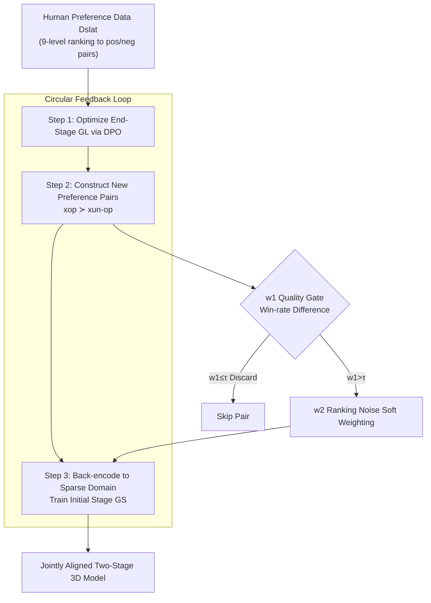

# Circular-DPO: Aligning Multi-Stage 3D Generative Models via Preference Feedback Loop

**Conference**: CVPR 2026  
**Paper**: [CVF Open Access](https://openaccess.thecvf.com/content/CVPR2026/html/Li_Circular-DPO_Aligning_Multi-Stage_3D_Generative_Models_via_Preference_Feedback_Loop_CVPR_2026_paper.html)  
**Code**: None (Not publicly available)  
**Area**: 3D Vision / RLHF Alignment / Diffusion Models  
**Keywords**: 3D Generation, Preference Alignment, DPO, Multi-Stage Pipeline, Trellis  

## TL;DR
Addressing multi-stage 3D generative models like Trellis—which "generate sparse structures first and then fill in local details"—this work utilizes a "data loop" to route preference signals generated after end-stage DPO alignment back to the initial stage, bypassing non-differentiable discretization. Combined with dual noise-filtering weights, it jointly aligns geometry and texture, achieving a 35.15% improvement in ImageReward and a 21.44% improvement in Reward3D over the Trellis baseline.

## Background & Motivation
**Background**: Current high-quality 3D generation typically follows a "multi-stage" route—decoupling geometric structure and texture details into different generation phases. Trellis, a representative 3D native method, is a typical two-stage process: The first stage uses a Rectified Flow Transformer $G_S$ to generate a sparse voxel structure $x_{sparse}$ outlining the object surface; the second stage uses a sparse convolution Transformer $G_L$ to generate structured latents $x_{slat}$ (encoding fine-grained geometry and texture) conditioned on that structure.

**Limitations of Prior Work**: 3D content generated by these models often fails to align with human aesthetic or functional preferences. The most natural fix is DPO alignment, but it can typically only be applied to the final output (Stage 2 $G_L$).

**Key Challenge**: **Non-differentiable operations** exist between the multiple stages. In Trellis, the first-stage output is a continuous feature grid that, after decoding, is discretized into a "set of active voxel indices" to serve as a condition for the second stage. This discretization and indexing process is non-differentiable, severing the computation graph. Consequently, gradients from the end-stage DPO **cannot propagate back to the initial stage** that determines the geometric skeleton. Performing DPO separately on each stage (stage-wise) leads to geometry-texture inconsistency (non-manifold geometry, loss of texture detail).

**Goal**: Propagate human preference signals from the final 3D asset **through** the non-differentiable pipeline back to the early stages to achieve joint alignment while resisting noise in preference data.

**Key Insight**: Since gradients cannot pass through, the authors **pass data instead of gradients**. The difference between results generated by the "aligned model vs. pre-alignment model" is explicitly constructed into new preference pairs, serving as a surrogate signal for the "non-backpropagatable gradient" to train the previous stage.

**Core Idea**: A "Preference Feedback Loop (Circular-DPO)"—align the end stage via DPO → sample new preference pairs using the models before and after optimization → back-encode these pairs into the sparse domain to train the initial stage—bridging the non-differentiable gap.

## Method

### Overall Architecture
This method performs post-training alignment on a pre-trained two-stage 3D generative pipeline (using Trellis as the backbone). The input is a human-ranked preference dataset $D_{slat}$, and the output is a two-stage model where geometry and texture are **jointly aligned** to human preferences.

The pipeline follows three steps, essentially forming a "data loop" to bypass non-differentiable points: first, perform DPO on the end-stage $G_L$; second, sample one asset each from the "optimized model" and the "original reference model" for the same prompt to form a new preference pair; third, back-encode these assets to the sparse domain to train the initial stage $G_S$. Between training steps, all preference pairs pass through a $w_1$ quality gate (hard filtering) and $w_2$ ranking noise soft weighting (re-weighting) before entering the DPO loss.

The approach is built upon the Flow-Matching version of DPO. Flow Matching learns a time-varying vector field $v_\theta(x,t)$ to transport a prior $p_0$ to the data distribution $p_1$. Conditional Flow Matching defines a path $x(t)=(1-t)x_0+tx_1$ via linear interpolation, measuring the gap between predicted and target vector fields using MSE at time $t$: $\text{MSE}_t(x_0,x_1;\theta)=\lVert v_\theta((1-t)x_0+tx_1,t)-(x_1-x_0)\rVert_2^2$. Flow-DPO proves that the log-likelihood ratio in the DPO objective can be approximated by this MSE, formulating alignment as a classification-style loss for preference pairs $x^w\succ x^l$. The paper adopts the following weighted general DPO loss (for any sub-dataset $D'$ and generator $G$):

$$\mathcal{L}_{DPO}(D';G)=-\mathbb{E}_{(x_0^w,x_1^w),(x_0^l,x_1^l)\sim D',\,t}\,\log\sigma\Big(\beta T w_2\big[\big(\text{MSE}_t(x_0^w,x_1^w;G_{ref})-\text{MSE}_t(x_0^w,x_1^w;G_{opt})\big)-\big(\text{MSE}_t(x_0^l,x_1^l;G_{ref})-\text{MSE}_t(x_0^l,x_1^l;G_{opt})\big)\big]\Big)$$

Intuitively, it increases the likelihood of winning samples relative to the reference model while decreasing that of losing samples, where $\beta$ is the DPO temperature. The three-step process applies this same loss to $G_L$ and $G_S$ using different data.

### Key Designs

**1. Circular Feedback Loop: Substituting "Gradients" with "Data" to Bridge Non-Differentiable Gaps**

This is the backbone of the paper, addressing the core challenge that end-stage DPO gradients cannot backpropagate. The loop consists of three steps:

- **Step 1: Optimize End Stage**: Perform DPO on the second-stage latent generator $G_L$ using pre-processed human preference data $D_{slat}$, i.e., $\min_{G_L}\mathcal{L}_{DPO}(D_{slat},G_L)$, yielding an optimized policy model $\theta_{opt}^{slat}$ directly aligned for final details.
- **Step 2: Construct New Preference Pairs**: For each prompt, sample an asset $x_{op}$ from the optimized model and $x_{un\text{-}op}$ from the reference model to form a new pair $(x_{op}, x_{un\text{-}op})$ where $x_{op}\succ x_{un\text{-}op}$. The **difference** between these assets encodes the preference direction between aligned and unaligned models, acting as a surrogate for the non-backpropagatable gradient.
- **Step 3: Guide Initial Stage**: These assets are VAE-decoded 3D models. To train the sparse structure model $G_S$, they must be **back-encoded into the sparse domain**—re-processed through the data preparation pipeline (voxelization + VAE encoding) to obtain $x_{sparse}$. Then, a DPO step $\min_{G_S}\mathcal{L}_{DPO}(\{(x_{op},x_{un\text{-}op})\},G_S)$ is performed for the first stage.

**Mechanism**: Preference signals no longer rely on a continuous gradient path but are "materialized" into data samples. By leveraging Trellis's inherent voxelization/encoding pipeline to move data back to the sparse domain, the discretization point becomes transparent. This ensures that geometric skeletons and texture details are updated toward the same preference direction, avoiding inconsistent stage-wise alignment.

**2. w1 Quality Gating: Filtering Unreliable Pairs via Global Win-rate Difference**

Both newly constructed and original preference pairs contain "inherent data noise" (low quality or mislabeled). A quality score is designed for **hard filtering**. For prompt $c$, $k$ assets are sampled from $\theta_{opt}^{slat}$ and $N-k$ from $\theta_{ref}^{slat}$. A pre-trained reward model $R_\phi(I_i,c)$ scores all $N$ candidates. The number of wins $C_i$ for each asset in pairwise comparisons is converted to a preference probability:

$$P(I_i)=\frac{2C_i}{N(N-1)}$$

Then $G_i=2P(I_i)-1$ is used to amplify the difference. The quality score for a pair $(I_{op},I_{un\text{-}op})$ is $w_1=G_{op}-G_{un\text{-}op}$. Higher $w_1$ indicates a more credible quality gap. Pairs with $w_1 \le \tau$ (with threshold $\tau=0$) are discarded, preventing "dirty" pairs where the winner is not significantly better from biasing the DPO.

**3. w2 Ranking Noise Soft Weighting: Weighting based on Reward Model Credibility**

Even after passing the $w_1$ gate, "ranking noise" (suspicious preference orders) may persist. A dynamic soft weight $w_2$ is introduced to **down-weight** these suspicious pairs without discarding them (to maintain data diversity). It is based on the log-likelihood of the preference pair under a reward model $r$:

$$h(c,x^w,x^l)=\log\sigma\big(r(c,x^w)-r(c,x^l)\big)$$

$$w_2(c,x^w,x^l)=\frac{\exp(h)}{\mathbb{E}_D[\exp(h)]}$$

This assigns higher weights to preference pairs that the reward model deems more likely to hold. The final loss applies DPO only to pairs passing the $w_1$ gate, weighted by $w_2$:

$$\mathcal{L}_{\text{Circular-DPO}}=\begin{cases}\mathcal{L}_{DPO} & \text{if } w_1>\tau\\[2pt]0 & \text{if } w_1\le\tau\end{cases}$$

## Loss & Training
- The unified loss follows the weighted Flow-DPO objective mentioned above.
- Preference data originates from DreamReward (1000 prompts, each with 9 ranked assets), forming pairs from high and low ranks.
- The method is **off-policy**, learning from a fixed dataset. The authors do not investigate multi-round performance, focusing on learning efficiency from static data.

## Key Experimental Results

Evaluation was conducted on 100 new prompts (30 from 3DRewardDB + 70 generated by Gemini $1.5$ Pro). Metrics include ImageReward (IR), HPSv2, Reward3D (R3D), and CLIP Score, alongside a 20-person user study.

### Main Results (Table 1, excerpt, ↑ is better)

| Method | IR↑ | HPSv2↑ | R3D↑ | CLIP↑ |
|:---|:---:|:---:|:---:|:---:|
| Trellis (Baseline) | -0.4596 | 0.1991 | -0.7137 | 0.3183 |
| **Ours-Trellis** | **-0.3146** | **0.2024** | **-0.5607** | **0.3290** |
| MVDream (Baseline) | -0.3948 | 0.2013 | -0.4292 | 0.3231 |
| **Ours-MVDream** | -0.3747 | **0.2030** | **-0.1047** | **0.3265** |
| DreamReward | -0.1930 | 0.1985 | 0.2733 | 0.3182 |
| DreamDPO | -0.3774 | 0.2013 | -0.1767 | 0.3234 |

On the Trellis backbone, Ours achieves a 35.15% IR gain and 21.44% R3D gain over the baseline. While consistently outperforming baselines, it **does not exceed score-distillation methods** (e.g., DreamReward).

### Ablation Study (Table 2)

| Configuration | IR↑ | R3D↑ | Description |
|:---|:---:|:---:|:---|
| (a) Full Circular-DPO | **-0.3146** | **-0.5607** | Full pipeline |
| (b) w/o-bridge | -0.3663 | -0.5969 | No cross-stage bridge (no loop) |
| (d) dpo-only s2 | -0.5512 | -0.7112 | End-stage only (Naive DPO) |
| (g) w/o-w1 | -0.3246 | -0.6199 | Without quality gating |
| (h) w/o-w2 | -0.4908 | -0.6661 | Without soft weighting |

Compared to separate stage-wise DPO, the full method improves IR by 14.11%, confirming that joint optimization via the loop is superior to stage-wise concatenation.

### Key Findings
- **Bridge is the primary contribution**: Removing the bridge (b) causes IR to drop from -0.3146 to -0.3663. Naive end-stage DPO (d) drops significantly to -0.5512, failing to provide substantial improvement—proving that geometry must be aligned alongside the final output.
- **$w_2$ is more critical than $w_1$**: Removing $w_2$ (h) causes IR to plummet to -0.4908. Soft weighting for ranking noise contributes far more to stability than hard quality gating.
- **User Study**: Approximately **69% of participants preferred the proposed method** over the baseline Trellis.

## Highlights & Insights
- **"Data substitutes Gradients"**: When faced with non-differentiable points, rather than forcing operations to be differentiable, this work materializes preference signals as "data differences" between model outputs. This paradigm is transferable to any multi-stage generation pipeline with sampling or discretization gaps.
- **Dual-stage noise treatment**: Decoupling preference data noise into quality and ranking components and treating them with hard gating ($w_1$) and soft weighting ($w_2$) provides a clean, reusable framework for cleaning preference data.
- **Self-bootstrapped Preference Pairs**: Using "optimized vs. original" model outputs for sampling saves annotation costs by transferring end-stage alignment gains to the initial stage automatically.

## Limitations & Future Work
- **Performance Ceiling**: The method still trails behind score-distillation-based routes (like DreamReward), and absolute IR/R3D scores remain negative, indicating limited alignment magnitude.
- **Off-policy Constraint**: The loop is only run for a single round; whether multi-round iterations would accumulate bias or continue to improve performance remains unexplored.
- **Dependency on Reward Models**: Both $w_1$ and $w_2$ rely heavily on pre-trained reward models; biases in those models will be amplified through the filtering process.
- **Architecture Coupling**: Step 3 depends on the reversible voxelization/encoding pipeline specific to Trellis-like architectures.

## Related Work & Insights
- **Vs. Naive Diffusion/Flow-DPO**: These only align final outputs; this work propagates preferences to early geometry stages.
- **Vs. Stage-wise Alignment**: Separate DPO on each stage causes geometry-texture inconsistency; this work forces both stages to update toward a consistent preference direction defined by the end-stage alignment.

## Rating
- Novelty: ⭐⭐⭐⭐ (Bridging non-differentiable gaps via data loops).
- Experimental Thoroughness: ⭐⭐⭐⭐ (Dual backbones + 8 ablation groups).
- Writing Quality: ⭐⭐⭐ (Clear logic, though some metric interpretations are broad).
- Value: ⭐⭐⭐⭐ (A reusable framework for multi-stage preference alignment).

<!-- RELATED:START -->

## Related Papers

- [\[CVPR 2026\] GenMatter: Perceiving Physical Objects with Generative Matter Models](genmatter_perceiving_physical_objects_with_generative_matter_models.md)
- [\[CVPR 2026\] Aligning Text, Images and 3D Structure Token-by-Token](aligning_text_images_and_3d_structure_token-by-token.md)
- [\[CVPR 2026\] Generative Diffusion Priors for 3D Mapping of the Dark Universe](generative_diffusion_priors_for_3d_mapping_of_the_dark_universe.md)
- [\[ICCV 2025\] DSO: Aligning 3D Generators with Simulation Feedback for Physical Soundness](../../ICCV2025/3d_vision/dso_aligning_3d_generators_with_simulation_feedback_for_physical_soundness.md)
- [\[CVPR 2026\] LoST: Level of Semantics Tokenization for 3D Shapes](lost_level_of_semantics_tokenization_for_3d_shapes.md)

<!-- RELATED:END -->
