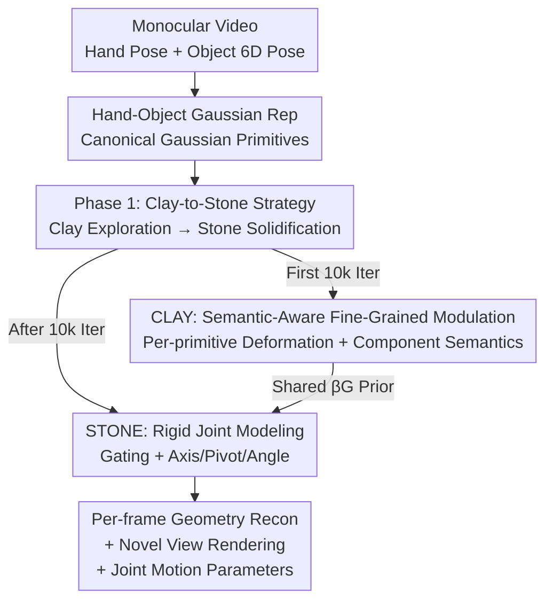

# Clay-to-Stone: Phase-wise 3D Gaussian Splatting for Monocular Articulated Hand-Object Manipulation Modeling

**Conference**: CVPR 2026  
**Paper**: [CVF Open Access](https://openaccess.thecvf.com/content/CVPR2026/html/Liu_Clay-to-Stone_Phase-wise_3D_Gaussian_Splatting_for_Monocular_Articulated_Hand_Object_Manipulation_CVPR_2026_paper.html)  
**Code**: https://github.com/ru1ven/ARGS  
**Area**: 3D Vision  
**Keywords**: Hand-Object Interaction, Articulated Object Modeling, 3D Gaussian Splatting, Monocular Reconstruction, Phase-wise Optimization  

## TL;DR
To address the unstable optimization caused by the strong coupling of "geometry" and "articulated motion" in monocular video, this paper proposes the Clay-to-Stone dual-phase 3DGS framework. It first utilizes a "soft clay" phase (CLAY) for fine-grained, semantic-aware free deformation to explore structure and motion, followed by a "stone" phase (STONE) that imposes rigid constraints and explicitly estimates axes, pivots, and joint angles. This approach achieves SOTA geometric reconstruction and realistic rendering on the ARCTIC articulated object dataset.

## Background & Motivation
**Background**: Reconstructing hand-object interaction from monocular RGB video is a core capability for AR/VR and specialized robotics. Recent methods like HOLD and BIGS use NeRF or 3DGS to reconstruct hands and objects realistically, with 3DGS offering efficiency through explicit geometric representation.

**Limitations of Prior Work**: Almost all existing methods assume a "rigid grasp + static object geometry." However, many daily objects are articulated bodies with hinges—flip phones, container lids, scissors, and laptops. Once an object's joints rotate or components deform during manipulation, these static assumptions fail. Another line of research (non-rigid deformation methods for human clothing) can model dynamic shapes but is "human-centric," relying on pre-defined skeletons and "visually similar surface fitting" to drive local deformation. These methods struggle to distinguish the semantic/functional roles of "which parts should move and which should not," leading to entangled deformations across different components.

**Key Challenge**: Under monocular observation, an object's **intrinsic geometry** and **dynamic articulated motion** are mutually confounding. Visual changes from motion amplify shape ambiguity, while motion cannot be reliably estimated if the shape is not well-constructed. Simultaneously optimizing geometry and joints from the start while imposing premature rigid constraints makes the optimization ambiguous and unstable, suppressing the exploration of complex structures.

**Goal**: Recover (i) high-fidelity per-frame geometry and (ii) physically plausible articulated structures and motion parameters (axes, pivots, per-frame angles) under the condition of monocular video with unknown joint parameters.

**Key Insight**: Since geometry and motion are entangled, the authors argue against **joint rigid modeling from the beginning**. Instead, modeling should proceed in "phases with increasing granularity"—first discovering motion patterns heuristically through data-driven visual/semantic consistency at a relaxed granularity, and then solidifying the structure and explicitly solving for parameters once semantic and motion priors emerge. This corresponds to the metaphor of "shaping clay → solidifying into stone."

**Core Idea**: A phase-wise 3DGS framework that gradually tightens modeling granularity from "soft, distributed free deformation" to "clear, rigid component structures" to decouple the geometry-motion entanglement.

## Method

### Overall Architecture
The input is a monocular RGB manipulation video with known MANO hand poses and object 6-DoF poses (joint parameters are unknown). The output includes per-frame geometric reconstruction, realistic novel-view rendering, and articulated motion parameters. Both the hand and object are represented by 3D Gaussian primitives in canonical space: $\{\mathcal{G}_l\}$, $\{\mathcal{G}_r\}$ for left/right hands and $\{\mathcal{G}_o\}$ for the object. Each Gaussian is parameterized by mean $\mu$ and covariance $\Sigma=\mathbf{R}\mathbf{S}\mathbf{S}^\top\mathbf{R}^\top$. Final pixel colors are computed via alpha blending of all Gaussians ordered by depth: $C=\sum_{i\in\mathcal{N}_\text{ho}}\mathbf{c}_i\alpha_i\prod_{j=1}^{i-1}(1-\alpha_j)$. The hand uses Linear Blend Skinning (LBS) to transform from canonical to posed states, while the object uses rigid 6D transformations.

The essence of the pipeline lies in the "two phases sharing the same set of Gaussians": the first 10,000 iterations constitute the CLAY phase, allowing object Gaussians to perform fine-grained, semantic-aware free deformation to explore "what is moving and how" based on 2D photometric and semantic consistency. After 10,000 iterations, the STONE phase is activated, solidifying the learned semantic/motion priors into a rigid articulated structure and explicitly regressing axes, pivots, and per-frame angles. Both phases are linked by a globally shared modulation factor $\beta_\mathcal{G}$—it modulates deformation magnitude and encodes component semantic scores in CLAY, and is converted into a "motion eligibility" gating signal in STONE.

### Key Designs

**1. Clay-to-Stone Strategy: Decoupling Geometry-Motion Entanglement via Progressive Modeling Granularity**

This is the core of the paper, directly addressing the pain point that simultaneous rigid optimization is ambiguous and unstable. The authors split the modeling process into two granularity-progressive phases: the CLAY phase ("Clay") allows Gaussians to deform freely at a relaxed granularity, heuristically exploring local shapes and motion patterns based on visual consistency **without imposing pre-defined joint rules**. This prevents the optimization from locking into incorrect structures prematurely. Once semantic and motion priors emerge, the STONE phase ("Stone") imposes rigid constraints, solidifying flexible deformations into physically plausible articulated structures and explicitly solving for parameters. Implementation-wise, iteration steps serve as phase switching points. The necessity of this sequence is proven by ablations where "rigid constraints from the start" (w/o Clay) failed to produce reasonable joints.

**2. CLAY Phase—Per-primitive Modulation + Semantic Consistency: Deforming Each Gaussian by "Semantic Role"**

CLAY addresses the issue where non-rigid deformation methods fail to distinguish component semantics, mixing moving and static parts. The authors associate each object Gaussian with a learnable modulation factor $\beta\in\mathbb{R}$, forming $\beta_\mathcal{G}\in\mathbb{R}^N$ for all $N$ Gaussians. It serves two roles: modulating the deformation magnitude of each Gaussian relative to the canonical state and encoding component-level semantic scores. The deformation encoding is "pixel-aligned": visual features $\mathbf{I}_\mathcal{F}^t$ are extracted using a pre-trained ViT, 3D Gaussian points are projected to 2D to sample $\mathbf{I}_\mathcal{F}^t(\pi(\mathbf{x}))$, and fed into an MLP alongside multi-resolution hash-grid features $\mathbf{h}$ to obtain latent deformation codes:

$$\mathbf{Z}_t = \text{MLP}\big(\mathbf{I}_\mathcal{F}^t(\pi(\mathbf{x})),\ \mathbf{h}\big),$$

The modulation factor then acts element-wise to produce semantic-aware deformations: $(\delta\mathbf{x}_t,\delta\mathbf{s}_t,\delta\mathbf{q}_t,\delta\mathbf{c}_t)=\text{sigmoid}(\beta_\mathcal{G})\cdot\mathbf{Z}_t$. Crucially, while $\mathbf{Z}_t$ is calculated independently per frame, $\beta_\mathcal{G}$ is **globally shared across frames**, forcing temporal consistency where the same component deforms consistently across the sequence. To align $\beta_\mathcal{G}$ with real 3D semantics, two supervisions are added: photometric consistency (higher weights to areas with large pixel deviations, corresponding to "deforming" parts) and component-level semantic consistency (rendering part masks $M_\text{part}^t$ from $\beta_\mathcal{G}$ using Gumbel sigmoid and aligning them with SAM2 2D segmentations).

**3. STONE Phase—Rigid Gating + Joint Parameter Estimation: "Stone-ifying" Free Deformation into Interpretable Motion**

Free deformations in CLAY, while visually plausible, do not capture the constrained mechanical motion required for functional interaction. The first step of STONE is **rigid gating**: $\beta_\mathcal{G}$ is reused via Gumbel sigmoid to obtain a motion eligibility signal $\mathbf{e}=g(\beta_\mathcal{G})$, which determines the degree of motion allowed for each Gaussian, ensuring only semantically valid movable regions participate in joint motion. The second step is **joint parameter estimation**: focusing on revolute joints, the paper uses a 3D axis $\mathbf{l}$ ($\|\mathbf{l}\|=1$), a pivot point $\mathbf{p}$, and per-frame angles $\theta_t$. Since the pivot and axis are intrinsic to geometry and invariant across manipulation, they are regressed from spatial distributions (hash-grid features): the pivot is a weighted sum of Gaussian positions $\mathbf{p}=\sum_i w_i\mathbf{x}_i$ where weights come from $\text{softmax}(\text{MLP}_\text{pivot}(\mathbf{h}_i))$, and the axis is normalized from $\text{MLP}_\text{axis}$ applied to average features. Per-frame angles reflect instantaneous states, computed using CLAY's $\mathbf{Z}_t$, the gating signal $\mathbf{e}$, and a learnable temporal embedding $\phi_t$:

$$\mathbf{v}_t=\text{MLP}_\text{angle}(\mathbf{e}\cdot\mathbf{Z}_t,\ \phi_t),\qquad \theta_t=\arctan2(\mathbf{v}_{t,y},\mathbf{v}_{t,x}).$$

Once the revolute joint is accurately inferred, joint parameters and Gaussian attributes are **jointly optimized**, allowing motion and geometry to reinforce and refine each other.

### Loss & Training
The total objective applies photometric, semantic, and temporal consistency on alpha-blended renderings: photometric losses include $L1$ color loss $\mathcal{L}_\text{RGB}$, mask opacity loss $\mathcal{L}_\text{mask}$, and perceptual loss $\mathcal{L}_\text{perc}$ (LPIPS via AlexNet). Semantic consistency uses $\mathcal{L}_M=\|M_\text{part}-\hat{M}\|_1$ to align with SAM2 segments, paired with $\mathcal{L}_\text{reg}=\|\beta_\mathcal{G}\|_2^2$ to suppress unnecessary deformation and as-isometric-as-possible constraints ($\mathcal{L}_\text{iso-pos}$, $\mathcal{L}_\text{iso-cov}$) to maintain local rigidity. Temporal consistency is enforced via velocity and acceleration regularization $\mathcal{L}_t$ on angles. Each sequence takes 25,000 iterations (~3 hours on RTX 4090), with STONE activated after 10,000.

## Key Experimental Results

### Main Results
Evaluated on the ARCTIC dual-hand manipulation dataset (11 articulated objects, View 1 for training / View 8 for novel-view evaluation). Geometry metrics: Chamfer Distance (CD, $cm^2$ with ICP alignment) and F-score@5mm/10mm. Rendering: PSNR/SSIM/LPIPS ($\times 1000$). Averaged results across 11 objects:

| Task | Metric | 3DGS-Avatar | w/o CLAY | w/o STONE | Ours |
|------|------|-------------|----------|-----------|------|
| Geometry Recon | CD ↓ | 3.83 | 4.22 | 2.82 | **1.97** |
| Geometry Recon | F@5 ↑ | 0.677 | 0.663 | 0.680 | **0.741** |
| Geometry Recon | F@10 ↑ | 0.831 | 0.819 | 0.848 | **0.884** |
| Rendering | PSNR ↑ | 27.51 | 27.63 | 27.77 | **28.17** |
| Rendering | SSIM ↑ | 0.9584 | 0.9600 | 0.9597 | **0.9606** |
| Rendering | LPIPS ↓ | 39.13 | 37.88 | 37.46 | **35.43** |

Comparison with rigid-grasp baselines (on 9 objects, excluding small ones like scissors):

| Method | CD ↓ | F@5 ↑ | F@10 ↑ |
|------|------|-------|--------|
| HOLD | 2.07 | 0.371 | 0.639 |
| BIGS | 1.28 | - | 0.839 |
| Ours - canonical | **0.79** | **0.783** | **0.915** |
| Ours - articulated (per-frame) | 2.32 | 0.703 | 0.869 |

*Note: Articulated CD (2.32) increases at extreme joint angles due to spatial sensitivity, but F-scores remain high, indicating robust overall quality.*

### Ablation Study
Module-level ablation (average rendering metrics for box, notebook, and waffle iron):

| Configuration | PSNR ↑ | SSIM ↑ | LPIPS ↓ | Description |
|------|--------|--------|---------|------|
| w/o Modulation $\beta_\mathcal{G}$ | 26.73 | 0.9652 | 34.41 | Largest drop; semantic modulation is core |
| w/o Visual Embedding $\mathbf{I}_\mathcal{F}$ | 28.32 | 0.9660 | 33.18 | Primarily affects perceptual quality |
| w/o Mask Loss $\mathcal{L}_M$ | 27.76 | 0.9659 | 31.95 | SAM2 maintains semantic consistency |
| w/o Temporal Loss $\mathcal{L}_t$ | 28.48 | 0.9665 | 29.44 | Slightly lower smoothness |
| Full Model | **28.57** | **0.9666** | **29.09** | — |

### Key Findings
- **Both phases are essential, and the order matters**: Using only CLAY looks good in the training view but shows texture distortion in novel views due to lack of physical constraints. Imposing rigid constraints from the start (w/o CLAY) fails to establish a reasonable joint structure.
- **Modulation factor $\beta_\mathcal{G}$ is the largest contributor**: Removing it causes PSNR to drop from 28.57 to 26.73, proving that per-primitive semantic modulation and SAM2 supervision are critical for maintaining semantic consistency in deformable regions.
- **Failure Cases**: When parts have similar colors or are occluded, axis estimation may fail (e.g., misjudging a flip lid as sliding). Severe hand occlusion can lead to local angle errors.

## Highlights & Insights
- **The "Clay-to-Stone" metaphor provides an intuitive curriculum optimization**: Allowing structures to emerge in a soft granularity before solidifying uses "delayed rigid constraints" to gain stability. This approach can adapt to any reconstruction problem where geometry and motion are strongly coupled.
- **The shared $\beta_\mathcal{G}$ is a brilliant design**: The same set of globally shared factors serves as "deformation magnitude + semantic score" in CLAY and "motion eligibility gating" in STONE, naturally binding semantic discovery to rigid gating without extra part-segmentation networks.
- **Using SAM2's 2D segmentation for 3D Gaussian semantics is a reusable trick**: Rendering $\beta_\mathcal{G}$ to a 2D mask and aligning it with SAM2 "distills" powerful 2D foundation model priors into 3D part semantics.
- **Decoupling joint parameters**: Regressing pivots/axes (intrinsic and invariant) from spatial distributions while regressing angles (instantaneous) from deformation codes makes effective use of revolute joint physics.

## Limitations & Future Work
- The method targets "interaction-centric, simple articulated structures (one revolute joint)," and is **not yet applicable to complex multi-part objects** or new instance generation.
- It relies on known MANO hand poses and 6-DoF object poses for initialization. The impact of pose estimation errors is not fully quantified.
- Evaluation is limited to 11 objects and a single subject in ARCTIC; diversity in categories and subjects is restricted. Only revolute joints are modeled, excluding prismatic or other types.
- Training takes ~3 hours per sequence, which is far from real-time applications.

## Related Work & Insights
- **vs HOLD / BIGS (Hand-held object reconstruction)**: These assume rigid grasps and static geometry. This paper trains on sequences with continuous joint changes, outperforming them in canonical reconstruction (CD 0.79 vs 2.07 / 1.28).
- **vs 3DGS-Avatar (Non-rigid human deformation)**: Avatar models act as human-centric surface fitting and cannot distinguish component semantics. This paper uses per-primitive modulation and SAM2 to explicitly separate movable and static parts, resulting in superior geometry and rendering.
- **vs PARIS / ArticulatedGS / VideoArtGS**: These often require multi-view data, discrete joint configurations (fully open/closed), or static canonical reference frames. This paper handles monocular, continuous manipulation without needing a static reference frame.

## Rating
- Novelty: ⭐⭐⭐⭐⭐ "Clay-to-Stone" progressive granularity + single modulation factor linking semantic discovery and rigid gating is a clever solution for monocular articulated modeling.
- Experimental Thoroughness: ⭐⭐⭐⭐ Comprehensive metrics and baselines on ARCTIC, though limited to one dataset and simple joints.
- Writing Quality: ⭐⭐⭐⭐⭐ Clear motivation (geometry-motion coupling → phase-wise) and memorable metaphors.
- Value: ⭐⭐⭐⭐ Advances articulated object reconstruction from multi-view/static settings to monocular/continuous manipulation, directly benefiting AR/VR and robotics.

<!-- RELATED:START -->

## Related Papers

- [\[CVPR 2026\] FreeArtGS: Articulated Gaussian Splatting Under Free-Moving Scenario](freeartgs_articulated_gaussian_splatting_under_free-moving_scenario.md)
- [\[CVPR 2026\] MonoSAOD: Monocular 3D Object Detection with Sparsely Annotated Label](monosaod_monocular_3d_object_detection_with_sparsely_annotated_label.md)
- [\[CVPR 2026\] eRetinexGS: Retinex Modeling for Low-Light Scene Enhancement via Event Streams and 3D Gaussian Splatting](eretinexgs_retinex_modeling_for_low-light_scene_enhancement_via_event_streams_an.md)
- [\[CVPR 2026\] MD2E: Modeling Depth-to-Edge Cues for Monocular Metric Depth Estimation](md2e_modeling_depth-to-edge_cues_for_monocular_metric_depth_estimation.md)
- [\[CVPR 2026\] GP-4DGS: Probabilistic 4D Gaussian Splatting from Monocular Video via Variational Gaussian Processes](gp-4dgs_probabilistic_4d_gaussian_splatting_from_monocular_video_via_variational.md)

<!-- RELATED:END -->
