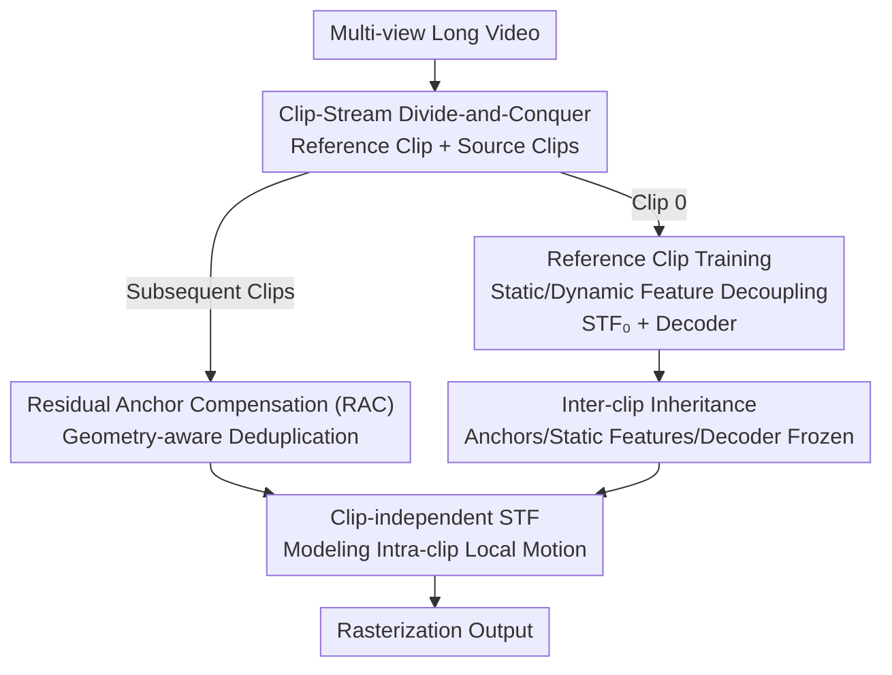

# ClipGStream: Clip-Stream Gaussian Splatting for Any Length and Any Motion Multi-View Dynamic Scene Reconstruction

**Conference**: CVPR2026  
**arXiv**: [2604.13746](https://arxiv.org/abs/2604.13746)  
**Code**: Project Page https://liangjie1999.github.io/ClipGStreamWeb/ (Available)  
**Area**: 3D Vision / Dynamic Gaussian Splatting  
**Keywords**: Dynamic scene reconstruction, Gaussian Splatting, long sequences, large motion, temporal consistency

## TL;DR
ClipGStream partitions dynamic videos into several clips and employs a "Clip-Stream" hybrid paradigm, where a "Reference Clip" establishes the base and "Source Clips" perform incremental training on that base. This approach preserves the intra-clip temporal stability of Clip-based methods while inheriting the scalability of Frame-Stream methods, achieving flicker-free, low-memory, SOTA dynamic Gaussian reconstruction on 1400-frame sequences with significant motion.

## Background & Motivation
**Background**: Multi-view dynamic scene reconstruction (for volumetric video in VR/MR/XR) is currently dominated by dynamic Gaussian Splatting, split into two main paradigms: Frame-Stream methods which optimize frame-by-frame (e.g., 3DGStream using Neural Transformation Cache for inter-frame motion) and Clip methods which jointly optimize a segment of ~300 frames as a whole (e.g., 4DGS, SpaceTimeGS).

**Limitations of Prior Work**: Frame-Stream methods can scale to ultra-long sequences, but independent frame-by-frame optimization accumulates errors and causes inter-frame jitter. Clip methods provide intra-clip temporal consistency, but "optimizing all frames simultaneously" incurs massive memory and compute overhead, limiting sequence length. Furthermore, both types struggle with large, rapid motions, often failing in scenarios like basketball games.

**Key Challenge**: There is a trade-off between scalability (frame-by-frame/streaming) and temporal consistency (joint optimization). Existing Clip methods have an implicit hard constraint $M=N$ (clip length must equal total sequence length); once forced to segment into multiple small clips where $M<N$, significant flicker occurs at the boundaries between clips.

**Goal**: Extend dynamic reconstruction to sequences of arbitrary length and motion magnitude without sacrificing temporal consistency, while keeping memory overhead low.

**Key Insight**: Temporal consistency actually only needs to be guaranteed "within a clip," whereas "cross-clip" consistency can be anchored by sharing and freezing a stable set of static structures (anchors, static features, decoders). Motion, as a locally and drastically changing variable, should be fitted independently by each clip.

**Core Idea**: Replace "Frame-level Streaming" with "Clip-level Streaming" (Clip-Stream). The first clip (Reference Clip) is fully optimized to create a stable base. Subsequent clips (Source Clips) inherit this frozen base and only learn residual anchors and independent intra-clip motion fields, effectively merging the stability of Clip methods with the scalability of Streaming methods.

## Method

### Overall Architecture
ClipGStream uniformly partitions a long video into $N$ clips, each containing $M$ multi-view frames. The 0-th clip is the **Reference Clip**, while the others $\text{Clip}_{n\in[1,N-1]}$ are **Source Clips**. The overall process consists of two stages: in the Reference Clip stage, the scene is represented as a set of ScaffoldGS-style anchors, where each anchor carries a static feature $f_s\in\mathbb{R}^{64}$ and a dynamic feature $f_d\in\mathbb{R}^{64}$ produced by a Spatio-Temporal Field (STF). These are concatenated and passed through a decoder $d(\cdot)$ to generate Temporal Gaussians for rasterization. In the Source Clip stage, the anchors, static features, and decoder from the reference clip are inherited and frozen. Only "Residual Anchor Compensation" is used to add new or displaced structures, and an independent STF is trained specifically for that clip to model local motion.

The decoupling of static and dynamic features is the prerequisite for this inheritance strategy: experiments (Fig.3) show that $f_s$ learns all background information (thus sharing it cross-clip ensures consistency), while $f_d$ learns residual information controlling the visibility of dynamic content (thus it must be clip-independent).

### Key Designs

**1. Clip-Stream Hybrid Paradigm: Base Building via Reference and Increment via Source**

To address the fundamental trade-off between "scalability vs. temporal consistency," the authors shift from frame-wise streaming to clip-wise streaming. After partitioning the sequence into $N$ clips, $\text{Clip}_0$ is fully optimized into a stable spatio-temporal base. Each subsequent $\text{Clip}_n$ is trained incrementally on top of this pre-trained reference representation. This allows the model to enjoy the stability of joint optimization within a clip, while scaling one clip after another like Frame-Stream methods for arbitrary lengths. Crucially, it breaks the $M=N$ constraint of old Clip methods: now $M$ (clip length) can be much smaller than $N$ (total frames), and cross-clip consistency is guaranteed by the inheritance strategy rather than joint optimization, avoiding the flicker issues seen in LocalDyGS when $M<N$.

**2. Residual Anchor Compensation (RAC): Geometry-aware Deduplication for New Structures**

Large motions introduce new objects or large displacements of existing anchors, which deformation fields cannot capture accurately. Simply adding all anchors $A^c_n$ reconstructed by COLMAP for the current clip would cause heavy redundancy with the reference anchors $A_0$. RAC calculates the residual: $A_n = A_0 \cup \text{Dedup}(A^c_n, A_0)$. Deduplication is "geometry-aware": each anchor $p$ in $A_0$ is treated as a sphere with a radius $r$ equal to the average Euclidean distance to its three nearest neighbors $r=\frac{1}{3}\sum_{i=1}^{3}\lVert p_i - p\rVert_2$. These spheres form a "coverage field" describing the already represented space. For each candidate anchor $q\in A^c_n$, its signed distance to this coverage surface is calculated; it is only kept as a residual anchor if $\text{SDF}(q)>0$ (falling outside the coverage spheres). This adds new structures from fast motion while preventing anchor explosion and suppressing flicker by removing redundant static anchors.

**3. Clip-independent STF: Per-clip Motion Fields to Avoid Overwriting**

Dynamic features $f_{d}$ vary significantly between clips. If all clips shared a single $\text{STF}_0$, subsequent clips would "overwrite" previously learned motions. Thus, the authors assign an independent spatio-temporal field $\text{STF}_1,\dots,\text{STF}_{N-1}$ to each clip, implemented as a 4D hash grid $h_n$ followed by a fully-fused MLP. It outputs dynamic features $f_{d,n}=\phi_n(h_n(\mu_n, t))$ for anchor $\mu_n$ at time $t$. This clip-specific design localizes motion modeling, preventing interference while maintaining coherence across long sequences. Ablations (Tab.6) show this is critical: fully independent training (no static sharing) yields 21.85 PSNR, a single shared STF yields 23.11, while "Clip-independent STF + Static Inheritance" reaches 24.54.

**4. Inter-clip Inheritance: Locking Consistency via Frozen Anchors and Decoders**

If each source clip re-initialized anchors and decoders, cross-clip representations would be inconsistent, leading to jitter in static areas and degraded rendering in dynamic ones. The authors propose a static inheritance strategy: source clips directly inherit the reference clip's anchors $A_0$, static features $f_{s,0}$, and decoder $d$, keeping them **frozen** during subsequent training. Static features for a new clip only append a learnable residual component associated with the residual anchors $A^r_n$: $f_{s,n}=[f_{s,0}; f^r_{s,n}]$. Reusing the same decoder $d$ ensures consistent decoding of geometric and appearance attributes across all clips. It consists of Anchor Inheritance (AI) to prevent local re-optimization and Decoder Inheritance (DI) for cross-clip consistency.

### Loss & Training
The objective adds a lightweight volume regularization $L_v=\sum_{i=1}^{M}\text{Prod}(s^i_t)$ (to constrain each Temporal Gaussian to a local region, where $s^i_t$ is the scale at time $t$) to the standard 3DGS $L_1$ and structural similarity $L_{\text{SIM}}$ losses:

$$L = (1-\lambda_{\text{SIM}})L_1 + \lambda_{\text{SIM}}L_{\text{SIM}} + \lambda_v L_v$$

All MLPs are two-layer ReLUs, with dynamic/static feature dimensions of 64, optimized via Adam. An implementation detail: the learning rate scheduler is **re-initialized** at the start of each clip rather than inheriting from the reference clip, preventing the learning rate from becoming too small for effective optimization in later clips.

## Key Experimental Results

### Main Results
Long 360 (1400 frames, 36 cameras, 4K basketball scene; static method tested on frame 0 only):

| Category | Method | PSNR↑ | DSSIM₁↓ | DSSIM₂↓ | LPIPS↓ |
|------|------|-------|---------|---------|--------|
| Static | 3DGS | 24.13 | 0.087 | 0.040 | 0.159 |
| Frame-Stream | 3DGStream | 21.94 | 0.105 | 0.053 | 0.200 |
| Clip | LocalDyGS | 23.11 | 0.093 | 0.046 | 0.178 |
| Clip-Stream | **ClipGStream** | **24.54** | **0.079** | **0.036** | **0.146** |

ClipGStream is the only method to outperform static 3DGS (24.13) on dynamic sequences, exceeding the best Clip method LocalDyGS (23.11) by 1.43 dB.

N3DV (five 300-frame scenes) balancing quality and efficiency:

| Method | PSNR↑ | FPS↑ | Training Time↓ | Model Size↓ |
|------|-------|------|-----------|-----------|
| 3DGStream | 31.67 | 215 | 1.0h | 1230MB |
| SpaceTimeGS | 32.05 | 140 | >5h | 200MB |
| LocalDyGS | 32.28 | 105 | 0.58h | 100MB |
| **ClipGStream** | **32.53** | 106 | **0.5h** | **98MB** |

It achieves the highest PSNR (32.53) with the shortest training time (0.5h) and smallest model size (98MB). On Flame Salmon (1200 frames), it achieves 29.40 PSNR / 0.144 LPIPS, surpassing 4DGaussian (28.89 / 0.196).

### Ablation Study
Module breakdown on Long 360 (PSNR / LPIPS):

| Configuration | PSNR↑ | LPIPS↓ | Notes |
|------|-------|--------|------|
| Ours (Full) | 24.54 | 0.146 | Full model |
| w/o DI (Decoder Inheritance) | 24.34 | 0.152 | Dynamic regions blur without DI |
| w/o RAC (Residual Anchor Comp.) | 23.62 | 0.160 | Largest drop; large motion modeling fails |

Comparison of clip training strategies:

| Configuration | PSNR↑ | DSSIM₁↓ | LPIPS↓ |
|------|-------|---------|--------|
| Fully Independent Training | 21.85 | 0.142 | 0.316 |
| Shared Single STF | 23.11 | 0.093 | 0.178 |
| Ours | **24.54** | **0.079** | **0.146** |

### Key Findings
- **RAC is the largest contributor**: Removing RAC drops PSNR from 24.54 to 23.62 (-0.92 dB), proving that residual anchor compensation is core to processing large motions and recovering new structures.
- **The partitioning strategy itself is more critical than single modules**: Fully independent training (no inter-clip inheritance) results in a PSNR of only 21.85 (2.69 dB lower than the full model), validating the decoupling of "static inheritance + clip-independent STF."
- **Breaking the $M=N$ constraint**: Fig.9 shows that while LocalDyGS exhibits inter-clip inconsistencies or training failures when partitioning 1400 frames into 140 clips, ClipGStream remains flicker-free even when $M<N$.
- **Efficiency does not come at the cost of quality**: Achieving Pareto optimality in PSNR, training time, and model size on N3DV is a result of freezing the base and only training local residuals/motion.

## Highlights & Insights
- **The "Clip-level Streaming" abstraction is ingenious**: It precisely segments the responsibility for temporal consistency—intra-clip is handled by joint optimization, and inter-clip is handled by "freezing a stable static base," bypassing both frame-by-frame error accumulation and memory explosion.
- **Decoupling drives the inheritance strategy**: Visualizations show $f_s$ captures the background and $f_d$ captures dynamic residuals. Deciding to "share/freeze static and keep dynamic independent" based on empirical evidence (rather than heuristics) is a convincing design path.
- **Transferable geometry-aware deduplication**: Using a "sphere coverage field + SDF sign" to determine if a candidate point is a new structure is a lightweight, non-learned geometric filter applicable to any incremental point cloud/Gaussian scenario (e.g., SLAM or streaming reconstruction).
- **The detail of resetting the LR scheduler**: Re-initializing the scheduler for each clip to prevent LR decay from stalling training is a common pitfall in incremental/partitioned training, highlighting the need to manage optimizer states carefully.

## Limitations & Future Work
- **Dependency on COLMAP poses**: The authors acknowledge that in areas with low image overlap or large textureless regions, inaccurate COLMAP calibration directly degrades reconstruction. Integrating more robust pose estimation is a future goal.
- **Clip granularity $M$ is a hyperparameter**: While $M<N$ is proven feasible, a systematic strategy to automatically select the optimal $M$ (balancing intra-clip fit and cross-clip drift) is currently missing and remains manual.
- **Single-point dependency on Reference Clip**: All subsequent clips inherit and freeze the base from Clip 0. If the reference clip has poor reconstruction (e.g., bad calibration in the first few frames), errors are locked into the entire sequence.
- **Multi-view setting only**: The method is designed for synchronized multi-camera setups; its applicability to monocular dynamic scenes (with limited viewpoints and geometric constraints) is not discussed.

## Related Work & Insights
- **vs. Frame-Stream (3DGStream / iFVC)**: They use NTC caches to model frame-by-frame motion, which scales but accumulates jitter. This work raises the streaming granularity from frames to clips, eliminating jitter via joint optimization and using inter-clip inheritance for consistency.
- **vs. Clip methods (4DGS / SpaceTimeGS / LocalDyGS)**: They jointly optimize entire sequences, providing consistency but implying $M=N$, which limits length and consumes heavy memory. This work allows $M<N$, delivering better quality (24.54 vs 23.11) with a smaller 98MB model.
- **vs. ScaffoldGS**: This work follows the "anchors organize Gaussians" approach but splits features into 64-dim static and 64-dim dynamic (STF-derived) components, enabling the "static-shared, dynamic-independent" divide-and-conquer strategy necessary for long dynamic sequences.

## Rating
- Novelty: ⭐⭐⭐⭐⭐ First Clip-Stream hybrid paradigm; clearly breaks the $M=N$ constraint.
- Experimental Thoroughness: ⭐⭐⭐⭐ Three datasets (including the 1400-frame Long 360) plus extensive ablations, though lacks a systematic sweep of $M/N$ values.
- Writing Quality: ⭐⭐⭐⭐ Motivations and two-stage strategies are clearly explained; formulas and figures are well-coordinated.
- Value: ⭐⭐⭐⭐⭐ Directly addresses the practical pain point of long-sequence large motion, offering both efficiency and quality for volumetric video and immersive media.

<!-- RELATED:START -->

## Related Papers

- [\[CVPR 2026\] Any Resolution Any Geometry: From Multi-View To Multi-Patch](any_resolution_any_geometry_from_multi-view_to_multi-patch.md)
- [\[CVPR 2026\] MAPo: Motion-Aware Partitioning of Deformable 3D Gaussian Splatting for High-Fidelity Dynamic Scene Reconstruction](mapo_motion-aware_partitioning_of_deformable_3d_gaussian_splatting_for_high-fide.md)
- [\[CVPR 2026\] BRepGaussian: CAD Reconstruction from Multi-View Images with Gaussian Splatting](brepgaussian_cad_reconstruction_from_multi-view_images_with_gaussian_splatting.md)
- [\[CVPR 2026\] AeroGS: Scale-Aware Gaussian Splatting for Pose-Free Dynamic UAV Scene Reconstruction](aerogs_scale-aware_gaussian_splatting_for_pose-free_dynamic_uav_scene_reconstruc.md)
- [\[CVPR 2026\] TagSplat: Topology-Aware Gaussian Splatting for Dynamic Mesh Modeling and Tracking](tagsplat_topology-aware_gaussian_splatting_for_dynamic_mesh_modeling_and_trackin.md)

<!-- RELATED:END -->
