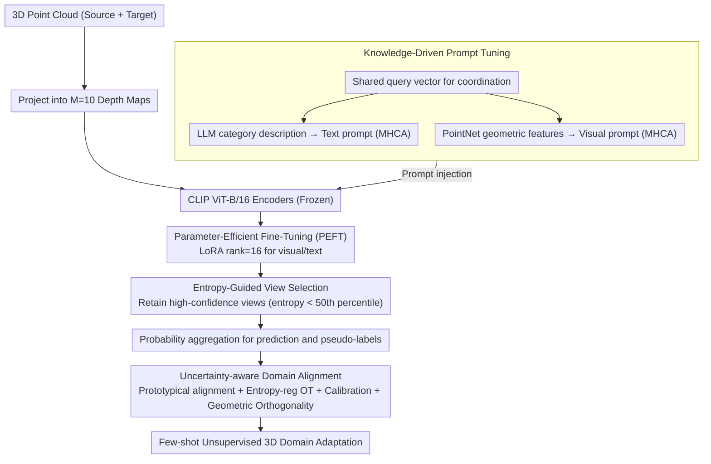

# CLIPoint3D: Language-Grounded Few-Shot Unsupervised 3D Point Cloud Domain Adaptation

**Conference**: CVPR2026  
**arXiv**: [2602.20409](https://arxiv.org/abs/2602.20409)  
**Code**: [SarthakM320/CLIPoint3D](https://github.com/SarthakM320/CLIPoint3D)  
**Area**: 3D Vision  
**Keywords**: 3D Point Cloud Domain Adaptation, CLIP, Vision-Language Models, Few-Shot Learning, Unsupervised Domain Adaptation, Optimal Transport, Parameter-Efficient Fine-Tuning

## TL;DR

The first CLIP-based few-shot unsupervised 3D point cloud domain adaptation framework. By utilizing knowledge-driven prompt tuning, parameter-efficient fine-tuning, entropy-guided view selection, and uncertainty-aware alignment loss, it achieves consistent accuracy improvements of 3-16% on PointDA-10 and GraspNetPC-10 with only ~11M trainable parameters.

## Background & Motivation

**Severe 3D point cloud domain shift**: Point clouds collected by different sensors vary significantly in density, sampling patterns, occlusion, and background clutter. Deep 3D models suffer from performance drops in cross-domain scenarios, especially in synthetic-to-real migration.

**High computational overhead of traditional 3D UDA methods**: Methods such as adversarial alignment (PointDAN), self-supervision (DefRec), and pseudo-labeling (GAST/MLSP) rely on heavy 3D encoders, which are accurate but inefficient and lack semantic priors.

**Limitations of CLIP in 3D**: Existing CLIP-3D extensions (PointCLIP/v2) project point clouds into depth maps for CLIP processing but face: (a) modality gap—CLIP is pre-trained on RGB images and cannot fully capture sparse, textureless depth features; (b) domain gap—lack of cross-domain alignment mechanisms results in weak zero-shot migration capability.

**Few-shot labeling demand**: 3D annotation is costly and error-prone; effective domain migration is required under minimal supervision.

**Unstable multi-view fusion**: Uniformly aggregating all projected views introduces noise from occluded or sparse views, degrading prediction quality.

**Joint demand for semantic and distribution alignment**: Neither statistical alignment (MMD/adversarial) nor semantic alignment (pseudo-labeling) alone is sufficient; class-level consistency and global distribution matching must be ensured simultaneously.

## Method

### Overall Architecture

CLIPoint3D addresses the challenges of cross-domain 3D point cloud classification under label scarcity and severe domain shift while reusing CLIP’s semantic priors without training heavy 3D encoders. The framework is built on a frozen CLIP (ViT-B/16): each 3D point cloud is projected into M=10 depth maps and fed into the CLIP vision encoder. Four modules work synergistically: knowledge-driven prompt tuning injects semantic and geometric priors, PEFT uses LoRA for low-cost adaptation of CLIP branches, entropy-guided view selection filters noisy views, and uncertainty-aware domain alignment migrates source domain knowledge to the target domain. The framework completes few-shot unsupervised domain adaptation with only ~11M trainable parameters.

### Key Designs

**1. Knowledge-Driven Prompt Tuning: Injecting 3D Semantic and Geometric Priors into CLIP**

CLIP is pre-trained on RGB images, resulting in a modality gap when facing sparse, textureless depth maps. This module supplements priors from both text and vision sides: on the text side, an LLM (GPT-5) generates descriptive text for each category (e.g., "a 3D point cloud object of a [CLS] with [attributes]"), which is processed by the frozen CLIP text encoder to obtain $\mathbf{T}^{llm}$ and interacts with shared query vectors $\mathbf{q}$ via Multi-Head Cross Attention (MHCA) to generate semantic-aware text prompts $\mathbf{P}_t$. On the visual side, a lightweight PointNet extracts structural features $\mathbf{I}_{3D}$, which also interact with $\mathbf{q}$ via MHCA to generate geometric-aware visual prompts $\mathbf{P}_v$ for the vision encoder. The key is the shared query (length 4, dim 512), which enables text and visual prompts to evolve under a unified semantic reference while maintaining modality specificity, proving more stable than naive multimodal fusion (MaPLe).

**2. Parameter-Efficient Fine-Tuning (PEFT): Low-Rank Adaptation to Preserve Zero-Shot Capability**

Full parameter fine-tuning destroys CLIP's zero-shot capability and is expensive. LoRA (rank=16, dropout=0.1) is applied to both the visual and text encoders, updating only low-rank adapters. The visual LoRA specifically captures 3D-specific residual cues like curvature, surface continuity, and depth transitions, while the text LoRA aligns LLM-enhanced prompts with 3D structural attributes. Ablations show that dual-branch LoRA tuning significantly outperforms LayerNorm/BitFit, as low-rank adaptation is better at capturing domain-specific cues.

**3. Entropy-Guided View Selection: Trusting High-Confidence Views and Discarding Occlusion Noise**

Uniformly aggregating M=10 projected views introduces noise from occluded or sparse views. The module calculates the prediction entropy $H_{i,m}$ for each depth map $x_{i,m}$ and retains only a subset of high-confidence views $\mathcal{M}_i^*$ whose entropy is below the 50th percentile threshold. This step introduces no additional parameters and is used in both training and inference as a free view-level denoising mechanism, outperforming uniform, weighted, max-similarity, and random selection.

**4. Uncertainty-Aware Domain Alignment: Joint Semantic and Distribution Alignment**

A unified loss consisting of four terms is used: entropy-weighted prototypical alignment $\mathbf{L}_{proto}$ computes source prototypes $\mathbf{U}_c$ and performs confidence-weighted contrastive learning on target pseudo-labeled samples, letting high-confidence samples dominate semantic alignment; entropy-regularized optimal transport $\mathbf{L}_{OT}$ solves OT on point cloud embeddings via Sinkhorn with entropy regularization to avoid sharp coupling; auxiliary calibration loss $\mathbf{L}_{conf}$ minimizes prediction entropy to clean source prototypes and tighten target clusters; geometric regularization $\mathbf{L}_{ortho}$ imposes orthogonality constraints on 3D encoder features to decorrelate local features. This design is theoretically grounded: the OT loss corresponds to the $d_{\mathcal{H}\Delta\mathcal{H}}$ term in domain adaptation generalization bounds, while prototypical alignment reduces the ideal joint error $\lambda^*$.

### Loss & Training

Four alignment losses are jointly optimized with cross-entropy:

$$\mathbf{L}_{total} = \mathbf{L}_{ce} + \alpha(\mathbf{L}_{ortho} + \mathbf{L}_{proto} + \mathbf{L}_{OT} + \mathbf{L}_{conf}), \quad \alpha=1$$

## Key Experimental Results

### Main Results

**PointDA-10 Benchmark** (ModelNet/ShapeNet/ScanNet, 6 migration directions):

| Method | M→S | M→S* | S→M | S→S* | S*→M | S*→S | Avg |
|:--|:--:|:--:|:--:|:--:|:--:|:--:|:--:|
| 3DeNet (SOTA encoder) | 84.5 | 57.1 | 78.8 | 57.2 | 77.5 | 78.1 | 72.2 |
| PointCLIP | 50.8 | 20.9 | 50.1 | 20.9 | 50.1 | 50.8 | 40.6 |
| **Ours-V** | **84.6** | **53.5** | **91.6** | **55.3** | **87.9** | **81.3** | **75.7** |

Average accuracy of 75.7%, exceeding the best encoder-based method by 3.5%.

**GraspNetPC-10 Benchmark** (Synthetic/Kinect/RealSense, 4 migration directions):

| Method | Syn→Kin | Syn→RS | Kin→RS | RS→Kin | Avg |
|:--|:--:|:--:|:--:|:--:|:--:|
| GAI (SOTA encoder) | 81.2 | 73.1 | 66.4 | 82.6 | 75.8 |
| PointCLIP | 30.7 | 24.3 | 24.3 | 30.7 | 27.5 |
| **Ours-B** | **96.5** | **89.3** | **86.8** | **96.2** | **92.2** |

Average accuracy of 92.2%, exceeding the best baseline by **16.4%** and leading significantly in all directions.

### Ablation Study

- **PEFT Strategy**: LoRA (Both) + PT is optimal at 92.2%; LoRA (Both) alone 90.5%; LayerNorm/BitFit are significantly weaker.
- **Loss Decomposition**: Only $L_{ce}$ reaches 64.3% (GraspNetPC-10); sequential addition of $L_{ortho}$ (+10.6%), $L_{OT}$ (+10.1%), $L_{proto}$, and $L_{conf}$ all provide gains, reaching 92.2% jointly.
- **Prompt Strategy**: Joint LLM text prompt + 3D visual prompt is optimal (75.7%), significantly better than naive multimodal fusion (MaPLe 72.4%) and unimodal prompts.
- **Number of Views**: M=10 is the peak; more views increase redundancy.
- **View Selection Strategy**: Entropy-guided > Uniform average > Weighted average > Max similarity > Random selection.
- **Few-shot Sensitivity**: Accuracy rises rapidly from 8 to 64 shots and saturates after 64 shots.

### Key Findings

- Zero-shot CLIP methods (PointCLIP/v2, ZS-CLIP) perform far worse than encoder-based methods in 3D domain adaptation; direct cross-domain migration is infeasible.
- Dual-branch LoRA fine-tuning on CLIP is significantly better than LayerNorm/BitFit, as low-rank adaptation excels at capturing domain-specific cues.
- t-SNE visualization shows that after adaptation, Fréchet Distance drops from 0.19 to 0.0009 and MMD from 1.08 to 0.12.

## Highlights

- **Novelty**: The first framework to utilize CLIP for unsupervised 3D point cloud domain adaptation.
- **Efficiency**: Only ~11M trainable parameters (vs. GAST 161M), computationally friendly and substantially outperforming full parameter fine-tuning.
- **Theoretical Support**: Design is grounded in domain adaptation generalization bounds; OT loss corresponds to $d_{\mathcal{H}\Delta\mathcal{H}}$ and prototypical alignment reduces $\lambda^*$.
- **Modular Design**: Four modules can be enabled independently, with ablations clearly showing the marginal contribution of each component.

## Limitations & Future Work

- Performance on ScanNet-related directions (M→S\*, S→S\*) is slightly lower than some encoder-based methods; adaptation to real scan scenarios remains insufficient.
- Dependency on LLM for category descriptions increases pipeline complexity and reliance on external services.
- Experiments are validated only on 10-class classification tasks; larger datasets or downstream tasks like segmentation/detection are not covered.
- 3D→2D projection inherently loses topological information; the framework is limited by projection quality.
- Noise accumulation in pseudo-labels is mitigated by entropy weighting but not fundamentally solved; self-refinement pipelines could be introduced.

## Related Work & Insights

- **3D UDA encoder-based**: PointDAN, GAST, MLSP, 3DeNet—adversarial/self-supervised/pseudo-label alignment based on heavy 3D encoders.
- **CLIP-3D Extensions**: PointCLIP/v2, DiffCLIP, CG3D—multi-view projection + CLIP inference, but lacks domain adaptation design.
- **CLIP-2D UDA**: DAPL, AD-CLIP, PADCLIP—CLIP prompt learning in 2D image domain adaptation, not applicable to 3D.
- **Prompt Tuning**: CoOp, VPT, MaPLe—general prompt learning methods; this work introduces knowledge injection from LLM semantics and 3D geometry.

## Rating

- Novelty: ⭐⭐⭐⭐ (First CLIP-based 3D UDA framework, creative knowledge-driven prompt + UA-OT design)
- Experimental Thoroughness: ⭐⭐⭐⭐ (Two benchmarks, 8 ablations, efficiency analysis, and visualization, but limited dataset scale and task types)
- Writing Quality: ⭐⭐⭐⭐ (Clear structure, good transition between theory and experiments)
- Value: ⭐⭐⭐⭐ (Opens a lightweight VLM route for 3D domain adaptation)

<!-- RELATED:START -->

## Related Papers

- [\[CVPR 2026\] GeoFree-CoSeg: Unsupervised Point Cloud-Image Cross-Modal Co-Segmentation Without Geometric Alignment](geofree-coseg_unsupervised_point_cloud-image_cross-modal_co-segmentation_without.md)
- [\[CVPR 2026\] Ghosts in the Point Clouds: De-glaring LiDAR in the Transient Domain](ghosts_in_the_point_clouds_de-glaring_lidar_in_the_transient_domain.md)
- [\[CVPR 2026\] Deformation-based In-Context Learning for Point Cloud Understanding](deformation-based_in-context_learning_for_point_cloud_understanding.md)
- [\[CVPR 2026\] Adapting Point Cloud Analysis via Multimodal Bayesian Distribution Learning](adapting_point_cloud_analysis_via_multimodal_bayesian_distribution_learning.md)
- [\[CVPR 2026\] CMHANet: A Cross-Modal Hybrid Attention Network for Point Cloud Registration](cmhanet_a_cross-modal_hybrid_attention_network_for_point_cloud_registration.md)

<!-- RELATED:END -->
