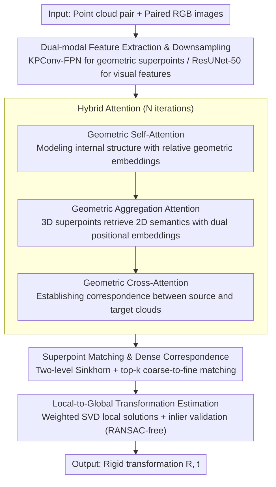

# CMHANet: A Cross-Modal Hybrid Attention Network for Point Cloud Registration

**Conference**: CVPR2026  
**arXiv**: [2603.12721](https://arxiv.org/abs/2603.12721)  
**Code**: [DongXu-Zhang/CMHANet](https://github.com/DongXu-Zhang/CMHANet)  
**Area**: 3D Vision  
**Keywords**: Point cloud registration, cross-modal fusion, hybrid attention, contrastive learning, multi-modal features

## TL;DR

CMHANet is proposed to deeply fuse 2D image texture semantic features with 3D point cloud geometric features via a cross-modal hybrid attention mechanism. Combined with contrastive learning optimization, it achieves SOTA registration performance on 3DMatch/3DLoMatch.

## Background & Motivation

1.  **Point cloud registration is a fundamental 3D vision task**: Used in large-scale reconstruction, AR, and scene understanding, but accuracy is limited by noise, sparsity, and low overlap in real scenes.
2.  **Traditional methods rely solely on geometric information**: ICP and its variants are sensitive to initial alignment and prone to local optima; deep learning methods have progressed but mostly utilize a single 3D geometric modality.
3.  **2D images and 3D point clouds are naturally complementary**: Point clouds provide precise geometry but lack texture description, while 2D images provide dense texture semantics but lack explicit 3D information. Fusing both yields comprehensive scene understanding.
4.  **Ubiquity of RGB-D sensors**: Paired depth and RGB camera setups are common, making multi-modal data easily accessible.
5.  **Existing multi-modal fusion is insufficiently fine-grained**: Methods like IMFNet and CMIGNet use general fusion strategies, lacking precise modeling of 2D/3D feature interaction.
6.  **Attention mechanisms excel at capturing long-range dependencies**: Transformer architectures can model global context, but effectively leveraging them in cross-modal scenarios remains an open problem.

## Method

### Overall Architecture

CMHANet addresses insufficient geometric information in low-overlap, noisy, and sparse point cloud registration by deeply fusing 2D texture semantics into 3D geometric features. The pipeline consists of four stages: dual-backbone feature extraction and superpoint downsampling, hybrid attention for iterative feature refinement, two-level matching (superpoint and dense point), and a RANSAC-free Local-to-Global strategy for transformation estimation.

### Key Designs

**1. Dual-modal Feature Extraction & Downsampling: Leveraging Geometry and Texture**

Point clouds provide precise geometry but lack texture, while images provide dense texture semantics without explicit 3D information. Thus, features are extracted via separate paths. On the point cloud side, a KPConv-FPN backbone extracts geometric features and downsamples them into superpoints $S^P, S^Q$, using Nearest-Superpoint Aggregation to associate dense points with superpoints. On the image side, a ResUNet-50 extracts visual features $\hat{F}^n, \hat{F}^m$ from paired 2D images. This step prepares complementary representations for cross-modal fusion.

**2. Hybrid Attention: Stitching Image Semantics into Geometric Features**

This is the core module for "texture-enhanced geometry," where three types of attention iterate $N$ times. Geometric Self-Attention models global structure within a single point cloud, incorporating relative geometric embeddings (distance + triangular angle) for spatial awareness. Geometric Aggregation Attention is the crux of cross-modal fusion, where 3D superpoints act as Queries to retrieve visual context from 2D images. 3D coordinate and 2D pixel positional embeddings are injected into Queries/Keys to enforce cross-modal consistency. Geometric Cross-Attention enables source-target interaction to build consistent correspondences. Unlike the simple concatenation in IMFNet or CMIGNet, this module achieves geometry-aware fine-grained retrieval.

**3. Superpoint Matching & Dense Correspondence: Coarse-to-Fine Sinkhorn**

Registration requires reliable correspondences under low overlap. First, at the superpoint level, a similarity matrix is computed using fused features. A learnable dustbin parameter is introduced to absorb non-overlapping outliers, followed by the Sinkhorn algorithm (50 iterations) and top-k selection for superpoint pairs. Then, point-level similarity is computed within each matched superpoint pair, followed by another Sinkhorn + top-k step to extract fine point-to-point correspondences. This coarse-to-fine structure is inspired by CoFiNet but is more robust due to cross-modal information.

**4. Local-to-Global Transformation Estimation: RANSAC-free Differentiable Estimation**

RANSAC is non-differentiable and slows down end-to-end training. In the local phase, a weighted SVD computes local rigid transformations for each superpoint pair (a differentiable closed-form solution). In the global phase, a Local-to-Global validation strategy counts spatial inliers (threshold $\tau_a = 5$ cm) for all candidate transformations across the entire correspondence set. The candidate with the most inliers is selected. This approach is differentiable and significantly faster than RANSAC.

### Loss & Training

A joint objective is used: $\mathcal{L} = \mathcal{L}_c + \mathcal{L}_f + \lambda \mathcal{L}_{cmc}$ ($\lambda = 0.5$). The coarse matching loss $\mathcal{L}_c$ employs overlap-aware circle loss for metric learning, where pairs with >10% overlap are positive samples weighted by the square root of overlap. The fine matching loss $\mathcal{L}_f$ minimizes alignment error for dense correspondences. The cross-modal contrastive loss $\mathcal{L}_{cmc}$ performs contrastive learning between geometric and image features at the superpoint level, which remains effective even with a batch size of 1.

## Key Experimental Results

### Main Results

Registration Recall (%) on 3DMatch and 3DLoMatch benchmarks:

| Method | 3DMatch (5000) | 3DLoMatch (5000) |
| :--- | :--- | :--- |
| Predator | 89.0 | 61.2 |
| CoFiNet | 89.3 | 67.5 |
| GeoTransformer | - | - |
| OIF-PCR | - | - |
| **Ours (CMHANet)** | **92.4** | **75.5** |

Registration precision (RANSAC-free): RRE 1.764°, RTE 0.060m (3DMatch); RRE 2.839°, RTE 0.084m (3DLoMatch), achieving superior performance.

### Zero-shot Generalization (TUM RGB-D)

Trained on 3DMatch and directly tested on 8 TUM sequences, the model achieves an average RMSE of 0.76 ($\times 10^{-2}$), significantly outperforming Robust ICP (1.69) and DGR (1.44).

### Ablation Study

| Configuration | 3DMatch RR | 3DLoMatch RR |
| :--- | :--- | :--- |
| Loss Only (No HA, No IM) | 89.9 | 71.9 |
| No HA (With Loss + IM) | 90.5 | 72.4 |
| No Aggre-Att | 91.3 | 73.6 |
| **Full CMHANet** | **92.4** | **75.5** |

- Removing Hybrid Attention: 3DLoMatch RR drops by 3.1%.
- Removing Aggregation Attention: 3DLoMatch RR drops by 1.9%.
- Removing Image Module (Geometry only): 3DMatch RR drops to 89.9%.

Image encoder comparison: ResNet-34 < ResUNet-50 $\approx$ ResNet-101. ResUNet-50 provides the best balance between accuracy and efficiency.

## Highlights & Insights

- **Refined Cross-Modal Fusion**: Aggregation attention injects 3D and 2D positional embeddings into Query/Key for geometry-aware retrieval, surpassing simple concatenation.
- **RANSAC-free End-to-End Registration**: The Local-to-Global strategy replaces RANSAC, being both differentiable and over 100x faster.
- **Strong Generalization**: Zero-shot testing on TUM RGB-D significantly outperforms all baseline methods.
- **Efficient Contrastive Loss**: Superpoint-level cross-modal contrastive learning works with batch size = 1, eliminating the need for large batches.

## Limitations & Future Work

- Performance degrades in **extremely low overlap scenarios** (<10%) or on texture-less planar surfaces.
- **Increased Inference Overhead**: Cross-modal encoding and fusion lead to longer feature extraction times compared to single-modality methods.
- **Dependency on RGB-D Data**: Requires extrinsic calibration between point clouds and images, limiting applicability in pure LiDAR scenarios.
- **Coupled Rotation and Translation**: Future work may explore decoupling $R$ and $t$ computation to further improve alignment precision.
- **Outdoor Large-scale Scenes**: Only tested on indoor datasets; applicability to outdoor scenes like KITTI is yet to be verified.

## Related Work & Insights

- **vs GeoTransformer**: While GeoTransformer uses only geometric self/cross attention, CMHANet introduces image aggregation attention, achieving lower RRE (1.764° vs 1.772°).
- **vs IMFNet / PCR-CG**: As a multi-modal method, CMHANet leads PCR-CG by 9.2% and IMFNet by 27.1% in 3DLoMatch RR, validating the superiority of hybrid attention fusion.
- **vs CoFiNet**: Both use coarse-to-fine strategies, but CMHANet shows significant advantages in low-overlap cases due to cross-modal information (75.5% vs 67.5%).
- **vs Traditional ICP**: In zero-shot TUM tests, CMHANet achieves an RMSE of 0.76 vs 1.69 for Robust ICP.

## Rating

- Novelty: ⭐⭐⭐⭐ — The dual positional embedding design in aggregation attention for cross-modal retrieval is innovative; the superpoint-level contrastive loss is simple yet effective.
- Experimental Thoroughness: ⭐⭐⭐⭐ — Covers 3DMatch, 3DLoMatch, and TUM; complete ablation studies (modules/backbones/estimators); comprehensive quantitative and qualitative analysis.
- Writing Quality: ⭐⭐⭐⭐ — Clear structure, consistent notation, and rich visualizations.
- Value: ⭐⭐⭐⭐ — A practical direction for multi-modal registration with SOTA results and open-source code, providing high reference value for future work.

<!-- RELATED:START -->

## Related Papers

- [\[CVPR 2026\] GeoFree-CoSeg: Unsupervised Point Cloud-Image Cross-Modal Co-Segmentation Without Geometric Alignment](geofree-coseg_unsupervised_point_cloud-image_cross-modal_co-segmentation_without.md)
- [\[CVPR 2026\] MHopReg: Efficient Hierarchical Multi-Hop Graph Search for Point Cloud Registration](mhopreg_efficient_hierarchical_multi-hop_graph_search_for_point_cloud_registrati.md)
- [\[CVPR 2026\] Hg-I2P: Bridging Modalities for Generalizable Image-to-Point-Cloud Registration via Heterogeneous Graphs](hg-i2p_bridging_modalities_for_generalizable_image-to-point-cloud_registration_v.md)
- [\[CVPR 2026\] Bidirectional Cross-Modal Prompting for Event-Frame Asymmetric Stereo](bidirectional_cross-modal_prompting_for_event-frame_asymmetric_stereo.md)
- [\[CVPR 2026\] AffordGrasp: Cross-Modal Diffusion for Affordance-Aware Grasp Synthesis](affordgrasp_cross-modal_diffusion_for_affordance-aware_grasp_synthesis.md)

<!-- RELATED:END -->
