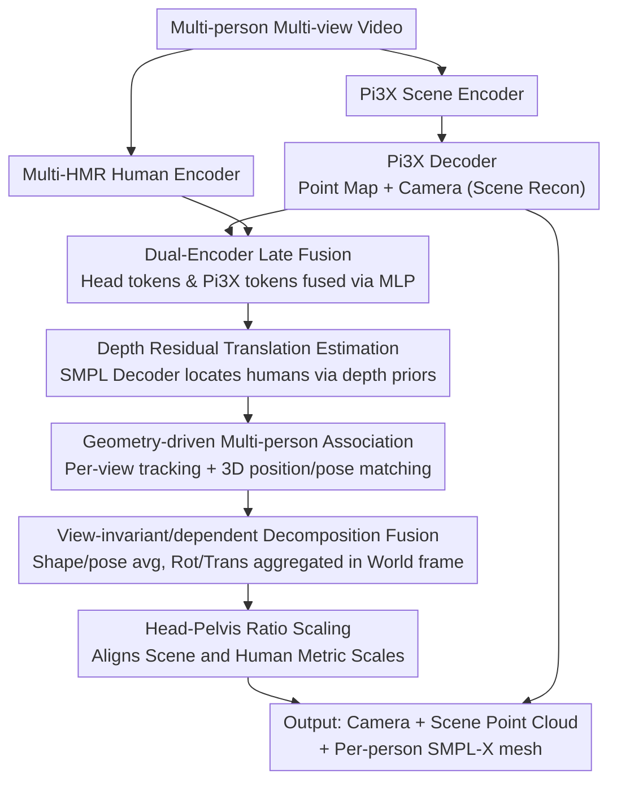

# Coherent Human-Scene Reconstruction from Multi-Person Multi-View Video in a Single Pass

**Conference**: CVPR 2026  
**arXiv**: [2603.12789](https://arxiv.org/abs/2603.12789)  
**Code**: [Project Page](https://nstar1125.github.io/chromm)  
**Area**: 3D Vision / Joint Human-Scene Reconstruction  
**Keywords**: Multi-view Human Reconstruction, Multi-person Scene, SMPL-X, 3D Foundation Models, Scale Alignment

## TL;DR

The proposed CHROMM is a unified framework that integrates Pi3X geometric priors and Multi-HMR human priors into a single feed-forward network. it jointly reconstructs cameras, scene point clouds, and SMPL-X human meshes from multi-person multi-view videos in a single pass without external modules, preprocessing, or iterative optimization. It achieves a multi-view WA-MPJPE of 53.1mm on RICH and is over 8x faster than HAMSt3R.

## Background & Motivation

**Background**: 3D joint human-scene reconstruction is a core problem in computer vision with applications in robotics, autonomous driving, and AR/VR. Recently, 3D foundation models (DUSt3R, VGGT, Pi3X) have advanced scene reconstruction, while Multi-HMR has enabled multi-person mesh recovery.

**Limitations of Prior Work**:

1. Monocular methods like UniSH and Human3R cannot utilize multi-view information, limiting accuracy.
2. Multi-view methods like HSfM and HAMSt3R rely on external modules (2D keypoint detectors, cross-view ReID modules) or require iterative optimization, leading to high system complexity.
3. Appearance-based Re-ID methods fail in visually similar scenes (e.g., people wearing uniforms).
4. There is a discrepancy between the near-metric scale of Pi3X output and the actual metric scale of SMPL—causing humans to penetrate the ground or float.

**Key Challenge**: The need to simultaneously reconstruct the scene and multiple humans while addressing scale inconsistency, difficult multi-person cross-view association, and avoiding reliance on external preprocessing.

**Goal**: To build a unified feed-forward framework that does not depend on external modules or preprocessed data for one-pass multi-person multi-view joint human-scene reconstruction.

**Key Insight**: Fuse the priors of Pi3X (scene) and Multi-HMR (human), design a scale adjustment module to bridge them, and use geometric cues instead of appearance matching for cross-view association.

**Core Idea**: Late fusion of dual encoders + head-pelvis ratio scale adjustment + view-invariant/dependent decomposition fusion + geometry-driven multi-person association.

## Method

### Overall Architecture

CHROMM aims to jointly reconstruct cameras, scene point clouds, and SMPL-X meshes for each individual from multi-person multi-view videos in one pass, without relying on external modules (keypoint detection, ReID) or iterative optimization. It combines two off-the-shelf priors into one feed-forward network: a Pi3X encoder for scene geometry and a Multi-HMR encoder for human representation. After dual-stream encoding, the Pi3X decoder reconstructs point maps and cameras. Human tokens extracted via head detection are fused with Pi3X decoder tokens and fed into the SMPL decoder to regress the pose, shape, and translation of each person. No optimization is performed during inference; the system relies on per-view tracking, geometry-driven cross-view association, view-invariant/dependent decomposition fusion, and finally, a scale adjustment module to align the scene and humans to the same metric scale.

### Key Designs

**1. Dual-Encoder Late Fusion: Preventing Human Priors from Contaminating Scene Reconstruction**

If scene and human representations are mixed early at the encoding stage, human tokens may disrupt the input distribution of Pi3X and harm scene reconstruction. Therefore, CHROMM adopts late fusion: the Pi3X encoder captures global 3D geometry while the Multi-HMR encoder focuses on humans. Human tokens are fused with scene tokens via an MLP only after decoding, $H_n = \text{MLP}_{\text{fuse}}([Z_n^{\text{scene}} | Z_n^{\text{human}}])$, ensuring both priors function independently without interference.

**2. Depth Residual Translation Estimation: Locating Humans via Scene Depth Priors Instead of Hard Regression**

Directly regressing 3D head translation is inaccurate. Instead, this method utilizes the depth prior provided by Pi3X point maps to predict only the residue relative to the scene depth map, $d_n^m = d_{n,m}^{\text{coarse}} + \Delta d_n^m$. This is combined with 2D head keypoints and camera intrinsics to back-project into 3D positions. Ablations confirm the value of this approach: Depth Residual achieved a WA-MPJPE of 107.5, Direct Depth achieved 133.8, and Direct Translation Regression performed poorly at 196.4.

**3. Geometry-driven Multi-person Association: Using 3D Position Instead of Appearance to Avoid Mismatches in Uniform Scenes**

Visually similar scenes, such as those involving uniforms, cause appearance-based ReID to fail. CHROMM uses geometric cues instead: per-view inter-frame matching is done using L2 distance of head tokens, with Sinkhorn optimal transport handling unmatched detections. Cross-view association uses a cost $\mathcal{C}(a,b) = 0.8 \cdot \|3D位置差\| + 0.2 \cdot \|规范姿态差\|$, followed by the Hungarian algorithm for one-to-one matching. Ablations show using only position reaches 91.1% precision, while only pose reaches 70.6%; the combination yields 91.3%, confirming position as the primary driver for association.

**4. View-invariant/dependent Decomposition Fusion: Aggregating by Physical Properties Rather than Implicit Token Pooling**

Once identities are associated, estimates of the same person from different views must be merged. The aggregation method depends on the nature of the quantity: view-invariant quantities (shape $\beta$, pose $\theta$) are directly averaged, which outperforms implicit token max-pooling. View-dependent quantities (rotation $R$, translation $\tau$) are first transformed into the world coordinate system, then aggregated using quaternion averaging and multi-view ray triangulation, respectively. Ablation rankings confirm the advantage of this explicit decomposition: Avg+Tri (53.1) > MaxPool+Tri (63.2) > Only Avg (69.3).

**5. Head-Pelvis Ratio Scaling: Bridging Scene and Human Scale Discrepancies via Anatomical Ratios**

Pi3X outputs a near-metric scale $s$, which might be too small (causing humans to penetrate the floor) or too large (causing humans to float). As the final step in the inference pipeline, CHROMM uses an anatomically stable ratio for correction: it calculates the ratio of the 2D head-pelvis distance in the image $\ell^{\text{img}}$ to the projected SMPL head-pelvis distance $\ell^{\text{smpl}}$. A global adjustment factor $r = \frac{1}{| \mathcal{S} |}\sum \frac{\ell^{\text{smpl}}}{\ell^{\text{img}}}$ is averaged across all frames and people, resulting in $s^* = r\cdot s$. Pelvis localization follows a coarse-to-fine approach: head tokens estimate a coarse position, and the corresponding patch regresses the offset, falling back to the coarse position if the pelvis is out of bounds. This is the most critical part of the pipeline; removing it causes WA-MPJPE to spike from 102.6 to 169.7.

### Loss & Training

- **Two-stage Training**: In Stage 1, Pi3X and Multi-HMR encoders are frozen while new modules like the SMPL decoder are trained (20 epochs, BEDLAM, lr=5e-5, scale adjustment disabled for the first 10 epochs).
- In Stage 2, only the pelvis detection MLP is unfrozen (10 epochs, mixture of 3DPW+MPII+COCO+BEDLAM, lr=1e-4).
- Stage 1 Losses: 3D Vertex/Joint L1 ($\lambda=5.0$) + 2D Reprojection L1 + SMPL Parameter L1 + Detection BCE + Pelvis BCE.
- Stage 2 Addition: Chamfer Distance (visible SMPL vertices vs. predicted depth map).
- Training Hardware: 4×A100 for approximately 2 days.

## Key Experimental Results

### Main Results (Global Human Motion Estimation)

| Method | Multi-view | No Ext. Modules | EMDB-2 WA-MPJPE↓mm | RICH WA-MPJPE↓mm | RICH W-MPJPE↓mm |
|------|--------|-----------|---------------------|-------------------|-----------------|
| JOSH3R | ✗ | ✗ | 220.0 | - | - |
| UniSH | ✗ | ✗ | 118.5 | 118.1 | 183.2 |
| Human3R | ✗ | ✓ | 112.2 | 110.0 | 184.9 |
| CHROMM-mono (Ours) | ✗ | ✓ | **102.6** | 87.5 | 138.3 |
| CHROMM-multi (Ours) | ✓ | ✓ | - | **53.1** | **79.0** |

### Multi-view Pose Estimation

| Method | No ReID | No Opt. | EgoHumans W-MPJPE↓(m) | EgoHumans GA-MPJPE↓(m) | EgoExo4D W-MPJPE↓(m) |
|------|--------|--------|----------------------|----------------------|---------------------|
| HSfM | ✗ | ✗ | 1.04 | 0.21 | 0.56 |
| HAMSt3R | ✓ | △ | 3.80 | 0.42 | 0.51 |
| **CHROMM (Ours)** | ✓ | ✓ | **0.51** | **0.15** | **0.26** |

### Running Time

| Method | Per-frame Inference Time (3 persons, 4 views) |
|------|---------------------|
| HSfM | ~118s |
| HAMSt3R | ~32s |
| **CHROMM (Ours)** | **~4s** (8×+ Speedup) |

### Key Findings

- Multi-view fusion provides a significant Gain: RICH WA-MPJPE dropped from 87.5 (monocular) to 53.1 (multi-view), a 39.3% improvement.
- Scale adjustment is the most critical module: removing it increased WA-MPJPE from 102.6 to 169.7 (+65.5%).
- The depth residual strategy outperforms direct translation regression by 89mm (107.5 vs 196.4).
- Geometric association (91.3% accuracy) is far superior to using pose only (70.6%).
- CHROMM is 29x faster than HSfM and 8x faster than HAMSt3R, while requiring no ReID.

## Highlights & Insights

- **First end-to-end multi-person multi-view joint human-scene reconstruction framework**: Operates without any external modules, preprocessing, or optimization.
- **Head-Pelvis Ratio Scaling**: Bridging the scale gap between scene and humans using anatomical proportions; the design is simple yet effective.
- **View-invariant/dependent Decomposition Fusion**: Explicit parameter averaging and triangulation outperform implicit token aggregation.
- **Geometry-driven Cross-view Association**: Avoids the failure of appearance matching in uniform-wearing scenarios; the combination of 3D position and canonical pose is cleverly designed.

## Limitations & Future Work

- Heavy reliance on head tokens for human detection—performance degrades when the head is occluded or invisible.
- The dual encoders are not integrated into a unified encoder—there is room for improvement in modeling scene-human interactions.
- Extreme close-ups (head fills the image) or close-range human interactions remain typical failure cases.
- Scale adjustment relies on pelvis visibility—degrades during full-body occlusion.

## Related Work & Insights

- **vs Human3R**: CHROMM extends to multi-view and requires no external modules, outperforming it by 9.6mm on EMDB-2 and 57mm on RICH.
- **vs HSfM**: CHROMM is 29x faster, with EgoHumans W-MPJPE reaching 0.51m vs. 1.04m (50% improvement).
- **vs HAMSt3R**: CHROMM is 8x faster and supports multi-person association without external ReID.
- Insights: Merging 3D foundation models with human priors is a trend, with scale alignment being a core engineering challenge. View-invariant/dependent decomposition can be generalized to other multi-view estimation tasks.

## Rating

- Novelty: ⭐⭐⭐⭐ First unified multi-person multi-view framework without external dependencies; scale adjustment and geometric association are innovative.
- Experimental Thoroughness: ⭐⭐⭐⭐⭐ Comprehensive evaluation across 4 datasets, monocular/multi-view settings, detailed ablations, and runtime analysis.
- Writing Quality: ⭐⭐⭐⭐ Clear contributions, with every design decision backed by experimental validation.
- Value: ⭐⭐⭐⭐ Fast inference and no preprocessing requirements are highly significant for practical deployment.

<!-- RELATED:START -->

## Related Papers

- [\[CVPR 2026\] Illumination-Consistent Human-Scene Reconstruction from Monocular Video](illumination-consistent_human-scene_reconstruction_from_monocular_video.md)
- [\[CVPR 2026\] FISHuman: Fine-grained Single-image 3D Human Reconstruction via Multi-view 4D Remeshing](fishuman_fine-grained_single-image_3d_human_reconstruction_via_multi-view_4d_rem.md)
- [\[CVPR 2026\] Intrinsic Image Fusion for Multi-View 3D Material Reconstruction](intrinsic_image_fusion_for_multi-view_3d_material_reconstruction.md)
- [\[CVPR 2026\] Changes in Real Time: Online Scene Change Detection with Multi-View Fusion](changes_in_real_time_online_scene_change_detection_with_multi-view_fusion.md)
- [\[CVPR 2026\] ClipGStream: Clip-Stream Gaussian Splatting for Any Length and Any Motion Multi-View Dynamic Scene Reconstruction](clipgstream_clip-stream_gaussian_splatting_for_any_length_and_any_motion_multi-v.md)

<!-- RELATED:END -->
