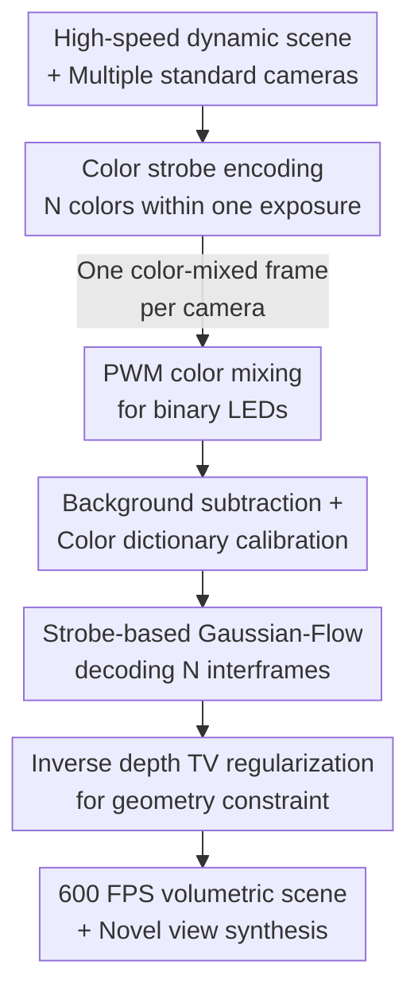

# Color-Encoded Illumination for High-Speed Volumetric Scene Reconstruction

**Conference**: CVPR 2026  
**arXiv**: [2604.26920](https://arxiv.org/abs/2604.26920)  
**Code**: https://davidnovikov.github.io/color-encoded-illumination-website/ (Project page, including video results)  
**Area**: 3D Vision / Computational Imaging / Dynamic Gaussian Splatting  
**Keywords**: High-speed imaging, Volumetric reconstruction, Color-encoded strobe illumination, Dynamic Gaussian Splatting, Compressive video

## TL;DR
A set of high-frequency switching color LED strobes is used to illuminate the scene, encoding "timestamps" of high-speed motion into the color and intensity of images captured by multiple standard 60 FPS cameras. A modified dynamic Gaussian Splatting (Gaussian-Flow) is then employed to decode 600 FPS volumetric dynamic scenes from these color-mixed frames, achieving high-speed 3D reconstruction without specialized camera hardware for the first time.

## Background & Motivation
**Background**: Reconstructing 3D dynamic scenes from 2D multi-view images (NeRF / 3DGS series) has gained significant popularity. However, standard cameras are limited to 30–60 FPS due to readout bandwidth, restricting these methods to static or slowly evolving scenes. Capturing true high-speed motion typically requires expensive specialized high-speed cameras (which often have poor "temporal dynamic range," limited to ~256 continuous frames) or computational imaging approaches.

**Limitations of Prior Work**: In computational imaging, there are two main paths to "extract high frame rates from low-speed cameras": ① encoding the entire frame into a subset of camera pixels; ② multiplexing multiple high-speed frames into one low-speed frame to be solved algorithmically. Both approaches usually require modifying camera optics (coded apertures, per-pixel controllable sensors, diffraction gratings, diffusers, etc.) or adding mechanical moving parts, which confines them to **single-view** acquisition.

**Key Challenge**: Encoding high-speed information is traditionally tied to the "camera side." To achieve multi-view acquisition (essential for volumetric reconstruction), the entire complex specialized imaging system must be replicated $N$ times, calibrated individually, and precisely synchronized—rendering the cost impractical. Consequently, "high-speed" and "multi-view volumetric reconstruction" have remained difficult to combine.

**Goal**: To reconstruct volumetric representations of high-speed scenes using a set of **unmodified low-speed color cameras** and support high-frame-rate rendering from arbitrary novel viewpoints.

**Key Insight**: Instead of modifying the camera side, which is difficult to replicate across multiple views, move the encoding to the **scene side**—using a strobe light source to "dye" moving objects. Once timestamp information is encoded into the colors of the scene itself, it becomes independent of camera optics/models and can naturally be captured by any number of standard cameras simultaneously.

**Core Idea**: Illuminate the scene with a predefined sequence of color strobes during a single exposure, making each low-speed frame a "linear superposition of objects at different times and colors." A dynamic Gaussian Splatting model then decodes this color mixture into multiple high-speed interframes, upgrading single-view encoding schemes to multi-view volumetric reconstruction.

## Method

### Overall Architecture
The method consists of two parts: the **acquisition side** uses color strobes to encode time into images, and the **reconstruction side** uses a modified Gaussian-Flow to decode time into 3D high-speed motion. Specifically, a co-located R/G/B tri-color LED source strobes $N$ different colors ($N{=}10$ in the paper) within each low-speed exposure period. Since a moving object occupies a different instantaneous position under each color, a single frame captured by 8 standard 60 FPS cameras is the result of "superimposing $N$ interframes, each dyed with a specific color" (under constant lighting, this would simply be a blur). During reconstruction, this color-mixed frame from each camera serves as a constraint to optimize a dynamic Gaussian Splatting model. The model renders single-channel interframes at $N$ timestamps, which, when linearly combined according to the known color dictionary, replicate the captured color frame. Once optimized, the model can render any novel view at 600 FPS.

### Key Designs

**1. Color Strobe: Encoding Timestamps into the Scene instead of the Camera**

Prior "compressed high-speed imaging" methods integrated encoding into camera optics, preventing low-cost multi-view expansion. This paper reverses the approach: the scene is illuminated by a set of approximately co-located R/G/B LEDs, strobbing $N$ different color segments within one exposure $T^{\rm exp}$. Assuming the strobe duration $T^{\rm strobe}$ is much shorter than the object motion, the object is approximately stationary during each strobe. The image captured by camera channel $c$ is a linear mixture of interframes:

$$I^{\rm rgb}({\bf x},c)=\sum_{n=1}^{N}{\bm c}_{\rm RGB}^{n}(c)\,I^{\rm int}({\bf x},t_n)$$

where ${\bm c}_{\rm RGB}^{n}(c)$ is the object color during the $n$-th strobe segment (encapsulating LED spectrum, object reflectivity, and camera response), and $I^{\rm int}({\bf x},t_n)$ is the instantaneous intensity interframe at time $t_n$. Crucially, because color serves as a "time ruler" etched onto the scene, it is independent of camera optics and models, allowing **the same strobe source to be captured by any number of unmodified cameras simultaneously**. This is the fundamental premise for upgrading single-view schemes to multi-view volumetric reconstruction.

**2. Strobe-based Gaussian-Flow: Decoding Interframes via Linear Mixture Prior**

How is the 3D scene at $N$ timestamps decoded from a single image? Using Gaussian-Flow as a backbone (where each Gaussian parameter evolves over time $g(t)=g(0)+d(t)$, and deformation $d(t)$ is modeled by DDDM with polynomials and Fourier series), two modifications are made. First, assuming uniform spectral reflectivity for target objects, the rendering function $\mathcal R(G,\phi)$ is modified to output a **single-channel intensity map** (one color channel per Gaussian). Second, the optimization objective is rewritten: the known color dictionary ${\bm c}_{\rm RGB}^{n}(c)$ and the interframes $R_n(\phi_m)$ rendered by the model at different timestamps are linearly combined to estimate the captured color frame:

$$\hat I^{\rm rgb}(c,\phi_m)\approx\sum_{n=1}^{N}{\bm c}_{\rm RGB}^{n}(c)\cdot R_n(\phi_m)$$

The optimization of $G(0), D(t)$ is supervised by $\mathcal L_1=\sum_m\sum_{c\in\{R,G,B\}}|\hat I^{\rm rgb}(c,\phi_m)-I^{\rm rgb}(c,\phi_m)|$. While single-frame decoding is ill-posed, **multi-view geometry (epipolar constraints) is implicitly utilized by the optimizer** to stabilize the solution—highlighting the value of the volumetric/multi-view approach. An additional total variation regularization on inverse depth $\mathcal L_{\text{TV-depth}}$ is used to suppress geometric noise, with the total loss being $\mathcal L=\mathcal L_1+\lambda_{\text{depth}}\mathcal L_{\text{TV-depth}}$.

**3. Binary LED PWM Coloration: Generating 175 Colors from Switchable Hardware**

The prototype uses Arduino PWM to drive LEDs, which only support **ON/OFF** states rather than continuous intensity adjustment. How are $N$ precise colors generated? Leveraging the "stationary during strobe" assumption, each color channel's intensity is split into multiple equal-length micro-pulses. Each intensity interval is approximately $16.7\,\mu s$, allowing for 0–5 discrete intensity levels. This results in $6^3{=}216$ combinations of the three colors. After removing scalar multiples and total black, **175 usable colors** are obtained. For the coloring strategy, experimental results show that uniform sampling of $\{\alpha_n,\beta_n,\gamma_n\}$ on a circle in $\alpha\beta\gamma$ space (equivalent to three-phase sine waves 120° apart) performs best—these colors are maximally spread in the camera's RGB space, providing the highest noise robustness during decoding.

### Loss & Training
The total loss is the sum of the single-channel L1 data term $\mathcal L_1$ (Equation 8, across $M$ views and R/G/B channels) and the inverse depth total variation regularization $\mathcal L_{\text{TV-depth}}$ (with weight $\lambda_{\text{depth}}$). Each low-speed frame $t_k$ is optimized independently (no cross-frame modeling). Point clouds are initialized using COLMAP on strobe foreground images; camera poses are also obtained via COLMAP on non-strobed calibration images. The background is captured separately before/after motion and subtracted to run the model only on the foreground; for visualization, a static 3DGS background model is overlaid.

## Key Experimental Results

### Main Results (Physical Prototype)
Prototype: 8 IDS UI-3240CP global shutter cameras (1280×1024, 60 FPS) + MOBL-300×150-RGBW tri-color source + Arduino synchronization. $N{=}10$ color strobes, increasing temporal resolution from 60 to 600 FPS.

| Target Scene | Task | Results |
|---------|------|------|
| Rotating Disk (White/Yellow stickers) | 8-camera reconstruction of fast disk | Single low-speed frame → high-speed volume; few artifacts in novel views. Tested non-white albedo with yellow stickers. |
| Nerf Dart hitting wall | MoCap-style high-speed trajectory | Decoded impact and rebound; renderable from original and novel views. |
| Tossed Chess Pieces | Multiple large overlapping objects | Successfully reconstructed high-speed motion of multiple objects. |
| Constant Light Control | Equivalent exposure without strobe | Severe motion blur; unable to recover motion, highlighting the effect of strobe encoding. |

Since no camera modification is required, this is the first work to combine **volumetric rendering with compressive high-speed imaging** for multi-view high-speed volumetric reconstruction.

### Ablation Study (Simulation MAE, using novel view as GT)

| Variable | Trend / Key Turning Point | Explanation |
|------|----------------|------|
| Number of interframes $N$ | Significant degradation near $N{\approx}28$ | More $N$ leads to crowded colors and overlap; cosine distance in RGB space decreases, increasing noise sensitivity. |
| Ambient Light Intensity | Reconstruction error rises **approximately linearly** | Ambient light reduces contrast of ${\bm c}_{\rm RGB}^{n}$ and causes saturation during long exposures. |
| Object Albedo (White → Red mix) | Broad spectrum (near-white) is better | Weak reflection in certain bands narrows the color separation in RGB space. |
| Number of Cameras $M$ | Reliable synthesis at **$M \ge 6$** | Multi-view geometry is the key constraint for the ill-posed decoding problem. |
| Motion Complexity | High-variance motion "loses" interframes | Vanishing gradients in Gaussians occur during large displacements. |

### Key Findings
- **Multi-view is key to solving the ill-posedness**: Single-frame color decoding is underdetermined; the epipolar geometry of multiple cameras constrains the solution. Simulations show 6 cameras are sufficient.
- **$N$ is not "the more the better"**: More interframes make colors harder to distinguish; $N{\approx}28$ is an empirical upper bound. Higher rates would require purer colors or whiter objects.
- **Near-zero synchronization risk**: The allowable drift per camera trigger $T^{\rm marg}{=}T^{\rm exp}/(2N){=}0.83$ ms is approximately 27 times the hardware trigger jitter ($30\,\mu s$), eliminating frame-strobe misalignment.

## Highlights & Insights
- **Moving encoding from "Camera Domain" to "Scene Domain"**: A simple shift in perspective that unlocks multi-view scalability—one light source, any number of cameras. This overcomes the primary limitation of single-view compressive imaging.
- **175 colors from binary LED + PWM**: A practical engineering trick that creates continuous-like intensity pulses from low-cost hardware by assuming "stationary within strobe segments."
- **Integration of Color Dictionary + Linear Mixture Prior into 3DGS**: Writing the physical imaging model (Equation 4) directly into the differentiable rendering loss turns high-speed decoding into a standard differentiable optimization problem.
- **Uniform Circle Sampling for Color Selection**: Translating the need for maximal color separation into a geometric intuition (120° phase-shifted sines in $\alpha\beta\gamma$ space) is elegant.

## Limitations & Future Work
- **Uniform Albedo Assumption**: Currently limited to objects with nearly monochromatic, uniform albedo and spatially varying shadows; multi-colored objects may distort (the target is a single-channel interframe, losing 3DGS's original SH-based color robustness). Future work may jointly recover motion and appearance by observing the same surface across different strobes.
- **Requirement for Dark Background & Sensitivity to Ambient Light**: Experiments require dark backgrounds; ambient light linearly increases error. Simulations suggest non-dark backgrounds are possible but unverified on the physical system.
- **Rate Limited by Color Separability**: As $N$ increases, colors converge. Approximately 28 frames is the current limit; improvements depend on better color palettes or specifically white objects.
- **High-Variance Motion Issues**: Large displacements cause vanishing gradients, leading to dropped interframes; non-smooth motion remains a challenge.
- **Independent Frame Optimization**: Each low-speed frame is optimized independently, ignoring temporal continuity between frames, which offers potential for further improvement.

## Related Work & Insights
- **vs. SpinCam (Chan et al. 2023)**: Also encodes interframes into one exposure using color, but relies on a rotating diffraction grating in the **sensor domain** (time-varying PSF). It uses mechanical parts and is limited to single-view; Ours modifies **object color in the scene**, uses no mechanical parts, and naturally supports multi-view.
- **vs. Sheinin et al. (Diffractive position encoding)**: Uses diffraction for encoding sparse object positions at the camera side (specialized optics); Ours requires no camera modification and can be used with any number of cameras.
- **vs. Jaques et al. (RGB upsampling)**: Uses R/G/B channels to triple temporal resolution; Ours uses $N{=}10$ colors to achieve >3x (60→600 FPS) upsampling in a multi-view volume.
- **vs. Veeraraghavan et al. (Color strobe for periodic scenes)**: Their color strobe is for **periodic** scenes; Ours targets general non-periodic motion.
- **vs. Gaussian-Flow (Lin et al. 2024)**: Uses its DDDM deformation as a backbone but modifies it for single-channel rendering and linear mixture estimation, enabling high-speed 3D reconstruction from encoded low-speed frames.

## Rating
- Novelty: ⭐⭐⭐⭐⭐ "Moving encoding to the scene side" enables multi-view high-speed volumetric reconstruction, showing strong originality.
- Experimental Thoroughness: ⭐⭐⭐⭐ 4 types of real-world scenes + simulations covering 5 key factors. Lacks quantitative comparison with SOTAs (mostly qualitative).
- Writing Quality: ⭐⭐⭐⭐⭐ Clear derivation of imaging models; thorough hardware/calibration/sync details.
- Value: ⭐⭐⭐⭐ Establishes a new paradigm for "high-speed 3D with standard cameras," though current albedo/background assumptions limit it to specific scenarios.

<!-- RELATED:START -->

## Related Papers

- [\[CVPR 2026\] Illumination-Consistent Human-Scene Reconstruction from Monocular Video](illumination-consistent_human-scene_reconstruction_from_monocular_video.md)
- [\[CVPR 2026\] Radiance Meshes for Volumetric Reconstruction](radiance_meshes_for_volumetric_reconstruction.md)
- [\[CVPR 2026\] CoLoR: The Devil is in Scene Coordinate Regression for Large-Scale Visual Localization](color_the_devil_is_in_scene_coordinate_regression_for_large-scale_visual_localiz.md)
- [\[CVPR 2026\] Volumetric Functional Maps](volumetric_functional_maps.md)
- [\[CVPR 2026\] IR-HGP: Physically-Aware Gaussian Inverse Rendering for High-Illumination Scenes via Generative Priors](ir-hgp_physically-aware_gaussian_inverse_rendering_for_high-illumination_scenes_.md)

<!-- RELATED:END -->
