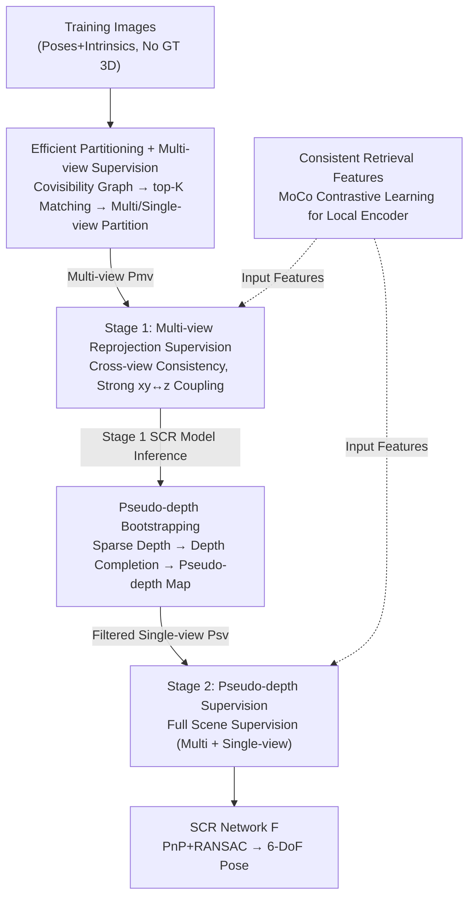

# CoLoR: The Devil is in Scene Coordinate Regression for Large-Scale Visual Localization

**Conference**: CVPR 2026  
**Paper**: [CVF Open Access](https://openaccess.thecvf.com/content/CVPR2026/html/Mao_CoLoR_The_Devil_is_in_Scene_Coordinate_Regression_for_Large-Scale_CVPR_2026_paper.html)  
**Code**: None (repository not yet public)  
**Area**: 3D Vision  
**Keywords**: Visual localization, scene coordinate regression, multi-view/single-view partitioning, pseudo-depth bootstrapping, retrieval feature consistency  

## TL;DR
CoLoR diagnoses the primary "culprits" behind the failure of large-scale Scene Coordinate Regression (SCR) as unsupervised single-view points and inconsistency between global and local features. By adopting an "explicit multi-view/single-view partitioning + two-stage strong supervision (multi-view reprojection + pseudo-depth bootstrapping)" strategy, it provides supervision for **every point** in the scene. Additionally, it utilizes MoCo-style contrastive learning to retrain local features into pixel-level retrieval features. CoLoR pushes SCR to SOTA performance on large-scale datasets like Aachen and Department Store, significantly narrowing the accuracy gap with Feature Matching (FM) methods while maintaining a map size of only a few dozen MBs.

## Background & Motivation
**Background**: Visual localization estimates the 6-DoF camera pose from a query image. Classic Feature Matching (FM) methods are accurate and robust but require storing massive descriptors, with maps often ranging from hundreds of MBs to several GBs (e.g., HLoc+SPSG is 7.82GB on Aachen). SCR, conversely, **implicitly encodes scene geometry into neural network weights**, directly regressing 3D scene coordinates from 2D pixels for pose estimation via PnP+RANSAC, resulting in maps of only a few dozen MBs.

**Limitations of Prior Work**: While SCR matches FM in small scenes, its performance degrades significantly in city-scale or large indoor environments. Current "3D-model-free" large-scale SCR methods (e.g., GLACE, R-SCoRe) inherit the ACE framework—randomly sampling pixel features and learning geometry by minimizing reprojection error through **implicit triangulation**, while concatenating global retrieval features with local matching features.

**Key Challenge**: Analyzing the scene from the perspective of "co-observation frequency," the authors identify two fundamental flaws. First, **sparse co-visibility**: partitioning points into "single-view points" (seen once) and "multi-view points" (seen multiple times) reveals that larger scenes contain a higher proportion of single-view points. Implicit triangulation **can only supervise multi-view points and is powerless for single-view points**, causing model capacity to be wasted on unlearnable noisy single-view samples. Simultaneously, the implicit supervision strength for multi-view points weakens as co-visibility frequency decreases. Second, **local appearance ambiguity**: repetitive textures in large scenes make distinct 3D locations with similar local patches indistinguishable. While concatenating global and local features is intended as a remedy, the authors find that the **inherent attribute inconsistency** between these features actually hinders discriminative power (AP on PR curves drops from 0.924 using global features alone to 0.816 after concatenation).

**Goal**: ① Provide strong supervision for **all points** in the scene, including single-view points; ② eliminate global/local feature inconsistency to obtain a cross-scale unified discriminative representation.

**Core Idea**: Instead of patching implicit triangulation, the method **explicitly partitions points into multi-view/single-view categories and applies distinct strong supervision to each** (multi-view via reprojection, single-view via bootstrapped pseudo-depth). It further reinterprets "global + local" as a "unified image-level + pixel-level retrieval feature" and aligns them using contrastive learning.

## Method

### Overall Architecture
CoLoR takes a set of training images with poses and intrinsics as input (**without assuming GT 3D coordinates**). It outputs an SCR network $F_\theta$ that regresses 3D scene coordinates from pixels, using PnP+RANSAC for pose estimation during testing. The pipeline consists of two stages: first, efficient feature matching partitions scene points into **multi-view points $P_{mv}$ and single-view points $P_{sv}$**. Stage one (first 70k steps) trains only on multi-view points using multi-view reprojection loss. Stage two (last 30k steps) uses the stage-one model to bootstrap "pseudo-depth" for single-view points. In parallel, the local encoder is **retrained as a pixel-level retrieval feature** using MoCo-style contrastive learning to align its objective with the image-level global feature.

### Key Designs

**1. Efficient Partitioning + Multi-view Reprojection Supervision: Replacing Weak Implicit Triangulation**

To address the failure of implicit triangulation in ACE, CoLoR **explicitly classifies** points. To avoid $O(N^2)$ exhaustive matching, it uses a co-visibility score $S(I_i, I_j)$ based on view frustum IoU to select the top-K neighbors $N_K(I_i) = \arg\mathrm{topk}_{I_j}\,S(I_i, I_j)$ for matching. Epipolar error and transitive consistency filter out mismatches, reducing complexity to $O(N)$ (taking only 3 minutes on Aachen). A point $P_k$ is categorized as multi-view if a correspondence exists: $P_{mv}=\{P_k\mid \mathrm{corr}(P_k)\neq\varnothing\}$, otherwise it is single-view: $P_{sv}=P\setminus P_{mv}$.

The correspondence set $C$ enables **multi-view reprojection loss**:

$$L_{mv}(P_k)=\sum_{p_j\in O(P_k)}\lVert \pi_j(P_k)-p_j\rVert_2^2$$

where $O(P_k)$ are the 2D observations and $\pi_j(P_k)$ is the projection into the $j$-th view. This **enforces geometric consistency across multiple views**, establishing strong coupling between lateral $xy$ and depth $z$. Ablations show that simply isolating training to multi-view points significantly outperforms the baseline (Dept. 4F accuracy improves from 60.2 → 70.2 → 75.8).

**2. Pseudo-depth Bootstrapping: Creating Metric Supervision for Single-view Points**

Single-view points lack multi-view correspondences and cannot be triangulated. Standard monocular depth lacks metric scale, and ordinal depth loss is another weak implicit supervision. CoLoR leverages the **$xy$–$z$ coupling from Stage 1 as a reliability indicator**: points with low reprojection error likely have accurate depth. The Stage 1 model performs inference on training images to generate a coordinate map $M_i$ and reprojection error map $E_i$. High-confidence points where $E_i(u) < \tau$ (e.g., 5 pixels) form a sparse depth map:

$$D_{sparse,i}(u)=\begin{cases} D_i(u) & E_i(u)<\tau\\ \text{invalid} & \text{otherwise}\end{cases}$$

This sparse map is processed by a depth completion model to obtain a **metric but potentially noisy "pseudo-depth map" $\tilde d$**. A pseudo-depth loss $\ell_{depth}=\lVert \tilde d - d\rVert_2$ is applied to the depth component of the predicted coordinates. Stage 2 includes multi-view points with reprojection loss and filtered single-view points with pseudo-depth loss, achieving **the first complete strong supervision for all points in the scene**.

**3. Consistent Retrieval Features: Reconstructing "Global + Local" as Unified Multi-granularity Retrieval**

Ideal SCR features should distinguish one 3D point from all others in the scene—essentially acting as **3D point retrieval features**. Prior methods combined features with inconsistent objectives. CoLoR treats global and local features as **two granularities of the same retrieval representation—image-level and pixel-level**. The local encoder is retrained using a retrieval-based MoCo contrastive objective:

$$L_i=-\log\frac{\exp(s(F_i^A,F_i^B))}{\sum_{F_j\in \mathcal F_{aug}}\exp(s(F_i^A,F_j))}$$

Crucially, the negative set $\mathcal F_{aug}$ includes **negatives from different scene regions**, providing the "global context" that traditional local features lack. Using **MoCo** with a momentum encoder and queue decouples the number of negative samples from the batch size, making cross-region contrastive learning computationally feasible.

### Loss & Training
Total training is 100k steps with a batch size of 81,920/GPU, divided into Stage 1 (70k steps with $L_{mv}$) and Stage 2 (30k steps with $L_{mv} + \ell_{depth}$). Top-10 co-visibility neighbors are used for matching. The retrieval encoder follows the DeDoDe architecture, with the descriptor trained from scratch on MegaDepth using a queue of 320,000 features from 64 historical images.

## Key Experimental Results

### Main Results
Evaluated on city-scale outdoor Aachen Day-Night (~6 km²) and large-scale indoor Department Store (~10,000 m²).

| Dataset | Metric(Threshold) | CoLoR | R-SCoRe (SCR SOTA) | Heavy FM Ref. | Map Size |
|-----------|-----------|-------|-------------------|-----------|------|
| Aachen Day | (0.25m,2°) | **78.6** | 74.8 | HLoc+SPSG 89.6 | 47MB |
| Aachen Night | (0.25m,2°) | **67.3** | 64.3 | HLoc+SPSG 86.7 | 47MB |
| Dept. 1F | (0.1m,1°) | **75.2** | 61.4 | HLoc+R2D2 80.6 | 127MB |
| Dept. 4F | (0.1m,1°) | **80.9** | 60.2 | HLoc+R2D2 85.3 | 50MB |
| Dept. B1 | (0.1m,1°) | **66.6** | 60.1 | HLoc+R2D2 75.2 | 130MB |

**Key Findings**: CoLoR significantly outperforms the previous SCR SOTA, R-SCoRe, across all scenes with comparable map sizes. In indoor environments under the strictest thresholds, accuracy improves by 13.8% (1F) and 20.7% (4F). Notably, ACE and GLACE collapse in large scenes (Aachen Day < 9%), validating the necessity of supervising single-view points.

### Ablation Study (Dept. 4F, Thresholds 0.1m/0.25m/1m)

| Configuration | (0.1m,1°) | (0.25m,2°) | (1m,5°) | Description |
|------|-----------|-----------|---------|------|
| Baseline | 60.2 | 79.3 | 87.9 | R-SCoRe starting point |
| + Point Partitioning | 70.2 | 83.9 | 88.8 | Train on multi-view only, remove noise |
| + Multi-view Reproj. | 75.8 | 86.7 | 90.1 | Weak implicit → strong explicit constraint |
| + Pseudo-depth Supp. | 76.6 | 86.7 | 90.3 | Single-view points included |
| + Consistent Retrieval | **80.9** | **89.6** | **93.1** | Unified feature representation |

## Highlights & Insights
- **Novel Perspective**: Dismantling the scene by co-visibility frequency provides a clear diagnosis: large-scale failure = single-view point surge + lack of supervision.
- **Bootstrapping Loop**: Using Stage 1 geometric coupling as a confidence filter for depth completion is a clever way to bypass the scale ambiguity of monocular depth without external GT.
- **Feature Unified View**: Reconceptualizing "global + local" as a single retrieval task is a valuable insight for any multi-scale feature fusion task.

## Limitations & Future Work
- **Dependency on Depth Completion**: Relies on an external model for pseudo-depth; robustness in textureless or reflective areas (where completion might fail) is not fully explored. ⚠️
- **Marginal Numerical Gains from Single-view Points**: While the coverage increase is conceptually important, the numerical gain (+0.8 on 4F) is modest compared to the multi-view reprojection improvement.
- **Gap with Top FM Methods**: SCR still lags behind heavy FM baselines (HLoc+SPSG) in extreme day-night scenarios.
- **Reproducibility**: The code is not yet public, and the method relies on specific architectural modifications from R-SCoRe. ⚠️

## Related Work & Insights
- **vs. R-SCoRe/GLACE**: These rely on inconsistent feature concatenation and implicit triangulation. CoLoR provides a systematic upgrade via explicit partitioning and strong supervision.
- **vs. ACE**: Inherits the efficient gradient-decorrelated sampling but replaces the core "random sampling + implicit triangulation" assumption which fails at scale.
- **vs. FM Methods**: FM is precise but heavy (GB maps). CoLoR maintains the MB-level footprint of SCR while significantly closing the accuracy gap.

## Rating
- **Novelty**: ⭐⭐⭐⭐⭐ High. Precision diagnosis of large-scale SCR failure and systematic solution.
- **Experimental Thoroughness**: ⭐⭐⭐⭐ Solid results on multiple datasets, though limited by lack of code and sensitivity analysis for depth completion.
- **Writing Quality**: ⭐⭐⭐⭐⭐ Excellent. The "co-visibility frequency" narrative is logical and compelling.
- **Value**: ⭐⭐⭐⭐⭐ Significant for memory-constrained large-scale localization.

<!-- RELATED:START -->

## Related Papers

- [\[CVPR 2026\] MERG3R: A Divide-and-Conquer Approach to Large-Scale Neural Visual Geometry](merg3r_a_divide-and-conquer_approach_to_large-scale_neural_visual_geometry.md)
- [\[CVPR 2026\] Color-Encoded Illumination for High-Speed Volumetric Scene Reconstruction](color-encoded_illumination_for_high-speed_volumetric_scene_reconstruction.md)
- [\[CVPR 2026\] Ego-1K: A Large-Scale Multiview Video Dataset for Egocentric Vision](ego-1k_--_a_large-scale_multiview_video_dataset_for_egocentric_vision.md)
- [\[CVPR 2026\] OLATverse: A Large-scale Real-world Object Dataset with Precise Lighting Control](olatverse_a_large-scale_real-world_object_dataset_with_precise_lighting_control.md)
- [\[CVPR 2026\] GLINT: Modeling Scene-Scale Transparency via Gaussian Radiance Transport](glint_modeling_scene-scale_transparency_via_gaussian_radiance_transport.md)

<!-- RELATED:END -->
