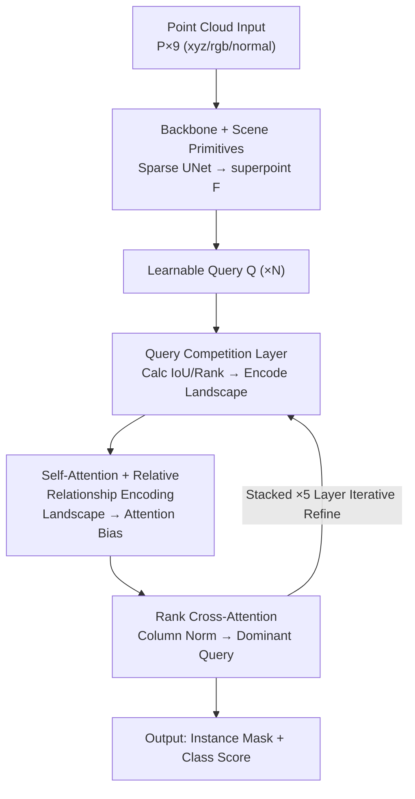

# CompetitorFormer: Mitigating Query Conflicts for 3D Instance Segmentation via Competitive Strategy

**Conference**: CVPR 2026  
**Paper**: [CVF Open Access](https://openaccess.thecvf.com/content/CVPR2026/html/Wang_CompetitorFormer_Mitigating_Query_Conflicts_for_3D_Instance_Segmentation_via_Competitive_CVPR_2026_paper.html)  
**Code**: https://github.com/DuanchuWang/CompetitorFormer  
**Area**: 3D Vision / 3D Instance Segmentation  
**Keywords**: 3D instance segmentation, Transformer decoder, query conflict, competitive modeling, ScanNet  

## TL;DR
To address the persistent issue of "multiple queries competing for the same object leading to mask fragmentation" in Transformer-based 3D instance segmentation, this paper introduces a Query Competition Layer. This layer explicitly calculates the "competitive landscape" (identifying the strongest spatial overlap and dominant/subordinate roles) for each query before each decoding stage. Combined with modified self-attention and cross-attention to enable "winner-take-all" dynamics, the method achieves faster convergence and SOTA performance across four benchmarks: ScanNetV2/200, S3DIS, and ScanNet++V2.

## Background & Motivation
**Background**: 3D Instance Segmentation (3DIS) has recently been dominated by the Transformer paradigm. Methods such as SPFormer and Mask3D represent each instance as a learnable query refined through multiple decoder layers. Each layer consists of self-attention (inter-query communication), cross-attention (context aggregation from scene features), and an FFN. The refined queries directly predict masks and categories end-to-end without manual grouping rules.

**Limitations of Prior Work**: The authors identify an overlooked structural flaw—**multiple queries frequently target the same instance simultaneously**. This results in objects being fragmented into several pieces with overlapping yet incomplete masks (as seen in Figure 1 with tables and cabinets). This phenomenon is termed **inter-query competition**, which slows convergence and limits accuracy.

**Key Challenge**: Query competition stems from two unresolved relationships: (1) **Spatial conflict**: Overlapping coverage areas between multiple queries; (2) **Hierarchical ambiguity**: Lack of a "dominant" query to represent the instance. While self-attention in decoders can implicitly model query relationships, it represents a distributive weak interaction that **fails to identify the most direct competitor or determine which query should be responsible for the object**. Furthermore, previous methods (e.g., Relation3D adding geometric bias) only adjust attention weights, ignoring the fact that **masks are directly determined by query features**. Failing to embed competitive information into the features themselves addresses only the symptoms, not the root cause.

**Goal**: Enable each query to explicitly perceive its "competitive landscape"—specifically identifying the most direct competitor and whether it is dominant or subordinate—and **directly embed this perception into the query's feature representation**.

**Core Idea**: Rather than aggregating and repairing fragmented masks after they occur (post-hoc refinement like IKNE), it is better to explicitly model and resolve query competition during the decoding process. This competitive strategy forces a unique dominant query for each instance.

## Method

### Overall Architecture
CompetitorFormer retains the backbone and the two-stage "feature extraction → iterative query refinement" structure. However, it replaces the standard decoder with a **Competitor-Decoder** (stacked ×5), featuring three collaborative modules:

- **Query Competition Layer (QCL)**: Inserted before each decoding stage, it uses predictions from the previous layer to calculate the competitive landscape (IoU/Rank relationships) for each query and merges this into query features.
- **Relative Relationship Encoding (RRE)**: Translates the competitive landscape into dynamic biases for self-attention, providing priors on "strength and overlap" for inter-query communication.
- **Rank Cross-Attention (RCA)**: Introduces "column-wise competition normalization" when aggregating scene features (superpoints), allowing dominant queries to occupy relevant regions exclusively while suppressing subordinate ones.

The input point cloud is processed by a Sparse UNet backbone to extract point-level features, aggregated into $M$ scene primitives (superpoints or voxels) $F \in \mathbb{R}^{M \times D}$. $N$ learnable queries $Q \in \mathbb{R}^{N \times D}$ iterate 5 times through the Competitor-Decoder. Each iteration involves QCL injection, RRE-enhanced self-attention, and RCA, before outputting masks and scores.

### Key Designs

**1. Query Competition Layer: Encoding "Who is the opponent, and am I stronger?" into features**

This is the foundation of the work, addressing why queries are unaware of their competition. QCL constructs two relationship matrices based on **predictions from the previous decoder layer** (mask + score). The first is the spatial conflict matrix $R_{\text{IoU}}$, calculating pairwise IoU of predicted masks. For each query $Q_i$, the query with the maximum IoU is identified as the strongest competitor:

$$j = \mathop{\arg\max}_{j' \neq i} R_{\text{IoU}}[i, j'].$$

The second is the dominance matrix $R_{\text{Rank}}$. Each query calculates a confidence score $S^{(k-1)}$ (product of max class probability and predicted IoU), followed by pairwise comparison:

$$R_{\text{Rank}}[i,j] = \begin{cases} 1 & \text{if } S^{(k-1)}_i \geq S^{(k-1)}_j \;(Q_i \text{ is dominant}) \\ -1 & \text{otherwise} \;(Q_i \text{ is subordinate}). \end{cases}$$

Two sets of learnable embeddings—dominant $E_1$ and subordinate $E_2$—are ordered based on $R_{\text{Rank}}$. If $Q_i$ is dominant, $(E_1[j], E_2[j])$ are used; otherwise, they are swapped. These are concatenated and passed through an MLP to obtain competitive landscape features $F_{\text{landscape}}$, which are then fused with the original query:

$$Q^{(k)} = \text{MLP}(\text{Concat}(Q^{(k-1)}, F_{\text{landscape}})).$$

Crucially, it **locks onto the strongest opponent for focused interaction**, replacing the standard all-to-all diluted modeling and embedding competition awareness directly into the features.

**2. Relative Relationship Encoding: Translating landscape into dynamic self-attention bias**

RRE feeds the competitive structure into inter-query communication. Instead of allowing self-attention to implicitly learn dependencies, it performs **element-wise multiplication** of the IoU and Rank matrices to create a unified relationship state:

$$R_{\text{state}} = R_{\text{Rank}} \odot R_{\text{IoU}}.$$

This multiplication is deliberate: $R_{\text{Rank}}$ provides direction (dominant/subordinate sign), and $R_{\text{IoU}}$ provides intensity (overlap magnitude). To ensure robustness against noise, $R_{\text{state}}$ is discretized into $L$ bins:

$$\hat{R}_{\text{state}} = \left\lfloor \frac{R_{\text{state}}}{v} \right\rfloor + \frac{L}{2},$$

with $L=70, v=0.02$ covering the range $[-0.7, 0.7]$. Quantized indices are used to look up semantic biases $T_q, T_k$, resulting in the final bias $B_{ij} = T_Q[i, \hat{R}_{\text{state}}[i,j]] + T_K[j, \hat{R}_{\text{state}}[i,j]]$. Unlike traditional static geometric embeddings, RRE is a **task-driven bias that evolves dynamically across layers**.

**3. Rank Cross-Attention: Column-wise normalization for regional exclusivity**

RCA handles how queries extract information from scene features. Standard cross-attention uses **row-wise** softmax, where queries are normalized independently, allowing multiple queries to assign high scores to the same superpoint—the root of mask fragmentation. RCA applies **column-wise** (across queries for each superpoint) min-max normalization:

$$Sim'_{ij} = \frac{Sim_{ij} - \min_k(Sim_{kj})}{\max_k(Sim_{kj}) - \min_k(Sim_{kj}) + \epsilon}, \quad Sim = \frac{QK^{\top}}{\sqrt{d_k}}.$$

$Sim'$ measures "which query is most competitive for this region." This is element-wise multiplied with the original similarity before row-wise softmax:

$$A = \text{softmax}_{\text{row}}(Sim \odot Sim').$$

This forces "mutual exclusion" during feature aggregation, ensuring dominant queries capture features while subordinate ones are discouraged.

### Loss & Training
The method follows standard Transformer 3DIS training objectives: bipartite matching with mask/classification supervision. The Competitor-Decoder uses 5 layers. The confidence score $S$ is both used for QCL ranking and instance scoring.

## Key Experimental Results

### Main Results
SOTA performance is achieved across four benchmarks (mAP); gains on ScanNet++V2 are particularly significant (+5.6 mAP):

| Dataset / Protocol | Metric | CompetitorFormer | Prev. SOTA | Gain |
|--------------|------|------|----------|------|
| ScanNetV2 Val | mAP | 63.4 | 62.9 (IKNE) | +0.5 |
| ScanNetV2 Test | mAP | 62.9 | 62.2 (Relation3D) | +0.7 |
| ScanNet200 Val | mAP | 34.1 | 31.6 (Relation3D) | +2.5 |
| S3DIS Area5 | mAP50 | 73.8 | 73.0 (IKNE) | +0.8 |
| S3DIS Fold6 | mAP50 | 77.7 | 76.9 (IKNE) | +0.8 |
| ScanNet++V2 Val | mAP | 34.1 | 28.5 (DCD) | +5.6 |
| ScanNet++V2 Test | mAP | 33.5 | 30.6 (DCD) | +2.9 |

Interpretations: The +2.5 mAP on ScanNet200 indicates that resolving conflicts prevents redundant queries from fragmenting small/rare instances. The +5.6 mAP on ScanNet++V2 suggests the method excels in dense, cluttered scenes where query conflict is severe.

### Ablation Study
On ScanNetV2 Val (Baseline 62.2 mAP):

| Config | QCL | RRE | RCA | mAP | mAP50 |
|------|-----|-----|-----|-----|-------|
| [A] Baseline | ✗ | ✗ | ✗ | 62.2 | 80.2 |
| [B] | ✓ | ✗ | ✗ | 62.8 | 81.0 |
| [C] | ✗ | ✓ | ✗ | 62.7 | 80.9 |
| [D] | ✗ | ✗ | ✓ | 62.6 | 80.7 |
| [E] | ✓ | ✓ | ✗ | 63.1 | 81.2 |
| [G] | ✓ | ✗ | ✓ | 63.1 | 80.8 |
| [I] Full | ✓ | ✓ | ✓ | 63.4 | 81.6 |

QCL provides the largest standalone gain (+0.6). The full configuration yields 63.4 mAP (+1.2 over baseline). Removing QCL significantly diminishes the gains of RRE and RCA, confirming QCL as the structural foundation.

### Key Findings
- **QCL is the core mechanism**: It provides the competitive structure required for the other modules to function.
- **Rank separation**: QCL increases the gap in confidence scores between competing queries, moving from chaotic competition to a clear hierarchy.
- **Faster convergence**: The method reaches baseline accuracy at epoch 300, which originally required 450 epochs, as the competitive prior simplifies the optimization landscape.
- **RRE Sensitivity**: Optimal configuration is $L=70, v=0.02$. Too many bins dissipate the relationship signal.

## Highlights & Insights
- **Redefining Fragmentation**: Rather than treating fragmentation as a result issue solved by post-processing (e.g., IKNE), this paper defines it as a process issue solvable during decoding.
- **Column-wise Cross-Attention**: A lightweight, transferable trick that forces "regional ownership" among queries.
- **Multiplicative Fusion**: Using $IoU \times Rank$ to encode both direction and intensity of competition is an elegant way to compress heterogeneous relationships.

## Limitations & Future Work
- Currently designed for fixed query architectures in indoor 3DIS; expansion to open-set or multi-modal scenarios is needed.
- **Dependence on prediction quality**: QCL relies on predictions from previous layers; early stages with noisy predictions may lead to inaccurate competitive landscapes.
- **Computational Overhead**: Pairwise IoU calculations and additional MLPs/lookups per layer introduce overhead that is not fully quantified in terms of inference latency.

## Related Work & Insights
- **vs Relation3D**: Relation3D uses collaborative inter-query relationships. This method uses competitive relationships and embeds them in features, resulting in a +2.5 mAP lead on ScanNet200.
- **vs IKNE**: IKNE aggregates fragmented features post-hoc; this method prevents fragmentation at the source.
- **vs EASE-DETR**: EASE-DETR uses learnable bias to suppress duplicates but lacks explicit inter-query competition modeling.

## Rating
- Novelty: ⭐⭐⭐⭐
- Experimental Thoroughness: ⭐⭐⭐⭐
- Writing Quality: ⭐⭐⭐⭐
- Value: ⭐⭐⭐⭐

<!-- RELATED:START -->

## Related Papers

- [\[CVPR 2026\] SAQN: Semantic-based Adaptive Query Network for 3D Referring Expression Segmentation](saqn_semantic-based_adaptive_query_network_for_3d_referring_expression_segmentat.md)
- [\[CVPR 2026\] MV3DIS: Multi-View Mask Matching via 3D Guides for Zero-Shot 3D Instance Segmentation](mv3dis_multi-view_mask_matching_via_3d_guides_for_zero-shot_3d_instance_segmenta.md)
- [\[CVPR 2026\] Mitigating Objectness Bias and Region-to-Text Misalignment for Open-Vocabulary Panoptic Segmentation](mitigating_objectness_bias_and_region-to-text_misalignment_for_open-vocabulary_p.md)
- [\[CVPR 2026\] High-Precision Dichotomous Image Segmentation via Depth Integrity-Prior and Fine-Grained Patch Strategy](high-precision_dichotomous_image_segmentation_via_depth_integrity-prior_and_fine.md)
- [\[ECCV 2024\] Part2Object: Hierarchical Unsupervised 3D Instance Segmentation](../../ECCV2024/segmentation/part2object_hierarchical_unsupervised_3d_instance_segmentation.md)

<!-- RELATED:END -->
