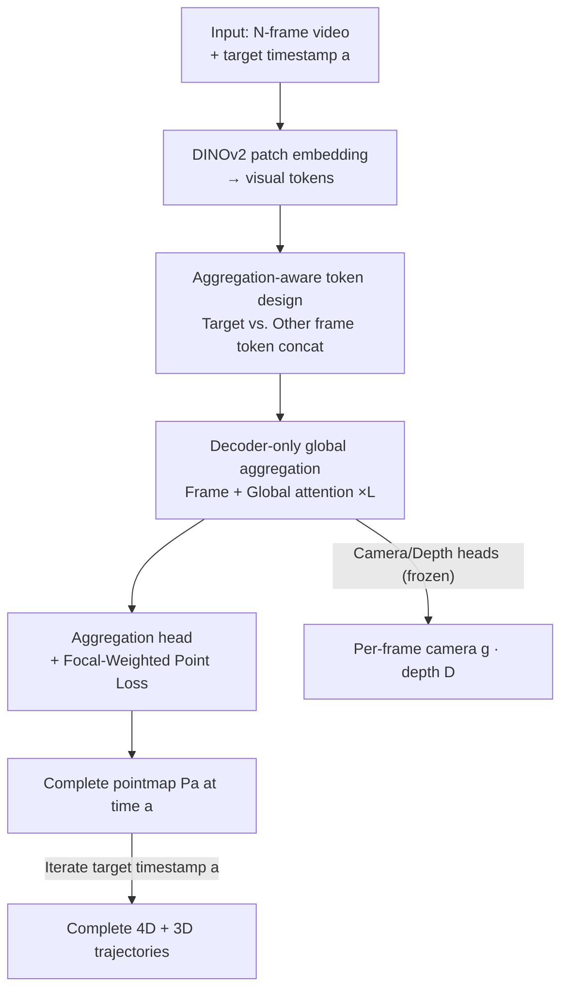

# Complet4R: Geometric Complete 4D Reconstruction

**Conference**: CVPR 2026  
**Paper**: [CVF Open Access](https://openaccess.thecvf.com/content/CVPR2026/html/Wang_Complet4R_Geometric_Complete_4D_Reconstruction_CVPR_2026_paper.html)  
**Code**: To be open-sourced (authors committed to release)  
**Area**: 3D Vision  
**Keywords**: 4D Reconstruction, Dynamic Scenes, Geometric Completion, 3D Point Tracking, decoder-only transformer  

## TL;DR
Complet4R redefines "dynamic scene 4D reconstruction" as "aggregating observed geometry from all frames in a video into a complete geometry for each target timestamp (including parts occluded in that frame but visible in others)." This is implemented end-to-end using a decoder-only transformer with switchable target-timestamp aggregation tokens, achieving SOTA on a self-built 4D complete reconstruction benchmark and in 3D point tracking.

## Background & Motivation

**Background**: Reconstructing dynamic 3D scenes from monocular video ("4D reconstruction") currently favors lifting motion analysis from the 2D pixel plane to 3D point space—estimating dense pointmaps and inter-frame correspondences. Representative works in the DUSt3R/MonST3R/St4RTrack lineage represent dynamic scenes as "temporally coherent 3D videos," with St4RTrack utilizing a dual-branch architecture for simultaneous reconstruction and tracking.

**Limitations of Prior Work**: The dominant paradigm in these methods is **pairwise**—performing inference only between two frames at each step. This leads to three cascading issues: (1) errors accumulate and drift along the sequence without global regularization; (2) intermediate representations (pointmaps / 3D flow) are **frame-centric**, reconstructing only the **visible** geometry of the current frame; (3) consequently, when an object part is occluded in the current frame but visible in others, that geometric information is lost—resulting in reconstruction results that are **incomplete** in both space and time.

**Key Challenge**: Dynamic objects are only partially revealed in any single frame, whereas "complete geometry" naturally requires stitching together multi-frame observations across time. The pairwise paradigm fails to aggregate across long ranges and only regresses visible geometry, making it structurally incapable of producing a "complete 4D representation for a specific moment."

**Goal**: For **every timestamp** $a$ in a sequence, reconstruct a **complete** 3D geometry $P_a$—containing both the visibility of that frame itself and the occluded parts that must be inferred and aligned from other frames via motion.

**Key Insight**: The authors unify "reconstruction" and "completion" into a single task—**directly accumulating the full sequence context onto each frame**. Once the geometry of each frame is completed from all observations, spatio-temporal consistency is "baked in" from the start, rather than being stitched together from pairwise results post-hoc.

**Core Idea**: A decoder-only transformer processes the entire video globally, equipped with a set of "aggregation tokens" to specify the target timestamp for completion. The model aligns and transports geometric cues from other frames to the target timestamp, outputting a complete pointmap for that moment. Switching the target timestamp generates a complete and consistent 4D representation, with 3D point trajectories as a byproduct.

## Method

### Overall Architecture

Complet4R is an end-to-end feed-forward framework. Given $N$ consecutive RGB video frames $\{I_i\}_{i=0}^{N-1}$ and a target (aggregation) timestamp $a$, it outputs an aggregated pointmap $P_a^i$ (transporting/aligning all frames to time $a$), camera parameters $g_i\in\mathbb{R}^9$, and depth maps $D_i$ for each frame, represented as a mapping $f\big((I_i)_{i=0}^{N-1},a\big)=(P_a^i,g_i,D_i)_{i=0}^{N-1}$.

The workflow is as follows: Each frame is first encoded into visual tokens using DINOv2 patch embedding. Several sets of special tokens are then concatenated: **aggregation tokens** (distinguishing "target frame" vs. "other frames"), camera tokens, and registration tokens to align into a unified coordinate system. This token sequence enters an $L$-layer transformer, alternating between **frame attention** and **global attention** in each layer. This allows target frame aggregation tokens and other frame aggregation tokens to exchange temporal information via self-attention, gradually aligning features to the target frame. Finally, three heads (camera, depth, and aggregation) decode the results. The **aggregation head** is a novel addition that takes per-frame features and predicts the 3D representation aligned to the target timestamp. Concatenating the aggregated outputs from all frames yields a complete, consistent pointmap from the target frame's perspective. Running this for each frame as target $a$ yields the full 4D reconstruction; the accumulated temporal consistency directly provides continuous 3D trajectories (3D tracking as a byproduct).

### Key Designs

**1. Geometric Complete 4D Reconstruction: Reframing "Reconstruction" as "Geometric Aggregation/Completion towards a Target Timestamp"**

This is the core of the paper. Previous methods (e.g., MonST3R) only regress the **visible** pointmap for each timestamp, resulting in spatio-temporally incomplete geometry. This work redefines the task: given target timestamp $a$, the model must aggregate geometric cues from **all other frames** $\{I_i\}_{i\neq a}$ (both static background and moving objects) to infer a **complete** pointmap $P_a$ at time $a$, explicitly reconstructing parts of moving objects occluded in frame $a$ but visible in others. This step is critical because "completing occluded parts" forces the model to **implicitly perform cross-time motion causal reasoning**: to move points from other frames to the correct position at the target time, the model must understand how these points moved between the two timestamps. The task definition itself embeds "temporal consistency" into the objective rather than stitching it post-hoc. It also naturally implies 3D tracking—treating each frame as the target for reconstruction results in temporal alignment equivalent to continuous trajectories.

**2. Aggregation-aware token design: Signaling the model "which frame to complete"**

To perform aggregation with a "switchable target timestamp," the model needs a signal indicating the current target. The authors introduce aggregation tokens $t^D$: two sets are initialized, $t^D_a$ for the target timestamp and $t^D_{/a}$ shared by all other timestamps. By concatenating these to the per-frame visual tokens, the model explicitly identifies the aggregation target. Changing $a$ teaches Complet4R to pull geometric cues from other frames toward $a$. This is paired with camera and registration tokens from VGGT, with registration tokens also split into two sets ($t^R_1$ for the first frame and $t^R_{2:N}$ for others) to learn a unified representation in the **first frame's coordinate system**. Ablations show that concatenation outperforms addition (Table 3), as it preserves independent semantic channels for aggregation tokens.

**3. Decoder-only global aggregation: Transporting geometry to the target frame via two-level attention**

Addressing the limitations of pairwise paradigms (limited view, error accumulation, lack of global regularization), Complet4R uses a decoder-only transformer to digest the entire video **globally**. Each layer alternates between two types of attention: **frame attention** for intra-frame token interaction and **global attention** for cross-frame self-attention (especially between target and other aggregation tokens). This process **gradually aligns all frame features to the target frame**, fusing observations from past and future frames to synthesize complementary views and reconstruct globally consistent 3D. The architecture is built on VGGT: camera and depth heads are inherited and **frozen**, with only the point head replaced by a new aggregation head (inherited parameters then fine-tuned). This reuses strong geometric priors while training minimal parameters for the "4D completion" task.

**4. Focal-Weighted Point Loss: Concentrating supervision on misaligned hard samples**

The most difficult parts to supervise in 4D completion are dynamic regions with large alignment errors—these points, transported after being occluded, are most prone to error but comprise a small portion of the point cloud. The authors design a focal-style point weight $w_i^a=|\beta e_i^a|^\gamma$, where $e_i^a=\hat{P}_i^a-P_i^a$ is the alignment error. Higher errors yield higher weights, adaptively focusing supervision on hard regions. The full point loss is:

$$L_{point}=\sum_{i=1}^{N}\Big(\|\hat{\Sigma}_{i,a}^P\odot w_i^a\odot(\hat{P}_i^a-P_i^a)\|+\|\hat{\Sigma}_{i,a}^P\odot(\nabla\hat{P}_i^a-\nabla P_i^a)\|-\alpha\log\hat{\Sigma}_{i,a}^P\Big),$$

where $\hat{\Sigma}_{i,a}^P$ is the predicted uncertainty map (aleatoric weighting), the second term is gradient (normal) consistency, and the third is an uncertainty regularizer. $\odot$ denotes broadcast multiplication. This "Focal" configuration proved more stable than simply scaling dynamic points (Table 3).

### Loss & Training
The model is initialized from VGGT with camera/depth heads frozen; only the aggregation head is trained. It is trained using AdamW for 10 epochs with a cosine scheduler (peak LR $1\text{e}{-5}$, 0.5-iteration warmup). Input frames are resized to long-edge ≤518 with random aspect ratios (0.5–3.4) and augmentations (color jitter, blur, grayscale). Training took 23 hours on 8×A100. Data sources include Point Odyssey, Dynamic Replica, and SAIL-VOS 3D (processed into short clips with ground truth 3D trajectories).

## Key Experimental Results

### Main Results

4D Complete Reconstruction (SAIL-VOS 3D-test). Metrics: Accuracy↓, Completion↓, Normal Consistency↑ (Mean/Median). Comparisons use St4RTrack results aggregated post-hoc.

| Method | Acc.↓ (Mean/Med) | Complet.↓ (Mean/Med) | N.C.↑ (Mean/Med) |
|------|------|------|------|
| St4RTrack-seq | 0.92 / 0.71 | 3.10 / 0.17 | 0.48 / 0.47 |
| St4RTrack-pairs | 0.94 / 0.77 | 2.67 / 0.14 | 0.46 / 0.44 |
| **Ours** | **0.50 / 0.37** | **0.26 / 0.11** | **0.49 / 0.49** |

Accuracy mean improved from 0.92 to 0.50 (~46% relative gain), and Completion mean improved by an order of magnitude (3.10 to 0.26), validating the task of completing occluded geometry.

3D Point Tracking (WorldTrack). Metrics: APD↑, EPE↓.

| Method | PO APD↑/EPE↓ | DR APD↑/EPE↓ | ADT APD↑/EPE↓ | PStudio APD↑/EPE↓ |
|------|------|------|------|------|
| SpaTracker | 51.20 / 46.95 | 58.65 / 108.28 | 67.65 / 16.28 | 62.59 / 30.94 |
| MonST3R | 39.36 / 64.52 | 51.86 / 53.13 | 67.92 / 15.78 | 51.32 / 45.68 |
| St4RTrack | 68.72 / 29.70 | 68.13 / 29.61 | 75.34 / 12.12 | 69.67 / 26.37 |
| **Ours** | **80.17 / 16.07** | **80.65 / 15.99** | **77.34 / 9.72** | **76.88 / 18.52** |

Ours leads across all datasets; APD on PO/DR is ~12 points higher than St4RTrack.

### Ablation Study

| Config | Loss | Agg. Repr. | Agg. Token | Acc.↓ (Mean) | Complet.↓ (Mean) | N.C.↑ (Mean) |
|------|------|------|------|------|------|------|
| (1) | Dynamic | Endpoint | Concat | 0.50 | 0.26 | 0.48 |
| (2) | Focal | Offset | Concat | 0.63 | 0.50 | 0.44 |
| (3) | Focal | Endpoint | Add | 0.57 | 0.32 | 0.50 |
| **Full** | **Focal** | **Endpoint** | **Concat** | **0.50** | **0.26** | **0.49** |

### Key Findings
- **Dramatic Completion Gains**: The improvement from 3.10 to 0.26 indicates that baselines lack the ability to recover occluded geometry.
- **Endpoint > Offset**: Direct supervision of absolute coordinates at the target time is more stable than supervising relative offsets, which couple errors to reference frames.
- **Concat > Add**: Concatenation preserves independent semantic channels for the aggregation signal.
- **Focal > Dynamic Weighting**: Adaptive weighting based on alignment error is more effective than fixed weighting for dynamic points.

## Highlights & Insights
- **Unifying Reconstruction and Tracking**: By targeting "complete geometry aggregation," temporal consistency is structural, and 3D tracking becomes a natural byproduct.
- **Switchable Aggregation Tokens**: The use of a token pair (target/other) allows controllable aggregation, essentially creating an addressable query for the target perspective.
- **Efficient Leverage of VGGT**: Freezing most of the backbone and only tuning the aggregation head exploits large-scale static priors while keeping training costs low (8×A100 for 23h).

## Limitations & Future Work
- **Observation Dependency**: If a region is never seen in any frame of the video, it cannot be recovered via aggregation. Completion is limited to cross-frame fusion, not generative hallucination.
- **Synthetic Data Bias**: Datasets used are primarily synthetic or restricted domains; generalization to real-world extremes (lighting, textureless areas) is not fully validated.
- **Self-built Benchmark**: As a new task, comparisons are limited to modified versions of existing baselines.
- **Sequence Length**: Global attention scaling with frame count poses computational challenges for long videos that were not extensively reported.

## Related Work & Insights
- **vs St4RTrack**: While St4RTrack relies on pairwise correspondences and post-hoc aggregation (subject to drift), Complet4R uses a single global feed-forward pass.
- **vs MonST3R**: MonST3R focuses on visible pointmaps; our task definition explicitly targets occluded geometry completion.
- **vs VGGT**: Complet4R extends the static multi-view backbone to dynamic scenes via aggregation tokens and heads.

## Rating
- Novelty: ⭐⭐⭐⭐⭐ Proposes "complete 4D reconstruction" and unifies tasks into a single feed-forward framework.
- Experimental Thoroughness: ⭐⭐⭐⭐ Solid results across tasks, though limited by the novelty of the benchmark and baseline comparisons.
- Writing Quality: ⭐⭐⭐⭐ Clear motivation and architecture.
- Value: ⭐⭐⭐⭐⭐ Complete 4D representation is foundational for world models and physical reasoning.

<!-- RELATED:START -->

## Related Papers

- [\[CVPR 2026\] 4D Primitive-Mâché: Glueing Primitives for Persistent 4D Scene Reconstruction](4d_primitive-mache_glueing_primitives_for_persistent_4d_scene_reconstruction.md)
- [\[CVPR 2026\] BulletGen: Improving 4D Reconstruction with Bullet-Time Generation](bulletgen_improving_4d_reconstruction_with_bullet-time_generation.md)
- [\[CVPR 2026\] CARI4D: Category Agnostic 4D Reconstruction of Human-Object Interaction](cari4d_category_agnostic_4d_reconstruction_of_human_object_interaction.md)
- [\[CVPR 2026\] GeoDiff4D: Geometry-Aware Diffusion for 4D Head Avatar Reconstruction](geodiff4d_geometry-aware_diffusion_for_4d_head_avatar_reconstruction.md)
- [\[CVPR 2026\] LASER: Layer-wise Scale Alignment for Training-Free Streaming 4D Reconstruction](laser_layer-wise_scale_alignment_for_training-free_streaming_4d_reconstruction.md)

<!-- RELATED:END -->
