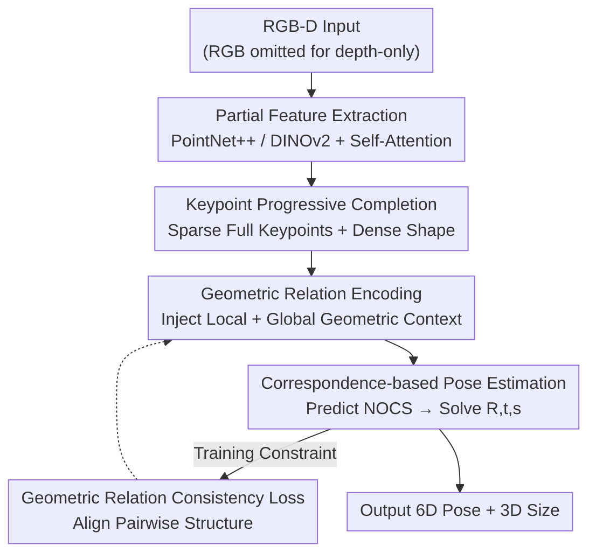

# ComPose: A Unified Completion-Pose Framework for Robust Category-Level Object Pose Estimation

**Conference**: CVPR2026  
**arXiv**: [2605.25553](https://arxiv.org/abs/2605.25553)  
**Code**: https://renhuan1999.github.io/ComPose (Project Page)  
**Area**: 3D Vision / Category-Level 6D Pose Estimation  
**Keywords**: Category-level pose estimation, point cloud completion, keypoints, NOCS, geometric relation consistency

## TL;DR
ComPose incorporates "point cloud completion" as a task-driven internal module into a category-level 6D pose estimation network. By utilizing keypoint-based progressive completion, it restores the complete object geometry directly in the observation space. Combined with geometric relation encoding and a geometric relation consistency loss, it improves the $10°2\text{cm}$ accuracy for REAL275 depth-only from 68.5% to 77.8% without relying on category shape priors, while achieving a faster inference speed (38.4 FPS).

## Background & Motivation
**Background**: Category-level object pose estimation aims to predict the 6D pose (rotation $\bm{R}$, translation $\bm{t}$) and 3D size $\bm{s}$ of any object within a predefined category (e.g., camera, mug, laptop) without relying on instance-level CAD models. The mainstream approach involves extracting geometric features from a partial point cloud back-projected from a depth map, then either regressing the pose directly or predicting NOCS (Normalized Object Coordinate Space) coordinates as an intermediate representation to fit the pose using algorithms like Umeyama.

**Limitations of Prior Work**: Depth cameras are restricted by self-occlusion, failing to capture the back of objects, which results in naturally "incomplete" back-projected point clouds. Directly encoding geometry on incomplete point clouds leaves the network blind to the full shape, making pose inference unstable. One category of work introduces category-level shape priors (such as SPD) to complete shape semantics at the feature level, but they still operate on the incomplete observation space and do not truly resolve the geometric absence. Furthermore, acquiring priors requires collecting massive CAD models and training an auxiliary autoencoder, which is time-consuming and expensive.

**Key Challenge**: Completing full geometry is indeed beneficial—the authors conducted an oracle experiment by replacing the partial point cloud input of AG-Pose (depth-only) with the ground truth full point cloud, causing the $10°2\text{cm}$ accuracy to soar from 68.5% to 91.7%, indicating a huge potential ceiling. However, naively treating "completion" as an independent pre-processing step in a two-stage cascade leads to error accumulation and additional computational overhead: even with end-to-end joint training, the $10°2\text{cm}$ accuracy only improves slightly from 68.5% to 71.0%, while the inference speed drops from 33.5 FPS to 21.5 FPS. The potential of completion is not fully exploited, and efficiency is sacrificed.

**Goal**: How to effectively and efficiently utilize the complete geometric cues recovered through completion to enhance pose estimation?

**Key Insight**: Instead of treating completion as "pre-processing," it should be viewed as an internal, task-driven component of the pose network that directly serves the keypoints required for pose inference.

**Core Idea**: Use "keypoint-based progressive completion"—predicting a set of sparse complete keypoints first, then expanding dense point sets around them—to unify completion and pose estimation within a single network. This allows the keypoints themselves to carry full geometry, thereby achieving completion while eliminating cascade overhead.

## Method

### Overall Architecture
The input is a single RGB-D image (the RGB branch is omitted for depth-only). First, an instance mask is obtained using Mask R-CNN to crop the RGB image and segmented depth, which is then back-projected and downsampled into a partial point cloud $\bm{P}^{\mathrm{part}}\in\mathbb{R}^{N^{\mathrm{part}}\times 3}$. The pipeline consists of four steps: **Partial Feature Extraction** (PointNet++ geometric features + optional DINOv2 semantic features, processed via self-attention to get $\bm{F}^{\mathrm{part}}$) → **Keypoint-based Progressive Completion** (recovering sparse complete keypoints $\bm{P}^{\mathrm{kpt}}$ and dense shape $\bm{P}^{\mathrm{com}}$ from incomplete observations) → **Geometric Relation Encoding** (injecting local and global geometric context into keypoint features) → **Correspondence-based Pose Estimation** (MLP predicts NOCS coordinates for keypoints, then solves the pose from $\bm{P}^{\mathrm{kpt}}$↔$\bm{O}^{\mathrm{kpt}}$ correspondences). During training, an additional "geometric relation consistency loss" is used to constrain the pairwise structural consistency between the observed keypoints and their NOCS predictions. The key design choice is that ComPose does not simply append a completion network to AG-Pose; instead, it replaces the original keypoint detection module of AG-Pose with a "keypoint completion module"—since completion and keypoint detection are essentially the same task, there is zero additional latency.

### Key Designs

**1. Unified Completion-Pose Framework: Completion as an Internal Component rather than Pre-processing**

Addressing the pain point of "two-stage cascade error accumulation + efficiency loss," ComPose does not attach a completion network outside the pose network but embeds completion inside, sharing the same set of features. Specifically, it **replaces** the original keypoint detection module in AG-Pose with a keypoint completion module. Since the completion needs to predict a set of complete keypoints, it naturally serves as the keypoints required for pose estimation, merging the two without additional inference time. By further reducing the number of keypoints from 96 to 64, removing self-attention in NOCS prediction, and using the Umeyama algorithm instead of a depth estimator for pose fitting, ComPose achieves 38.4 FPS in depth-only mode (compared to 33.5 FPS for the original AG-Pose). It achieves a win-win of "accuracy from completion and efficiency from unification," which naive cascading (21.5 FPS, 71.0% accuracy) cannot achieve.

**2. Keypoint-based Progressive Completion: Recovering Full Geometry in Observation Space at Arbitrary Poses**

Classical completion methods (e.g., FoldingNet, PCN) assume objects are aligned to a canonical space, but here objects are at arbitrary unknown poses, which is far more difficult. ComPose’s progressive approach consists of two steps. First, **Coarse Keypoint Generation**: the global feature $\bm{f}^{\mathrm{global}}$ is obtained via global pooling of $\bm{F}^{\mathrm{part}}$ and passed through an MLP to predict candidate keypoints $\bm{C}^{\mathrm{miss}}$ indicating "missing regions"; simultaneously, "visible region" candidates $\bm{C}^{\mathrm{vis}}$ are obtained via Farthest Point Sampling on the partial point cloud. The two groups are combined into a candidate set $\bm{C}^{\mathrm{cand}}$, and a scoring MLP provides scores $\bm{r}$ for each candidate. The top-$N^{\mathrm{kpt}}$ are selected as initial coarse keypoints $\bm{C}^{\mathrm{kpt}}$. This **adaptive selection** allows the ratio of missing to visible keypoints to adjust dynamically based on the incompleteness of each observation, making it more flexible than a fixed ratio. Next is **Progressive Shape Completion**: keypoint queries $\bm{Q}^{\mathrm{kpt}}=\operatorname{Repeat}(\bm{f}^{\mathrm{global}})+\operatorname{PE}(\bm{C}^{\mathrm{kpt}})$ are constructed using the position embeddings of $\bm{C}^{\mathrm{kpt}}$ and global features. A Cross-Attention/Self-Attention decoder interacts with $\bm{F}^{\mathrm{part}}$ to refine keypoint features $\bm{F}^{\mathrm{kpt}}$ and coordinates $\bm{P}^{\mathrm{kpt}}$. Finally, each keypoint feature is concatenated with its coordinates and passed through an MLP to fold $N^{\mathrm{fold}}$ local points around it, aggregating into a dense complete point cloud $\bm{P}^{\mathrm{com}}$ ($N^{\mathrm{com}}=N^{\mathrm{kpt}}N^{\mathrm{fold}}$). Thus, keypoints no longer just "see" the visible parts but carry complete geometry from a global perspective, which is fundamental for robust pose inference.

**3. Geometric Relation Encoding: Adding Local and Global Geometric Context to Keypoint Features**

Merely having completed keypoint coordinates is insufficient; keypoint features must "understand" their geometric relationship on the object. Following AG-Pose, for the $n$-th keypoint $\bm{P}^{\mathrm{kpt}}_n$, $N^{\mathrm{knn}}$ nearest neighbors are sampled from $\bm{P}^{\mathrm{part}}$, and two types of geometric relation embeddings are calculated: local $\bm{E}^{\mathrm{l}}_n=\operatorname{MLP}(\operatorname{Repeat}(\bm{P}^{\mathrm{kpt}}_n)-\bm{P}^{\mathrm{knn}}_n)$ (relative displacement from keypoint to neighbors) and global $\bm{E}^{\mathrm{g}}_n=\operatorname{MLP}(\operatorname{Repeat}(\bm{P}^{\mathrm{kpt}}_n)-\bm{P}^{\mathrm{kpt}})$ (relative displacement between keypoints). Local and global contexts are injected into $\bm{F}^{\mathrm{kpt}}$ via alternating cross-attention and pooling to obtain geometry-aware features $\bm{F}^{\mathrm{geo}}$ for per-keypoint NOCS prediction. Ablations show that this encoding alone brings a 4.3% improvement in $5°2\text{cm}$, serving as the key step in translating "position" into "discriminative geometric semantics."

**4. Geometric Relation Consistency Loss: Pairwise Structural Constraints instead of Point-wise Regression**

Previously, NOCS coordinates were supervised using point-wise L2/Smooth-L1 regression, which only penalizes individual coordinate deviations. The issue is that two sets of NOCS coordinates might have similar point-wise average errors but significantly different overall shapes—point-wise losses fail to capture such "global structural misalignment," leading to instability when solving rigid transformations from correspondences. This paper proposes a geometric relation consistency loss: a reference relation matrix $\bm{G}^{\mathrm{kpt}}$ is constructed using pairwise L2 distances between scaled keypoint coordinates $\bm{P}^{\mathrm{kpt}}/\|\bm{s}^{\mathrm{gt}}\|_2$, and a similar matrix $\bm{G}^{\mathrm{nocs}}$ is constructed for predicted NOCS coordinates $\bm{O}^{\mathrm{kpt}}$, constraining their consistency:

$$\mathcal{L}^{\mathrm{geo}}=\frac{1}{N^{\mathrm{kpt}}\times N^{\mathrm{kpt}}}\sum\nolimits_{n,m}(\bm{G}^{\mathrm{kpt}}_{n,m}-\bm{G}^{\mathrm{nocs}}_{n,m})^2.$$

This pairwise distance constraint captures higher-order structural cues, forcing the predicted coordinates to align with the global structure of the observed geometry, thereby solving for more globally consistent poses. In ablations, it adds an additional 1.8% ($5°2\text{cm}$) on top of the encoding.

### Loss & Training
The total loss is a weighted sum of four terms: $\mathcal{L}^{\mathrm{all}}=\lambda^{\mathrm{com}}\mathcal{L}^{\mathrm{com}}+\lambda^{\mathrm{score}}\mathcal{L}^{\mathrm{score}}+\lambda^{\mathrm{corr}}\mathcal{L}^{\mathrm{corr}}+\lambda^{\mathrm{geo}}\mathcal{L}^{\mathrm{geo}}$. Here, $\mathcal{L}^{\mathrm{com}}$ is the completion loss, where the CAD model is transformed to the observation space using ground truth pose to get $\bm{M}^{\mathrm{obs}}$, and Chamfer Distance is calculated for $\{\bm{C}^{\mathrm{miss}},\bm{P}^{\mathrm{kpt}},\bm{P}^{\mathrm{com}}\}$; $\mathcal{L}^{\mathrm{score}}$ supervises candidate scoring with ground truth scores $\bm{r}^{\mathrm{gt}}_n=\exp(-\bm{d}_n/\tau)$ ($\bm{d}_n$ is the distance to the nearest point on $\bm{M}^{\mathrm{obs}}$, $\tau=0.05$), where candidates near the ground truth shape receive high scores and outliers are filtered; $\mathcal{L}^{\mathrm{corr}}$ is the point-wise NOCS regression; $\mathcal{L}^{\mathrm{geo}}$ is the consistency loss mentioned above. Weights are $\lambda^{\mathrm{com}}=15,\lambda^{\mathrm{score}}=1,\lambda^{\mathrm{corr}}=2,\lambda^{\mathrm{geo}}=1$. Key hyperparameters: $N^{\mathrm{part}}=1024$, $N^{\mathrm{kpt}}=64$, $N^{\mathrm{com}}=1024$ ($N^{\mathrm{fold}}=16$), $N^{\mathrm{miss}}=64, N^{\mathrm{vis}}=32$, feature dimension $D$ is 256 for RGB-D and 128 for depth-only. Adam optimizer, initial LR 0.001 with cosine annealing, trained on a single RTX3090Ti with batch size 24 for 200K iterations.

## Key Experimental Results

### Main Results
REAL275 (depth-only setting, mAP %): ComPose significantly leads in all 6D pose metrics without using shape priors.

| Method | Prior | IoU75 | 5°2cm | 5°5cm | 10°2cm | 10°5cm |
|------|------|-------|-------|-------|--------|--------|
| HS-Pose | × | 74.7 | 46.5 | 55.2 | 68.6 | 82.7 |
| Query6DoF | × | 76.1 | 49.0 | 58.9 | 68.7 | 83.0 |
| AG-Pose* | × | 75.6 | 48.8 | 58.8 | 68.5 | 80.8 |
| DR-Pose | ✓ | 68.2 | 41.7 | 46.0 | 67.7 | 76.3 |
| **ComPose** | × | **77.0** | **55.6** | **61.3** | **77.8** | **85.0** |

Compared to the keypoint baseline AG-Pose*, $5°2\text{cm}$ improved by +6.8% and $10°2\text{cm}$ by +9.3% (the abstract/intro notes "9.1%", ⚠️ follow the table's 9.3). In the RGB-D setting, ComPose further reaches 62.1 for $5°2\text{cm}$ and 81.8 for $10°2\text{cm}$, outperforming AG-Pose (57.0 / 75.1) and other prior-free methods.

HouseCat6D (more difficult, contains occlusion, depth-only): ComPose IoU50 65.1 vs AG-Pose* 59.9 (+5.2), $5°2\text{cm}$ 11.8 vs 9.7 (+2.1); under RGB-D, IoU50 80.6 and $5°2\text{cm}$ 25.8, both new SOTAs.

### Ablation Study
Conducted on REAL275 depth-only (Metrics: $5°2\text{cm}$ / $10°5\text{cm}$).

| Configuration | 5°2cm | 10°5cm | Description |
|------|-------|--------|------|
| Full model | 55.6 | 85.0 | Complete model |
| Complete visible part only (partial instance) | 49.6 | 82.0 | Replaced with AG-Pose style partial reconstruction, dropped 6.0% |
| Remove dense $\bm{P}^{\mathrm{com}}$ | 54.9 | 83.3 | Dense completion improves 10°5cm by +1.7% |
| Static Query (no coarse keypoints) | 51.6 | 82.0 | Progressive completion +4.0% |
| AdaPoinTr-style completion | 53.4 | 83.8 | Ours' progressive style +2.2% |
| Remove adaptive selection (Nvis=0) | 53.8 | 84.0 | Adaptive selection +1.8% |
| Remove Geo. Relation Enc. + Consistency | 49.5 | 79.7 | Encoding contribution +4.3% |
| Encoding only, remove Consistency | 53.8 | 83.5 | Consistency loss adds another +1.8% |

### Key Findings
- **Full geometry is the fundamental source of performance upper bounds**: The oracle experiment replacing input with GT full point clouds jumped $10°2\text{cm}$ from 68.5% to 91.7%, proving the "completion" direction is correct; ComPose translates this potential into 77.8%.
- **Unification > Cascading**: Naive two-stage joint training only reaches 71.0% and slows to 21.5 FPS. ComPose instead speeds up to 38.4 FPS—making completion an internal module gains accuracy without sacrificing efficiency.
- **Adaptive keypoint selection in progressive completion is indispensable**: Fixed or non-selective strategies (PoinTr, Static Query, Nvis=0) all significantly decrease performance; balancing missing and visible areas dynamically is key.
- **Stronger occlusion resistance**: After adding a manual 25% occlusion mask, AG-Pose's $5°5\text{cm}$ drops by 16.5%, while ComPose only drops by 12.6%, showing full geometric cues are effective against external occlusion.
- **Leading completion quality**: On observation space completion for the REAL275 camera category, ComPose (RGB-D) achieves a unit-scale Chamfer Distance of 4.20 (×10⁻³), better than SPD 8.89, SGPA 5.51, and DR-Pose 5.26, which rely on priors for canonical reconstruction.

## Highlights & Insights
- **The "completion is keypoint detection" unification** is the cleverest aspect: The authors realized that pose estimation inherently requires a set of complete keypoints, and what completion predicts is exactly that. By replacing the keypoint detection module with a completion module, they merge two tasks into one with zero overhead—this is the root cause of efficiency, rather than simply training two networks end-to-end.
- **Direct completion in the observation space at arbitrary poses** is a counter-intuitive but valuable choice: Classical completion assumes canonical alignment. This paper dares to complete in the unaligned observation space, avoiding the "pose first to align, align first to complete" chicken-and-egg loop, and completely bypasses the CAD collection cost for shape priors.
- **Geometric relation consistency loss** provides an elegant answer to the old problem of "point-wise regression missing global structure": Using a pairwise distance matrix to constrain higher-order structures can be directly transferred to any task requiring rigid transformation solving from correspondences (registration, SLAM loop closure, hand-object interaction).

## Limitations & Future Work
- Still relies on Mask R-CNN for instance masks; segmentation quality propagates to completion and pose (partially mitigated by the scoring mechanism filtering outliers, but not fully resolved).
- Completion supervision requires CAD models at training time to transform into observation space as ground truth ($\bm{M}^{\mathrm{obs}}$); how to extend to categories/datasets without CAD models is not discussed.
- Evaluation is limited to three desktop-level category benchmarks (REAL275 / CAMERA25 / HouseCat6D); generalization to larger scales, highly reflective, or transparent objects (partially covered in HouseCat6D but limited categories) hasn't been deeply explored.
- The geometric relation consistency loss is $O(N^{\mathrm{kpt}2})$ pairwise, increasing cost if the number of keypoints scales up; currently $N^{\mathrm{kpt}}=64$ is manageable, but scalability for denser scenes remains to be verified.

## Related Work & Insights
- **vs AG-Pose**: Both are keypoint-based and share geometric relation encoding ideas. However, AG-Pose only detects keypoints on partial point clouds (partial instance reconstruction). ComPose replaces this with full shape completion and adds the geometric relation consistency loss; these two points lead to the +9.3% in $10°2\text{cm}$ for depth-only.
- **vs Shape-Prior Methods (SPD / SGPA / DPDN / GCE-Pose)**: Prior methods reconstruct CAD in canonical space to provide indirect shape semantics but still operate on incomplete observations, requiring CAD collection and autoencoder training. ComPose uses no priors, completes in observation space directly, and achieves lower completion CD.
- **vs Completion-then-Pose (DR-Pose)**: DR-Pose uses an off-the-shelf completion network (PoinTr) to recover missing parts, but the completion results are only used to guide prior deformation and are decoupled from pose inference. ComPose makes completion an internal, tightly coupled component to avoid error accumulation.
- **vs General Point Cloud Completion (PoinTr / AdaPoinTr)**: These assume canonical alignment, do not constrain $\bm{C}^{\mathrm{miss}}$, and lack keypoint selection supervision. ComPose completes under arbitrary poses and explicitly supervises candidate scoring, outperforming AdaPoinTr-style strategies by 2.2% in ablations.

## Rating
- Novelty: ⭐⭐⭐⭐⭐ "Completion is keypoint detection" unification + direct observation space completion + geometric relation consistency loss; all three are unconventional.
- Experimental Thoroughness: ⭐⭐⭐⭐⭐ Three benchmarks × RGB-D/depth-only × oracle/efficiency/occlusion/completion quality + 4 ablation tables; complete chain of evidence.
- Writing Quality: ⭐⭐⭐⭐ Motivation derivation (oracle → two-stage failure → unification) is clear and powerful; formulas/notations are dense but self-consistent.
- Value: ⭐⭐⭐⭐⭐ SOTA performance without shape priors and faster speed; highly practical for real-time scenarios like robotic grasping.

<!-- RELATED:START -->

## Related Papers

- [\[CVPR 2026\] SE(3)-Equivariance with Geometric and Topological Guidance for Category-Level Object Pose Estimation](se3-equivariance_with_geometric_and_topological_guidance_for_category-level_obje.md)
- [\[CVPR 2026\] WildPose: A Unified Framework for Robust Pose Estimation in the Wild](wildpose_a_unified_framework_for_robust_pose_estimation_in_the_wild.md)
- [\[CVPR 2026\] SCAPO: Self-Supervised Category-Level Articulated Pose Estimation from a Single 3D Observation](scapo_self-supervised_category-level_articulated_pose_estimation_from_a_single_3.md)
- [\[CVPR 2026\] DICArt: Advancing Category-level Articulated Object Pose Estimation in Discrete State-Spaces](dicart_advancing_category-level_articulated_object_pose_estimation_in_discrete_s.md)
- [\[ICCV 2025\] Unified Category-Level Object Detection and Pose Estimation from RGB Images using 3D Prototypes](../../ICCV2025/3d_vision/unified_category-level_object_detection_and_pose_estimation_from_rgb_images_usin.md)

<!-- RELATED:END -->
