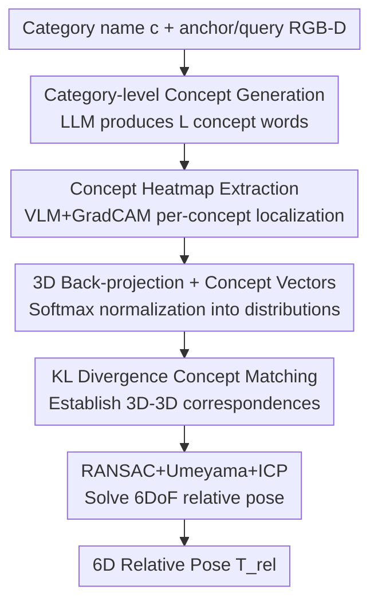

# ConceptPose: Training-Free Zero-Shot Object Pose Estimation using Concept Vectors

**Conference**: CVPR 2026  
**Paper**: [CVF Open Access](https://openaccess.thecvf.com/content/CVPR2026/html/Kuang_ConceptPose_Training-Free_Zero-Shot_Object_Pose_Estimation_using_Concept_Vectors_CVPR_2026_paper.html)  
**Code**: [Project Page stevenlk.xyz/conceptpose](https://stevenlk.xyz/conceptpose) (The paper provides a project page; the code link is to be confirmed ⚠️)  
**Area**: 3D Vision  
**Keywords**: 6D Pose Estimation, Zero-shot, Training-free, Vision Language Models (VLM), Concept Vectors  

## TL;DR
ConceptPose completely transforms 6D object pose estimation into a semantic matching task: an LLM automatically generates a series of textual "concepts" for an object category, then the explainability heatmaps (GradCAM) of a VLM are used to locate each concept across two images and back-project them into 3D. This yields a "concept vector" for each point. Finally, cross-view matching of these concept vectors paired with RANSAC directly calculates the relative pose. This process requires **no training and no CAD models**, yet improves the average ADD(-S) of the strongest baseline by **62.8%** across four real-world RGB-D benchmarks.

## Background & Motivation
**Background**: 6D object pose estimation is a fundamental capability for robotic grasping, AR, and autonomous navigation. While mainstream approaches (e.g., FoundationPose, Oryon, Horyon) have begun utilizing vision foundation models (DINO/DINOv2) as feature extractors, they still require **training an additional correspondence head or pose network** on top of the frozen backbone. This reliance on large-scale pose-annotated data—and sometimes CAD models—limits their flexibility.

**Limitations of Prior Work**: This "frozen backbone + trained head" paradigm has two major drawbacks: ① True generalization is bottlenecked by the trained head, which often fails in new scenes or for unseen objects. ② Upgrading to a stronger VFM is cumbersome as the head is tied to the specific old backbone and requires retraining. So-called "training-free" methods (like Any6D) actually depend on FoundationPose pre-trained on synthetic pose data or requires prior image-to-3D reconstruction.

**Key Challenge**: Self-supervised features like DINO exhibit semantic emergence but provide dense vectors that require a learned matching network to be useful. Conversely, while VLMs possess rich semantic understanding, they have long been treated merely as "feature extractors," wasting their potential for **language-driven spatial reasoning**. In other words, pure geometric or learning-based matching discards "language"—the natural medium humans use to describe object features.

**Key Insight**: The authors draw inspiration from human cognition—when humans judge how much an unseen object has "rotated," they first notice several salient features (the edge, finger rings, metallic texture, etc.) and establish correspondences by finding these **same features** from another perspective. This mechanism is naturally object-agnostic, and language is a natural medium for expressing these features, which can be abstracted as "concepts": semantic parts, geometric attributes, or affordances—essentially any "visually localizable property."

**Core Idea**: Instead of "learned geometric features," "concept vectors" are used for correspondence. An LLM generates concept words, and a VLM uses explainability heatmaps to locate these concepts in pixels and back-project them to 3D. Each 3D point carries a concept activation distribution, and 6DoF relative poses are solved directly via distribution similarity matching. To the authors' knowledge, this is the first zero-shot relative pose method that is both **training-free and model-free** (requiring no CAD).

## Method

### Overall Architecture
The problem is defined as **relative pose estimation from a single reference视角**: given two pose-less RGB-D observations of the same object—an anchor frame $A=\{I_a,D_a,M_a,K_a\}$ and a query frame $Q=\{I_q,D_q,M_q,K_q\}$ (where $I$ is RGB, $D$ is depth, $M$ is object mask, and $K$ is intrinsic parameters), plus a category name $c$ (e.g., "cup")—the goal is to estimate the 6DoF camera-to-camera transformation $T_{rel}=(R_{rel},t_{rel})$ such that corresponding 3D points satisfy $P_q = R_{rel}\cdot P_a + t_{rel}$. At inference, **no dataset training, CAD models, or pose ground truths are used**.

The pipeline is a clear sequential workflow: Category name $\rightarrow$ (LLM) a series of concept words $\rightarrow$ (VLM+GradCAM) dense heatmaps for each concept on both frames $\rightarrow$ Back-projection to 3D to obtain point clouds with concept vectors $\rightarrow$ Softmax normalization into concept distributions $\rightarrow$ Cross-frame KL divergence matching for 3D-3D correspondences $\rightarrow$ RANSAC + Umeyama + ICP to solve the pose.

### Key Designs

**1. Category-level Concept Generation: Letting Language Define "Where to Look"**

Matching relies on "features," but being training-free means features cannot be learned. The authors instead let the LLM "specify" the features. Given a category name $c$, a general-purpose LLM is queried to generate $L$ descriptive concept labels $\mathcal{L}=\{l_1,\dots,l_L\}$. Crucially, concepts are **not limited to semantic parts**: they can include geometry ("curved surface", "flat base"), affordances ("graspable region", "pourable opening"), or attributes ("round", "metal"). The prompt is structurally constrained to be cross-instance generalizable, externally visible in at least one view, and semantically orthogonal to reduce redundancy. Concepts are **generated only once per category** and reused across all instances of that class, making this step nearly zero-cost while outsourcing the "which features to match" problem to the language model's prior.

**2. Concept Heatmap Extraction: Repurposing Explainability for "Localization"**

How are these concept words located in an image? Language segmentation (like the SAM family) typically yields object-level binary masks and cannot express fine-grained concepts like "the top of a handle curve." The authors instead leverage **VLM explainability** tools. For each concept $l_i$, it is fed as a text prompt "$l_i$." to a VLM (SigLIP2-giant). **GradCAM** [40] is run on the vision encoder (post-layernorm layer), performing a weighted sum of activations based on gradients to obtain a spatial saliency map for that concept. The process involves cropping/scaling the RGB based on the object bbox, calculating the heatmap, and resizing it back to the original image coordinates. This results in an $(L,H,W)$ saliency tensor where each channel highlights regions aligned with concept $l_i$. Text embeddings are cached across frames for acceleration. The brilliance of this step lies in repurposing GradCAM—originally for "explaining model decisions"—as a dense "where is the concept" locator without any matching network.

**3. Concept Vectors + KL Divergence Matching: Establishing 3D-3D Correspondence via Distribution Similarity**

The 2D saliency maps are back-projected to 3D along pixels with valid depth. Each 3D point $p$ is associated with an $L$-dimensional concept vector $c(p)\in\mathbb{R}^L$, resulting in an anchor point cloud $P_a\in\mathbb{R}^{N_a\times3}$ and a query point cloud $P_q\in\mathbb{R}^{N_q\times3}$. (Two-stage statistical filtering is applied: kNN local outlier removal + global outlier removal based on distance to center, discarding points beyond $\mu+2.5\sigma$). Each concept vector is normalized into a probability distribution using softmax with temperature $\tau$:

$$c_i(\mathbf{p}) = \frac{\exp(s_i(\mathbf{p})/\tau)}{\sum_{j=1}^{L}\exp(s_j(\mathbf{p})/\tau)}$$

where $s(\mathbf{p})\in\mathbb{R}^L$ represents the raw saliency values. During matching, instead of Euclidean or Cosine distance, each point is treated as a "concept distribution," and **forward KL divergence** is used to measure the similarity between query point $i$ and anchor point $j$:

$$S_{ij} = -D_{\mathrm{KL}}\big(c(\mathbf{p}_q^i)\,\|\,c(\mathbf{p}_a^j)\big) = -\sum_{k=1}^{L} c_k(\mathbf{p}_q^i)\log\frac{c_k(\mathbf{p}_q^i)}{c_k(\mathbf{p}_a^j)}$$

For each query point, the anchor point with the maximum similarity (minimum KL) is selected as the correspondence $\mathbf{p}_a^{*(i)}=\arg\max_j S_{ij}$. Using concept distributions rather than single feature vectors ensures correspondences are built on "semantic consistency," making the system robust to lack of texture, object symmetry, and large viewpoint changes—areas where pure geometric matching (SIFT, ObjectMatch) typically fails.

**4. RANSAC + Umeyama + ICP Robust Solving: From Noisy Correspondences to Clean Poses**

Concept matching inevitably contains outliers. The authors use **RANSAC** [12] for robust estimation. Each iteration samples a minimal set of correspondences, solves for the similarity transform $(R,t)$ using **Umeyama** [47] in closed form, and counts inliers within a distance threshold. The best transform is refined using **ICP** based on geometric nearest neighbors. By default, 100,000 RANSAC iterations are performed with a 0.01m threshold and a fixed seed (seed=42). This step grounds the "semantic correspondence" into a "geometrically consistent pose," enabling the training-free pipeline to output precise 6DoF results.

> Additionally, an **optional voxelization module** is included for engineering acceleration: dense point clouds are normalized to a unit cube $[-0.5,0.5]^3$, discretized into a $64^3$ voxel grid, and concept vectors are mean-pooled within each voxel. This sparse representation is then un-normalized back to the camera frame. When enabled, the maximum correspondence count is reduced (10,000 $\rightarrow$ 5,000) and RANSAC iterations are halved. This serves as a practical deployment optimization rather than a core contribution, as it maintains accuracy while increasing speed.

### Loss & Training
**There is no training**—this is the primary selling point. The entire process requires zero parameter updates: the LLM (Gemini 2.5 Pro) generates concepts once per class, and the VLM (SigLIP2-giant-opt-patch16-384) performs only forward passes + GradCAM. Matching and solving utilize classical geometric algorithms. Experiments were conducted at FP16 precision on a consumer-grade RTX 4060 Ti (16G). The only "hyperparameters" are the number of concepts $L$, temperature $\tau$, and RANSAC settings, which the authors emphasize do not require per-object tuning.

## Key Experimental Results

### Main Results
On four real RGB-D benchmarks—REAL275, Toyota-Light (TYOL), YCB-Video (YCB-V), and LINEMOD (LM)—following the Oryon protocol (2000 anchor-query pairs per dataset), the paper reports ADD(-S) recall and BOP AR. The "TF" column indicates if the method is Training-Free.

| Method | TF | REAL275 ADD(-S) | TYOL ADD(-S) | YCB-V ADD(-S) | LM ADD(-S) | Mean ADD(-S) | Mean BOP AR |
|------|----|----|----|----|----|----|----|
| SIFT | ✗ | 21.6 | 16.5 | 13.9 | 10.8 | 15.7 | 27.3 |
| Oryon | ✗ | 34.9 | 22.9 | 12.8 | 20.4 | 22.8 | 31.3 |
| Horyon | ✗ | 51.6 | 25.1 | 22.6 | 27.6 | 31.7 | 38.5 |
| Any6D | ✗ | 53.5 | 32.2 | – | – | (42.9†) | (47.2†) |
| One2Any | ✗ | 41.0 | 34.6 | – | – | (37.8†) | (48.5†) |
| **ConceptPose** | ✓ | **71.5** | **55.0** | **41.2** | **38.6** | **51.6 (63.3†)** | **44.0 (56.0†)** |
| Δ vs. Best baseline | | +33.6% | +59.0% | +82.3% | +39.9% | **+62.8%** | +14.3% |

(† indicates average over REAL275 and TYOL for fair comparison with Any6D/One2Any.) A training-free method comprehensively outperformed trained methods; the improvements on REAL275 (71.5 vs 53.5) and YCB-V (41.2 vs 22.6) are particularly striking. The only metric where it slightly trailed was the LINEMOD BOP AR (31.0 vs Horyon's 34.4), which the authors attribute to heavy occlusion in that dataset which ConceptPose does not specifically handle.

### Ablation Study

**Prompt Type Ablation** (REAL275, $L=15$, R indicates if LLM was given rendered images as visual context):

| Prompt Type | R | ADD(-S) | BOP AR | 10°/5cm |
|------|---|----|----|----|
| default (parts, text-only) | ✗ | 71.5 | 60.4 | 47.2 |
| geometric (topological/shape) | ✓ | 71.9 | 61.1 | 47.8 |
| affordance (functional) | ✓ | 68.6 | 58.9 | 44.5 |
| adjective (2-3 word adj.) | ✓ | 71.2 | 60.6 | 46.3 |

**Voxelization Ablation** (Selected ADD(-S)/BOP AR and per-pair latency):

| Dataset | Voxel | Latency(s) | ADD(-S) | BOP AR |
|------|------|----|----|----|
| REAL275 | ✗ / ✓ | 7.27 / 6.87 | 71.5 / 71.2 | 60.4 / 60.1 |
| TYOL | ✗ / ✓ | 7.29 / 6.75 | 55.0 / 53.5 | 51.6 / 50.2 |
| YCB-V | ✗ / ✓ | 8.82 / 6.81 | 41.2 / 40.8 | 32.8 / 32.4 |
| LINEMOD | ✗ / ✓ | 7.20 / 6.75 | 38.6 / 36.8 | 31.0 / 30.3 |

### Key Findings
- **Robustness to prompt design**: Performance gaps across the four prompt styles were minimal (ADD(-S) 68.6~71.9), with the default text-only prompt being highly competitive. This suggests that explicit multimodal input to the LLM isn't strictly necessary. Geometric prompts slightly outperformed affordance, indicating that "spatial topological descriptions" are more beneficial for establishing viewpoint-invariant matches.
- **Diminishing returns for concept count**: Greedy oracle forward selection on TYOL showed that performance rises rapidly from $L=1$ to $L=4$, with most categories saturating at $L=4\sim6$. However, due to LLM generation uncertainty, $L=15$ was used to maximize the probability of covering high-quality concepts without exceeding consumer GPU memory.
- **Efficient voxelization**: Voxelization provides a speedup (7.65s $\rightarrow$ 6.80s average, ~11%) with negligible accuracy drops (0.3~1.8 points in ADD(-S)). Some metrics even improved slightly (REAL275 ADD-S 90.8 $\rightarrow$ 91.3) due to noise reduction via mean pooling.
- **Competitive few-shot tracking**: On YCB-V, using 2 static reference frames to aggregate the concept model achieved an ADD-AUC of 90.1, **training-free**, surpassing FoundationPose (87.4) and narrowly trailing UA-Pose (92.8), which performs online object completion.

## Highlights & Insights
- **Outsourcing feature selection to language**: Traditional methods require training a head to know which features to match. ConceptPose uses an LLM to generate descriptive words as "matching anchors" once per class. This is the key enabler for "training-free" systems.
- **Repurposing GradCAM**: By using an explainability tool as a "dense open-vocabulary concept locator," the method bypasses the limitations of language segmentation (which only outputs coarse masks), allowing for localization of fine-grained concepts like "cutting edge" or "finger ring."
- **Matching with KL Divergence**: Representing each 3D point as a "concept distribution" and using divergence as the similarity metric naturally handles textureless or symmetric objects and large viewpoint changes—a paradigm that could transfer to other semantic correspondence tasks.
- **Counter-intuitive conclusion**: Language-driven semantic reasoning can **outperform learned geometric features** in a purely geometric task like pose estimation without any training. This suggests that the spatial reasoning capabilities of VLMs are significantly undervalued.

## Limitations & Future Work
- **Ours**: Per-pair latency is ~7s (6.8s with voxelization), with the bottleneck being VLM inference—a common issue for dense VLM methods. It is also vulnerable to extreme viewpoint changes in highly asymmetric objects and heavy occlusion (as seen in the LINEMOD results).
- **Self-identified limitations**: ① Heavy reliance on ground-truth object masks to isolate targets; performance with noisy masks is unknown. ② Dependency on an external LLM (Gemini 2.5 Pro); concept quality and reproducibility are affected by the LLM as a black box. ③ Still requires a reference view, meaning it is not yet true category-level direct estimation.
- **Future Directions**: The authors propose the most promising direction is extending this to **fully reference-free category-level training-free pose estimation**—leveraging the inherent category-level nature of concept vectors to estimate poses directly from a class name.

## Related Work & Insights
- **vs. Oryon / Horyon**: These methods also use DINO features + text embeddings of category names but only utilize "class names" and require **training a correspondence network** on top. ConceptPose uses fine-grained concepts from an LLM and GradCAM for localization, achieving better generalization via a zero-training pipeline.
- **vs. Any6D**: Any6D claims to be training-free but relies on image-to-3D generation and a FoundationPose model pre-trained on synthetic pose data. ConceptPose requires neither reconstruction nor pre-trained pose networks.
- **vs. POPE**: POPE performs direct feature matching between images using DINOv2, lacking linguistic semantics. ConceptPose introduces language-driven concepts, allowing for the inclusion of attributes/affordances/geometry that DINO features cannot explicitly represent.
- **vs. SIFT / ObjectMatch**: Classical geometric matching is training-free but lacks semantic understanding, making it fragile under textureless conditions or large viewpoint shifts. Concept vectors fill this gap using semantic distribution matching.

## Rating
- Novelty: ⭐⭐⭐⭐⭐ The first training-free + model-free zero-shot relative pose method; the "concept vector + GradCAM + KL matching" is a genuine new paradigm.
- Experimental Thoroughness: ⭐⭐⭐⭐⭐ Comprehensive results across four real benchmarks plus multi-dimensional ablations (prompts, concept count, voxelization).
- Writing Quality: ⭐⭐⭐⭐ Clear and illustrative motivation; equations and workflow are well-defined. Some engineering details (mask reliance) could be more prominent.
- Value: ⭐⭐⭐⭐⭐ Reimagines "pose estimation" as semantic matching and outperforms trained methods by 62% without training; highly inspiring for zero-shot perception in robotics.

<!-- RELATED:START -->

## Related Papers

- [\[CVPR 2026\] Few-Shot Incremental 3D Object Detection in Dynamic Indoor Environments](few-shot_incremental_3d_object_detection_in_dynamic_indoor_environments.md)
- [\[CVPR 2026\] Cov2Pose: Leveraging Spatial Covariance for Direct Manifold-aware 6-DoF Object Pose Estimation](cov2pose_leveraging_spatial_covariance_for_direct_manifold-aware_6-dof_object_po.md)
- [\[CVPR 2026\] LaS-Comp: Zero-shot 3D Completion with Latent-Spatial Consistency](las-comp_zero-shot_3d_completion_with_latent-spatial_consistency.md)
- [\[CVPR 2026\] ComPose: A Unified Completion-Pose Framework for Robust Category-Level Object Pose Estimation](compose_a_unified_completion-pose_framework_for_robust_category-level_object_pos.md)
- [\[CVPR 2026\] LASER: Layer-wise Scale Alignment for Training-Free Streaming 4D Reconstruction](laser_layer-wise_scale_alignment_for_training-free_streaming_4d_reconstruction.md)

<!-- RELATED:END -->
