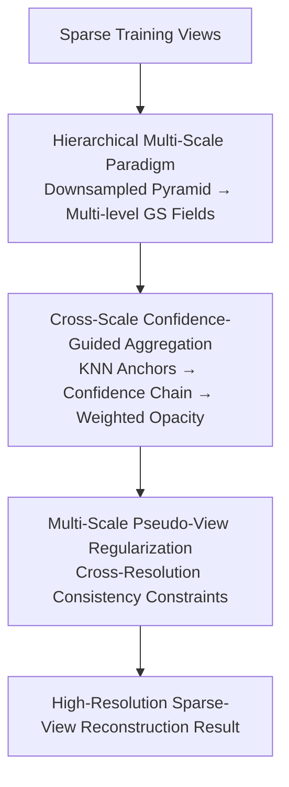

# Confidence-Guided Multi-Scale Aggregation for Sparse-View High-Resolution 3D Gaussian Splatting

**Conference**: CVPR 2026  
**Paper**: [CVF Open Access](https://openaccess.thecvf.com/content/CVPR2026/html/Zhou_Confidence-Guided_Multi-Scale_Aggregation_for_Sparse-View_High-Resolution_3D_Gaussian_Splatting_CVPR_2026_paper.html)  
**Code**: Not disclosed  
**Area**: 3D Vision  
**Keywords**: Sparse-view reconstruction, 3D Gaussian Splatting, Multi-scale aggregation, Confidence guidance, High resolution  

## TL;DR
This paper reveals the resolution trade-off in sparse-view 3DGS where low-resolution provides stable structures while high-resolution provides details but introduces noise. It proposes CAGS: using a low-resolution Gaussian field as an anchor, re-weighting the opacity of high-resolution Gaussians via a cross-scale confidence chain, and incorporating multi-scale pseudo-view regularization. This enables high-resolution reconstruction under extremely sparse conditions (e.g., 3 views), achieving a 2.7dB PSNR improvement over NexusGS on original resolution LLFF.

## Background & Motivation
**Background**: The mainstream of sparse-view (few-shot) 3D reconstruction involves adding various priors or regularizations to NeRF / 3DGS—such as neighborhood Gaussian pooling in FSGS, monocular depth in DNGaussian/DepthRegGS, collaborative regularization in CoR-GS, and epipolar depth priors in NexusGS. These efforts focus on preventing overfitting in few-shot scenarios.

**Limitations of Prior Work**: These methods almost exclusively operate on **heavily downsampled** images (e.g., 8×). Once original resolution is used, densification under sparse-view constraints introduces a massive amount of noise Gaussians, exponentially magnifying floaters and ghosting, which collapses reconstruction quality. In other words, the "good results" of existing few-shot methods are limited to the low-resolution comfort zone and fail at high resolutions.

**Key Challenge**: The authors quantify this through systematic experiments as a **resolution trade-off**—low-resolution inputs have fewer constraints and points, converging to robust global geometry but losing high-frequency details; high-resolution inputs offer rich details but suffer from exploding noise and ghosting in under-constrained regions, evidenced by fragmented red spots in error maps. Both ends have complementary strengths and weaknesses.

**Goal**: To integrate "stable structures from low-resolution" and "details from high-resolution" into a single reconstruction without downsampling, preserving original high resolution.

**Key Insight**: Since both resolutions are complementary, one should not choose between them—use the low-resolution field as a "global anchor" to constrain the Gaussian distribution of the high-resolution field, preserving details while filtering out noise points inconsistent with the stable structure.

**Core Idea**: Construct a multi-resolution Gaussian field pyramid for coarse-to-fine refinement. Use **cross-scale confidence** to measure the consistency of each fine-scale Gaussian with its coarse-scale anchor, using this to adaptively weight its opacity contribution. This "voting-based" aggregation recovers reliable structures and suppresses unstable points.

## Method

### Overall Architecture
CAGS takes a few sparse training views as input and outputs a 3D Gaussian radiance field renderable at original high resolution. The pipeline consists of three steps: First, downsample input images into a resolution pyramid (e.g., 1/16, 1/8, 1/4, 1/2, original), fitting a 3D Gaussian field for each to form a coarse-to-fine pyramid. Second, between adjacent resolutions, find the nearest coarse-scale anchor for each fine-scale Gaussian, calculate geometric and attribute differences to map into a confidence value, and propagate this along the cross-scale chain to re-weight the Gaussian's opacity. Finally, use multi-scale pseudo-view regularization to enforce consistency between outputs of different resolutions, refining details without amplifying noise.

The process is bottom-up: the coarsest field first converges to a reliable global representation, and finer fields are then incrementally integrated, using the stable geometry of coarser levels as a reference.

### Key Designs

**1. Hierarchical Multi-Scale Paradigm: Turning Resolution Trade-offs into Fusion Pyramids**

This design directly addresses the pain point where high resolution alone collapses and low resolution alone is blurry. Instead of choosing one resolution, the authors downsample inputs into multiple tiers (e.g., 1/16 to original), fitting a 3D Gaussian field for each. Reconstruction follows a bottom-up order: the coarsest field converges as a reliable global geometry anchor, and finer fields are layered on, referencing the geometry of the level below. High-resolution fields no longer grow Gaussians uncontrollably but are guided by coarse anchors—preserving beneficial local details while noise points deviating from stable structures lose support. To ensure spatial alignment, camera intrinsics are scaled proportionally so all fields share the same world coordinate system.

**2. Cross-Scale Confidence-Guided Aggregation: Voting for Opacity via Consistency**

As the core of the paper, this addresses the issue where sparse-view densification introduces noise Gaussians, while explicit pruning might delete useful fine structures. A continuous, differentiable confidence mechanism is used. For each fine-scale Gaussian $\theta_i^{(s+1)}$, KNN matching $f(i)$ finds the nearest anchor $\theta_{f(i)}^{(s)}$ in the adjacent coarse level. Three differences are calculated: position offset $d_i=\lVert \mu_i^{(s+1)}-\mu_{f(i)}^{(s)}\rVert$, opacity difference $\Delta\alpha_i=\lvert \alpha_i^{(s+1)}-\alpha_{f(i)}^{(s)}\rvert$, and scale difference $\Delta s_i=\lvert \sigma_i^{(s+1)}-\sigma_{f(i)}^{(s)}\rvert$. These map to a confidence via learnable scalars:

$$c_i^{(s+1)} = \sigma\!\left(-\left(w_d\, d_i^2 + w_\alpha\, \Delta\alpha_i^2 + w_s\, \Delta s_i^2 + b\right)\right)$$

where $w_d, w_\alpha, w_s, b$ are learnable and $\sigma$ is the sigmoid function. Confidence is propagated through the hierarchy via multiplication:

$$c_i^{(s+1)} \leftarrow c_{f(i)}^{(s)} \cdot c_i^{(s+1)}$$

Chain multiplication ensures that only Gaussians consistent across all levels maintain high response. The final confidence modulates opacity during rendering: $\tilde{\alpha}_i^{(s)} = c_i^{(s)} \cdot \alpha_i^{(s)}$. Gaussians consistent with coarse anchors remain visible, while inconsistent ones are suppressed—a "soft voting" mechanism that filters noise without discrete pruning.

**3. Multi-Scale Pseudo-View Regularization: Aligning High-Res Outputs to Suppress Overfitting**

Aggregation identifies "reliable Gaussians," but sparse views still risk overfitting training perspectives in unobserved areas. Pseudo-views are sampled by interpolating between the two nearest training cameras in Euclidean space: $P'=(t+\epsilon, q)$, where $\epsilon\sim\mathcal{N}(0,\delta)$ is position jitter and $q$ is quaternion interpolation. These pseudo-cameras render across multiple scales to reduce overfitting. The key constraint uses the **highest-resolution output as reference**, downsampling it to scale $s$ to supervise rendering at that level—ensuring the high-resolution result inherits structural consistency. The pseudo-view loss combines L1 and D-SSIM:

$$R^p_{color} = \sum_{s\in S}\left[\lambda L_1(I^p_s, I^{p\prime}_h) + (1-\lambda)L_{D\text{-}SSIM}(I^p_s, I^{p\prime}_h)\right]$$

where $I^{p\prime}_h$ is the downsampled version of the highest-resolution pseudo-view output. This step refines high-frequency details without amplifying noise, complementing the aggregation module.

### Loss & Training
The total loss is the sum of training view supervision and multi-scale pseudo-view regularization:

$$L = L_{color} + R^p_{color}$$

Training view loss is $L_{color}=\sum_{s\in S}[\lambda L_1(I_s, I^*_s)+(1-\lambda)L_{D\text{-}SSIM}(I_s, I^*_s)]$. Reconstruction proceeds bottom-up through the pyramid.

## Key Experimental Results

### Main Results
Using 3 views for LLFF / DTU, 12/24 for Mip-NeRF360, and 8 for Blender, **without traditional downsampling**. Comparison against FSGS, Binocular3DGS, DropGaussian, and NexusGS (LLFF / Mip-NeRF360, 12 views):

| Dataset | Resolution | Metric | FSGS | NexusGS | Ours (CAGS) |
|--------|--------|------|------|---------|-----------|
| LLFF | original | PSNR↑ | 15.48 | 16.12 | **18.85** |
| LLFF | original | SSIM↑ | 0.528 | 0.558 | **0.590** |
| LLFF | original | LPIPS↓ | 0.384 | 0.361 | **0.339** |
| LLFF | 1/2 | PSNR↑ | 17.25 | 17.83 | **19.59** |
| Mip-NeRF360 | original | PSNR↑ | 15.35 | 16.79 | **18.43** |
| Mip-NeRF360 | 1/2 | PSNR↑ | 16.26 | 17.72 | **18.85** |

Gains are most significant at **original high resolution** (LLFF PSNR is 2.73dB higher than NexusGS). The gap narrows as resolution decreases, confirming the method specifically targets high-resolution instability.

### Plug-and-Play Gain (DTU, High Resolution)
CAGS applied as a general framework to existing 3DGS methods:

| Method | Original Res PSNR↑ | +CAGS | 1/2 PSNR↑ | +CAGS | Gain |
|------|------|------|------|------|---|
| DropGaussian | 17.45 | **19.13** | 18.19 | **19.95** | +1.7dB |
| FSGS | 17.32 | **18.67** | 18.23 | **19.72** | +1.4dB |
| CoR-GS | 17.51 | **19.25** | 18.17 | **20.03** | +1.8dB |

The consistent improvement across backbones validates the paradigm's generality.

### Ablation Study
Breakdown of the two core modules (Original Res / 1/2):

| Hierarchical Aggregation | Multi-Scale Reg. | Original PSNR↑ | Original SSIM↑ | 1/2 PSNR↑ |
|:---:|:---:|------|------|------|
| × | × | 15.32 | 0.512 | 16.28 |
| ✓ | × | 18.45 | 0.615 | 19.10 |
| × | ✓ | 16.43 | 0.544 | 16.87 |
| ✓ | ✓ | **18.83** | **0.626** | **19.50** |

### Key Findings
- **Hierarchical confidence aggregation is the primary contributor**: Enabling aggregation alone increases original resolution PSNR from 15.32 to 18.45 (+3.13dB), whereas regularization alone only reaches 16.43. Overfitting during densification is the main cause of high-resolution failure.
- **Modules are complementary**: Visualizations show that removing aggregation leaves messy noise Gaussians, while removing regularization decreases structural stability.
- **High resolution is the main battlefield**: The advantage of the method grows with resolution. It addresses the exact weakness bypassed by existing few-shot methods that use downsampling.

## Highlights & Insights
- **First to quantify "resolution" as a key variable in sparse views**: Previous few-shot works defaulted to 8× downsampling; this paper uses error maps and visualizations to prove multi-scale complementarity, providing significant diagnostic value.
- **Continuous differentiable confidence replaces discrete pruning**: The "soft voting" avoids deleting fine structures while filtering noise, integrating seamlessly into differentiable rendering via simple opacity multiplication.
- **Chain propagation of confidence**: This is a transferable idea—any multi-scale representation can use multiplicative propagation to express "consistency across levels means reliability," which is more robust than single-layer discrimination.
- **Plug-and-play paradigm**: The ability to boost FSGS/CoR-GS/DropGaussian suggests it is an orthogonal enhancement rather than just another isolated baseline.

## Limitations & Future Work
- Requires optimizing a pyramid of Gaussian fields, increasing training and memory overhead with the number of scales.
- Confidence relies only on three geometric attributes; whether it suffices for areas with high-frequency textures but flat geometry is unclear.
- KNN cross-scale matching might find unreliable anchors in under-constrained areas, potentially polluting the confidence chain.
- Focused on forward-facing or object-centric scenes; effectiveness on large-scale unbounded high-resolution scenes is unproven.

## Related Work & Insights
- **vs FSGS / NexusGS / DropGaussian**: These rely on depth or epipolar priors to stabilize geometry at low resolution. Ours uses **internal cross-scale consistency** as a signal, specifically for high resolution.
- **vs CoR-GS**: CoR-GS uses dual-field collaborative regularization; CAGS generalizes this to multi-resolution levels and quantifies reliability via confidence chains. They are additive.
- **vs HiSplat / Octree-GS**: Those focus on feed-forward generalization or LoD efficiency; few have systematically studied the resolution trade-off for optimization-based 3DGS in sparse-view settings.

## Rating
- Novelty: ⭐⭐⭐⭐ 
- Experimental Thoroughness: ⭐⭐⭐⭐ 
- Writing Quality: ⭐⭐⭐⭐ 
- Value: ⭐⭐⭐⭐ 

<!-- RELATED:START -->

## Related Papers

- [\[CVPR 2026\] Intrinsic Geometry-Appearance Consistency Optimization for Sparse-View Gaussian Splatting](intrinsic_geometry-appearance_consistency_optimization_for_sparse-view_gaussian_.md)
- [\[CVPR 2026\] EcoSplat: Efficiency-controllable Feed-forward 3D Gaussian Splatting from Multi-view Images](ecosplat_efficiency-controllable_feed-forward_3d_gaussian_splatting_from_multi-v.md)
- [\[CVPR 2026\] LiteSense: Lifting Lightweight ToF with RGB for High-Resolution Metric Depth Estimation](litesense_lifting_lightweight_tof_with_rgb_for_high-resolution_metric_depth_esti.md)
- [\[CVPR 2026\] InstantHDR: Single-forward Gaussian Splatting for High Dynamic Range 3D Reconstruction](instanthdr_singleforward_gaussian_splatting_for_hi.md)
- [\[CVPR 2026\] LangRef3DGS: Natural Language-Guided 3D Referential Segmentation from Partial Observations via 3D Gaussian Splatting](langref3dgs_natural_language-guided_3d_referential_segmentation_from_partial_obs.md)

<!-- RELATED:END -->
