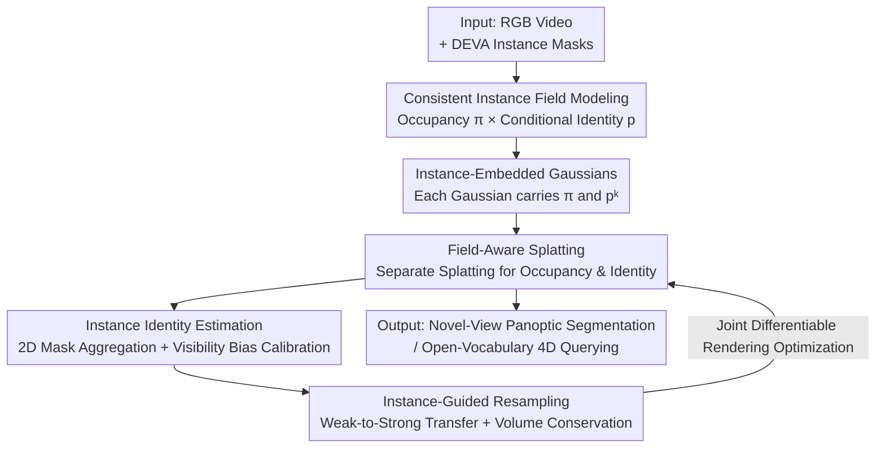

# Consistent Instance Field for Dynamic Scene Understanding

**Conference**: CVPR 2026  
**Paper**: [CVF Open Access](https://openaccess.thecvf.com/content/CVPR2026/html/Wu_Consistent_Instance_Field_for_Dynamic_Scene_Understanding_CVPR_2026_paper.html)  
**Code**: Not public  
**Area**: 3D Vision  
**Keywords**: Dynamic scene understanding, 4D Gaussian Splatting, instance segmentation, occupancy probability field, visibility bias calibration  

## TL;DR
This work models dynamic scenes as a continuous probabilistic "instance field," where each spatio-temporal point carries both an "occupancy probability" and a "conditional identity distribution." By approximating this field using deformable 3D Gaussians with instance semantics, the method decouples object identity from multi-view visibility. It significantly outperforms previous SOTA in novel-view panoptic segmentation and open-vocabulary 4D querying (HyperNeRF mIoU +11.4, Neu3D +5.8).

## Background & Motivation

**Background**: The mainstream approach to dynamic scene understanding involves first reconstructing geometry and appearance using deformable representations (NeRF-based or 3D Gaussian-based), and then incorporating semantics—either by injecting vision-language features for open-vocabulary queries or by supervising a semantic/instance field with 2D masks. 3D Gaussian Splatting (3DGS) has recently become the primary driver in this direction due to its explicit nature and real-time rendering capabilities.

**Limitations of Prior Work**: Semantic supervision in these methods is applied indirectly "via RGB rendering," making it inherently **view-dependent**. They fail to explicitly model the "persistence of objects in space-time," instead tying identity strictly to radiance. The paper categorizes the issues caused by this coupling into three types (see Figure 1): unstable instance supervision across views leading to identity drift; confusing "color opacity" with "object occupancy"; and sparse representation/underfitting of semantically significant regions due to limited Gaussian capacity.

**Key Challenge**: The root cause lies in conflating "identity" with "visibility." When an object is occluded or its appearance changes in certain views, its visibility fluctuates wildly, yet its identity should remain constant. In existing methods that propagate supervision via rendering weights, visible regions naturally dominate the gradients while occluded areas are neglected, causing identity to jitter alongside visibility.

**Goal**: To construct an instance representation that is robust to deformation and viewpoint changes and remains temporally consistent, allowing "any point in space-time" to answer both "is there an object here?" and "which object is it?"

**Key Insight**: Treat the dynamic scene as an **object-centric** continuous 4D field rather than a collection of time-varying appearances. The critical observation is that existence (matter exists) and identity (identity persists) can be modeled separately—the former describes spatio-temporal continuity of physical occupancy, while the latter describes the stable attribution of identity during deformation.

**Core Idea**: Use a probability decomposition of "occupancy probability $\times$ conditional identity distribution" to explicitly model object existence and identity in space-time. This continuous field is discretized using deformable Gaussians with instance embeddings, effectively **replacing view-dependent features with persistent identities** to resolve semantic inconsistencies in dynamic scenes.

## Method

### Overall Architecture
The proposed method is named Consistent Instance Field (CIF). The input consists of RGB video frames of a dynamic scene and frame-wise instance masks generated by DEVA. The output is a set of "deformable Gaussians with instance semantics." Differentiable rendering of these Gaussians produces both novel-view RGB images and time-consistent instance segmentation maps. The pipeline can be summarized as: defining a continuous probability field (occupancy + identity) $\rightarrow$ approximating it with a Gaussian representation $\rightarrow$ splatting the occupancy and identity of each Gaussian onto pixels via Field-Aware Splatting for supervision $\rightarrow$ aggregating 2D masks to estimate identities while calibrating visibility bias via Instance Identity Estimation $\rightarrow$ redistributing Gaussian capacity to semantically active regions via Instance-Guided Resampling. All modules are optimized jointly through a differentiable rendering objective.

### Key Designs

**1. Consistent Instance Field: Decoupling Existence and Identity**

To address the issue of identity being tied to radiance and visibility, the paper defines a joint distribution for space-time. Let $E\in\{0,1\}$ indicate whether a 4D position $(x,t)$ is occupied by any entity, and $K\in\mathcal{K}$ represent the instance identity. The field is defined as:

$$\gamma(x,t,k) = P(E{=}1, K{=}k \mid x,t) = \underbrace{P(E{=}1\mid x,t)}_{\pi(x,t)}\;\underbrace{P(K{=}k\mid E{=}1, x,t)}_{p(x,t,k)}.$$

This decomposition is the core of the work: $\pi(x,t)\in[0,1]$ is the "occupancy probability," characterizing the spatio-temporal continuity of physical existence; $p(x,t,k)$ is the "conditional identity distribution" ($\sum_k p=1$), characterizing stable identity during deformation and motion. By decoupling existence from identity, an object's conditional identity $p$ can remain stable even if it is occluded (low visibility) in certain views. Low-entropy regions represent stable attribution, while high-entropy regions at interaction boundaries represent soft sharing. This is the source of robustness against viewpoint and deformation changes.

**2. Instance-Embedded Gaussian Representation + Field-Aware Splatting**

Since the continuous field cannot be optimized directly, the paper approximates it with a set of deformable Gaussians. Each Gaussian $g_i=(x_i, R_i, s_i, c_i, \alpha_i, \pi_i, p_i^1,\dots,p_i^K)$ carries occupancy $\pi_i$ and an identity distribution $p_i^k$ in addition to standard geometric and radiance attributes. Parameter modulation over time is handled by a time-conditioned MLP, ensuring that identities move along deformation fields to maintain local consistency.

Crucially, **occupancy and opacity use separate splatting mechanisms** during rendering. Color still follows standard alpha-blending (using $\alpha$ for transmittance), while the instance map uses a different "instance transmittance" weighted by $\pi$:

$$M_k(u,v,t) = \sum_i T_i^{\text{inst}}(u,v,t)\,\pi_i\,P_i(u,v,t)\,p_i^k,\quad T_i^{\text{inst}}=\prod_{j<i}\big(1-\pi_j P_j\big).$$

This directly addresses the "opacity vs occupancy" misconception: $\pi_i$ determines the spatial support of the Gaussian in the 4D field, and $p_i^k$ determines its instance membership, neither of which relies on color-related $\alpha$. The rendered $M_k$ represents a soft assignment of each pixel to instance $k$, shaped by geometry, occupancy, and identity, and is supervised using cross-entropy to align the Gaussians with the underlying instance field.

**3. Instance Identity Estimation: Aggregating Masks and Calibrating Visibility Bias**

To inject 2D supervision into the Gaussian representation and solve "unstable cross-view supervision," the method aggregates the frequency with which Gaussian $g_i$ explains instance $k$ across all pixels and time steps using rendering weights $w_i(u,v,t)=\frac{T_i\alpha_i P_i}{\sum_j T_j\alpha_j P_j}$. This yields an initial identity distribution $\hat p_i^k$.

However, $w_i$ depends on photometric transmittance, so frequently visible or well-lit regions dominate supervision, while occluded or low-contrast regions are severely underestimated—this is visibility bias. The paper introduces **learnable calibration factors** $m_i^k > 0$ to re-standardize the distribution:

$$p_i^k = \frac{\hat p_i^k\, m_i^k}{\sum_{k'}\hat p_i^{k'} m_i^{k'}}.$$

The factor $m_i^k$ is optimized jointly with all Gaussian parameters. Gradients flow through both occupancy $\pi_i$ and calibrated identity $p_i^k$, pushing the purely appearance-driven initialization toward a time-consistent, geometry-aware identity estimation. Removing this component causes a significant drop in performance (mIoU 80.80 $\rightarrow$ 78.16, PSNR 32 $\rightarrow$ 26.73), proving its role in absorbing residual biases from visibility.

**4. Instance-Guided Resampling: Moving Capacity to Semantically Active Regions**

Discretizing a continuous field with finite Gaussians often leads to a mismatch where semantically important regions lack capacity while backgrounds contain redundant Gaussians. The paper defines the **instance response** $\gamma_i^k = \pi_i p_i^k$ for each Gaussian, and constructs two complementary sampling distributions:

$$P_{\text{weak}}(i\mid k)\propto (\gamma_i^k)^{-1},\qquad P_{\text{strong}}(i\mid k)\propto \gamma_i^k.$$

Pairs of (weak $w$, strong $s$) Gaussians are sampled within the same instance, and the weak Gaussian $g_w$ is re-initialized near $g_s$, inheriting its geometric and semantic attributes. To prevent local over-saturation, **volume conservation** is applied: for the source Gaussian and its $n$ clones, opacity and occupancy are reduced to $\alpha_{\text{new}}=1-(1-\alpha_{\text{src}})^{1/(n+1)}$ and $\pi_{\text{new}}=1-(1-\pi_{\text{src}})^{1/(n+1)}$, ensuring the effective volume contribution remains constant after redistribution.

### Loss & Training
The entire pipeline is optimized via joint differentiable field rendering. The total loss is $L = L_{\text{rgb}} + \lambda_{\text{inst}} L_{\text{inst}}$, where $L_{\text{rgb}}$ is $\ell_1$ loss for color and $L_{\text{inst}}$ is the pixel-wise cross-entropy between rendered instance maps and GT masks. For each scene, reconstruction is trained for 10,000 steps, followed by instance segmentation for 3,000 steps (Adam optimizer, single A40). Learning rates for occupancy and identity calibration are set to 0.01. Resampling rates are 1% for HyperNeRF and 5% for Neu3D.

## Key Experimental Results

Experiments cover two tasks: novel-view panoptic segmentation and open-vocabulary 4D querying. Datasets include the monocular HyperNeRF and the multi-view Neu3D (treated as a pseudo-monocular sequence). GT masks are generated by DEVA.

### Main Results (Novel-View Panoptic Segmentation, Dataset Average)

| Dataset | Metric | Ours (CIF) | Prev. SOTA (VLGS) | Gain |
|--------|------|----------|-------------|------|
| HyperNeRF | mAcc-pix | 96.40 | 94.31 | +2.09 |
| HyperNeRF | mAcc-inst | 85.69 | 73.91 | +11.78 |
| HyperNeRF | mIoU | 79.47 | 68.05 | **+11.42** |
| Neu3D | mAcc-pix | 94.97 | 90.25 | +4.72 |
| Neu3D | mAcc-inst | 93.19 | 90.69 | +2.50 |
| Neu3D | mIoU | 88.31 | 82.49 | **+5.82** |

### Ablation Study (HyperNeRF "split-cookie" scene)

| Configuration | mAcc-pix | mAcc-inst | mIoU | PSNR | Background |
|------|----------|-----------|------|------|------|
| (i) Constant Occupancy | 96.26 | 85.57 | 80.80 | 31.76 | $\pi$ fixed at 0.02 |
| (ii) Opacity as Occupancy | 96.60 | 87.20 | 82.34 | 32.16 | Confusing existence with visibility |
| (iii) w/o Identity Calibration | 95.99 | 82.65 | 78.16 | 26.73 | Direct bias propagation |
| (iv) w/o Resampling | 96.78 | 87.98 | 82.82 | 32.34 | Redundant capacity in background |
| (v) Full | **97.93** | **90.40** | **86.03** | **32.42** | Full Model |

### Key Findings
- **Identity calibration is the most significant contributor**: Removing it drops mIoU from 86.03 to 78.16 and crashes PSNR from 32.42 to 26.73, confirming that visibility bias degrades both semantics and reconstruction.
- **"Opacity as Occupancy" breaks instance consistency**: While PSNR remains decent (32.16), mIoU drops to 82.34, showing that conflating existence and visibility results in scattered identities.
- **Occupancy requires spatial adaptation**: Fixing $\pi$ as a constant lead to a drop in mIoU (80.80), proving that occupancy must be a learnable probabilistic quantity.
- CIF produces significantly cleaner boundaries on transparent/reflective objects (e.g., glass cups, steel pots) compared to 4D LangSplat and SA4D.

## Highlights & Insights
- **Conceptual Clarification (Occupancy vs Opacity)**: While previous 3DGS semantic works used $\alpha$ as a proxy for object existence, this paper clearly separates them into two transmittance systems. This simple distinction provides strong explanatory power.
- **Learnable Calibration for Visibility Bias**: Instead of manual rules, $m_i^k$ adaptively compensates for unbalanced rendering weights. This idea is transferable to any 3D/4D representation learning where 2D supervision is backpropagated via rendering.
- **Resampling with Volume Conservation**: Combining semantic-driven redistribution with a closed-form volume decay ($1-(1-\alpha)^{1/(n+1)}$) solves capacity allocation without causing over-saturation or radiation inflation.

## Limitations & Future Work
- **Dependency on 2D Instance Segmenters (DEVA)**: Initial identity estimation is limited by the cross-frame consistency of DEVA. Failures in DEVA during heavy occlusion or fast motion cap the performance of CIF.
- **GT Generation Assumptions**: For Neu3D, instances visible in only some views were removed to avoid GT inconsistency, potentially simplifying the occlusion reasoning task.
- **Lack of Quantitative Benchmark for 4D Querying**: Only qualitative comparisons are provided for the open-vocabulary task.

## Related Work & Insights
- **vs SA4D**: SA4D uses view-dependent features with RGB modulation, leading to drift. CIF uses view-invariant occupancy-identity fields, achieving +15.11 mIoU higher on HyperNeRF "torchocolate."
- **vs VLGS / Dr. Splat**: These methods inject semantic features into 3DGS but remain susceptible to visibility issues. CIF anchors semantics to the physical persistence of entities for better consistency.
- **vs 4D LangSplat**: While 4D LangSplat leaks boundaries on transparent/reflective objects, CIF's decoupling of occupancy and identity yields sharper results.

## Rating
- Novelty: ⭐⭐⭐⭐⭐ Decoupling visibility and identity via an "Occupancy × Identity" probability field is an original and self-consistent perspective.
- Experimental Thoroughness: ⭐⭐⭐⭐ Solid results on two datasets, though 4D querying lacks quantitative metrics and GT relies on external segmenters.
- Writing Quality: ⭐⭐⭐⭐⭐ Clear mapping between motivations and modules; effectively organized and easy to follow.
- Value: ⭐⭐⭐⭐ Significant gains in novel-view segmentation; insights like "occupancy ≠ opacity" are highly transferable.

<!-- RELATED:START -->

## Related Papers

- [\[CVPR 2026\] PointTPA: Dynamic Network Parameter Adaptation for 3D Scene Understanding](pointtpa_dynamic_network_parameter_adaptation_for_3d_scene_understanding.md)
- [\[CVPR 2026\] Towards Foundation Models for 3D Scene Understanding: Instance-Aware Self-Supervised Learning for Point Clouds](towards_foundation_models_for_3d_scene_understanding_instance-aware_self-supervi.md)
- [\[CVPR 2026\] I-Scene: 3D Instance Models are Implicit Generalizable Spatial Learners](i-scene_3d_instance_models_are_implicit_generalizable_spatial_learners.md)
- [\[CVPR 2026\] Real-Time Dynamic Scene Rendering with Controlled Compressibility and Contact Awareness](real-time_dynamic_scene_rendering_with_controlled_compressibility_and_contact_aw.md)
- [\[CVPR 2026\] RISE: Single Static Radar-based Indoor Scene Understanding](rise_single_static_radar-based_indoor_scene_understanding.md)

<!-- RELATED:END -->
