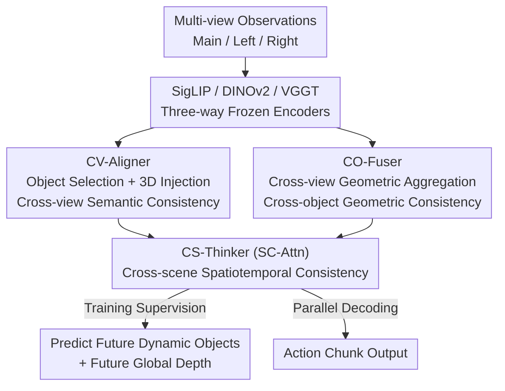

# ConsisVLA-4D: Advancing Spatiotemporal Consistency in Efficient 3D-Perception and 4D-Reasoning for Robotic Manipulation

**Conference**: CVPR 2026  
**arXiv**: [2605.05126](https://arxiv.org/abs/2605.05126)  
**Code**: https://github.com/JiuTian-VL/ConsisVLA-4D (Available)  
**Area**: 3D Vision / Embodied AI / VLA  
**Keywords**: Vision-Language-Action Models, Spatiotemporal Consistency, 3D Perception, 4D Reasoning, Robotic Manipulation

## TL;DR
ConsisVLA-4D utilizes three modules (CV-Aligner, CO-Fuser, CS-Thinker) to compress multi-view 2D observations into approximately 1/8 of the original tokens. It ensures "cross-view semantic consistency" and "cross-object geometric consistency" during the perception phase, and extends this to "cross-scene spatiotemporal consistency" during the reasoning phase. It improves success rates by 21.6% / 41.5% and accelerates inference by 2.3× / 2.4× on LIBERO and real-world robots compared to OpenVLA.

## Background & Motivation
**Background**: Current mainstream Vision-Language-Action (VLA) models (RT-2, Octo, OpenVLA, $\pi$ series) primarily map 2D visual observations directly to actions, achieving promising results on various benchmarks.

**Limitations of Prior Work**: These models are insufficient in both **spatial perception** and **temporal reasoning**. For 3D spatial understanding, existing methods either rely on additional sensors (point clouds, depth maps, e.g., PointVLA, GeoVLA, 3D-VLA) which incur high computational overhead and limit generality, or use pure 2D→3D projections (SpatialVLA, Evo-0, GeoAware-VLA) which suffer from projection bias, geometric inconsistency, and occlusion errors. Regarding temporal reasoning, most world-model-based approaches (WorldVLA, World4Omni, V-JEPA 2) only predict **future image frames** rather than truly understanding dynamic 3D space.

**Key Challenge**: Existing methods either pay a computational price for 3D accuracy or sacrifice 3D/4D consistency for efficiency. A deeper issue is the lack of a complete understanding of the current spatial state and knowledge of how the scene evolves with actions, making it impossible to establish consistent correlations between "current observations" and "predicted future scenes," leading to distorted visual reasoning and unstable actions.

**Goal**: This work decomposes the problem into two sub-problems: (1) How to efficiently generate 3D representations from 2D observations without excessive computation? (2) How to optimize action prediction by strengthening spatiotemporal consistency through 4D visual reasoning?

**Key Insight**: The authors draw inspiration from human manipulation: humans maintain consistent spatial perception (object positions and relationships) across different viewpoints through binocular vision or movement, and predict future spatial states based on this stable perception to maintain temporal stability throughout task execution. VLA models should inherit this mechanism of "Stable Spatial Perception → Stable Future Reasoning."

**Core Idea**: The paradigm is extended from "3D Perception" to "4D Reasoning," linked by three types of consistency: cross-view semantic consistency (CV-Aligner) → cross-object geometric consistency (CO-Fuser) → cross-scene spatiotemporal consistency (CS-Thinker), using only about 1/8 of the visual input.

## Method

### Overall Architecture
ConsisVLA-4D is a unified framework divided into two stages. **Efficient 3D Perception Stage**: Multi-view observations (Main/Left/Right) are fed into three frozen encoders—SigLIP for semantic tokens $\mathbf{z}^{\text{sem}}$, DINOv2 for geometric tokens $\mathbf{z}^{\text{geo}}$, and VGGT for 3D tokens $\mathbf{z}^{\text{3D}}$ containing depth/point-map priors. CV-Aligner handles "object selection + 3D injection" on the semantic side, while CO-Fuser manages "cross-view aggregation" on the geometric side. **Efficient 4D Reasoning Stage**: CS-Thinker takes the object semantic tokens and geometrically aggregated tokens to simultaneously predict "future dynamic objects," "future global depth," and "action chunks" within a shared context window, extending spatial consistency into the temporal dimension. Crucially, dynamic/depth predictions exist only as supervision **during training**; during inference, the model predicts actions directly using learned implicit knowledge, and these pre-trained knowledge tokens account for less than 10% of the inference sequence.

### Key Designs

**1. CV-Aligner: Top-K Selection + Single-frame Fusion for Cross-view Semantic Consistency**

The limitation is that significant portions of the 256 tokens per frame from SigLIP are instruction-irrelevant background redundancies, and object identities are not aligned across views. CV-Aligner solves this in three steps: first, it uses FiLM modulation in each SigLIP layer $\tilde{\mathbf{z}}_{i,l}^{\text{sem}}=(\mathbf{1}+\gamma(\mathbf{t}))\odot\text{Self-Attn}(\mathbf{z}_{i,l}^{\text{sem}})+\beta(\mathbf{t})$ to inject instruction $\mathbf{t}$ scale/shift into visual tokens; second, it scores tokens using cosine similarity $s_{i,j}=\text{sim}(\mathbf{z}_i^{\text{sem},j},\mathbf{W_t}\cdot\mathbf{t})$ and keeps only the Top-$K$ (default $K=32$, reducing 256→32, exactly 1/8) most relevant object tokens; finally, **Single-Fusion** uses object tokens $\mathbf{z}_i^{\text{obj}}$ as queries and VGGT 3D tokens $\mathbf{z}_i^{\text{3D}}$ as keys/values through 4 cross-attention Transformer layers to inject 3D cues from VGGT’s point tracking into object representations, resulting in $\mathbf{z}_i^{\text{obj-3D}}$. This effectively combines "redundancy removal" and "object identity alignment."

**2. CO-Fuser: Block-level Causal Attention for Cross-object Geometric Consistency**

The limitation is that single-view depth estimation has scale ambiguity, and spatial relationships between objects are unclear from one perspective. Instead of explicit point cloud construction, CO-Fuser leverages the structural similarity between VGGT and DINOv2 (VGGT pre-training is built on DINOv2) for **block-wise dense fusion**. Each block performs **Group-Fusion**: $\mathbf{z}_l^{\text{geo-3D}}=(1-\alpha_l)\odot\mathbf{z}_l^{\text{geo}}+\alpha_l\odot\mathbf{z}_l^{\text{3D}}$, where the weight $\alpha_l$ follows a **cosine decay** ($\alpha_0=\psi=0.2$ to $\alpha_{\mathcal{L}'}=\psi\cdot\delta=0.01$, $\mathcal{L}'=24$). Shallow layers use strong constraints for geometric priors, while deep layers smoothly transition to self-learned features. Then, 64 learnable **Aggregation Tokens** are concatenated with $\mathbf{z}_l^{\text{geo-3D}}$ and processed via **Block-level Causal Self-Attention (BC-Attn)** to aggregate multi-view information into tokens $\mathbf{z}_{\mathcal{L}'}^{\text{agg-3D}}$, compressing geometric relations to 1/12–1/8 of original tokens.

**3. CS-Thinker (SC-Attn): Spatiotemporal Consistency via Implicit Knowledge**

The limitation is that scenes change during action execution, requiring spatial consistency to extend to the temporal domain without the inference cost of generating future images. CS-Thinker uses **Spatiotemporal Consistency Attention (SC-Attn)** in a single window to perform three tasks: (a) decoding "dynamic objects at fixed views after actions" using three groups of dynamic tokens ($3\times4=12$) from CV-Aligner outputs, supervised by CoTracker with loss $\mathcal{L}_{\text{dyn-4D}}=\|(\hat{\mathbf{z}}_{i^*}^{\text{dyn-4D}}\odot\mathbf{m})-(\mathbf{z}_{i^*}^{\text{dyn-4D}}\odot\mathbf{m})\|_2^2$; (b) decoding "future global depth" using one group of depth tokens ($1\times4$) from CO-Fuser outputs, supervised by Depth-Anything with loss $\mathcal{L}_{\text{dep-4D}}=\sum_i\|\hat{\mathbf{z}}_i^{\text{dep-4D}}-\mathbf{z}_i^{\text{dep-4D}}\|_2^2$; (c) appending action tokens $\mathbf{0}^A$ for **parallel decoding** of actions. The future predictions serve as "intermediate visual reasoning" during training and are not explicitly generated during inference, allowing the model to use internalized knowledge for faster and more accurate action output.

### Loss & Training
The total loss is $\mathcal{L}_{\text{total}}=\mathcal{L}_{\text{action}}+\mathcal{L}_{\text{dyn-4D}}+\mathcal{L}_{\text{dep-4D}}$, with L1 loss for actions. The backbone is OpenVLA (7B), fine-tuned using LoRA (rank 32, $\alpha=64$), with frozen SigLIP/DINOv2/VGGT encoders. Parameters: single-arm $K=8$, batch 64, lr $5\times10^{-4}$ for 80K steps; dual-arm $K=25$, batch 32, lr decay to $5\times10^{-5}$ after 50K steps.

## Key Experimental Results

### Main Results

Success rates (%) on four LIBERO suites, with ConsisVLA-4D leading in all categories:

| Method | Spatial | Object | Goal | Long | Avg. |
|------|---------|--------|------|------|------|
| OpenVLA [CoRL'24] | 84.7 | 88.4 | 79.2 | 83.7 | 76.5 |
| OpenVLA-OFT [RSS'25] | 97.6 | 98.4 | 97.9 | 94.5 | 97.1 |
| $\pi_{0.5}$ [arXiv'25] | 98.8 | 98.2 | 98.0 | 92.4 | 96.9 |
| SpatialVLA [RSS'25] | 88.2 | 89.9 | 78.6 | 55.5 | 78.1 |
| **Ours (ConsisVLA-4D)** | **98.8** | **99.8** | **98.0** | **95.6** | **98.1** |

Ours shows a +21.6% Gain in average success rate over OpenVLA. On ManiSkill2 (Pick/Stack/PushCube), it averages 94.3%, outperforming CogACT (92.5%) and GeoVLA (90.0%).

Efficiency comparison (7B models, same settings):

| Scenario | Method | Latency↓ | T-put↑ | FLOPs↓ | Cost↓ |
|------|------|----------|--------|--------|-------|
| Sim (Single-arm) | OpenVLA-OFT† | 0.137 s | 58.4 Hz | 8.45 T | 12.3 h |
| Sim (Single-arm) | **Ours** | **0.110 s** | **72.7 Hz** | **4.59 T** | **8.6 h** |
| Real (Dual-arm) | OpenVLA† | 0.552 s | 1.8 Hz | 16.30 T | 12.8 h |
| Real (Dual-arm) | **Ours** | **0.231 s** | **108.2 Hz** | **9.68 T** | **10.1 h** |

Ours achieves ~2.4× acceleration in real-world latency (0.552s → 0.231s) and nearly halved FLOPs in simulation.

### Ablation Study

| Configuration | Sim Latency↓ | T-put↑ | FLOPs↓ | Description |
|------|--------------|--------|--------|------|
| ConsisVLA-4D (full) | 0.110 s | 72.7 Hz | 4.59 T | Complete model |
| w/o E3D | 0.204 s | 39.2 Hz | 16.83 T | Latency nearly doubles, FLOPs jump 3.7× |

$\alpha_l$ decay method ablation (Table 8):

| $\alpha_l$ Design | LIBERO SR↑ | Real-World SR↑ |
|------|------------|----------------|
| Cosine Decay (Ours) | **98.1** | **78.3** |
| Linear Decay (Slope 1.0) | 94.4 (−3.7) | 73.3 (−5.0) |
| Linear Decay (Slope 0.1) | 95.9 (−2.2) | 75.0 (−3.3) |

### Key Findings
- **Efficiency stems from E3D**: Removing it causes latency to jump from 0.110s to 0.204s and FLOPs from 4.59T to 16.83T. "Top-K object selection + implicit geometric aggregation" is the fundamental driver for speed.
- **Cosine decay is critical**: Switching to linear decay drops success rates by 2.2–3.7 on LIBERO and 3.3–5.0 in the real world, validating the "shallow strong constraint, middle rapid transition, deep smooth exit" design.
- **Maximized gains in long-horizon tasks**: Gains on LIBERO-Long (83.7 → 95.6) highlight that spatiotemporal consistency is most vital in extended sequences.

## Highlights & Insights
- **Training-Inference Decoupling**: CS-Thinker treats dynamic/depth prediction as intermediate training supervision but discards these generation steps during inference. This provides 4D reasoning capabilities without the computational cost, allowing it to be faster than pure 2D models.
- **Dense Fusion via Structural Similarity**: By recognizing that VGGT was pre-trained on DINOv2, CO-Fuser performs block-wise fusion between flows. This leverages existing geometric priors rather than using external heavy sensors.
- **Unified Top-K Mechanism**: Selecting object tokens simultaneously removes redundancy (256→32) and aligns object identities across views, serving two goals with one mechanism.

## Limitations & Future Work
- The ablation study lacks a **step-by-step removal** success rate for the CV-Aligner / CO-Fuser / CS-Thinker modules individually.
- Heavy reliance on three large pre-trained encoders (SigLIP + DINOv2 + VGGT) and OpenVLA 7B. While tokens are compressed, memory and deployment barriers remain high.
- The 3D upper bound depends on VGGT quality; performance may degrade in scenes far from the VGGT training distribution (e.g., highly reflective or transparent objects).
- Spatiotemporal supervision relies on external models (CoTracker/Depth-Anything) for pseudo-labels, which may propagate errors.

## Related Work & Insights
- **vs. Explicit 3D Input (PointVLA / 3D-VLA)**: These require specialized sensors and high computation. Ours obtains 3D info implicitly from 2D multi-view + frozen VGGT, saving sensors and compute at the cost of being bound to the VGGT prior.
- **vs. 2D→3D Projection (SpatialVLA / Evo-0)**: These suffer from projection bias and geometric inconsistency. Ours uses CO-Fuser with block-level causal attention for disambiguation, significantly outperforming SpatialVLA on LIBERO-Long (95.6 vs 55.5).
- **vs. World Models (WorldVLA / V-JEPA 2)**: They predict 2D future frames. Ours predicts 3D/4D representations (dynamics + depth) implicitly during inference, offering better efficiency and consistency.

## Rating
- Novelty: ⭐⭐⭐⭐⭐ Systematically extends VLA from 3D perception to 4D reasoning with training/inference decoupling.
- Experimental Thoroughness: ⭐⭐⭐⭐ Extensive benchmarks (LIBERO/RoboTwin/Real), but missing individual success rate ablations for modules.
- Writing Quality: ⭐⭐⭐⭐ Strong focus on spatiotemporal consistency motivation, though notation-heavy.
- Value: ⭐⭐⭐⭐⭐ Improves both success rate (+41.5%) and speed (2.4×) on real robots without extra sensors.

<!-- RELATED:START -->

## Related Papers

- [\[CVPR 2026\] PointWorld: Scaling 3D World Models for In-The-Wild Robotic Manipulation](pointworld_scaling_3d_world_models_for_in-the-wild_robotic_manipulation.md)
- [\[CVPR 2026\] PE3R: Perception-Efficient 3D Reconstruction](pe3r_perception-efficient_3d_reconstruction.md)
- [\[CVPR 2026\] ESAM++: Efficient Online 3D Perception on the Edge](esam_efficient_online_3d_perception_on_the_edge.md)
- [\[ICLR 2026\] PAGE-4D: VGGT-4D Perception via Disentangled Pose and Geometry Estimation](../../ICLR2026/3d_vision/page-4d_vggt-4d_perception_via_disentangled_pose_and_geometry_estimation.md)
- [\[ICCV 2025\] RoboTron-Mani: All-in-One Multimodal Large Model for Robotic Manipulation](../../ICCV2025/3d_vision/robotron-mani_all-in-one_multimodal_large_model_for_robotic_manipulation.md)

<!-- RELATED:END -->
