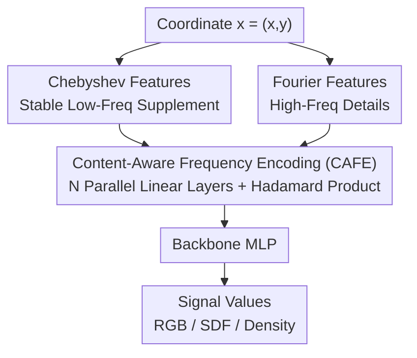

# Content-Aware Frequency Encoding for Implicit Neural Representations with Fourier-Chebyshev Features

**Conference**: CVPR 2026  
**Paper**: [CVF Open Access](https://openaccess.thecvf.com/content/CVPR2026/html/Ke_Content-Aware_Frequency_Encoding_for_Implicit_Neural_Representations_with_Fourier-Chebyshev_Features_CVPR_2026_paper.html)  
**Code**: https://github.com/JunboKe0619/CAFE  
**Area**: Implicit Neural Representations  
**Keywords**: Implicit Neural Representations, Spectral Bias, Fourier Features, Chebyshev Polynomials, Frequency Encoding

## TL;DR
To address the inefficiency where Implicit Neural Representations (INRs) use fixed Fourier bases and force the MLP to "synthesize" target frequencies, this paper proposes CAFE. By passing Fourier features through multiple parallel linear layers followed by Hadamard products for frequency multiplication, the representable frequency set is expanded exponentially from $M$ fixed bases to $O(MN3^{N-1})$, using learnable weights to select task-relevant frequencies. Supplemented by Chebyshev features for low-frequency stability (CAFE+), the method consistently outperforms baselines like SIREN, FINER, and SL2A on image fitting, 3D shapes, and NeRF (with image fitting PSNR improving by up to ~5 dB).

## Background & Motivation
**Background**: Implicit Neural Representations (INRs) use an MLP to learn a continuous mapping from "coordinates to signal values," widely applied in continuous super-resolution, image compression, inverse problems, and neural rendering. To enable the MLP to express high-frequency details, the mainstream approach involves projecting coordinates into a high-dimensional space spanned by a set of sine/cosine bases using Fourier features (e.g., RFF, Positional Encoding). This improves the spectral properties of the Neural Tangent Kernel (NTK) and mitigates the "spectral bias" where MLPs naturally prefer low frequencies.

**Limitations of Prior Work**: These Fourier encodings rely on **fixed frequency bases**. Theoretically (Theorem 1), an MLP can represent target frequencies as integer linear combinations of initial sampling frequencies $\sum_t s_t \Omega_t$. While deepening the network could expand the range of synthesizable frequencies, in practice, Fourier feature networks are extremely sensitive to initial sampling frequencies. Furthermore, increasing depth yields diminishing returns (Figure 1: PSNR remains stagnant when 256-RFF is deepened from 4 to 8 layers), and widening the network only provides marginal gains at a high parameter cost. In other words, forcing deep MLPs to "implicitly" synthesize and pick target frequencies via non-linearity is both inefficient and difficult to optimize.

**Key Challenge**: The representation bottleneck lies not in the MLP capacity, but in the **mechanism of frequency synthesis**—the path of using fixed bases and letting the MLP implicitly approximate frequencies is inherently inefficient.

**Goal**: To "offload" the arduous task of synthesizing target frequencies from the MLP **to the encoding stage**, allowing the encoding itself to efficiently and explicitly generate a vast range of frequencies and adaptively select them based on signal content.

**Key Insight**: To generate more frequencies "out of thin air" from fixed bases, the key is to introduce **multiplicative interactions**. Trigonometric identities $\sin a \sin b$ and $\cos a \cos b$ produce sum frequencies $a+b$ and difference frequencies $a-b$. Thus, a small number of bases can be multiplied to combine into exponentially many new frequencies. The authors use learnable linear layers to drive these multiplicative interactions.

**Core Idea**: Use "parallel linear layers + Hadamard products" to explicitly synthesize a vast range of frequency bases in the encoding stage (CAFE), and use Chebyshev features to provide stable low-frequency representations (CAFE+).

## Method

### Overall Architecture
CAFE+ is an **encoding-side** modification that preserves the backbone MLP structure. Given an input coordinate $\mathbf{x}\in\mathbb{R}^D$ (e.g., pixel coordinates $(x,y)$), it is first mapped into Fourier features $\Phi_{\text{FF}}(\mathbf{x})$ and Chebyshev features $\Phi_{\text{CF}}(\mathbf{x})$, which are then concatenated. This concatenated vector is fed into $N$ **parallel** linear layers, each producing an output $H_i$. These $N$ outputs undergo a **Hadamard product (element-wise multiplication)** to yield the CAFE+ encoded features $\Psi(\mathbf{x})$. Finally, $\Psi(\mathbf{x})$ is fed into the backbone MLP to regress the target values (RGB, SDF, density, etc.). This pipeline specifically targets the "coordinate to encoding" segment, explicitly placing frequency synthesis within the encoding.

Notably, unlike the **serial recursive** multiplication used in MFN or BACON, CAFE utilizes an **encoding-based parallel architecture**, which is faster to train and does not require the complex initialization schemes seen in BACON.

### Key Designs

**1. Content-Aware Frequency Encoding (CAFE): Exponentially Expanding Fixed Bases via Parallel Linear Layers + Hadamard Products**

Simply increasing the number of Fourier features $M$ and adding learnable weights might seem like "selecting frequencies from a wider spectrum," but the representable frequency set only grows **linearly** with $M$. CAFE instead utilizes multiplicative interactions. For a coordinate $\mathbf{x}$, Fourier features $\Phi_{\text{FF}}(\mathbf{x})=[\sin(2\pi\boldsymbol{\omega}_i^\top\mathbf{x}),\cos(2\pi\boldsymbol{\omega}_i^\top\mathbf{x})]_{i=1}^M$ are computed and fed into $N$ parallel linear layers $H_i(\mathbf{x})=\mathbf{W}_i\Phi_{\text{FF}}(\mathbf{x})+\mathbf{b}_i$. These are fused via a Hadamard product:

$$\Psi(\mathbf{x}) = \bigodot_{i=1}^{N} H_i(\mathbf{x})$$

How does this "create" more frequencies? Taking two linear layers as an example, the multiplication of sine components in $\psi = h^{(1)}\odot h^{(2)}$ generates **sum frequencies** $\theta_i+\theta_m$ and **difference frequencies** $\theta_i-\theta_m$ through product-to-sum identities. Their coefficients are determined by weight combinations like $C_a=w^{(s)}_{1}w^{(s)}_{2}$ and $C_b=w^{(c)}_{1}w^{(c)}_{2}$. This implies the network can **actively suppress** unwanted frequencies or enhance necessary ones by driving certain coefficient combinations to zero—this is the source of "content awareness." Theorem 2 formalizes this: the representable frequency set of CAFE+ is:

$$\mathcal{F}_{\rm CAFE}^{+} = \Big\{ \textstyle\sum_{i=1}^{N} \sigma_i \boldsymbol{\omega}_{k_i} \;\Big|\; \boldsymbol{\omega}_{k_i}\in\mathcal{F}_{\rm base},\ \sigma_i\in\{-1,0,+1\} \Big\}$$

The scale reaches $O(MN3^{N-1})$, exhibiting exponential expansion relative to $M$. Unlike Theorem 1, where frequencies are implicitly formed by deepening the MLP, CAFE moves this to the encoding stage. Consequently, **adding every additional parallel linear layer directly improves performance** (Figure 1, Figure 8), whereas deepening the MLP in RFF shows little gain. The authors also compare NTK matrices (Figure 3), showing that CAFE has a better condition number, confirming its superiority from an optimization perspective.

**2. Chebyshev Features (CAFE+): Providing a Stable Low-Frequency Basis**

The frequencies CAFE can synthesize still rely on **randomly initialized** Fourier bases. Real-world signals concentrate energy in low frequencies, but random sampling may not cover critical low-frequency bases. Since networks tend to learn low frequencies first, the absence of these bases forces the network to "misuse" high-frequency bases to compensate, introducing noise in low-frequency regions and harming high-frequency reconstruction. Furthermore, Fourier bases are not efficient at modeling smooth low-frequency structures, often producing noise in those areas.

To address this, the authors introduce Chebyshev features: $\Phi_{\text{CF}}(\mathbf{x})=[T_j(x_d)]_{d=1\dots D;\,j=0\dots J-1}$, where $T_j$ are Chebyshev polynomials of the first kind, following the recurrence $T_0=1, T_1=x, T_{j+2}(x)=2xT_{j+1}(x)-T_j(x)$. Chebyshev polynomials are chosen for their near-optimal approximation properties for smooth functions (minimax error), orthogonality on $[-1,1]$, bounded oscillation, and numerical stability. They are naturally suited for low-frequency/smooth structures, complementing the high-frequency strengths of Fourier features. Crucially, Chebyshev polynomials also satisfy a product-to-sum identity $T_p(x)T_q(x)=\tfrac12[T_{p+q}(x)+T_{|p-q|}(x)]$, allowing the **entire CAFE multiplication mechanism to be applied to the Chebyshev domain**:

$$\Psi(\mathbf{x}) = \bigodot_{i=1}^{N} \big\{ \mathbf{W}_i [\Phi_{\text{FF}}(\mathbf{x}),\ \Phi_{\text{CF}}(\mathbf{x})] + \mathbf{b}_i \big\}$$

At inference time, masking either feature set (Figure 5) reveals a clear division of labor: Chebyshev provides stable global/low-frequency structures, while Fourier handles fine high-frequency details. Theorem 3 further proves that an MLP acting on Chebyshev features maintains its representation as a linear combination of basis functions, ensuring stable fitting of low-frequency components.

### Loss & Training
The method only modifies the encoding, and the training objective is the standard reconstruction loss for each task. All experiments use the Adam optimizer with task-specific learning rates and schedules. Image fitting uses RFF with a fixed scale=30, while NeRF uses PE. Hardware consists of a single RTX 4090. Hyperparameters primarily include the number of parallel linear layers $N$, Fourier scale $s$, and Chebyshev order $J$.

## Key Experimental Results

### Main Results
The method is compared against SIREN/WIRE/SCONE/FINER/SL2A/GAUSS on 2D image fitting (8 images from DIV2K, PSNR), 3D shape representation (5 shapes, IoU), and NeRF (4 Blender scenes, PSNR).

2D Image Fitting (PSNR / dB, select results; Ours(L) is a large variant aligned with the training time of the fastest baseline):

| Method | D2K1 | D2K2 | D2K7 | Param | Time(s) |
|------|------|------|------|-------|---------|
| SIREN | 40.08 | 36.68 | 37.58 | 0.20M | 148 |
| FINER | 42.33 | 39.44 | 39.73 | 0.20M | 204 |
| SL2A | 41.91 | 39.87 | 40.23 | 0.46M | 271 |
| **Ours** | 42.57 | 42.13 | 42.61 | 0.22M | **108** |
| **Ours (L)** | **44.34** | **44.18** | **45.01** | 0.33M | 150 |

3D Shapes (IoU %) and NeRF (PSNR / dB):

| Task | Data | Top Baseline | Ours |
|------|------|----------|------|
| 3D shape | Thai statue (IoU) | SL2A 0.9987 | **0.9992** |
| 3D shape | Armadillo (IoU) | SL2A 0.9993 | **0.9996** |
| NeRF | Lego (PSNR) | FINER 30.78 | **31.86** |
| NeRF | Hotdog (PSNR) | SIREN 33.91 | **34.65** |

Ours achieves the best results while maintaining similar or fewer parameters and shorter training times. In image fitting, Ours(L) improves by ~3–5 dB over the strongest baseline. It ranks first in IoU for all 5 3D shapes with the fastest training (860s). In NeRF, it ranks first in 3 out of 4 scenes and ties in Drums.

### Ablation Study
Decoupling CAFE and Chebyshev components (PSNR / dB, average of 5 test images):

| CAFE | Chebyshev | D2K0 | D2K2 | D2K4 | Description |
|------|-----------|------|------|------|------|
| ✗ | ✗ | 26.18 | 30.98 | 30.92 | Degenerates to standard RFF |
| ✗ | ✓ | 33.00 | 35.60 | 35.91 | Chebyshev bases only |
| ✓ | ✗ | 34.87 | 40.42 | 40.52 | CAFE only (pure Fourier) |
| ✓ | ✓ | **39.47** | **44.18** | **44.97** | Full CAFE+ |

Backbone MLP depth ablation (PSNR / dB, mean of 3 images):

| MLP Layers | Avg PSNR | Description |
|----------|-----------|------|
| 0 | 35.56 | Removing MLP causes significant drop |
| 1 | 41.03 | Single layer is nearly sufficient |
| 2 | Marginal gain | Further depth yields diminishing returns |

### Key Findings
- **CAFE is the engine, Chebyshev is the stabilizer**: Adding CAFE (pure Fourier) alone boosts RFF from ~26–31 dB to ~35–40 dB. Layering Chebyshev further boosts it to ~39–45 dB. They are complementary—Chebyshev stabilizes low frequencies and suppresses low-frequency noise, while Fourier captures fine details (confirmed by the masking experiment in Figure 5).
- **Frequency synthesis is indeed "outsourced" to the encoding**: Removing the MLP leads to a sharp performance drop (35.56), but a 1-layer MLP reaches 41.03. Further depth adds little, indicating most frequency synthesis is done at the encoding stage, relieving the MLP of that burden. This aligns with Figure 1: RFF depth is ineffective, while CAFE parallel layers are effective.
- **Robustness and controlled overhead**: PSNR increases steadily with $N$ and saturates eventually. Computation scales approximately linearly with the order. Performance is stable for Fourier scale 20–50 and Chebyshev order $J>16$.

## Highlights & Insights
- **Reframing "Spectral Bias" as a "Frequency Synthesis" problem**: Rather than designing new activation functions or stacking layers, the authors argue the bottleneck is forcing MLPs to implicitly approximate frequencies. Moving this explicitly to the encoding stage is the most insightful contribution.
- **Exponential expansion via Hadamard product + trig identities**: Multiplying a few bases generates $O(MN3^{N-1})$ frequencies. Learnable weights acting as filters allow for both creating and selecting frequencies. This is supported by both theory (Theorem 2) and NTK analysis (Figure 3).
- **Parallel replaces Serial**: Compared to the serial recursive synthesis in MFN/BACON, the parallel linear layers train faster and avoid the need for meticulously designed initialization.
- **Complementary and Transferable Fourier+Chebyshev**: The concept that "Fourier handles high-freq, Chebyshev handles low-freq/smoothness, and both follow product-to-sum rules" is transferable to any task relying on positional or frequency encoding.

## Limitations & Future Work
- **Encoding Overhead**: Parallel linear layers and Hadamard products introduce extra computation. The trade-off in extreme real-time or large-scale scenarios needs further exploration.
- **Hyperparameter Tuning**: Chebyshev order $J$ and Fourier scale $s$ still require manual tuning. While a robust range is shown, an adaptive selection scheme is missing.
- **Effective Frequency Utilization**⚠️: While the theoretical set $O(MN3^{N-1})$ is large, "representable" does not mean "effectively learned." The actual size and efficiency of the activated frequency subset were not deeply quantified.
- **Task Coverage**: Primarily focused on classic INR (Image fitting/SDF/NeRF). Adaptability to complex signals like video, dynamic scenes, or more challenging inverse problems remains to be verified.

## Related Work & Insights
- **vs RFF / PE (Fixed Fourier Bases)**: These rely on predefined sine bases and force implicit synthesis in the MLP. They are sensitive to initialization and depth-invariant. CAFE explicitly synthesizes and adaptively selects frequencies, expanding the set from linear $O(M)$ to exponential $O(MN3^{N-1})$.
- **vs MFN / BACON (Serial Hadamard Synthesis)**: Also use multiplication for frequency synthesis but via serial recursion, requiring careful initialization. CAFE uses a parallel encoding architecture that is faster and more robust to initialization.
- **vs SAPE / SCONE (Adaptive/Local Fourier Basis Allocation)**: They are still limited by the fixed Fourier basis pool. CAFE+ actively synthesizes new bases and uses Chebyshev to stabilize low frequencies.
- **vs SIREN / WIRE / FINER / SL2A (Modified Activations)**: These mitigate spectral bias from the activation/network side. This work is orthogonal, solving it from the encoding side, and outperforms these baselines while theoretically being stackable with them.

## Rating
- Novelty: ⭐⭐⭐⭐⭐ Reframes spectral bias as a synthesis issue. Uses parallel layers + Hadamard products for exponential base expansion with theoretical backing.
- Experimental Thoroughness: ⭐⭐⭐⭐ Covers image fitting, 3D shapes, and NeRF with extensive ablation and hyperparameter analysis, though tasks are standard INR.
- Writing Quality: ⭐⭐⭐⭐⭐ Clear logic from motivation to theory to mechanism and experiments. Excellent coordination between Theorems and visualizations.
- Value: ⭐⭐⭐⭐ Plug-and-play encoding modification orthogonal to activation-based methods, high practical value for the INR community.

<!-- RELATED:START -->

## Related Papers

- [\[CVPR 2026\] NTK-Guided Implicit Neural Teaching](ntk-guided_implicit_neural_teaching.md)
- [\[CVPR 2025\] End-to-End Implicit Neural Representations for Classification](../../CVPR2025/3d_vision/end-to-end_implicit_neural_representations_for_classification.md)
- [\[CVPR 2026\] Task-Driven Implicit Representations for Automated Design of LiDAR Systems](task-driven_implicit_representations_for_automated_design_of_lidar_systems.md)
- [\[CVPR 2026\] Neural Gabor Splatting: Enhanced Gaussian Splatting with Neural Gabor for High-frequency Surface Reconstruction](neural_gabor_splatting.md)
- [\[ECCV 2024\] G2fR: Frequency Regularization in Grid-Based Feature Encoding Neural Radiance Fields](../../ECCV2024/3d_vision/g2fr_frequency_regularization_in_grid-based_feature_encoding_neural_radiance_fie.md)

<!-- RELATED:END -->
