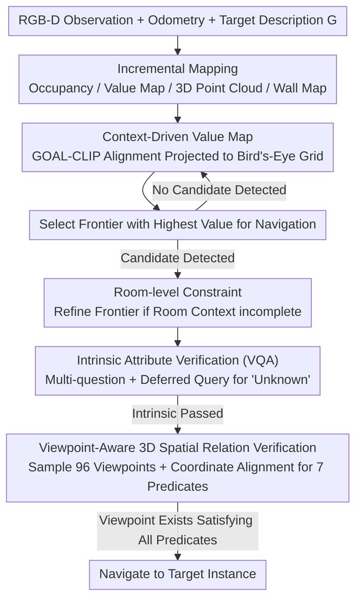

# Context-Nav: Context-Driven Exploration and Viewpoint-Aware 3D Spatial Reasoning for Instance Navigation

**Conference**: CVPR 2026  
**arXiv**: [2603.09506](https://arxiv.org/abs/2603.09506)  
**Area**: 3D Vision  
**Code**: None  
**Keywords**: Instance Navigation, Spatial Reasoning, value map, Viewpoint-Aware, Zero-shot

## TL;DR

Context-Nav promotes contextual information from long-text descriptions from posterior verification signals to prior exploration priors—guiding frontier selection via a context-driven value map and performing viewpoint-aware 3D spatial relationship verification at candidate targets, achieving SOTA on InstanceNav and CoIN-Bench without any training.

## Background & Motivation

**Background**: Text-Guided Instance Navigation (TGIN) requires an agent to locate a specific object instance in a 3D environment based on free-form text descriptions, necessitating the ability to distinguish a target from various distractors of the same category. Existing methods are categorized into three types: RL-based methods (data-hungry and fragile under distribution shifts), zero-shot modular methods (matching operations suffer from viewpoint bias), and interactive methods (relying on unrealistic human QA).

**Limitations of Prior Work**: Existing methods **underestimate the value of text descriptions**—most systems simplify long descriptions into object label sets or structured representations, using local cues only during the verification stage. However, environmental context in descriptions (e.g., "in the kitchen, near the stairs") serves as powerful constraints that can significantly narrow the search space.

**Key Challenge**: Spatial relationships (e.g., "on the left", "in front of") depend on the observer's viewpoint, yet current methods either ignore viewpoint dependency or use only viewpoint-independent heuristic rules to check spatial relations.

**Goal**: (a) How to leverage full contextual descriptions to guide exploration? (b) How to handle viewpoint ambiguity in spatial relationships?

**Key Insight**: Shift contextual information from "post-matching verification" to "pre-exploration drive"—first explore regions semantically consistent with the entire description, then perform precise verification using 3D spatial reasoning.

**Core Idea**: Construct a value map using GOAL-CLIP to compute dense text-image alignment scores for frontier selection (exploration prior), and use viewpoint sampling + frame alignment to verify arbitrary spatial relation predicates (geometric verification).

## Method

### Overall Architecture

This paper addresses text-guided instance navigation: an agent receives a free-form text description (e.g., "the black chair in the kitchen near the stairs") and must navigate to that specific instance rather than any chair of the same class. The pipeline revolves around an inverted intuition—**promoting environmental context from "verify after finding candidates" to "driving where to go."**

**Mechanism**: The agent receives RGB-D observations, odometry, and target description $G$, while incrementally maintaining four types of maps: occupancy maps, context-conditioned value maps, instance-level 3D point cloud maps, and a wall-only map (for room segmentation). During exploration, the value map determines the movement; once a suspected target is detected in the point cloud map, a verification process is triggered, checking intrinsic attributes (color/shape/material) followed by extrinsic attributes (spatial relationships with other objects).

### Key Designs

**1. Context-Driven Value Map: Transforming Descriptions into Spatial Priors**

Common methods compress long descriptions into a single object label, discarding context like "in the kitchen, near the stairs," which wastes information critical for narrowing the search. This work uses GOAL-CLIP (fine-tuning CLIP to support local alignment of long text and images) to encode both the full description $G$ and each frame $X_t$, calculating pixel-wise text-image similarity. These are projected onto a bird's-eye grid using depth and pose to accumulate a dense value map $V_t$. During exploration, the agent ranks all frontiers (boundaries between known and unknown space) by value and navigates to the highest-scoring one. GOAL-CLIP is used instead of vanilla CLIP because the latter fails with long sentences, whereas GOAL-CLIP leverages local image-sentence matching and token-level correspondence to ground contextual cues in specific spatial locations—using a full-description value map improves SR by +6.6 compared to category labels only.

**2. Room-level Constraints: Preventing Back-and-Forth Oscillation**

Relying solely on global value ranking might cause an agent to catch a glimpse of the target but then leave because another frontier has a higher score. To address this, the authors maintain a "wall-only map": RANSAC segments vertical planes, filtering out furniture to leave only walls, followed by connected component analysis to segment rooms. When a target is detected but its room context (contextual objects) hasn't been fully observed, the agent overrides frontier selection to explore the nearest unexplored frontier in the same room. This override triggers only once per room to preserve the overall exploration rhythm.

**3. Intrinsic Attribute Verification (VQA): Handling VLM Fragility via Multi-question and Adaptive Re-querying**

The first verification stage checks intrinsic attributes (color, shape, material) via VLM. Since VLMs are sensitive to prompts and lighting/occlusions may cause misjudgment, the system uses an LLM to parse descriptions into several yes/unknown/no questions. The VLM outputs a confidence score $s \in \{0,\dots,15\}$ for each, discretized into three tiers. If "unknown" is returned, the system defers judgment and re-queries in the next 5 frames using the frame with the highest text-image similarity—waiting for a clearer angle.

**4. Viewpoint-Aware 3D Spatial Relation Verification: Geometric Verification of Viewpoint-Dependent Relations**

The second stage checks extrinsic spatial relationships. Relations like "on the left of the chair" depend on the observer's position. This work decomposes the verification into four steps, centering on exhaustive viewpoint sampling. First, room-level filtering ensures the target and reference object are in the same room (geodesic distance $\leq 3$m). Then, candidate observer positions are sampled around the reference object: $N_\theta=24$ azimuthal angles $\times 4$ radii $r \in \{0.8, 1.2, 1.6, 2.0\}$ totaling $\mathcal{V}$ candidates. For each candidate viewpoint $v$, a local reference frame is constructed where $+\hat{x}$ points toward the reference object, with a yaw angle:

$$\psi = \text{atan2}\big((c_r)_y - v_y,\ (c_r)_x - v_x\big)$$

All object centers are transformed into this viewpoint-aligned coordinate system. Finally, 7 binary predicates with tolerances (left/right/front/behind/near/above/below) are evaluated. If **at least one viewpoint** $v^* \in \mathcal{V}$ exists where all description predicates are satisfied, the verification passes. This transforms viewpoint ambiguity into a solvability check.

### Example Walkthrough

Consider "the black chair in the kitchen near the refrigerator and to the left of the dining table." Initially, GOAL-CLIP projects the description onto the value map; the kitchen area highlights due to "kitchen/refrigerator/dining table" cues. The agent navigates toward the high-value kitchen frontier. Inside, two black chairs (candidates) are detected. Room-level constraints find the dining table hasn't been fully seen, forcing a local exploration. In verification: VLM confirms both chairs are black. In viewpoint-aware verification for "left of the table," 96 viewpoints are sampled around the table. Chair A satisfies "near refrigerator + left of table" from certain viewpoints, while Chair B fails regardless of the viewpoint. Chair A is navigated to as the target.

### Loss & Training

The entire pipeline is training-free—value map construction, spatial reasoning, and attribute verification require no task-specific training. Low-level navigation reuses a pre-existing depth-only point-goal policy (Variable Experience Rollout trained on HM3D) to reach frontiers.

## Key Experimental Results

### Main Results

Results on InstanceNav and CoIN-Bench:

| Method | Training | InstanceNav SR/SPL | CoIN Val Seen SR/SPL | CoIN Synonyms SR/SPL | CoIN Unseen SR/SPL |
|------|---------|---------|---------|---------|---------|
| PSL (RL Trained) | No | 26.0/10.2 | 8.8/3.3 | 8.9/2.8 | 4.6/1.4 |
| GOAT (RL Trained) | No | 17.0/8.8 | 6.6/3.1 | 13.1/6.5 | 0.2/0.1 |
| UniGoal (Zero-shot) | Yes | 20.2/11.4 | 2.8/2.4 | 3.9/3.2 | 2.6/2.2 |
| AIUTA (Interactive) | Yes | - | 7.4/2.9 | 14.4/8.0 | 6.7/2.3 |
| **Context-Nav** | **Yes** | **26.2/9.1** | **13.5/6.7** | **20.3/10.9** | **11.3/5.2** |

### Ablation Study

**Backbone and Prompt Ablation** (CoIN Val Seen Synonyms):

| Backbone | Prompt | SR ↑ | SPL ↑ |
|------|--------|------|-------|
| BLIP-2 | Category only | 15.9 | 7.3 |
| BLIP-2 | Full Text | 16.4 | 9.5 |
| GOAL-CLIP | Category only | 13.7 | 7.6 |
| GOAL-CLIP | Intrinsic only | 16.7 | 9.7 |
| **GOAL-CLIP** | **Full Text** | **20.3** | **10.9** |

**Module Contributions**:

| Variant | SR ↑ | SPL ↑ |
|------|------|-------|
| Full approach | 20.3 | 10.9 |
| Replace w/ Nearest Frontier | 10.6 (-9.7) | 4.6 (-6.3) |
| w/o VLM Category Verification | 11.1 (-9.2) | 7.1 (-3.8) |
| w/o Attribute Verification | 12.5 (-7.8) | 7.7 (-3.2) |
| w/o Spatial Relation Verification | 12.0 (-8.3) | 8.4 (-2.5) |

### Key Findings

- **GOAL-CLIP + Full Text is the strongest combination**: Using full contextual descriptions provides a +6.6 Gain in SR over category names, proving context is effectively converted into spatial priors.
- **Substantial module contributions**: Removing value map ranking (SR -9.7) > Category verification (SR -9.2) > Spatial verification (SR -8.3) > Attribute verification (SR -7.8).
- **Zero-shot outperforms RL training**: Context-Nav achieves an SR of 26.2 on InstanceNav without TGIN-specific training, surpassing the RL-trained PSL (26.0).

## Highlights & Insights

- **Paradigm shift from verification signal to exploration prior**: Contextual information is used to drive direction from the start rather than just post-hoc filtering.
- **Viewpoint-aware spatial reasoning**: By sampling observer viewpoints, a philosophical ambiguity is converted into a geometric satisfiability problem.
- **Wall-map for room segmentation**: Segmenting rooms via vertical planes effectively avoids furniture interference.

## Limitations & Future Work

- Viewpoint sampling is discrete (96 candidates), potentially missing valid viewpoints.
- Fixed tolerances for spatial predicates ($\varepsilon_m=0.15$m, $\varepsilon_\theta=25°$) may need adaptive scaling.
- Dependence on GOAL-CLIP's alignment—abstract or metaphorical descriptions may degrade value map quality.
- High computational latency due to multiple running modules (SAM, VLM, detectors).

## Related Work & Insights

- **vs UniGoal**: UniGoal decomposes descriptions but lacks full contextual guidance for exploration. Ours achieves 5x SR on CoIN Synonyms.
- **vs AIUTA**: AIUTA relies on human interaction; Ours demonstrates that context within the description is sufficient for disambiguation.
- **vs PSL**: Ours achieves comparable or better SOTA results without the need for RL training.

## Rating

- Novelty: ⭐⭐⭐⭐⭐ 
- Experimental Thoroughness: ⭐⭐⭐⭐⭐ 
- Writing Quality: ⭐⭐⭐⭐⭐ 
- Value: ⭐⭐⭐⭐ 

<!-- RELATED:START -->

## Related Papers

- [\[CVPR 2026\] Deformation-based In-Context Learning for Point Cloud Understanding](deformation-based_in-context_learning_for_point_cloud_understanding.md)
- [\[CVPR 2026\] Featurising Pixels from Dynamic 3D Scenes with Linear In-Context Learners](featurising_pixels_from_dynamic_3d_scenes_with_linear_in-context_learners.md)
- [\[CVPR 2026\] Mamba Learns in Context: Structure-Aware Domain Generalization for Multi-Task Point Cloud Understanding](mamba_learns_in_context_structure-aware_domain_generalization_for_multi-task_poi.md)
- [\[CVPR 2026\] tttLRM: Test-Time Training for Long Context and Autoregressive 3D Reconstruction](tttlrm_test-time_training_for_long_context_and_autoregressive_3d_reconstruction.md)
- [\[CVPR 2026\] Masking Matters: Unlocking the Spatial Reasoning Capabilities of LLMs for 3D Scene-Language Understanding](masking_matters_unlocking_the_spatial_reasoning_capabilities_of_llms_for_3d_scen.md)

<!-- RELATED:END -->
