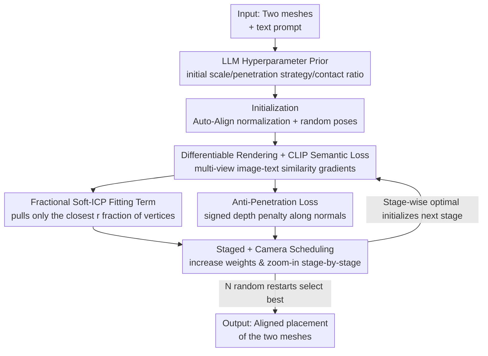

# Copy-Transform-Paste: Zero-Shot Object-Object Alignment Guided by Vision-Language and Geometric Constraints

**Conference**: CVPR 2026  
**Paper**: [CVF Open Access](https://openaccess.thecvf.com/content/CVPR2026/html/Gatenyo_Copy-Transform-Paste_Zero-Shot_Object-Object_Alignment_Guided_by_Vision-Language_and_Geometric_Constraints_CVPR_2026_paper.html)  
**Code**: None (Project page available in paper, implementation not public)  
**Area**: 3D Vision  
**Keywords**: object-object alignment, zero-shot, differentiable rendering, CLIP, soft ICP

## TL;DR
Given two meshes and a text prompt describing their spatial relationship (e.g., "Pinocchio wearing a hat"), this paper optimizes the relative pose and scale of the source mesh directly at test time using differentiable rendering to render meshes into images and propagating gradients from CLIP text-image similarity, without training a new model. By incorporating a "fractional soft-ICP alignment term + anti-penetration term + staged scheduling + camera focus" to ensure physical plausibility, the method outperforms all geometric and LLM baselines in semantic consistency and intersection volume on a self-constructed 50-pair benchmark, with 85% of users in a user study rating its results as matching the description best.

## Background & Motivation
**Background**: Placing two 3D objects together according to semantics (e.g., placing a cup on a saucer, or a cherry on top of a sundae) is a fundamental capability in content creation and scene assembly. Early methods primarily relied on pure geometric alignment (such as the ICP family) to fit two shapes together; recent works leverage pre-trained 2D diffusion models to model "language-conditioned object-to-object spatial relationships."

**Limitations of Prior Work**: Purely geometric methods only consider surface fitting and lack semantic understanding—they do not know that "a hat should be worn on the head" and might attach the hat to any nearby surface; diffusion-based methods require specialized training and rely heavily on data. Most critically, **data is scarce**: unlike human-object interaction (HOI), which has rich contact datasets and evaluation protocols, object-object interaction has almost no comparable resources, with the largest current dataset 2BY2 covering only 18 paired alignment tasks.

**Key Challenge**: Semantic intent (from language) and physical plausibility (contact, non-penetration) are two orthogonal constraints. Relying solely on language supervision can yield semantically correct but physically floating or penetrating placements; relying solely on geometric constraints can produce fits while completely ignoring semantics. Both must be satisfied simultaneously, yet there is no training data to learn from.

**Goal**: Under the premise of **zero-shot setting without training new models**, estimate the pose (translation + rotation + isotropic scaling) of the source mesh relative to the target mesh, so that the rendered results are both semantically consistent with the text and physically plausible in terms of contact and non-penetration.

**Key Insight**: Since there is no 3D alignment training data, pre-trained models can be used as "off-the-shelf judges." Through **differentiable rendering**, 3D poses are exposed to the image space, allowing CLIP's image-text similarity gradients to backpropagate directly to update the poses. The contact/penetration issues that language cannot resolve are addressed using classic geometric terms (ICP, penetration penalty).

**Core Idea**: Test-time pose optimization—"differentiable rendering + CLIP semantic gradient" handles semantics, while "fractional soft-ICP + anti-penetration" handles physics, coordinated by a staged curriculum and camera focus.

## Method

### Overall Architecture
The problem to solve is: given two meshes (source $M_S$ and target $M_T$, where the assignment of source and target is arbitrary) and a text prompt $t$, output the optimal pose parameters $\theta = (\tau, q, s)$ (translation, unit quaternion rotation, isotropic scale) of the source relative to the target, ensuring that the placement is both semantically correct and physically plausible. The entire process is **pure test-time optimization**: no networks are trained, and $\theta$ is treated as a learnable variable updated iteratively using Adam.

The overall pipeline is: first, normalize the target mesh to an upright orientation (reducing viewpoint ambiguity) $\rightarrow$ use an LLM to estimate several key hyperparameters based on object names and text (initial scale, whether penetration is allowed, contact ratio) $\rightarrow$ enter an optimization loop of $P$ **stages**. In each stage, the scene is assembled, rendered from multiple views using a differentiable renderer, and semantic + geometric losses are computed to update $\theta$ via gradients. The optimal result of stage $p$ initializes stage $p{+}1$, and the soft-ICP / anti-penetration weights are gradually increased across stages while zooming the camera in toward the interaction region. An outer loop of $N$ random restarts is applied, selecting the best result based on the total objective score.

### Key Designs

**1. Differentiable rendering-driven CLIP semantic loss: turning language intent into pose gradients**

The limitation is that there is no training data, so an explicit semantic aligner cannot be trained. This paper treats pretrained CLIP as an off-the-shelf scorer: at each step, a differentiable renderer $\mathcal{R}$ is used to render the current scene $S = M_T \cup \tilde{M}_S$ into $N$ images $\{I_i\}$ from $N$ cameras $\{c_i\}$. CLIP is used to encode the images $e_i = \mathrm{CLIP}_{\text{img}}(I_i)$ and text $e_t = \mathrm{CLIP}_{\text{text}}(t)$. The semantic loss is defined as the negative average cosine similarity:

$$\mathcal{L}_{\text{clip}} = -\frac{1}{N}\sum_{i=1}^{N}\mathrm{sim}(e_i, e_t), \quad \mathrm{sim}(e_i, e_t) = \frac{e_i \cdot e_t}{\|e_i\|\,\|e_t\|}.$$

Differentiable rendering acts as the crucial bridge: it allows similarity gradients with respect to pixels to be backpropagated all the way to the pose parameters $\theta$ of the explicit mesh. Consequently, "making the rendered image more like the text" is equivalent to "moving the source mesh to the semantically correct position". Changing the text changes the result—for the same two meshes, "left hand holding a carrot" and "right hand" will guide the objects to different placements, proving that semantic control indeed originates from language rather than geometry.

**2. Fractional soft-ICP alignment term: pulling only the "intended contact" vertices to avoid over-adhesion**

Relying solely on semantic loss can lead to semantically correct but floating solutions; geometric terms are needed to enforce surface contact. Standard soft-ICP utilizes probabilistic correspondence (assigning a softmax weight distribution over all target vertices for each source vertex) to robustly minimize the expected squared distance. However, it applies alignment to **all** source vertices—this forcibly pulls parts that should not be in contact (e.g., only the inner rim of a hat should touch the head, not the crown).

This paper's "fractional" variant only aligns the closest subset of source vertices: for each source vertex, it computes the minimum distance to the target $d_i^{\min} = \min_j \|v_i^S - v_j^T\|_2$, selects the $K = \lfloor rN_S \rfloor$ vertices with the smallest $d_i^{\min}$ to form a set $W$ (where $r \in (0,1]$ controls the contact range), and computes the soft correspondence loss only on this subset:

$$\mathcal{L}_{\text{icp}}(r) = \frac{1}{K}\sum_{i\in W}\sum_{j=1}^{N_T}\alpha_{ij}\,E_{ij}, \quad \alpha_{ij} = \frac{\exp(-E_{ij}/(2\sigma^2))}{\sum_{j'}\exp(-E_{ij'}/(2\sigma^2))},$$

where $E_{ij} = \|v_i^S - v_j^T\|_2^2$. When $r=1$, this degenerates to standard soft-ICP (broad alignment). Smaller $r$ values restrict the contact region. For example, for two slices of toast, $r=1.0$ fits the entire upper slice to the lower slice, while a smaller $r$ allows contact over only a small area. This $r$ is roughly estimated by the LLM based on object semantics (see Design 5).

**3. Anti-penetration loss: signed depth penalty along target normals with tolerance for soft materials**

The counterpart to contact alignment is avoiding interpenetration. Following ContactOpt, this paper penalizes the parts of the source mesh that "penetrate" the target mesh: for each target surface vertex $v_j^T$ and its outward normal $n_j^T$, the closest source vertex $v_{i^*(j)}^S$ is found, and the signed depth along the normal is computed. Penetration is penalized only when it exceeds a tolerance $c_{\text{pen}}$:

$$\mathcal{L}_{\text{pen}} = \sum_{j=1}^{N_T} \max\left(0,\; (v_j^T - v_{i^*(j)}^S)^\top n_j^T - c_{\text{pen}}\right).$$

The benefit of signed depth is that it only penalizes "internal" penetration (source vertices inside the target surface) without punishing normal external contact. The tolerance $c_{\text{pen}}$ controls the allowed depression: rigid contact uses $c_{\text{pen}}=0$, while soft materials (e.g., inserting a flower into a vase, or cutting an apple with a knife) take positive values (e.g., 2mm) to allow realistic slight embedding.

The total objective is a weighted sum of three terms: $\mathcal{L} = \lambda_{\text{CLIP}}\mathcal{L}_{\text{clip}} + \lambda_{\text{ICP}}\mathcal{L}_{\text{icp}} + \lambda_{\text{pen}}\mathcal{L}_{\text{pen}}$, where the CLIP term gradient comes from differentiable rendering and the two geometric terms are computed directly from the mesh geometry.

**4. Staged scheduling + camera scheduling: exploration before convergence, avoiding dilution of small objects**

Applying all losses simultaneously from the start causes issues: enforcing alignment/anti-penetration too early can cause the source mesh to get stuck in some incorrect local region. This paper adopts a curriculum of $P$ stages: each stage runs for a fixed number of steps, and the optimal pose at the end of a stage initializes the next. Across stages, soft-ICP and anti-penetration weights are **increased logarithmically**—lower weights in the early stage encourage broad exploration of candidate contact zones under language guidance, while higher weights in later stages lock in contact and eliminate penetration (in experiments, $\lambda_{\text{ICP}}$ and $\lambda_{\text{pen}}$ are scaled by $\times 10$ between the three stages).

Camera scheduling addresses another issue: when the source object is very small relative to the target scene (e.g., a cherry on a large cake), the small object occupies too few pixels in the rendered image, diluting the CLIP gradients. Thus, the camera's look-at target is interpolated from the target center to the source center stage-by-stage: $\mathbf{c}^{(p)} = (1-\beta_p)\mathbf{c}_t + \beta_p \mathbf{c}_s^{(p)}$, where $0 = \beta_1 < \cdots < \beta_P \le 1$, while zooming in the camera. Early stages provide global context, while later stages focus on the source object, exposing details to the semantic judge.

**5. Random restarts + LLM hyperparameter prior: mitigating local minima and injecting common sense**

Pose optimization is local and sensitive to initialization—if the source mesh starts near an incorrect region of the target, it will converge to a spurious contact. This paper enhances stability in two ways: first, $N$ independent random initializations are optimized, and the best-of-N is chosen based on the total objective score (using $N=5$ in experiments); second, a zero-mean small perturbation is added to the pose at each step to help escape local minima via random jittering.

More cleverly, an LLM is used to inject common sense into the scene by setting several key hyperparameters: given the object names + text, it returns ① **penetration strategy** (boolean, e.g., 'cutting an apple with a knife' should allow penetration $\rightarrow$ setting $\lambda_{\text{pen}}$ to zero); ② **initial scale** (the real-world scale ratio of the two objects, clamped to $[0.1, 10]$ to initialize $s$); ③ **contact ratio** (rough contact range estimation $\rightarrow$ mapped to $r$ in soft-ICP). This allows the method to avoid manual hyperparameter tuning for each pair, utilizing human common sense as a prior.

## Key Experimental Results

### Main Results
Benchmark: A self-constructed dataset of 50 mesh-text pairs covering diverse object-object relationships. Evaluation uses three metric categories: semantic (CLIP/ALIGN/SigLIP text-image consistency, higher is better), physical (Intersection volume $= \mathrm{Vol}(\cap)/\mathrm{Vol}(\cup)$, lower is better), and GPTEval3D scores from GPT-4V. Each pair is run for 2000 steps with 8 views per step, $P=3$ stages, and $N=5$ restarts.

| Method | CLIP↑ | ALIGN↑ | SigLIP↑ | Intersection Vol.↓ | Total Score↑ |
|------|-------|--------|---------|-----------|---------|
| **Ours** | **0.3224** | 14.9800 | 0.0380 | 0.0112 | **1034.44** |
| B1 (Shrinkwrap single start) | 0.3087 | 14.1484 | 0.0374 | 0.0090 | 1005.92 |
| B2 (Shrinkwrap multi-start + CLIP select) | 0.3157 | 14.1897 | 0.0362 | 0.0118 | 1019.69 |
| SceneTeller | 0.3040 | 13.2522 | 0.0367 | **0.0051** | 963.80 |
| SMC | 0.3069 | 14.1704 | 0.0370 | 0.0244 | 991.19 |
| Ours (+ scale) | 0.3176 | **15.0350** | 0.0380 | 0.0110 | 1005.10 |

The proposed method achieves the highest scores across all three semantic metrics while maintaining competitive intersection volumes. SceneTeller achieves the lowest average intersection (0.0051) but often at the expense of semantics—it minimizes penetration but frequently misses the intended interaction, which is a classic case of "physically correct but semantically wrong." In the trade-off plot (Fig. 7), Ours lies in the bottom-right corner (high semantics + low penetration).

### Ablation Study
Ablated components on examples such as coatrack (target) & hat (source):

| Configuration | CLIP↑ | Intersection Vol.↓ | Description |
|------|-------|-----------|------|
| Full model | 0.3224 | 0.0112 | Full method |
| w/o guidance | 0.3091 | 0.0099 | No semantic guidance; CLIP drops the most |
| w/o soft-ICP | 0.3214 | **0.0002** | No fitting, almost no contact (semantics drop slightly) |
| w/o penet. | 0.3223 | 0.0177 | No anti-penetration, intersection volume rises to 0.0177 |
| w/o phases | 0.3214 | 0.0141 | No staged curriculum |
| w/o camera adj. | 0.3201 | 0.0127 | No camera scheduling (most impact with large scale ratios) |
| SDS (replacing CLIP) | 0.3167 | 0.0148 | Replaced with score distillation, directional signal is weak |
| SigLIP (replacing CLIP) | 0.3145 | 0.0136 | Replaced with SigLIP guidance |

The user study (15 instances, 47 participants) shows even more striking results: 85.24% rated the proposed method's results as most consistent with the description (compared to only 3.32/7.98/1.73/1.73% for B1/B2/SceneTeller/SMC), and 79.65% rated them as physically most plausible. The LLM hyperparameter prediction was also validated on 61 held-out instances (binary accuracy for penetration strategy + MAE for scale/contact ratio).

### Key Findings
- **Removing semantic guidance leads to the largest drop** (CLIP 0.3224 $\rightarrow$ 0.3091): the CLIP term is the primary driver for semantic alignment, and geometric terms cannot replace it.
- **Soft-ICP and anti-penetration act as antagonistic terms**: removing soft-ICP drops intersection to 0.0002 (because there is no fitting/contact), while removing anti-penetration increases intersection to 0.0177 (causing penetration)—both must be balanced to achieve "contact without penetration".
- **SDS is inferior to CLIP**: the authors hypothesize that the random gradients from generative SDS provide weaker directional signals for pose updates than the contrastive image-text similarity of CLIP.
- **The benefits of camera scheduling are concentrated on a few samples with large scale ratios**, so while the average metrics for `w/o camera adj.` seem close, it is crucial for challenging cases like "small objects on large scenes".

## Highlights & Insights
- **Reframing alignment as a "render-score-backpropagate" test-time optimization**: Instead of training a model from scratch, this paper utilizes differentiable rendering to expose the 3D pose to CLIP, bypassing the scarcity of 3D object-object interaction data. This is the most elegant "aha!" moment of the paper.
- **Fractional soft-ICP is a small but precise improvement**: Standard soft-ICP fits all vertices, leading to over-adhesion. Selecting only the closest $r$ fraction of vertices and estimating $r$ via an LLM formulation elevates the question of "where to touch" from a geometric problem to a semantic one.
- **Using LLM as a hyperparameter prior generator**: Hardcoding common-sense rules like penetration strategy (such as allowing a knife to penetrate an apple, but not a cup on a saucer) is difficult. Outsourcing this to an LLM via simple prompts is a highly practical paradigm of "LLM-as-prior" that can be transferred to other geometric optimization tasks requiring common sense.
- **Curriculum of antagonistic losses**: Soft-ICP (pulling together) and anti-penetration (pushing apart) are naturally antagonistic. A staged logarithmic weighting curriculum combined with best-of-N selection allows the system to smoothly transition from exploration to convergence, avoiding early local minima lock-in.

## Limitations & Future Work
- **Dependence on CLIP's viewpoint semantics**: The semantic representation relies heavily on CLIP similarity of rendered views. It may struggle with fine-grained or rare spatial relations where CLIP itself is weak (such as distinguishing subtle spatial prepositions).
- **High cost of test-time optimization**: Running 2000 steps $\times$ 8 views $\times$ 5 restarts $\times$ 3 stages per pair is significantly slower than forward-inference methods, making it less suitable for real-time or large-scale scene assembly.
- **Rigid + isotropic scale only**: The method only optimizes translation, rotation, and a single isotropic scale, failing to handle non-rigid deformations, articulated objects, or multi-object assembly (the burger in Fig. 1 is created by sequentially chaining stages rather than end-to-end multi-body optimization).
- **Limited benchmark scale**: While 50 pairs is larger than 2BY2's 18, it is still small; replication is dependent on the release of the meshes and prompts. Future work could replace the best-of-N with smarter global initialization or leverage stronger 3D-aware semantic models instead of CLIP.

## Related Work & Insights
- **vs Classic ICP / SnapPaste (Geometric Alignment)**: These rely solely on geometric fitting without semantic understanding, attaching source objects to any nearby surface. The proposed method adds CLIP semantic gradients to the ICP contact constraint, allowing text to determine "where to attach." B1/B2 (Shrinkwrap) are geometric baselines representing this class.
- **vs OOR-diffusion (Diffusion for Spatial Relationships)**: OOR-diffusion uses a two-stage pipeline—lifting synthetic object-pair images to 3D to create training data, and then training a text-conditioned diffusion model to sample poses. The proposed method is entirely zero-shot, optimized at test-time, and requires no model training.
- **vs SceneTeller / SMC (LLM-driven Scene Layout)**: These methods use LLMs to instantiate programmatic scene layouts. While strong at arranging multiple indoor objects, they lack fine-grained semantic fitting (as shown by their significantly lower semantic scores and ~2% user preference in the experiments). The proposed method limits LLM usage to hyperparameter priors and relies on differentiable rendering for actual alignment.
- **vs Text2Mesh / TextDeformer (Differentiable Rendering + Text-based Mesh Editing)**: These utilize the same "rendering $\rightarrow$ CLIP $\rightarrow$ backpropagation" paradigm to modify mesh textures or geometry. The proposed method shares the paradigm but differs in objective—it does not alter the underlying shapes but instead optimizes the relative poses of the two meshes.

## Rating
- Novelty: ⭐⭐⭐⭐ Reframing zero-shot object-object alignment as a differentiable rendering test-time optimization and utilizing LLMs as hyperparameter priors is highly novel, though the individual components are clever assembly of existing techniques.
- Experimental Thoroughness: ⭐⭐⭐⭐ Self-constructed benchmark + three semantic metrics + intersection volume + GPT-4V + user study + LLM hyperparameter validation make for a comprehensive evaluation; however, the benchmark contains only 50 pairs, and some baselines are non-open-source.
- Writing Quality: ⭐⭐⭐⭐ Clear motivation, complete mathematical formulation, and thorough analysis of the ablation study (the antagonistic nature of soft-ICP and anti-penetration).
- Value: ⭐⭐⭐⭐ Provides a practical, training-free approach for data-scarce object-object alignment, offering transfer value for content creation and scene assembly tasks through its differentiable rendering + LLM-prior paradigm.

<!-- RELATED:START -->

## Related Papers

- [\[CVPR 2026\] Zero-Shot Depth Completion with Vision-Language Model](zero-shot_depth_completion_with_vision-language_model.md)
- [\[CVPR 2026\] ConceptPose: Training-Free Zero-Shot Object Pose Estimation using Concept Vectors](conceptpose_training-free_zero-shot_object_pose_estimation_using_concept_vectors.md)
- [\[CVPR 2026\] Zoo3D: Zero-Shot 3D Object Detection at Scene Level](zoo3d_zero-shot_3d_object_detection_at_scene_level.md)
- [\[CVPR 2026\] Scenes as Tokens: Multi-Scale Normal Distributions Transform Tokenizer for General 3D Vision-Language Understanding](scenes_as_tokens_multi-scale_normal_distributions_transform_tokenizer_for_genera.md)
- [\[CVPR 2026\] LAM: Language Articulated Object Modelers](lam_language_articulated_object_modelers.md)

<!-- RELATED:END -->
