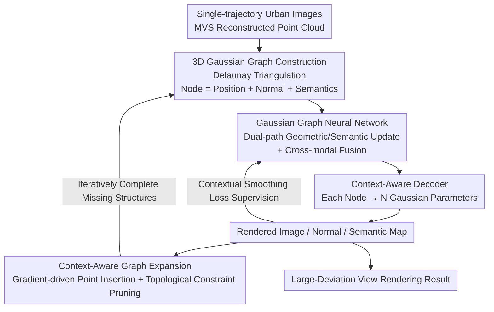

# CoRoGS: Contextual Gaussian Splatting for Robust Large-Deviation View Synthesis

**Conference**: CVPR 2026  
**Paper**: [CVF Open Access](https://openaccess.thecvf.com/content/CVPR2026/html/Ma_CoRoGS_Contextual_Gaussian_Splatting_for_Robust_Large_Deviation_View_Synthesis_CVPR_2026_paper.html)  
**Code**: None  
**Area**: 3D Vision  
**Keywords**: 3D Gaussian Splatting, Novel View Synthesis, Large-Deviation View, Graph Neural Network, Autonomous Driving Scene

## TL;DR
To address the limitations of narrow training view coverage and catastrophic degradation when extrapolating to large-deviation views in urban driving scenes, CoRoGS transforms each 3D Gaussian from an "independent primitive" into a "graph node." By constructing a Delaunay Gaussian Graph and utilizing a Graph Neural Network, it enables neighboring Gaussians to transfer geometric and semantic information to one another. Combined with a semantic-weighted contextual smoothing loss and gradient-driven graph expansion, CoRoGS significantly reduces FID/KID in large-deviation views on KITTI/Waymo datasets, and achieves a 2.25 dB PSNR improvement over the second-best method.

## Background & Motivation

**Background**: 3D Gaussian Splatting (3DGS), with its real-time rendering capabilities and photorealism, has become the mainstream representation for novel view synthesis (NVS) in urban scenes. It is widely used in data augmentation for autonomous driving and low-altitude perception.

**Limitations of Prior Work**: Urban data is typically collected along a **single trajectory** (the vehicle simply driving forward), resulting in very narrow coverage of training views. When rendering **large-deviation views** (e.g., lateral offsets during lane changes/overtaking, or elevating from a ground driving view to a bird's-eye view), existing 3DGS methods can only interpolate within the trajectory. Once extrapolated to unobserved regions, they suffer from geometric inconsistency, chaotic normal directions, and severe deformations/artifacts.

**Key Challenge**: Mainstream improvement paradigms—such as depth-based constraints (aligning Gaussian centers using LiDAR/depth maps) and normal-based constraints (optimizing Gaussian orientations to fit surfaces)—treat each Gaussian as an **independent primitive** to optimize. They only enforce local consistency while completely ignoring the **relational dependency** between Gaussians. Consequently, geometric deviations accumulate continuously in unobserved regions, causing the model to overfit to the training views and collapse under large-deviation settings.

**Goal**: To explicitly model the "dependency relationships between Gaussians" within 3DGS, ensuring that both local continuity and long-range structural consistency are constrained, thereby maintaining global geometric and photometric coherence under large-deviation views.

**Key Insight**: The authors reformulate "independent Gaussians" as "contextual Gaussians"—the attributes of each Gaussian are no longer optimized in isolation, but are updated as a function of "its own attributes + neighborhood aggregated information." This concept is naturally represented by a graph, where Gaussians serve as nodes and spatial proximity combined with semantic similarity define the edges.

**Core Idea**: To reformulate 3DGS as **Contextual 3DGS**, utilizing a Gaussian-level graph combined with a Graph Neural Network for "inter-Gaussian reasoning." This allows Gaussians within semantically consistent regions to mutually reinforce smoothing and normal alignment, while preventing cross-boundary confusion at semantic boundaries (e.g., road-to-car transitions), yielding a globally coherent scene representation.

## Method

### Overall Architecture

CoRoGS addresses the extrapolation robustness problem in the "single-trajectory training $\rightarrow$ large-deviation view rendering" setting. The overall pipeline is as follows: first, the point cloud reconstructed by MVS is organized into a **3D Gaussian Graph**, where each node carries three types of attributes: position, normal, and semantics. Then, a **Gaussian Graph Neural Network (Gaussian GNN)** is utilized to perform message passing on the graph, aggregating geometric and semantic contexts into each node. The fused node features are expanded into a set of Gaussian parameters for rendering via a **Context-Aware Decoder**. During training, a **Contextual Smoothing Loss** is used to enforce "smooth normals in semantically similar areas, while relaxing constraints at semantic boundaries." Finally, a **Graph Expansion Module** iteratively grows new Gaussians in regions with missing structures and prunes redundant ones to complete the topology. This entire pipeline transforms 3DGS from a "locally constrained representation" into a "contextual reasoning system."

### Key Designs

**1. Contextual 3DGS Formulation + 3D Gaussian Graph Construction: Rewriting Independent Primitives into a Reasoned Graph**

The pain point is straightforward: in traditional 3DGS, each Gaussian $\phi_i=\{\mathbf{p}_i,\mathbf{s}_i,\mathbf{c}_i,\mathbf{q}_i,\alpha_i\}$ (position, scale, color, covariance, opacity) is optimized independently, without any constraints between neighbors, leaving geometric deviations in unobserved regions uncorrected. CoRoGS modifies the update rule into a contextual formulation:

$$\hat{\phi}_i = \Phi(\phi_i, \mathcal{C}_i), \qquad \mathcal{C}_i = \Psi\big(\{\phi_j \mid j \in \mathcal{N}(i)\}\big)$$

This means each Gaussian is jointly determined by its own attributes $\phi_i$ and the neighborhood-aggregated context $\mathcal{C}_i$. This abstraction is implemented as a graph $G=(V,E)$: the authors perform **Delaunay triangulation** on the MVS point cloud, utilizing the mesh vertices as Gaussian nodes and edges as spatial connections. Choosing Delaunay over a $k$-nearest neighbor (kNN) graph is crucial—its empty circumsphere property and max-min angle criterion produce a more uniform, non-redundant mesh, automatically reducing redundant nodes and edges in regions with uneven Gaussian distribution. This saves computation while improving accuracy. Each node carries a position $\mathbf{p}_i$, a normal $\mathbf{n}_i$, and a semantic attribute $\mathbf{z}_i=f_\Theta(\mathbf{p}_i,\mathbf{n}_i)$ provided by an encoder $f_\Theta$; the edges encode both geometric attributes $\mathbf{e}^g_{ij}=[\cos(\mathbf{n}_i,\mathbf{n}_j),\ \|\mathbf{p}_i-\mathbf{p}_j\|_2]$ (normal cosine similarity + Euclidean distance) and semantic attributes $e^s_{ij}=\cos(\mathbf{z}_i,\mathbf{z}_j)$. This graph, carrying both geometry and semantics, forms the foundation for all subsequent contextual reasoning.

**2. Gaussian Graph Neural Network: Dual-path Geometric/Semantic Update + Cross-modal Fusion**

Having the graph is not enough; the information must actually "flow," which is achieved by the GNN implementing $\Phi(\cdot)$ in three steps. **Attribute embedding** first uses Fourier positional encoding $\psi(\cdot)$ to project node and edge attributes into a high-dimensional space (to capture high-frequency details), followed by a two-layer MLP. **Geometric and semantic updates** intentionally keep the two modalities separated: edge features are updated first (by concatenating edge features with node features from both ends and passing them through an MLP, $\tilde{\mathbf{g}}^e_{ij}=\mathcal{M}^g_{\text{edge}}([\mathbf{g}^e_{ij},\mathbf{g}^v_i,\mathbf{g}^v_j])$, and similarly for semantics), and then attention-based aggregation propagates the updated edge features back to the nodes: $\mathbf{f}^g_i=\sum_{j\in\mathcal{N}(i)}\mathrm{Attn}(\tilde{\mathbf{g}}^e_{ij},\mathbf{g}^v_i)$. This "edge-then-node" two-step aggregation allows each node to absorb geometric and semantic clues related to itself from its neighborhood.

However, pure dual-path updates only interact within each modality, leaving **cross-modal dependencies** missed—nodes with similar semantics might have vastly different geometries, and geometrically adjacent nodes might differ semantically. To address this, **cross-modal fusion** projects both features into a shared space $\mathbf{q}^g_i=\mathbf{W}_g\mathbf{f}^g_i$, $\mathbf{q}^s_i=\mathbf{W}_s\mathbf{f}^s_i$ for cross-attention: geometric features attend to semantically consistent neighbors, while semantic features attend to geometrically relevant neighbors ($\tilde{\mathbf{f}}^g_i=\sum_k\alpha^{g\to s}_{ik}\mathbf{q}^s_k$, and vice versa). Finally, a learnable gating mechanism adaptively fuses them:

$$\mathbf{z}^o_i = \eta_i\,\tilde{\mathbf{f}}^g_i + (1-\eta_i)\,\tilde{\mathbf{f}}^s_i, \qquad \eta_i = \sigma\big(\mathbf{W}_\eta[\tilde{\mathbf{f}}^g_i \,\|\, \tilde{\mathbf{f}}^s_i]\big)$$

$\eta_i$ is computed via a Sigmoid function on the concatenated dual-path features, adaptively balancing the weights between "geometric detail" and "semantic consistency" to output a unified node representation $\mathbf{z}^o_i$. The fused features are expanded via the **context-aware decoder**: each fused feature, along with the view direction (Fourier encoded), is passed through an MLP to predict parameters for **$N$ Gaussians** at once: $\{(\mathbf{s}_v,\mathbf{q}_v,\alpha_v,\mathbf{c}_v)\}^N_{v=1}$. This "one-node-to-multiple-Gaussians" design is derived from prior works to enhance detailed learning.

**3. Contextual Smoothing Loss: Semantic-Weighted Normal Smoothing with MRF-like Global Consistency**

Having the network structure alone is insufficient; the "contextual consistency" must be explicitly supervised via a loss function. The authors implement a contextual smoothing constraint $\mathcal{L}_{\text{context}}$ on the rendered normal map: applying an $L_1$ penalty to the normal differences of adjacent pixels, where the penalty strength is weighted by the **semantic similarity** between pixels—

$$\mathcal{L}_{\text{context}} = \sum_{h,w}\Big[w_{(h,w),(h+1,w)}\|\mathcal{N}_{h+1,w}-\mathcal{N}_{h,w}\|_1 + w_{(h,w),(h,w+1)}\|\mathcal{N}_{h,w+1}-\mathcal{N}_{h,w}\|_1\Big]$$

where the weights are defined as $w_{a,b}=\exp(-\|s_a-s_b\|_2^2 / 2\sigma_s^2)$, and $s_i$ is the class probability in the rendered semantic map at pixel $i$. The ingenuity of this design lies in: **the more similar the semantics, the larger the weight, and the harsher the penalty on normal differences** (enforcing smoothness within the same object surface); **for large semantic differences (e.g., the boundary between road and car), the weight approaches zero, and constraints are relaxed** (allowing sharp abrupt normal changes at boundaries). This enforces smoothness in homogeneous regions while preserving sharp discontinuities at semantic boundaries. The authors note that this formulation is equivalent to a **Markov Random Field (MRF)**—each node only interacts with its local neighbors, yet global consistency emerges from local message propagation. The total loss is defined as $\mathcal{L}_{\text{total}}=\mathcal{L}_1+\lambda_D\mathcal{L}_{\text{D-SSIM}}+\lambda_N\mathcal{L}_{\text{normal}}+\lambda_S\mathcal{L}_{\text{semantic}}+\lambda_C\mathcal{L}_{\text{context}}$, where the semantic loss is the cross-entropy between the rendered semantic map and LSeg pseudo-labels.

**4. Context-Aware Graph Expansion: Gradient-Driven Point Insertion + Delaunay Topological Constraint Pruning**

MVS initialization is inherently incomplete, lacking Gaussians in uncovered regions, which causes artifacts during extrapolation. The idea behind the graph expansion module is as follows: during training, the reconstruction sensitivity of **boundary Gaussians** is constantly monitored; when the optimization gradient of a boundary Gaussian **remains consistently high**, indicating that its neighborhood cannot account for the observed image evidence (i.e., missing structure), it is split, and a new Gaussian is inserted into the uncovered region. The new Gaussian **inherits the geometric and semantic attributes of its parent node**, ensuring local structure and appearance continuity. Concurrently, the newly born Gaussian is constrained by the **node spacing bounds of the initial Delaunay triangulation**; candidates violating the upper/lower distance bounds are pruned to prevent excessive expansion or structural distortion. This "gradient-driven + topologically constrained" strategy enables the graph to adaptively fill structural gaps without destroying geometric coherence, significantly improving the completeness and stability of the representation under large-deviation views.

### Loss & Training
The total loss $\mathcal{L}_{\text{total}}$ integrates five terms: photometric reconstruction ($\mathcal{L}_1$), D-SSIM, normal loss (rendered normals vs. extracted ground truth normals), semantic loss (cross-entropy between rendered semantic maps and LSeg pseudo-labels), and the contextual smoothing regularizer $\mathcal{L}_{\text{context}}$. Normal ground truth is extracted by off-the-shelf methods, and semantic supervision comes from LSeg, ensuring that the network maintains both geometric and semantic consistency, even under extrapolated views.

## Key Experimental Results

The datasets used are **KITTI** and **Waymo Open** from urban driving scenes, selecting 6 static-object-dominated scenes from each. Evaluation is conducted under two settings: supervised **small-deviation** (0.5m lateral offset, trained on left camera and evaluated on right camera, evaluated via PSNR/SSIM/LPIPS/CD) and unsupervised **large-deviation** (no ground truth, evaluated via FID/KID for perceptual quality). Baselines include GaussianPro, SAGS, DC-Gaussian, GSDF, VEGS, and DeSiRe-GS.

### Main Results

In the supervised small-deviation setting on KITTI (0.5m right shift), CoRoGS achieves the best performance across all metrics. Its PSNR is **2.25 dB** higher than the second-best method, DeSiRe-GS, while using the fewest number of Gaussians (353k vs. over 1k for most baselines), delivering the best quality with minimal storage:

| Method | PSNR↑ | SSIM↑ | LPIPS↓ | CD↓ | FPS↑ | #GS(k) |
|------|-------|-------|--------|-----|------|--------|
| GaussianPro | 21.32 | 0.703 | 0.271 | 2.28 | 109 | 1308 |
| DC-GS | 21.36 | 0.705 | 0.265 | 2.02 | 98 | 938 |
| GSDF | 21.64 | 0.692 | 0.256 | 2.48 | 102 | 1463 |
| VEGS | 21.85 | 0.699 | 0.275 | 2.31 | 108 | 1293 |
| DeSiRe-GS | 22.71 | 0.765 | 0.248 | 1.88 | 41 | 482 |
| **Ours** | **24.96** | **0.849** | **0.180** | **1.32** | 49 | **353** |

Unsupervised large-deviation setting (Average of KITTI/Waymo, lower FID/KID is better). Under medium deviations (Left-3m / Up-1m / Diagonal-3m), CoRoGS is fully optimal. Even under the hardest large-deviation settings (Left-5m / Up-2m / Diagonal-5m), CoRoGS reduces the FID of DC-Gaussian by **32.72% / 28.38% / 21.04%**, respectively:

| Setting | Metric | DeSiRe-GS | DC-Gaussian | **Ours** |
|------|------|-----------|-------------|----------|
| Left-3m | KID↓ / FID↓ | 104.79 / 0.0480 | 115.48 / 0.0514 | **67.12 / 0.0249** |
| Up-1m | KID↓ / FID↓ | 102.26 / 0.0479 | 94.95 / 0.0445 | **72.71 / 0.0333** |
| Diagonal-3m | KID↓ / FID↓ | 147.87 / 0.0820 | 135.93 / 0.0786 | **107.77 / 0.0413** |
| Left-5m | KID↓ / FID↓ | 143.28 / 0.0959 | 132.52 / 0.0911 | **89.15 / 0.0378** |
| Up-2m | KID↓ / FID↓ | 172.14 / 0.1592 | 166.42 / 0.1621 | **119.19 / 0.0872** |
| Diagonal-5m | KID↓ / FID↓ | 175.09 / 0.1117 | 169.09 / 0.1193 | **133.50 / 0.1022** |

> ⚠️ The values in the KID column (e.g., 67.12, 104.79) are much larger than the typical range of KID×100. There is ambiguity in the table header and units in the original paper. Please refer to the original text for the specific measurement standard.

### Ablation Study

Ablation results on KITTI evaluate both Right-0.5m (PSNR/SSIM/LPIPS) and Left-3m (FID). The complete model achieves a PSNR of 24.96 and an FID of 68.25. Removing each individual module leads to significant performance drops:

| Configuration | PSNR↑ | SSIM↑ | LPIPS↓ | FID↓ | Description |
|------|-------|-------|--------|------|------|
| (a) Base Model | 21.25 | 0.6889 | 0.2691 | 123.80 | Naive 3DGS baseline |
| (b) w/o Geometric Update | 23.25 | 0.7963 | 0.1985 | 83.62 | Obvious artifacts on road/vehicles |
| (c) w/o Semantic Update | 23.69 | 0.7826 | 0.1936 | 86.93 | Blurry boundaries between road/vehicles, cross-semantic confusion |
| (d) w/o Cross-modal Fusion | 23.93 | 0.8026 | 0.1965 | 86.34 | Pure concatenation only, PSNR drops by 1.03 dB |
| (e) w/o Graph Expansion | 24.03 | 0.8136 | 0.1902 | 89.36 | PSNR drops by 0.93 dB, missing regions cannot be fully filled |
| (f) w/o $\mathcal{L}_{\text{normal}}$ | 23.85 | 0.8025 | 0.1928 | 79.68 | Degraded geometric alignment |
| (g) w/o $\mathcal{L}_{\text{semantic}}$ | 23.79 | 0.7963 | 0.1949 | 82.96 | Missing semantic supervision |
| (h) w/o $\mathcal{L}_{\text{context}}$ | 23.32 | 0.7935 | 0.1905 | 89.65 | Contextual smoothing loss contributes the most |
| (n) **Ours** | **24.96** | **0.8492** | **0.1805** | **68.25** | Full model |

### Key Findings
- **Geometric update module contributes the most**: removing it drops PSNR from 24.96 to 23.25 (a drop of 1.71 dB), showing that aggregating information from geometrically relevant neighbors is most critical for modeling complex scene geometry.
- **Contextual smoothing loss ($\mathcal{L}_{\text{context}}$) is the most critical loss term**: removing it degrades FID from 68.25 to 89.65 (the most significant degradation among the three losses), validating the core role of semantic-weighted normal smoothing in maintaining global geometric consistency.
- **Semantic updates resolve cross-semantic confusion**: without semantic guidance, the model relies solely on geometric proximity and incorrectly fuses different semantic regions like cars and roads, leading to blurry edges.
- **Graph expansion specializes in filling extrapolation holes**: under large-deviation views, it fills the missing regions of the MVS initialization while preserving the topology. Removing it leads to a consistent drop in all metrics.
- **Excellent efficiency-quality trade-off**: although CoRoGS is not the fastest in terms of FPS (49), it achieves the best overall quality with the minimum number of Gaussians (353k), which drastically reduces storage overhead.

## Highlights & Insights
- **The paradigm shift from "independent primitives to graph nodes" is fundamental**: positioning the core bottleneck of 3DGS as "the lack of relationship modeling between Gaussians" and resolving it through a graph + GNN is exceptionally elegant. It provides a generalizable paradigm for introducing "contextual reasoning" in 3DGS.
- **Semantic-weighted normal smoothing loss is a stroke of genius**: using semantic similarity as a weight automatically achieves "strong smoothing within the same object and relaxation across boundaries." Explaining it as an MRF is theoretically self-consistent and simple to implement, and it is the loss term contributing the most in the ablation study. This trick is highly transferable to any rendering/reconstruction tasks requiring boundary-preserving smoothing.
- **Delaunay triangulation replacing $k\text{NN}$ graphs**: utilizing the uniformity guarantees of classical computational geometry to suppress redundant Gaussians improves both precision and computational efficiency. It also naturally provides distance boundary constraints for graph expansion, hitting multiple birds with one stone.
- **Gradient-driven + topologically-constrained graph expansion**: using the "high gradient = missing structure" signal to locate holes and restricting expansion via Delaunay spacing bounds prevents expansion explosion while dynamically filling structural gaps. This adaptive densification strategy has strong reference value for any reconstruction scenarios suffering from incomplete initialization.

## Limitations & Future Work
- **Limitations acknowledged by the authors**: The method still struggles with **dynamic objects** and **large rotation** view changes (the evaluation scenes were also deliberately selected from static-object-dominated subsets). Future work plans to extend contextual reasoning to dynamic Gaussian fields and introduce rotation-aware structural constraints.
- **Somewhat conservative evaluation settings**: The large-deviation settings are completely unsupervised (lacking ground truth), thus relying solely on perceptual/distribution metrics like FID/KID. It lacks pixel-level ground truth comparisons, and the geometric accuracy of the claims is mostly justified through CD and qualitative visualizations.
- **Dependency on multiple off-the-shelf priors**: Normal ground truth, semantic pseudo-labels (LSeg), and MVS point cloud initialization all originate from external models. The quality of these priors directly impacts the graph construction and supervision signals; thus, robustness under scenarios with poor sensors or low-quality priors remains to be proven.
- **Efficiency overhead**: Graph construction + GNN inference reduces the FPS compared to pure 3DGS methods (49 vs. 100+), requiring a trade-off for deployments demanding high real-time performance.

## Related Work & Insights
- **vs. DeSiRe-GS / GSDF (Normal/Surface Alignment-based)**: These methods optimize individual Gaussian orientations to fit surfaces, treating Gaussians as independent primitives with no inter-Gaussian constraints. CoRoGS explicitly models Gaussian dependencies using a graph, improving PSNR by 2.25 dB in small-deviation views and widening the gap under large-deviation settings.
- **vs. VEGS (Diffusion Prior-based)**: VEGS relies on generative models to complete sparse views, but is restricted by camera coverage and suffers from high training costs. CoRoGS does not rely on generative priors, presenting a more robust performance under large-deviation views through structural reasoning.
- **vs. SAGS (Gaussian-level Graph)**: SAGS also builds a graph based on spatial proximity between Gaussians, but its heuristic growth strategy introduces redundant primitives and fails to capture fine-grained dependencies. CoRoGS uses a Delaunay graph + GNN for unified geometric regularization, which is more efficient and scalable.
- **vs. GaussianPro / DC-Gaussian (Multi-view Geometric Priors)**: These methods utilize depth/geometric priors to reduce reconstruction errors but remain locally constrained. CoRoGS's global contextual reasoning is far more effective at suppressing deviation accumulation in unobserved regions.

## Rating
- Novelty: ⭐⭐⭐⭐⭐ The transition from "independent Gaussians to contextual graph nodes" represents a fundamental reformulation of 3DGS representations. The accompanying semantic-weighted smoothing loss and graph expansion are highly solid.
- Experimental Thoroughness: ⭐⭐⭐⭐ Experiments on both KITTI and Waymo datasets, covering multiple deviation magnitudes, and complete ablation studies are well-executed. However, large-deviation evaluations are completely unsupervised, and dynamic scenes are not covered.
- Writing Quality: ⭐⭐⭐⭐ The logic of motivation-method-experiment is very clear, and the framework diagram explains each module well. Formula layout is slightly disorganized in PDF extraction but easily restored.
- Value: ⭐⭐⭐⭐⭐ Directly addresses the critical real-world pain point of "narrow training views and extrapolation failures" in autonomous driving/low-altitude perception. The paradigm of introducing contextual reasoning to 3DGS has high transferability.

<!-- RELATED:START -->

## Related Papers

- [\[CVPR 2026\] Hierarchical Visual Relocalization with Nearest View Synthesis from Feature Gaussian Splatting](hierarchical_visual_relocalization_with_nearest_view_synthesis_from_feature_gaus.md)
- [\[CVPR 2026\] DualSplat: Robust 3D Gaussian Splatting via Pseudo-Mask Bootstrapping from Reconstruction Failures](dualsplat_robust_3d_gaussian_splatting_via_pseudo-mask_bootstrapping_from_recons.md)
- [\[CVPR 2026\] Splatent: Splatting Diffusion Latents for Novel View Synthesis](splatent_splatting_diffusion_latents_for_novel_view_synthesis.md)
- [\[CVPR 2026\] WildRayZer: Self-supervised Large View Synthesis in Dynamic Environments](wildrayzer_self-supervised_large_view_synthesis_in_dynamic_environments.md)
- [\[CVPR 2026\] Physically Inspired Gaussian Splatting for HDR Novel View Synthesis](physically_inspired_gaussian_splatting_for_hdr_novel_view_synthesis.md)

<!-- RELATED:END -->
