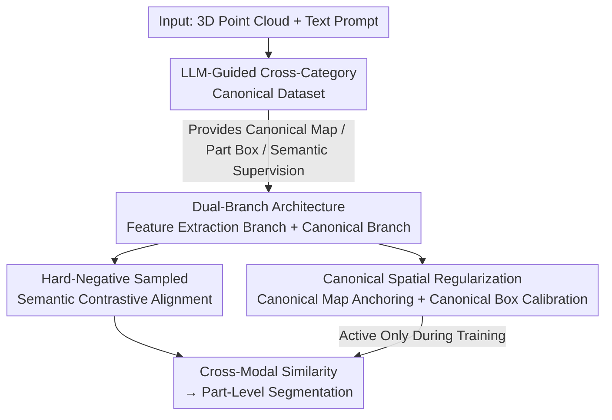

# CoSMo3D: Open-World Promptable 3D Semantic Segmentation through LLM-Guided Canonical Spatial Modeling

**Conference**: CVPR 2026  
**Paper**: [CVF Open Access](https://openaccess.thecvf.com/content/CVPR2026/html/Jin_CoSMo3D_Open-World_Promptable_3D_Semantic_Segmentation_through_LLM-Guided_Canonical_Spatial_CVPR_2026_paper.html)  
**Code**: https://github.com/JinLi998/CoSMo3D  
**Area**: 3D Vision / Semantic Segmentation  
**Keywords**: Open-world segmentation, 3D semantic segmentation, canonical space, LLM-guided, cross-category alignment

## TL;DR
CoSMo3D reformulates "open-world promptable 3D semantic segmentation" from "geometry-text matching in the input sensor coordinate system" into "reasoning about part semantics within an implicit canonical space learned from data". Guided by an LLM-guided cross-category canonicalized dataset and a training-only canonical branch (anchored by canonical map and canonical box calibration losses), the method forces the same functional parts under arbitrary poses, symmetries, and categories to converge into the same canonical embedding, significantly establishing a new state-of-the-art on multiple benchmarks.

## Background & Motivation

**Background**: The goal of open-world promptable 3D segmentation is to segment corresponding parts of a 3D object given free-form text prompts (e.g., "handle", "wing", "paddle"), with the ability to generalize to unseen categories during training. Representative work Find3D achieves this by learning direct alignments of "geometric features $\leftrightarrow$ language embeddings" on large-scale automatically labeled data, demonstrating decent zero-shot generalization and prompt flexibility.

**Limitations of Prior Work**: These methods are fundamentally based on "geometry-text matching", implying the assumption that "geometric similarity $\Rightarrow$ semantic similarity". However, this correlation often fails in practice: chair armrests and chair legs are both geometrically slender but have distinct semantics; airplane wings and bird wings differ drastically in shape but share the same semantics. The model lacks awareness of "where a certain semantic part should appear relative to the global object", leading to unstable predictions under pose variations, symmetry, and cross-category scenarios. Data augmentation provides only limited robustness, and the core element of human perception, "spatial semantics", remains missing within the model.

**Key Challenge**: Semantics are inferred within the **input pose coordinate system**, whereas the functional semantics of a part should physically be determined by its position/role in a **canonical reference frame** (e.g., wings extending sideways, handles protruding laterally, legs supporting from below). Psychophysical evidence indicates that humans "mentally rotate" objects to a canonical pose in their minds to recognize parts, a mechanism completely absent in current models.

**Goal**: To equip the model with "canonical spatial awareness"—internalizing a canonical reference frame shared across shapes and categories, and interpreting part semantics relative to this reference frame rather than the raw input pose. This is decomposed into two sub-problems: (1) how to construct a set of cross-category consistent canonical supervision signals; (2) how to enable the model to naturally "grow" this implicit canonical reference frame internally.

**Key Insight**: Instead of manually defining canonical poses for each category (which is unscalable), the authors **induce an implicit canonical reference frame from data**—allowing the same functional parts under different poses, symmetries, and deformations to collapse into an "attractor" in the embedding space.

**Core Idea**: To reformulate open-world 3D segmentation as "reasoning over canonical spatial regularities", framing "canonicality" as a learnable implicit structure. Externally, an LLM-aligned canonical dataset is used for supervision; internally, a dual-branch architecture coupled with two canonical spatial regularizations folds pose/symmetry variations into stable canonical embeddings.

## Method

### Overall Architecture
Given a 3D shape and a text prompt, CoSMo3D encodes the geometric features of the shape and the semantic features of the text, computes cross-modal similarity to associate the text with shape regions, and decodes them into part-level labels. The entire method instills "canonical spatial awareness" into the model from both "external" and "internal" fronts:

- **External (Data & Supervision)**: Using an LLM-guided "intra-category + cross-category" canonicalization pipeline, a unified canonical dataset spanning 200 categories is constructed. It produces three types of supervision signals—canonical maps, part boxes, and semantic associations—providing a ground truth foundation for the model to induce the implicit canonical reference frame.
- **Internal (Dual-Branch + Canonical Spatial Objectives)**: One **feature extraction branch** (used in both training and inference, utilizing a Pt3 backbone + SigLIP text encoder) is responsible for cross-modal segmentation; one **canonical embedding branch** (only present during training) predicts canonical maps and part boxes. It employs two canonical spatial regularizations (canonical map anchoring and canonical box calibration) to pull point embeddings toward canonical codes and tighten the spatial span of parts in the canonical space. The canonical branch is discarded during inference, introducing zero inference overhead.

### Key Designs

**1. LLM-Guided Cross-Category Canonicalization Dataset: Sharing "Canonicality" Across Category Boundaries**

To generalize to various or even unseen categories in the open world, canonical priors must be **transferable**. However, existing canonical datasets are "siloed by category," aligned only within individual categories, lacking cross-category consistency and limiting scalability. The authors construct a unified, **cross-category aligned** canonical dataset covering most common categories, executed in two steps: intra-category canonicalization (aligning instances of the same category to a shared canonical space, where ample existing work is available) and the more challenging cross-category canonicalization (aligning semantically corresponding parts/keypoints across different categories).

Cross-category canonicalization is challenging due to massive geometric and functional discrepancies (e.g., forks, bicycles, tree trunks have vastly different shapes and uses). The authors adopt a **hierarchical alignment** strategy: first, a Large Language Model (e.g., GPT) groups 200 categories into 19 semantically coherent clusters based on shared functions/usage contexts (e.g., vehicles, tools); within each cluster, alignment is performed based on shared functional attributes (e.g., aligning "steering-related parts" of bicycles and airplanes to a consistent orientation within the vehicle cluster). Since the underlying dataset has already modified the core semantic directions of each category, intra-cluster alignment usually only requires simple discrete rotations of 90°/180°/270°, which is highly computationally efficient. Next, inter-cluster alignment is executed, verified by high-level semantic consistency (e.g., ensuring the vehicle cluster and the animal cluster share a consistent "forward direction"). Finally, axis-aligned deformations are superimposed to enrich shape diversity. The entire dataset is built upon 3Dcompat200 ($\approx 17K$ shapes, 200 categories, with part annotations). Consequently, "canonicality" is no longer restricted within a single category but becomes a unified foundation shared across object families.

**2. Training-Only Canonical Branch in a Dual-Branch Architecture: Shaping Only During Training, Zero Inference Overhead**

The pain point is: enabling the model to truly develop canonical perception internally without slowing down inference (many 2D rendering-based methods are slow due to projections and multi-view post-processing). The authors design a dual-branch architecture. The **feature extraction branch** follows Find3D, utilizing PointTransformerV3 (Pt3) for point cloud encoding and SigLIP-Base/16-224 for text encoding, with a lightweight 3-layer MLP projecting point features into the same embedding space as text features (both 768-dimensional). This generates 3D features in a single forward pass without relying on 2D rendering.

The **canonical embedding branch** is introduced only during the training phase and contains two heads: a **canonical map prediction head**—inspired by 3D generation methods, instead of regressing discrete point-wise values, it regresses three continuous scalar fields (encoded as an RGB color map) to better preserve spatial continuity; and a **semantic bounding box prediction head**—using text features as queries to extract relevant regions from shape features and outputting a 6-dimensional vector representing the bbox. The intermediate representations generated by the canonical branch are supervised by canonical-space signals, thereby enhancing the model's canonical spatial awareness and improving shape-to-prompt alignment. During inference, this branch is completely discarded, adding no inference cost—canonicality is "trained into" the features rather than computed on the fly.

**3. Canonical Map Anchoring Loss: Bypassing Symmetry Ambiguities via Distribution Matching**

The goal is to ensure that components with the same (or similar) semantics—whether within or across categories—exhibit a consistent spatial distribution in the canonical space. A straightforward approach is to anchor the canonical map point-by-point using canonicalized metadata and part labels from the dataset. However, **symmetry** introduces correspondence ambiguity: multiple orientations of a symmetric object are equally valid in canonical space, rendering point-wise supervision unreliable. Existing methods address this by manually labeling symmetry axes or employing category-specific constraints, which cannot scale to the open world.

The authors' key insight is to **completely abandon point-wise correspondence**: treating each semantic part as a **distribution** in canonical space and utilizing the **bidirectional Chamfer Distance** to match the predicted canonical map with the GT canonical distribution. Let the predicted point set of part $m$ be $G^p_m=\{a_i\}$ and the GT point set be $G^t_m=\{b_j\}$. The loss is formulated as:

$$L_{ca}=\frac{1}{M}\sum_{m=1}^{M}\Big(\frac{1}{|G^p_m|}\sum_{a_i\in G^p_m}\min_{b_j\in G^t_m}\lVert a_i-b_j\rVert_p+\frac{1}{|G^t_m|}\sum_{b_j\in G^t_m}\min_{a_i\in G^p_m}\lVert b_j-a_i\rVert_p\Big)$$

By default, $p=2$. Since it compares the "shape" of distributions rather than individual coordinates, symmetric configurations automatically become equivalent in the canonical space. Symmetric points naturally converge to the same canonical region, bypassing the need for symmetry annotations or category-specific axis specifications, thereby driving a rotation-invariant and symmetry-robust canonical layout.

**4. Canonical Box Calibration + Hard Negative Contrastive Alignment: Securing Semantic Alignment and Sharpening Boundaries**

During inference, parts are retrieved by matching "point-wise features $\leftrightarrow$ user prompt text embeddings." This process is sensitive to local noise, and part boundaries tend to be blurry (as previous losses prioritize part-level distribution alignment rather than point-wise precision). To mitigate this, the canonical branch additionally predicts a 3D bounding box for each semantic part in canonical space, providing a coarse yet stable spatial prior to sharpen boundaries and suppress false activations:

$$L_{cb}=\frac{1}{M}\sum_{m=1}^{M}\frac{1}{6}\lVert b^p_m-b^t_m\rVert_1,\quad b^{(\cdot)}_m\in\mathbb{R}^6$$

The box is parameterized as $[x_{min},y_{min},z_{min},x_{max},y_{max},z_{max}]$, encouraging the part to occupy a coherent spatial span in the canonical space and complementing the distribution-level anchoring.

On the semantic alignment side, the authors follow the contrastive learning paradigm of Find3D (comparing the average part feature $\bar p_i$ with the text embedding $t_i$ via softmax: $f(\bar p_i,t_i)=\exp(\bar p_i^\top t_i/\tau)$). However, they observe that uniform sampling within parts biases the loss toward "block-text consistency" while ignoring individual point deviations, resulting in high noise near boundaries and slow convergence. Thus, they introduce **hard negative sampling**: densely sampling discriminative negative points along inter-part boundaries, and employing a bidirectional contrastive loss. Boundary regions $E_n$ are weighted by $(1+\alpha)$ (where $\alpha=0$ when $n=i$, $\alpha>0$ when $n\neq i$, with normalized weight $W_n=|\Omega_n|+(1+\alpha)|E_n|$), sharpening distinction near part boundaries. ⚠️ Note: The original paper has duplicate equation labelings for the contrastive loss (both marked as $L_h$/Eq.(2)); refer to the paper for precise details.

### Loss & Training
The total loss is a weighted sum of three terms:

$$L_{total}=\lambda_h\cdot L_h+\lambda_{ca}\cdot L_{ca}+\lambda_{cb}\cdot L_{cb}$$

where $\lambda_h=1$, $\lambda_{ca}=10$, and $\lambda_{cb}=3$. To stabilize convergence, a **two-phase training** strategy is adopted: phase one trains with only the alignment loss $L_h$ until convergence, and phase two incorporates the canonical map anchoring $L_{ca}$ and canonical box calibration $L_{cb}$ until final convergence. During training, each object is normalized to a unit bounding box, and 5000 surface points (retaining RGB color and normal vectors) are uniformly sampled.

## Key Experimental Results

### Main Results
Evaluation stands on three dimensions: data distribution (4 benchmarks), input state (Canonical pose vs. Rotated random rotation), and query format (`{Part}` word prompt vs. `{part} of {category}` phrase prompt). The metric is mIoU (averaged per-object part IoU, then averaged across instances). Find3D\* represents Find3D retrained on the authors' constructed dataset.

| Dataset | Setting | Ours | Find3D\* | PointCLIPV2 |
|--------|------|------|----------|------|
| 3Dcompat-Coarse | Canonical {Part} | **54.52** | 45.96 | 14.16 |
| 3Dcompat-Coarse | Rotated {Part} | **54.55** | 46.75 | 13.39 |
| 3Dcompat-Coarse | Canonical {Part} of {Obj.} | **47.51** | 37.16 | 14.09 |
| 3Dcompat-Fine | Canonical {Part} | **31.29** | 27.11 | 7.18 |
| 3Dcompat-Fine | Rotated {Part} | **30.97** | 28.81 | 7.20 |
| ShapeNet-Part | Canonical {Part} | **33.31** | 28.17 | 20.22 |
| PartNet-E | Rotated {Part of Obj.} | **18.48** | 16.37 | 10.32 |

Ours outperforms the runner-up Find3D with an average relative improvement of **25.55%**; specifically, achieving a **29.89%** average gain over the strongest baseline on ShapeNet-Part and a **5.01%** gain on PartNet-E. On coarse data, it yields an absolute mIoU gain of 8%–11% over Find3D in both canonical and rotated poses, and 4%–7% on fine data. In terms of inference speed, the feedforward model takes **0.9 seconds per shape**, whereas the 2D rendering-based PartSLIP++ requires **2.5 minutes per shape**. Notably, most methods score moderately on PartNet-E (whose annotations lean toward texture/material and fine-grained details), and the 2D-rendered PartSLIP++ performs relatively well with word prompts (benefiting from its GLIP backbone pre-trained on $\approx$ 27 million image-text pairs + PartNet-E fine-tuning). This suggests that effectively transferring structured semantic priors from 2D giant datasets to 3D remains a valuable research avenue.

### Ablation Study
Cumulative component additions, where all values represent the mIoU across all categories and instances. Variant A is the baseline (trained on intra-category canonicalized shapes).

| Variant | Hard Negative Sampling | Canonical Map Anchoring | Cross-Category Canonicalization (Data) | Canonical Box Calibration | Canonical {Part} | Rotated {Part} |
|------|:---:|:---:|:---:|:---:|------|------|
| A | | | | | 45.00 | 46.02 |
| B | ✓ | | | | 48.30 | 48.76 |
| C | ✓ | ✓ | | | 52.01 | 52.57 |
| D | ✓ | ✓ | ✓ | | 54.15 | 53.70 |
| Full | ✓ | ✓ | ✓ | ✓ | **54.52** | **54.55** |

### Key Findings
- **Canonical map anchoring contributes the most**: B$\rightarrow$C yields a +3.71 gain on Canonical {Part} (48.30$\rightarrow$52.01) and +3.81 on Rotated {Part}. This single-step gain is the highest, validating that "folding poses/symmetries into the canonical space" is indeed the core mechanism.
- **Hard negative sampling** (A$\rightarrow$B) consistently improves the robustness of contrastive alignment (by $\approx$ +3.30), mainly sharpening classification near boundary areas.
- **Cross-Category Canonicalization (Data)** (C$\rightarrow$D) consistently boosts performance across all setups. Though the gain on {Part} alone is moderate (+2.14), it proves that cross-category supervision brings solid benefits.
- **Canonical box calibration** shows seemingly minor gains on the Canonical `{Part}` word prompt (D$\rightarrow$Full of only +0.37) but brings significant improvements under more complex `{Part} of {Obj.}` compositional prompts and rotated settings (e.g., Canonical `{Part of Obj.}` increases 43.34$\rightarrow$47.51 by $\approx$ +4.17, Rotated increases 42.63$\rightarrow$47.74 by $\approx$ +5.11). This suggests that the bounding box constraint primarily functions in tightening boundaries, combating noise, and defending against pose perturbations.
- **Feature quality analysis**: Compared to PartField (where parts are distinguishable but inconsistent across shapes/poses) and Find3D (which is more consistent but suffers from blurry part boundaries and blended adjacent features), CoSMo3D's point-wise features are both semantically aligned and structurally distinct. They maintain high consistency across shapes and poses with crisp boundaries, indicating high potential to serve as a general 3D shape feature backbone.

## Highlights & Insights
- **Formulating canonical space from hand-crafted priors to learnable implicit structures**: Instead of defining a canonical pose for each category, an implicit reference frame is induced from the data, prompting the same functional parts under different poses, symmetries, and deformations to collapse into a canonical embedding. This is the key to open-world scalability.
- **Bypassing symmetry ambiguity via distribution matching is a clever trick**: Point-wise supervision on symmetric objects is inherently ill-posed. Transforming it into Chamfer distribution matching makes symmetric configurations naturally equivalent, discarding the need for category-specific symmetry axis labels. This trick is highly transferable to other tasks requiring canonicalization or pose alignment.
- **Training-only canonical branch**: The design balances "feature shaping" and "zero inference burden", pushing all supervisory costs entirely to the training phase while keeping inference as a single forward pass. This paradigm of "auxiliary heads during training, discarded during inference" can migrate to many tasks that require structural priors but must avoid inference overhead.
- **Regressing the canonical map as continuous RGB scalar fields**, rather than discrete point-wise values, borrows ideas from 3D generation to preserve spatial continuity—a minor but effective engineering choice.

## Limitations & Future Work
- The canonical dataset is built on 3Dcompat200 (200 categories, $\approx$ 17K shapes). Since the cohesive "semantic clusters" for cross-category alignment are partitioned by an LLM (such as GPT), the manuscript does not systematically quantify the impact of cluster quality and cross-cluster semantic consistency checks on the final canonical space, nor does it discuss potential failure clusters (relying on the supplementary materials for details).
- Cross-category alignment assumes that "intra-cluster alignment only requires simple discrete rotations," which relies on the assumption that the base dataset already unifies the core semantic direction of each category. For categories with ambiguous orientation definitions or multi-functional components, this assumption may fail.
- The improvement on PartNet-E is limited to 5.01%, and the 2D-rendered PartSLIP++ surpasses it under word prompts, indicating that the method still struggles with benchmarks dominated by "material/ultra-fine-grained" annotations. Fusing 2D big data priors remains an open problem.
- The authors envisage the canonical reference frame as a "first-class representation" and look forward to applications in compositional 3D queries, cross-modal CAD/video grounding, and 3D agents acting within canonical space before transforming to Euclidean space. However, these are purely outlooks and remain unvalidated in this work.

## Related Work & Insights
- **vs Find3D**: Find3D directly learns "geometric features $\leftrightarrow$ language embedding" alignments. This paper notes that its nature is limited to "geometry-text matching," lacking the spatial semantics of "where a part should appear relative to the whole." While keeping the main branch of Find3D, CoSMo3D adds canonical branch regularization to anchor semantics into canonical space, performing significantly more robustly in scenarios such as geometrically similar but semantically different parts, cross-category synonymous components, and arbitrary poses.
- **vs 2D Rendering Methods (PartSLIP++, PointCLIPV2)**: These render 3D into multi-view images, segment them with 2D models (GLIP/SAM), and project them back. They are bottlenecked by multi-view consistency and self-occlusion, are slow (2.5 minutes per shape), and can only handle upright poses (failing when objects are inverted). In contrast, Ours is a single-forward pure 3D method (0.9 seconds per shape) that natively supports arbitrary poses.
- **vs Class-Agnostic 3D Segmentation (PartField, Sampart3D)**: These methods rely on contrastive learning + clustering to decompose parts geometrically. They lack high-level semantic understanding, offer poor interactability, and output features that are inconsistent under varying poses, making semantic mapping difficult. CoSMo3D's canonical regularization forces features to be both semantically aligned and cross-pose consistent.

## Rating
- Novelty: ⭐⭐⭐⭐⭐ Modeling "canonical spatial awareness" as a learnable implicit structure and bypassing symmetry ambiguities via distribution matching reformulates the open-world 3D segmentation task.
- Experimental Thoroughness: ⭐⭐⭐⭐ The evaluation across 4 benchmarks $\times$ 2 poses $\times$ 2 prompt formats along with step-by-step ablation studies is quite comprehensive, though some key details (canonical dataset quality, clustering) are relegated to supplementary materials.
- Writing Quality: ⭐⭐⭐⭐ Clear motivation and narrative (human mental rotation $\rightarrow$ canonical space); minor typos in duplicated equation numbers.
- Value: ⭐⭐⭐⭐⭐ The training-only canonical branch and cross-category canonicalization concepts carry high transferability to the broader 3D understanding stack.

<!-- RELATED:START -->

## Related Papers

- [\[CVPR 2026\] Spatial Matters: Position-Guided 3D Referring Expression Segmentation](spatial_matters_position-guided_3d_referring_expression_segmentation.md)
- [\[CVPR 2026\] 3D-VCD: Hallucination Mitigation in 3D-LLM Embodied Agents through Visual Contrastive Decoding](3d-vcd_hallucination_mitigation_in_3d-llm_embodied_agents_through_visual_contras.md)
- [\[ICLR 2026\] GOOD: Geometry-guided Out-of-Distribution Modeling for Open-set Test-time Adaptation in Point Cloud Semantic Segmentation](../../ICLR2026/3d_vision/good_geometry-guided_out-of-distribution_modeling_for_open-set_test-time_adaptat.md)
- [\[ICLR 2026\] Unified 3D Scene Understanding Through Physical World Modeling](../../ICLR2026/3d_vision/unified_3d_scene_understanding_through_physical_world_modeling.md)
- [\[CVPR 2026\] Image-to-Point Cloud Feature Back-Projection for Multimodal Training of 3D Semantic Segmentation](image-to-point_cloud_feature_back-projection_for_multimodal_training_of_3d_seman.md)

<!-- RELATED:END -->
