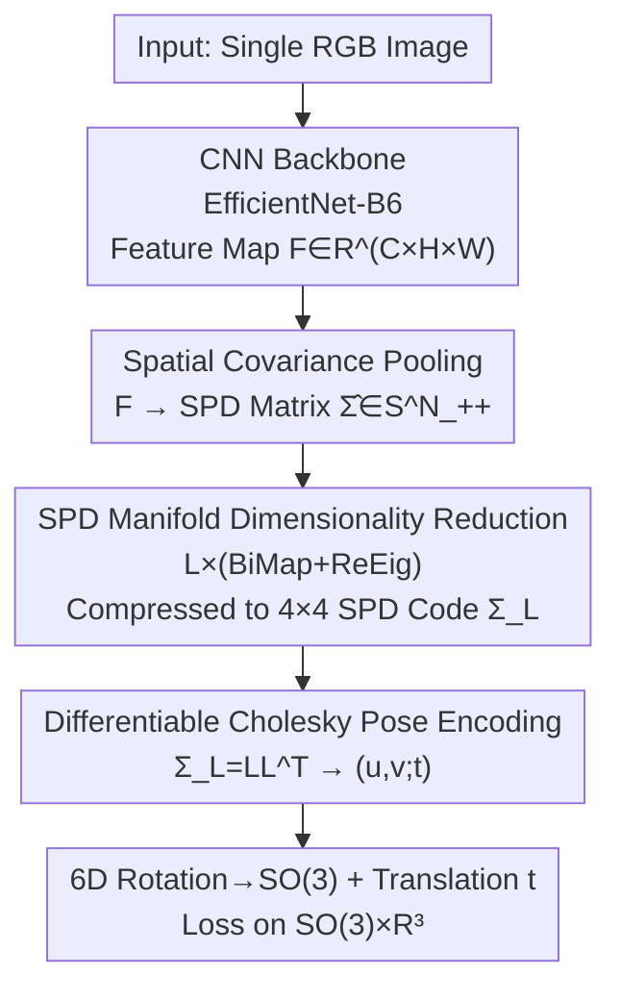

# Cov2Pose: Leveraging Spatial Covariance for Direct Manifold-aware 6-DoF Object Pose Estimation

**Conference**: CVPR 2026  
**Paper**: [CVF Open Access](https://openaccess.thecvf.com/content/CVPR2026/html/Ousalah_Cov2Pose_Leveraging_Spatial_Covariance_for_Direct_Manifold_aware_6_DoF_Object_Pose_CVPR_2026_paper.html)  
**Code**: None (Not provided by the paper)  
**Area**: 3D Vision  
**Keywords**: 6-DoF Pose Estimation, Spatial Covariance, SPD Manifold, Cholesky Decomposition, Direct Pose Regression  

## TL;DR
For 6-DoF object pose estimation from a single RGB image, this paper proposes Cov2Pose: using **spatial covariance pooling** to encode backbone features into a Symmetric Positive Definite (SPD) matrix to preserve second-order statistics, which is then compressed into a compact SPD code via manifold-aware BiMap+ReEig layers. Finally, a **differentiable Cholesky decomposition** maps the SPD matrix one-to-one into continuous 6D rotation + translation for direct end-to-end pose regression, achieving SOTA among direct regression methods on LM/LM-O/YCB-V.

## Background & Motivation
**Background**: There are two main paradigms for 6-DoF object pose estimation from a single RGB image. Indirect methods first predict 2D keypoints or dense 2D–3D correspondences and then solve for the pose using PnP/RANSAC (PVNet, ZebraPose, CheckerPose). These offer high accuracy but require iterative solving, CAD rendering, or outlier removal, making them computationally expensive. Direct methods (PoseCNN, GDR-Net, EPro-PnP) use a single forward pass to directly regress rotation and translation, which is fast and suitable for real-time applications, but their accuracy typically lags behind indirect methods.

**Limitations of Prior Work**: Direct regression heads are almost exclusively built on **first-order statistics**—applying global average/max pooling to backbone features followed by an MLP. This step flattens feature maps into vectors, losing **second-order co-activation information** between feature channels and spatial locations. Furthermore, most direct methods regress non-continuous rotation representations such as Euler angles or quaternions, which possess discontinuity points on $SO(3)$, making rotation learning unstable and less robust.

**Key Challenge**: Pose is a geometric quantity that changes systematically with the viewpoint, whereas average/max pooling specifically erases information about "which spatial regions vary together," which is highly correlated with the viewpoint. The authors validate this in Fig.1: when image pairs are binned by their $SE(3)$ ground-truth geodesic distance, the **Log-Euclidean distance of spatial covariance within the bins increases monotonically with pose distance**, whereas the cosine distance of flattened features remains nearly constant—indicating that spatial covariance encodes pose information better than first-order features.

**Goal**: (i) Enable the feature extractor to explicitly preserve second-order statistics; (ii) allow the regression head to output continuous pose representations while ensuring the entire pipeline is end-to-end differentiable.

**Key Insight**: Covariance matrices obtained via second-order pooling are naturally SPD matrices, lying on the Riemannian manifold of SPD matrices $\mathcal{S}^n_{++}$. Existing SPD deep learning modules (BiMap, ReEig) can perform dimensionality reduction and non-linearities while maintaining the SPD structure. The authors adapt these tools, originally used for classification, for pose **regression** for the first time.

**Core Idea**: Use "Spatial Covariance (SPD)" instead of "globally pooled vectors" as pose features and utilize "differentiable Cholesky decomposition" to decode the SPD matrix into continuous 6D rotation + translation. This recovers both second-order information and representation continuity within a direct regression framework.

## Method

### Overall Architecture
Cov2Pose is an end-to-end trainable pipeline that decomposes the mapping from "single RGB image $\to$ one 6-DoF pose" into two composite mappings: feature extraction $\Gamma: \mathcal{I}\to\mathcal{S}^n_{++}$ and pose decoding $\Psi: \mathcal{S}^n_{++}\to\mathcal{P}$. Specifically, a CNN backbone (EfficientNet-B6) extracts a feature map $\mathbf{F}\in\mathbb{R}^{C\times H\times W}$. Spatial covariance pooling encodes this into an $N\times N$ ($N=H\times W$) SPD matrix $\hat{\boldsymbol\Sigma}$. $L$ layers of BiMap+ReEig gradually compress it into a compact $4\times4$ SPD code $\boldsymbol\Sigma_L\in\mathcal{S}^4_{++}$ while maintaining SPD geometry. Finally, a differentiable Cholesky layer decomposes $\boldsymbol\Sigma_L$ into a lower triangular matrix, from which 6D rotation parameters $(\mathbf u,\mathbf v)$ and translation $\mathbf t$ are extracted. $\mathbf R\in SO(3)$ is obtained via Gram-Schmidt orthogonalization, and the loss is calculated on $SO(3)\times\mathbb{R}^3$.

### Key Designs

**1. Spatial Covariance Pooling: Using Second-order Statistics Instead of Global Pooling Vectors**

Direct regression methods flatten or average feature maps, losing co-variations between spatial regions that are highly viewpoint-dependent. This paper adds a second-order pooling layer $\Gamma_2:\mathbb{R}^{C\times H\times W}\to\mathcal{S}^N_{++}$ after the backbone. It flattens $\mathbf F$ along the spatial dimensions into $\mathbf X=\mathrm{vec}(\mathbf F)\in\mathbb{R}^{C\times N}$ ($N=H\times W$) and then estimates the covariance **between spatial positions** across **channels**:

$$\hat{\boldsymbol\Sigma}=\mathrm{CovPool}(\mathbf X)=\frac{1}{C-1}\sum_{i=1}^{C}(\mathbf X_i-\boldsymbol\mu_{\mathbf X})^{\!\top}(\mathbf X_i-\boldsymbol\mu_{\mathbf X})$$

where $\mathbf X_i\in\mathbb{R}^N$ is the flattened spatial response of the $i$-th channel and $\boldsymbol\mu_{\mathbf X}$ is the channel-wise mean. Each matrix element $\hat\Sigma_{jk}$ measures "how spatial positions $j$ and $k$ vary together." Since this quantity changes systematically with viewpoint, it encodes pose better than first-order features (as verified in Fig.1). In the implementation, $H=W=17$, so $\hat{\boldsymbol\Sigma}$ is a $289\times289$ SPD matrix.

**2. SPD Manifold Dimensionality Reduction: BiMap + ReEig Compressing Covariance while Maintaining Positive Definiteness**

The $289\times289$ covariance is too large for direct regression, and it resides on the SPD manifold—applying standard fully connected or convolutional reduction would destroy the SPD structure (assuming the feature space is Euclidean). This paper uses $L$ layers of BiMap (Bilinear Mapping) for geometry-preserving reduction: using column-orthogonal weights $\mathbf W$ (on the Stiefel manifold $V_n(\mathbb{R}^m)$) to perform a congruence transformation on the covariance:

$$\mathbf Y=\mathbf W\mathbf X\mathbf W^\top,\qquad \mathbf X\in\mathcal{S}^n_{++},\ \mathbf Y\in\mathcal{S m}_{++},\ m<n$$

This reduces the dimension from $n$ to $m$ while maintaining SPD. Each BiMap layer is followed by a ReEig (Relu-like Eigenvalue Rectification) layer, which performs eigendecomposition $\mathbf X=\mathbf U\boldsymbol\Sigma\mathbf U^\top$ and thresholds small eigenvalues to a floor $\varepsilon$: $\mathrm{ReEig}_\varepsilon(\mathbf X)=\mathbf U\max(\boldsymbol\Sigma,\varepsilon\mathbf I)\mathbf U^\top$. This introduces non-linearity (analogous to ReLU) while preventing mode collapse and singularity. The stack is denoted as $\boldsymbol\Sigma_{l+1}=\mathrm{ReEig}_\varepsilon(\mathbf W_l^\top\mathbf X_l\mathbf W_l)$, starting with $\boldsymbol\Sigma_0=\hat{\boldsymbol\Sigma}$, eventually reaching a compact $\boldsymbol\Sigma_L\in\mathcal{S}^4_{++}$. The implementation uses 4 layers of BiMap alternating with 4 layers of ReEig, with $\varepsilon=10^{-4}$.

**3. Differentiable Cholesky Pose Encoding: One-to-one Mapping from SPD Codes to Continuous 6D Rotation + Translation**

To decode the SPD code into a pose, the authors require an **injective, continuous, and differentiable** mapping $\Psi$ to ensure that one SPD corresponds to a unique pose, similar SPDs yield similar poses, and end-to-end backpropagation is possible. Cholesky decomposition satisfies all three (unique, continuous, and differentiable). Thus, $\Psi$ is defined by decomposing $\boldsymbol\Sigma_L=\mathbf L\mathbf L^\top\in\mathcal{S}^4_{++}$ into a lower triangular matrix $\mathbf L$ and **structurally embedding** pose parameters into its elements:

$$\mathbf L=\begin{bmatrix} e^{t_x} & 0 & 0 & 0\\ u_1 & e^{t_y} & 0 & 0\\ u_2 & v_1 & e^{t_z} & 0\\ u_3 & v_2 & v_3 & e^{-(t_x+t_y+t_z)} \end{bmatrix}$$

where $(\mathbf u,\mathbf v)\in\mathbb{R}^{3\times2}$ are two 3D vectors for 6D rotation representation, and $\mathbf t=(t_x,t_y,t_z)$ is the translation. $n=4$ is chosen because embedding 6 (rotation) + 3 (translation) = 9 degrees of freedom requires a triangular matrix with $>9$ non-zero elements. Taking the exponential of the diagonal ensures positivity (making $\mathbf L\mathbf L^\top$ strictly positive definite). Setting the fourth diagonal element to $e^{-(t_x+t_y+t_z)}$ ensures $\prod_i L_{ii}=1$, thus $\det(\boldsymbol\Sigma_L)=\det(\mathbf L)^2=1$—normalizing the geometric mean of SPD eigenvalues to 1 without losing pose expressivity. During decoding, $\hat{\mathbf t}=(\log L_{11},\log L_{22},\log L_{33})^\top$, $\hat{\mathbf u}=(L_{21},L_{31},L_{41})^\top$, and $\hat{\mathbf v}=(L_{32},L_{42},L_{43})^\top$ are extracted from $\mathbf L$. Differentiable Gram-Schmidt orthogonalizes $(\hat{\mathbf u},\hat{\mathbf v})$ and utilizes the cross product to complete the basis for $\hat{\mathbf R}\in SO(3)$. This mapping is continuous everywhere except where $\mathbf u,\mathbf v$ are collinear, recovering the rotation continuity often missing in direct methods.

### Loss & Training
The total loss is calculated on $SO(3)\times\mathbb{R}^3$: geodesic distance for rotation, $\ell_2$ for translation, plus two regularizers (orthogonality penalty $\langle\hat{\mathbf u},\hat{\mathbf v}\rangle\to0$ and unit-norm penalty to prevent vector collapse):

$$\mathcal{L}_{\text{pose}}=\arccos\!\Big(\tfrac{\mathrm{tr}(\hat{\mathbf R}^\top\mathbf R_{\text{gt}})-1}{2}\Big)+\lVert\hat{\mathbf t}-\mathbf t_{\text{gt}}\rVert_2+\lambda\big[\langle\hat{\mathbf u},\hat{\mathbf v}\rangle^2+(\lVert\hat{\mathbf u}\rVert-1)^2+(\lVert\hat{\mathbf v}\rVert-1)^2\big]$$

with $\lambda=10^{-3}$. Training utilizes a **mixed geometric optimizer**: Riemannian steps for BiMap weights under Stiefel constraints (gradient projection + QR retraction, initial lr $10^{-2}$), and Adam for Euclidean parameters such as the backbone (initial lr $10^{-4}$), managed by a ReduceLROnPlateau scheduler. The backbone is an ImageNet-pre-trained EfficientNet-B6, with 41.4M total parameters.

## Key Experimental Results

### Main Results
On three BOP benchmarks (LM / LM-O / YCB-V), using the ADD(-S) metric (correct if average distance between model points is <10% of diameter). Cov2Pose leads comprehensively among direct/end-to-end methods and approaches indirect PnP methods.

| Benchmark | Metric | Cov2Pose | Best End-to-End Baseline | Indirect PnP Methods |
|------|------|----------|----------------|-------------|
| LM | ADD(-S) ↑ | **97.2** | DeepIM 88.6 | BPnP 93.27 / EPro-PnP 95.80 |
| LM-O (Occluded) | ADD(-S) ↑ | **76.8** | GDR-Net 62.2 / DeepIM 55.5 | ZebraPose 76.9 (diff 0.1) |
| YCB-V | ADD(-S) ↑ | **69.7** (Best End-to-End) | GDR-Net 60.1 | VAPO 84.9 |
| YCB-V | AUC of ADD(-S) ↑ | 82.2 | GDR-Net 84.4 | ZebraPose 85.3 |

In LM, it exceeds PnP methods by 0.1; on the heavily occluded LM-O, it pushes the end-to-end SOTA from 62.2 up to 76.8, only 0.1 behind the strongest PnP method, ZebraPose, demonstrating the robustness of second-order covariance to occlusion. While PnP methods still lead on YCB-V, Cov2Pose narrows the gap between end-to-end and the best PnP methods by 2.3 AUC(ADD-S) / 5.7 AUC(ADD(-S)).

### Ablation Study
Performed on LM-O, average ADD(-S) across all classes.

| Configuration | ADD(-S) ↑ | Description |
|------|-----------|------|
| Cov2Pose (Complete) | **76.8** | Spatial Cov + SPD head + Cholesky |
| (A) Euclidean MLP Head | 31.0 | Replaced SPD head with 2-layer FC; geometric mismatch |
| (B) Channel Covariance | 70.9 | Replaced spatial covariance with channel covariance |
| (C) Log-tangent Space Training | 72.3 | Removed Cholesky; used Frobenius loss in SPD log-tangent space |
| Euler Angles (3×3 SPD) | 70.9 | Used non-continuous Euler angles instead of 6D+GS |
| 6D+GS (4×4 SPD, Ours) | **76.8** | Continuous rotation representation |

### Key Findings
- **SPD Head Geometric Matching is Critical**: Replacing the manifold-aware SPD head with a Euclidean MLP (Variant A) caused ADD(-S) to crash from 76.8 to 31.0—confirming that the mismatch between "SPD manifold features vs. Euclidean network assumptions" is the primary bottleneck for direct regression accuracy.
- **Spatial Covariance Superior to Channel Covariance**: Variant B (70.9) shows that preserving "spatial-to-spatial" co-activation is more relevant to pose than "channel-to-channel," as pose changes affect spatial layout.
- **Cholesky Decoding + $SO(3)$ Loss is Effective**: Variant C (72.3) indicates that placing the loss directly on $SO(3)\times\mathbb{R}^3$, rather than the SPD log-tangent space, gains an additional 4.5 points.
- **Continuous Rotation Representation Matters**: 6D+GS (76.8) significantly outperforms Euler angles (70.9), validating that continuous representations benefit rotation learning.
- **Good Speed/Accuracy Trade-off**: Total inference 46.9ms (Backbone 22.6ms + CovPool 0.5ms + Head 23.8ms), faster than ZebraPose (119.3ms) or DeepIM (77.3ms), providing higher efficiency at similar accuracy.

## Highlights & Insights
- **Unified SPD Manifold Consistency**: From creating the SPD via second-order pooling, to reducing dimensions via BiMap/ReEig, to decoding via unique Cholesky decomposition—the entire pipeline is geometrically consistent with the SPD manifold. This is the fundamental difference compared to "flatten-then-MLP" approaches.
- **Cholesky as a "Structured Container"**: Carefully embedding 6D rotation and translation into specific locations of a triangular matrix and using diagonal exponentiation + determinant compensation to force $\det=1$ is a clever parameterization trick. It ensures positive definiteness and an injective, continuous, differentiable mapping, transferable to any scenario requiring continuous geometric decoding from SPD matrices.
- **Robustness to Occlusion via Second-order Statistics**: The significant lead on LM-O suggests that the global co-activations captured by covariance provide more reliable pose cues even when parts of the object are occluded.
- **Transitioning SPD Deep Learning from Classification to Regression**: BiMap/ReEig were previously almost exclusively used for classification. This work provides a successful paradigm for regression tasks.

## Limitations & Future Work
- **Does not explicitly handle object symmetry** (admitted by authors): Symmetry results in pose ambiguity, which is not modeled in the current CAD-free setting, potentially leading to self-contradictory supervision; the supplementary material provides only a preliminary pilot study on symmetry awareness.
- **Still lags behind the strongest indirect methods** (specifically on YCB-V): The AUC gap on YCB-V shows that pure direct methods still face challenges in large-scale, multi-category scenarios compared to PnP methods.
- **Reliance on heavy backbone**: EfficientNet-B6 with 41.4M parameters and a $289\times289$ covariance matrix. Scalability is a concern as higher output resolutions $H, W$ would drastically increase the SPD matrix size and reduction costs.
- **Future Directions**: Incorporating symmetry into the geodesic loss via equivalence classes; exploring lighter backbones or low-rank SPD representations to reduce the overhead of $N\times N$ covariance.

## Related Work & Insights
- **vs. GDR-Net / EPro-PnP (Direct/Differentiable PnP)**: These still rely on "predicting intermediate 2D-3D geometry + differentiable PnP." Ours skips correspondences entirely and regresses pose from second-order covariance, being CAD-free and single-pass, significantly leading on LM-O (76.8 vs. GDR-Net 62.2).
- **vs. ZebraPose / CheckerPose (Indirect Correspondence)**: These rely on dense 2D-3D correspondences + iterative PnP/RANSAC, proving accurate but slow (>110ms). Cov2Pose trails ZebraPose by only 0.1 ADD(-S) on LM-O while being over $2\times$ faster.
- **vs. DeepIM / CosyPose (Render-and-Compare)**: Rendering methods require 3D models and iterative optimization. Ours requires neither, offering a better speed/accuracy trade-off.
- **vs. Existing SPD Deep Learning (Classification)**: This work reuses manifold operators but is the first to apply them to pose **regression**, adding the missing link of differentiable Cholesky decoding from SPD to $SE(3)$.

## Rating
- Novelty: ⭐⭐⭐⭐⭐ The first framework to combine spatial covariance + SPD manifold learning + differentiable Cholesky pose encoding for direct 6-DoF regression.
- Experimental Thoroughness: ⭐⭐⭐⭐ Covered three major benchmarks + ablations on rotation/SPD head/covariance/loss space + inference time. YCB-V still shows a gap with indirect methods, and symmetry is only a pilot study.
- Writing Quality: ⭐⭐⭐⭐ Motivation is well-supported by Fig.1 results; geometric derivations are clear, though Cholesky encoding requires some SPD background to follow.
- Value: ⭐⭐⭐⭐ Provides an excellent speed/accuracy trade-off for real-time single-object pose estimation; the SPD $\to$ pose differentiable decoding is highly transferable.

<!-- RELATED:START -->

## Related Papers

- [\[CVPR 2026\] Curvature-Aware Captioning: Leveraging Geodesic Attention for 3D Scene Understanding](curvature-aware_captioning_leveraging_geodesic_attention_for_3d_scene_understand.md)
- [\[CVPR 2026\] H²A²: Homogeneity-Aware and Heterogeneity-Aware Feature Perception for Unified Indoor 3D Object Detection](h2a2_homogeneity-aware_and_heterogeneity-aware_feature_perception_for_unified_in.md)
- [\[CVPR 2026\] MimiCAT: Mimic with Correspondence-Aware Cascade-Transformer for Category-Free 3D Pose Transfer](mimicat_mimic_with_correspondence-aware_cascade-transformer_for_category-free_3d.md)
- [\[CVPR 2026\] AeroGS: Scale-Aware Gaussian Splatting for Pose-Free Dynamic UAV Scene Reconstruction](aerogs_scale-aware_gaussian_splatting_for_pose-free_dynamic_uav_scene_reconstruc.md)
- [\[CVPR 2026\] Dense Metric Depth Completion from Sparse Direct Time-of-Flight Sensors](dense_metric_depth_completion_from_sparse_direct_time-of-flight_sensors.md)

<!-- RELATED:END -->
