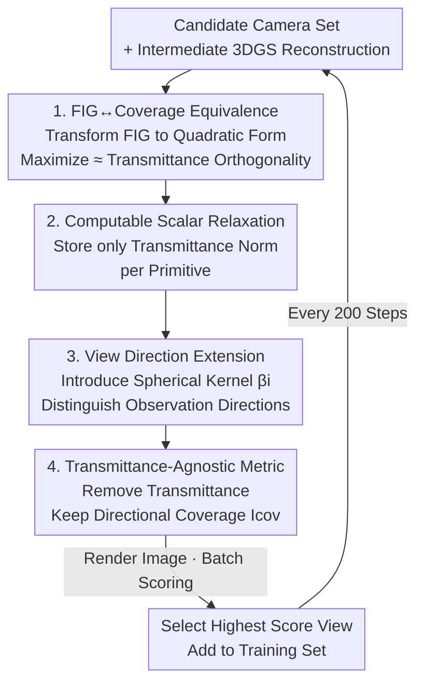

# Coverage Optimization for Camera View Selection

**Conference**: CVPR 2026  
**Paper**: [CVF Open Access](https://openaccess.thecvf.com/content/CVPR2026/html/Chen_Coverage_Optimization_for_Camera_View_Selection_CVPR_2026_paper.html)  
**Code**: Yes (Nerfstudio package, see project page; ⚠️ Github link not provided in paper)  
**Area**: 3D Vision  
**Keywords**: Active view selection, Radiance field reconstruction, Fisher information gain, Geometric coverage, 3D Gaussian Splatting

## TL;DR
Starting from Fisher Information Gain (FIG), this paper performs a series of analytical approximations to prove that "selecting the most informative next view" is mathematically equivalent to "selecting a view observing geometry worst covered by existing cameras." This yields CONVERGE, a lightweight, visualizable metric requiring no custom CUDA kernels. On 15 real scenes, it consistently outperforms FisherRF and random baselines in reconstruction quality, with a single scan being ~7x faster than FisherRF.

## Background & Motivation
**Background**: Reconstruction quality in radiance fields (NeRF / 3DGS) heavily depends on training view quality. Active view selection (next-best-view selection) aims to decide the "next camera position" during reconstruction to maximize the geometry and appearance quality given a limited shooting budget.

**Limitations of Prior Work**: Existing methods are divided into two categories. Heuristic coverage methods are simple but often only slightly better than random sampling. Information-theoretic methods (FisherRF, Bayes' Rays, various uncertainty quantifications) have solid mathematical foundations but are computationally expensive, rely on non-stationary quantities (transmittance) that change rapidly during training, are sensitive to training noise, and often require custom CUDA kernels. Essentially, theoretical methods are too heavy, while heuristic ones are too crude.

**Key Challenge**: Information gain and spatial coverage have been treated as two **independent** goals in prior work—either computing expensive information metrics or utilizing coarse coverage. No prior work has proven that they are essentially the same thing.

**Goal**: To find a view selection criterion that is both information-theoretically grounded and lightweight enough for real-time batch queries, while unifying "information gain" and "geometric coverage" in a single derivation.

**Key Insight**: The authors noticed that human-captured datasets naturally have good coverage—suggesting a simple rule guides "good views," though it hasn't been mathematically characterized. Thus, they re-derive Fisher Information Gain from first principles.

**Core Idea**: Use a series of controlled approximations to simplify Fisher Information Gain **into a coverage metric depending only on the "view direction coverage of each primitive."** This proves that "maximizing information gain ≈ prioritizing poorly-covered geometry" and implements it as a scalar metric that can be rendered as an image for real-time batch queries.

## Method

### Overall Architecture
The core of CONVERGE is not a network but a **chain of relaxation derivations**: transforming the expensive computation of "how much information a new view brings" into "how much of the geometry observed by this new view has not been covered by existing cameras." The chain consists of four steps: (1) Re-writing Fisher Information Gain (FIG) as a quadratic form of transmittance patterns, proving that maximizing FIG ≈ making new transmittance patterns orthogonal to existing ones; (2) Relaxing this objective, which requires storing a massive weight matrix, into a computable metric that **only stores one scalar per primitive**; (3) Extending the metric from "position-only" to "view-direction-aware" to distinguish between different perspectives of the same geometry; (4) **Removing the noisy transmittance terms** that change drastically during training, leaving only "view-direction coverage" to obtain the final transmittance-agnostic metric $I_\text{cov}$. This metric can be rendered like an image, allowing for batch scoring of all candidate cameras to select the highest-scoring view for training every 200 steps.

### Key Designs

**1. FIG↔Coverage Equivalence: Translating "Max Information Gain" to "Orthogonal Transmittance Patterns"**

This addresses the pain point that while information-theoretic methods are grounded, no one articulated what "information gain" actually prefers. The authors re-write the attribute regression of each primitive as a least squares problem $\min_c \|W^{(K)}c - C\|_2^2$, where the weight matrix $W^{(K)}$ stores termination probabilities (transmittance) for all pixel-primitive pairs. Using Fisher information $F(W)=\log|W^TW|$ to measure solution certainty, adding a new observation $w$ is a rank-one update to the Gram matrix $G=W^TW$. Information gain is derived via the matrix determinant lemma as:

$$\text{FIG}(w;W)=\log|G+ww^T|-\log|G}=\log(1+w^TG^{-1}w).$$

Under unit norm assumptions, maximizing FIG is equivalent to $\arg\max_{\|w\|=1} w^TG^{-1}w = \arg\min_{\|w\|=1} w^TGw$ (Rayleigh quotient), which is further equivalent to $\arg\min_{w}\|W^{(K)}w\|_2$. This formula is highly interpretable: we want the transmittance pattern $w$ of the new view to be **orthogonal** to all observed patterns—meaning it should observe geometry that "existing cameras have rarely observed," thereby reducing the color uncertainty of those primitives. This step bridges abstract information gain and intuitive "coverage."

**2. Computable Scalar Relaxation: Storing One Norm per Primitive**

While the first step's goal is elegant, the number of rows in $W^{(K)}$ equals the total number of pixels in the training set, and columns equal the number of primitives, making it impossible to store. The authors prove a key relaxation identity (equality holds at convex hull vertices):

$$\arg\min_{w\in S^{P-1}_+}\Big\|\sum_i W^{(K)}_{:,i}w_i\Big\|_2 = \arg\min_{w\in S^{P-1}_+}\sum_i w_i\,\|W^{(K)}_{:,i}\|_2,$$

The right side only requires **maintaining an incremental scalar** $\|W^{(K)}_{:,i}\|_2^2$ per primitive, updated by $+w_i^2$ for each new observation. More importantly, the form "linear combination of per-primitive scalars using transmittance weights" is exactly how the radiance rendering equation works. Thus, the metric $I_\text{trans}(x_0,d)=\sum_i w_i(x_0,d)\|W^{(K)}_{:,i}\|_2$ can be calculated by **adding one extra channel to the rendering pipeline**, much like rendering color. Computation and storage drop from the "entire matrix" to "one number per Gaussian."

**3. View Direction Extension: Making the Coverage Metric Direction-Aware**

Specific to radiance fields, the same geometry looks different from different directions. The authors assume a view-dependent color model $c_i(d)=\beta_i(d)r_i$ for each primitive, where $\beta_i\in S^{L-1}_+$ are weights for a set of spherical patches (determined by a spherical radial kernel centered at $d$). Expanding color regression to color field regression leads to a new design matrix $\tilde W^{(K)}=W\cdot\text{blkdiag}(\beta_1,\dots,\beta_P)$. Applying the scalar relaxation yields the view-dependent metric:

$$I_\text{view}(x_0,d)=\sum_i w_i(x_0,d)\sum_\ell \beta_i^\ell(d)\,\|[\tilde W^{(K)}]_i^\ell\|_2.$$

This ensures coverage doesn't just check if a primitive has been seen, but also from which directions it was observed.

**4. Transmittance-Agnostic Coverage Metric (CONVERGE): Removing Noise, Leaving Directional Coverage + Exploration/Exploitation**

The authors found that using the metric with transmittance is risky: it is computationally expensive and oscillates during training as Gaussians occlude each other. Attaching the metric too closely to 3DGS parameters hampers reconstruction. They **abstract away the transmittance influence**: the weights of primitives within a camera's frustum are treated as equal (and zero outside). Using a Spherical Gaussian kernel $\beta(d;\mu,\kappa)=C\exp(\kappa d\cdot\mu)$, the coupling between training camera direction $d^i_c$ and candidate direction $d^i_\text{test}$ via a first-order Taylor expansion results in the final coverage metric:

$$I_\text{cov}(x_0,d)=\sum_i w_i(x_0,d)\,\frac{1+\max_c d^i_c\cdot d}{2}.$$

Intuitively, it favors cameras where the view direction for each observed Gaussian has a **large angle** with all existing training views. In implementation, instead of storing every training direction, they maintain a discrete boolean grid on the unit sphere: a cell is set to 1 if a camera has come from that direction. Furthermore, since $I_\text{cov}\in[0,1]$, they use a background term $b\in\{0,1\}$ for alpha blending to toggle between exploration and exploitation: $b=1$ rewards foreground occlusion (exploitation), while $b=0$ penalizes it (exploration).

### Loss & Training
The method introduces no new losses; reconstruction follows standard 3DGS / NeRF objectives. The scene is seeded with 10 views; every 200 gradient steps, $I_\text{cov}$ scores the candidate pool to add 1 new view until 30K steps. It is implemented within Nerfstudio without needing custom CUDA kernels beyond gsplat.

## Key Experimental Results

### Main Results
On 15 real scenes (Tanks & Temples, Mip-NeRF360, etc.), CONVERGE was compared against Bayes' Rays, FisherRF, Random, and an Oracle upper bound. Results at 30K steps:

| Method | PSNR↑ | SSIM↑ | LPIPS↓ |
|------|-------|-------|--------|
| Bayes' Rays | 15.75 | 0.38 | 0.69 |
| FisherRF | 21.04 | 0.68 | 0.25 |
| Random | 21.80 | 0.70 | 0.21 |
| **CONVERGE (Ours)** | **22.12** | **0.71** | **0.20** |

Random is surprisingly strong due to human-capture bias in datasets. FisherRF lags behind random. CONVERGE is the best among feasible methods.

### Ablation Study
Tested under Sparse (1 initial view) and Embodied (kNN-based movement) settings:

| Setting | Method | PSNR↑ | SSIM↑ | LPIPS↓ |
|------|------|-------|-------|--------|
| All (Upper Bound) | Splatfacto | 24.83 | 0.79 | 0.16 |
| Embodied | Random | 22.48 | 0.71 | 0.23 |
| Embodied | FisherRF | 22.27 | 0.70 | 0.24 |
| Embodied | **CONVERGE** | **23.21** | **0.73** | **0.20** |
| Sparse | Random | 22.81 | 0.72 | 0.21 |
| Sparse | **CONVERGE** | 22.80 | 0.71 | 0.21 |
| Embodied+Sparse | Random | 20.89 | 0.65 | 0.32 |
| Embodied+Sparse | **CONVERGE** | **22.39** | **0.70** | **0.24** |

### Key Findings
- **More constrained scenes yield higher CONVERGE gains**: While only slightly better than Random on fixed datasets (+0.32 PSNR), it outperforms Random by ~1.5 PSNR in the Embodied+Sparse setting, making it suitable for real-world robotics.
- **Sparse initialization is a weakness**: With only 1 initial view, CONVERGE ties with Random because inaccurate early geometry leads to poor coverage ranking.
- **Computational efficiency**: Scanning >300 images to select a view takes 3.5s on average, compared to 23.9s for FisherRF and 37.1s for Bayes' Rays.
- Removing the transmittance term is more stable than keeping it, as the metric avoids being overly coupled to inaccurate 3DGS proxy geometry.

## Highlights & Insights
- **Mathematical unification of FIG and coverage**: This work provides the missing theoretical link, proving that coverage is the dominant factor of Information Gain.
- **Renderable Metric**: Since the final form is isomorphic to the radiance rendering equation, the coverage metric can be splatted into an image, allowing humans to visually identify poorly covered areas.
- **Exploration/Exploitation Toggle**: The bounded nature of $I_\text{cov}\in[0,1]$ allows an easy alpha-blending switch for robotics mapping.
- The relaxation paradigm ("expensive quantity → step-by-step relaxation → one scalar per Gaussian") is reusable for other active sensing tasks.

## Limitations & Future Work
- The coverage proxy is a lower bound of FIG; it may be unreliable in extremely cluttered scenes where transmittance carries critical independent information.
- **Lighting Ignores**: It does not model shading, light direction, or complex BRDF, which may be suboptimal for scenes with strong view-dependent appearance changes.
- **Dependency on Intermediate Quality**: Requires a reasonably accurate intermediate reconstruction; extremely sparse initialization leads to ranking failures.
- Embodied tests were in simulation; online planning on real robot trajectories remains to be verified.

## Related Work & Insights
- **vs FisherRF**: Both originate from Fisher information, but FisherRF directly calculates Hessian/gradients and depends on transmittance, making it 7x slower.
- **vs Bayes' Rays**: These perform posterior uncertainty estimation, which is computationally heavy and inherits NeRF/3DGS performance issues.
- **vs Pure Coverage Heuristics**: Prior work found uniform coverage beats complex uncertainty empirically; this work provides the mathematical justification ("coverage is an approximation of FIG").

## Rating
- Novelty: ⭐⭐⭐⭐☆ Unifies two previously distinct paths from FIG to coverage.
- Experimental Thoroughness: ⭐⭐⭐⭐☆ Tested across 15 scenes and 3 settings, though lacks physical robot validation.
- Writing Quality: ⭐⭐⭐⭐☆ Clear four-step derivation and intuitive visualization.
- Value: ⭐⭐⭐⭐☆ Lightweight, plug-and-play, and practical for active robotics.

<!-- RELATED:START -->

## Related Papers

- [\[CVPR 2026\] DropAnSH-GS: Dropping Anchor and Spherical Harmonics for Sparse-view Gaussian Splatting](dropping_anchor_and_spherical_harmonics_for_sparse-view_gaussian_splatting.md)
- [\[CVPR 2026\] ForgeDreamer: Industrial Text-to-3D Generation with Multi-Expert LoRA and Cross-View Hypergraph](forgedreamer_industrial_text-to-3d_generation_with_multi-expert_lora_and_cross-v.md)
- [\[CVPR 2026\] Intrinsic Geometry-Appearance Consistency Optimization for Sparse-View Gaussian Splatting](intrinsic_geometry-appearance_consistency_optimization_for_sparse-view_gaussian_.md)
- [\[CVPR 2026\] DirectFisheye-GS: Enabling Native Fisheye Input in Gaussian Splatting with Cross-View Joint Optimization](directfisheye-gs_enabling_native_fisheye_input_in_gaussian_splatting_with_cross-.md)
- [\[CVPR 2026\] 4C4D: 4 Camera 4D Gaussian Splatting](4c4d_4_camera_4d_gaussian_splatting.md)

<!-- RELATED:END -->
