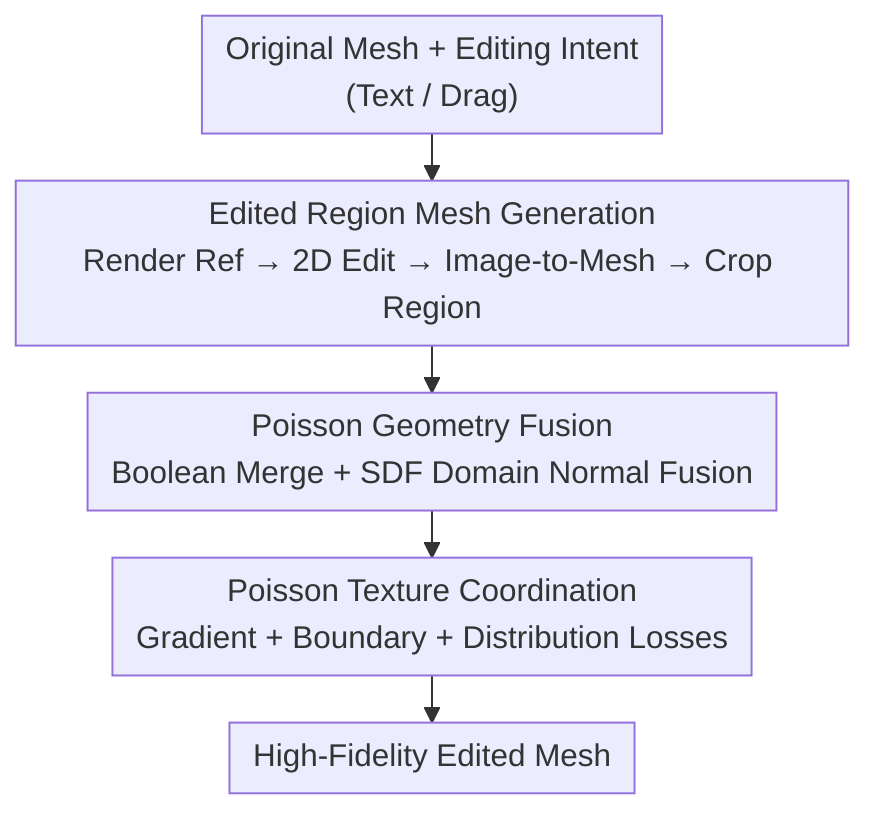

# CraftMesh: High-Fidelity Generative Mesh Manipulation via Poisson Seamless Fusion

**Conference**: CVPR 2026  
**Paper**: [CVF Open Access](https://openaccess.thecvf.com/content/CVPR2026/html/Hu_CraftMesh_High-Fidelity_Generative_Mesh_Manipulation_via_Poisson_Seamless_Fusion_CVPR_2026_paper.html)  
**Code**: Project Page https://jameshu.org/CraftMesh (Code not yet released)  
**Area**: 3D Vision  
**Keywords**: Mesh Editing, Generative 3D, Poisson Seamless Fusion, SDF Representation, Texture Coordination  

## TL;DR
CraftMesh decomposes high-fidelity mesh editing into a three-stage pipeline: "2D image editing → image-to-mesh → seamless fusion." It utilizes Poisson normal fusion (geometry) and Poisson texture coordination (color) within the SDF domain to seamlessly integrate generated editing regions into the original mesh, significantly outperforming SDS-based and multi-view diffusion-based baselines in complex insertion, deletion, and local editing tasks.

## Background & Motivation
**Background**: 3D generative models (e.g., Hunyuan3D, Trellis, Clay) can produce high-quality meshes from text or images. However, "controllable 3D editing" remains an open problem—existing frameworks excel at reconstruction from scratch but struggle with localized, fine-grained modifications to existing models. While explicit triangular meshes are the dominant representation in professional 3D pipelines, research on generative mesh editing is far less common than neural field editing.

**Limitations of Prior Work**: Existing generative mesh editing approaches are divided into two categories, each with significant drawbacks. SDS-based methods (e.g., FocalDreamer, MagicClay) optimize geometry via Score Distillation, maintaining structure reasonably well but lacking multi-view consistency, often leading to over-simplification or distortion. MVD-based methods (e.g., Instant3dit, MVEdit, CMD) synthesize multi-view edits before reconstruction but fail to preserve the original geometry and texture. Neither achieves high-fidelity results on complex models.

**Key Challenge**: Editing must simultaneously satisfy two conflicting goals: generating rich details in the edited area (requiring strong generative priors) and ensuring seamless integration with the original mesh at geometric boundaries and textures without damaging unaffected parts. Classical Poisson Mesh Editing addresses stitching but operates in the coordinate domain, requiring one-to-one vertex correspondence (unrealistic) and producing artifacts due to gradient discontinuities at boundaries. Solving the Poisson equation directly in 3D voxel space is computationally expensive at $O(n^3)$.

**Goal**: To develop a high-fidelity editing framework capable of performing insertion, deletion, and local editing on complex meshes while maintaining the connectivity of the original geometry and texture.

**Key Insight**: Rather than training an end-to-end 3D editor, it is more effective to "delegate" tasks—letting mature 2D image editors handle "what to change" and image-to-mesh models handle "creating details," while the framework itself focuses on the most difficult task: "how to stitch seamlessly."

**Core Idea**: Reformulate editing as a generation process: first perform 2D editing on rendered images, kemudian generate an "edited region mesh" via image-to-mesh models, and finally use Poisson seamless fusion (geometry + texture) in the SDF domain to stitch it into the original mesh.

## Method

### Overall Architecture
The input to CraftMesh is a source mesh and the user's editing intent (text or drag arrows), and the output is a high-fidelity mesh with the edits seamlessly integrated. The pipeline consists of three stages: ① **Edited Region Mesh Generation**—render a reference image from the original mesh, edit it using a 2D model (e.g., FLUX Kontext), and convert the edited image to 3D using an image-to-mesh model (e.g., MeshyAI / Hunyuan3D / Trellis) to extract the edited region mesh $M_r$; ② **Poisson Geometry Fusion**—perform a Boolean operation between the original mesh $M_o$ and $M_r$ to get an initial merged mesh, then optimize boundary transitions using Poisson normal fusion on a mixed SDF/Mesh representation; ③ **Poisson Texture Coordination**—apply seamless coloring to the new geometry to match the original mesh. Stages ② and ③ are collectively termed **Geometry and Texture Fusion**, the core technical contribution.

A key design choice is optimizing both geometry and texture in the SDF domain rather than directly on discrete meshes. Neural SDF provides robust convergence, differentiable rendering, analytical gradients, and natural continuity, allowing Poisson fusion to handle geometry and texture simultaneously and coherently in an implicit domain.

### Key Designs

**1. 2D Edit - Mesh Gen - Seamless Fusion Pipeline: Outsourcing to Mature Models**

To address the failure of end-to-end 3D editors to produce detail, CraftMesh leverages task decomposition. It renders a reference image from the original mesh, allowing users to modify it via any 2D backend (FLUX Kontext, Qwen-Image, even manual design tools). This provides natural control over the "where and what" of the edit without manual 3D positioning. An image-to-mesh model then lifts the edited image to a reference mesh $M_e$, from which the edited region $M_r$ is extracted. This makes the framework model-agnostic regarding the specific editing/generation backends.

**2. Poisson Geometry Fusion: Eliminating Seams via SDF Normal Blending**

Direct Boolean operations (union for insertion, difference for deletion) between $M_o$ and $M_r$ leave geometric discontinuities. CraftMesh extracts repair regions at the intersection: Boolean operations generate intersection vertices $V_{in}$, used to define localized neighborhoods $M_t^{in}$ and $M_e^{in}$ from the merged and reference meshes. 

Repair is performed by optimizing a neural SDF $S_t$ bound to the mesh. The core mechanism is normal guidance: rendering normals $n_t$ from $M_t^{in}$, $\hat n_t$ from the SDF, and $n_e$ from $M_e^{in}$. A Poisson operator $\Gamma(\cdot)$ blends them into a target normal $n_p = \Gamma(n_t, n_e, mask^{opt})$, preserving $n_e$ details inside the mask while smoothing the transition to $n_t$. The optimization objective is:

$$\mathcal{L}_{\text{poisson}}=\sum_i\|\hat n_t^i-n_p^i\|_F^2$$

This reduces complexity from $O(n^3)$ in 3D voxels to $O(kn^2)$ on 2D normal maps. The implicit SDF automatically "flattens" multi-view inconsistencies into a coherent transition. The total geometry loss includes smoothness and Eikonal constraints: $\mathcal{L}_{\text{geo}}=\mathcal{L}_{\text{poisson}}+\lambda_1\mathcal{L}_{\text{smooth}}+\lambda_2\mathcal{L}_{\text{eik}}$.

**3. Poisson Texture Coordination: Triple Losses for Seamless Tonal Alignment**

Directly texturing the new geometry $M_t^{new}$ often results in color shifts. CraftMesh employs three losses on the implicit color field. First, **Gradient Propagation**: constrains the gradient of the new color field to match the original to preserve high-frequency details: $\mathcal{L}_{\text{grad}}=\text{MSE}\big(\sigma(\nabla C_{new}/\gamma),\,\sigma(\nabla C_{new}^{ori}/\gamma)\big)$. Second, **Smooth Transition**: a distance-weighted boundary loss $\mathcal{L}_{\text{boundary}}=\sum_{p_i^{new}}w_i\|C_{new}(p_i^{new})-C_{pr}(p_i^{pr})\|_2^2$ where $w_i$ decays with distance to suppress seams.

Third, **Distribution-Aware Color Alignment**: to prevent color normalization failure due to repetitive patterns, the framework aligns the RGB probability densities of the new region $M_t^{new}$ and preserved region $M_t^{pr}$ using Kernel Density Estimation (KDE): $\mathcal{L}_{\text{distribution}}=\frac{1}{N}\sum_i\|\rho^{new}(q_i)-\rho^{pr}(q_i)\|_2$. This enforces consistent color distributions across the boundary and supports PBR materials.

### Loss & Training
The geometry and texture phases are optimized separately: $\mathcal{L}_{\text{geo}}$ takes ~5 minutes for 1000 steps on an RTX 4090; $\mathcal{L}_{\text{tex}}$ takes ~1 minute for 2000 steps. The backbone uses MagicClay's hybrid SDF-Mesh representation and implicit color fields.

## Key Experimental Results

### Main Results
The evaluation set includes 100 complex 3D models (Objaverse-XL, Google Scanned Objects, etc.) with 3 instructions each. Metrics include CLIPsim, CLIPdir (directionality of edit), and no-reference quality metrics NIQE and NIMA.

| Method | CLIPsim ↑ | CLIPdir ↑ | NIQE ↓ | NIMA ↑ |
|------|-----------|-----------|--------|--------|
| FocalDreamer (SDS) | 13.010 | 3.927 | 12.340 | 5.234 |
| MagicClay (SDS) | 15.043 | 5.994 | 7.344 | 5.334 |
| Instant3dit (MVD) | 14.108 | 4.326 | 7.390 | 5.288 |
| VoxHammer (Latent) | 17.366 | 10.482 | 8.291 | 5.307 |
| **Ours (MeshyAI)** | **20.801** | **18.479** | **4.710** | **5.928** |

Ours outperforms all baselines across all metrics. Notably, CLIPdir nearly doubles, indicating that the "direction" of editing aligns far better with the intent. Qualitative results show that while baselines produce rough geometry and inconsistent colors, Ours maintains harmonic structures and high-fidelity textures.

### Ablation Study
Baseline is "Boolean operation only."

| Configuration | CLIPsim ↑ | CLIPdir ↑ | NIQE ↓ | NIMA ↑ |
|------|-----------|-----------|--------|--------|
| Baseline (Boolean only) | 17.723 | 10.348 | 5.802 | 5.073 |
| + Geometry Fusion | 20.502 | 11.979 | 5.774 | 5.290 |
| + Texture Coordination | 19.399 | 10.724 | 5.290 | 5.184 |
| **Ours (MeshyAI)** | **20.801** | **18.479** | **4.710** | **5.928** |

Combining both fusion modules yields the best results. Performance remains consistently SOTA across different backends (Hunyuan3D, Trellis, MeshyAI), proving the gain comes from the fusion pipeline design.

### Key Findings
- The massive jump in CLIPdir from ~12 to ~18.5 suggests the synergy of geometry/texture phases is crucial.
- The framework is model-agnostic regarding the generative backend, allowing it to benefit from future improvements in upstream models.
- It naturally extends to drag-based editing by integrating image-based dragging models like LightningDrag.

## Highlights & Insights
- **Dimensionality Reduction for 3D Editing**: Solving the Poisson equation on 2D normal maps instead of 3D voxels reduces complexity from $O(n^3)$ to $O(kn^2)$ while using implicit SDF to resolve inconsistencies.
- **Addressing Poisson Weaknesses**: The distribution-aware color alignment fixes failure modes in standard gradient-domain editing where repetitive patterns interfere with tonal propagation.
- **Model-Agnostic Engineering**: Decoupling "what to change," "detail creation," and "stitching" allows each component to be handled by the most specialized tool, creating a robust, future-proof paradigm.

## Limitations & Future Work
- The framework inherits the limitations of its underlying 2D/3D models, struggling with open surfaces or noisy meshes.
- Evaluation relies heavily on perception-based metrics; a lack of hard geometric metrics (Chamfer distance) or large-scale user studies is noted.
- Future work: Exploring more robust Boolean and alignment pre-processing for non-watertight or noisy meshes.

## Related Work & Insights
- **vs. SDS-based**: These optimize via distillation but lack consistency. Ours uses explicit generation + Poisson stitching for higher fidelity.
- **vs. MVD-based**: These often fail to preserve unchanged parts of the mesh. Ours isolates the edited region to maintain original integrity.
- **vs. Classical Poisson**: Classical methods require strict vertex correspondence; Ours works in the SDF gradient domain, making it far more flexible for generative tasks.

## Rating
- Novelty: ⭐⭐⭐⭐ Innovative assembly of 2D edit, 3D gen, and SDF-domain Poisson fusion.
- Experimental Thoroughness: ⭐⭐⭐ Good ablation and baselines, but needs larger datasets and geometric metrics.
- Writing Quality: ⭐⭐⭐⭐ Clear pipeline explanation and loss definitions.
- Value: ⭐⭐⭐⭐ High practical utility for professional 3D workflows.

<!-- RELATED:START -->

## Related Papers

- [\[CVPR 2026\] TopoMesh: High-Fidelity Mesh Autoencoding via Topological Unification](topomesh_high-fidelity_mesh_autoencoding_via_topological_unification.md)
- [\[CVPR 2026\] UniTEX: Universal High Fidelity Generative Texturing for 3D Shapes](unitex_universal_high_fidelity_generative_texturing_for_3d_shapes.md)
- [\[CVPR 2026\] FACE: A Face-based Autoregressive Representation for High-Fidelity and Efficient Mesh Generation](face_a_face-based_autoregressive_representation_for_high-fidelity_and_efficient_.md)
- [\[CVPR 2026\] HyperGaussians: High-Dimensional Gaussian Splatting for High-Fidelity Animatable Face Avatars](hypergaussians_high-dimensional_gaussian_splatting_for_high-fidelity_animatable_.md)
- [\[CVPR 2026\] High-Fidelity Mobile Avatars with Pruned Local Blendshapes](high-fidelity_mobile_avatars_with_pruned_local_blendshapes.md)

<!-- RELATED:END -->
