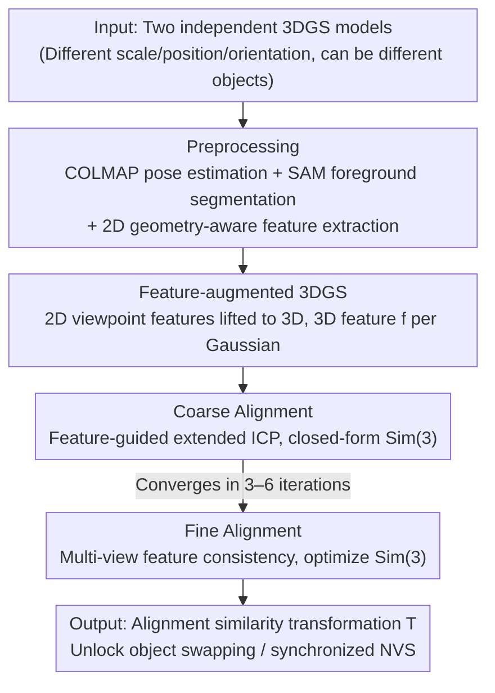

# Cross-Instance Gaussian Splatting Registration via Geometry-Aware Feature-Guided Alignment

**Conference**: CVPR 2026  
**arXiv**: [2603.21936](https://arxiv.org/abs/2603.21936)  
**Code**: [https://bgu-cs-vil.github.io/GSA-project](https://bgu-cs-vil.github.io/GSA-project)  
**Area**: 3D Vision / 3D Registration  
**Keywords**: 3D Gaussian Splatting, Cross-Instance Registration, Similarity Transformation, Geometry-Aware Features, Inverse Radiance Fields

## TL;DR
The authors propose GSA (Gaussian Splatting Alignment), the first method to achieve cross-instance category-level 3DGS registration. By combining geometry-aware feature-guided coarse alignment (extended ICP for Sim(3) similarity transformation) and multi-view feature consistency fine alignment, the method significantly outperforms existing approaches in both same-object and cross-object scenarios.

## Background & Motivation

**Background**: 3D Gaussian Splatting (3DGS) has emerged as a powerful representation for high-fidelity novel view synthesis. However, aligning two independent 3DGS models remains an open challenge. Existing methods like GaussReg rely on ICP, which can only handle registration of identical object models.

**Limitations of Prior Work**: (1) ICP fails when initialization is poor (e.g., 180° rotation); (2) ICP cannot handle unknown scales and requires ground-truth scale; (3) Cross-instance registration (different objects) fails because geometric differences cause nearest-neighbor matching to converge to incorrect correspondences.

**Key Challenge**: 3DGS models generated via SfM naturally possess arbitrary scale, position, and orientation differences. Furthermore, different objects within the same category exhibit shape and appearance variations, rendering traditional geometric methods ineffective.

**Goal**: How to align two 3DGS models—possibly belonging to different objects of the same category—via a similarity transformation (rotation + translation + scale) under unknown scale?

**Key Insight**: (1) Replace pure geometric signals with geometry-aware viewpoint-guided features for correspondence establishment; (2) Generalize the inverse radiance field framework from single-view camera pose estimation to multi-view field-to-field registration.

**Core Idea**: Feature-guided extended ICP for coarse alignment + multi-view feature field consistency optimization for fine alignment = robust cross-instance 3DGS registration.

## Method

### Overall Architecture
The input consists of two independently trained 3DGS models with varying scales, positions, and orientations (possibly of different objects). The pipeline estimates the aligning similarity transformation via three core stages following standard preprocessing: **Preprocessing** uses COLMAP for pose estimation, SAM for foreground segmentation, and Mariotti et al.'s method for 2D geometry-aware feature extraction. Subsequently: (1) **Feature-augmented 3DGS** lifts these 2D features to 3D, assigning a feature vector to each Gaussian; (2) **Coarse Alignment** uses a feature-guided iterative absolute orientation solver for Sim(3) estimation; (3) **Fine Alignment** minimizes residuals via multi-view feature field consistency optimization.

### Key Designs

**1. Feature-augmented 3DGS: Attaching geometry-aware features to Gaussians**

Cross-instance registration fails because pure geometric nearest-neighbor matching is unreliable for different shapes. GSA embeds semantic signals by learning an additional 3D feature $\mathbf{f} \in \mathbb{R}^3$ for each Gaussian, lifted from 2D viewpoint-guided spherical features. Optimization is decoupled: color and geometry are optimized first, then frozen, followed by feature optimization. The goal is to minimize $\mathcal{L} = \mathcal{L}_{\text{rgb}} + \lambda_f \mathcal{L}_f$, where $\mathcal{L}_f = \|F - F^r\|_1$. Geometry-aware features (Mariotti et al.) are preferred over DINOv2 because DINOv2 lacks 3D geometric awareness and exhibits spatial ambiguity (e.g., identical features for symmetric parts), which leads to incorrect mirrored alignments.

**2. Coarse Alignment: Integrating feature constraints into ICP**

GSA reformulates traditional ICP into a "feature-guided iterative absolute orientation solver." Each iteration consists of three steps. First, for each source point $\mathbf{p}_i$, a candidate set is filtered by feature similarity $\mathcal{Q}_i = \{\mathbf{q}_j \mid \|\mathbf{f}_i - \mathbf{f}_j\| \leq \tau_f\}$, and the spatial nearest neighbor is selected within this set. Second, the Sim(3) transformation is solved in closed-form:

$$\min_{T^{(k)} \in \mathbf{Sim(3)}} \sum_i \|T^{(k)}(\mathbf{p}_i^{(k)}) - \mathbf{q}_i^{(k)}\|_2^2$$

Rotation and translation are solved via Kabsch-Umeyama, and scale via Horn. Third, $T^{(k)}$ is applied for the next iteration. This feature filtering solves three ICP issues: robustness to 180° rotation (initialization), unknown scale recovery (Sim(3) space), and cross-instance geometric differences (semantic constraints).

**3. Fine Alignment: Multi-view feature field consistency**

Fine alignment generalizes the inverse radiance field (iNeRF) concept to multi-view field registration. Starting from the coarse result, a set of viewpoints $C_k^*$ is fixed. The transformed source field and target field are rendered as feature maps, and their difference is minimized:

$$\mathcal{L}_{\text{MV-FC}} = \sum_{k=1}^N \|\text{Rend}_f(T\mathcal{G}_1, C_k^*) - \text{Rend}_f(\mathcal{G}_2, C_k^*)\|_2^2$$

Key generalizations include: optimizing Sim(3) instead of SE(3), and rendering features instead of colors. Multi-view constraints resolve scale-depth ambiguity, while feature rendering handles cross-instance appearance variations where color alignment would fail.

### Loss & Training
- 3DGS Construction: $\mathcal{L} = \mathcal{L}_{\text{rgb}} + \lambda_f \mathcal{L}_f$, $\lambda_f=1$, $\alpha=0.2$.
- Coarse Alignment: Iterative nearest point + closed-form solver, $\tau_f=0.01$, max 6 iterations.
- Fine Alignment: Multi-view feature consistency, 3 diverse views, 60 iterations, learning rate 0.01.

## Key Experimental Results

### Main Results — Same-Object Registration (Objaverse, 15 items)

| Method | Requires GT Scale? | Mean RRE (°) ↓ | Description |
|------|---------|----------|------|
| FGR | Yes | High | Fails under noise |
| REGTR | Yes | High | Assumes rigid transform |
| GaussReg | Yes | Elevated | Sensitive to initialization |
| GSA (coarse only) | **No** | SOTA | Coarse alone exceeds all baselines |
| GSA (coarse + fine) | **No** | **Near Perfect** | Order of magnitude improvement |

### Cross-Instance Registration (ShapeNet, 6 cats × 10 pairs)

| Method | Mean RRE (°) ↓ | Description |
|------|---------------|------|
| FGR | Very High | Complete failure |
| REGTR | Very High | Complete failure |
| GaussReg | Very High | Complete failure |
| GSA | **Lowest** | First effective cross-instance solution |

### Ablation Study

| Configuration | RRE Impact | Description |
|------|---------|------|
| W/O Feature Guidance (Pure ICP) | Coarse 136.29°, Fine 139.82° | Complete failure |
| Replace with DINOv2 Features | Usually fails | Spatial ambiguity |
| Fine Alignment Color vs Feature | Significant drop | Cross-instance color mismatch |
| 3 Similar Views (vs Diverse) | Lower precision | View diversity is critical |

### Key Findings
- Coarse alignment already achieves SOTA; fine alignment further reduces error to near-zero for identical objects.
- GSA handles 180° rotation and 10× scale differences from initialization.
- Geometry-aware features are critical—alternatives like DINOv2 fail due to spatial ambiguity.

## Highlights & Insights
- **Pioneering Category-Level 3DGS Registration**: Fills the gap in cross-instance alignment, enabling object swapping and synchronized novel view synthesis.
- **Elegant Theoretical Extension**: Generalizes iNeRF from pose-to-field to field-to-field registration via Sim(3) and multi-view feature consistency.
- **Practical Efficiency**: Completed within very few iterations (3–6 coarse, 60 fine).

## Limitations & Future Work
- Performance depends on the quality of geometry-aware features.
- Validated at the object level; scene-level (complex multi-object) extensions are unexplored.
- View selection strategy in fine alignment could be further automated.

## Related Work & Insights
- Comparison with GaussReg highlights the necessity of feature guidance.
- The generalization of the inverse radiance field (iNeRF, iComMa) to registration is broadly applicable.
- The choice of Mariotti et al. features proves superior for 3D tasks over purely semantic 2D features.

## Rating
- Novelty: ⭐⭐⭐⭐⭐ First cross-instance 3DGS registration.
- Experimental Thoroughness: ⭐⭐⭐⭐⭐ Synthetic/real data, same/cross-instance.
- Writing Quality: ⭐⭐⭐⭐⭐ Clear derivation and logical progression.
- Value: ⭐⭐⭐⭐⭐ Opening new directions for 3DGS manipulation.

<!-- RELATED:START -->

## Related Papers

- [\[CVPR 2026\] Geometry-Aware Cross-Modal Graph Alignment for Referring Segmentation in 3D Gaussian Splatting](geometry-aware_cross-modal_graph_alignment_for_referring_segmentation_in_3d_gaus.md)
- [\[CVPR 2026\] Energy-GS: Image Energy-guided Pose Alignment Gaussian Splatting with redesigned pose gradient flow](energy-gs_image_energy-guided_pose_alignment_gaussian_splatting_with_redesigned_.md)
- [\[CVPR 2026\] GaussianGrow: Geometry-aware Gaussian Growing from 3D Point Clouds with Text Guidance](gaussiangrow_geometry-aware_gaussian_growing_from_3d_point_clouds_with_text_guid.md)
- [\[CVPR 2026\] ULF-Loc: Unbiased Landmark Feature for Robust Visual Localization with 3D Gaussian Splatting](ulf-loc_unbiased_landmark_feature_for_robust_visual_localization_with_3d_gaussia.md)
- [\[CVPR 2026\] DirectFisheye-GS: Enabling Native Fisheye Input in Gaussian Splatting with Cross-View Joint Optimization](directfisheye-gs_enabling_native_fisheye_input_in_gaussian_splatting_with_cross-.md)

<!-- RELATED:END -->
