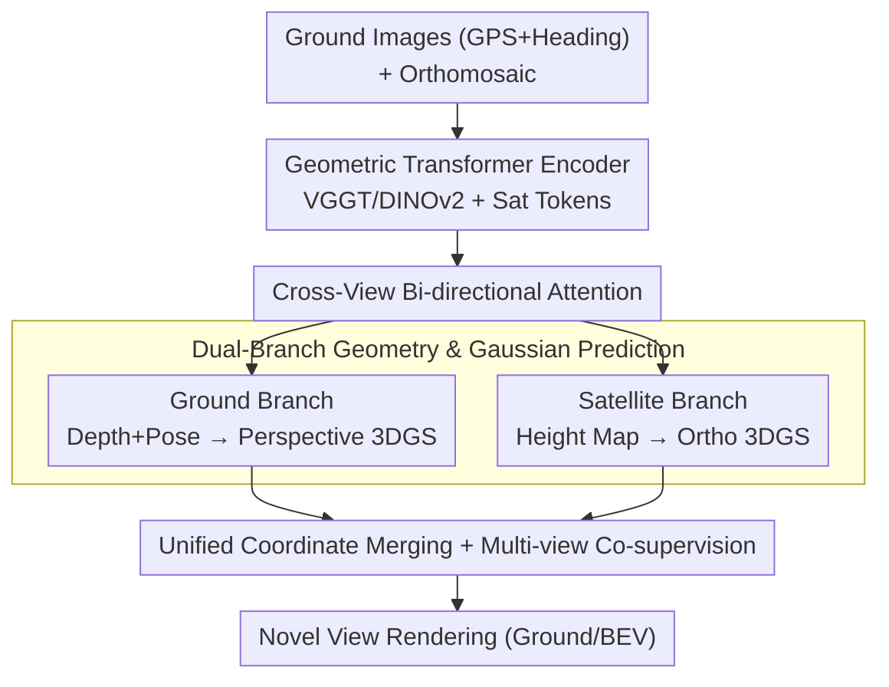

# Cross-View Splatter: Feed-Forward View Synthesis with Georeferenced Images

**Conference**: CVPR 2026  
**arXiv**: [2605.19656](https://arxiv.org/abs/2605.19656)  
**Code**: https://nianticspatial.github.io/cross-view-splatter/ (Avail.)  
**Area**: 3D Vision  
**Keywords**: Feed-forward 3D reconstruction, Gaussian Splatting, Cross-view, Satellite imagery, Novel View Synthesis

## TL;DR
To address the low coverage and difficulty of large-scale ground image collection in outdoor scenes, this paper proposes Cross-View Splatter: a feed-forward network that fuses GPS-tagged ground photos with orthorectified satellite images from public map services into a unified 3D coordinate system. By predicting pixel-aligned Gaussians for both ground (perspective) and satellite (orthographic) views, it significantly enhances scene coverage and extrapolation capabilities under sparse inputs.

## Background & Motivation

**Background**: Feed-forward 3D reconstruction (e.g., DUSt3R, VGGT) and feed-forward novel view synthesis (e.g., NoPoSplat, AnySplat) can regress pixel-aligned Gaussians from one or more images in seconds without camera calibration. These methods are fast and generalize well to sparse inputs.

**Limitations of Prior Work**: These methods are **trained and evaluated only on ground perspective images**. This is because mainstream 3D foundation model training data consists almost entirely of calibrated ground views with aligned depth. However, for city-scale outdoor scenes, ground image acquisition is time-consuming, difficult to scale, and costly to process—coverage is naturally limited, leading to failures when extrapolating slightly beyond observed regions.

**Key Challenge**: High-quality reconstruction requires good camera coverage, yet ground acquisition fails to provide wide-area coverage. Meanwhile, satellite orthomosaics (Bird's Eye View, BEV) clearly depict large-scale structures like roads and building outlines and are **freely queryable** as tiled web maps (e.g., Google Maps, Azure Maps). This global geometric prior is completely ignored by existing feed-forward pipelines.

**Goal**: Enable feed-forward Gaussian Splatting to consume both ground and orthographic satellite images, injecting global structural priors provided by satellites into the reconstruction to improve coverage and extrapolation quality.

**Key Insight**: For geolocated ground captures, tiled satellite maps provide a global structural prior beyond the street-level field of view. However, satellite images are challenging: they have coarse resolution, are affected by weather/lighting/seasons, and most critically, **orthorectification removes perspective and parallax**, preventing classical MVS/SfM from reconstructing geometry from a single orthomosaic. Thus, satellite geometry must be approached via learning.

**Core Idea**: Model the "satellite-to-ground" geometric relationship as **3DoF** (aligned via known GPS and heading). Re-formulate the satellite branch as a **height map regression** problem relative to a reference frame, transforming the height map into Gaussians via orthographic projection. Use **bi-directional cross-attention** to complement ground and satellite features in a unified space, finally merging both sets of Gaussians into the same coordinate system for rendering.

## Method

### Overall Architecture

Given a set of geolocated ground images $(I_i^{\text{ground}})_{i=0}^{N}$ (with GPS coordinates and headings) and a corresponding orthomosaic $I^{\text{sat}}$ (with known spatial resolution $r^{\text{sat}}$ in pixels/meter), the model outputs two sets of pixel-aligned 3D Gaussians in a **shared coordinate system** in a single forward pass: ground Gaussians $\mathcal{G}^{\text{ground}}$ and satellite Gaussians $\mathcal{G}^{\text{sat}}$. The coordinate system is centered at the first ground image $I_0^{\text{ground}}$ (identity pose, zero altitude), with the satellite image centered and aligned to the heading of $I_0^{\text{ground}}$.

The process involves four steps: ① Ground images use a pre-trained VGGT (DINOv2 patch tokens + camera/register tokens) for feature extraction; the satellite image is also partitioned into patch tokens. ② **Bi-directional cross-attention** $\operatorname{Attn}_{\text{meta}}$ is injected into the VGGT alternating attention backbone to exchange information between ground and satellite tokens. ③ The ground branch uses a DPT head to regress depth and 6DoF pose/intrinsics for perspective Gaussians, while the satellite branch regresses a relative height map for orthographic Gaussians. ④ Both sets are normalized to the same scale and merged for rendering. During training, height maps are supervised by public terrain data (DEM/LiDAR), but **inference requires only satellite and ground images**.

### Key Designs

**1. Cross-View Bi-directional Attention: Complementing Ground and BEV Features**

Ground and satellite views use fundamentally different imaging models. Applying VGGT directly to orthomosaics fails because orthographic projection lacks perspective, 6DoF pose, and intrinsics. Instead of forcing satellite images into a perspective framework, the authors insert additional cross-attention layers $\operatorname{Attn}_{\text{meta}}$ into the VGGT backbone to bi-directionally couple satellite tokens $t^{\text{sat}}$ and ground tokens $t^{\text{ground}}$:

$$\operatorname{Attn}_{\text{meta}}(t^{\text{sat}}, t^{\text{ground}}) = \mathcal{A}_2\big(t^{\text{sat}}, \mathcal{A}_1(t^{\text{ground}}, t^{\text{sat}}, t^{\text{sat}})\big)$$

The first layer allows ground tokens to query satellite tokens (obtaining global BEV structure), while the second allows satellite tokens to absorb ground details. This is repeated $L=12$ times, embedding both into a **similar feature space** and allowing satellite priors to flow into the ground reconstruction.

**2. Dual-Branch Gaussian Prediction: Ground Perspective + Satellite Height Map Orthogonalization**

The fused tokens split into two paths. The **ground branch** follows a standard feed-forward pipeline: a DPT head outputs depth $d_j^{\text{ground}}$ and confidence $C_j^{\text{ground}}$, while a camera head predicts 6DoF poses $\bm{T}_i$ and intrinsics $\bm{K}_i$. Back-projection yields Gaussian centers $\bm{\mu}_j^{\text{ground}}=\operatorname{backproject}(d_j^{\text{ground}}, \hat{\bm{K}_j}, \hat{\bm{T}_j})$. The **satellite branch** re-formulates the problem as **relative height map regression** relative to the $I_0^{\text{ground}}$ frame: $h^{\text{sat}}, C^{\text{sat}} = \operatorname{DPT_{height}}(t^{\text{sat}})$. Using the resolution $r^{\text{sat}}$, height pixels are mapped to 3D positions:

$$\bm{\mu}_j^{\text{sat}} = \Big(\tfrac{u}{r^{\text{sat}}},\ \tfrac{v}{r^{\text{sat}}},\ h^{\text{sat}}(u,v)\Big)^{\top}$$

**3. Multi-view Collaborative Supervision: Aligning Dual Gaussians via BEV Rendering**

To ensure physical alignment, the authors design interlocking rendering losses. Ground Gaussians use confidence-weighted depth loss $\mathcal{L}_{\text{depth}}$ and consistency loss $\mathcal{L}_{\text{const}}$. Satellite Gaussians are **rendered to both input and interpolated novel views** for color supervision $\mathcal{L}_{\text{RGB}}^{\text{sat}}$ (forcing satellite geometry to hold for new perspectives). The key collaborative term renders the merged Gaussians back to the **ground view** ($\mathcal{L}_{\text{RGB}}^{\text{combined}}$) and the **satellite BEV plane** ($\mathcal{L}_{BEV}$).

**4. Georeferenced Data Curation: Creating 3D Supervision for Orthographic Views**

Since orthomosaics lack MVS-based 3D labels, the authors curate a dataset by querying Google/Azure/Esri tiles at 2 px/m based on ground GPS. They extract terrain heights from public LiDAR/DEM data to create **satellite-height map pairs**, providing ground truth for the satellite branch.

### Loss & Training

$Total Loss = Ground (\mathcal{L}_{\text{depth}} + \mathcal{L}_{\text{cam}} + \mathcal{L}_{\text{const}} + \mathcal{L}_{\text{RGB}}^{\text{ground}}) + Satellite (\mathcal{L}_{\text{height}} + \mathcal{L}_{\text{RGB}}^{\text{sat}}) + Collaborative (\mathcal{L}_{\text{RGB}}^{\text{combined}} + \mathcal{L}_{BEV}) + Sky (\mathcal{L}_{\text{sky}})$. Initialized from AnySplat weights, trained on 2×A100 for 4 days, batch size 10, input resolution $518\times518$.

## Key Experimental Results

### Main Results

On the georeferenced Tanks and Temples benchmark (sparse view synthesis), the Combined model outperforms all baselines, especially with a single context view:

| Setting | Method | PSNR↑ | SSIM↑ | LPIPS↓ |
|------|------|-------|-------|--------|
| 1 context | AnySplat | 7.48 | 0.3572 | 0.6482 |
| 1 context | Sat2Density† | 8.81 | 0.3557 | 0.8172 |
| 1 context | **Ours (Combined)** | **11.13** | **0.3764** | 0.6286 |
| 1 context | Ours (Ground) | 8.92 | 0.3621 | 0.6066 |
| 3 context | Splatfacto (Per-scene 5min+) | 11.72 | 0.2888 | 0.6267 |
| 3 context | AnySplat | 10.93 | 0.3775 | 0.5331 |
| 3 context | **Ours (Combined)** | **12.00** | **0.3855** | 0.5699 |
| 3 context | Ours (Ground) | 10.61 | 0.3763 | 0.5631 |

### Ablation Study

Metropolis Dataset (36 test scenes, 2 input + 2 novel views), PSNR:

| Configuration | Ground | Terrain | Combined |
|------|--------|---------|----------|
| VGGT w/ 3DGS: $\mathcal{L}_{\text{cam}}+\mathcal{L}_{\text{depth}}+\mathcal{L}_{\text{RGB}}^{\text{ground}}$ | 15.26 | - | - |
| + $\mathcal{L}_{\text{const}}$ | 16.99 | - | - |
| + $\mathcal{L}_{\text{sky}}$ | 17.10 | - | - |
| w/ SAT: +$\mathcal{L}_{\text{RGB}}^{\text{combined}}$ | 16.99 | 5.24 | 17.17 |
| **+ $\mathcal{L}_{\text{RGB}}^{\text{sat}}$ (Full)** | **17.59** | **12.25** | **18.63** |

### Key Findings
- **Satellite Head is the Core Driver**: Adding the satellite branch improves Combined PSNR from 17.10 to 18.63. Satellite geometry (Terrain) jumps from 5.24 to 12.25 with $\mathcal{L}_{\text{RGB}}^{\text{sat}}$, indicating BEV geometry becomes truly useful for novel views.
- **Highest Gain at Low Overlap**: Gains are most significant when context-target IoU $\leq 0.15$, confirming that satellite priors primarily aid extrapolation.

## Highlights & Insights
- **Translating "Non-reconstructible" Satellite Views**: Orthographic images lack parallax; this paper bypasses this via height map regression with 3DoF alignment, elegantly transforming height maps into Gaussians via $r^{\text{sat}}$.
- **Free Map Services as Geometric Priors**: Unlike methods requiring multi-view satellite scans, this uses ubiquitous orthomosaics and GPS/heading, drastically lowering deployment barriers.
- **Bi-directional Attention as Feature Aligner**: This paradigm for fusing heterogeneous imaging models (e.g., Radar+Camera) is highly transferable.

## Limitations & Future Work
- **Absolute Accuracy**: PSNR remains relatively low (11–13) due to extreme sparse settings and low overlap.
- **3DoF Alignment Dependency**: Assumes known GPS/heading and zero-altitude for $I_0^{\text{ground}}$. GPS drift in urban canyons could break alignment.
- **Temporal/Domain Gap**: Satellite tiles may represent different seasons or lighting than ground captures, causing texture/geometry conflicts.

## Related Work & Insights
- **vs AnySplat / NoPoSplat**: These are ground-only. This work outperforms AnySplat by incorporating cross-view coverage.
- **vs SkySplat / Skyfall-GS**: These require off-axis multi-view satellite imagery, which is harder to obtain than standard orthomosaics used here.
- **vs Sat2Density**: Sat2Density synthesizes ground views from satellite images but generalizes poorly across urban scenes compared to this method's fusion approach.

## Rating
- Novelty: ⭐⭐⭐⭐⭐ First feed-forward method predicting Gaussians for both perspective ground and orthographic satellite views.
- Experimental Thoroughness: ⭐⭐⭐⭐ Extensive benchmark comparisons and overlap-based analysis; lacks drift sensitivity analysis.
- Writing Quality: ⭐⭐⭐⭐ Clear motivation and well-defined coordinate systems.
- Value: ⭐⭐⭐⭐⭐ High practical value for city-scale reconstruction using existing map infrastructure.

<!-- RELATED:START -->

## Related Papers

- [\[CVPR 2026\] EcoSplat: Efficiency-controllable Feed-forward 3D Gaussian Splatting from Multi-view Images](ecosplat_efficiency-controllable_feed-forward_3d_gaussian_splatting_from_multi-v.md)
- [\[CVPR 2026\] From Rays to Projections: Better Inputs for Feed-Forward View Synthesis](from_rays_to_projections_better_inputs_for_feed-forward_view_synthesis.md)
- [\[CVPR 2026\] Learning Compact 3D Representations from Feed-Forward Novel View Synthesis](learning_compact_3d_representations_from_feed-forward_novel_view_synthesis.md)
- [\[CVPR 2026\] Reliev3R: Relieving Feed-forward 3D Reconstruction from Multi-View Geometric Annotations](reliev3r_relieving_feed-forward_3d_reconstruction_from_multi-view_geometric_annot.md)
- [\[CVPR 2026\] Hierarchical Visual Relocalization with Nearest View Synthesis from Feature Gaussian Splatting](hierarchical_visual_relocalization_with_nearest_view_synthesis_from_feature_gaus.md)

<!-- RELATED:END -->
