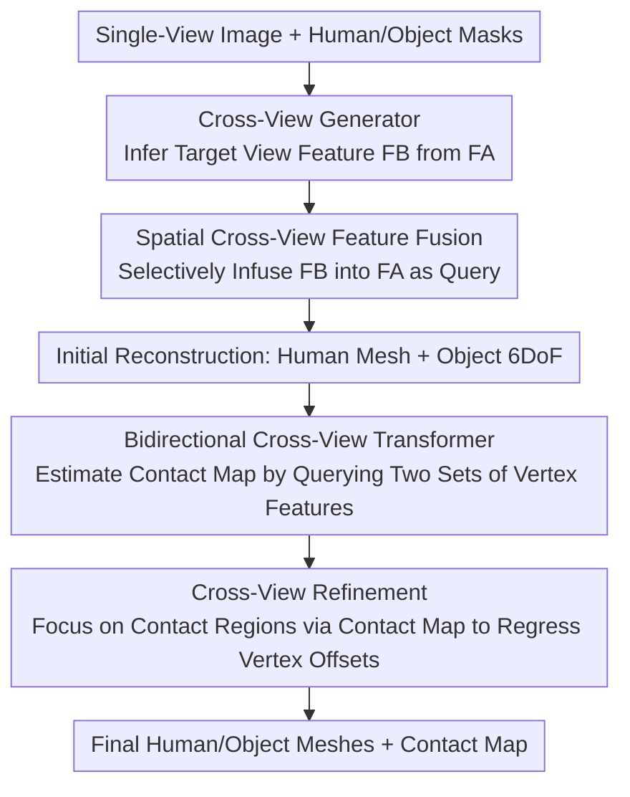

# CrossHOI: Learning Cross-View Representations for Monocular 3D Human-Object Interaction Reconstruction

**Conference**: CVPR 2026  
**Paper**: [CVF Open Access](https://openaccess.thecvf.com/content/CVPR2026/html/Geng_CrossHOI_Learning_Cross-View_Representations_for_Monocular_3D_Human-Object_Interaction_Reconstruction_CVPR_2026_paper.html)  
**Code**: https://github.com/peigeng99/CrossHOI.git  
**Area**: 3D Vision  
**Keywords**: Monocular HOI Reconstruction, Human-Object Interaction, Cross-View Features, Contact Estimation, Occlusion

## TL;DR
Starting from a single image, CrossHOI "imagines" the image features from another perspective and uses these generated cross-view features to complement the geometric information of human-object mutual occlusion regions. This simultaneously improves mesh reconstruction accuracy and contact region estimation in monocular 3D human-object interaction (HOI) reconstruction, achieving state-of-the-art (SOTA) results on BEHAVE and InterCap, with particularly significant improvements in occluded scenarios.

## Background & Motivation
**Background**: Monocular 3D HOI reconstruction aims to simultaneously recover human meshes, object meshes, and their contact relationships from a single RGB image. In recent years, the mainstream has been the **two-stage paradigm**: first obtaining initial meshes of the human and object from a single-view image, and then refining the contact regions by treating the initial reconstruction as a 3D prior. Representative works such as CONTHO explicitly estimate contact maps, while HOI-TG implicitly fuses topological structures using graph-aware Transformers.

**Limitations of Prior Work**: All these methods **only leverage single-view features**. However, humans and objects often occlude each other during interaction, and the actual contact regions are frequently partially or completely blocked. Relying solely on visible pixels makes it impossible to accurately infer the location and extent of contact in occluded areas. Early works (such as PHOSA and HolisticMesh) simply used pre-defined contact regions as hard constraints for optimization, resulting in mismatches between the pre-defined regions and the true contact distribution in the image, causing obvious deviations between the reconstruction results and the actual contact.

**Key Challenge**: The quality of contact estimation depends on the quality of the initial reconstruction, while the initial reconstruction naturally suffers from info deficit under occlusion—with a single view, the geometry of the occluded region is simply "invisible," and even the most exquisite post-processing cannot recover observations that did not exist.

**Goal**: To complement geometric information in occluded areas without adding extra inputs during inference (remaining monocular), making the initial reconstruction more reliable and the contact estimation more accurate.

**Key Insight**: Inspired by the "mental completion" capability of the human visual system—seeing the front allows one to imagine what the back roughly looks like. The authors propose: can we **directly infer the image features of another view** from a single-view image, complementing the spatial geometric information at the feature level? This avoids the need to actually capture a second camera, while still requiring only a single image during inference.

**Core Idea**: Train a cross-view generator to "generate" novel-view features from single-view features, and then utilize both the real-view and generated-view features for bidirectional fusion to simultaneously optimize initial reconstruction and contact estimation, enabling "better reconstruction" and "more accurate contact" to mutually reinforce each other.

## Method

### Overall Architecture
The input to CrossHOI is a single human-object interaction RGB image (concatenated with human/object segmentation masks), and the output is the refined human mesh, object mesh, and human-object contact map. The entire pipeline runs in four serial steps: first, a **cross-view generator** infers the target view feature $F_B$ from the original view feature $F_A$ (pre-trained offline); second, **spatial cross-view feature fusion** adaptively aggregates $F_A$ and $F_B$ to regress the initial human mesh $M^h_{init}$ and the 3D 6DoF object pose (initial mesh $M^o_{init}$); third, the vertices of the initial meshes are projected onto the feature maps of both views for mesh sampling to obtain two sets of 3D vertex features, which are fed into a **bidirectional cross-view Transformer** to estimate the human-object contact map $C_{ho}$; finally, utilizing the contact map to focus on the contact regions, a **cross-view refinement** is performed to regress vertex-wise offsets, yielding the final meshes. The overall logic is a closed-loop of "enhanced initial reconstruction $\to$ promoting contact estimation $\to$ contact in turn refining reconstruction."

### Key Designs

**1. Cross-View Generator: "Mental Completion" of Another View's Image Features from a Single View**

This serves as the foundation of the paper, addressing the pain point of missing information in occluded regions under a single view. The authors train a generator separately **offline**: selecting the pair of views with the largest perspective difference (e.g., front vs. back) for each sample from reconstruction datasets (BEHAVE / InterCap) to form a cross-view pair $(I_A, I_B)$, and using human/object segmentation masks to preserve only interaction-related regions and remove background noise, forcing the generator to learn perspective transformations under large viewpoint changes. Specifically, the ResNet-50 C3 stage feature map $F_A \in \mathbb{R}^{H\times W\times C}$ (a trade-off between spatial resolution and semantics) is used as input. To ensure geometric consistency in generation, the camera intrinsic matrix $K_A$ is projected into the featured space using an MLP to obtain a camera embedding $E_{K_A}=\mathrm{MLP}(\mathrm{Flatten}(K_A))$, which is added to each token as a positional bias: $\tilde F_A = F_A^t + E_{K_A}$. Then, using $\tilde F_A$ as the query and initializing the target view $I_B$ features and camera parameters as a set of **learnable key/value tokens** $T_{KV}$, the novel-view features are generated via a lightweight cross-attention module:

$$F_B' = \mathrm{CrossAttn}(\tilde F_A, T_{KV})$$

The reason for setting key/value as learnable tokens instead of directly using $I_B$ is to align both views in a **shared embedding space**, so that the novel-view features can be inferred **without** needing $I_B$'s camera parameters during inference. Training employs dual supervision on both value and direction to force $F_B'$ to align with the ground truth $F_B$: $L_{map}=\lambda_1\|F_B'-F_B\|_2^2 + \lambda_2(1-\cos(F_B',F_B))$, where MSE constrains the values and cosine similarity constrains the direction. Experiments show that the average cosine similarity between generated and real features reaches 0.784, and MMD < 0.05, proving that the "imagined" features closely match the true distribution.

**2. Spatial Cross-View Feature Fusion: Let the Real View Actively Retrieve Complementary Clues from the Generated View**

With $F_A$ (real) and $F_B$ (generated) features available, the most naive approach is direct addition; however, generated features contain noise, and direct addition would introduce redundancy or even contamination. Instead, the authors employ **spatial cross-attention**: treating the spatial tokens of $F_A$ as queries, and the tokens of $F_B$ as keys/values, allowing the real view to **selectively** infuse useful information from the generated view, secured by a residual connection:

$$F_{AB} = \mathrm{Softmax}\!\left(\frac{Q_A K_B^\top}{\sqrt{d}}\right) V_B + F_A$$

The residual design ensures that the fusion is a "supplement" rather than an "overwrite" of the original representation. Based on $F_{AB}$, the human SMPL+H parameters (body $\theta_{body}\in\mathbb{R}^{76}$, hand $\theta_{hand}\in\mathbb{R}^{90}$) are regressed to generate the initial human mesh $M^h_{init}\in\mathbb{R}^{431\times3}$ (downsampled from 6,890 vertices to save computation), as well as the 6DoF object pose (rotation $R_{init}$, translation $T_{init}$) to obtain $M^o_{init}\in\mathbb{R}^{64\times3}$. For a fair comparison, the initial reconstruction module follows the Hand4Whole framework. Ablation studies show that this cross-attention fusion yields a much higher relative improvement in **contact metrics** compared to reconstruction metrics—because the overall geometry can be roughly recovered from a single view, while local contact regions are highly sensitive to occlusion and heavily rely on cross-view information.

**3. Bidirectional Cross-View Transformer: Querying Two Sets of Vertex Features Mutually for More Reliable Contact Maps**

Contact estimation is the most challenging part of HOI reconstruction. After obtaining the initial meshes, each 3D vertex is projected onto the feature maps of $F_A$ and $F_B$ to perform mesh sampling, concatenated with the 3D vertex coordinates, constructing two view-dependent sets of 3D vertex features $F_{vA},F_{vB}\in\mathbb{R}^{(256+3)\times(431+64)}$. The key is that the two feature sets encode **complementary** geometric clues (visible in the real view vs. completed in the generated view), and unidirectional fusion would lose information. The authors design a **bidirectional** cross-attention mechanism where both sides serve as query/key/value for each other:

$$\hat F_{vA} = \mathrm{Softmax}\!\left(\frac{Q_{vA} K_{vB}^\top}{\sqrt{d_v}}\right) V_{vB} + F_{vA}$$

$$\hat F_{vB} = \mathrm{Softmax}\!\left(\frac{Q_{vB} K_{vA}^\top}{\sqrt{d_v}}\right) V_{vA} + F_{vB}$$

The fused $\hat F_{vA}$ and $\hat F_{vB}$ are aggregated and fed into an MLP to predict the contact map $C_{ho}\in\mathbb{R}^{431+64}$. This bidirectional mechanism allows both views to refine each other, with residuals ensuring stability without overwriting original semantics. Ablation studies compare this with unidirectional A$\to$B and B$\to$A baselines, with the bidirectional A$\leftrightarrow$B yielding the best performance; furthermore, A$\to$B (real view as primary query) outperforms B$\to$A, indicating that the real view should lead while retrieving supplements from the generated view—which also confirms that the generated features contain a certain amount of noise and should not dominate.

**4. Cross-View Refinement: Focusing Adjustments on Key Interaction Vertices via the Contact Map**

Once the contact map is predicted, it is not simply treated as the final result but is used in turn to refine the meshes. Specifically, $C_{ho}$ is multiplied with the vertex features $F_{vA},F_{vB}$ to yield masked features $F^c_{vA},F^c_{vB}$ that only preserve contact-related regions. These are then fused through bidirectional cross-attention (analogous to Eq. 6 and 7) to obtain $F^c_{vAB}$ containing cross-view interaction clues. Next, $F^c_{vAB}$ is used as a query to guide the fusion, while the full-view features $F_{vA},F_{vB}$ serve as keys/values to provide global geometric context. This restricts adjustments to the contact areas needing fine-grained correction while preserving global consistency. Finally, an MLP regresses vertex-wise offsets $\Delta M^h,\Delta M^o$ to obtain the final meshes: $M^h_{final}=M^h_{init}+\Delta M^h$, $M^o_{final}=M^o_{init}+\Delta M^o$. This step concentrates the refinement on key interaction vertices, improving contact estimation accuracy while maintaining overall geometric consistency.

## Loss & Training
The cross-view generator is **trained offline separately**: leveraging a ResNet-50 feature extractor, optimized via Adam with an initial learning rate of $1\times10^{-4}$ and a batch size of 32 for 50 epochs (the learning rate is multiplied by 0.1 after 30 epochs). The supervision matches the aforementioned $L_{map}$.

The total loss of the main reconstruction network $L_{recon}=L_{init}+L_{est}+L_{ref}$ consists of three components:

- $L_{init}=L_{param}+L_{coord}+L_{hbox}$, where $L_{param}$ is the L1 loss between predicted and ground-truth SMPL+H parameters as well as 6DoF object parameters, $L_{coord}$ is the L1 loss of 3D/2D human joint coordinates, and $L_{hbox}$ is the L1 distance of hand bounding boxes;
- $L_{est}$ is the cross-entropy loss of the contact map $C_{ho}$;
- $L_{ref}=L_{vertex}+L_{edge}$, where $L_{vertex}$ is the L1 distance between the final meshes and the ground truth, and $L_{edge}$ constrains the edge length consistency of human meshes to ensure local smoothness and physical plausibility.

Training uses Adam with a batch size of 16 and an initial learning rate of $5\times10^{-5}$ (multiplied by 0.1 after 35 epochs) for a total of 60 epochs. The backbone is initialized with Hand4Whole pre-trained weights. Target reconstruction regions are cropped using ground-truth bounding boxes on a single RTX 3090 GPU.

## Key Experimental Results

### Main Results
Evaluations are performed on two indoor HOI datasets: BEHAVE and InterCap. Metrics include human/object Chamfer Distance (CD, cm, lower is better) and contact quality (Contact Precision / Recall, defined as contact when a human vertex is within 5cm of the object mesh).

| Dataset | Method | CD_human↓ | CD_object↓ | Contact_p↑ | Contact_r↑ |
|--------|------|-----------|-----------|-----------|-----------|
| BEHAVE | PHOSA | 12.17 | 26.62 | 0.393 | 0.266 |
| BEHAVE | CHORE | 5.58 | 10.66 | 0.587 | 0.472 |
| BEHAVE | CONTHO | 4.99 | 8.42 | 0.628 | 0.496 |
| BEHAVE | HOI-TG | 4.59 | 8.00 | 0.662 | 0.554 |
| BEHAVE | **CrossHOI** | **4.27** | **7.68** | **0.687** | **0.576** |
| InterCap | CONTHO | 5.96 | 9.50 | 0.661 | 0.432 |
| InterCap | HOI-TG | 5.43 | 8.68 | 0.700 | 0.473 |
| InterCap | **CrossHOI** | **5.17** | **8.38** | **0.724** | **0.491** |

Compared to CONTHO, on BEHAVE human/object reconstruction CD improved by 14.4% / 8.7%, and contact precision/recall improved by 5.9pp / 8.0pp; on InterCap, compared to HOI-TG, human/object reconstruction improved by 4.7% / 3.5%, and contact precision/recall improved by 2.4pp / 1.8pp. Methods with pre-defined contact regions like PHOSA perform worst, proving that hard constraints struggle to adapt to the real contact distribution.

### Ablation Study
**Incremental integration of cross-view features across stages** (Baseline is the re-implemented CONTHO, with cross-view features incrementally added to initial reconstruction, contact estimation, and refinement stages, where each variant is built upon the previous one):

| Configuration | CD_human↓ | CD_object↓ | Contact_p↑ | Contact_r↑ | Description |
|------|-----------|-----------|-----------|-----------|------|
| Baseline* (CONTHO) | 5.13 | 8.51 | 0.635 | 0.502 | Re-implemented Baseline |
| +initial | 4.81 | 8.27 | 0.648 | 0.521 | Initial reconstruction with cross-view features (CD↓6.2%) |
| +contact | 4.36 | 7.82 | 0.679 | 0.560 | Plus contact estimation (CD↓9.4%) |
| +refine | 4.27 | 7.68 | 0.687 | 0.576 | Plus refinement (CD↓2.1%) |
| Ours (Full) | **4.27** | **7.68** | **0.687** | **0.576** | Cumulative CD↓16.8%, Contact_p +5.2pp |

**Vertex feature fusion directions** (validating the bidirectional Transformer):

| Fusion Direction | CD_human↓ | CD_object↓ | Contact_p↑ | Contact_r↑ |
|---------|-----------|-----------|-----------|-----------|
| B→A | 4.85 | 8.46 | 0.633 | 0.503 |
| A→B | 4.57 | 8.07 | 0.665 | 0.541 |
| A↔B (Ours) | **4.27** | **7.68** | **0.687** | **0.576** |

**Image feature fusion strategies** (validating that spatial cross-attention outperforms naive fusion):

| Method | CD_human↓ | CD_object↓ | Contact_p↑ | Contact_r↑ |
|------|-----------|-----------|-----------|-----------|
| element-wise add | 4.47 | 7.91 | 0.652 | 0.530 |
| concat+MLP | 4.39 | 7.82 | 0.671 | 0.548 |
| weighted sum | 4.34 | 7.74 | 0.678 | 0.552 |
| Ours (cross-attn) | **4.27** | **7.68** | **0.687** | **0.576** |

**Occlusion Subset** (500 occluded samples selected from the test set): Compared to the CONTHO baseline, CD_human is 4.91 vs 5.86, CD_object is 8.62 vs 10.15, and contact precision/recall is 0.629/0.513 vs 0.573/0.452, improving by 5.6pp / 6.1pp, respectively—indicating that the heavier the occlusion, the greater the benefit of cross-view features.

### Key Findings
- **The gain of cross-view features on contact-related metrics is much greater than that on reconstruction metrics**: While the overall geometry can be roughly recovered from a single view, with limited gains from fusion, local contact regions are extremely sensitive to occlusion and benefit the most from cross-view completion. This trend is consistent across image fusion (Tab. 3) and stage-by-stage ablation (Tab. 4).
- **The stage with the greatest contribution is contact estimation**: In the stage-by-stage addition, '+contact' alone reduces CD_human from 4.81 to 4.36 and increases contact precision by 3.1pp, which is the single step with the highest return, proving that contact modeling in the bidirectional Transformer is core.
- **The real view should dominate**: A$\to$B (real view as query) is significantly better than B$\to$A, and the bidirectional mechanism boosts the performance further, confirming that generated features contain noise and must be guided by the real view.

## Highlights & Insights
- **Turning "multi-view" from an input requirement into an intrinsic capability at the feature level**: Traditional multi-view reconstruction requires multiple actual cameras. This work utilizes an offline generator to "imagine" novel views in the feature space, still requiring only a single image during inference. This is a highly transferrable concept; any single-view task troubled by occlusion (e.g., monocular depth, monocular pose) can borrow this idea.
- **Learnable key/value tokens decouple dependence on target-view camera parameters**: By distilling $I_B$'s features and camera parameters into a set of learnable tokens, the target-view inputs are completely unnecessary during inference, achieving a very clean engineering implementation.
- **"Reconstruction $\leftrightarrow$ Contact" closed-loop mutual promotion**: The enhanced initial reconstruction enables more accurate contact estimation, and the precise contact in turn refines the reconstruction. The two are not a unidirectional pipeline but support each other, which is especially effective in occluded scenarios.
- **The quality of generated features is rigorously quantified** (cosine similarity of 0.784, MMD < 0.05), rather than just relying on appealing visualizations. This directly answers the most common doubt: "are the imagined features actually reliable?"

## Limitations & Future Work
- **Dependence on multi-view pairs during training**: The cross-view generator requires datasets with multi-view annotations like BEHAVE / InterCap to construct large-viewpoint-difference pairs for training. Whether it generalizes when transferred to real-world scenarios with only single-view data is still a question mark.
- **Noise in generated features**: The authors acknowledge that generated novel-view features contain noise (as evidenced by A$\to$B outperforming B$\to$A). While mitigated by "real-view dominance," the noise upper-bound has not been mathematically characterized—meaning generation quality might drop under extreme viewpoints or rare object categories.
- **Validation limited to indoor HOI datasets**: Code is only tested on BEHAVE and InterCap, which are indoor and limited in object types (20 / 10 categories). Outdoor, complex backgrounds, or multi-person multi-object scenarios remain untested.
- **Object representation limited to templates (6DoF)**: The object stream follows the "classification + regressing 6DoF pose to fit a template mesh" paradigm, which is naturally limited when dealing with non-rigid or deformable objects (e.g., clothing, ropes). ⚠️ This limitation is inferred from the methodology description as it was not explicitly discussed in the paper.

## Related Work & Insights
- **vs CONTHO**: CONTHO explicitly estimates contact regions and refines them using initial mesh + contact priors, but relies entirely on single-view features throughout. CrossHOI treats it as a baseline and injects cross-view features into the initial reconstruction, contact estimation, and refinement stages. On BEHAVE, CD_human drops from 4.99 to 4.27, and contact recall increases from 0.496 to 0.576, with even larger margins on the occluded subset.
- **vs HOI-TG**: HOI-TG uses a graph-aware Transformer to implicitly encode 3D vertex topology for contact modeling, but still under a single view. CrossHOI takes an "explicit cross-view geometry completion" route, outperforming it on InterCap (contact precision 0.724 vs 0.700, human CD 5.17 vs 5.43). The two can be viewed as "implicit topology enhancement" vs. "explicit view completion."
- **vs PHOSA / HolisticMesh**: These methods use pre-defined contact regions + physical constraints as hard constraints for optimization. CrossHOI points out that their pre-defined regions do not match the real contact distribution (PHOSA's CD_human is as high as 12.17 on BEHAVE), and replaces them with data-driven learnable contact estimation.

## Rating
- Novelty: ⭐⭐⭐⭐⭐ First to propose generating novel-view image features from a single view to address human-object mutual occlusion, showing a clear and transferrable methodology.
- Experimental Thoroughness: ⭐⭐⭐⭐ Multiple ablation studies across two datasets on stages/fusion directions/fusion strategies/occlusion subsets, along with quantified feature generation quality; however, evaluations are limited to indoor scenarios with limited categories.
- Writing Quality: ⭐⭐⭐⭐ Clear arguments and methodical description, complete equations, and good correspondence between figures and text.
- Value: ⭐⭐⭐⭐ Provides a highly reusable feature-level multi-view framework to address occlusion—a core bottleneck in HOI reconstruction, offering valuable insights to the monocular reconstruction community.

<!-- RELATED:START -->

## Related Papers

- [\[CVPR 2026\] ReGenHOI: Unifying Reconstruction and Generation for 3D Human-Object Interaction Understanding](regenhoi_unifying_reconstruction_and_generation_for_3d_human-object_interaction_.md)
- [\[CVPR 2026\] CARI4D: Category Agnostic 4D Reconstruction of Human-Object Interaction](cari4d_category_agnostic_4d_reconstruction_of_human_object_interaction.md)
- [\[CVPR 2026\] PhysHO: Physics-Based Dynamic 3D Gaussian Human and Object from Monocular Video](physho_physics-based_dynamic_3d_gaussian_human_and_object_from_monocular_video.md)
- [\[CVPR 2026\] Human Interaction-Aware 3D Reconstruction from a Single Image](human_interaction-aware_3d_reconstruction_from_a_single_image.md)
- [\[CVPR 2026\] Learning Multi-View Spatial Reasoning from Cross-View Relations](learning_multi-view_spatial_reasoning_from_cross-view_relations.md)

<!-- RELATED:END -->
