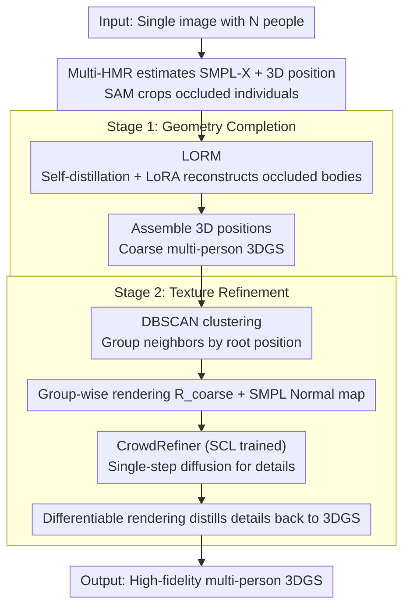

# CrowdGaussian: Reconstructing High-Fidelity 3D Gaussians for Human Crowd from a Single Image

**Conference**: CVPR 2026  
**arXiv**: [2603.17779](https://arxiv.org/abs/2603.17779)  
**Code**: None  
**Area**: 3D Vision  
**Keywords**: Human Reconstruction, 3D Gaussian Splatting, Occlusion Recovery, Diffusion Refinement, Crowd Scenes

## TL;DR

CrowdGaussian proposes a unified framework for reconstructing multi-person 3D Gaussian Splatting (3DGS) representations from a single image. It recovers complete geometry in occluded regions through a self-supervised adapted Large Occlusion-aware Reconstruction Model (LORM) and enhances texture detail quality using a single-step diffusion refiner (CrowdRefiner) trained with Self-Calibrated Learning (SCL).

## Background & Motivation

**Background**: Single-image 3D human reconstruction has achieved significant progress recently. Large Reconstruction Models (LRM) leverage Transformers and large-scale datasets to achieve rapid feed-forward reconstruction from single images. However, most existing methods only handle clear, close-up images of single individuals.

**Limitations of Prior Work**:
   - **Severe Occlusion**: Frequent person-person and person-object occlusions in crowd scenes result in incomplete body parts. Directly processing such inputs with existing methods produces transparent holes and incomplete geometry.
   - **Low Resolution**: The resolution of cropped images for each individual in a crowd is often low, leading to blurred appearances lacking high-frequency details.
   - **Efficiency in Multi-person Scenes**: Reconstructing a large number of humans simultaneously is inefficient if processed individually.

**Key Challenge**: Existing large human reconstruction models possess strong 2D-to-3D generative priors but lack occlusion-aware training. When fed occluded inputs, Transformers fail to integrate incomplete visual features, resulting in fragmented outputs. Furthermore, fine-tuning with limited 3D supervision tends to amplify geometric biases from monocular ambiguity, harming the pre-trained priors.

**Goal**: (a) How to recover complete 3D humans from severely occluded crops? (b) How to recover high-frequency texture details from low-resolution inputs? (c) How to efficiently process multi-person scenes simultaneously?

**Key Insight**: Instead of using 3D annotation-supervised fine-tuning, "self-supervised distillation" is employed—allowing a frozen teacher model to generate pseudo-GT on complete images, while the student model learns to recover complete geometry from occluded inputs.

**Core Idea**: A two-stage framework—Stage 1 uses a self-supervised adapted LORM to generate coarse but complete multi-person 3DGS, and Stage 2 uses an SCL-trained CrowdRefiner to refine rendering results and distill them back into the 3DGS.

## Method

### Overall Architecture

CrowdGaussian addresses the challenge of reconstructing complete, high-fidelity 3D Gaussian representations for every individual from a crowded photo—where severe occlusion and low resolution are inherent. The solution decomposes this difficult problem into two sequential stages: the first stage "completes fragmented geometry," and the second stage "refines blurred textures."

Specifically, the input is an image containing $N$ individuals. Stage 1 first estimates SMPL-X parameters and 3D positions for each person using Multi-HMR, segments each person using SAM, and then utilizes LORM to recover complete single-person 3DGS from these occluded crops. These are finally assembled into a coarse but geometrically complete multi-person scene based on 3D positions. Stage 2 uses DBSCAN to group spatially adjacent individuals, renders coarse images for each group, and feeds them to CrowdRefiner for single-step diffusion refinement to add high-frequency details. The refined images then serve as pseudo-GT to "distill" details back into the 3DGS via differentiable rendering. Both stages avoid reliance on external 3D annotations—geometry relies on pre-trained model self-distillation, and texture relies on 2D generative priors.

### Key Designs

**1. LORM: Teaching reconstruction models to "hallucinate" occluded bodies via self-distillation**

Individuals in crowds are often fragmented by occlusions, and off-the-shelf large human reconstruction models (e.g., LHM-500M) have never seen occluded inputs. Direct feeding causes Transformers to fail in integrating fragmented features, leading to broken and transparent outputs. LORM performs "occlusion adaptation" on the pre-trained model. Critically, it avoids fine-tuning with 3D annotations—monocular reconstruction has inherent depth ambiguity, and heavy supervision would amplify geometric bias and destroy pre-trained priors. Instead, the model acts as its own teacher: the teacher stream is the frozen original model fed with complete images $I_{\text{full}}$ to generate complete Gaussians $\mathcal{G}_{\text{full}}$, rendering clean pseudo-GT $R_{\text{clean}}^{(v)}$ from $V$ novel views. The student stream applies random occlusions (Bézier curves and keypoint ellipses simulating person/object occlusion) to the same image to get $I_{\text{occ}}$, letting LORM predict 3DGS and render coarse views $R_{\text{coarse}}^{(v)}$. Both are aligned using a pure 2D consistency loss:

$$\mathcal{L}_{\text{self-distill}} = \sum_v \left( \lambda_{\text{rgb}} \|R_{\text{clean}}^{(v)} - R_{\text{coarse}}^{(v)}\|_2 + \lambda_{\text{ssim}} (1 - \text{SSIM}(R_{\text{clean}}^{(v)}, R_{\text{coarse}}^{(v)})) \right)$$

To preserve pre-trained capabilities, the Sapiens encoder (MAE architecture) and Gaussian decoder are frozen; only trainable LoRA modules are injected into the intermediate Multi-Modal Body-Head Transformer (MBHT). This keeps encoding and decoding visual priors intact, while LoRA adjusts attention weights to "imagine" what occluded parts should look like. Adaptation was completed using only 1002 frontal images.

**2. CrowdRefiner: Enhancing high-frequency details from over-smoothed textures via single-step diffusion**

While LORM solves geometric completeness, textures remain blurry—reconstruction models have limited resolution, resulting in over-smoothed skin and clothing details. CrowdRefiner performs texture enhancement as an SD-Turbo-based single-step diffusion model. It takes coarse RGB renderings $R_{\text{coarse}}$ and corresponding SMPL normal maps $N$ as geometric priors. Normal maps are encoded via a lightweight PoseNet, and RGB is encoded via a frozen VAE encoder; both features are injected into the UNet to guide generation, while the VAE decoder is fine-tuned with LoRA adaptation. Diffusion is used for its strong 2D generative priors to hallucinate high-frequency details LORM cannot provide. Single-step inference is maintained for efficiency in multi-individual crowd scenes.

**3. Self-Calibrated Learning (SCL): Teaching the refiner "not to touch what is already good"**

Diffusion refiners often suffer from a common issue: they "enhance" all areas indiscriminately, often distorting well-reconstructed faces and creating artifacts. SCL addresses this by randomly mixing two types of sample pairs during training. One is the standard degradation pair $(R_{\text{coarse}}, R_{\text{gt}})$, teaching the model to recover high quality from coarseness. The other is the identity-preserving pair $(R_{\text{gt}}, R_{\text{gt}})$, where both input and target are GT, explicitly telling the model "this is good enough, output it as is." Without this, the model becomes overly aggressive; with identity-preserving samples, it learns to adaptively judge which areas are blurry and need completion and which areas (especially faces) are already sufficient and should be preserved.

**4. DBSCAN Clustering Refinement: Batch refinement of spatially adjacent individuals**

With dozens of people in a crowd, person-by-person rendering and refinement is computationally prohibitive. This step uses DBSCAN to group individuals into spatially coherent sets based on their root positions, allowing for collective rendering and refinement of entire groups. Clustering ensures that people processed together are spatially close, and results are distilled back to respective 3DGS via L1 + SSIM loss, saving computation while maintaining global scene consistency.

### Loss & Training

- **LORM Self-Distillation Loss**: $\mathcal{L}_{\text{self-distill}} = \sum_v (\lambda_{\text{rgb}} \| \cdot \|_2 + \lambda_{\text{ssim}} (1 - \text{SSIM}))$, rendered from 24 fixed views.
- **CrowdRefiner Training Loss**: $\mathcal{L}_{\text{diff}} = \lambda_{L2}\mathcal{L}_{\text{L2}} + \lambda_{\text{lpips}}\mathcal{L}_{\text{LPIPS}} + \lambda_{\text{ssim}}\mathcal{L}_{\text{SSIM}} + \lambda_{\text{gram}}\mathcal{L}_{\text{Gram}}$.
- **3DGS Optimization Loss**: $\mathcal{L}_{\text{optim}} = \|R_{\text{refined}} - R_{\text{coarse}}\|_1 + \lambda_{\text{ssim}}(1 - \text{SSIM})$.
- LORM Training Data: 1002 frontal images from HuGe100K.
- CrowdRefiner Training Data: 114 synthetic multi-person scenes from THuman2.1 (91 training / 23 testing), 126 views per scene.

## Key Experimental Results

### Main Results

Quantitative comparison of occluded human reconstruction (THuman2.1, random occlusion masks):

| Method | PSNR ↑ | SSIM ↑ | LPIPS ↓ |
|------|--------|--------|---------|
| IDOL | 18.063 | 0.919 | 0.994 |
| LHM | 18.171 | 0.918 | 1.012 |
| LORM (Ours) | 18.566 | 0.923 | 0.956 |
| LORM + CrowdRefiner | **18.619** | **0.931** | **0.914** |

Robustness under different occlusion rates (THuman2.1):

| Method | Occlusion Rate | PSNR ↑ | SSIM ↑ | LPIPS ↓ |
|------|--------|--------|--------|---------|
| IDOL | 20% | 18.196 | 0.921 | 0.978 |
| IDOL | 60% | 16.667 | 0.909 | 1.063 |
| LHM | 20% | 17.945 | 0.919 | 1.006 |
| LHM | 60% | 17.551 | 0.915 | 1.037 |
| **LORM** | **20%** | **18.428** | **0.923** | **0.947** |
| **LORM** | **60%** | **18.116** | **0.919** | **0.972** |

### Ablation Study

Ablation of SCL strategy and geometric condition input for CrowdRefiner:

| SCL | Normal Map | PSNR ↑ | SSIM ↑ | LPIPS ↓ |
|-----|-----------|--------|--------|---------|
| ✗ | ✗ | 20.013 | 0.888 | 0.141 |
| ✗ | ✓ | 20.130 | 0.892 | 0.138 |
| ✓ | ✗ | 20.382 | 0.896 | 0.129 |
| ✓ | ✓ | **20.790** | **0.901** | **0.122** |

### Key Findings

- **LORM shows minimal degradation under high occlusion**: As occlusion increases from 20% to 60%, LORM's PSNR drops by only 0.31 (18.43→18.12), whereas IDOL drops by 1.53 (18.20→16.67). Self-supervised adaptation effectively injects occlusion-handling capabilities.
- **SCL is key to preventing over-refinement**: Without SCL, PSNR drops by 0.77 (20.79→20.01), with qualitative facial distortions. Identity-preserving samples in SCL teach the model to avoid excessive modifications.
- **Normal maps enhance geometric consistency**: Adding SMPL normal map inputs reduced LPIPS from 0.129 to 0.122, providing clear geometric constraints for the refiner.
- **Mesh-based methods fail under occlusion**: PSHuman and SyncHuman fail to recover geometry for occluded parts, whereas 3DGS-based IDOL and LHM output some results but suffer from transparent artifacts and distorted textures.

## Highlights & Insights

- **Brilliant self-supervised adaptation strategy**: Using the pre-trained model as its own teacher through synthetic occlusion and self-distillation allows learning occlusion recovery without external 3D annotations. This paradigm can be migrated to any scenario needing adaptation to new degradation types without destroying generative priors.
- **Elegant intuition of SCL**: Mixing "input = output" samples in training essentially tells the model to leave well-reconstructed areas alone. This simple trick effectively solves the over-modification problem in generative refinement.
- **Full path from single-person model to multi-person scene**: The combination of LORM + CrowdRefiner + DBSCAN clustering provides a complete, scalable multi-person 3D reconstruction solution, demonstrating how to build multi-person systems based on single-person models.

## Limitations & Future Work

- Dependency on off-the-shelf pose estimation and segmentation (Multi-HMR, SAM); initialization errors propagate, particularly for challenging hand reconstructions.
- Refinement at extremely low resolutions may generate hallucinated details inconsistent with reality (e.g., specific logos).
- Training data diversity is limited, using only 114 synthetic scenes from THuman2.1.
- Requirement for SMPL-X parameters may not be suitable for non-standard body shapes or extreme clothing.
- DBSCAN clustering may group too many people in high-density crowds, leading to insufficient refinement resolution.

## Related Work & Insights

- **vs LHM**: This work adapts LHM-500M directly. While LHM produces transparent artifacts under occlusion, LORM solves this via LoRA and self-distillation using only 1002 images.
- **vs CHROME**: CHROME uses multi-view diffusion for occlusion-free images, but inconsistency between synthesized views damages textures (especially faces). LORM performs recovery directly in 3DGS space, avoiding multi-view inconsistency.
- **vs DIFIX/GSFix3D**: General 3DGS refinement methods. CrowdRefiner focuses on human scenes, maintaining identity and facial details better through SMPL normal conditions and the SCL strategy.

## Rating

- Novelty: ⭐⭐⭐⭐ Innovative self-supervised adaptation and SCL, though the overall framework is modular.
- Experimental Thoroughness: ⭐⭐⭐⭐ Strong quantitative and qualitative coverage, convincing occlusion-rate experiments, but lacks larger-scale real-world benchmarks.
- Writing Quality: ⭐⭐⭐⭐ Clear structure with intuitive pipeline diagrams.
- Value: ⭐⭐⭐⭐ Fills a gap in multi-person 3D reconstruction with direct value for VR/telepresence applications.

<!-- RELATED:START -->

## Related Papers

- [\[CVPR 2026\] HumanNOVA: Photorealistic, Universal and Rapid 3D Human Avatar Modeling from a Single Image](humannova_photorealistic_universal_and_rapid_3d_human_avatar_modeling_from_a_sin.md)
- [\[CVPR 2026\] CraftMesh: High-Fidelity Generative Mesh Manipulation via Poisson Seamless Fusion](craftmesh_high-fidelity_generative_mesh_manipulation_via_poisson_seamless_fusion.md)
- [\[CVPR 2026\] CustomTex: High-fidelity Indoor Scene Texturing via Multi-Reference Customization](customtex_high-fidelity_indoor_scene_texturing_via_multi-reference_customization.md)
- [\[CVPR 2026\] 3D-Fixer: Coarse-to-Fine In-place Completion for 3D Scenes from a Single Image](3d-fixer_coarse-to-fine_in-place_completion_for_3d_scenes_from_a_single_image.md)
- [\[CVPR 2026\] Improving Human Image Animation via Semantic Representation Alignment](improving_human_image_animation_via_semantic_representation_alignment.md)

<!-- RELATED:END -->
