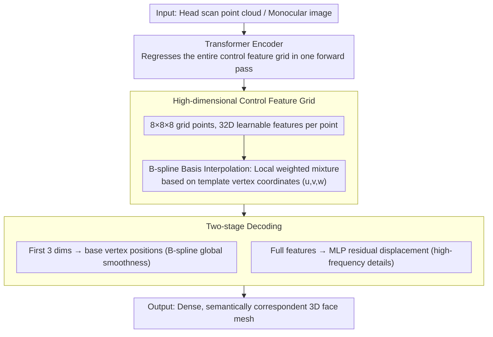

# CUBE: Representing 3D Faces with Learnable B-Spline Volumes

**Conference**: CVPR 2026 Highlight  
**arXiv**: [2604.12894](https://arxiv.org/abs/2604.12894)  
**Code**: None  
**Area**: 3D Vision / Face Reconstruction  
**Keywords**: B-spline Volumes, Face Representation, Scan Registration, Local Control, Geometric Editing

## TL;DR

Ours proposes CUBE (Control-based Unified B-spline Encoding), a hybrid geometric representation combining B-spline volumes with learnable high-dimensional control features. It achieves editable, high-precision 3D face reconstruction and scan registration through two-stage decoding (B-spline basis interpolation + lightweight MLP residuals).

## Background & Motivation

**Background**: 3D face representation primarily follows three paradigms: 3D Morphable Models (3DMMs) provide compressed, disentangled linear spaces but limited detail; nonlinear neural models enhance flexibility but lack interpretability and local control; implicit representations offer high detail but lack semantic correspondence and require expensive isosurface extraction.

**Limitations of Prior Work**: 3DMMs are restricted by fixed topologies and low-dimensional parameter spaces, failing to capture individualized high-frequency details. Neural models lack local editing capabilities. Implicit models are incompatible with standard graphics pipelines.

**Key Challenge**: It is difficult to simultaneously achieve local controllability, geometric expressiveness, and computational efficiency in a single representation.

**Goal**: Design a hybrid face representation that possesses both the local control properties of B-splines and the expressive power of neural networks.

**Key Insight**: Replace the 3D control points of traditional B-spline volumes with high-dimensional learnable control features, using a lightweight MLP to supplement high-frequency details.

**Core Idea**: A high-dimensional control feature grid (e.g., $8 \times 8 \times 8$) defines a continuous mapping from the parametric domain to Euclidean space, where B-spline bases provide local support properties for local editing.

## Method

### Overall Architecture

The **Core Problem** CUBE aims to solve is that 3D face representations are either controllable but lack detail (like 3DMMs) or detailed but lack local editability and graphics pipeline compatibility (like implicit models). The **Mechanism** involves merging the strengths of both: using a sparse control feature grid as an editable "skeleton" and a lightweight network to add details.

The entire pipeline follows a fixed template mesh. Each vertex on the template has fixed parametric coordinates $(u,v,w)$. During inference, the B-spline basis functions are used to perform a weighted mixture of neighboring control features at these coordinates to obtain a high-dimensional feature vector. The first three dimensions of this vector are directly interpreted as the base position of the vertex (coarse shape), while the full vector is fed into an MLP to predict a residual displacement (high-frequency detail). Calculating this for all template vertices yields a dense, semantically correspondent 3D face surface. The control feature grid itself is regressed from a scanned point cloud or monocular image via a Transformer encoder.

### Key Designs

**1. High-dimensional Control Feature Grid: Enabling Sparse Control Points to Express Complex Faces**

Traditional B-spline volumes place a 3D control point at each grid node, resulting in 3D coordinates. While sufficient for CAD surfaces, a sparse grid like $8^3$ lacks the capacity to express facial wrinkles and fine features. CUBE replaces each control point with a high-dimensional (e.g., 32D) learnable feature vector. When querying a parametric coordinate, the B-spline basis performs a weighted mixture only among a few neighboring control features: $f(u,v,w)=\sum_{i,j,k} B_i(u)B_j(v)B_k(w)\,\mathbf{c}_{ijk}$. This generates a high-dimensional vector rather than simple coordinates. Because B-spline bases have **local support** (only nearby control points are non-zero), modifying one control feature affects only a specific local area—the source of local editing capability. By increasing dimensionality, the same number of grid points can carry far richer shape information than 3D coordinates. Ablation studies show that replacing high-dimensional features with 3D control points increases error from 2.35 to 2.78.

**2. Two-stage Decoding: B-splines for Global Structure, MLP for High Frequencies**

Smooth B-splines alone are insufficient because basis functions are inherently smooth and cannot represent sharp high-frequency geometry. CUBE splits decoding into two sequential steps: the first three dimensions $f_{1:3}$ of the mixed high-dimensional feature specify the base mesh vertex position $\mathbf{p}_{\text{base}}$, providing a continuous and smooth global shape. The full feature $f$ is then passed to a lightweight MLP $g$ to predict a residual displacement relative to the base shape, resulting in the final vertex $\mathbf{p}=\mathbf{p}_{\text{base}}+g(f)$. This ensures the global contour remains smooth and controllable while the MLP handles high-frequency wrinkles. Crucially, the MLP input comes from **locally mixed** features, so adding details does not destroy local support—the local editing property still holds. Ablation indicates that removing the MLP residual causes the error to jump from 1.89 to 2.35, marking it the most significant module contribution.

**3. Transformer-based Encoder: Direct Regression of Scans or Images to Control Grids**

With the CUBE decoding representation, a frontend is needed to convert real inputs into control feature grids for scan registration and monocular reconstruction. CUBE trains a Transformer encoder to map unstructured 3D head scans (or monocular images) to the entire control feature grid. This approach is viable because the parameter space of CUBE is compact—approximately $8^3 \times 32 \approx 16\text{K}$ parameters. Its moderate scale and regular structure make it suitable for direct regression, allowing registration/reconstruction to be completed in a single forward pass, unlike implicit models that require per-point optimization and Marching Cubes.

### An Example: Walkthrough of a Scan Registration

Given an unstructured head scan point cloud, the Transformer encoder first regresses it into an $8 \times 8 \times 8$ grid of 32D control features. Subsequently, for every vertex in the template mesh—such as a vertex on the alar of the nose—its parametric coordinates are used to mix only the surrounding control features via B-spline bases, yielding a 32D vector. The first 3 dimensions determine the rough position of the nose wing, while the full vector passes through the MLP to add a small displacement, bringing out the fine wrinkles of the alar. After processing all vertices, the output is a registered mesh with one-to-one semantic correspondence to the template. If one wishes to locally enlarge the nose, they only need to adjust that small cluster of control features; the rest of the face remains unchanged—this is the editability provided by local support.

### Loss & Training

Vertex-to-vertex L2 loss + Normal consistency loss + Laplacian smoothing regularization. The encoder and CUBE decoder are trained end-to-end.

## Key Experimental Results

### Main Results

| Method | Type | Scan Registration Error ↓ | Correspondence Accuracy ↑ |
| :--- | :--- | :--- | :--- |
| BPS | Basis Point Set | 2.85 | 82.3% |
| Shape-my-face | PointNet | 2.42 | 85.1% |
| ImFace | Implicit | 2.15 | 87.5% |
| **Ours (CUBE)** | B-spline | **1.89** | **91.2%** |

### Ablation Study

| Configuration | Scan Error ↓ | Description |
| :--- | :--- | :--- |
| Full CUBE | 1.89 | High-dimensional features + MLP residual |
| w/o MLP Residual | 2.35 | B-spline basis only |
| 3D Control Points (Traditional) | 2.78 | No high-dimensional features |
| Grid Size $16^3$ | 1.85 | More control points |
| Grid Size $4^3$ | 2.45 | Fewer control points |

### Key Findings

- The MLP residual contribution is significant (error increases by 24% without it), proving the importance of high-frequency detail modeling.
- High-dimensional control features vs. 3D control points: error dropped from 2.78 to 2.35 (15% reduction), proving high-dimensional features enhance expressiveness.
- An $8^3$ grid is sufficient: increasing to $16^3$ provides only marginal gains.

## Highlights & Insights

- Introducing the classic CAD representation of NURBS into face modeling and enhancing it with learnable features is an elegant hybrid design.
- Preserving local support properties enables interactive editing: local face editing is achieved by swapping or modifying individual control features.
- The two-stage decoding strategy (coarse B-spline + fine MLP) can be generalized to other geometric representations.

## Limitations & Future Work

- Targets only the face; hair and accessories are not modeled.
- Details under extreme expressions may be insufficient compared to implicit representations.
- Selection of grid size requires a trade-off between expressiveness and efficiency.
- Scalable to other body parts such as the full body or hands.

## Related Work & Insights

- **vs. 3DMM (FLAME)**: 3DMM uses linear PCA bases; CUBE uses B-spline volumes + MLP, providing stronger expressiveness while maintaining local controllability.
- **vs. ImFace**: ImFace is an implicit SDF requiring Marching Cubes for mesh extraction; CUBE outputs meshes directly via template queries.

## Rating

- Novelty: ⭐⭐⭐⭐ Creative hybrid representation of B-spline volumes and high-dimensional features.
- Experimental Thoroughness: ⭐⭐⭐⭐ Validated across scan registration and image reconstruction.
- Writing Quality: ⭐⭐⭐⭐ Clear description of the representation design.
- Value: ⭐⭐⭐⭐ Practical value for editable face modeling.

<!-- RELATED:START -->

## Related Papers

- [\[CVPR 2026\] Registration-Free Learnable Multi-View Capture of Faces in Dense Semantic Correspondence](registration-free_learnable_multi-view_capture_of_faces_in_dense_semantic_corres.md)
- [\[CVPR 2026\] TokenGS: Decoupling 3D Gaussian Prediction from Pixels with Learnable Tokens](tokengs_decoupling_3d_gaussian_prediction_from_pixels_with_learnable_tokens.md)
- [\[CVPR 2026\] PaNDaS: Learnable Shape Interpolation Modeling with Localized Control](pandas_learnable_shape_interpolation_modeling_with_localized_control.md)
- [\[CVPR 2026\] Can Natural Image Autoencoders Compactly Tokenize fMRI Volumes for Long-Range Dynamics Modeling?](can_natural_image_autoencoders_compactly_tokenize_fmri_volumes_for_long-range_dy.md)
- [\[ICLR 2026\] Trace Anything: Representing Any Video in 4D via Trajectory Fields](../../ICLR2026/3d_vision/trace_anything_representing_any_video_in_4d_via_trajectory_fields.md)

<!-- RELATED:END -->
