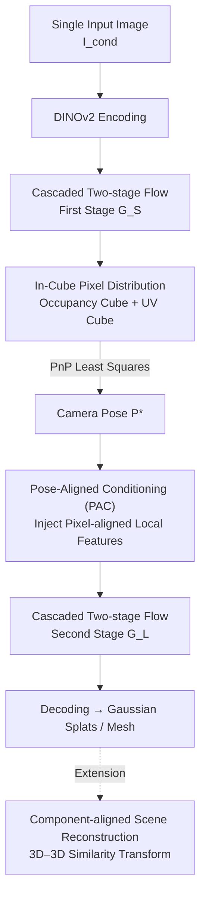

# CUPID: Generative 3D Reconstruction via Joint Object and Pose Modeling

**Conference**: CVPR 2026  
**Paper**: [CVF Open Access](https://openaccess.thecvf.com/content/CVPR2026/html/Huang_CUPID_Generative_3D_Reconstruction_via_Joint_Object_and_Pose_Modeling_CVPR_2026_paper.html)  
**Code**: https://cupid3d.github.io (Project Page)  
**Area**: 3D Vision  
**Keywords**: Single-image 3D reconstruction, Generative reconstruction, Camera pose estimation, Rectified Flow, Pose-aligned conditioning

## TL;DR
CUPID unifies "single-image 3D object reconstruction" and "camera pose estimation" into a two-stage flow generation task. It first jointly generates a canonical-space occupancy cube and a set of dense 3D-2D correspondences (UV cube), from which the camera pose is solved using PnP. Then, this pose is utilized to inject pixel-aligned local features to refine geometry and appearance in the second stage. As a result, it outperforms SOTA methods on single-image reconstruction by 3 dB PSNR and reduces Chamfer Distance (CD) by ~10% (relative to LRM, a 50% reduction on the GSO dataset).

## Background & Motivation

**Background**: Recovering 3D structures from a single 2D image currently follows two distinct pathways. One is **3D generative models** (such as native 3D generators like TRELLIS), which generate high-quality 3D objects $O$ in a canonical, view-independent coordinate system. The other is **3D reconstruction methods** (such as 2D-to-3D lifting like DUSt3R, VGGT, MoGe, and LRM), which produce geometry in a pixel-aligned, view-centric coordinate system.

**Limitations of Prior Work**: Image formation is inherently $I = P(O, \theta)$, where an image is jointly determined by the object $O$ (intrinsic properties like shape and texture) and the camera pose $\theta$ (extrinsic properties). Each pipeline discards one component: generative models **completely neglect the camera pose** $\theta$, yielding 3D structures that look plausible but fail to align with the input view (causing shape and color drift) and require expensive and fragile post-hoc pose optimization to integrate into scenes; reconstruction methods **fix $\theta$ to an identity matrix** (view-centric coordinate system), which prevents them from "imagining" occluded areas, producing incomplete geometry and merging the entire scene into an inseparable mesh under multi-view settings.

**Key Challenge**: In a single image, $O$ and $\theta$ are entangled to determine the pixels, yet existing methods either discard $\theta$ or fix it, essentially evading the decoupling of intrinsic objects from extrinsic views. The absence of camera pose priors is the root bottleneck of the problem.

**Goal**: To **jointly model** the joint distribution $p(O,\theta\mid I_{\text{cond}})$ of $O$ and $\theta$ within a unified framework, learning this joint distribution from massive 2D observations without fixing the pose as identity or predefining how canonical objects are placed.

**Key Insight**: When humans look at an image of a stuffed toy, they simultaneously maintain a "view-independent 3D impression" in their minds and recall "which viewpoint best reproduces this image." The authors formalize this cognitive process into a new task called **Generative 3D Reconstruction**, merging rich generative priors with the geometric fidelity of reconstruction.

**Core Idea**: Using a two-stage flow model to **jointly sample "coarse 3D structure + dense 3D-2D correspondences" and solve for the camera pose via PnP, and then, conditioned on this pose, inject pixel-aligned local features into the generation process** to ensure the generated 3D is both complete and highly faithful to the input image.

## Method

### Overall Architecture
CUPID formulates reconstruction as a conditional sampling problem, estimating the joint posterior $p(O,\theta\mid I_{\text{cond}})$ under the observation constraint $I_{\text{cond}} = P(O,\theta)$. It first maps the object and pose to voxel latent features $z=\phi(O,\theta)$ using an encoder $\phi$ and learns a velocity field $v_\phi$ on $z_t=(1-t)z_0+t\epsilon$ using **Rectified Flow**. The training objective is Conditional Flow Matching:

$$\mathcal{L}_{\mathrm{CFM}}(\phi)=\mathbb{E}_{t,z_0,\epsilon}\left\|v_\phi(z_t,I_{\text{cond}},t)-(\epsilon-z_0)\right\|_2^2.$$

The entire pipeline consists of a two-stage cascaded flow: the **first stage** $G_S$ generates an "occupancy cube + UV cube" from a single image, where the former indicates which voxels in canonical space are activated, and the latter encodes the camera pose into dense 3D-2D pixel coordinate correspondences. A least-squares PnP solver is then used to find the global camera matrix $P^\ast$. The **second stage** $G_L$ leverages this retrieved pose to inject pixel-aligned visual features of the input image into the flow, synthesizing geometry and appearance latent codes $\{f_i\}$ only on the activated voxels, which are finally decoded into 3D Gaussian splats and meshes. The entire process is a feedforward sampling, yielding results in a few seconds.

### Key Designs

**1. In-Cube Pixel Distribution: Reformulating Camera Pose as Dense Correspondences in a 3D Cube to Make It "Digestible" for 3D Generators**

Pose is an outlier for generative 3D models—it could be compressed into a 12-dimensional 1D token, but 3D generators consume 3D tokens, making it very difficult to train with a forced 1D vector. CUPID's approach is to **overparameterize** the pose $\theta$ into dense 3D-2D correspondences: $\theta \triangleq \{x_i, u_i\}_{i=1}^{L}$, where $x_i\in\mathbb{R}^3$ is the coordinate of the $i$-th activated voxel and $u_i:(u_i,v_i)\in[0,1]^2$ represents its normalized pixel coordinates projected onto the image plane, obtained via $u_i=\pi(P,x_i)$. In this way, the pose is mapped into a **UV Cube**—intuitively, $(u,v)$ acts like a "view-dependent color" defined over a 3D occupancy grid. Consequently, "jointly generating object + pose" is equivalent to "generating a 3D object with view-dependent colors", which fits perfectly within the representation space of 3D generators. Given these correspondences, the global camera matrix is solved via least squares:

$$P^{\ast}=\arg\min_{P}\sum_{i=1}^{L}\left\|\pi(P,x_i)-u_i\right\|^2,$$

and then RQ decomposition is applied to $P^\ast$ to extract the intrinsic parameters $K$ and extrinsics $(R,t)$. Compared to encoding poses as 2D rays or point maps (view-centric), this in-cube representation resides in canonical 3D space, naturally sharing the coordinate system with the generated object. The UV cube is also compressed by a 3D VAE into a low-resolution feature grid $S_{uv}$, which is virtually lossless (average RRE/RTE < 0.5°) but computationally more efficient.

**2. Cascaded Two-stage Flow: Determining "Occupancy + Pose" First, Then Growing Geometry and Appearance on the Fixed Scaffold**

Directly generating the full $z=\{(x_i,f_i),(x_i,u_i)\}$ in one go is too heavy. CUPID decomposes this into two steps using a cascaded flow. In the **first stage** $G_S$, given the conditional image $I_{\text{cond}}$, it generates a binary occupancy cube $G_o\in\{0,1\}^{r\times r\times r\times 1}$ and a UV cube $G_{uv}\in[0,1]^{r\times r\times r\times 2}$ at resolution $r$; specifically, this is fine-tuned on top of TRELLIS by concatenating the original geometric feature grid $S_o$ with the compressed $S_{uv}$, adding linear layers at both the input and output of the flow network. After generation, activated voxels are gathered, and PnP is solved to obtain the pose. In the **second stage** $G_L$, conditioned on the occupancy and pose from the first stage, DINO geometry/appearance features $f_i$ are synthesized **only on the activated voxels** to yield the final $z$. This division of labor ("scaffold first, then fill") relieves the second stage of worrying about "where the object is and where the camera is", allowing it to focus entirely on high-fidelity refinement.

**3. Pose-Aligned Conditioning (PAC): Infusing Pixel Local Features Directly Back into Each Voxel Using the Solved Pose, Extinguishing Color/Detail Drift in Generative Models**

The authors observe that the original TRELLIS $G_L$ relies on **global attention** for image conditioning, which often causes color drift and detail loss, as global conditioning cannot inform each 3D voxel "which pixel on the input image you correspond to." The key of PAC is to use the camera pose computed in the first stage to project the $i$-th voxel center onto the image plane to acquire the pixel coordinate $u_i$, and then perform **bilinear interpolation sampling** at this location across two feature pathways: the high-level semantics utilize DINOv2, $f_i^{\text{dino}}=\mathrm{Interp}(u_i,\mathrm{dino}(I))\in\mathbb{R}^{1024}$, compressed into $f_i^{\text{high}}\in\mathbb{R}^{8}$ via a SlatEncoder; since DINO lacks low-level cues, a lightweight convolutional head extracts complementary low-level features $f_i^{\text{low}}$ from $I_{\text{cond}}$, which are sampled at $u_i$ in the same way. Finally, the noisy voxel feature $f_i^t$ at the current timestep is concatenated with these two pixel-aligned features, and integrated into the flow transformer via a linear layer: $l_t=\mathrm{Linear}([f_i^t\oplus f_i^{\text{high}}\oplus f_i^{\text{low}}])$. Notably, the paper **does not explicitly model occlusion** (reasoning that the transformer can implicitly model light transport). Supported by this pose-aligned local conditioning, both geometric accuracy and appearance fidelity are significantly boosted—this represents the core mechanism by which CUPID grafts "rich generative priors" onto "reconstructive geometric fidelity".

**4. Component-aligned Scene Reconstruction: Scaling Single-Object Generation to Multi-Object Scenes Without Post-hoc Optimization via Explicit 3D-2D Correspondences**

Because CUPID explicitly models the spatial relationship of "generated object $\leftrightarrow$ input camera pose", it scales naturally to scene-level reconstruction. The workflow is as follows: first, a segmentation foundation model crops out each object in the scene; for **occluded objects**, an occlusion-aware generator (fine-tuned with random masking on conditional images, inspired by Amodal3R) independently reconstructs them, obtaining dense 3D-2D correspondences for each object. However, since the absolute depths of different objects are inconsistent, direct 3D-2D alignment is ill-posed. Thus, MoGe is employed to predict a global point-map, reducing the problem to 3D-3D alignment: matching pairs $(x_i^k,u_i)$ are collected for the $k$-th object, and the camera-space points $p_i=\mathcal{P}(u_i)$ are queried from the MoGe point-map. Then, the Umeyama method estimates a per-object similarity transform $S_k=(s_k,R_k,t_k)$ to map it back to the shared camera system. This eliminates multi-stage post-hoc alignment pipelines like CAST, completing component alignment in a single feedforward pass; this mechanism can also be extended to multi-view input using VGGT.

### Loss & Training
The core training objective is the aforementioned Conditional Flow Matching loss $\mathcal{L}_{\mathrm{CFM}}$. For both stages of the flow velocity field, it uses Rectified Flow's "data $\leftrightarrow$ noise linear interpolation + velocity regression". The second stage is fine-tuned on pretrained TRELLIS weights, with linear layers added at the input/output ends to inject UV/PAC features; the occlusion-aware generator for scene-level reconstruction is fine-tuned with random masks on conditional images to gain robust occlusion resistance.

## Key Experimental Results

Evaluating three criteria on Toys4K (~3K synthetic objects) and GSO (~1K real objects): monocular geometric accuracy, input-view consistency, and complete 3D fidelity from a single image.

### Main Results

**Monocular Geometric Accuracy (Table 1, excerpt of GSO)**: CUPID leads comprehensively across generative/view-centric reconstruction, approaching point-map regression methods that only produce visible-part geometry.

| Method | Full 3D | GSO CD(avg)↓ | GSO CD(med)↓ | GSO F-score(0.01)↑ |
|------|--------|------|------|------|
| VGGT (using GT mask, potentially overestimated) | × | 1.396 | 0.388 | 65.98 |
| MoGe | × | 1.743 | 0.575 | 58.99 |
| OpenLRM | ✓ | 3.741 | 1.858 | 34.14 |
| OnePoseGen | ✓ | 116.2 | 60.56 | 7.28 |
| **CUPID (Ours)** | ✓ | **1.823** | **0.434** | **61.01** |

On GSO, CD(avg) decreases by approximately 50% relative to LRM; on Toys4K, CD(med) reaches 0.236, significantly outperforming all full 3D methods.

**Input-View Consistency (Table 2)**: Re-rendering reconstruction results back to the input view using estimated poses to compare the discrepancy between the re-render and the input image.

| Dataset | Method | PSNR↑ | SSIM↑ | LPIPS↓ |
|--------|------|-------|-------|--------|
| Toys4K | LaRa | 22.00 | 93.42 | 0.0884 |
| Toys4K | OpenLRM | 26.41 | 80.17 | 0.1156 |
| Toys4K | OnePoseGen | 17.43 | 89.37 | 0.1174 |
| Toys4K | **CUPID** | **30.05** | **96.81** | **0.0251** |
| GSO | **CUPID** | **28.68** | **95.49** | **0.0354** |

PSNR is ~3.6 dB higher than the second-best OpenLRM, and LPIPS drops to about 1/4, demonstrating the texture and shape consistency brought by the "pose alignment + local conditioning". **Full 3D quality** is measured using CLIP scores of novel views (Table 3); CUPID achieves 0.9501 on ViT-B/16 and 0.9291 on ViT-L/14, consistently outperforming all baselines such as TRELLIS (0.9465/0.9210).

### Ablation Study

Performance of PAC (Pose-Aligned Conditioning) variants on Toys4K, reporting results under two setups: "using GT geometry + pose" and "using geometry + pose sampled from the first stage" (PSNR/SSIM/LPIPS):

| Configuration | Sampled Setup PSNR | Sampled Setup LPIPS | Description |
|------|------|------|------|
| (a) Baseline (w/o PAC, TRELLIS global conditioning) | 27.47 | 0.0327 | Starting point |
| (b) Position Embedding (adding DINOv2 positional embedding) | 27.56 | 0.0323 | Slight improvement |
| (c) Latent (w/o Occ., concatenating view-conditioned voxel latents) | 27.85 | 0.0309 | Verifies that pose alignment is useful |
| (d) Latent (Occ., occluded voxel latents set to zero) | 27.74 | 0.0313 | Performance is almost identical with or without explicit occlusion handling |
| (e) Latent (+ convolutional low-level visual features) = **Full** | **30.05** | **0.0251** | Supplements low-level cues, optimal |

### Key Findings
- **PAC is the primary driver of performance gains**: Moving from (a) global conditioning to (e) full PAC, PSNR in the sampled setup increases from 27.47 to 30.05 (+2.58 dB), indicating that 'infusing pixel local features back into voxels based on poses' is far more effective than global image conditioning.
- **Low-level features are indispensable**: The transition from (c) to (e) yields the largest jump. DINOv2 captures high-level semantics but discards low-level texture/geometric cues; supplementing a convolutional low-level feature pathway allows color and details to align properly.
- **Robust to sampling perturbations**: Even when employing geometry and poses randomly sampled from the first stage (rather than GT), (e) still achieves 30.05 PSNR, significantly higher than the baseline's 27.47. This proves that pose-aligned conditioning is insensitive to generative noise.
- **Occlusion modeling can be implicit**: Explicitly zeroing out occluded voxels (d) yields nearly identical scores to omitting occlusion handling, supporting the authors' hypothesis that 'transformers can implicitly model light transport without explicit occlusion modeling'.

## Highlights & Insights
- **Disguising "Pose Estimation" as a "Generative Task"**: The UV cube is the most clever design—instead of attaching an external pose regression head to the 3D generator, it reformulates the pose as 'view-dependent colors on a 3D cube'. This allows the pose and object to share the same 3D token representation, enabling the joint distribution to be processed entirely by a single flow. This philosophy of 'unifying heterogeneous properties into the generator's native representation' can be transferred to any task where a generative model is expected to predict global variables (such as illumination, materials, or joint angles).
- **The causal order of "solving pose first, then conditioning on pose" is critical**: Many methods decouple generation and pose alignment, using post-hoc optimization instead (e.g., OnePoseGen, CAST), which is slow and fragile; CUPID treats the pose as a **conditional input** for the second stage rather than a post-processing step, achieving alignment in a single feedforward pass.
- **Dual pixel-aligned feature pathways (DINO high-level + convolutional low-level) is a highly reusable trick**: In any scenario where foundation model semantic features are utilized for dense prediction but yield blurry details/textures, supplementing a lightweight low-level feature pathway often brings immediate improvements.

## Limitations & Future Work
- **Dependency on object masks**: Similar to existing 3D generative methods, object masks are required. Boundary inaccuracies in real-world images can impair reconstruction quality.
- **Baked-in illumination**: Lacking material-lighting decoupling, the appearance is entangled with illumination, causing artifacts when lighting conditions change.
- **Centering bias in training data**: Most synthetic training images feature centered objects, making off-center objects in real-world scenes harder to handle (though the authors note this is non-fundamental and can be mitigated with better data/supervision).
- **Challenges in multi-view fusion**: In multi-view scenarios, fusion is based on sharing object latent codes (similar to MultiDiffusion), but the 3D orientation misalignments between different views demand more advanced fusion schemes—this represents the next step toward developing an 'SfM-like system'.

## Related Work & Insights
- **vs Point-map Regression (VGGT / MoGe / DUSt3R)**: These perform 2D-to-3D lifting in a view-centric manner, fixing the camera to an identity constant. Thus, they can only reconstruct visible regions and lack generative capabilities to complete occlusions. In contrast, CUPID jointly models objects and poses in a canonical space, allowing it to "imagine" occluded areas, output complete/segmentable geometries, and match their monocular accuracy.
- **vs View-centric Large Reconstruction Models (LRM / LaRa)**: LRM directly regresses 3D in the view space (assuming fixed camera intrinsics, making it hard to adapt to real-world unknown intrinsics), while LaRa relies on Zero123++ to generate novel views but is easily dragged down by 2D diffusion inconsistencies. CUPID explicitly models camera poses, achieving a 50% CD reduction and 3+ dB PSNR gain over LRM on the GSO dataset.
- **vs Generative Priors + Post-hoc Alignment (OnePoseGen / CAST)**: These generate canonical 3Ds using models like TRELLIS and then perform costly, fragile post-hoc pose alignment using FoundationPose or 3D-3D correspondences, which often fail on geometrically symmetric or textureless objects. CUPID internalizes pose alignment within the generative process to complete it in a single feedforward pass, offering better robustness on symmetric objects.

## Rating
- Novelty: ⭐⭐⭐⭐⭐ Unifying single-image reconstruction and pose estimation into a generative task, the UV cube pose representation and deep pose-aligned conditioning are genuinely original mechanisms.
- Experimental Thoroughness: ⭐⭐⭐⭐ Extensive evaluations on three tasks across two datasets with comprehensive PAC ablation. However, lacks wider comparisons with top 3D generators regarding full 3D quality (omitted by authors as orthogonal to their core objectives).
- Writing Quality: ⭐⭐⭐⭐⭐ Starting from the image formation equation $I=P(O,\theta)$ to justify the joint modeling, the bridge between motivation and methodology is exceptionally clear.
- Value: ⭐⭐⭐⭐⭐ Establishes a new paradigm for "generative 3D reconstruction", holding direct value for embodied AI, scene reconstruction, and mixed reality.

<!-- RELATED:START -->

## Related Papers

- [\[CVPR 2026\] Affostruction: 3D Affordance Grounding with Generative Reconstruction](affostruction_3d_affordance_grounding_with_generative_reconstruction.md)
- [\[CVPR 2026\] RT-Splatting: Joint Reflection-Transmission Modeling with Gaussian Splatting](rt-splatting_joint_reflection-transmission_modeling_with_gaussian_splatting.md)
- [\[CVPR 2026\] NeuROK: Generative 4D Neural Object Kinematics](neurok_generative_4d_neural_object_kinematics.md)
- [\[CVPR 2026\] Exploring 6D Object Pose Estimation with Deformation](exploring_6d_object_pose_estimation_with_deformation.md)
- [\[CVPR 2026\] TokenSplat: Token-aligned 3D Gaussian Splatting for Feed-forward Pose-free Reconstruction](tokensplat_token-aligned_3d_gaussian_splatting_for_feed-forward_pose-free_recons.md)

<!-- RELATED:END -->
