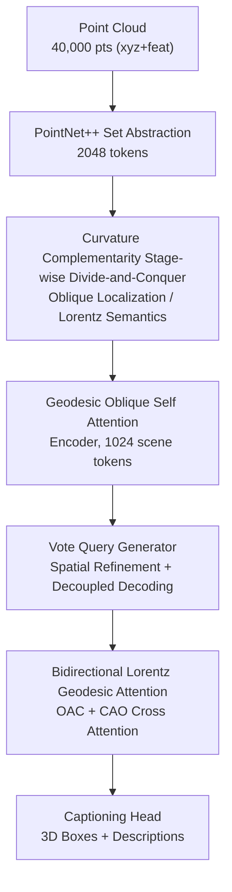

# Curvature-Aware Captioning: Leveraging Geodesic Attention for 3D Scene Understanding

**Conference**: CVPR 2026  
**Paper**: [CVF Open Access](https://openaccess.thecvf.com/content/CVPR2026/html/He_Curvature-Aware_Captioning_Leveraging_Geodesic_Attention_for_3D_Scene_Understanding_CVPR_2026_paper.html)  
**Code**: None  
**Area**: 3D Vision  
**Keywords**: 3D Dense Captioning, Geodesic Attention, Oblique Manifold, Lorentz Hyperbolic Space, Non-Euclidean Geometry  

## TL;DR
To address the conflicting geometric space requirements of "precise localization" and "hierarchical semantics" in 3D dense captioning, this paper introduces a multi-stage non-Euclidean geodesic attention mechanism. The encoder performs localization on the Oblique manifold, while the decoder constructs semantic hierarchies in Lorentz hyperbolic space, upgrading the Vote2Cap-DETR++ framework to the CAC framework. It achieves new SOTA CIDEr@0.5 results on ScanRefer and Nr3D.

## Background & Motivation
**Background**: 3D dense captioning aims to simultaneously perform two tasks in point cloud scenes: bounding every object (localization) and generating a sentence describing its attributes and spatial relationships (description). The mainstream has shifted from early serial "detect-then-describe" pipelines (prone to error accumulation) to end-to-end set prediction frameworks, represented by transformer-based methods like Vote2Cap-DETR++ and BiCA, which align visual cues and linguistic context through unified attention mechanisms.

**Limitations of Prior Work**: These methods, whether constructing local object features or global scene context, operate entirely within **Euclidean embedding spaces**. However, the authors argue that the geometric "preferences" of localization and semantics are inherently conflicting: local object cues (e.g., surface geometry) naturally require a **flat Euclidean metric** to preserve fine-grained details, whereas the semantic distances of global context (e.g., hierarchies like "table—chair—room") grow **exponentially**, naturally fitting **negative-curvature hyperbolic spaces**. Forcing both requirements into a single Euclidean space results in either inaccurate localization or fragmented, superficial descriptions.

**Key Challenge**: Compressing "localization requiring flat metrics" and "semantics requiring hyperbolic hierarchies" into the same Euclidean space is fundamentally a **Euclidean–hyperbolic conflict**. Euclidean space cannot represent exponential semantic hierarchies, while forcibly using hyperbolic space disrupts the isotropic optimization stability required for bounding box regression.

**Key Insight**: Instead of compromising within a single space, it is better to **allocate geometric spaces by task stage**. The authors observe that two types of non-Euclidean manifolds are complementary: the Oblique manifold (column vectors constrained to unit norm $\|W_{:,i}\|_2=1$) can reshape elongated feature contours into nearly spherical isotropic geometries, making gradient descent paths near-linear and stabilizing box regression. Conversely, the Lorentz hyperboloid naturally encodes exponentially growing hierarchical relationships using constant negative curvature.

**Core Idea**: **Stage-wise Manifold Projection**. The encoding/localization stage places attention on the Oblique manifold to ensure optimization stability, while the decoding/description stage extends bidirectional contextual attention to Lorentz hyperbolic space to model hierarchical semantics. This "curvature complementarity" resolves the localization-semantic conflict.

## Method

### Overall Architecture
CAC implements geometric upgrades on the decoupled "localization-description" skeleton of Vote2Cap-DETR++. The input is a point cloud of 40,000 points (including xyz coordinates + F-dimensional features), and the output is a 3D bounding box plus a description for each object. The pipeline maintains the core skeleton but replaces the geometric spaces of attention in two places: the encoder self-attention moves to the Oblique manifold (managing localization stability), and the decoder bidirectional cross-attention moves to Lorentz hyperbolic space (managing semantic hierarchy). The intermediate Vote Query generator follows Vote2Cap-DETR++.

Specific data flow: The point cloud is tokenized via PointNet++ set-abstraction layers into 2,048 tokens (coordinates $p_{abs}\in\mathbb{R}^{2048\times3}$, features $f_{abs}\in\mathbb{R}^{2048\times256}$), then fed into the **geometry-enhanced 3DETR encoder** (replacing self-attention with Geodesic Oblique Self Attention), downsampled to 1,024 scene tokens. The Vote Query generator refines scene tokens into vote queries. Dual decoders produce instance and context features, performing bidirectional cross-attention in Lorentz space (OAC and CAO modules). Finally, the instance/OAC/CAO features are concatenated and fed into the captioning head.

### Key Designs

**1. Stage-wise Curvature Complementarity: Allocating Localization and Semantics to Respective Geometric Spaces**

This serves as the overall guideline, directly addressing the core challenge that Euclidean space cannot accommodate two conflicting needs. Instead of a compromise in a single space, the authors split the pipeline into two manifolds. The encoding/localization stage uses the Oblique manifold (positive curvature, isotropic), where unit-norm column constraints reshape feature geometry into near-spherical forms, making optimization paths near-linear and stabilizing regression. The decoding/description stage uses the Lorentz hyperboloid (curvature $-c$), whose exponential volume growth matches the exponential distance of semantic hierarchies. The paper theoretically demonstrates their "curvature complementarity"—one handles isotropic optimization stability and the other preserves hierarchical relationships, together covering the blind spots of both Euclidean and hyperbolic spaces.

**2. Geodesic Oblique Self Attention: Replacing Dot Product with Geodesic Distance for Stable Encoding**

To address large directional bias and unstable optimization in sparse point clouds using Euclidean self-attention, this design moves the 3DETR encoder self-attention to the Oblique manifold. Embedding features $Q,K,V\in\mathbb{R}^{2048\times256}$ are projected to the manifold via column unit-norm projection $\bar P=\mathrm{Cat}(p_i/\|p_i\|)$. Attention weights use **geodesic distance** on the manifold:

$$\mathrm{dist}(Q,K)=\sqrt{\sum_{i=1}^{n}\arccos^2\big((\mathrm{diag}(Q^\top K))_i\big)}$$

This yields a pairwise distance matrix $D\in\mathbb{R}^{2048\times2048}$, followed by aggregation via $\hat v=\mathrm{softmax}(-D)\,V$. To prevent divergence of $\arccos$ at boundaries, inputs are clipped to $[-1+\epsilon,1-\epsilon]$ ($\epsilon=10^{-4}$). The value lies in the Oblique manifold's isotropy, which converts "elongated feature contours" into near-spherical forms, making gradient descent near-linear and improving localization accuracy.

**3. Bidirectional Lorentz Geodesic Attention: Modeling Object-Context Hierarchies in Hyperbolic Space**

Addressing the inability of Euclidean space to represent exponential semantic hierarchies, this design extends decoder bidirectional cross-attention to Lorentz hyperbolic space. Features are projected from the tangent space at the origin to the hyperboloid via exponential mapping: $x_{space}=\frac{\sinh(\sqrt c\|u\|)}{\sqrt c\|u\|}u$. Attention weights use hyperbolic geodesic distance:

$$G_{H_L}(x,y)=\frac{1}{\sqrt c}\cosh^{-1}\big(-c\langle x,y\rangle_L\big)$$

where $\langle x,y\rangle_L=x_{space}\cdot y_{space}-x_{time}\cdot y_{time}$ is the Lorentzian inner product. After computing distance $D$, temperature-scaled softmax $A=\mathrm{softmax}(\exp(-D/\tau))$ is used for aggregation, followed by a log mapping back to Euclidean space. Inputs are clipped to $[1+\epsilon,\infty)$ ($\epsilon=10^{-15}$) for $\cosh^{-1}$ stability. This is **bidirectional**: Object-aware Context (OAC) uses instance features as Q and context features as K/V; Context-aware Object (CAO) uses context as Q and instance as K/V. Hyperbolic geometry allows natural encoding of exponential distances like "table $\supset$ chair $\supset$ room."

### Loss & Training
The framework adopts the decoupled "localization-description" paradigm of Vote2Cap-DETR++. The objective function consists of four weighted parts: $L_{vq}$ supervises point offsets to object centers; $L_{set}$ (including 3D GIoU, classification, center/size regression with weights $\alpha_1{=}10,\alpha_2{=}1,\alpha_3{=}5,\alpha_4{=}1$) refines proposals via Hungarian matching; $L_{cap}$ trains captions using joint MLE+SCST; $L_{qr}$ iteratively refines query localization across decoder layers. Total loss is $L_{V2}=\beta_1 L_{vq}+\beta_2\sum_i L_{set}+\beta_3 L_{cap}+\beta_4\sum_{i\in\delta}L_{qr}$ ($\beta_1{=}\beta_4{=}10,\beta_2{=}1,\beta_3{=}5$). Training follows three stages: pre-training on ScanNet (1080 epochs, excluding captioning) → joint training on ScanRefer/Nr3D (720 epochs, MLE) → SCST fine-tuning (180 epochs, frozen detector).

## Key Experimental Results

### Main Results
ScanRefer validation set (IoU=0.5, C=CIDEr, B-4=BLEU-4, M=METEOR, R=ROUGE-L). CAC(O) uses Oblique encoding only; CAC(O&H) uses both spaces:

| Method | Supervision | C@0.5 ↑ | B-4@0.5 | M@0.5 | R@0.5 |
|------|------|---------|---------|-------|-------|
| Vote2Cap-DETR | MLE | 61.81 | 34.46 | 26.22 | 54.40 |
| Vote2Cap-DETR++ | MLE | 67.58 | 37.05 | 26.89 | 55.64 |
| **CAC(O&H)** | MLE | **69.92** | 37.67 | 26.89 | 55.62 |
| Vote2Cap-DETR++ | SCST | 78.16 | 39.72 | 26.94 | 55.52 |
| **CAC(O&H)** | SCST | **80.35** | 39.95 | 26.94 | 55.66 |

Nr3D validation set (IoU=0.5):

| Method | Supervision | C@0.5 ↑ | B-4@0.5 | M@0.5 | R@0.5 |
|------|------|---------|---------|-------|-------|
| Vote2Cap-DETR++ | MLE | 47.08 | 27.70 | 25.44 | 55.22 |
| **CAC(O)** | MLE | **50.99** | 28.89 | 26.41 | 56.18 |
| Vote2Cap-DETR++ | SCST | 47.62 | 28.41 | 25.63 | 54.77 |
| **CAC(O&H)** | SCST | **52.78** | 29.78 | 26.13 | 55.94 |

### Ablation Study
Comparison with BiCA under identical conditions (IoU=0.5):

| Configuration | Supervision | C@0.5 ↑ | Description |
|------|------|---------|------|
| BiCA$^R$ | MLE | 65.22 | Reproduced Baseline |
| Vote2Cap-DETR++$^R$ | MLE | 66.06 | Reproduced Baseline |
| CAC(O)$_{BiCA}$ | MLE | 67.07 | Using BiCA query generation |
| CAC(O) | MLE | 68.07 | Oblique encoding only |
| **CAC(O&H)** | MLE | **69.92** | Adding Lorentz decoding |
| CAC(O) | SCST | 79.09 | Oblique only |
| **CAC(O&H)** | SCST | **80.35** | Full model |

### Key Findings
- **Dual-space complementarity is the primary gain**: Moving from CAC(O) to CAC(O&H) increases CIDEr@0.5 from 68.07 to 69.92 under MLE, and 79.09 to 80.35 under SCST. Hyperbolic components consistently provide ~1.3–1.9 point improvements and faster convergence.
- **Improved query configuration**: CAC(O) (68.07) outperforms CAC(O)$_{BiCA}$ (67.07), suggesting that the OAC/CAO bidirectional Q/K/V configuration is more effective than BiCA’s independent query generation.
- **Robustness**: Tested across multiple seeds (0/333/777) on Nr3D, CAC(O&H)+SCST yields extremely tight confidence intervals (e.g., 51.18%±0.09% C@0.5), indicating low variance.

## Highlights & Insights
- **Geometric space as an allocatable resource**: Instead of compromising in one space, assigning localization to Oblique and semantics to Lorentz is an intuitive "curvature complementarity" approach that can be transferred to other tasks with "local precision vs. global hierarchy" needs.
- **Geodesic distance as attention similarity**: Replacing dot products with $\mathrm{softmax}(-D)$ directly injects geometric priors into the attention mechanism with minimal structural changes.
- **Numerical stability implementation**: Crucial tricks like boundary clipping for $\arccos$ and $\cosh^{-1}$ and mapping through the origin for hyperbolic operations enable hyperbolic deep learning to perform reliably.

## Limitations & Future Work
- **Incremental improvements on non-CIDEr metrics**: While CIDEr improves by 2–5 points, BLEU-4, METEOR, and ROUGE-L often remain similar to or only slightly better than Vote2Cap-DETR++. 
- **Backbone dependency**: The experiments are heavily tied to the Vote2Cap-DETR++ architecture.
- **Sensitivity to hyperparameters**: The choice of curvature $c$ and temperature $\tau$ is not fully explored in the main text; hyperbolic methods are traditionally sensitive to these.
- **Future Direction**: Moving from fixed stage-wise manifolds to adaptive, learnable soft-mixture of spaces.

## Related Work & Insights
- **vs. Vote2Cap-DETR++**: This work uses it as a skeleton, adding Oblique/Lorentz attention. It improves localization stability and semantic modeling, though gains are concentrated in CIDEr.
- **vs. BiCA**: BiCA also performs bidirectional attention but in Euclidean space with independent queries; CAC uses hyperbolic bidirectional attention and a different Q/K/V configuration.
- **vs. Hyperbolic Point Cloud Methods**: Unlike works using a single hyperbolic space for classification or matching, this paper utilizes **dual non-Euclidean manifolds** (Oblique + Lorentz) to resolve task-specific stage conflicts.

## Rating
- Novelty: ⭐⭐⭐⭐ Split-stage manifold learning with geodesic attention is a clear and novel geometric perspective.
- Experimental Thoroughness: ⭐⭐⭐⭐ Two datasets + multiple seeds + BiCA baseline comparison, though sensitivity analysis is limited.
- Writing Quality: ⭐⭐⭐ Geometric motivation and formulas are clear, but some descriptions are dense.
- Value: ⭐⭐⭐⭐ Provides a transferable "stage-wise manifold learning" paradigm for 3D vision-language tasks.

<!-- RELATED:START -->

## Related Papers

- [\[CVPR 2026\] 3D-Aware Multi-Task Learning with Cross-View Correlations for Dense Scene Understanding](3d-aware_multi-task_learning_with_cross-view_correlations_for_dense_scene_unders.md)
- [\[CVPR 2026\] Cov2Pose: Leveraging Spatial Covariance for Direct Manifold-aware 6-DoF Object Pose Estimation](cov2pose_leveraging_spatial_covariance_for_direct_manifold-aware_6-dof_object_po.md)
- [\[CVPR 2026\] Consistent Instance Field for Dynamic Scene Understanding](consistent_instance_field_for_dynamic_scene_understanding.md)
- [\[CVPR 2026\] LightSplat: Fast and Memory-Efficient Open-Vocabulary 3D Scene Understanding in Five Seconds](lightsplat_fast_and_memory-efficient_open-vocabulary_3d_scene_understanding_in_f.md)
- [\[CVPR 2026\] EmbodiedSplat: Online Feed-Forward Semantic 3DGS for Open-Vocabulary 3D Scene Understanding](embodiedsplat_online_feed-forward_semantic_3dgs_for_open-vocabulary_3d_scene_und.md)

<!-- RELATED:END -->
