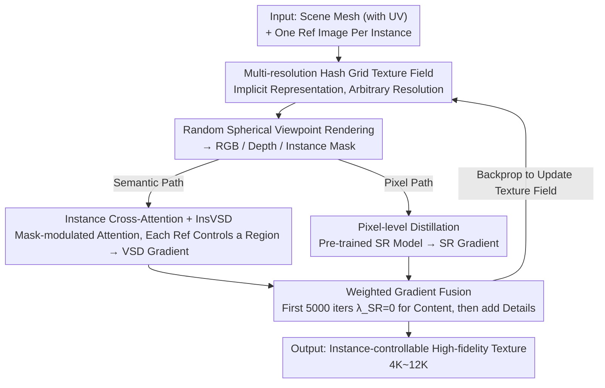

# CustomTex: High-fidelity Indoor Scene Texturing via Multi-Reference Customization

**Conference**: CVPR 2026  
**arXiv**: [2603.19121](https://arxiv.org/abs/2603.19121)  
**Code**: [https://chenweilinx.github.io/CustomTex/](https://chenweilinx.github.io/CustomTex/)  
**Area**: 3D Vision  
**Keywords**: Indoor Scene Texturing, Multi-Reference Customization, Dual-Distillation, VSD Optimization, Instance-level Control

## TL;DR
The CustomTex framework is proposed, which implements high-fidelity, instance-controllable texture generation for 3D indoor scenes through instance-level multi-reference driving and a dual-distillation training strategy (semantic-level VSD distillation + pixel-level super-resolution distillation). It significantly outperforms existing methods in semantic consistency, texture clarity, and the reduction of "baked-in shading."

## Background & Motivation
Creating realistic 3D indoor scene textures is a cornerstone for VR/AR, architectural visualization, and film production. **Limitations of Prior Work**: (1) **Text-driven methods** (SceneTex, TEXture, etc.) suffer from semantic ambiguity and cannot convey precise visual features (e.g., fabric textures, wood grains, wallpaper patterns); (2) Even driving with a single reference image only provides global coarse-grained control; (3) Insufficient texture quality—blurriness, numerous artifacts, and diffusion models learning lighting information from training data to produce "baked-in shading," which is unsuitable for rendering under different lighting conditions.

**Key Challenge**: The coupling of semantic control and pixel quality during the diffusion process—while InstanceTex supports multi-text instance-level control, it remains limited by text precision and quality. **Key Insight**: Replace text with multiple reference images (one per instance) and decouple "semantic generation" and "pixel enhancement" into two independent distillation processes unified under the VSD framework.

## Method

### Overall Architecture
CustomTex aims to solve the problem of "how to make each piece of furniture look like a user-specified reference image while keeping it clean, clear, and free of baked-in shading for a given untextured indoor scene." It does not directly predict texture pixels but instead "sculpts" an implicit texture field within a VSD (Variational Score Distillation) optimization loop. The inputs are a scene mesh with UV unwrapping and one reference image for each instance. In each iteration, the current texture field is first rendered into RGB, depth, and instance masks from a random spherical viewpoint. Then, two distillation paths calculate gradients: the semantic path uses a depth-to-image diffusion model combined with Instance Cross-Attention and LoRA to provide VSD gradients, managing "whether the output matches the reference content"; the pixel path uses a pre-trained super-resolution model to provide SR gradients, managing "whether the output is clear enough." Finally, the two gradients are weighted and merged to update the implicit texture field via backpropagation. This process treats "what to generate" and "how well to generate" as two independent signal sources.

### Key Designs

**1. Instance Cross-Attention + InsVSD: Aligning Each Instance to Its Specific Reference**

Traditional text-driven methods cannot describe fine visual features like fabric or wood grain, and a single global reference image only affects the scene coarsely. CustomTex uses one reference image per instance and manages them region-by-region at the attention level. Specifically, IP-Adapter extracts features $f^{ref}_i$ from the $i$-th reference image, and the instance rendering mask $m_i$ modulates cross-attention at the feature level, aggregating contributions from different references by area:

$$Z' = \frac{1}{N}\sum_{i=1}^N m_i \cdot \text{Softmax}\left(\frac{\mathbf{Q}\mathbf{K}_i^\top}{\sqrt{d_k}}\right)\mathbf{V}_i$$

Thus, information from the $i$-th reference image only flows to pixels belonging to the $i$-th instance, avoiding "bleeding" between references. The texture field update follows the alternating optimization of VSD: first freeze LoRA and use the VSD gradient $\nabla_\theta\mathcal{L}_{\text{VSD}} = \mathbb{E}[\omega(t)(\epsilon_{\phi_d} - \epsilon_{\phi_{\text{LoRA}}})\frac{\partial\mathcal{T}}{\partial\theta}]$ to update texture parameters $\theta$, then freeze $\theta$ and update LoRA $\phi$ to fit the current rendering distribution. A key choice here is where to apply the mask—the authors place it at the feature level rather than the noise level. Ablations show the former provides significantly more stable lighting at object boundaries because feature-level modulation precisely anchors reference features to corresponding instance regions.

**2. Pixel-level Distillation: Integrating SR as a Gradient Signal**

Semantic alignment alone is insufficient—textures from VSD tend to be blurry and lack high-frequency details. A naive approach would be post-processing SR (post-SR) after optimization, but UV textures arranged by UV unwrapping lack the semantic structure of natural images, causing SR models to fail on raw UV maps. CustomTex connects a pre-trained SR model $\phi_{SR}$ into the distillation loop, calculating an SR gradient on natural view renderings in each round:

$$\nabla_\theta\mathcal{L}_{\text{SR}} = \mathbb{E}[\omega(t)(\epsilon_{\phi_{SR}} - \epsilon_{\phi_{\text{LoRA}}})\frac{\partial\mathcal{T}}{\partial\theta}]$$

This is combined with the semantic gradient: $\nabla_\theta\mathcal{L} = \nabla_\theta\mathcal{L}_{\text{VSD}} + \lambda_{SR}\nabla_\theta\mathcal{L}_{\text{SR}}$. To prevent sharpness signals from interfering with early content shaping, training is divided into two stages: the first 5000 iterations use $\lambda_{SR}=0$ for semantic distillation to establish content, followed by $\lambda_{SR}=1.2$ for pixel enhancement. Since the SR gradient acts on natural renderings and backpropagates to the texture field, it bypasses the issue of direct UV map super-resolution. Ablations show integrated SR achieves a much higher IQA (4.469) than post-SR (2.959).

**3. Multi-resolution Hash Grid Texture Representation: Efficiency and Arbitrary Resolution**

Using fixed-resolution texture maps limits flexibility and slows optimization. CustomTex adopts the multi-resolution hash grid from Instant-NGP as an implicit representation. UV coordinates query grids at multiple scales, features are extracted via hash mapping and concatenated, then passed through a Cross-Attention decoder to output RGB. As a continuous field, the resolution can be specified at inference time (4K textures in ~2.4s, 12K in ~22s), offering more flexibility and faster optimization than fixed maps.

### Loss & Training
The final update is a weighted fusion of semantic VSD and pixel SR gradients. Texture field $\theta$ and LoRA $\phi$ are optimized alternately. Timestep annealing is used: $t\sim U(0.02,0.98)$ for the first 5000 iterations to shape the global structure, then narrowed to $t\sim U(0.02,0.5)$ for refining details. The process involves 30,000 iterations and 5,000 spherical distribution viewpoints. Learning rates are 0.001 for the texture field and 0.0001 for LoRA, taking approximately 48 hours on a single RTX A800.

## Key Experimental Results

### Main Results
Image-to-Texture (10 3D-FRONT scenes):

| Method | CLIP-I↑ | CLIP-FID↓ | Q-Align IQA↑ | Q-Align IAA↑ |
|------|---------|-----------|-------------|-------------|
| **Ours** | **0.797** | **106.229** | **4.469** | **3.629** |
| SceneTex-IPA | 0.741 | 121.118 | 4.009 | 3.594 |
| Paint3D | 0.694 | 130.138 | 2.896 | 2.401 |
| HY3D-2.1 | 0.682 | 134.680 | 2.187 | 1.838 |

Text-to-Texture:

| Method | CLIP-T↑ | IS↑ | Q-Align IQA↑ |
|------|---------|-----|-------------|
| **Ours** | **0.766** | **3.311** | **4.252** |
| SceneTex | 0.639 | 3.009 | 3.824 |
| HY3D-2.1 | 0.734 | 2.381 | 2.774 |

### Ablation Study

| Configuration | CLIP-I↑ | CLIP-FID↓ | Q-Align IQA↑ | Description |
|------|---------|-----------|-------------|------|
| post-SR | 0.746 | 114.612 | 2.959 | Poor post-processing quality |
| w/o $\mathcal{L}_{SR}$ | 0.736 | 118.247 | 3.330 | Lacks high-frequency details |
| w/o multi-ref | 0.757 | 109.243 | 4.053 | Lower consistency + baked shading |
| w/o f-mask | 0.743 | 111.205 | 3.689 | Unstable lighting at boundaries |
| **Full model** | **0.797** | **106.229** | **4.469** | Optimal |

### Key Findings
- **Integrated SR Distillation >> Post-SR**: The IQA for post-SR is only 2.959 vs. 4.469 for the full model.
- Feature-level masks provide more stable lighting than noise-level masks.
- Multi-reference input is critical: stitching reference images leads to a failure in distinguishing instances.
- Decomposing global generation into local generation via instance masks is the **key to reducing baked-in shading**.
- User studies (60 participants) rated the method highest in visual quality and consistency.

## Highlights & Insights
- **"Dual-distillation" Decoupling Paradigm**: Semantic distillation handles "what to generate," while pixel distillation handles "how well to house it."
- **Instance Cross-Attention for Precise Alignment**: Mask-modulated attention achieves accurate mapping from reference images to instance regions.
- **Deep Insight into Reducing Baked-in Shading**: Using instance masks to decompose global generation prevents the diffusion model from forming unified lighting across the image.
- Supports both photorealistic and artistic styles (e.g., Van Gogh, Cyberpunk).
- Efficient inference: 4K textures generated in 2.4 seconds.

## Limitations & Future Work
- Training time remains long (48 hours on a single GPU).
- Currently generates only diffuse albedo textures, excluding PBR maps (normal/roughness/metallic).
- Highly dependent on high-quality UV unwrapping.
- Future Work: Accelerating training and extending to full PBR material generation.

## Related Work & Insights
- The dual-distillation paradigm can be generalized to other 3D generation tasks requiring simultaneous semantic accuracy and visual quality.
- The design of Instance Cross-Attention is applicable to other multi-instance or region-conditional generation tasks.
- The conclusion regarding "SR Integrated in Distillation vs. Post-processing" provides a valuable reference for the SDS/VSD community.
- The text→image→texture pipeline using GPT-4v for reference generation offers a new interaction paradigm.

## Rating
- Novelty: ⭐⭐⭐⭐ The combination of dual-distillation and Instance Cross-Attention is innovative.
- Experimental Thoroughness: ⭐⭐⭐⭐⭐ Quantitative + Qualitative + User Study + 5 Ablations + Comparison with closed-source methods.
- Writing Quality: ⭐⭐⭐⭐ Clear structure, deep ablation analysis, and rich visualizations.
- Value: ⭐⭐⭐⭐ Sets a new baseline for instance-level scene texture customization with high practicality.

<!-- RELATED:START -->

## Related Papers

- [\[CVPR 2026\] UniTEX: Universal High Fidelity Generative Texturing for 3D Shapes](unitex_universal_high_fidelity_generative_texturing_for_3d_shapes.md)
- [\[CVPR 2026\] Catalyst4D: High-Fidelity 3D-to-4D Scene Editing via Dynamic Propagation](catalyst4d_highfidelity_3dto4d_scene_editing_via_d.md)
- [\[CVPR 2026\] Skullptor: High Fidelity 3D Head Reconstruction in Seconds with Multi-View Normal Prediction](skullptor_high_fidelity_3d_head_reconstruction_in_seconds_with_multi-view_normal.md)
- [\[CVPR 2026\] HyperGaussians: High-Dimensional Gaussian Splatting for High-Fidelity Animatable Face Avatars](hypergaussians_high-dimensional_gaussian_splatting_for_high-fidelity_animatable_.md)
- [\[CVPR 2026\] RISE: Single Static Radar-based Indoor Scene Understanding](rise_single_static_radar-based_indoor_scene_understanding.md)

<!-- RELATED:END -->
