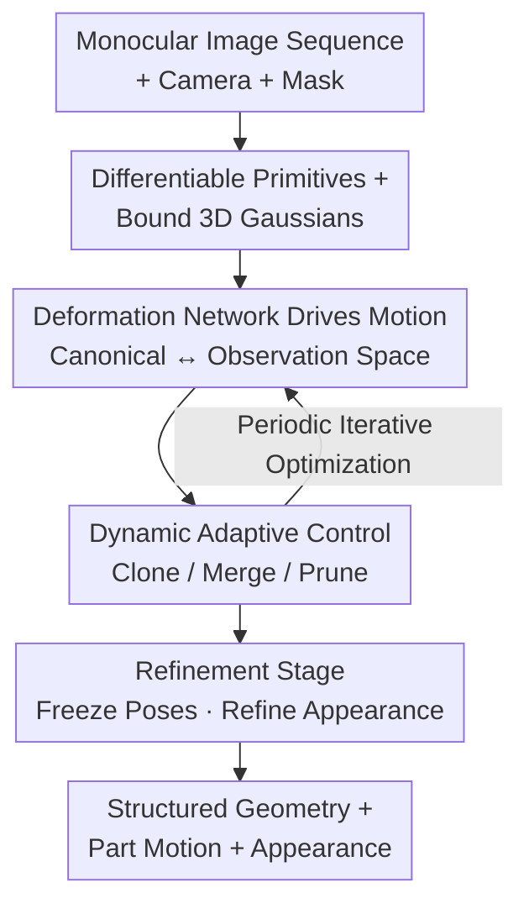

# D-Prism: Differentiable Primitives for Structured Dynamic Modeling

**Conference**: CVPR 2026  
**arXiv**: [2604.17082](https://arxiv.org/abs/2604.17082)  
**Code**: https://zju3dv.github.io/d-prism/ (Project Page)  
**Area**: 3D Vision / Dynamic Reconstruction  
**Keywords**: Geometric Primitives, Dynamic Reconstruction, Monocular Video, Structured Modeling, 3D Gaussian

## TL;DR
D-Prism extends differentiable geometric primitives (superquadrics) from static scenes to the dynamic domain. It utilizes a deformation network to drive rigid primitive motions, binds 3D Gaussians to each primitive to supplement appearance, and incorporates a "clone/merge/prune" dynamic adaptive control system. This enables the simultaneous reconstruction of structured geometry with **part decomposition** and precise part motion from monocular videos.

## Background & Motivation
**Background**: For dynamic reconstruction from monocular video, mainstream approaches typically follow either the NVS route (NeRF / 4D Voxels / Deformable 3DGS), which focuses only on novel view synthesis without providing explicit geometry, or the dynamic mesh route (e.g., DG-Mesh, Ub4D), which learns the entire dynamic object as a **single continuous global mesh**.

**Limitations of Prior Work**: Global mesh representations have two fundamental flaws. First, they lack **intrinsic part decomposition**—treating multi-part objects (Rubik's cubes, opening chests, articulated doors) as continuous surfaces, failing to express "which part is which." Second, geometry degrades during topological changes such as part **contact or separation**; for instance, when a face of a Rubik's cube rotates, it should be modeled as independent parts, which a global mesh cannot handle.

**Key Challenge**: The "true structure" of an object is often only revealed **during motion** (a closed box looks like a single cuboid, but shows two parts after opening). However, primitive-based methods (cuboid / superquadric / convex hull) that provide structured decomposition have only succeeded in **static** scenes, leaving their dynamic potential unexplored. Bringing primitives into dynamic settings exacerbates the already unstable optimization of primitives—monocular dynamic observations of moving parts are sparser, and the "overly simple adaptive addition/deletion" of static methods fails to balance redundancy and completeness, often leading to geometric degradation or training collapse.

**Goal**: To be the first to introduce structured primitive representations into dynamic geometric reconstruction, aiming to simultaneously obtain (1) part-level structured geometry, (2) precise rigid part motion, and (3) high-quality appearance, while maintaining inter-frame consistency.

**Core Idea**: By combining "differentiable primitives + deformation network-driven motion + bound 3DGS for appearance + dynamic adaptive control for primitive management," this work implements primitive-based methods for monocular dynamic reconstruction for the first time.

## Method

### Overall Architecture
The input is a calibrated monocular image sequence $I_{1:N}$ (with timestamps, camera parameters, and object masks). The output is a set of differentiable primitives $\mathcal{S}=\{P_1,\dots,P_{K}\}$ that move over time, each corresponding to a rigid part of the object and carrying geometry, motion, and bound appearance. The framework consists of four main steps: first, parameterize each primitive as a differentiable superquadric mesh and bind 3D Gaussians to its surface (leveraging the strengths of both geometry and appearance); second, use a deformation network to map primitives between **canonical space ↔ observation space** to control their rigid motion; third, use dynamic adaptive control (cloning / merging / pruning) during optimization to continuously adjust the number and distribution of primitives to match the real spatial occupancy; finally, after main training, perform a refinement stage by freezing primitive canonical poses and optimizing the detailed parameters of the bound Gaussians to further improve appearance and geometric quality.

### Key Designs

**1. Differentiable Primitives + Bound 3D Gaussians: Primitives for Geometry, Gaussians for Appearance**

Global meshes cannot represent part structures, whereas primitives are inherently "one object = a set of interpretable parts." Each primitive $P_i$ is represented as a superquadric: the base shape is a unit icosphere, transformed into target shapes via a mapping function $\mathcal{F}(\eta,\omega)$. Using only two shape parameters $\epsilon_1,\epsilon_2$ and three scaling parameters $s_1,s_2,s_3$, it can represent various part morphologies like boxes, ellipsoids, and cylinders. The parameters are continuous, making the entire representation differentiable. Each primitive also carries rigid motion parameters: rotation $R_i\in\mathbb{R}^6$ (6D rotation parameterization), translation $T_i\in\mathbb{R}^3$, and opacity $\alpha_i$, mapping the primitive from local to world space: $x_{\text{world}}=\text{rot}(R_i)x+T_i$. Since pure superquadrics provide only coarse appearance, 3D Gaussians are bound to the primitive **surface** to supplement details. At initialization, Gaussian centers are randomly sampled on the surface using barycentric coordinates. The rotation $R_v$ of each Gaussian is constructed via an orthogonal basis from three neighboring fixed centers (with $r_1$ aligned to the surface normal). The scale $S_v=\text{diag}(\tau_s, d_{\max}, d_{\max})$ uses a normal scale $\tau_s=1e{-8}$ to flatten them onto the surface, while in-plane scales cover the local triangle based on the maximum distance to neighbors $d_{\max}$. During main training, only the SH appearance coefficients of the Gaussians are optimized; other parameters are inherited from the host primitive—decoupling geometry to primitives and appearance to Gaussians.

**2. Primitive Deformation Network: Making "Motion" Differentiable and Jointly Optimizable**

Directly learning a pose transformation for each primitive at every frame is highly unstable, especially under sparse monocular observations. This work follows the deformation network paradigm in dynamic reconstruction, defining $\mathcal{D}(\xi(T),\xi(t))=(\Delta T,\Delta R)$. The input is the primitive's canonical translation $T$ and the positional encoding $\xi$ of timestamp $t$, and the output is the motion increment $\Delta R\in\mathbb{R}^6, \Delta T\in\mathbb{R}^3$. The deformed primitive is denoted as $P(T+\Delta T;R+\Delta R,\epsilon,s)$. A key assumption is that since each primitive corresponds to a fixed object part, its **shape and scale remain invariant over time**, and deformation only updates motion parameters. This encodes the physical prior of "rigid part motion" directly into the representation, stabilizing motion learning and allowing **joint differentiable optimization** of motion and other primitive parameters. A structurally identical **inverse deformation network** is also used to map primitives from observation space back to canonical space, ensuring consistency (essential for operations like merging).

**3. Dynamic Primitive Adaptive Control: Clone/Merge/Prune Trio to Combat Monocular Instability**

Simple primitive addition/deletion schemes from static methods are highly dependent on initialization and extremely unstable in dynamic scenes. Borrowing adaptive ideas from 3DGS, this work customizes three operations executed every 2k iterations. **Clone**: Monitors the gradient of 3D Gaussians on each primitive; if the ratio of Gaussians with gradient exceeding threshold $\tau_g=4e{-5}$ surpasses $\tau_p=0.15$, the primitive is marked for cloning to better cover object regions (oversized primitives are shrunk before cloning). **Merge**: Aims for "minimal primitives for maximum completeness." It first calculates the average mutual overlap rate between primitives across all timesteps and builds a graph where edges connect to the highest-overlap neighbor if overlap exceeds $\tau_o$. Connected components define merge groups. Within a group, primitives with volume less than 1/3 of the group's maximum or with >80% overlap are pruned, and the remainder are merged into a new primitive (using volume-weighted average for $T$ and inheriting other attributes from the largest primitive), then mapped back to canonical space. **Prune**: Removes primitives with opacity below $\tau_\alpha=0.3$ and uses volume ranking to delete all primitives below a $>10\times$ volume jump. This combined strategy ensures the primitive set is neither redundant nor incomplete, significantly improving robustness to diverse objects and motion patterns.

### Loss & Training
The total loss is $\mathcal{L}=\mathcal{L}_{\text{gs}}+\mathcal{L}_{\text{mask}}+\lambda_{\text{over}}\mathcal{L}_{\text{over}}+\lambda_{\text{parsi}}\mathcal{L}_{\text{parsi}}+\lambda_{\text{vol}}\mathcal{L}_{\text{vol}}+\mathcal{L}_{\text{deform}}$. Here, $\mathcal{L}_{\text{gs}}$ is the 3DGS rendering loss, and $\mathcal{L}_{\text{mask}}$ is the difference between the rasterized primitive mesh mask and the ground truth. It adopts $\mathcal{L}_{\text{over}}$ (to prevent excessive overlap) and $\mathcal{L}_{\text{parsi}}$ (to penalize redundant primitive opacity for easier pruning) from previous work. $\mathcal{L}_{\text{vol}}=1/V$ (where $V$ is the analytic superquadric volume involving Gamma/Beta functions) penalizes tiny primitives, encouraging them to grow early and reducing redundancy. Motion regularization $\mathcal{L}_{\text{deform}}=\lambda_{\text{smooth}}\mathcal{L}_{\text{smooth}}+\lambda_{\text{trans}}\mathcal{L}_{\text{trans}}+\lambda_{\text{back}}\mathcal{L}_{\text{back}}$: $\mathcal{L}_{\text{smooth}}$ constrains motion increments to be smooth between frames; $\mathcal{L}_{\text{trans}}$ penalizes large early displacements; and $\mathcal{L}_{\text{back}}$ supervises forward-backward consistency of the inverse deformation network. Optimization uses Adam (lr=0.001, refinement phase ×0.01) for 60k iterations each for main and refinement stages on an NVIDIA 3090. Weights: $\lambda_{\text{over}}=1,\lambda_{\text{parsi}}=0.1,\lambda_{\text{vol}}=0.05,\lambda_{\text{smooth}}=1,\lambda_{\text{trans}}=0.5,\lambda_{\text{back}}=0.01$.

## Key Experimental Results

The dataset is the author-curated **Dynamic Primitive Dataset** (6 structured objects from PartNet-Mobility rendered via SAPIEN: Rubik's cube, chest, door, pliers, folding chair, sunglasses; monocular sequences + GT dynamic meshes). Generalization is tested on humanoid cases from the D-NeRF dataset.

### Main Results
Structured motion tracking accuracy (Tab.1, a newly proposed metric where lower EPE and higher $\delta_{3D}$ are better). D-Prism shows a significant advantage in large-magnitude, long-term motions:

| Object | Metric | Ours | DG-Mesh | MovingParts |
|------|------|------|---------|-------------|
| Rubik's Cube | EPE ↓ | **0.063** | 0.181 | 0.174 |
| Rubik's Cube | $\delta_{3D}^{.05}$ ↑ | **0.869** | 0.616 | 0.637 |
| Treasure Box | EPE ↓ | **0.006** | 0.069 | 0.168 |
| Treasure Box | $\delta_{3D}^{.05}$ ↑ | **0.998** | 0.672 | 0.243 |
| Door | EPE ↓ | **0.011** | 0.067 | 0.059 |
| Sunglasses | $\delta_{3D}^{.05}$ ↑ | **0.991** | 0.941 | 0.654 |

Dynamic geometry reconstruction (Tab.2, CDd in units of $10^{-3}$, lower is better): While D-Prism sacrifices some fine details for structured representation, its geometric accuracy remains superior:

| Object | Metric | Ours | DG-Mesh | Ub4D |
|------|------|------|---------|------|
| Rubik's Cube | CDd ↓ | **3.237** | 9.873 | 6.505 |
| Treasure Box | CDd ↓ | **1.848** | 4.737 | 9.732 |
| Door | CDd ↓ | **2.777** | 4.940 | 81.168 |
| Pliers | EMDd ↓ | **0.058** | 0.075 | 0.154 |

General scenes (D-NeRF humanoid cases, Tab.3): D-Prism's rendering quality is slightly lower than DG-Mesh (e.g., Jumpingjacks PSNR 29.07 vs 31.77), but LPIPS is actually better (0.034 vs 0.045), and it is the only method providing additional structured geometry.

### Ablation Study

| Config | EPE ↓ | $\delta_{3D}^{.05}$ ↑ | CDd ↓ | Description |
|------|-------|-----------------------|-------|------|
| w/o deform (Per-frame pose) | 0.177 | 0.692 | 3.642 | Without deformation net, tracking degrades significantly |
| w. deform (Full) | **0.063** | **0.877** | **3.237** | Deformation network significantly improves motion modeling |

| Config | PSNR ↑ (Jumpingjacks) | PSNR ↑ (Mutant) | Description |
|------|----------------------|-----------------|------|
| w/o clone | 25.873 | 24.667 | Lacks primitives in detailed areas, rendering degrades |
| w. clone | **29.069** | **26.518** | Cloning adds primitives as needed, large gain in general scenes |

### Key Findings
- **Deformation network is the heart of motion modeling**: Compared to directly learning per-frame poses, the deformation network slashes Rubik's Cube EPE from 0.177 to 0.063 ($\delta_{3D}^{.05}$ 0.692→0.877). Accurate motion also leads to better geometry.
- **Merge threshold $\tau_o$ sensitivity**: High $\tau_o$ (e.g., 1, only perfect overlap) leaves redundant primitives; low $\tau_o$ (e.g., 0.3) collapses the Rubik's cube into a single primitive. The paper recommends $\tau_o=0.7\pm0.05$.
- **Cloning utility**: Less noticeable on structured objects where initial primitives suffice, but critical for complex D-NeRF humanoid scenes, where omitting it drops PSNR by over 3 dB.

## Highlights & Insights
- **"Motion reveals structure" is cleverly utilized**: A closed box is one cuboid; opening it reveals two parts. The authors turn this intuition into a methodology, using part motion to **infer and recover the true structure**, which is impossible via global mesh routes.
- **Decoupled Geometry/Appearance Binding**: Superquadrics handle structured geometry while bound 3DGS handles appearance. Flattening Gaussians into surface-aligned flakes (normal scale $1e{-8}$) allows the two representations to coexist without interference, forming a reusable "structural primitive + Gaussian appearance" paradigm.
- **Strong prior of "rigid parts, invariant shape"**: Constraining the deformation network to learn only motion increments $(\Delta T, \Delta R)$ without touching shape/scale ensures stability and naturally fits articulated/rigid objects.
- **Filling the evaluation gap with a new metric**: Traditional per-frame CD/EMD cannot determine if a predicted part tracks the ground truth part's motion. The structured motion tracking accuracy (EPE/$\delta_{3D}$) directly quantifies motion modeling quality.

## Limitations & Future Work
- The authors acknowledge **sensitivity to primitive initialization** and difficulty handling complex topologies (e.g., tori) or dense, thin structures.
- It relies on **given object masks and motion ranges** (initialization requires a bounded motion range), which may not be easily available in open-world scenarios. The dataset is primarily synthetic (PartNet-Mobility), with limited real-world evidence in the supplementary material.
- General rendering quality (PSNR/SSIM) still lags behind DG-Mesh; structure is gained at the expense of fine-grained geometric detail.
- Future directions: Expanding primitive expressiveness, learning **hierarchical/skeletal** relationships between primitives, and applying the method to evaluate structural consistency in generated videos for embodied AI/world models.

## Related Work & Insights
- **vs DG-Mesh / Ub4D (Dynamic Mesh)**: These build a single global mesh for high per-frame accuracy but lack part decomposition and fail at contact/separation points. D-Prism's structured primitives handle large motions (360° rotation, 180° flip) much more robustly at the cost of fine details.
- **vs MovingParts / Shape of Motion / SP-GS (Monocular NVS + Tracking)**: These focus on novel view synthesis and tracking without providing explicit structured geometry. D-Prism provides both, with higher tracking accuracy.
- **vs DBW / PartGS / GaussianBlock (Static Primitive Methods)**: Previous works used primitives (with bound Gaussians) only in static scenes; D-Prism is the first to extend this to dynamic domains with deformation networks and adaptive control.

## Rating
- Novelty: ⭐⭐⭐⭐⭐ First to integrate differentiable structured primitives into monocular dynamic reconstruction; "motion reveals structure" is a fresh perspective.
- Experimental Thoroughness: ⭐⭐⭐⭐ Custom dataset + new metric + multiple baselines + complete ablations, though merging is only qualitatively evaluated and real-world scenes are in the supplement.
- Writing Quality: ⭐⭐⭐⭐ Clear motivation, well-layered method, and well-explained design choices/formulas.
- Value: ⭐⭐⭐⭐ Structured + editable + articulated (compatible with Blender motion swapping), highly valuable for scene editing and embodied AI.

<!-- RELATED:START -->

## Related Papers

- [\[CVPR 2026\] Differentiable Adaptive 4D Structured Illumination for Joint Capture of Shape and Reflectance](differentiable_adaptive_4d_structured_illumination_for_joint_capture_of_shape_an.md)
- [\[CVPR 2026\] Bringing Your Portrait to 3D Presence](bringing_your_portrait_to_3d_presence.md)
- [\[CVPR 2026\] 4D Local Modeling Toward Dynamic Global Perception for Ambiguity-free Rotation-Invariant Point Cloud Analysis](4d_local_modeling_toward_dynamic_global_perception_for_ambiguity-free_rotation-i.md)
- [\[CVPR 2026\] Hermite Radial Basis Function for Surface Reconstruction via Differentiable Rendering](hermite_radial_basis_function_for_surface_reconstruction_via_differentiable_rend.md)
- [\[CVPR 2026\] 4D Primitive-Mâché: Glueing Primitives for Persistent 4D Scene Reconstruction](4d_primitive-mache_glueing_primitives_for_persistent_4d_scene_reconstruction.md)

<!-- RELATED:END -->
