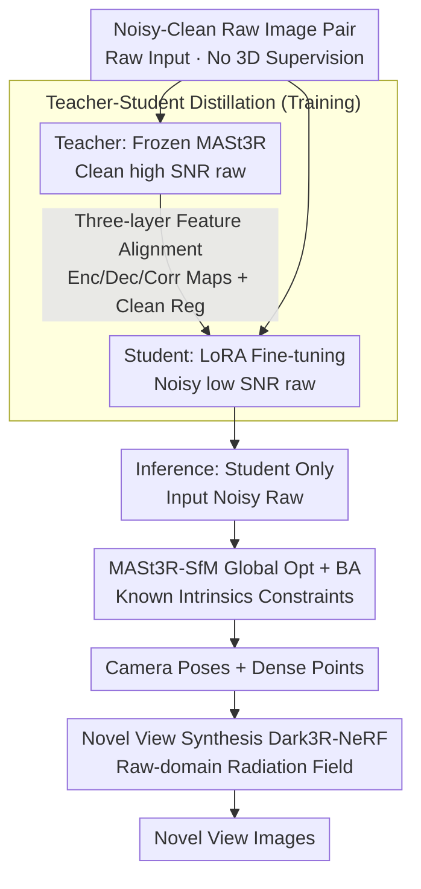

# Dark3R: Learning Structure from Motion in the Dark

**Conference**: CVPR2026  
**arXiv**: [2603.05330](https://arxiv.org/abs/2603.05330)  
**Code**: [Project Page](https://andrewguo.com/pub/dark3r)  
**Area**: 3D Vision  
**Keywords**: Low-light 3D reconstruction, Structure from Motion, Knowledge Distillation, Feature Matching, Novel View Synthesis, NeRF

## TL;DR

The Dark3R framework is proposed to transfer 3D priors from MASt3R to extreme low-light (SNR $< -4$ dB) raw images through teacher-student distillation, enabling Structure from Motion (SfM) and novel view synthesis in dark environments where traditional methods fail completely.

## Background & Motivation

**Traditional SfM Collapses in Low Light**: Existing SfM pipelines (e.g., COLMAP) rely on feature detection and matching. When the Signal-to-Noise Ratio (SNR) is below 0 dB, noise dominates the signal, causing feature extraction to fail entirely, which prevents pose estimation and triangulation.

**Learned Methods Also Fail**: 3D foundation models like MASt3R and VGGT are pre-trained on large-scale datasets, but their training distributions do not include low-SNR raw images, leading to poor generalization in extreme noise.

**Single-frame Denoising Fails to Maintain Multi-view Consistency**: Applying denoisers (e.g., BM3D, neural networks) independently to each frame improves single-image quality but destroys feature consistency across views, causing subsequent matching and pose estimation to fail.

**Burst Denoising Assumptions Do Not Hold**: Burst denoising assumes small inter-frame motion, but 3D reconstruction scenarios involve large disparities and significant camera movement, violating the alignment premise.

**Existing Low-Light NeRF Relies on External Poses**: Methods like RawNeRF can reconstruct radiance fields from raw images but must rely on camera poses provided by COLMAP, creating a deadlock where "reconstruction is impossible if poses cannot be estimated."

**Lack of Suitable Datasets**: Prior to this work, there were no large-scale low-light multi-view raw image datasets with precise 3D annotations, hindering research and evaluation in this area.

## Method

### Overall Architecture

Dark3R addresses the complete collapse of traditional SfM under extreme low light (SNR $< 0$ dB). The solution is teacher-student distillation: a pre-trained MASt3R is used as a frozen teacher, and a student network is initialized with the same weights and fine-tuned using LoRA. The teacher processes high-SNR clean raw image pairs, while the student processes corresponding low-SNR noisy raw image pairs. The training objective is to align the student's encoder features, decoder features, and correspondence maps with the teacher's outputs. During inference, only the student network is used, combined with the global optimization and Bundle Adjustment (BA) of MASt3R-SfM to recover multi-view poses. The resulting dense point maps can be further utilized by Dark3R-NeRF for novel view synthesis.

### Key Designs

**1. Raw Image Input: Bypassing ISP to Prevent Information Loss**

Black level subtraction and truncation in ISP pipelines can erase weak signals under extremely low SNR. Dark3R directly uses raw images after simple demosaicing (subsampling Bayer channels, averaging two green channels) as input to preserve as much information as possible. Experiments confirm that MASt3R performs similarly on raw and sRGB at high SNR, indicating no downside to using raw.

**2. LoRA Fine-tuning: Accurate and Efficient Adaptation**

Moving 3D priors to the low-light domain via full parameter fine-tuning is expensive and prone to overfitting noise. Dark3R uses LoRA to update only low-rank adapters—ablation results show LoRA reduces pose ATE from $0.476$ (full fine-tuning) to $0.050$ while improving training efficiency.

**3. Three-layer Feature Alignment: Aligning with the Teacher Throughout**

Aligning only the final output is insufficient to transfer the teacher's geometric knowledge. Dark3R simultaneously aligns encoder features $\mathbf{F}_{\mathcal{E}}$, decoder features $\mathbf{F}_{\mathcal{D}}$, and correspondence maps $\mathbf{C}$ using $L_2$ supervision, forcing the student to replicate the teacher's representation at multiple levels.

**4. Clean Regularization: Maintaining Performance Across Wide SNR Ranges**

Learning only from noise can degrade student performance on clean images. During training, clean image pairs are also passed through the student and aligned with the teacher's output ($\lambda_{\text{clean}}=0.3$), ensuring the student remains robust from clean to extremely noisy conditions.

**5. Training Data without 3D Supervision: Leveraging Noisy-Clean Pairs**

GT depth/poses for low-light multi-view scenes are difficult to obtain. Dark3R training only requires noisy-clean raw image pairs—which can be captured directly or synthesized using calibrated Poisson-Gaussian noise models—requiring no ground truth depth or poses, making it highly scalable.

**6. Known Intrinsics Constraints: Regularizing BA with Calibration**

Inference assumes known camera intrinsics. A regularization term is added to the BA to keep optimized intrinsics close to calibrated values, preventing noise from biasing intrinsic estimation under low light.

**7. Novel View Synthesis (Dark3R-NeRF): Robust Radiance Field Reconstruction in Raw Domain**

The final step reconstructs the radiance field in the raw domain. High noise makes optimization unstable, so Dark3R-NeRF employs three strategies: coarse-to-fine optimization with stochastic preconditioning (adding Gaussian noise to ray samples and annealing from $\sigma=10^{-3}$ to $0$ over the first 30k steps) to avoid overfitting; depth supervision using Dark3R's dense point maps as priors (decaying weight like DS-NeRF to retain detail); and black level preservation (no subtraction or truncation) to keep signals near the black level, relying on multi-view aggregation to increase SNR.

### Loss & Training

$$\mathcal{L} = \|\mathbf{F} - \tilde{\mathbf{F}}_{\text{noisy}}\|_2^2 + \lambda_{\text{clean}} \|\mathbf{F} - \tilde{\mathbf{F}}_{\text{clean}}\|_2^2$$

Where $\mathbf{F}$ represents the concatenated teacher outputs (encoder, decoder, correspondence maps) on clean images, and $\tilde{\mathbf{F}}$ represents the student's corresponding outputs.

## Key Experimental Results

### Dataset

Self-collected dataset: ~42,000 multi-view exposure-bracketed raw images (12 tripod scenes, ~400 views $\times$ 9 exposures) + ~20,000 handheld high-SNR images (92 indoor scenes). Captured with Sony Alpha I, evaluating SNR as low as $-5$ dB.

### Main Results (Pose Estimation)

| Method | Input | ATE $\downarrow$ | RPE T $\downarrow$ | RPE R $\downarrow$ | AbsRel $\downarrow$ | $\delta<1.25$ $\uparrow$ |
| :--- | :--- | :--- | :--- | :--- | :--- | :--- |
| COLMAP | sRGB | 0.669 | 0.155 | 1.644 | 0.638 | 54.38 |
| MASt3R | raw | 0.787 | 0.472 | 2.802 | 0.318 | 39.66 |
| VGGT | sRGB | 0.252 | 0.216 | 1.047 | 0.232 | 63.28 |
| MASt3R-SfM | raw | 0.088 | 0.038 | 0.201 | 0.196 | 79.39 |
| **Ours (Dark3R)** | **raw** | **0.050** | **0.020** | **0.121** | **0.091** | **93.14** |

At an average SNR of ~$-3.87$ dB (120 input views), Dark3R outperforms all baselines.

### Main Results (Novel View Synthesis)

| Method | Pose Source | PSNR $\uparrow$ | SSIM $\uparrow$ | LPIPS $\downarrow$ |
| :--- | :--- | :--- | :--- | :--- |
| Dark3R-NeRF | MASt3R-SfM | 34.60 | 0.835 | 0.308 |
| RawNeRF | Dark3R | 34.24 | 0.848 | 0.291 |
| LE3D | Dark3R | 35.77 | 0.878 | 0.339 |
| **Dark3R-NeRF** | **Dark3R** | **36.17** | **0.866** | **0.257** |
| Dark3R-NeRF | Oracle | 37.16 | 0.882 | 0.228 |

The combination of Dark3R poses + Dark3R-NeRF achieves the best overall performance without oracle poses.

### Ablation Study

- **LoRA vs. Full Fine-tuning**: LoRA shows significant advantages, reducing ATE from $0.476$ to $0.050$.
- **Raw vs. sRGB Input**: Raw images preserve linear sensor responses, leading to higher pose accuracy.
- **Simulated + Real Data**: Synthetic training data improves performance when combined with real data.
- **Encoder-only Fine-tuning**: Yields the lowest ATE ($0.030$) but higher rotation error; fine-tuning all components is more balanced.
- **Clean loss**: Removing it results in minimal performance change, suggesting gains mainly come from noisy $L_2$ alignment.
- **NeRF Ablations**: Depth supervision (+1.26 PSNR), no black level truncation (+1.19 PSNR), and stochastic preconditioning (+0.12 PSNR) all contribute.

## Highlights & Insights

- **Pioneering Problem Definition**: First to systematically solve the extreme low-light SfM problem (SNR $< 0$ dB), breaking the "good poses require good images $\rightarrow$ good images require poses" deadlock.
- **Elegant Distillation Strategy**: Transfers MASt3R's 3D priors to the low-light domain using only noisy-clean image pairs without requiring 3D supervision. Simple yet scalable.
- **First Low-light Multi-view Dataset**: 42,000 exposure-bracketed raw images with precise 3D annotations fill a significant community gap.
- **End-to-end System**: Covers the full pipeline from SfM to NeRF reconstruction and validates cross-camera generalization on iPhone 16.

## Limitations & Future Work

- Requires known camera intrinsics (pre-calibration), limiting fully automated deployment on uncalibrated consumer devices.
- High computational requirements: Training takes ~15 hours on 8x RTX A6000 GPUs.
- NeRF-based reconstruction instead of 3DGS (authors found Gaussian optimization difficult under high noise), resulting in slower rendering.
- Long reconstruction time per scene (120k iterations for NeRF optimization).
- Dataset scenes are predominantly indoor and static; generalization to dynamic or outdoor scenes is yet to be verified.
- Pose accuracy slightly decreases with more than 500 input views, needing improvements for large-scale scalability.
- Performance is capped by the teacher (MASt3R); the student inherits any weaknesses the teacher has in specific scene types.

## Related Work & Insights

- **MASt3R / MASt3R-SfM**: The foundation of the teacher model and inference pipeline; remains a strong baseline at high SNR.
- **RawNeRF**: Also operates in the raw domain but requires COLMAP poses, limiting it to lighting conditions where COLMAP succeeds.
- **VGGT**: A feed-forward 3D reconstruction model that outperforms COLMAP in low light but falls short of MASt3R-SfM.
- **LE3D**: A 3DGS-based low-light reconstruction method; Dark3R-NeRF outperforms it significantly in LPIPS.
- **DS-NeRF**: Dark3R-NeRF's depth supervision strategy follows its exponential decay weighting design.
- **SuperPoint/SuperGlue**: Representative learned feature matching methods that also suffer severe degradation in low light.

## Rating

- Novelty: ⭐⭐⭐⭐⭐ — First to solve extreme low-light SfM with an original distillation scheme.
- Experimental Thoroughness: ⭐⭐⭐⭐⭐ — Large-scale dataset, extensive ablations, multiple baselines, and cross-camera validation.
- Writing Quality: ⭐⭐⭐⭐⭐ — Clear structure, excellent figures, and well-motivated problem statement.
- Value: ⭐⭐⭐⭐⭐ — Opens a new direction for passive 3D perception in the dark with long-term impact from both the method and dataset.

<!-- RELATED:START -->

## Related Papers

- [\[CVPR 2026\] Global Structure-from-Motion Meets Feedforward Reconstruction](global_structure-from-motion_meets_feedforward_reconstruction.md)
- [\[CVPR 2026\] PromptStereo: Zero-Shot Stereo Matching via Structure and Motion Prompts](promptstereo_zero-shot_stereo_matching_via_structure_and_motion_prompts.md)
- [\[CVPR 2025\] Dense-SfM: Structure from Motion with Dense Consistent Matching](../../CVPR2025/3d_vision/dense-sfm_structure_from_motion_with_dense_consistent_matching.md)
- [\[CVPR 2026\] Learning Explicit Continuous Motion Representation for Dynamic Gaussian Splatting from Monocular Videos](learning_explicit_continuous_motion_representation_for_dynamic_gaussian_splattin.md)
- [\[CVPR 2026\] Generative Diffusion Priors for 3D Mapping of the Dark Universe](generative_diffusion_priors_for_3d_mapping_of_the_dark_universe.md)

<!-- RELATED:END -->
