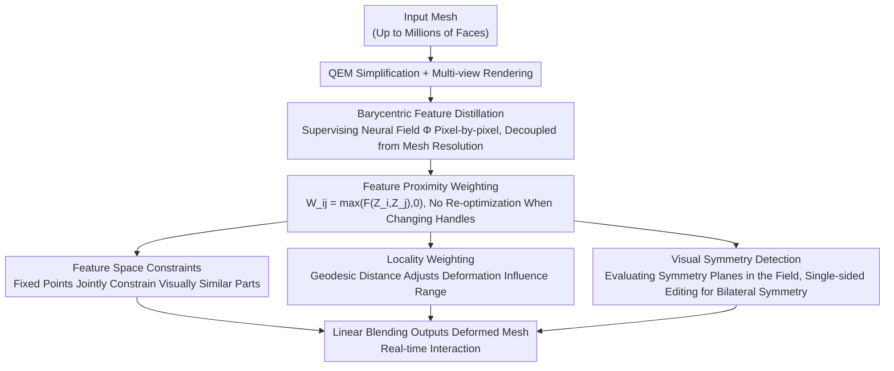

# Deep Feature Deformation Weights

**Conference**: CVPR 2026  
**Paper**: [CVF Open Access](https://openaccess.thecvf.com/content/CVPR2026/html/Liu_Deep_Feature_Deformation_Weights_CVPR_2026_paper.html)  
**Code**: https://threedle.github.io/dfd (project page)  
**Area**: 3D Vision / Mesh Deformation / Computer Graphics  
**Keywords**: handle-based deformation, neural feature fields, linear blend weights, feature distillation, visual symmetry

## TL;DR
This paper introduces DFD (Deep Feature Deformation) weights: by distilling the deep features of a pre-trained 2D vision model into a neural field on the mesh, and directly defining the linear blend weights of handles using "feature similarity", the weight calculation in classical handle-based mesh deformation—which traditionally requires iterative optimization—is transformed into a real-time computation of a single forward pass and feature distance. This preserves both the fine-grained control and speed of classical methods, while acquiring the semantic/symmetry-aware capabilities of data-driven approaches, enabling real-time deformation even for meshes with millions of faces.

## Background & Motivation
**Background**: Handle-based mesh deformation is a classic paradigm in computer graphics—users place a few sparse control handles on a mesh, and dragging these handles drives the deformation of the entire surface. It primarily follows two approaches: **classical methods** (such as ARAP, biharmonic coordinates, etc.) solve a weight matrix or directly solve for deformed vertices by minimizing a certain energy (e.g., Laplacian or as-rigid-as-possible energy), which is fast and offers fine-grained control; **data-driven methods** (such as DeepMetaHandles, APAP, NeuralMLS, etc.) use networks to predict control structure parameters from data priors, enabling semantically aligned edits (preserving symmetry and structure).

**Limitations of Prior Work**: Both approaches have major drawbacks. Classical methods require the user to **know in advance where to place the handles**; poor placement yields awkward results, and once the handle set changes, the weights must be re-optimized, preventing flexible adjustments. Their locality is strictly constrained by energy terms, meaning they can only perform "volume-preserving pose changes" rather than user-desired edits that break the surface shape, such as "symmetrically elongating the four legs of a chair". While data-driven methods can achieve semantic edits, they **sacrifice fine-grained control and speed**—almost all such methods require solving an optimization problem, which scales quadratically with the number of vertices at best, requiring recalculation for every new set of handles, entirely precluding real-time iteration.

**Key Challenge**: There is a trade-off between speed + fine-grained control (classical school) and semantic/symmetry awareness (data-driven school). Moreover, all methods share a deeper bottleneck: **any change in handles requires re-solving the optimization problem, which deteriorates with mesh resolution**, presenting a fundamental barrier to real-time interactive deformation.

**Goal**: To simultaneously achieve (1) the speed and fine-grained control of classical methods, (2) the visual semantic understanding provided by data priors, (3) no re-optimization when changing handles, and (4) weight computation robust to mesh resolution.

**Key Insight**: The authors observe that deep features of pre-trained 2D models (such as DINOv2) naturally associate "visually similar structures" (e.g., the four legs of a chair, the two arms of a robot). If these features are distilled onto a 3D surface, the question of "should two points move together" can be answered directly using their feature similarity, **completely avoiding the need to solve optimization problems**.

**Core Idea**: Directly define the linear blend weights of the handles using "deep feature proximity"—points with more similar features are more heavily influenced by the same handle; the weight is a closed-form function of feature similarity, meaning changing handles only requires recalculating feature distances, which is completed in real-time.

## Method

### Overall Architecture
DFD splits deformation into two stages: "one-time preprocessing, followed by real-time deformation". **Preprocessing phase**: Given a mesh, quadric error simplification (QEM) is first applied to obtain a coarse mesh, which is then rendered from multiple views. "Barycentric feature distillation" is used to distill the pre-trained 2D features into a continuous neural feature field $\Phi$ (where a unit feature vector can be queried for any 3D point). This step is the only part requiring training but is accelerated to complete within minutes. **Deformation phase**: For each vertex $i$ of the original high-resolution mesh, the feature $Z_i=\Phi(V_i)$ is queried, and the blend weight $W_{ij}$ for any pair of points is directly given by feature similarity. When a user assigns affine transformations to several handles, the new position of each vertex is calculated using an extended linear blend formula—the entire process requires no optimization and scales linearly or even sublinearly with the number of vertices/handles. On top of this, three "classical attribute" controls are superimposed: feature space constraints (fixed points), locality weighting, and visual symmetry detection.

### Key Designs

**1. Feature Proximity Weighting: Directly Using Feature Distance as Blend Weights to Bypass All Optimization**

The pain point of classical methods is that "weights must be solved from handle energy optimization, requiring standard re-solving whenever handles change". The DFD approach is extremely direct: after training the feature field, the weight of influence of vertex $j$ (as a handle) on vertex $i$ is defined as the feature similarity:

$$W_{ij}=\max\big(F(Z_i,Z_j),\,0\big),\qquad F(Z_i,Z_j)=1-\lVert Z_i-Z_j\rVert_2$$

where $Z=\Phi(V)$ is the unit-norm feature. When the features of two points are identical, $F=1$; when they are farthest apart, $F=-1$. Since negative weights exhibit counter-intuitive behaviors during deformation, they are clamped to 0 (interpreted as "unrelated"). The final vertex positions are given by the extended linear blending:

$$V'_i=\Big(\max\big(1-\textstyle\sum_{k=1}^{K}W_{ij_k},0\big)D_0+\sum_{k=1}^{K}W_{ij_k}D_k\Big)V_i$$

The first term is a "dummy control point" with a default transformation $D_0$ (usually identity), using $\max$ to prevent its weight from becoming negative; it ensures the partition of unity, thereby keeping the shape stationary under zero transformation (identity property). The key lies in the fact that $Z$ only needs to be computed once via a single forward pass, and the weights for new handles are simply a feature distance computation; taking a linear form for $F$ makes the weight computation linear with respect to both the number of vertices and handles—this is the source of the "no re-optimization when changing handles" property and the real-time performance. Furthermore, because features associate visually similar structures, the deformation is naturally smooth and symmetry-preserving, **obviating the need for any additional regularization or vertex constraints**.

**2. Barycentric Feature Distillation: Decoupling Distillation Complexity from Mesh Resolution by Binding It to Rendering Resolution**

To make the aforementioned feature weights hold even on high-resolution meshes, 2D features must first be efficiently distilled into a 3D field. Existing distillation methods distill features onto **mesh vertices**, meaning only pixels in a rendered image that "exactly land on vertices" participate in supervision, wasting a vast amount of visual signals inside triangles. Furthermore, the distillation complexity is directly tied to the mesh resolution, requiring hours to distill millions of faces. This paper instead supervises **every pixel**: using the known geometry from rasterization, the 3D surface coordinates corresponding to a pixel are constructed by combining the triangle vertex matrix $T(i,j)$ covering that pixel's center with its barycentric coordinates $B(i,j)$:

$$P_{ij}=B(i,j)\,T(i,j)$$

Then, the neural field fits the encoded feature $Z_{ij}$ on all pixels covered by triangles:

$$L=\sum_{(i,j)\in\Omega}\Big\lVert \Phi(P_{ij})-\tfrac{Z_{ij}}{\lVert Z_{ij}\rVert}\Big\rVert^2$$

In this way, the sampling resolution of the neural field depends only on the **rendering resolution** and is thoroughly decoupled from the number of mesh faces—two meshes occupying the same spatial footprint will receive the same sampling density. This is coupled with a key observation: even under aggressive simplification (e.g., QEM 99% face reduction), the visual appearance of a high-resolution mesh is virtually unchanged, and its feature field remains nearly identical (the paper shows that direct rendering of a Lucy mesh with 28 million faces takes 5.7 minutes, whereas rendering it after a 99% QEM simplification takes only 3.7 seconds). Thus, the authors perform QEM simplification before rendering and distillation, allowing shapes with 1,000 to tens of millions of faces to be distilled in just a few minutes. Barycentric distillation is the prerequisite for all of this (the paper demonstrates that on a coarse mesh, using conventional vertex distillation yields significantly worse weight quality under the same FLOPs).

**3. Feature Space Extension of Classical Control Attributes: Fixed Points, Locality, and Visual Symmetry**

By default, DFD produces "global/semantic" deformations, but users sometimes require the local control capabilities of classical methods. The authors reimplement three classical attributes within the feature field framework. **Fixed Points (Feature Space Constraints)**: Given a set of fixed vertices, the weights are updated as $W_{ij}=\max\big(W_{ij}-\max_{p_k}(W_{ip_k}),0\big)$—that is, subtracting the maximum similarity of each point to the fixed points from its weight, which "pins down" all components visually similar to the fixed points (e.g., placing fixed points on a robot's treads prevents the treads from twisting along with the torso). **Locality Weighting**: A user parameter $\omega$ is introduced to attenuate the weights according to the normalized geodesic distance $G_{ij}$ as $W'_{ij}=W_{ij}(1-G_{ij})^{\omega}$. Larger $\omega$ restricts the deformation to a more local scope (for the same rotation, the default weights might rotate the entire bull head, whereas adding locality only bends the horns). **Visual Symmetry Detection**: Since the neural field can query features at any point **outside** the surface, the authors enumerate candidate symmetry planes $P$. A symmetry plane is detected when the mean feature difference of vertices on both sides after reflection $R_P$ is below the threshold $\varepsilon$ (set to 0.1). During symmetric deformation, the transform of the opposite handle is reflected before application (Eq. 8). Note that this represents **visual symmetry** rather than geometric symmetry—the parts need not be geometrically congruent as long as they are visually similar (more relaxed than intrinsic symmetry). This enables the detection of shapes that are geometrically asymmetric but visually symmetric, allowing single-sided editing to drive bilateral symmetry.

## Key Experimental Results

Evaluation is conducted on the APAP-Bench 3D dataset and the DeepMetaHandles (DMH) dataset (consisting of 1,363 shapes of cars/tables/chairs from ShapeNet). All DFD weights are distilled from DINOv2; shapes exceeding 50,000 faces are simplified to approximately 50,000 faces via QEM before distillation. Baseline methods include the classical school (ARAP, biharmonic coordinates) and the data-driven school (APAP, DMH, NeuralMLS).

### Main Results

| Dimension | DFD (Ours) | ARAP / Biharmonic | APAP / DMH | NeuralMLS |
|------|------------|-------------------|------------|-----------|
| Global Semantic Deformation | ✓ | ✗ | ✓ | ✗ |
| Local Fine-grained Control | ✓ | ✓ | ✗ | ✓ |
| Robust to Resolution | ✓ | ✗ | ✗ | ✗ |
| No Re-optimization on Handle Change | ✓ (Unique) | ✗ | ✗ | ✗ |
| High-resolution Upper Limit | Real-time support for millions of faces | Biharmonic fails beyond $10^5$ faces | Base latency is several orders of magnitude higher | Both base latency and scaling are poor |

DFD is the **only** method in the table that simultaneously satisfies the four desiderata, and is also the only method that does not require re-solving optimization when changing handles. In the timing analysis (over meshes with $10^3$--$10^7$ faces, around 6,000 shapes), biharmonic scales extremely poorly during the tetrahedralization and binding stages, failing for shapes with more than $10^5$ faces. DFD is robust across all resolutions in all three stages (preprocessing, binding, and posing); preprocessing time is virtually independent of resolution due to barycentric distillation, and binding and posing even scale **sublinearly**. DFD is as fast as biharmonic at the lowest resolutions, and comprehensively outperforms it at high resolutions.

### User Study / Ablation Study

| User Study (Top-2 Preference, N=37) | DFD-T | DFD-A | ARAP | Biharmonic | APAP | NeuralMLS |
|------|------|------|------|------------|------|-----------|
| Selection Frequency | 82% | 79% | 19% | 3% | 4% | 11% |

In the second "most realistic and detail-preserving" single-choice study (N=23), DFD was chosen 64% of the time, followed by ARAP (17.7%), NeuralMLS (15.2%), biharmonic (2.2%), and APAP (0.93%).

| Ablation Configuration | Key Phenomenon | Explanation |
|------|---------|------|
| Full (Barycentric Distillation) | Smooth and visually-perceptive weights | Full method |
| w/o Barycentric Distillation (Vertex Distillation, equivalent FLOPs) | Weights are neither smooth nor visually-perceptive | Traditional distillation on coarse meshes performs significantly worse even when matching FLOPs, proving that barycentric distillation is key to resolution robustness. |
| Replacing the image encoder | Deformation results are strikingly similar | Different 2D models tend to associate the same structures, hinting at the convergence of semantic understanding. |

### Key Findings
- The two components with the greatest contribution are **feature proximity weighting** (yielding optimization-free real-time performance + natural smoothness) and **barycentric feature distillation** (providing resolution robustness); removing barycentric distillation significantly degrades weight quality even when compensating with equivalent training FLOPs.
- DFD weights obtained using different 2D encoders (e.g., DINOv2) are nearly identical, showing that the question of "which structures should move together" has converged across different vision models, making the method insensitive to the choice of encoder.
- DFD is robust to non-manifold meshes and topological defects (which often cause DMH, ARAP, and biharmonic methods to fail), and performs on par with or excels beyond baselines on their respective specialized datasets.

## Highlights & Insights
- **Reducing 'deformation weights' from an optimization problem to a feature distance query**: This is the most central "aha!" insight. While the classical school spent decades solving energy optimization, this paper finds that given a high-quality semantic feature field, weights can be obtained in closed-form as feature similarity. Changing handles is merely recalculating distances, thereby securing both real-time performance and fine-grained control simultaneously.
- **Barycentric feature distillation locks distillation complexity to rendering resolution rather than mesh resolution**: Paired with the observation that "aggressive simplification of high-resolution meshes barely changes their visual appearance/features", this compresses hours of distillation on million-face meshes down to minutes. This decoupling perspective is highly transferable to any "2D feature $\to$ 3D surface" distillation tasks (e.g., segmentation, texturing, correspondence, etc.).
- **Visual Symmetry > Geometric Symmetry**: Because the neural field can query features outside the surface, the detection of symmetry planes is freed from geometric/isometric constraints. It can identify structures that are geometrically asymmetric but visually symmetric to enable single-sided edits to drive bilateral motion. This capability of "querying semantic features at arbitrary points in space" holds immense potential on its own.
- In terms of engineering, a GUI proof-of-concept is provided that runs real-time deformation of million-face meshes on consumer-grade machines, bringing it very close to practical interactive modeling tools.

## Limitations & Future Work
- **Still requiring per-shape optimization**: Although distillation is compressed to around one minute, each new shape still requires independent distillation of its feature field, rather than being a feed-forward zero-shot solution. Future work could explore generalizable feature fields across shapes.
- **Inherent limitations of linear blending remain unresolved**: Under extreme deformations, linear blending exhibits well-known issues like volume collapse; as this work relies on linear blending, it inherits these artifacts.
- **Limited coverage of symmetry detection**: The candidate symmetry planes are only enumerated along the principal axes, and the threshold is fixed to 0.1, which might miss complex or diagonal symmetries. Automatically searching for arbitrary symmetry planes is a natural extension.
- The upper bound of weight quality is dependent on the pre-trained 2D features—if the encoder lacks semantic understanding of a certain structure class, DFD will degrade accordingly.

## Related Work & Insights
- **vs ARAP / Biharmonic (Classical Laplacian School)**: They solve for weights via energy optimization, can only perform volume-preserving pose adjustments, degenerate to global rotation/offsets under poor handle placement, demand re-solving when handles change, and degrade with resolution (biharmonic fails beyond $10^5$ faces). DFD provides weights in closed form from feature distance, enabling both fast and semantic/symmetry-aware editing, with handle changes being entirely optimization-free.
- **vs DeepMetaHandles / APAP (Data-Driven School)**: DMH uses biharmonic as the deformation model, and APAP relies on text-to-image score distillation for supervision. Both require optimization, and APAP often breaks symmetry due to noisy signals. DFD achieves smoothness on par with DMH using only a single handle on the DMH dataset, while demonstrating stronger visual/structural perception (e.g., confining deformation to chair legs and preserving leg symmetry) without needing re-optimization.
- **vs NeuralMLS**: Though it also employs a neural field, NeuralMLS must solve moving least squares, yielding poorer base latency and scaling, and lacks semantic controls like symmetry/feature constraints.
- **vs OptCtrlPoints**: While dedicated to accelerating the "re-solving upon handle changes" for biharmonic, DFD remains several orders of magnitude faster in new handle binding time, as it completely avoids solving any linear system.

## Rating
- Novelty: ⭐⭐⭐⭐⭐ "Feature similarity as blend weights" completely transforms a classic optimization problem into a query, and the resolution decoupling in barycentric distillation is highly clever.
- Experimental Thoroughness: ⭐⭐⭐⭐ The work is comprehensive with cross-resolution timing, two datasets, two sets of user studies, and key ablation analyses, although the leaning toward timing/preference quantitative metrics over geometric error is a minor pity.
- Writing Quality: ⭐⭐⭐⭐⭐ The desiderata table explains the positioning extremely clearly; method derivations are neat and illustrations are abundant.
- Value: ⭐⭐⭐⭐⭐ The first truly real-time, million-face-robust, handle-change optimization-free deformation framework, possessing direct value for interactive 3D modeling tools.

<!-- RELATED:START -->

## Related Papers

- [\[CVPR 2026\] Event-based Visual Deformation Measurement](event-based_visual_deformation_measurement.md)
- [\[CVPR 2026\] Deformation-based In-Context Learning for Point Cloud Understanding](deformation-based_in-context_learning_for_point_cloud_understanding.md)
- [\[CVPR 2026\] Exploring 6D Object Pose Estimation with Deformation](exploring_6d_object_pose_estimation_with_deformation.md)
- [\[CVPR 2026\] PatchAlign3D: Local Feature Alignment for Dense 3D Shape Understanding](patchalign3d_local_feature_alignment_for_dense_3d_shape_understanding.md)
- [\[CVPR 2026\] Learning Convex Decomposition via Feature Fields](learning_convex_decomposition_via_feature_fields.md)

<!-- RELATED:END -->
