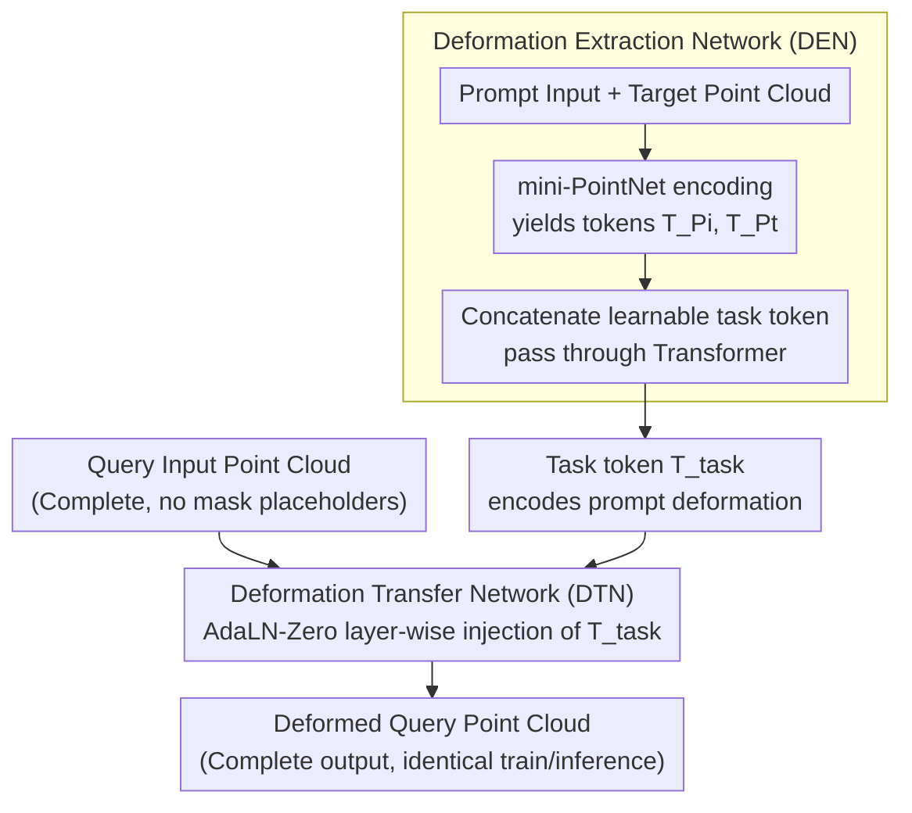

# Deformation-based In-Context Learning for Point Cloud Understanding

**Conference**: CVPR 2026  
**arXiv**: [2604.02845](https://arxiv.org/abs/2604.02845)  
**Code**: [Link](https://github.com/linchengxing/DeformPIC)  
**Area**: 3D Vision  
**Keywords**: Point Cloud In-Context Learning, Deformation Networks, Geometric Reasoning, Masked Point Modeling, Multi-task Generalist Model

## TL;DR
Ours proposes DeformPIC, which redefines point cloud In-Context Learning from the "mask reconstruction" paradigm to a "deformation transfer" paradigm. By utilizing a Deformation Extraction Network to extract task semantics and a Deformation Transfer Network to migrate deformations to query point clouds, it reduces CD by 1.6, 1.8, and 4.7 in reconstruction, denoising, and registration tasks, respectively.

## Background & Motivation
**Background**: 3D point cloud ICL aims to enable models to handle multiple tasks (reconstruction, denoising, registration, segmentation) through a few examples. Current methods (PIC, PIC++) are based on Masked Point Modeling (MPM).

**Limitations of Prior Work**: (1) **Geometry-free**: MPM predicts target point clouds from masked tokens without geometric information, lacking explicit geometric reasoning; (2) **Training-inference mismatch**: During training, the target is partially masked (visible parts are exploitable), whereas the target is completely unknown during inference.

**Key Challenge**: Masked tokens act as abstract placeholders that do not encode geometric correspondences. Models can only implicitly infer spatial structures via self-attention.

**Goal**: To equip ICL with explicit geometric manipulation capabilities and eliminate the inconsistency between training and inference objectives.

**Key Insight**: Define the task as "deforming a query point cloud under prompt guidance," as deformation naturally preserves geometric continuity.

**Core Idea**: Extract task-specific deformation information from prompt pairs (DEN) and subsequently transfer this deformation to the query point cloud (DTN).

## Method

### Overall Architecture
DeformPIC addresses how point cloud In-Context Learning interprets the specific task from a pair of prompts (input point cloud → target point cloud) and applies it to a query point cloud. The process is decomposed into two stages using two distinct networks. First, the Deformation Extraction Network (DEN) processes the prompt: it reads the prompt input and target to extract a task token $\hat{T}_{\text{task}}$ that describes the deformation between the pair. Second, the Deformation Transfer Network (DTN) uses this task token as an "operational instruction" to modulate a Transformer, applying the same deformation to the query input to output the deformed point cloud directly. This pipeline contains no masked tokens; both inputs and outputs are complete point clouds, ensuring consistent procedures for training and inference.

### Key Designs

**1. Deformation Extraction Network: Decoupling "Task Semantics" from "Geometric Computation"**

Previous methods like PIC/PIC++ process prompts and queries together in a single network. However, extracting task semantics from prompts and performing geometric reconstruction on queries are distinct objectives. DeformPIC assigns the former to DEN: a mini-PointNet encodes the prompt input and target into tokens $T_{P_i}$ and $T_{P_t}$, which are concatenated with a learnable task token and processed by a Transformer to produce $\hat{T}_{\text{task}} = \mathcal{E}([T_{\text{task}} \| T_{P_i} \| T_{P_t}])$. This allows DEN to focus solely on identifying the deformation represented by the prompt pair.

**2. Deformation Transfer Network: Layer-wise Task Token Injection via AdaLN-Zero**

To allow the task token to guide the deformation of the query point cloud, DTN adopts the AdaLN-Zero conditioning method from DiT, injecting $\hat{T}_{\text{task}}$ into every Transformer layer:

$$h^{(l+1)} = h^{(l)} + \sigma^{(l)} \cdot \mathcal{A}[(1+\eta^{(l)}) \cdot \text{LN}(h^{(l)}) + \kappa^{(l)}]$$

The scaling/shift factors $\sigma^{(l)}, \eta^{(l)}, \kappa^{(l)}$ are calculated from the task token through zero-initialized MLPs. Zero initialization means $\sigma\approx0$ at the start of training, allowing the DTN to initially behave as an unconditional Transformer before gradually learning to use the task token for biased deformation, which stabilizes training.

**3. Training-Inference Consistency: Eliminating Masks**

The MPM paradigm suffers from a mismatch: during training, the model can see unmasked parts of the target, but during inference, the target is entirely hidden. By redefining the task as "deforming the query input," DeformPIC eliminates this mismatch. In both training and inference, DTN receives a complete query input and generates a complete deformed output without any masking operations.

### A Complete Example: Applying a Registration Prompt to a Query
Consider a registration task. Given a prompt pair where the input is a tilted airplane and the target is its upright version, the relationship is a rigid body rotation. DEN extracts $\hat{T}_{\text{task}}$ containing the rotation information. When a new, tilted query point cloud (e.g., a chair) is provided, DTN uses $\hat{T}_{\text{task}}$ to modulate the Transformer layers, resulting in an "upright" chair output. The query remains a complete point cloud throughout the process.

### Loss & Training
- $L_2$ Chamfer Distance: $$\mathcal{L} = \frac{1}{|\hat{R}|}\sum_{p \in \hat{R}} \min_{g \in R} \|p - g\|_2^2 + \frac{1}{|R|}\sum_{g \in R} \min_{p \in \hat{R}} \|g - p\|_2^2$$
- AdamW + cosine decay, lr warmup for 10 epochs, 300 total epochs, batch size 128.

## Key Experimental Results

### Main Results (ShapeNet In-Context Dataset, Chamfer Distance ×1000 ↓)

| Method | Recon Avg | Denoise Avg | Reg Avg | Seg mIoU↑ |
|:---|:---:|:---:|:---:|:---:|
| PIC-Cat | 4.3 | 5.3 | 14.1 | 79.0 |
| PIC-S-Cat | 6.9 | 6.5 | 24.1 | 83.8 |
| PIC-S-Sep | 5.1 | 12.0 | 6.7 | 83.7 |
| **Ours (DeformPIC)** | **2.7** | **3.5** | **2.0** | **83.9** |

### Ablation Study

| Comparison | Metric Change | Note |
|:---|:---|:---|
| vs PIC-Cat (Recon) | 4.3→2.7 (-1.6) | Deformation outperforms masked reconstruction |
| vs PIC-Cat (Denoise) | 5.3→3.5 (-1.8) | Explicit geometric manipulation is effective |
| vs PIC-Cat (Reg) | 14.1→2.0 (-12.1) | Registration is inherently geometric; deformation matches perfectly |
| vs Task-specific PCT | 2.6/2.2/6.3 vs 2.7/3.5/2.0 | ICL significantly outperforms task-specific models in registration |

### Key Findings
- **Most significant improvement in registration** (CD 14.1→2.0) as it inherently involves rigid transformations.
- **Segmentation performance maintains SOTA** (83.9 mIoU), proving the deformation paradigm handles discrete semantic tasks.
- **Strong generalization** demonstrated in cross-domain evaluations on ModelNet40 and ScanObjectNN.
- Qualitative results show DeformPIC generates more complete and precise 3D shapes.

## Highlights & Insights
- **Paradigm Shift**: Transitioning from "masked content prediction" to "input deformation" aligns better with 3D geometric nature.
- **Importance of Consistency**: Eliminating the training-inference mismatch leads to significant gains.
- **Decoupled Design**: Separating extraction (DEN) and transfer (DTN) is more efficient than joint processing.
- Successful technology transfer of AdaLN-Zero from DiT to point cloud ICL.

## Limitations & Future Work
- The deformation paradigm is less natural for discrete semantic tasks like part segmentation compared to continuous geometric tasks.
- Primary evaluations rely on synthetic datasets; real-world performance requires further validation.
- Scaling to larger pre-training datasets has not been explored.
- Independent encoders are used for DEN and DTN; shared encoders might enhance performance.
- Extreme deformations (e.g., transforming a cup into a car) may be limited.

## Related Work & Insights
- Core difference from PIC/PIC++: Masked reconstruction → Deformation transfer; Joint → Decoupled.
- Neural Deformation (FlowNet3D, Pixel2Mesh) previously validated the effectiveness of deformation strategies.
- AdaLN-Zero from DiT demonstrates that conditioning techniques from diffusion models are effective in other domains.

## Technical Details
- **Sampling**: 1024 points/object, 64 patches × 32 points/patch.
- **Point Encoder**: mini-PointNet maps point patches to tokens.
- **AdaLN-Zero Init**: $W_1, W_2, W_3$ are zero-initialized; DTN starts as an unconditional Transformer.
- **Comparison**: Includes task-specific (PointNet/DGCNN/PCT/ACT), multi-task, and ICL categories.
- **Dataset Size**: 174,404 training samples + 43,050 test samples, covering 4 tasks × 5 difficulty levels.

## Rating
- Novelty: ⭐⭐⭐⭐⭐ Redefines point cloud ICL with a deformation transfer paradigm.
- Experimental Thoroughness: ⭐⭐⭐⭐ Comprehensive on ShapeNet and cross-domain, though real-world data is limited.
- Writing Quality: ⭐⭐⭐⭐ Clear problem analysis and intuitive comparisons.
- Value: ⭐⭐⭐⭐ Significant progress in the emerging field of point cloud ICL.

<!-- RELATED:START -->

## Related Papers

- [\[CVPR 2026\] Adapting Point Cloud Analysis via Multimodal Bayesian Distribution Learning](adapting_point_cloud_analysis_via_multimodal_bayesian_distribution_learning.md)
- [\[CVPR 2026\] ECKConv: Learning Coordinate-based Convolutional Kernels for Continuous SE(3) Equivariant Point Cloud Analysis](learning_coordinate-based_convolutional_kernels_for_continuous_se3_equivariant_a.md)
- [\[CVPR 2026\] Mamba Learns in Context: Structure-Aware Domain Generalization for Multi-Task Point Cloud Understanding](mamba_learns_in_context_structure-aware_domain_generalization_for_multi-task_poi.md)
- [\[CVPR 2026\] 3D-Aware Multi-Task Learning with Cross-View Correlations for Dense Scene Understanding](3d-aware_multi-task_learning_with_cross-view_correlations_for_dense_scene_unders.md)
- [\[CVPR 2026\] CMHANet: A Cross-Modal Hybrid Attention Network for Point Cloud Registration](cmhanet_a_cross-modal_hybrid_attention_network_for_point_cloud_registration.md)

<!-- RELATED:END -->
