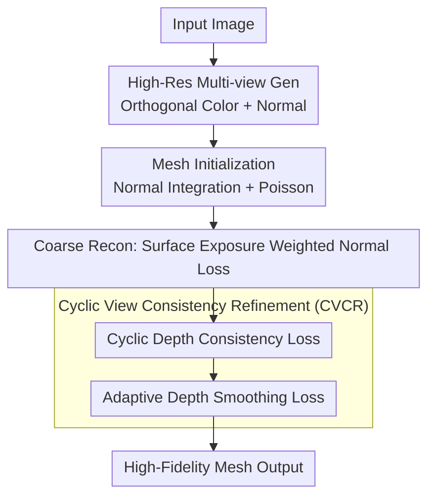

# Dehallu3D: Hallucination-Mitigated 3D Generation from a Single Image via Cyclic View Consistency Refinement

**Conference**: CVPR 2026  
**Paper**: [CVF Open Access](https://openaccess.thecvf.com/content/CVPR2026/html/Wang_Dehallu3D_Hallucination-Mitigated_3D_Generation_from_a_Single_Image_via_Cyclic_CVPR_2026_paper.html)  
**Code**: None  
**Area**: 3D Vision  
**Keywords**: Single-image 3D generation, Large Reconstruction Model hallucination, mesh optimization, depth consistency, outlier measurement

## TL;DR
Addressing the hallucination issue where Large Reconstruction Models "imagine" sparse multi-views as outlier structures (holes, spikes), Dehallu3D introduces a plug-and-play Cyclic View Consistency Refinement (CVCR) module following the single-image-to-mesh reconstruction pipeline. It smooths out outliers via 360° circular dense adjacent-view depth consistency constraints while preserving sharp features through adaptive smoothing. It also proposes the ORM metric to specifically quantify the degree of outliers, achieving a comprehensive lead in geometry and appearance metrics on the GSO dataset.

## Background & Motivation

**Background**: Generating 3D content from a single image is a critical capability for AR/VR and 3D printing. The current most popular paradigm is neither direct SDS distillation (e.g., DreamFusion, which is slow and suffers from the Janus problem) nor pure 3D native generators (which rely on models to learn complex structures and collapse on rare objects), but the "2D diffusion multi-view generation → 3D reconstruction" route popular after One-2-3-45, which offers the best trade-off between quality and efficiency.

**Limitations of Prior Work**: This paradigm has a long-ignored flaw—Large Reconstruction Models (LRMs) "hallucinate" just like other large models. When reconstructing from **sparse** generated multi-views (usually only four orthogonal views), the gaps between views are large and discontinuous, forcing the model to imagine details where input support is missing. This manifests as outlier structures on the mesh: strange holes, protrusions, and burrs. These outliers directly cause fabrication failure in 3D printing and break immersion in gaming scenarios.

**Key Challenge**: The root of the hallucination is the **large gaps and discontinuities between views**. To eliminate outliers, a natural thought is "interpolation"—inserting dense intermediate views between sparse views and forcing smooth transitions between adjacent views. However, over-emphasizing cross-view consistency will smooth out genuine sharp geometric features (e.g., spikes, edges), leading to over-smoothing. The real difficulty is: **eliminating outliers via dense view continuity without damaging sharp features**, an equilibrium between two conflicting constraints.

**Goal / Key Insight**: The authors observe a physical fact—the **depth maps of a real object are continuously consistent** under 360° surrounding, adjacent small-angle views; conversely, the appearance of depth jumps between adjacent views often corresponds to outliers on the mesh. Thus, they transform "de-hallucination" into "enforcing adjacent-view depth consistency," paired with an image-gradient-based adaptive smoothing term to exempt sharp regions.

**Core Idea**: Utilizing **Cyclic View Consistency Refinement (CVCR)**—constraining depth map consistency across dense surrounding views to eliminate outliers, while adaptively relaxing smoothing penalties in high-gradient areas using image gradients to preserve sharp features; additionally, they propose the **ORM** metric to quantify geometric fidelity from an "outlier" perspective for the first time.

## Method

### Overall Architecture
Dehallu3D is a single-image-to-mesh two-stage optimization framework. Given an input image, it first uses an off-the-shelf high-resolution multi-view/normal generator to produce color and normal maps for four orthogonal views, followed by Poisson reconstruction to obtain a topologically coarse initial mesh. Subsequently, it enters two-stage optimization: **(1) Coarse Reconstruction** uses differentiable rendering to quickly correct global topology, centered on a "Surface Exposure Weighted Normal Loss" that allows high-visibility views to dominate geometric constraints; **(2) CVCR Refinement** is the core contribution of this paper—it applies cyclic depth consistency constraints across 360° dense views to eliminate outliers and uses adaptive depth smoothing to preserve details. Finally, a high-fidelity mesh is output. The entire pipeline is coarse-to-fine, and CVCR is designed to be plug-and-play, compatible with any mesh reconstruction pipeline regardless of initialization strategy.

Note: ORM is the **evaluation metric** proposed in this paper (used to measure the outlier degree of generated meshes) and is not part of the generation pipeline; thus, it is not included in the flowchart below and is listed separately as Key Design 4.

### Key Designs

**1. Surface Exposure Weighted Normal Loss $L_{SE}$: Let high-visibility views dominate coarse reconstruction**

The coarse reconstruction stage aims to quickly align the overall shape, but the observability of the same vertex varies greatly across four orthogonal views—if a vertex reveals only a split projected area in one view, its geometric constraint is unreliable. If all views are fused equally, noise from low-visibility views will contaminate the global structure. $L_{SE}$ weights the normal supervision of each vertex in each view by "projected area":

$$L_{SE} = \sum_{v\in V}\sum_{i}^{4} \epsilon_i^v \cdot \big\|N_v^R - N_i^v\big\|_2^2, \qquad \epsilon_i^v = m_i^v \cdot \frac{A_i^v}{\sum_j m_j^v A_j^v}$$

where $N_v^R$ is the rendered vertex $v$ normal, $N_i^v$ is the reference normal under view $i$, $m_i^v\in\{0,1\}$ is the visibility mask, and $A_i^v$ is the sum of projected areas of triangular faces associated with vertex $v$ in view $i$. Views with larger projected areas usually correspond to key regions of the mesh with stronger geometric constraints; the weight $\epsilon_i^v$ dynamically increases their influence while suppressing low-visibility views. The total loss for the coarse stage is $L_{coarse}=L_{mask}+L_{normal}+L_{SE}$ (the first two are common alpha mask MSE and normal MSE).

**2. Cyclic Depth Consistency Loss $L_{DC}$: Smoothing outliers with 360° dense surrounding views**

This is the main force for de-hallucination. Based on the physical observation that depth is continuous between adjacent small-angle views and jumps indicate outliers, the authors expand the sparse orthogonal views into a ring of dense surrounding views, forcing depth map alignment between each view and its **cyclic adjacent** neighbor:

$$L_{DC} = \sum_{i=1}^{V}\Big[\,1 - \Delta\big(D_i^R,\, D_{i\bmod V+1}^R\big)\Big], \qquad \Delta(D_i^R,D_j^R)=\mathrm{SSIM}(D_i^R,D_j^R)\cdot \mathrm{CS}(D_i^R,D_j^R)$$

$V$ is the total number of views, set to $V=72$, meaning adjacent views differ by $360^\circ/72=5^\circ$; $D_{i\bmod V+1}^R$ is the cyclic next neighbor of view $i$ (the last wraps back to the first, hence "cyclic"). The similarity $\Delta(\cdot)$ uses both SSIM (structural alignment) and Cosine Similarity CS (directional alignment), maintaining robustness even if adjacent depth maps have pixel-level misalignment due to angle shifts. Unlike general methods that only enforce consistency between orthogonal views, CVCR explicitly models the cyclic relationship of the entire ring of adjacent views, bridging gaps between sparse views with dense intermediate views and supervising the model not to imagine outlier structures.

**3. Adaptive Depth Smoothing Loss $L_{DS}$: Relaxing sharp regions to avoid consistency damaging details**

$L_{DC}$ alone would be over-constrained—it smooths out genuine sharp geometric features (spikes, edges) as "inconsistencies," leading to over-smoothing. $L_{DS}$ use **color image gradients** to adaptively adjust smoothing intensity:

$$L_{DS} = \sum_{i=1}^{V}\sum_{j,k} \big|\nabla D_i^{R(j,k)}\big|\cdot w_i^{j,k}, \qquad w_i^{j,k}=\exp\!\big(-\big\|\nabla I_i^{R(j,k)}\big\|_2\big)$$

$|\nabla D_i^{R(j,k)}|$ is the depth gradient magnitude at pixel $(j,k)$ (characterizing depth change intensity), and $\|\nabla I_i^{R(j,k)}\|_2$ is the color image gradient magnitude at the same location. The key lies in the weight $w_i^{j,k}$: areas with large color gradients usually imply real sharp geometric features; at this time, $w$ is exponentially narrowed, and the smoothing penalty is weakened, thereby **preserving** depth discontinuities. Conversely, in flat texture regions, $w$ is large, and smoothing constraints are strong to remove outlier noise. The total loss for the CVCR refinement stage is $L_{CVCR}=L_{mask}+L_{normal}+\lambda_1 L_{DC}+\lambda_2 L_{DS}$. $L_{DC}$ and $L_{DS}$ provide contraction and exemption respectively, matching the core conflict of "both removing outliers via continuity and avoiding over-smoothing."

**4. ORM Outlier Risk Measure: The first metric to quantify geometric fidelity from an outlier perspective**

Existing metrics such as CD and F-Score are insensitive to "outliers"—a small number of outlier structures have limited impact on global distance but seriously damage usability. The authors use Conditional Value at Risk (CVaR) to construct ORM: they first convert the mesh into a point cloud and define an outlier scoring function $S(P)=S_l(P)+\lambda S_g(P)$, where the global term $S_g$ is taken from the reconstruction loss of a VAE, and the local term $S_l$ is measured by the neighborhood density ratio:

$$S_l(P)=\frac{1}{P}\sum_{i=1}^{P}\frac{d_i^k}{\frac{1}{|N_i|}\sum_{p_j\in N_i} d_j^k}$$

$d_j^k$ is the distance from point $p_j$ to its $k$-th nearest neighbor; a larger $k$-distance means lower density and a higher probability of being an outlier. Treating each point's $S(P)$ as a risk value, they take the **tail risk** (CVaR) of its distribution as the final ORM of the mesh. More outliers result in higher tail risk and larger ORM; the goal is to generate meshes with low ORM. ⚠️ The precise formula for CVaR/VaR (Eq. 8) and the value of $\lambda$ should refer to the original text.

## Key Experimental Results

The dataset is GSO (Google Scanned Objects), and objects are uniformly rendered as 512×512 inputs using Blender Cycles, with the mesh normalized to a $[-0.5,0.5]$ bounding box. Appearance quality is measured by PSNR/SSIM/LPIPS/Clip-Sim, and geometric quality by Chamfer Distance (CD) and F-Score. All experiments were performed on a single RTX 4090.

### Main Results

Compared with 6 open-source SOTAs (SF3D, Unique3D, CRM, InstantMesh, TripoSR, Wonder3D), Dehallu3D ranks first in all 6 appearance + geometry metrics:

| Method | PSNR↑ | SSIM↑ | LPIPS↓ | Clip-Sim↑ | CD↓ | F-Score↑ |
|------|-------|-------|--------|-----------|-----|----------|
| Wonder3D | 20.4963 | 0.8908 | 0.1851 | 0.6970 | 0.02183 | 0.3580 |
| TripoSR | 20.5309 | 0.8897 | 0.1841 | 0.7146 | 0.02241 | 0.3847 |
| InstantMesh | 20.8954 | 0.8903 | 0.1749 | 0.7538 | 0.02198 | 0.4046 |
| CRM | 21.1265 | 0.8889 | 0.1720 | 0.7191 | 0.02163 | 0.3967 |
| Unique3D | 20.9795 | 0.8882 | 0.1742 | 0.7493 | 0.02175 | 0.4073 |
| SF3D | 21.3257 | 0.8912 | 0.1537 | 0.7463 | 0.02144 | 0.3765 |
| **Ours** | **21.8407** | **0.8966** | **0.1453** | **0.7753** | **0.02023** | **0.4212** |

In the ORM comparison (Fig. 5), this paper achieves the lowest value, while Unique3D is the highest—consistent with the most serious outliers in quantitative/qualitative experiments, indirectly verifying ORM's consistency with true outlier severity.

### Ablation Study

Adding $L_{SE}/L_{DC}/L_{DS}$ step-by-step, with all three enabled as the full model (Excerpt from Table 2):

| $L_{SE}$ | $L_{DC}$ | $L_{DS}$ | PSNR↑ | CD↓ | F-Score↑ | Note |
|:---:|:---:|:---:|-------|-----|----------|------|
| ✗ | ✗ | ✗ | 16.8972 | 0.02572 | 0.3201 | All removed, worst |
| ✓ | ✗ | ✗ | 17.6534 | 0.02449 | 0.3468 | Coarse weighting only |
| ✗ | ✓ | ✗ | 20.9276 | 0.02217 | 0.3879 | Depth consistency only, largest gain |
| ✗ | ✗ | ✓ | 18.3124 | 0.02332 | 0.3545 | Smoothing only |
| ✗ | ✓ | ✓ | 21.1973 | 0.02114 | 0.4097 | Both CVCR terms |
| **✓** | **✓** | **✓** | **21.8407** | **0.02023** | **0.4212** | Full Model |

Angle interval ablation (Table 3)—the denser the CVCR adjacent view angle, the better the quality but the slower:

| Angle Interval | PSNR↑ | CD↓ | F-Score↑ | Time(s)↓ |
|---------|-------|-----|----------|---------|
| 3° | 21.8628 | 0.02030 | 0.4203 | 208.1 |
| **5°** | 21.8407 | 0.02023 | **0.4212** | 163.3 |
| 10° | 21.3687 | 0.02134 | 0.4118 | 129.5 |
| 15° | 20.8415 | 0.02221 | 0.3936 | 110.8 |

### Key Findings
- **$L_{DC}$ (Cyclic Depth Consistency) is the single largest contributor**: Enabling it alone increases PSNR from 16.90 to 20.93 and F-Score from 0.32 to 0.39, far exceeding $L_{SE}$ or $L_{DS}$ alone, confirming that "outlier removal" primarily relies on depth consistency constraints across adjacent views.
- **$L_{DS}$ alone is not as good as $L_{DC}$, but complements it**: Using the smoothing term alone reaches only 18.31, but using it with $L_{DC}$ (21.20) increases further compared to using $L_{DC}$ alone (20.93), showing that its value lies in "preserving sharp features from being smoothed by consistency"—a supporting rather than primary role.
- **Angle interval is a quality-efficiency knob**: The quality of 3° and 5° is almost identical (F-Score 0.4203 vs 0.4212), but 3° takes 27% more time (208s vs 163s), hence the authors selected 5° as the balance point; quality drops significantly at 15°, verifying that "dense intermediate views" are indeed the key to outlier removal.

## Highlights & Insights
- **Translating "de-hallucination" into an optimizable physical constraint**: The fact that the depth of real objects is continuous across adjacent small-angle views is an objective property; the authors directly write this as a loss. The logic is clean and more straightforward than indirect approaches like "adding more 3D priors."
- **Clever tighten-and-relax dual loss design**: $L_{DC}$ strongly constrains consistency while $L_{DS}$ adaptively exempts sharp areas using image gradients, perfectly decoupling the "remove outliers vs. preserve details" trade-off. The $\exp(-\|\nabla I\|)$ weight is a reusable "edge-aware regularization" trick.
- **ORM fills an evaluation gap**: Using CVaR tail risk to measure outliers is the first metric specifically for outliers beyond CD/F-Score, and can be migrated to any point cloud/mesh task sensitive to local anomalies.
- **CVCR is plug-and-play**: It does not choose initialization or reconstruction pipelines and can be directly mounted as a post-processing module for existing single-image 3D methods.

## Limitations & Future Work
- **Inference is relatively slow**: At a 5° interval, optimization takes 163s per object, and the overhead for rendering 72 views for optimization is not small; 3° is slower and has marginal returns, limiting real-time/batch scenarios.
- **Dependency on the quality of the front-end multi-view generator**: Both initialization and supervision come from off-the-shelf HR multi-view/normal generators. If the upstream multi-views themselves are severely inconsistent, the "adjacent consistency" assumption of CVCR may be biased. ⚠️ The paper does not fully discuss robustness during upstream failure.
- **ORM contains learnable components**: The global term $S_g$ comes from the reconstruction loss of a VAE, so the comparability of the metric may depend on the training distribution of that VAE; caution should be exercised when comparing absolute values across datasets.
- **Validated only on GSO**: Synthetic scanned objects are relatively clean, and generalization to real-shot objects with strong reflections/transparency remains to be tested.

## Related Work & Insights
- **vs. SDS classes (DreamFusion/Zero123)**: They distill 2D diffusion priors, suffer from Janus multi-face issues, and are slow; this paper follows the "multi-view → reconstruction" paradigm, avoids distillation, and targets the problem as outliers caused by multi-view discontinuities, repairing them at the reconstruction end.
- **vs. 3D Native Generators (TripoSR/InstantMesh, etc.)**: Native generators bypass multi-view supervision but rely on models to learn complex structures; rare objects are prone to detail loss. This paper retains the multi-view reconstruction route and uses dense view consistency to compensate for outlier shortcomings, comprehensively exceeding these baselines in experiments.
- **vs. General Orthogonal View Consistency Methods**: The difference here lies in "cyclic + dense + adaptive smoothing"—explicitly modeling the cyclic relationship of adjacent views in a 360° ring and using image gradients to exempt sharp areas, avoiding the consistency constraints from smoothing out details.

## Rating
- Novelty: ⭐⭐⭐⭐ First to explicitly target outlier hallucinations in LRMs; cyclic depth consistency + ORM metric are both novel.
- Experimental Thoroughness: ⭐⭐⭐⭐ Wins all 6 metrics against 6 SOTAs; loss/angle interval ablations are thorough; however, only GSO dataset used, lacking real scenes.
- Writing Quality: ⭐⭐⭐⭐ The link of motivation-observation-method is clear, and formulas are complete; some details (the VAE global term of ORM) are slightly brief.
- Value: ⭐⭐⭐⭐ Plug-and-play module + new evaluation metric are practical for the single-image 3D community, with clear value for 3D printing/gaming assets.

<!-- RELATED:START -->

## Related Papers

- [\[CVPR 2026\] HAD: Hallucination-Aware Diffusion Priors for 3D Reconstruction](had_hallucination-aware_diffusion_priors_for_3d_reconstruction.md)
- [\[CVPR 2026\] Depth Hypothesis Guided Iterative Refinement for Event-Image Monocular Depth Estimation](depth_hypothesis_guided_iterative_refinement_for_event-image_monocular_depth_est.md)
- [\[CVPR 2026\] 3D-Fixer: Coarse-to-Fine In-place Completion for 3D Scenes from a Single Image](3d-fixer_coarse-to-fine_in-place_completion_for_3d_scenes_from_a_single_image.md)
- [\[CVPR 2026\] MatE: Material Extraction from Single-Image via Geometric Prior](mate_material_extraction_from_single-image_via_geometric_prior.md)
- [\[CVPR 2026\] CrowdGaussian: Reconstructing High-Fidelity 3D Gaussians for Human Crowd from a Single Image](crowdgaussian_reconstructing_high-fidelity_3d_gaussians_for_human_crowd_from_a_s.md)

<!-- RELATED:END -->
## Related Papers

- [\[CVPR 2026\] SmokeSVD: Smoke Reconstruction from A Single View via Progressive Novel View Synthesis and Refinement with Diffusion Models](smokesvd_smoke_reconstruction_from_a_single_view_via_progressive_novel_view_synt.md)
- [\[CVPR 2026\] Pano3DComposer: Feed-Forward Compositional 3D Scene Generation from Single Panoramic Image](pano3dcomposer_feed-forward_compositional_3d_scene_generation_from_single_panora.md)
- [\[CVPR 2026\] Text–Image Conditioned 3D Generation](text-image_conditioned_3d_generation.md)
- [\[CVPR 2026\] FISHuman: Fine-grained Single-image 3D Human Reconstruction via Multi-view 4D Remeshing](fishuman_fine-grained_single-image_3d_human_reconstruction_via_multi-view_4d_rem.md)
- [\[CVPR 2026\] VIAFormer: Voxel-Image Alignment Transformer for High-Fidelity Voxel Refinement](viaformer_voxel-image_alignment_transformer_for_high-fidelity_voxel_refinement.md)

<!-- RELATED:END -->
