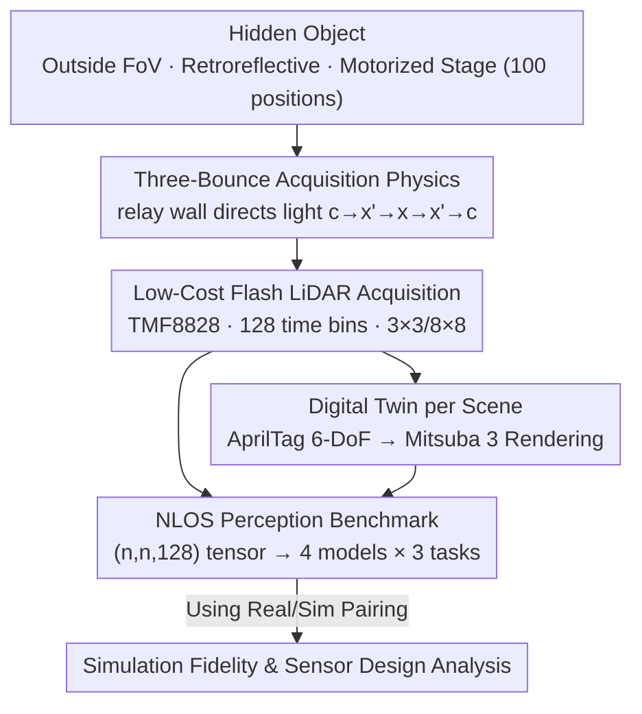

# DENALI: A Dataset Enabling Non-Line-of-Sight Spatial Reasoning with Low-Cost LiDARs

**Conference**: CVPR 2026  
**Paper**: [CVF Open Access](https://openaccess.thecvf.com/content/CVPR2026/html/Behari_DENALI_A_Dataset_Enabling_Non-Line-of-Sight_Spatial_Reasoning_with_Low-Cost_LiDARs_CVPR_2026_paper.html)  
**Code**: Not explicitly open-sourced yet (Project page https://nikhilbehari.github.io/denali )  
**Area**: 3D Vision / LiDAR Perception / Dataset  
**Keywords**: Non-line-of-sight perception, low-cost LiDAR, transient imaging, three-bounce reflection, digital twin

## TL;DR
DENALI is the first large-scale real-world "spatiotemporal histogram" dataset captured using a consumer-grade flash LiDAR costing approximately \$10 (ams TMF8828). It features 72,000 hidden object scenes, each paired with a physically rendered digital twin. The dataset demonstrates that multi-bounce photon signals discarded by consumer LiDARs are sufficient to support data-driven non-line-of-sight (NLOS) object localization, shape classification, and size estimation (achieving a localization RMSE of 0.046m and a size estimation accuracy of 0.95).

## Background & Motivation
**Background**: Consumer-grade dToF (direct time-of-flight) LiDARs have become ubiquitous in phones, robots, and AR/VR systems. They emit laser pulses and record photon return times with picosecond precision using Single-Photon Avalanche Diodes (SPADs), accumulating these arrival times into a **temporal histogram**. However, in practical use, the entire histogram is compressed into a single depth value corresponding to the "primary peak" and saved to a point cloud, while the remaining signals are discarded.

**Limitations of Prior Work**: Besides the primary peak (representing direct single reflection), the histogram contains late-arriving, weaker **multi-bounce photons**. These photons bounce off visible surfaces, travel to hidden objects outside the direct line of sight, and then return, thereby encoding clues about the occluded geometry. This forms the physical foundation of non-line-of-sight (NLOS) imaging. Yet, almost all existing NLOS methods rely on laboratory-grade setups: scanning LiDARs, collimated lasers, ultra-high temporal resolution detectors, and highly controlled environments. Consumer LiDARs represent the exact opposite—they use **flood illumination** (illuminating the entire scene at once), have coarse spatial/temporal resolutions, suffer from crosstalk and noise that are difficult to model, and operate in noisy, real-world environments. Consequently, traditional NLOS reconstruction cannot run on consumer-grade hardware, and NLOS perception has never been truly demonstrated on such devices until now.

**Key Challenge**: The contradiction between the fact that consumer LiDARs "naturally record complete photon histograms, are highly scalable, and are already deployed at scale" and their "poor hardware performance, making them incompatible with traditional reconstruction methods." Reconstruction demands precise physical inverse problem solving, placing strict requirements on hardware; however, **perception**—simply knowing where the hidden object is, what shape it has, and its size—might not require such strong signals as reconstruction does.

**Goal**: Rather than forcing reconstruction, this paper asks: how strong of an NLOS perception can consumer-grade LiDAR's multi-bounce signals actually support? Is the bottleneck in the scene, the model, or the simulation? To answer these questions, a dataset must first be established.

**Key Insight**: Rather than focusing solely on algorithmic improvements, this work seeks to **quantify performance boundaries** using large-scale real-world measurements. This represents a paradigm shift toward "data-driven NLOS," reframing the problem from "designing physical reconstruction operators" to "learning perception directly from data."

**Core Idea**: Constructing DENALI, the first large-scale real-world dataset specifically designed to stimulate measurable three-bounce return echoes, paired with a physically rendered digital twin for every scene. This transforms the investigation of "low-cost LiDAR NLOS capability, limiting factors, and the sim-to-real gap" into a benchmarkable, quantitatively analyzable problem.

## Method
DENALI is inherently a **dataset + benchmark** work, so the "method" is split into two halves: the first half is how invisible objects are translated into learnable signals (acquisition physics + large-scale acquisition setup + digital twins), and the second half is how tasks are defined and which models are used to quantify these capabilities.

### Overall Architecture
The entire workflow can be viewed as a "physics $\to$ acquisition $\to$ pairing $\to$ benchmark" pipeline. First, a relay wall is used to direct illumination to the hidden object outside the field of view, with retroreflective tape on the object surface enhancing the three-bounce return echoes. A flash LiDAR costing around \$10 records the complete histogram across 128 temporal bins. The same scene's 6-DoF pose is calibrated using AprilTags to render a digital twin in Mitsuba 3. Finally, each acquired tensor of shape $(n, n, 128)$ is fed into four models with different inductive biases to run localization, classification, and size estimation tasks. The paired real/sim data is also used to analyze simulation fidelity and sensor design.

### Key Designs

**1. Three-Bounce Acquisition Physics: Using a Relay Wall to "Illuminate" and Retrieve Signals from Outside the FoV**

The bottleneck is that the hidden object is outside the LiDAR's direct line of sight; hence, single-bounce reflection cannot capture it. DENALI adopts the classic confocal NLOS geometry—pointing the LiDAR toward a flat, vertical **relay wall** that serves as an intermediate surface. The wall directs the illumination toward the hidden object outside the direct field of view, and then redirects the photons returning from the hidden object back to the sensor, forming a standard three-bounce reflection path $c \to x' \to x \to x' \to c$ (laser $\to$ wall point $x'$ $\to$ hidden object point $x$ $\to$ wall $\to$ detector). Since the distance from the camera to the wall can be read from the direct depth, the transient response at the wall point $x'$ can be written as an integral over the hidden volume:

$$\tau(x', t) = \int_\Omega \frac{\rho(x)\,\delta\!\left(2\|x'-x\| - ct\right)}{\|x'-x\|^4}\,dx$$

where $\rho(x)$ is the albedo of the hidden surface, $\delta(\cdot)$ enforces that only points whose round-trip distance $2\|x'-x\|$ exactly equals the flight distance $ct$ contribute at time $t$, and $\|x'-x\|^4$ represents the radiometric attenuation across both propagation paths. This equation describes the response under an ideal collimated laser and serves as the physical starting point for all subsequent designs. ⚠️ Please refer to Eq.(1) in the original paper for formula details.

**2. Real-World Signal Model of Low-Cost Flash LiDAR: Degradation from "Collimated" to "Flood + Wide FoV Integration"**

The ideal equation assumes a collimated laser hitting a single point, but consumer LiDARs (here, the ams TMF8828, ~\$10, 940nm, SPAD+on-chip TDC, 128 time bins) use **flood illumination**—illuminating the entire scene at once—and each pixel integrates over a wide instantaneous field of view (iFoV) rather than observing a single wall point. Thus, the histogram measured by pixel $p$ is a weighted sum of the contributions from all wall points within its field of view:

$$\tau_p(t) = \int_{A_p} w_p(x')\,\tau(x', t)\,dx'$$

where $A_p$ is the wall region imaged by pixel $p$, and $w_p(x')$ is the spatial sensitivity weight of that region. To ensure the weak three-bounce reflections remain measurable on such coarse hardware, the authors **apply retroreflective tape to the objects**, forcing light to return primarily along its incident direction, which significantly boosts the intensity of the three-bounce echoes. This degradation model paired with the retroreflective assumption is key to "seeing hidden objects with consumer-grade hardware" and explains why laboratory NLOS algorithms cannot be directly applied. The LiDAR supports both 3x3 and 8x8 spatial outputs, and both are captured for each scene. While 8x8 offers finer spatial sampling, the photons received per pixel drop drastically (as shown in Table 1, the total intensity of 8x8 is only around a dozen, whereas 3x3 ranges from hundreds to thousands).

**3. Large-Scale Real Acquisition Setup: Industrializing "Hard-to-Replicate Hidden Object Scenes" into 72,000 Captures**

To quantify NLOS perception, physics alone is not enough; scale and diversity are required. DENALI achieves this using a synchronized acquisition rig: the LiDAR and an Intel RealSense D435i RGB-D camera are mounted on a 3D-printed rigid bracket with known geometry, both pointing toward the relay wall. The hidden object is mounted on a **motorized stage** that samples **100 positions** on the ground plane $(x,y)$, all completely outside the sensor's direct field of view (guaranteeing that any measured signal can only be three-bounce reflections). An overhead RealSense tracking camera monitors the entire area. The objects consist of 3D-printed **30 shapes** (10 letters, 10 digits, 10 geometric shapes) $\times$ **two sizes** (4 inches / 8 inches) = 60 items, with known CAD models to facilitate ground truth and simulation. The final dimensions are $60 \text{ objects} \times 100 \text{ positions} \times 2 \text{ resolutions} \times 2 \text{ lighting conditions (on/off)} \times 3 \text{ trials}$, totaling **72,000 acquisitions**, comprising 2,628,000 full-histogram pixels and 336,384,000 ToF bin measurements. This orthogonal scanning of "object/position/lighting/resolution" is what allows subsequent analysis to decouple the impacts of scene factors (size, position, lighting) on perception.

**4. Digital Twin per Scene: Pairing Real and Sim with AprilTag Calibration + Mitsuba 3 to Power Sim-to-Real Research**

Where does NLOS simulation fall short, and can simulation be used to augment data? Answering these questions requires **scene-by-scene real-to-sim pairing**. DENALI attaches AprilTag markers (tag36h11, 6cm) to the tabletop, relay wall, LiDAR, and hidden objects. Across approximately 12,400 captures with ambient lights on, the pose of each marker is estimated. Outliers with $|z|>2$ are filtered out, and the remaining poses are averaged to obtain the 6-DoF ground truth poses of the LiDAR, object, wall, and tabletop. Combining these with the known rigid body transformations between markers and scene elements, the full 3D geometry is reconstructed in **Mitsuba 3** (including the ground truth mesh under the calibrated pose) to render digital twins that perfectly correspond to each real capture. Note that the poses are localized using AprilTags in the RGB stream, and the RealSense depth is only used for auxiliary validation without participating in the twin construction. Having these real-sim pairs allows for quantitative evaluation of what effects are missing in simulated histograms (pulse width, noise, jitter, intensity scaling).

### Loss & Training
The three tasks are supervised using their respective standard losses: Mean Squared Error (MSE) for localization, cross-entropy for shape classification, and binary cross-entropy for size estimation (4 in. vs 8 in.). All 3x3 samples (across size, position, lighting, and trials) are randomly split into **70/30** training/testing sets, and metrics are reported on the held-out test set. Inputs are uniformly formatted as $(n, n, 128)$ photon count tensors. Main analyses focus on the 3x3 resolution, while 8x8 results are provided in the supplementary material.

## Key Experimental Results

### Statistical Characteristics of Three-Bounce Signals (Table 1)
For each capture, the "no object" background of the same scene is subtracted to isolate the three-bounce reflection. Its intensity, centroid, spread, and skew are analyzed. The most intuitive finding is the photon intensity gap between 3x3 and 8x8—although 8x8 has finer spatial resolution, the photons per pixel drop dramatically:

| Resolution | Lighting | Size | Total Intensity | Centroid (bin) | Spread (bin) |
|------------|----------|------|-----------------|----------------|--------------|
| 3×3        | On       | 4in  | 560.4 ± 6.1     | 91.6           | 12.3         |
| 3×3        | On       | 8in  | 1468.3 ± 14.3   | 96.4           | 8.7          |
| 3×3        | Off      | 8in  | 2448.6 ± 16.3   | 96.6           | 12.0         |
| 8×8        | On       | 4in  | 11.7 ± 0.1      | 94.7           | 15.9         |
| 8×8        | Off      | 8in  | 19.0 ± 0.1      | 97.5           | 16.4         |

It can be seen that the return intensity of the 8-inch object is much higher than that of the 4-inch object, and the signal is cleaner and stronger when ambient light is off, which foreshadows the subsequent conclusion that "larger objects are easier to perceive."

### NLOS Perception Benchmark (Table 2, 3x3 Resolution)
Overall performance of four models (MLP, 1D CNN, 3D CNN, and Transformer) across three tasks:

| Task | Metric | MLP | 1D CNN | 3D CNN | Transformer |
|------|--------|-----|--------|--------|-------------|
| Localization | RMSE↓ (m) | 0.1045 | **0.0456** | 0.0475 | 0.0579 |
| Localization | MAE↓ (m) | 0.0907 | **0.0324** | 0.0337 | 0.0428 |
| Classification | Top-1↑ | 0.0665 | **0.3876** | 0.3523 | 0.1167 |
| Classification | Macro-F1↑ | 0.0389 | 0.3832 | **0.4377** | 0.1003 |
| Size | Accuracy↑ | 0.5363 | **0.9468** | 0.9298 | 0.8722 |

Key findings: A histogram from an approximately \$10 LiDAR is sufficient to support NLOS perception, achieving a best localization RMSE of 0.046m, best classification Macro-F1 of 0.44, and size accuracy of 0.95. Convolutional models (1D/3D CNN) consistently perform the best, showing that "inductive bias toward local temporal structures" fits this histogram data best. Conversely, Transformer (pure temporal tokens without spatial bias) and MLP (lacking any bias) lag behind significantly.

### Scene Factors and Model Weaknesses
- **Size and Position Dominate Perception Difficulty**: 8-inch objects can be accurately localized over a larger spatial range and yield consistently higher classification accuracy (8-inch classification Top-1 of 0.4573 vs. 4-inch of 0.3191 in Table 2). Objects closer to the relay wall are easier to perceive, though **objects placed too close to the wall** fail to localize because the first-bounce and three-bounce return echoes overlap.
- **3D CNN Does Not Outperform 1D CNN**: Although a 3D CNN can exploit spatial cues across pixels, it does not surpass the 1D CNN in localization/classification, indicating that current models struggle to **effectively utilize the coarse spatial information** present in low-resolution LiDAR.
- **Models Do Not Disentangle Object, Geometry, and Illumination**: A model trained under one setting exhibits **different spatial error patterns** under different lighting conditions (theoretically, global lighting should scale error uniformly). This reveals that current models do not cleanly decouple object attributes, scene geometry, and ambient light, highlighting an important open problem for robust NLOS perception.

### Application 1: Impact of Simulation Fidelity on Sim-to-Real (Fig. 9)
A 1D CNN is trained on central-pixel 3x3 histograms rendered with MiTransient for localization. Three calibration functions (global scaling, pulse width matching, and noise matching) are sequentially learned to improve simulation fidelity, alongside gradually adding real samples. Conclusion: **Higher simulation fidelity leads to better transfer, but with diminishing returns**; when fidelity is low, adding real data provides the largest gain. DENALI thus serves as a benchmark to quantify "how much error reduction each simulation effect is worth."

### Application 2: Impact of Sensor Jitter on Tasks (Table 3)
By convolving the histograms with Gaussian kernels of varying FWHM to simulate detector timing jitter (added both during training and evaluation), the tolerance of each task is analyzed:

| Timing Jitter (ps) | Localization RMSE↓ | Classification Top-1↑ | Size Accuracy↑ |
|--------------------|--------------------|-----------------------|----------------|
| 0 (Baseline)       | 0.0804             | 0.1554                | 0.8616         |
| ~50                | 0.0802             | 0.1525                | 0.8599         |
| ~100               | 0.0802             | 0.1684                | 0.8616         |
| ~600               | 0.0819             | 0.1260                | 0.7944         |

Localization and size estimation remain virtually unaffected within 100ps jitter and only show noticeable degradation at 600ps. This indicates that different tasks have different minimum hardware requirements for temporal resolution, which in turn can guide "what precision sensor to select or design for a given NLOS application."

## Highlights & Insights
- **Paradigm Shift**: This work transitions the consumer LiDAR NLOS problem from "physical reconstruction" to "data-driven perception." While reconstruction is highly demanding on hardware and often unfeasible, perception tasks like localization, classification, and size estimation have much lower signal requirements. Consequently, "discarded multi-bounce signals" are proven useful on \$10 hardware for the first time—a remarkable realization.
- The collection engineering comprising **retroreflective tape + relay wall + motorized stage** industrializes "hard-to-replicate hidden object experiments" into 72,000 orthogonal scans, enabling the decoupled analysis of how "size, position, and lighting" impact NLOS perception for the first time.
- The **scene-by-scene digital twins** serve as high-value assets. They turn three critical questions—"where does simulation fall short, can simulation be used to augment data, and how good does the sensor need to be"—into quantitative benchmarks. This real-sim pairing methodology can be transferred to any sensing task where real-world data collection is expensive and simulation is desired for data expansion.
- **The diagnostic findings are highly solid**: Specifically, the observations that 3D CNNs do not beat 1D CNNs, and that error patterns vary under different lighting conditions, pinpoint specific areas of improvement—namely, model failure in exploiting spatial cues and lack of lighting disentanglement—rather than offering vague suggestions like "there is still room for improvement."

## Limitations & Future Work
- **Controlled Rather than Unconstrained Wild Environments** (explicitly noted by the authors): The scenes are controlled—using retroreflective objects, constrained within a known bounding region, and fixing the sensor, tabletop, and wall. This represents "best-case" characterization and does not reflect dynamic changes in real-world environments. Generalizing to unconstrained scenes remains an open research direction.
- **Single Sensor Model**: Data was collected solely using the ams TMF8828. While representative, it is not identical to other compact dToF sensors (e.g., STMicroelectronics VL53L8CX), and cross-model generalization has not been verified.
- **Retroreflective Assumption**: The signals are boosted by retroreflective tape; capability would degrade for non-retroreflective materials (generalization experiments are included in the supplementary material). Most real-world objects do not have retroreflective coatings.
- **Limited Absolute Performance**: The Macro-F1 for 30-class shape classification is only about 0.44, indicating that "perceivable" does not equal "highly accurate perception." It is still far from deployment-grade shape recognition.
- **Future Directions**: Developing models that can explicitly factorize the "object-geometry-illumination" relationship, designing architectures capable of leveraging coarse spatial cues in low-resolution LiDARs, and improving simulation fidelity to expand data cheaply.

## Related Work & Insights
- **vs. Traditional NLOS Reconstruction (Lab-grade Scanning LiDAR)**: Prior works use collimated lasers and high-temporal-resolution detectors under controlled lab settings to **reconstruct** hidden geometries. This work performs **perception** (rather than reconstruction) using flood-illuminated, coarse-resolution consumer hardware, sacrificing reconstruction fidelity for scalability, deployability, and large-scale data collection.
- **vs. Point Cloud LiDAR Datasets (KITTI / nuScenes / Waymo / SemanticKITTI)**: These datasets treat LiDAR as "one depth value per pixel," discarding the entire histogram. DENALI preserves the **complete temporal histogram**, extracting value from the discarded multi-bounce signals.
- **vs. Existing Low-Cost LiDAR NLOS Works**: Few prior exploratory works exist, but they were conducted in minor, highly controlled conditions. DENALI introduces the first large-scale real-world dataset spanning diverse objects, poses, and acquisition settings to adequately characterize and benchmark this class of sensor's NLOS capability.
- **Analogy to ImageNet**: The authors position DENALI as the "first step toward ImageNet for NLOS perception"—using large-scale benchmarking and modern learning methods to revitalize a field previously constrained by physical reconstruction.

## Rating
- Novelty: ⭐⭐⭐⭐⭐ First large-scale real-world dataset for low-cost LiDAR NLOS + data-driven perception paradigm + scene-by-scene digital twins; highly pioneering.
- Experimental Thoroughness: ⭐⭐⭐⭐ Three tasks × four models benchmark + scene factors analysis + two applications (simulation and sensor jitter), providing comprehensive coverage. However, absolute performance and cross-model generalization still need further studies.
- Writing Quality: ⭐⭐⭐⭐⭐ Logical presentation flows seamlessly from physical motivation, acquisition setup, and digital twins, to benchmarks and diagnostic insights; highly reproducible.
- Value: ⭐⭐⭐⭐⭐ Proves the feasibility of utilizing "multi-bounce light usually discarded by mobile/robotics LiDARs" for deployable NLOS perception. High utility of the open-sourced dataset and twins.

<!-- RELATED:START -->

## Related Papers

- [\[CVPR 2026\] X-band Radar Non-Line-of-Sight Imaging](x-band_radar_non-line-of-sight_imaging.md)
- [\[CVPR 2026\] Seeing through boxes: Non-Line-of-Sight 3D Reconstruction from Radar Signals](seeing_through_boxes_non-line-of-sight_3d_reconstruction_from_radar_signals.md)
- [\[CVPR 2026\] SpatialVID: A Large-Scale Video Dataset with Spatial Annotations](spatialvid_a_large-scale_video_dataset_with_spatial_annotations.md)
- [\[CVPR 2026\] Learning Multi-View Spatial Reasoning from Cross-View Relations](learning_multi-view_spatial_reasoning_from_cross-view_relations.md)
- [\[CVPR 2026\] 3DReflecNet: A Large-Scale Dataset for 3D Reconstruction of Reflective, Transparent, and Low-Texture Objects](3dreflecnet_a_large-scale_dataset_for_3d_reconstruction_of_reflective_transparen.md)

<!-- RELATED:END -->
