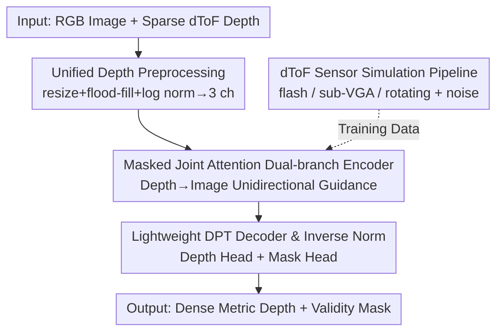

# Dense Metric Depth Completion from Sparse Direct Time-of-Flight Sensors

**Conference**: CVPR 2026  
**Paper**: [CVF Open Access](https://openaccess.thecvf.com/content/CVPR2026/html/Kim_Dense_Metric_Depth_Completion_from_Sparse_Direct_Time-of-Flight_Sensors_CVPR_2026_paper.html)  
**Code**: Open-sourced as promised (paper, models, and project page); repository URL pending  
**Area**: 3D Vision  
**Keywords**: Depth Completion, dToF Sensors, Metric Depth, Zero-shot Generalization, Cross-modal Fusion  

## TL;DR
Addressing the "extremely sparse + low resolution + noisy" depth maps from direct Time-of-Flight (dToF) sensors, this paper proposes a **depth-guided dual-branch ViT encoder with masked joint attention**. This allows sparse depth to unidirectionally guide RGB features without being contaminated by RGB cues, coupled with a lightweight DPT decoder to directly output dense metric depth. Trained entirely on a simulation pipeline covering flash/rotating dToF synthetic data, the model achieves zero-shot generalization across 6 datasets and 3 real dToF devices, matching or exceeding Prev. SOTA while being 20× faster and using 10× less VRAM.

## Background & Motivation
**Background**: Dense metric depth is essential for VR/XR, robotics, and 3D perception. Monocular depth foundation models (e.g., Depth Anything, MoGe) exhibit strong in-the-wild generalization but use scale-invariant loss, resulting in **scale ambiguity** and a failure to recover reliable absolute metric depth in complex real scenes.

**Limitations of Prior Work**: A common remedy is integrating sparse dToF measurements (LiDAR, low-resolution ToF) to anchor the true scale. However, existing depth completion methods have two major flaws: (1) **Sensor-specific coupling**—designs tailored for specific sampling patterns (fixed-line LiDAR, fixed-res ToF) break when devices change or when depth becomes extremely sparse/noisy. (2) **Heavy computation**—recent high-accuracy methods utilizing diffusion (Marigold-DC), iterative optimization (OMNI-DC), or multi-stage refinement (PriorDA) involve massive computational overhead, making them impractical for mobile or real-time scenarios.

**Key Challenge**: Existing methods treat "sparse depth as an auxiliary signal" and rely primarily on pre-trained monocular encoders, failing to model the **complementary and mutually constraining** structures between RGB appearance and geometric measurements. Consequently, it is difficult to balance generalization (cross-device/sparsity) and efficiency (avoiding heavy refinement).

**Goal**: Develop a **single model** that covers various sparse dToF devices and extreme sparsity/noise scenarios while remaining lightweight. This requires: (1) Ensuring sparse depth truly "guides" image features without being overwhelmed; (2) Producing high-quality dense metric depth without diffusion, iteration, or multi-stage refinement; (3) Overcoming the scarcity of paired training data.

**Key Insight + Core Idea**: The authors observe that simple concatenation or standard cross-attention allows unreliable RGB cues to contaminate accurate sparse depth. The **Core Idea** is to use a **unidirectional masked joint attention** that only allows "depth → image" guidance while blocking "image → depth" feedback. Combined with a simulation pipeline generating millions of synthetic scenes covering various dToF modalities, a zero-shot robust lightweight model is trained.

## Method

### Overall Architecture
Input consists of a high-resolution RGB image $I \in \mathbb{R}^{H\times W\times 3}$ and a sparse depth map $Z \in \mathbb{R}^{H\times W}$. The goal is to output dense metric depth $\tilde{D} \in \mathbb{R}^{H\times W}$ and a validity mask $\tilde{M}$ (marking unreliable areas like sky/reflections). The pipeline follows four steps: Heterogeneous dToF depth is first **preprocessed into a unified representation** with log-normalization; a **dual-branch ViT encoder** separately encodes RGB and sparse depth, using **masked joint attention** for controlled fusion; a **lightweight DPT decoder** predicts normalized depth and masks; finally, **inverse normalization** using recorded scale parameters restores the metric depth. The entire system is trained on data from a **dToF simulation pipeline**.

### Key Designs

**1. Unified Depth Representation Preprocessing: Aligning Diverse dToF Depth for DINOv2**

Since dToF resolutions and sampling patterns (point grids, low-res grids, line scans) vary wildly, direct feeding prevents generalization. Ours upsamples the sensor depth and its mask to RGB resolution and uses **nearest neighbor interpolation + flood-fill** to create a continuous depth field (preserving local geometry). Crucially, the **validity mask remains sparse**, allowing the network to distinguish "real measurements" from "interpolated pixels."

To reuse DINOv2 pre-trained ViT weights for the depth branch, **log-normalization** aligns the depth distribution with RGB inputs:

$$\alpha = \log(Z_{\max}) - \log(Z_{\min}), \quad \beta = \log(Z_{\min}), \quad \hat{Z} = (\log Z - \beta)/\alpha$$

where $Z_{\min}, Z_{\max}$ are the min/max values of original valid depths. Log-normalization compresses large depth ranges and stabilizes scale variations. The normalized depth is replicated across the first two channels, with the third channel containing the sparse validity mask, forming a "3-channel depth input" scaled to $[-1,1]$. Parameters $\alpha, \beta$ are stored for inverse normalization.

**2. Masked Joint Attention Dual-branch Encoder: Unidirectional Guidance**

This is the core innovation. The encoder uses parallel ViT branches (RGB and normalized sparse depth). Instead of standard cross-attention, it uses **joint attention with a directional mask**. Image and depth tokens (query/key/value) are concatenated: $Q=[Q_I; Q_Z]$, $K=[K_I; K_Z]$, $V=[V_I; V_Z]$. A mask $G$ is applied during attention:

$$\text{Attention}(Q,K,V) = \text{softmax}\!\left(\frac{QK^{\top}\odot G}{\sqrt{d_k}}\right)V, \quad G=\begin{bmatrix} 1 & 1 \\ 0 & 1 \end{bmatrix}$$

The mask $G$ enforces **asymmetric information flow**: "depth → image" attention is allowed (accurate depth guides image features), but **"image → depth" attention is blocked** (preventing unreliable RGB cues from contaminating geometric depth). This yields depth-aware image embeddings while preserving depth feature purity. Furthermore, since the structure matches standard ViT self-attention, **both branches are initialized with DINOv2 weights**, injecting large-scale visual/geometric priors.

**3. Lightweight DPT Decoder and Inverse Normalization: Direct Metric Depth Extrapolation**

The decoder uses the DPT architecture with two lightweight branches: one for the validity mask and one for the dense **normalized depth** $\hat{D}$. Metric depth is restored via:

$$\tilde{D} = \exp(\alpha \cdot \hat{D} + \beta)$$

Since $\hat{D}$ is **not constrained to $[0,1]$**, the decoder can extrapolate depth beyond the sensor's range $[Z_{\min}, Z_{\max}]$ (e.g., distant regions). The lack of diffusion or iterative refinement makes this 1-2 orders of magnitude lighter than OMNI-DC/Marigold-DC.

**4. dToF Sensor Simulation Pipeline: Scaling Synthetic Data for Zero-shot Robustness**

Given the scarcity of paired "High-res GT + dToF" data, Ours simulates dToF depth from large-scale synthetic RGB-D datasets. It covers two categories: (a) **flash dToF**—extremely sparse point clouds (64~10K points) and **sub-VGA flash** (low-res dense maps with edge degradation modeled via Perlin noise). (b) **rotating dToF**—simulating line scanning patterns (e.g., Velodyne VLP-16/32). **Noise augmentation** (Gaussian, spatial jitter, 0.2-1.0% outliers, and inpainting with irregular masks) teaches the model to handle real-world artifacts.

### Loss & Training
The total loss is $\mathcal{L} = \mathcal{L}_1 + \mathcal{L}_g + \mathcal{L}_l + \mathcal{L}_m$.

- **Depth-weighted L1**: $\mathcal{L}_1 = \sum_{i\in\mathcal{M}} \frac{1}{d_i}|\tilde{d}_i - d_i|_1$. Inverse depth weighting prevents overfitting to large distant values.
- **Global/Local Scale-invariant Loss**: $\mathcal{L}_g$ and $\mathcal{L}_l$ use ROE solvers to maintain global scale consistency and local geometric structure.
- **Mask Loss**: $\mathcal{L}_m$ uses binary cross-entropy to train the validity head.

Training details: ViT-Small (DINOv2) encoder; features from layers 6 and 12 fed to the DPT decoder; support for dynamic token counts; AdamW; trained for 100k iterations on 8x A100.

## Key Experimental Results

### Main Results
Zero-shot generalization on real sensors (KITTI-DC, ZJUL5) and simulated sparse points (DDAD, DIODE, ETH3D, iBims-1). Average Rel and $\delta < 1.025$ are reported. 

| Dataset / Metric | OMNI-DC | PromptDA(ViT-S) | PriorDA(ViT-B) | Marigold-DC | Ours(ViT-S) |
|--------------|---------|-----------------|----------------|-------------|-------------|
| KITTI-DC Rel↓ | **1.48** | 2.90 | 2.76 | 5.50 | 2.00 |
| ZJUL5 Rel↓ | 12.92 | 13.25 | 11.13 | 12.77 | **11.13** |
| ETH3D Rel↓ | 1.05 | 2.67 | 1.04 | 1.80 | **0.84** |
| **Avg. Rel↓** | 3.77 | 5.09 | 3.99 | 6.11 | **3.46** |
| **Avg. δ↑** | 79.0 | 66.3 | 74.5 | 59.1 | 77.9 |
| Inference Time↓ | 638 ms | 30 ms | 197 ms | 6470 ms | **34 ms** |
| VRAM↓ | 3.49 GB | 0.40 GB | 1.62 GB | 5.71 GB | **0.44 GB** |

Ours achieves the lowest average Rel (3.46). It is ~20× faster and uses ~10× less VRAM than OMNI-DC while maintaining better or comparable accuracy.

### Ablation Study
Architecture components (Avg. Rel / δ):

| Configuration | Rel↓ | δ↑ | Description |
|------|------|------|------|
| Depth prompting | 4.07 | 73.6 | Depth injected only at decoder neck (like PromptDA) |
| Joint attention | 3.87 | 75.6 | Joint attention **without directional mask** |
| Masked joint attention (Ours, ViT-S) | 3.46 | 77.9 | Full model |
| Ours, ViT-B | 3.28 | 79.0 | Larger backbone |

### Key Findings
- **Directional masking is vital**: Encoder-level fusion (3.87) outperforms decoder-level prompting (4.07); adding the directional mask (3.46) provides a significant boost, verifying the importance of blocking image-to-depth influence.
- **Scalability**: Performance improves monotonically from ViT-S to ViT-L.
- **Superior at extreme sparsity**: Ours maintains the highest accuracy at 100 points, demonstrating robustness to input density changes.

## Highlights & Insights
- **Asymmetric Information Flow**: The $2\times2$ mask $G$ encodes the intuition "let the reliable guide the noisy, but prevent the noisy from polluting the reliable." This plug-and-play design is highly transferable.
- **Expressive Encoder, Lightweight Decoder**: Contrary to the "diffusion/iteration" trend, Ours proves that superior encoder-level fusion allows for lightweight decoding, providing a 20× speed advantage for real-world deployment.
- **Structural Isomorphism**: Designing the fusion layer to be isomorphic to ViT self-attention allows the depth branch to inherit large-scale vision priors from DINOv2 for free.
- **Simulation for Zero-shot**: Successfully transferring from pure synthetic training to 3 types of real devices highlights the scalability of physics-aware sensor simulation.

## Limitations & Future Work
- The paper lacks absolute error metrics like **RMSE/MAE**, making it hard to judge absolute geometric precision in millimeters.
- The unidirectional mask assumes depth is always more reliable than RGB; this may fail in scenarios with dToF multipath interference or specular reflections.
- Generalization to unmodeled sensor mechanisms (e.g., specific solid-state LiDAR patterns) is unknown.
- Reliability of extrapolation depends on the $Z_{\min}/Z_{\max}$ estimation, which can be sensitive to outliers.

## Related Work & Insights
- **vs. PromptDA**: Ours fuses in the **encoder** via masked joint attention rather than the decoder neck, yielding better accuracy (3.46 vs 4.07) and cross-device generalization.
- **vs. Marigold-DC**: Diffusion methods generalize well but are extremely slow (~6.4 seconds). Ours is ~200× faster and more robust to noise.
- **vs. OMNI-DC**: Iterative optimization is expensive (638 ms). Ours achieves better results in a single forward pass.

## Rating
- Novelty: ⭐⭐⭐⭐ (Simple but effective masked joint attention)
- Experimental Thoroughness: ⭐⭐⭐⭐⭐ (Zero-shot across 6 datasets and 3 devices)
- Writing Quality: ⭐⭐⭐⭐ (Method is clear, though absolute metrics are missing)
- Value: ⭐⭐⭐⭐⭐ (High industrial potential for VR/XR and mobile robotics)

<!-- RELATED:START -->

## Related Papers

- [\[CVPR 2026\] MD2E: Modeling Depth-to-Edge Cues for Monocular Metric Depth Estimation](md2e_modeling_depth-to-edge_cues_for_monocular_metric_depth_estimation.md)
- [\[CVPR 2026\] LiteSense: Lifting Lightweight ToF with RGB for High-Resolution Metric Depth Estimation](litesense_lifting_lightweight_tof_with_rgb_for_high-resolution_metric_depth_esti.md)
- [\[CVPR 2026\] EventHub: Data Factory for Generalizable Event-Based Stereo Networks without Active Sensors](eventhub_data_factory_for_generalizable_event-based_stereo_networks_without_acti.md)
- [\[CVPR 2026\] Depth Any Panoramas: A Foundation Model for Panoramic Depth Estimation](depth_any_panoramas_a_foundation_model_for_panoramic_depth_estimation.md)
- [\[CVPR 2026\] DiffSoup: Direct Differentiable Rasterization of Triangle Soup for Extreme Radiance Field Simplification](diffsoup_direct_differentiable_rasterization_of_triangle_soup_for_extreme_radian.md)

<!-- RELATED:END -->
