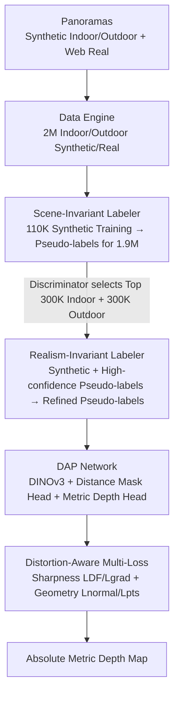

# Depth Any Panoramas: A Foundation Model for Panoramic Depth Estimation

**Conference**: CVPR 2026  
**Paper**: [CVF Open Access](https://openaccess.thecvf.com/content/CVPR2026/html/Lin_Depth_Any_Panoramas_A_Foundation_Model_for_Panoramic_Depth_Estimation_CVPR_2026_paper.html)  
**Code**: https://insta360-researchteam.github.io/DAP_website/ (Project Page)  
**Area**: 3D Vision  
**Keywords**: Panoramic Depth Estimation, Metric Depth, Foundation Model, Pseudo-label, Equirectangular Distortion  

## TL;DR
This paper proposes DAP (Depth Any Panoramas), a foundation model for panoramic **metric** depth estimation. Utilizing a "data-in-the-loop" approach, it feeds 2M indoor/outdoor and synthetic/real panoramic images into a three-stage pseudo-label distillation pipeline. Combined with a DINOv3 backbone, a plug-and-play distance mask head, and a set of distortion-aware geometric/sharpness losses, DAP achieves zero-shot SOTA on multiple benchmarks including Stanford2D3D, Matterport3D, and Deep360, providing particularly stable absolute scale predictions for outdoor long-range and sky regions.

## Background & Motivation
**Background**: Panoramic images cover a complete $360^{\circ} \times 180^{\circ}$ field of view, which is of great value for spatial intelligence tasks such as robot navigation and obstacle avoidance. Existing panoramic depth methods fall into two categories: relative/scale-invariant depth (PanDA, Depth Anywhere, DA2) and unified metric depth frameworks (DAC, UniK3D).

**Limitations of Prior Work**: Both categories struggle to generalize to diverse real-world scenes, **especially outdoors**. The root cause is that panoramic depth data is "small and narrow": high acquisition and annotation costs lead to small training sets and limited domain coverage (either indoor-only or synthetic-only). As shown in Table 1, previous methods use at most 800,000 images, mostly lacking real outdoor annotations.

**Key Challenge**: To build a robust foundation model, data scaling is essential. However, ground truth (GT) for panoramic depth (especially absolute scale for outdoor long-range views) is nearly impossible to annotate at scale—there is a **fundamental contradiction between the "need for massive reliable GT" and the "inability to obtain GT cheaply."** Simultaneously, the model must be capable of digesting this scale and handling the non-uniform distortion of Equirectangular Projection (ERP).

**Goal**: The problem is decomposed into two sub-problems: (1) how to construct a large-scale dataset with reliable high-quality GT; (2) how to design a model that can ingest this data scale while maintaining cross-view geometric consistency.

**Key Insight**: The authors adopt a "data-in-the-loop" paradigm, focusing on both data construction and framework design. They use pseudo-labels generated by the model itself to supplement missing GT, and then feed high-confidence screened pseudo-labels back into training.

**Core Idea**: A "three-stage progressive pseudo-label distillation" transforms 1.9M unlabeled panoramas into trainable supervision. Coupled with a DINOv3 backbone, a distance mask head, and distortion-aware losses, panoramic metric depth is established as a unified foundation model across indoor/outdoor and synthetic/real domains.

## Method

### Overall Architecture
DAP consists of three main components: a **large-scale data engine** across synthetic/real domains (Sec 3.1), a **three-stage pseudo-label pipeline** to extract utility from unlabeled data (Sec 3.2), and a geometrically consistent **network design + multi-loss optimization** (Sec 3.3).

The input is a panorama (ERP representation, training resolution $512 \times 1024$), and the output is a dense **absolute metric depth map** (in meters, requiring no post-processing for scale alignment). The key transformation is as follows: the data engine gathers approximately 2M images (90K labeled + 1.9M unlabeled). The three-stage pipeline uses two progressively enhanced Labelers to provide reliable pseudo-labels for unlabeled images. Finally, DAP is jointly trained on "all annotations + refined pseudo-labels."

### Key Designs

**1. Large-Scale Data Engine: Collecting 2M Panoramas via Simulators + Generative Models + Web Crawling**

To address the "small and narrow" panoramic depth data, the authors combine four sources into DAP-2M. For labeled data: indoors use Structured3D (approx. 18K images with GT); outdoors utilize the AirSim360 simulator in UE5 to render—simulating drone flight paths at low-to-medium altitudes across five representative scenes (New York City, SF City, Downtown West, City Park, Rome), yielding 90K pixel-aligned depth panorama frames (named DAP-2M-Labeled) to fill the gap in outdoor supervision. For unlabeled data: 1.7M high-quality images are extracted from 250K web panoramic videos after filtering unreasonable horizon samples, then automatically categorized by Qwen2-VL into indoor/outdoor (approx. 250K indoor + 1.45M outdoor). Since real indoor panoramas are still scarce, 200K indoor images are generated using the SOTA generative model DiT360, totaling 1.9M for DAP-2M-Unlabeled. The final scale is ~2M, 2-3 times larger than previous methods, **covering all four quadrants of indoor/outdoor $\times$ synthetic/real at scale for the first time.**

**2. Three-Stage Progressive Pseudo-label Pipeline: Learning Cross-Scene, Cross-Realism, and Distilling to DAP**

To solve the "unlabeled data cannot be trained directly + domain gap between synthetic/real and indoor/outdoor," a multi-stage refinement process is designed. **Stage 1 (Scene-Invariant Labeler)**: The first Labeler is trained on 20K synthetic indoor + 90K synthetic outdoor images (both with accurate metric GT). The goal is to learn physically grounded depth cues that hold across both indoor and outdoor environments, rather than overfitting to specific layouts/lighting, thereby producing reliable initial pseudo-labels for real images. **Stage 2 (Realism-Invariant Labeler)**: First, a PatchGAN-style depth quality discriminator is trained (treating synthetic GT as "real" and Stage-1 output as "fake") to learn a "scene-agnostic" quality prior. Then, the Stage-1 Labeler labels all real unlabeled images, and the discriminator selects the Top 300K indoor + 300K outdoor high-confidence samples. These are mixed with synthetic data to train the second Labeler—this step allows the Labeler to break free from synthetic textures/lighting and become robust to real-world appearance variations. **Stage 3 (DAP Training)**: The final DAP model is jointly trained using 1.9M refined pseudo-labels from the Realism-Invariant Labeler and the original annotated data, embedding the benefits of large-scale semi-supervised learning into the foundation model. This cycle of "quality prior screening → high-confidence subset retraining" is the manifestation of the data-in-the-loop approach.

**3. Plug-and-play Distance Mask Head: Mitigating Depth Distribution Imbalance via Threshold Masks**

Given the extreme range of panoramic scenes (from meters indoors to hundreds of meters outdoors), depth distribution is severely imbalanced, often leading to prediction collapse in far-field/sky regions. The authors parallelize two task heads on the DINOv3-Large backbone: a **metric depth head** predicting dense depth $D$, and a **distance mask head** outputting a binary mask $M$ to mark valid spatial regions under a specific distance threshold. The mask head provides four plug-and-play versions (10m/20m/50m/100m), which can be flexibly switched based on the scene scale. Each mask head is supervised by a weighted BCE + Dice loss:

$$L_{mask} = \|M - M_{gt}\|^2 + 0.5\, L_{Dice}(M, M_{gt})$$

The final output is the element-wise product $M \odot D$, filtering out unreliable far-field predictions to ensure physically valid and scale-consistent results across different distance ranges. Ablations show significant performance drops without the mask head (Table 6), with the 100m version performing best overall.

**4. Distortion-Aware Sharpness + Geometry Dual-Path Loss: Compensating for ERP Non-uniform Pixels and Ensuring Cross-View Consistency**

To address the oversampling at poles and non-uniform pixel geometry in ERP, as well as the limitations of SILog in recovering edge details and cross-view geometry, two sets of complementary losses are added. **Sharpness Side**: $L_{DF}$ (Dense Fidelity) first decomposes the depth map into $N=12$ perspective patches using virtual cameras at icosahedron vertices (avoiding polar stretching). On each distortion-free view, the Gram similarity between prediction and GT is calculated and averaged: $L_{DF} = \frac{1}{N}\sum_k \| D^{(k)}_{pred} D^{(k)\top}_{pred} - D^{(k)}_{gt} D^{(k)\top}_{gt}\|_F^2$, strengthening local sharpness. $L_{grad}$ uses the Sobel operator in the ERP domain to take gradient magnitudes and thresholds the GT gradient to obtain an edge mask $M_E$, computing SILog only in edge regions: $L_{grad} = L_{SILog}(M_E\odot D_{pred}, M_E\odot D_{gt})$, preserving boundary discontinuities. **Geometry Side**: $L_{normal}$ converts depth to surface normals and calculates $L1$ distance. $L_{pts}$ projects depth to spherical coordinates to get a 3D point cloud and takes $L1$ distance. Both enforce cross-view geometric consistency. The total objective is multiplied by a weight map $M_{distort}$ to compensate for polar oversampling and balance gradient contributions on the sphere:

$$L_{total} = M_{distort}\odot\big(\lambda_1 L_{SILog} + \lambda_2 L_{DF} + \lambda_3 L_{grad} + \lambda_4 L_{normal} + \lambda_5 L_{pts} + \lambda_6 L_{mask}\big)$$

Weights are set as $\lambda_{1\sim6} = 1.0, 0.4, 5.0, 2.0, 2.0, 2.0$.

### Loss & Training
- The total loss is $L_{total}$. The backbone learning rate is set to 5e-6, and the decoder to 5e-5, using the Adam optimizer.
- The Scene-Invariant Labeler is initialized with UniK3D weights; the Realism-Invariant Labeler shares the same architecture as DAP.
- Training resolution is $512 \times 1024$. Data augmentation includes color jittering, horizontal shifting, and flipping. Experiments were conducted on H20 GPUs.

## Key Experimental Results

### Main Results
**Zero-shot** metric depth comparison on three benchmarks (DAP predicts absolute scale directly; scale-invariant methods require GT for scale alignment and are provided for reference only):

| Dataset | Metric | DAP (Ours) | DAC | UniK3D |
|--------|------|-----------|-----|--------|
| Stanford2D3D (Indoor) | AbsRel↓ / δ1↑ | **0.0921 / 0.9135** | 0.1366 / 0.8393 | 0.1795 / 0.7823 |
| Matterport3D (Indoor) | AbsRel↓ / δ1↑ | **0.1186 / 0.8518** | 0.1803 / 0.7203 | 0.2224 / 0.6634 |
| Deep360 (Outdoor) | AbsRel↓ / RMSE↓ / δ1↑ | **0.0659 / 5.224 / 0.9525** | 0.2611 / 8.371 / 0.6311 | 0.0885 / 6.148 / 0.9293 |

The improvement is even more significant on the newly created outdoor benchmark DAP-Test (1,343 high-quality outdoor annotated images):

| Method | AbsRel↓ | RMSE↓ | δ1↑ |
|------|---------|-------|-----|
| DAC | 0.3197 | 8.799 | 0.5193 |
| UniK3D | 0.2517 | 10.56 | 0.6086 |
| **DAP (Ours)** | **0.0781** | **6.804** | **0.9370** |

AbsRel dropped from 0.2517 to 0.0781, and δ1 rose from 0.6086 to 0.937, validating the advantages of data scaling + a unified framework in outdoor settings.

### Ablation Study
Component ablation (progressive addition on Stanford2D3D / Deep360):

| Configuration | Stanford2D3D AbsRel↓ / δ1↑ | Deep360 AbsRel↓ / δ1↑ | Description |
|------|---------------------------|----------------------|------|
| baseline (SILog only) | 0.1166 / 0.8409 | 0.0942 / 0.8396 | Starting point |
| + distortion map | 0.1149 / 0.8440 | 0.0926 / 0.8423 | Stable optimization under ERP distortion |
| + geometric loss (Lnormal+Lpts) | 0.1112 / 0.8509 | 0.0880 / 0.8592 | Improved structural consistency |
| + sharpness loss (LDF+Lgrad) **Full** | **0.1084 / 0.8576** | **0.0862 / 0.8719** | Full model optimal |

Distance mask head threshold ablation (DAP-2M-Labeled / Deep360):

| Mask Threshold (m) | DAP-2M-Labeled AbsRel↓ / δ1↑ | Deep360 AbsRel↓ / δ1↑ | Description |
|------|------------------------------|----------------------|------|
| 10 | 0.0801 / 0.9315 | 0.0934 / 0.8493 | Strongest in near-field |
| 20 | 0.0823 / 0.9164 | 0.0873 / 0.8668 | — |
| 50 | 0.0864 / 0.9104 | 0.0843 / 0.8594 | — |
| 100 | 0.0793 / 0.9353 | 0.0862 / 0.8719 | Best overall |
| ✗ (No mask) | 0.0832 / 0.9042 | 0.0938 / 0.8411 | Significant drop |

### Key Findings
- Every step of adding the four types of losses leads to performance gains. **Sharpness losses ($L_{DF}+L_{grad}$) contribute to boundaries and details**, while **geometric losses ($L_{normal}+L_{pts}$) contribute to global structure**; they are complementary. The distortion map alone provides small but stable improvements.
- **The distance mask head is indispensable**: performance drops in both indoor and outdoor settings without it. The 10m/20m masks favor near-field accuracy, while 100m is best overall, indicating that filtering unreliable far-field predictions stabilizes training.
- Despite predicting absolute scale directly, DAP competes effectively with scale-invariant methods (e.g., DA2) that "cheat" via GT scale alignment, highlighting the value of massive data scaling for metric depth.
- Outdoor/sky/long-range regions were major failure points for previous methods (e.g., UniK3D often collapsed structurally in far-field). DAP maintains robust metric consistency in these areas.

## Highlights & Insights
- **Engineering "data-in-the-loop"**: This is not just raw data stacking. instead, it uses "simulators for outdoors + generative models for indoors + discriminators for high-confidence pseudo-label screening" to bridge the annotation gap. This approach is transferable to any dense prediction task where GT is expensive and unlabeled data is abundant.
- **Discriminator as quality prior for pseudo-label filtering**: Using a PatchGAN discriminator to learn "scene-agnostic depth quality" for ranking samples is more robust than simple confidence thresholding and is a reusable trick for semi-supervised distillation.
- **Plug-and-play distance mask head**: Decoupling "different scene scales" into multiple threshold masks allows for on-demand switching during inference, mitigating depth imbalance and providing deployment flexibility.
- **Icosahedral 12-view decomposition for sharpness loss**: Supervising details via distortion-free perspective patches bypasses polar stretching in ERP, representing a clever maneuver for handling panoramic distortion.

## Limitations & Future Work
- **Strong dependence on pseudo-label quality**: The upper bound of the pipeline is capped by the initial capability of the Scene-Invariant Labeler and the discriminative screening accuracy. Systematic biases in the initial Labeler for certain scene types could be amplified in DAP. ⚠️ The paper lacks quantitative analysis of pseudo-label error rates.
- **Outdoor GT reflects synthetic bias**: The 90K labeled outdoor samples are entirely from the UE5 simulator. Absolute scale GT for real outdoor panoramas remains scarce, raising questions about whether the sim-to-real gap is fully eliminated.
- **Discriminator and Stage-2 details in Supplemental**: Specific architecture and training details for the quality discriminator are not expanded upon in the main text, potentially raising the bar for reproduction.
- **Future Directions**: Iterative pseudo-label screening (rather than a fixed three-stage process) or uncertainty estimation to dynamically adjust pseudo-label weights could be explored.

## Related Work & Insights
- **vs DAC (Depth Any Camera)**: DAC uses ERP to unify various imaging geometries + geometry-driven augmentation for general metric depth but relies mostly on perspective training data and has weak real outdoor coverage. DAP builds a native panoramic large-scale data engine, leading significantly in outdoor scenarios (Deep360/DAP-Test).
- **vs UniK3D**: UniK3D uses spherical coordinates + harmonic ray representation to improve generalization for wide FoV. It performs well on Deep360, but its structure often collapses when generalizing to diverse real outdoors (e.g., far-field/sky). DAP remains stable in far-field through data scaling and the distance mask head.
- **vs DA2 / PanDA**: These are relative/scale-invariant methods requiring GT for scale alignment during evaluation. DAP is a metric depth model that outputs absolute scale directly while achieving comparable performance, demonstrating the utility of metric foundation models.

## Rating
- Novelty: ⭐⭐⭐⭐ The data-in-the-loop paradigm + three-stage pseudo-label pipeline is a systematic new solution for panoramic metric depth; individual components are often combinations of existing ideas.
- Experimental Thoroughness: ⭐⭐⭐⭐ Zero-shot across multiple benchmarks + two sets of ablations + the self-built DAP-Test; largely complete, though pseudo-label quality lacks quantification.
- Writing Quality: ⭐⭐⭐⭐ The data engine and pipeline are clearly explained; discriminator/Stage-2 details are relegated to supplemental material.
- Value: ⭐⭐⭐⭐ First unified panoramic metric depth foundation model for indoor/outdoor and synthetic/real; highly practical for robot navigation and spatial intelligence.

<!-- RELATED:START -->

## Related Papers

- [\[CVPR 2026\] VGGT-360: Geometry-Consistent Zero-Shot Panoramic Depth Estimation](vggt-360_geometry-consistent_zero-shot_panoramic_depth_estimation.md)
- [\[CVPR 2026\] UniDAC: Universal Metric Depth Estimation for Any Camera](unidac_universal_metric_depth_estimation_for_any_camera.md)
- [\[CVPR 2026\] SO(3)-Equivariant ViT-Adapter for Data-Efficient Zero-Shot Sim-to-Real Indoor Panoramic Depth Estimation](so3-equivariant_vit-adapter_for_data-efficient_zero-shot_sim-to-real_indoor_pano.md)
- [\[CVPR 2026\] Radar-Guided Polynomial Fitting for Metric Depth Estimation](radar-guided_polynomial_fitting_for_metric_depth_estimation.md)
- [\[ICLR 2026\] Depth Anything with Any Prior](../../ICLR2026/3d_vision/depth_anything_with_any_prior.md)

<!-- RELATED:END -->
