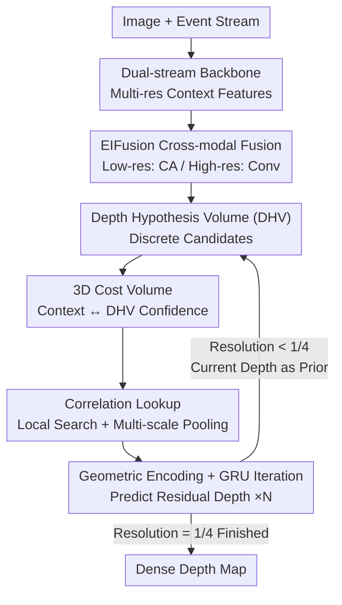

# Depth Hypothesis Guided Iterative Refinement for Event-Image Monocular Depth Estimation

**Conference**: CVPR 2026  
**Paper**: [CVF Open Access](https://openaccess.thecvf.com/content/CVPR2026/html/Liu_Depth_Hypothesis_Guided_Iterative_Refinement_for_Event-Image_Monocular_Depth_Estimation_CVPR_2026_paper.html)  
**Code**: Not available  
**Area**: 3D Vision  
**Keywords**: Event camera, Monocular depth estimation, Depth hypothesis volume, Cost volume, Iterative refinement  

## TL;DR
HypoDepth reformulates event-image monocular depth estimation from "direct regression of continuous depth" to "constrained search within discrete depth hypotheses." By utilizing a lightweight 3D cost volume and a GRU iterative unit, it progressively refines residual depth from low to high resolution. It achieves SOTA on DSEC and MVSEC, with a Tiny version capable of real-time operation on resource-constrained devices.

## Background & Motivation
**Background**: Event cameras possess high temporal resolution and high dynamic range, capturing scene changes in scenarios where conventional cameras fail (e.g., high-speed motion, low light). Thus, combining events and images for monocular depth estimation (MDE) is promising. Current mainstream approaches (e.g., RAMNet using RNN alignment, UniCT using self-attention, SRFNet/PCDepth using iterative feature refinement) focus on **optimizing contextual features** and then using a regression head to output dense depth.

**Limitations of Prior Work**: Monocular depth estimation is inherently ill-posed—the same set of features can correspond to infinite depth solutions. Direct regression of the full depth distribution is highly non-linear, difficult to converge, and sensitive to noise. Regardless of feature alignment or fusion quality, the **final mapping from "feature to continuous depth" remains a non-linear bottleneck**, and refinement is often limited to the feature level without explicit constraints in the depth space.

**Key Challenge**: Treating depth as an unbounded continuous variable for regression results in a solution space that is too large and free, failing to alleviate the ill-posed nature. Conversely, fields like optical flow and stereo matching have proven that **replacing "regression" with "searching within constrained candidates" significantly stabilizes optimization** (e.g., RAFT maintains 2D/4D cost volumes and iteratively predicts residual flow). however, monocular depth lacks a second perspective to build such cost volumes, making direct adaptation impossible.

**Goal**: (1) Reformulate the ill-posed depth regression as a constrained depth search task; (2) Construct a cost volume capable of guiding iterative refinement in a monocular setting without a second view; (3) Ensure the mechanism is lightweight enough to run across multiple resolutions for real-time deployment.

**Key Insight**: The authors observe that correspondences can be artificially created in a "virtual depth space." By discretizing continuous depth into a set of candidate depth values (depth hypotheses) and calculating the matching confidence between contextual features and "geometric projections under those hypotheses," a 3D cost volume is obtained. This effectively replaces the "matching between two frames" in RAFT with "matching between context features and depth hypotheses."

**Core Idea**: Use a discrete **Depth Hypothesis Volume (DHV)** to constrain the depth search space within a set of reasonable candidates. Construct a 3D cost volume for multi-scale correlation lookup and use a GRU to iteratively predict residual depth for global-to-local refinement—essentially "replacing unbounded depth regression with constrained depth search to alleviate ill-posedness."

## Method

### Overall Architecture
Given an image $I$ and a corresponding event stream $E$, the goal is to estimate a dense depth map. HypoDepth is a three-stage, multi-resolution iterative pipeline: images and events pass through backbones to extract multi-resolution context features $\rightarrow$ EIFusion adaptively fuses the two modalities by resolution $\rightarrow$ Iterative depth decoders run sequentially at 1/16, 1/8, and 1/4 resolutions. Internally, each decoder constructs a cost volume via DHV, performs correlation lookup, and updates residual depth using a GRU, refining depth from global consistency to local detail. The 1/16 stage initializes depth to zero, and each subsequent resolution uses the previous stage's output as a prior.

The architecture follows a dual-loop structure: "multi-resolution serial execution + multiple iterations within a single resolution."

### Key Designs

**1. Depth Hypothesis Volume (DHV): Replacing Unbounded Regression with Bounded Search**

This addresses the non-linearity and convergence issues of direct regression. At each pixel, $D$ candidate depth values $\{\hat d_i\}_{i=0}^{D-1}$ are **uniformly sampled** within a depth range $[d_{min}, d_{max}]$ provided by the prior. To maintain robustness (following RAMNet), normalized log depth is used:

$$d_i = \frac{\log(\hat d_i) - \log(d_{min})}{\log(d_{max}) - \log(d_{min})}, \quad DHV = \{d_{0}, d_{1}, \dots, d_{D-1}\}$$

The DHV is then linearly projected into the same feature space as context features $F_{ct}$ to get $F_{dhv} = \text{Embedding}(DHV)$, where $F_{dhv} \in \mathbb{R}^{c \times D}$ represents geometric projections at specific depth hypotheses. This compresses the solution space from the "entire real axis" to "$D$ candidates," providing noise resistance and a stable starting point for refinement.

**2. 3D Cost Volume + Multi-scale Correlation Lookup: Creating "Matches" in Virtual Space**

To solve the lack of explicit correspondences in monocular setups, the authors perform **bi-directional cross-attention** between $F_{ct}$ and $F_{dhv}$:

$$F'_{dhv} = F_{dhv} + \text{CA}(Q_{dhv}, K_{ct}, V_{ct}), \quad F'_{ct} = F_{ct} + \text{CA}(Q_{ct}, K_{dhv}, V_{dhv})$$

A 3D cost volume $CV = \text{Sim}(F'_{ct}, F'_{dhv}) \in \mathbb{R}^{H \times W \times D}$ is computed via dot-product similarity, encoding "matching confidence at each hypothesis." A pyramid $\{CV^1, CV^2, CV^3\}$ is formed by pooling along the depth dimension. During the $k$-th iteration for pixel $P$, the index $i^*$ closest to the previous depth $\psi_P^{k-1}$ is found:

$$i^* = \arg\min_i |\psi_P^{k-1} - d_i|$$

Local correlation vectors are retrieved around $i^*$ with radius $r$. The multi-scale nature allows the model to handle both near and far objects efficiently. Since $D \ll H \times W$, this 3D volume is significantly more efficient than the 4D volumes used in RAFT.

**3. Geometric Encoding + GRU Iterative Residual Update: Stable Convergence**

The **Geometric Encoder** processes multi-scale correlations and injects fused context features $F_{ct}$ to ensure spatial consistency. This is fed into a **GRU-based iterative unit**. The GRU's hidden state passes historical information across iterations (ablation shows simple convolutions converge poorly without this). The prediction head outputs residual depth $\Delta\Psi$, updating $\Psi^k = \Psi^{k-1} + \Delta\Psi$. Finally, convex upsampling and mapping back to the true scale are applied:

$$\hat\Psi^k = d_{max}\exp\left(\log\tfrac{d_{max}}{d_{min}}(\Psi^k - 1)\right)$$

**4. Multi-resolution Adaptive Fusion & Coarse-to-fine Refinement**

The pipeline follows 1/16 $\rightarrow$ 1/8 $\rightarrow$ 1/4. **EIFusion** uses cross-attention at low resolutions (1/16, 1/8) for global semantic alignment and simple convolutional fusion at high resolution (1/4) to preserve structural details while saving computation. The number of hypotheses $D$ is increased with resolution (e.g., $32, 64, 96$).

### Loss & Training
The SILog loss is applied to all $K$ iterative predictions $\{\hat\Psi_i\}_{i=1}^K$ with exponential weighting:

$$L = \sum_{i=1}^K 0.8^{K-i}\,\alpha\sqrt{V(\delta_i)} - \lambda E(\delta_i), \quad \delta_i = \log(\hat\Psi_i) - \log(\Psi_{gt})$$

Events are represented as voxel grids ($B=3$ bins). Backbone is a fine-tuned Swin-T. Training uses 8 iterations per stage, AdamW optimizer, and one-cycle scheduling.

## Key Experimental Results

### Main Results
On the DSEC dataset (480×640, dense events), E denotes Event-only, E+I denotes Event + Image:

| Input | Method | δ1 ↑ | Abs Rel ↓ | RMSE ↓ | FLOPs(G) | Param(M) | Inference(ms) |
|-------|--------|------|-----------|--------|----------|----------|---------------|
| E | DepthAnyEvent-R | 0.592 | 0.252 | 9.824 | 39 | 25.5 | 12.9 |
| E | **Ours-E-T** (Tiny) | 0.755 | 0.168 | 5.377 | **5** | **1.4**| 11.8 |
| E | **Ours-E-B** | 0.839 | **0.129** | 4.442 | 134 | 32.3 | 58.2 |
| E+I | PCDepth | 0.893 | 0.103 | 3.591 | 162 | 66.5 | 64.3 |
| E+I | **Ours-B** | **0.901** | **0.099** | **3.583** | 155 | 60.2 | 71.6 |

Ours-E-B improves Abs Rel by ~49% over DepthAnyEvent-R. The Tiny version achieves a strong balance between efficiency (1.4M params) and accuracy.

On MVSEC (Abs Rel):

| Input | Method | day1 Abs Rel ↓ | night1 Abs Rel ↓ |
|-------|--------|----------------|------------------|
| E | HMNet | 0.254 | 0.323 |
| E+I | PCDepth | 0.228 | 0.271 |
| E+I | **Ours-B** | **0.212** | **0.268** |

### Ablation Study
(Performed on DSEC using a reduced base model):

| Configuration | δ1 ↑ | Abs Rel ↓ | Remark |
|---------------|------|-----------|--------|
| Full model | 0.885 | 0.105 | Baseline |
| W/o EIFusion | 0.877 | 0.110 | Simple concat reduces complementarity |
| W/o CA in decoder | 0.869 | 0.111 | Weakens semantic/geometric correspondence |
| W/o GRU | 0.858 | 0.115 | Conv layers lack temporal prior, weakest convergence |
| W/o DHV | 0.873 | 0.113 | Continuous depth prior leads to error accumulation |

### Key Findings
- **GRU is critical**: Removing it caused the largest performance drop, proving the necessity of "historical prior transfer" across iterations.
- **DHV outperforms continuous priors**: Discrete hypotheses allow the search mechanism to correct previous errors, whereas continuous regression tends to accumulate them.
- **Efficiency through 3D volumes**: Since $D \ll H \times W$, the computation is manageable even at high resolutions.

## Highlights & Insights
- **Adapting the RAFT paradigm to Monocular Vision**: HypoDepth cleverly creates artificial correspondences through discrete hypotheses in "virtual space," a concept transferable to other continuous regression tasks lacking matching pairs.
- **"Regression to Search"**: Discretizing the solution space provides inherent noise resistance and stabilizes the ill-posed problem.
- **Resolution-Aware Resource Allocation**: Using expensive cross-attention only at low resolutions and increasing hypothesis density $D$ as resolution grows achieves a SOTA balance of precision and speed.

## Limitations & Future Work
- **Dependence on Depth Bounds**: DHV sampling relies on $[d_{min}, d_{max}]$. If the actual scene depth falls outside these bounds, the search space will fail to cover the ground truth.
- **Latency**: Multiple iterations at high resolutions increase inference time (71.6ms for Ours-B), requiring the Tiny version for strict real-time applications.
- **Sampling Density**: Uniform log-space sampling may not be optimal for all scenes; adaptive bins (similar to AdaBins) could be explored.

## Related Work & Insights
- **vs. RAFT**: While RAFT uses a 4D cost volume from two frames, HypoDepth uses a lighter 3D volume from a single frame + hypotheses.
- **vs. PCDepth / SRFNet**: These rely on feature-level refinement. HypoDepth focuses on explicit spatial search in the depth domain, outperforming PCDepth on DSEC/MVSEC.
- **vs. AdaBins**: Both use discretization, but HypoDepth uses it to build a cost volume for search-based refinement rather than for direct bin classification.

## Rating
- Novelty: ⭐⭐⭐⭐⭐ (Excellent adaptation of cost-volume search to monocular settings)
- Experimental Thoroughness: ⭐⭐⭐⭐⭐ (Dual datasets, zero-shot, and exhaustive ablation)
- Writing Quality: ⭐⭐⭐⭐ (Clear logic and formulations)
- Value: ⭐⭐⭐⭐⭐ (Significant performance gains and a deployable Tiny version)

<!-- RELATED:START -->

## Related Papers

- [\[CVPR 2026\] AIMDepth: Asymmetric Image-Event Mamba for Monocular Depth Estimation](aimdepth_asymmetric_image-event_mamba_for_monocular_depth_estimation.md)
- [\[CVPR 2026\] Iris: Integrating Language into Diffusion-based Monocular Depth Estimation](iris_integrating_language_into_diffusion-based_monocular_depth_estimation.md)
- [\[CVPR 2026\] Iris: Bringing Real-World Priors into Diffusion Model for Monocular Depth Estimation](iris_bringing_realworld_priors_into_diffusion_model_for_monocular_depth_estimation.md)
- [\[CVPR 2026\] MD2E: Modeling Depth-to-Edge Cues for Monocular Metric Depth Estimation](md2e_modeling_depth-to-edge_cues_for_monocular_metric_depth_estimation.md)
- [\[CVPR 2026\] IDESplat: Iterative Depth Probability Estimation for Generalizable 3D Gaussian Splatting](idesplat_iterative_depth_probability_estimation_for_generalizable_3d_gaussian_sp.md)

<!-- RELATED:END -->
