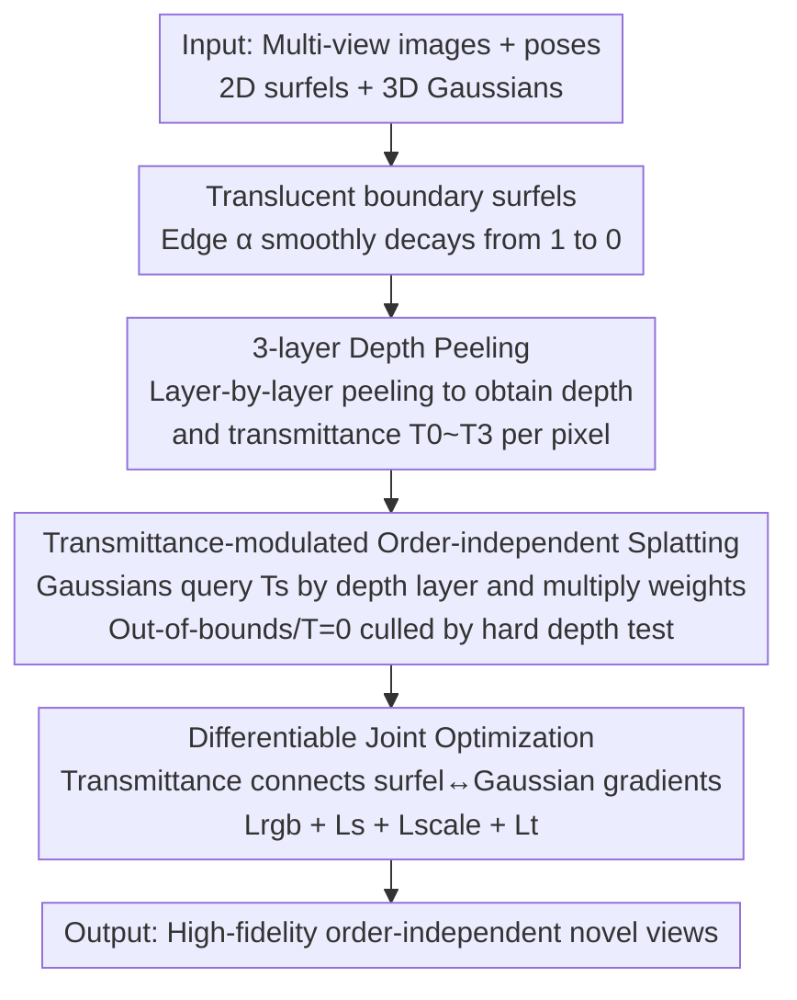

# Depth Peeling for High-Fidelity Gaussian-Enhanced Surfel Rendering

**Conference**: CVPR 2026  
**Paper**: [CVF Open Access](https://openaccess.thecvf.com/content/CVPR2026/html/Ye_Depth_Peeling_for_High-Fidelity_Gaussian-Enhanced_Surfel_Rendering_CVPR_2026_paper.html)  
**Code**: Not released  
**Area**: 3D Vision  
**Keywords**: Novel View Synthesis, Gaussian Splatting, Surfel, Depth Peeling, Order-independent Rendering  

## TL;DR
To address the issues of boundary aliasing caused by hard depth testing and the inability to jointly optimize surfels and Gaussians in Gaussian-Enhanced Surfels (GES), this paper proposes DP-GES. By introducing translucent boundaries for surfels and utilizing 3-layer depth peeling to determine accurate per-pixel occlusion orders, 3D Gaussians can still perform order-independent splatting while receiving correct transmittance modulation. This approach eliminates aliasing and popping, enables differentiable joint optimization of surfels and Gaussians, and achieves state-of-the-art image quality at 472 FPS across multiple datasets.

## Background & Motivation
**Background**: Mainstream novel view synthesis methods include NeRF and 3D Gaussian Splatting (3DGS). Both represent scenes as volumetric radiance fields, requiring alpha blending of volume samples/primitives in a front-to-back order during rendering. NeRF relies on point-wise neural network inference, which is slow; 3DGS accelerates via tile-based global sorting as an approximation of per-pixel depth order.

**Limitations of Prior Work**: The approximate sorting in 3DGS introduces popping (floaters suddenly appearing/disappearing due to abrupt changes in sorting order) during camera rotation. Subsequent works either pursue order-independent routes (e.g., SortFreeGS) but suffer from severe occlusion leakage, or rely on ray tracing for exact ordering at high computational costs. Gaussian-Enhanced Surfels (GES) provides a compromise: using a set of **fully opaque surfels** (rendered with standard z-buffer) to establish coarse geometry and appearance, supplemented by **order-independent splatting** Gaussians for details, using the surfel depth buffer for Gaussian culling to achieve both high frame rates and view consistency.

**Key Challenge**: The two root causes of GES limitations stem from the "fully opaque surfel" setting. First, while MSAA can smooth surfel rendering, the **hard depth test** applied to Gaussians causes their color/weights to be abruptly truncated from 1 to 0—essentially clamping the transmittance harshly, leading to aliasing at object boundaries. Second, fully opaque surfel geometry is **inherently non-differentiable**, and its color is only loosely blended with Gaussians, resulting in sub-optimal reconstruction quality due to the lack of joint optimization.

**Goal**: While maintaining the "order-independent + view-consistent" advantages of GES, (1) eliminate boundary aliasing and (2) enable end-to-end joint optimization of surfels and Gaussians.

**Key Insight**: The authors reinterpret the aliasing problem as "hard depth test = transmittance discontinuity." Thus, by allowing transmittance to **transition smoothly** rather than jumping between 0/1, both aliasing and non-differentiability can be resolved. To achieve smooth transmittance, surfels must have translucent boundaries; however, translucency requires sorting for correct blending—this is where the classic Order-Independent Transparency (OIT) technique, depth peeling, is introduced.

**Core Idea**: Add a translucent boundary ring to each surfel and use **depth peeling to calculate the accurate 3-layer depth order and transmittance per pixel**. This allows Gaussians to remain order-independent while their weights are smoothly modulated by the transmittance of the corresponding depth layer—using "differentiable transmittance" to both cure aliasing and enable joint optimization.

## Method

### Overall Architecture
The DP-GES representation consists of two types of primitives: a set of **2D opaque surfels with translucent boundaries** $\mathcal{S}=\{p_i,r_i,s_i,B_i\}_{i=1}^N$ responsible for coarse geometry and appearance, and a small number of **3D Gaussians surrounding the surfels** $\mathcal{G}=\{p_i,\sigma_i,r_i,s_i,B_i\}_{i=1}^M$ for fine details (surfel count is typically less than 10% of Gaussians). The final image is a weighted normalization of their colors: $C=\frac{C_s+C_G}{W_s+W_G}$.

Rendering occurs in two passes. The first pass uses the standard graphics pipeline to perform **3-layer depth peeling** on surfels, "peeling" the nearest visible layer in each pass to obtain three depth maps $\{D_i^s\}_{i=1}^3$, color maps, and opacity maps. These are alpha-blended following 3DGS conventions to produce the surfel color $C_s$ and per-layer transmittance maps $\{T_i^s\}_{i=0}^3$ (with $T_0^s=1$). The second pass performs order-independent splatting of 3D Gaussians: **each Gaussian queries the transmittance $t_s$ of the corresponding layer based on which depth interval its center falls into**, multiplying it by its own weight. Gaussians beyond the 3rd layer or with zero transmittance are culled by hardware depth testing. The entire pipeline is fully differentiable, allowing joint optimization of all parameters after initialization.

### Key Designs

**1. Translucent Boundary Surfels: Softening Hard Depth Tests into Smooth Transmittance**

The root cause of aliasing in GES is the hard depth test on opaque surfels. This paper adds a ring-shaped gradient opacity to the surfel edges. For a disk surfel in the local XY plane, the opacity $\alpha_i(x,y)$ at point $(x,y)$ is defined as $\alpha_i(x,y)=\min(1, w\,G(x,y))$, where $G(x,y)=\exp(-\frac{x^2+y^2}{2})$ and $w$ is a fixed modulation constant shared by all surfels. When $w<1$, the surfel is entirely translucent; when $w=255$, it degenerates into the fully opaque surfel of GES. The paper sets $w=30$, keeping the center opaque (for Gaussian culling) while leaving a thin translucent ring at the boundary. This translucency causes transmittance to **decay continuously** at the boundaries rather than jumping from 0/1, allowing Gaussians near surfel edges to fade out smoothly, suppressing aliasing at the source.

**2. 3-layer Depth Peeling: Per-pixel Occlusion Order for Translucent Surfels**

Translucent surfels must be sorted for correct blending. The authors use classic OIT depth peeling: each pass compares the per-pixel depth stored in the previous pass to "peel" the nearest layer, ensuring correct front-to-back alpha blending. Surfel color and transmittance are synthesized as:
$$C_s=\sum_{i=1}^{3} A_i^s\,T_{i-1}^s\,C_i^s + T_3^s\,C_b,\qquad T_i^s=\begin{cases}1,& i=0\\ \prod_{j=1}^{i}(1-A_j^s),& \text{otherwise}\end{cases}$$
where $C_b$ is the background color. It can be proven that $W_s=\sum_{i=1}^3 A_i^s T_{i-1}^s + T_3^s=1$ is a constant. The key trade-off is **peeling only 3 layers**: experiments found 3 layers sufficient to prevent background leakage, whereas 2 layers leak due to translucent overlaps and 4 layers yield negligible quality gains while significantly dropping frame rates (and breaking 4-float alignment in OpenGL). Since surfel counts are much lower than Gaussians, the peeling overhead is minimal.

**3. Transmittance-modulated Order-independent Splatting: Occlusion without Sorting**

With per-layer transmittance, Gaussians no longer require sorting. In the second pass, Gaussians are accumulated in an order-independent manner. The per-pixel Gaussian color and weight are:
$$C_G(\hat{x})=\sum_{i=1}^{K}\mathbb{1}_{dt}(\hat{x})\,c_i\alpha_i(\hat{x})\,t_s(\hat{x}),\quad W_G(\hat{x})=\sum_{i=1}^{K}\mathbb{1}_{dt}(\hat{x})\,\alpha_i(\hat{x})\,t_s(\hat{x})$$
Each Gaussian queries the transmittance $t_s$ from $\{D_i^s\}$ based on its center depth $d_i$: $t_s=T_0^s$ if $d_i<D_1^s$, $=T_1^s$ if $D_1^s<d_i<D_2^s$, else $=T_2^s$. The indicator function $\mathbb{1}_{dt}$ performs per-pixel culling: Gaussians beyond the 3rd peeling layer or where transmittance is zero are discarded. This allows **partially occluded Gaussians to fade smoothly at surfel boundaries**, eliminating aliasing while preventing occlusion leakage—achieving the speed of order-independent rendering without losing correct occlusion.

**4. Differentiable Joint Optimization: Mutual Shaping of Surfels and Gaussians**

In GES, surfels are optimized only in their own stage and cannot be refined during joint optimization, leading to "protruding surfels" that block details. In DP-GES, transmittance couples surfels and Gaussians. Surfel geometric parameters $S_g=\{p_i,r_i,s_i\}$ receive gradients not only directly from image loss $\frac{\partial L}{\partial C}\frac{\partial C}{\partial C_s}\frac{\partial C_s}{\partial S_g}$, but also **indirectly from Gaussians via transmittance** $\frac{\partial L}{\partial C}\frac{\partial C}{\partial C_G}\frac{\partial C_G}{\partial t_s}\frac{\partial t_s}{\partial S_g}$. The loss is $L=L_{rgb}+\lambda_1 L_s+\lambda_2 L_{scale}+\lambda_3 L_t$, where $L_s=L_1(C_s,I_{gt})$ fits coarse appearance; $L_{scale}$ penalizes excessively large surfels; and $L_t=\frac{1}{HW}\sum_{\hat{x}}(1-T_3(\hat{x}))^2$ suppresses background leakage. The design of $L_t$ is clever—it penalizes pixels where $T_3 \neq 0$, forcing overlapping translucent parts to push each other away until they are covered by opaque regions, driving $T_3$ toward zero.

### Loss & Training
The total loss is $L=L_{rgb}+\lambda_1 L_s+\lambda_2 L_{scale}+\lambda_3 L_t$, with $\lambda_1=0.01$ and $\lambda_3=0.08$. $\lambda_2$ is set to $5\times10^{-5}$ for unbounded scenes and $1\times10^{-5}$ for bounded scenes. Optimization is based on PyTorch, paired with an equivalent OpenGL renderer to utilize the standard graphics pipeline for real-time rendering. All parameters are jointly optimized after rapid initialization.

## Key Experimental Results

Experiments were conducted on an RTX 4090 using standard 3DGS datasets: NeRF Synthetic, Mip-NeRF360, Deep Blending, and Tanks & Temples. Metrics include PSNR/SSIM/LPIPS for quality, FPS for speed, and $\overset{F}{LIP}_1$/$\overset{F}{LIP}_7$ for popping.

### Main Results: Image Quality Comparison (Dataset Average)

| Dataset | Metric | Ours | GES | DBS | SSS | 3DGS |
|--------|------|------|------|------|------|------|
| Mip-NeRF360 | PSNR↑ | **28.11** | 27.38 | 28.10 | 27.78 | 27.43 |
| Mip-NeRF360 | LPIPS↓ | **0.196** | 0.208 | 0.210 | 0.203 | 0.214 |
| Deep Blending | PSNR↑ | **30.30** | 30.00 | 30.25 | 30.25 | 29.41 |
| Tanks & Temples | PSNR↑ | 24.61 | 23.95 | 24.52 | **24.70** | 23.62 |
| Tanks & Temples | LPIPS↓ | **0.162** | 0.181 | 0.166 | 0.166 | 0.183 |

DP-GES is on par with or superior to SOTA across all datasets, with **LPIPS (perceptual quality) consistently leading**, particularly in far-field details and high-fidelity reflections.

### Main Results: Efficiency and View Consistency (Mip-NeRF360, 1080p)

| Method | FPS↑ | Storage(MB)↓ | Training(min)↓ | $\overset{F}{LIP}_1$↓ | $\overset{F}{LIP}_7$↓ |
|------|------|-----------|-----------|------|------|
| Ours | 472 | **156** | 40 | 0.0232 | 0.0431 |
| GES | **675** | 366 | 43 | 0.0229 | 0.0394 |
| DBS | 156 | 165 | 20 | 0.0297 | 0.0771 |
| SSS | 62 | 351 | 38 | 0.0300 | 0.0716 |
| 3DGS | 185 | 734 | 28 | 0.0250 | 0.0471 |

DP-GES is over 3x faster than high-fidelity baselines like DBS/SSS at 472 FPS and is the most storage-efficient (156MB).

### Ablation Study (Mip-NeRF360, 1080p)

| Configuration | PSNR↑ | LPIPS↓ | FPS↑ | Explanation |
|------|-------|--------|------|------|
| Ours (full) | 28.11 | 0.196 | 472 | Full model |
| w/ 2 layers | 27.02 | 0.223 | 578 | 2 layers → background leakage |
| w/ 4 layers | 28.10 | 0.196 | 278 | 4 layers → negligible gain, high cost |
| w/o trans. grad | 27.82 | 0.206 | 477 | Severed transmittance path → blurred details |

### Key Findings
- **Layer count is the key balance**: 2 layers cause background leakage (PSNR 27.02), while 4 layers offer no quality gain but significantly reduce FPS (278 vs 472). 3 layers is the sweet spot.
- **Transmittance gradients are essential**: Severing this path (w/o trans. grad) leads to blurred details and protruding surfels, proving surfels and Gaussians must be treated as a fully coupled differentiable system.
- **$L_t$ "push away" strategy works**: Directly encouraging $T_3=0$ is less effective than penalizing pixels with $T_3 \neq 0$, which forces overlapping translucent regions to settle into opaque coverage.

## Highlights & Insights
- **Reinterpreting Aliasing as Transmittance Discontinuity**: This is the most elegant insight—by attributing GES aliasing to hard depth tests clamping transmittance, the solution of "translucent boundaries for smooth transmittance" becomes natural and simultaneously solves non-differentiability.
- **Classic OIT for Modern Problems**: Depth peeling is an old technique, but finding that it solve the per-pixel ordering for translucent surfels while allowing Gaussians to remain order-independent is a high-value transfer of ideas.
- **Engineering Intuition on "Only 3 Layers"**: Rather than perusing physical perfection with arbitrary layers, the authors locked the count at 3 based on OpenGL 4-float alignment and bandwidth empirical tests.

## Limitations & Future Work
- Similar to GES, DP-GES still has artifacts on **transparent/translucent objects (e.g., glass windows)** because surfels are primarily opaque.
- Surfels are less flexible than 2DGS and require specific initialization, leading to relatively long training times.
- Spherical Beta increases **overfitting risks** to specific viewpoints.
- ⚠️ Code is not yet public; replication requires building an OpenGL renderer and initialization strategies from scratch.

## Related Work & Insights
- **vs GES**: Direct predecessor. DP-GES adds translucent boundaries and depth peeling to solve aliasing and non-differentiability, achieving higher quality and lower storage (156 vs 366 MB) at a small cost to frame rate.
- **vs SortFreeGS**: SortFreeGS has severe occlusion leakage; DP-GES prevents this using peeled depths for Gaussian culling while remaining order-independent.
- **vs 3DGRT / EVER**: These use ray tracing for exact sorting and are very slow; DP-GES is an order of magnitude faster while being comparable in quality.

## Rating
- Novelty: ⭐⭐⭐⭐ Excellent reinterpretation of aliasing as a transmittance problem, though the framework is an incremental evolution of GES.
- Experimental Thoroughness: ⭐⭐⭐⭐⭐ Comprehensive coverage across 4 datasets, 10 baselines, and thorough ablations on layer counts and gradient paths.
- Writing Quality: ⭐⭐⭐⭐ Clear explanations of mechanisms and the counter-intuitive $L_t$ design.
- Value: ⭐⭐⭐⭐ High practical value for real-time high-fidelity rendering, but hindered by lack of public code.

<!-- RELATED:START -->

## Related Papers

- [\[CVPR 2026\] HyperGaussians: High-Dimensional Gaussian Splatting for High-Fidelity Animatable Face Avatars](hypergaussians_high-dimensional_gaussian_splatting_for_high-fidelity_animatable_.md)
- [\[CVPR 2026\] Neural Gabor Splatting: Enhanced Gaussian Splatting with Neural Gabor for High-frequency Surface Reconstruction](neural_gabor_splatting.md)
- [\[CVPR 2026\] Plug-and-Play PDE Optimization for 3D Gaussian Splatting: Toward High-Quality Rendering and Reconstruction](plug-and-play_pde_optimization_for_3d_gaussian_splatting_toward_high-quality_ren.md)
- [\[CVPR 2026\] 3D Gaussian Splatting with Self-Constrained Priors for High Fidelity Surface Reconstruction](3d_gaussian_splatting_with_self-constrained_priors_for_high_fidelity_surface_rec.md)
- [\[CVPR 2026\] TopoMesh: High-Fidelity Mesh Autoencoding via Topological Unification](topomesh_high-fidelity_mesh_autoencoding_via_topological_unification.md)

<!-- RELATED:END -->
