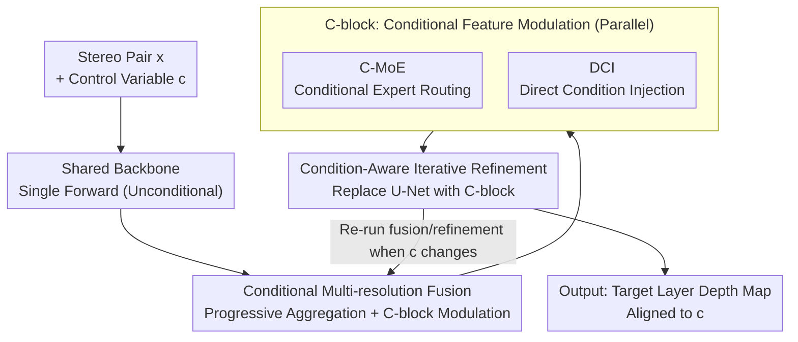

# DepthFocus: Controllable Depth Estimation for See-Through Scenes

**Conference**: CVPR 2026  
**Paper**: [CVF Open Access](https://openaccess.thecvf.com/content/CVPR2026/html/Min_DepthFocus_Controllable_Depth_Estimation_for_See-Through_Scenes_CVPR_2026_paper.html)  
**Code**: No open-source code (Project page only)  
**Area**: 3D Vision  
**Keywords**: Stereo Depth Estimation, Controllable Depth Estimation, Transparent/Reflective Scenes, Multi-layer Depth, Conditional Feature Modulation  

## TL;DR
DepthFocus redefines stereo depth estimation from a "passive output of the nearest surface" to a "controllable process driven by a physical reference distance $c$." Using a steerable ViT that dynamically modulates features through two modules—Conditional MoE and Direct Condition Injection—the network "peels away" transparent or reflective occlusions layer-by-layer like human eye focusing, achieving SOTA on both standard single-layer benchmarks and complex multi-layer scenes.

## Background & Motivation
**Background**: Monocular and stereo depth estimation have progressed significantly over the last decade, with foundation stereo models achieving stable metric-scale results even on non-Lambertian surfaces. However, the mainstream paradigm shares a common assumption: **each pixel has only one depth value**, outputting a static depth map anchored to the "nearest visible surface."

**Limitations of Prior Work**: The real world is not composed of opaque single-layer manifolds. Transparent partitions, glass, reflective surfaces, and wire fences cause multiple depths to overlap at the same pixel, forming a layered structure. Passive single-layer models discard the geometry of background layers; furthermore, ambiguity is linked to scale and context—a wire fence appears as a solid obstacle when close but becomes a penetrable medium from a distance, causing severe pixel-level uncertainty.

**Key Challenge**: Most recent multi-layer works focus on **adding multi-head regression to a fixed backbone** without rethinking the feature extraction itself. Using a fixed set of features to encode multiple overlapping layers forces conflicting geometries into a limited latent space, creating a **representational bottleneck**: predicted depths often converge to an "average" of layers rather than cleanly separating into distinct surfaces. Consequently, these models either recover only relative depth ordering or sacrifice basic accuracy, failing to outperform single-layer SOTA even on the nearest layer.

**Goal**: To tackle multi-layer ambiguity uniformly without sacrificing accuracy on standard opaque benchmarks—achieving SOTA on common scenes while cleanly separating multiple layers in transparent/reflective scenarios.

**Key Insight**: The authors draw an analogy to the human eye—humans do not passively capture a fixed set of surfaces but **actively focus** on a depth plane of interest. Similarly, depth estimation should be an "adjustable" active dimension: given a physical reference distance, the network should reconstruct only the surface aligned to that distance.

**Core Idea**: Depth estimation is formulated as a controlled function $f(x, c)$, where a scalar control variable $c\in[0,1]$ maps directly to a physical disparity range. Through Conditional MoE and Direct Condition Injection modules, the network **dynamically alters its own computational path based on $c$**, selectively extracting features of the target depth layer—essentially acting as a tunable "adaptive opacity filter."

## Method

### Overall Architecture
DepthFocus receives a pair of calibrated stereo images $x$ and a scalar control variable $c\in[0,1]$, outputting a disparity/depth map "aligned to the depth indicated by $c$." The pipeline is intentionally designed such that **heavy computation occurs only once**: a high-capacity unconditional stereo backbone performs feature extraction first (the most expensive step, not repeated when $c$ changes); this is followed by a **Conditional Multi-resolution Fusion** stage, which aggregates pre-stored multi-scale features progressively while modulating them via C-blocks according to $c$; finally, a **Condition-Aware Iterative Refinement** stage is entered, where every residual update is also modulated by $c$ while maintaining the original U-Net convergence structure. The core controllability stems from two parallel modules within the C-block: Conditional MoE (C-MoE) and Direct Condition Injection (DCI).

### Key Designs

**1. Conditional Depth Estimation Framework: Rethinking depth estimation as a "selection" problem driven by reference distance**

This represents the paper's paradigm shift. For a pixel $(u,v)$, let the set of possible depths be $\mathcal{Z}_{u,v}=\{z_1,\dots,z_n\}$ (sorted). The authors require an ideal estimator $f_{\text{ideal}}(x,c)$ to satisfy three properties: ① **Opacity Determinism**—for opaque regions $S_o$, the output is independent of $c$ ($f(x,c)_{u,v}=z_{u,v},\ \forall c$), ensuring standard scenes are not disturbed; ② **Transmissivity Monotonicity**—for transmissive regions $S_t$, $c_a<c_b \Rightarrow f(x,c_a)_{u,v}\le f(x,c_b)_{u,v}$, meaning increasing $c$ never "reverts" to a shallower layer; ③ **Reference Proximity + Discrete Selection**—the estimation aligns to the valid layer closest to the reference plane $d_{\text{ref}}(c)$:

$$f_{\text{ideal}}(x,c)_{u,v}=\operatorname*{argmin}_{z\in\mathcal{Z}_{u,v}}\mathcal{D}\big(z,\,d_{\text{ref}}(c)\big)$$

Properties ② and ③ together require $f_{\text{ideal}}$ to behave as a **monotonic step function** with respect to $c$: output remains stable over most intervals, jumping only when $d_{\text{ref}}(c)$ crosses the decision boundary between layers. While neural networks $f_\theta$ are naturally continuous, the framework encourages them to approximate these discrete jumps. This formalization bypasses the representational bottleneck of fixed multi-head regression by replacing the ill-posed goal of "regressing all layers simultaneously" with "deterministically picking one layer given a query distance."

**2. C-MoE Conditional Expert Routing: Routing different depth layers through different feature transformation paths**

The issue with fixed feature extractors is using one set of weights for all layers. C-MoE breaks this with a Conditional Mixture of Experts structure: a router $R(x,c)$ generates continuous weights to combine several expert sub-networks $\{E_i\}$,

$$F(x,c)=\sum_{i=1}^{N} R(x,c)_i \cdot E_i(x)$$

Crucially, routing is **explicitly driven by $c$**—unlike standard MoE where gating is controlled by implicit data statistics, here the physical control variable actively redirects the network's computational focus. The number of experts is kept small ($N\le 3$) to maintain representational diversity while controlling overhead. Intuitively, different $c$ values activate different expert combinations, effectively preparing distinct "feature channels" for different depth layers to avoid squeezing conflicting geometries into the same latent space.

**3. DCI Direct Condition Injection: Directing $c$ into the feature stream via single-item attention**

While C-MoE implicitly "selects a path," DCI provides explicit guidance. It uses a single-item attention block to let features $x$ interact with condition $c$:

$$A(x,c)=\sigma(q_x\cdot k_c)\cdot v_c$$

Where $\sigma$ is the sigmoid function, $(k_c,v_c)$ are learnable projections of $c$, and $q_x$ originates from the features. The output $A(x,c)$ is projected and added back to the feature stream, ensuring the injected condition aligns with high-dimensional features. Placed in parallel with C-MoE inside the C-block (replacing the original FFN), one module "switches paths" while the other "attaches explicit signals." The modulated results are aggregated before rewriting the backbone features, allowing for $c$ adjustment without re-running the heavy backbone.

**4. Condition-Aware Supervision: Anchoring abstract $c$ to predictable physical depth**

Controllable architecture alone is insufficient; the network must learn what $c$ "corresponds to." The authors map $c$ to a reference disparity:

$$d_{\text{ref}}(c)=(1-c)\cdot d_{\max}$$

Where $d_{\max}$ is the maximum valid disparity in the scene. By training across different camera settings, the network learns to treat $c$ as a normalized frustum coordinate, achieving metric-scale steering. **Reference-driven Ground Truth Assignment** is the heart of this supervision: since smaller disparity values represent greater distances, for each pixel, the "maximum disparity not exceeding $d_{\text{ref}}$" is selected as the target $d^*$—

$$d^*=\begin{cases}\max\{d\in\mathcal{D}_{gt}\mid d\le d_{\text{ref}}(c)\} & \exists\,d\le d_{\text{ref}}(c)\\[2pt]\min\{\mathcal{D}_{gt}\} & \text{otherwise}\end{cases}$$

As $c$ increases and $d_{\text{ref}}$ shrinks toward the background, the training target **shifts stepwise to the next available disparity layer**, embedding the discrete selection behavior of Property ③ into the network. Furthermore, an **auxiliary segmentation head** is attached to encourage the backbone to encode material semantics (identifying transmissive/reflective regions), providing semantic cues for the conditional modules to disambiguate.

### Loss & Training
The base model uses $C=192$ for ablations, while the large model uses $C=384$ for state-of-the-art results. Training data consists of 2 million public stereo pairs + 500,000 self-built synthetic multi-layer samples, utilizing a "mixed $c$ sampling" strategy; auxiliary segmentation loss provides additional supervision for material awareness on glass/mirror datasets. Synthetic data includes approximately 500,000 stereo pairs generated via Blender (3,577 independent scene configurations), each containing aligned RGB, layer-wise depth, disparity, and semantic segmentation masks.

## Key Experimental Results

### Main Results
**Standard Single-layer Benchmarks (Booster / Middlebury, lower EPE and Bad-x are better)**: When set to "predict nearest layer," DepthFocus reaches SOTA on both benchmarks, with the largest advantage in the transmissive/reflective subsets of Booster. Notably, it outperforms the baseline S²M²(ft) under the same training data, suggesting that controllable multi-layer representation + semantic integration provides a better inductive bias than simple fine-tuning.

| Model | Booster All EPE | Booster All Bad-4 | Booster Ref/Trans EPE | Booster Ref/Trans Bad-4 | Middlebury EPE |
|------|------|------|------|------|------|
| RAFTStereo | 7.11 | 21.79 | 14.30 | 48.25 | 1.27 |
| S²M² (ft) | 2.53 | 8.53 | 7.69 | 25.52 | — |
| FoundationStereo | 7.20 | 10.28 | 34.78 | 53.37 | 0.78 |
| **DepthFocus (nearest)** | **1.56** | **4.70** | **3.41** | **14.70** | **0.67** |

**Multi-layer Synthetic Benchmark (Bad-2/Bad-4, Transmissive Layer)**: On high-resolution synthetic data with overlapping transmissive surfaces, DepthFocus significantly outperforms multi-layer baselines. Fixed multi-layer architectures (RAFT-4layer, ASGrasp) almost collapse on transmissive layers, whereas DepthFocus reduces Layer 1 Bad-4 from double digits to single digits.

| Model | Opaque Bad-4 | Transmissive L1 Bad-4 |
|------|------|------|
| S²M²-(ft) | 1.96 | 7.45 |
| RAFT-(4layer) | 17.16 | 57.09 |
| ASGrasp-(2layer)-ft | 7.52 | 36.86 |
| **DepthFocus-(nearest)** | **1.90** | **3.10** |

**Real-world Dual-layer Benchmark (Lab Acrylic Plates, 60%/80% Transmittance, Bad-4)**: This is the most illustrative result—lacking semantic cues like window frames, baselines relying on monocular priors (StereoAnywhere, FoundationStereo, S²M²-ft) fail almost completely on the first transmissive layer (Bad-4≈99–100), defaulting to background depth; DepthFocus maintains a Bad-4 of 7.33 even at 80% high transparency, cleanly separating the two layers.

### Ablation Study (Synthetic Benchmark, deterioration after removing module in parentheses)

| Configuration | Transmissive L1 Bad-2 | Transmissive Last Bad-2 | Description |
|------|------|------|------|
| Full Model | 11.78 | 38.16 | Full Model |
| (−) C-MoE | 13.97 (+2.19) | 41.80 (+3.64) | W/o expert routing; significant drop in transmissive regions |
| (−) DCI | 14.75 (+2.97) | 41.39 (+3.23) | W/o direct injection; largest deterioration in L1 |
| (−) Seg Loss | 13.15 (+1.37) | 37.70 (−0.46) | Small difference on synthetic set, but useful for real-world generalization |
| (−) Data Curation | 15.59 (+3.81) | 40.61 (+2.45) | W/o large-scale single-disparity data; significant degradation across all areas |

### Key Findings
- **Both conditional modules are effective, with maximal gains in transmissive regions**—exactly where ambiguity is most severe; C-MoE's gains are slightly higher than DCI, and both are complementary.
- **Data Curation provides the largest contribution**: removing it causes Layer 1 Bad-2 to rise by +3.81, indicating that effectively incorporating 2 million public single-disparity pairs is crucial; data scale remains a decisive factor.
- **Segmentation loss appears optional on synthetic sets** (i.i.d. train/test), but the authors retain it as it significantly improves generalization to unseen real-world scenes—explaining why DepthFocus did not collapse on the real dual-layer benchmark.
- **Accuracy of middle layers (Layer 2/3) remains relatively low**: Weak matching signals + overlapping light transport make these layers difficult even for humans to distinguish, though errors are still several times lower than multi-layer baselines.

## Highlights & Insights
- **The "Controllable Depth" paradigm itself is the biggest highlight**: Shifting from "regressing all layers simultaneously" (ill-posed, prone to collapsing to averages) to "selecting one layer by reference distance" (deterministic, allows monotonic scanning) fundamentally bypasses the representational bottleneck of fixed multi-heads. This reframing is more valuable than any specific module.
- **Smart Engineering with Single Backbone + Tunable Fusion/Refinement**: The most expensive feature extraction is run once, and $c$ adjustment only triggers lightweight fusion and refinement. This makes "continuous depth scanning" computationally feasible—a prerequisite for smooth intent-driven transitions.
- **Explicitly anchoring $c$ to $d_{\text{ref}}=(1-c)d_{\max}$ + Reference-Driven GT Assignment** is the key trick to giving "control variables" physical metric meaning, which can be transferred to any controllable generation/estimation task requiring scalar-to-physics alignment.
- **PCA Visualization reveals the network acts as an "Adaptive Opacity Filter"**: It selectively modulates feature permeability based on target focal length, strengthening the target layer and suppressing others—providing interpretable evidence for "steerability."

## Limitations & Future Work
- **Weak Middle Layer Accuracy**: Errors in Layer 2/3 are high due to weak matching and overlapping light transport (as admitted by the authors); a gap remains before achieving "precision across arbitrary layers."
- **Heavy Reliance on Large-scale Synthetic Data**: 500,000 Blender samples + 2 million public stereo pairs form the performance bedrock; sim-to-real remains a concern as real-world dense multi-layer annotations are extremely scarce.
- ⚠️ **Post-processing in Evaluation Protocol**: For multi-layer comparison, continuous outputs are sampled across 30 $c$ intervals and clustered via mean-shift into discrete layers. The authors emphasize this is an evaluation protocol, not part of the inference process; this caveat must be noted when comparing numerical results.
- **Instantiated Only in Stereo (Binocular) Context**: While the framework is a general conditional estimation approach, the paper implements it on stereo to guarantee metric scale; controllability in monocular or multi-view settings is unverified.
- Future Directions: Connecting the steerable mechanism to downstream active perception (e.g., robotic "focusing" to grasp occluded objects) and reducing middle-layer gaps with stronger real-world multi-layer annotations.

## Related Work & Insights
- **vs LayeredFlow / RAFT-(4layer)**: These extend multi-head outputs with optical flow-style grouping; they rely on fixed features and sparse, point-like GT, leading to representational bottlenecks. DepthFocus uses conditional modulation to dynamically switch feature paths, reducing errors across layers by several fold on the LayeredFlow validation set.
- **vs ASGrasp**: ASGrasp is a specialized dual-layer architecture for grasping, strongly coupled with object-centric dual-layer topologies; it is difficult to extend to complex scenes. DepthFocus is a general reference-guided framework capable of selecting arbitrary layers continuously.
- **vs Monocular Relative Multi-layer Methods (Wen et al. / Xu et al.)**: These rely on relative ordering or image prompting to modulate high-frequency components; they lack quantitative precision and metric scale. DepthFocus is driven by physical reference disparity, providing metric, quantifiable controllable depth.
- **vs Standard MoE / DiT Conditions**: Standard MoE is gated by implicit data statistics, and DiT uses global scalar modulation. DepthFocus differs by using a **physical control variable** to explicitly steer the computational focus, granting the condition interpretable depth semantics.

## Rating
- Novelty: ⭐⭐⭐⭐⭐ Redefining depth estimation as a reference-driven controllable selection problem is a paradigm-level innovation.
- Experimental Thoroughness: ⭐⭐⭐⭐⭐ Comprehensive evaluation across standard, synthetic, real dual-layer, and LayeredFlow benchmarks + full ablation study and a self-built dataset.
- Writing Quality: ⭐⭐⭐⭐ The formalization (three properties + step function) is clear, though some implementation details are deferred to supplementary materials.
- Value: ⭐⭐⭐⭐⭐ Transparent/reflective scenarios are genuine pain points for robotics and autonomous driving; the direction of active 3D perception has significant potential.

<!-- RELATED:START -->

## Related Papers

- [\[CVPR 2026\] Seeing Depth Through Frequency and Motion: A Progressive Training Paradigm for Monocular Depth Estimation](seeing_depth_through_frequency_and_motion_a_progressive_training_paradigm_for_mo.md)
- [\[CVPR 2026\] PrITTI: Primitive-based Generation of Controllable and Editable 3D Semantic Urban Scenes](pritti_primitive-based_generation_of_controllable_and_editable_3d_semantic_urban.md)
- [\[CVPR 2026\] Depth Any Panoramas: A Foundation Model for Panoramic Depth Estimation](depth_any_panoramas_a_foundation_model_for_panoramic_depth_estimation.md)
- [\[CVPR 2026\] MD2E: Modeling Depth-to-Edge Cues for Monocular Metric Depth Estimation](md2e_modeling_depth-to-edge_cues_for_monocular_metric_depth_estimation.md)
- [\[CVPR 2026\] SCE-Depth: A Spherical Compound Eye Framework for Wide FOV Depth Estimation](sce-depth_a_spherical_compound_eye_framework_for_wide_fov_depth_estimation.md)

<!-- RELATED:END -->
