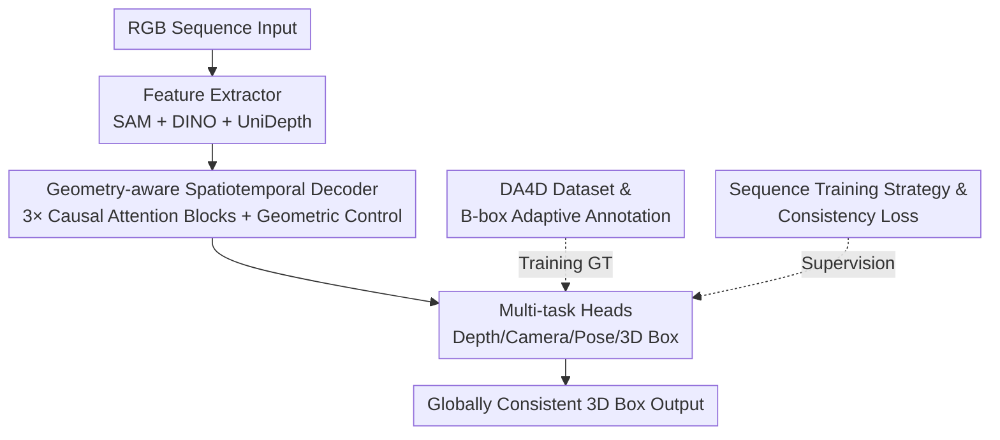

# DetAny4D: Detect Anything 4D Temporally in a Streaming RGB Video

**Conference**: CVPR 2026  
**Paper**: [CVF Open Access](https://openaccess.thecvf.com/content/CVPR2026/html/Hou_DetAny4D_Detect_Anything_4D_Temporally_in_a_Streaming_RGB_Video_CVPR_2026_paper.html)  
**Code**: To be released (the paper states data and code will be open-sourced after acceptance)  
**Area**: 3D Vision / Object Detection  
**Keywords**: 4D Detection, Streaming Video, Open-Vocabulary 3D Detection, Spatiotemporal Consistency, Causal Attention

## TL;DR
DetAny4D defines "continuous 3D bounding box prediction in streaming RGB videos" as a 4D detection task. It utilizes an end-to-end open-vocabulary framework (SAM + DINO + UniDepth features + Causal Spatiotemporal Decoder + multi-task heads) to directly output globally consistent 3D boxes across frames. Accompanying this is the DA4D dataset comprising 280,000 sequences, which reduces cross-frame jitter variance by 10–30% compared to single-frame detectors.

## Background & Motivation
**Background**: Monocular 3D detection (Cube R-CNN, OVMono3D, DetAny3D) can already predict 3D boxes from single images or pre-scanned point clouds, with increasing open-vocabulary capabilities. However, the real world consists of streaming videos, necessitating "stable and consistent 3D boxes across continuous frames."

**Limitations of Prior Work**: Applying single-frame detectors frame-by-frame leads to independent predictions without temporal modeling. When converting 3D boxes from each frame to a global coordinate system, they often conflict, resulting in significant jitter and temporal inconsistency. Another approach involves multi-stage pipelines—single-frame detection, followed by tracking, and then 3D association/fusion—which are architecturally cumbersome and prone to error propagation through cascaded stages. Spatiotemporal detection methods in autonomous driving typically cover only a few categories and lack open-vocabulary capabilities.

**Key Challenge**: The need to accurately detect objects in newly arrived frames while maintaining long-term memory and global consistency. Neither "frame-by-frame independent" nor "multi-stage post-processing" paradigms simultaneously solve these goals. A more fundamental bottleneck is the lack of large-scale datasets with continuous and reliable 3D box annotations, as spatiotemporal labeling costs are extremely high.

**Goal**: (1) Construct a large-scale 4D dataset with spatiotemporally aligned 3D box annotations; (2) Design a temporal modeling mechanism capable of maintaining long-term memory while accurately detecting objects in the current frame; (3) Handle sequences of arbitrary length and output stable and consistent 3D detections under dynamic viewpoint changes.

**Key Insight**: Rather than stacking multi-stage post-processing, it is better to let an end-to-end model directly predict globally consistent 3D boxes from sequence inputs—integrating temporal consistency into the network architecture and loss functions rather than fixing it after the fact.

**Core Idea**: Use a "Causal Spatiotemporal Decoder + Multi-task Heads + Consistency Loss" to end-to-end regress globally consistent 3D boxes directly from RGB sequences. This is supported by an adaptive bounding box annotation pipeline that accumulates training data.

## Method

### Overall Architecture
DetAny4D receives an RGB sequence and extracts features frame-by-frame using pre-trained foundation models. After injecting these into a unified 3D space, it aggregates them across frames using a spatiotemporal decoder. Multi-task heads then output 3D boxes that are temporally consistent and defined within the global coordinate system of each frame. The entire pipeline is end-to-end: there is no independent tracker or post-hoc 3D association; temporal consistency is guaranteed by the structural constraints of causal attention and consistency losses.

The framework is supported by two main components: an **offline data pipeline**—the DA4D data generation pipeline, which filters physically plausible, adaptively accumulated global 3D boxes from RGB sequences with poses recorded in a simulator; and an **online model pipeline**—Feature Extractor → Geometry-aware Spatiotemporal Decoder → Multi-task Heads. The relationship is shown below:

### Key Designs

**1. DA4D Dataset & Adaptive B-box Annotation: Solving the Root Problem of Missing Reliable 3D Supervision**

A major bottleneck for 4D detection has been the lack of large-scale datasets with temporally aligned 3D boxes, as manual annotation is prohibitively expensive. The authors used the Habitat simulator to drive a robot in a random walk, recording RGB sequences with depth and camera poses. These were cut into overlapping fixed-length segments. The overlap is intentional, allowing the same object to have diverse initial visibilities (e.g., gradually moving out of view or entering from off-screen) to force the model to handle visibility changes.

Crucially, instead of simply projecting global 3D boxes into each frame (which would include noisy boxes for heavily occluded or distant objects), a two-step process is used: first, filtering based on semantics, depth, and occlusion—**if more than 5 of the 8 vertices of a 3D box fall behind pixels (depth comparison), it is removed as heavily occluded**. Second, adaptive b-box calculation is performed. For objects that are initially **partially visible** (e.g., only half of an L-shaped sofa is shown), the full global box cannot be used as GT immediately, as predicting the whole box from partial information is physically unreasonable and causes error propagation. Instead, visible pixels are back-projected into local point clouds to calculate a tighter temporary box that expands as the sequence progresses:

$$P_t(O) = P_{t-1}(O) \cup \pi^{-1}(M_t(O), D_O)$$

where $\pi^{-1}$ is the back-projection function and $M_t(O)$ is the mask of the object at frame $t$. Once the object is fully observed, it switches back to the original global box. Coordinates are stored as relative transforms with the first frame as the reference. DA4D unifies 12 datasets into over 280,000 sequences.

**2. Geometry-aware Spatiotemporal Decoder: Modeling Temporal Memory with Causal Attention**

Frame-by-frame detection jitters because there is no information flow between frames. The authors integrate temporal modeling into the decoder. They first use a feature extractor (frozen ViT-H SAM + ViT-L DINOv2 aggregated via a cross-attention module) for 2D semantic features, and UniDepth-V2 for geometry-aware embeddings $E_{geo}^t=\{E_{depth}^t, E_{cam}^t\}$. Prompts are encoded as $T_{prompt}$ and concatenated with box tokens $T_{box}$ to form the query $T^t$.

The decoder consists of three **Causal Attention Blocks (CAB)**. One CAB interacts tokens $T^{1:t}$ with image embeddings $E_{img}^{1:t}$; another generates geometric control embeddings $G_{control}$ (injecting 3D space information); the third fuses these to feed the heads. CAB uses **causal masks**—a lower triangular matrix based on sequence length—to ensure the current frame can only see the past, preventing information leakage.

**3. Multi-task Heads: Dense Supervision via Geometric Auxiliary Tasks**

Supervising only 3D boxes makes it difficult for the model to learn geometric consistency or camera motion. The authors attach heads at two stages: depth and camera intrinsic heads (following UniDepth) for metric depth and intrinsics, and camera pose and 3D box heads after the decoder. The pose head predicts relative poses per frame, allowing the model to explicitly model viewpoint transformations and correctly transform boxes to the global system. Ablations show this significantly impacts convergence; removing multi-task heads causes $\mathrm{Var}_v$ to jump from 0.54 to 0.91.

**4. Sequence Training Strategy & Consistency Loss: Ensuring Temporal Consistency**

To handle variable sequence lengths, sequences are **randomly cropped** within a maximum length during training. Single-frame samples are interleaved to maintain basic detection capability. Object counts are managed by **padding prompts** to a fixed dimension and ignoring predictions for padding tokens.

The 3D box supervision uses a composite loss $L_{det}$. For geometrically symmetric objects where length/width may not be globally consistent across viewpoints, height uses L1 loss while length/width use a softmin robust matching:

$$L_{dim}=L_h+\sum_{k=1,2}\frac{w_k\, l_{wl}^{(k)}}{w_l},\quad w_k=\frac{\exp(-l_{wl}^{(k)}/\tau)}{\sum_{m=1}^{2}\exp(-l_{wl}^{(m)}/\tau)},\ \tau=0.1$$

$l_{wl}$ calculates L1 losses for possible permutations of length/width. The consistency loss $L_{cons}=L_{spatial}+L_{temp}$ is crucial: $L_{spatial}$ constrains transformed boxes $B_w^i$ to align with global GT, while $L_{temp}$ constrains per-frame predictions to align with their temporal average $\bar{B}_w$.

### Loss & Training
SAM/DINO encoders and the 2D aggregator are frozen; only the decoder and heads are trained. AdamW optimizer with an initial learning rate of 1e-4, cosine annealing, 200 epochs. Input resized and padded to 448; maximum training sequence length of 10.

## Key Experimental Results

### Main Results
Comparison on DA4D against monocular 3D detection and video 4D detection. $\mathrm{Var}_v / \mathrm{Var}_c$ represent the temporal variance of vertices/centers of an instance relative to its global mean (lower is more stable).

| Method | Type | Full DA4D AP₃D↑ | Var_v↓ | Var_c↓ |
|------|------|------|------|------|
| ImVoxelNet | Mono-3D | 11.98 | 1.50 | 1.43 |
| Cube R-CNN | Mono-3D | 21.76 | 1.27 | 1.20 |
| OV Mono3D | Mono-3D | 24.39 | 1.26 | 1.23 |
| DetAny3D | Mono-3D | 27.16 | 0.99 | 0.90 |
| Kinematic3D* | Video-4D | 25.46 | 0.85 | 0.78 |
| **DetAny4D (ours)** | E2E-4D | **27.48** | **0.70** | **0.64** |

While AP is comparable to the strongest single-frame detector (DetAny3D), temporal variance is significantly lower, reducing cross-frame variance by 10–30%.

### Ablation Study
Components added incrementally on 10% of the training data:

| Configuration | AP₃D↑ | Var_v↓ | Var_c↓ | Description |
|------|------|------|------|------|
| Base (Single-frame) | 26.78 | 0.95 | 1.01 | No temporal info |
| + Causal Attention | 26.84 | 0.93 | 0.98 | Sequence modeling enabled |
| + Soft Dim Loss | 26.88 | 0.91 | 0.96 | Global box adaptation |
| + Multi-task Heads | 27.15 | 0.60 | 0.51 | Jitter drops significantly |
| + Depth & Cam Heads | 27.28 | 0.59 | 0.50 | Dense geometric supervision |
| + Pose & Consist (Ours) | 27.29 | 0.54 | 0.48 | Full model |

### Key Findings
- **Multi-task heads are the primary jitter reducers**: Adding multi-task heads dropped Var_v from 0.91 to 0.60, the largest contribution to temporal stability.
- **Soft dimension loss is vital**: Removing it led to significant errors in length/width, proving the necessity of permutation-invariant losses for global box annotations.
- **AP does not significantly increase with temporal info**: Temporal design mainly improves stability rather than absolute single-frame accuracy, aligning with the goal of 4D detection.

## Highlights & Insights
- **Architecture over Post-processing**: Moving consistency into the architecture via causal masks and $L_{temp}$ avoids the error propagation common in multi-stage pipelines.
- **Smart Adaptive Labeling**: Using incremental point clouds $P_t(O)=P_{t-1}\cup\pi^{-1}(\cdot)$ to grow boxes solves the noise issue where supervising a full box from a partially visible object is physically inconsistent.
- **Permutation-invariant Dimension Loss**: Addresses the ambiguity of length/width definitions across viewpoints for symmetric objects.
- **Dual-purpose Padding Tokens**: Used both for aligning variable object counts during training and detecting new objects during inference.

## Limitations & Future Work
- **Dependency on Simulators**: DA4D is primarily based on the Habitat simulator; the sim-to-real gap on real-world videos is not fully explored.
- **AP vs SOTA**: The trade-off prioritizes consistency over极致 single-frame precision.
- **Training Cost**: 200 epochs take ~2 weeks; scalability to very long sequences is unverified as the max length in training was 10.
- **Upstream Dependencies**: Geometric supervision relies on the quality of pre-trained models like UniDepth.

## Related Work & Insights
- **vs DetAny3D**: Reuses its features but extends to sequence modeling. Accuracy is similar, but stability (variance) is much better.
- **vs Kinematic3D**: Uses ego-motion compensation and Kalman filtering for post-fusion; DetAny4D is end-to-end and has lower variance.
- **vs ConceptGraph***: A multi-stage RGB-D method; DetAny4D outperforms it using only RGB sequences end-to-end (F1@0.5 45.5 vs 41.9).

## Rating
- Novelty: ⭐⭐⭐⭐ First end-to-end open-vocabulary 4D detection benchmark; solid data pipeline and consistency loss design.
- Experimental Thoroughness: ⭐⭐⭐⭐ Complete comparison and ablation with dual metrics (AP and Variance), though real-video generalization needs more validation.
- Writing Quality: ⭐⭐⭐⭐ Clear task definition and diagrams; clear explanations for complex formulas.
- Value: ⭐⭐⭐⭐ The DA4D dataset and the end-to-end 4D paradigm provide significant value to the streaming 3D perception community.

<!-- RELATED:START -->

## Related Papers

- [\[CVPR 2026\] Detect Anything via Next Point Prediction](detect_anything_via_next_point_prediction.md)
- [\[CVPR 2026\] Beyond Caption-Based Queries for Video Moment Retrieval](beyond_caption-based_queries_for_video_moment_retrieval.md)
- [\[CVPR 2026\] Beyond Duality: A Hybrid Framework of Leveraging Shared and Private Features for RGB-Event Object Detection](beyond_duality_a_hybrid_framework_of_leveraging_shared_and_private_features_for_.md)
- [\[CVPR 2026\] UAV-CB: A Complex-Background RGB-T Dataset and Local Frequency Bridge Network for UAV Detection](uav-cb_a_complex-background_rgb-t_dataset_and_local_frequency_bridge_network_for.md)
- [\[CVPR 2026\] D2FANet: Enhancing Video Object Detection with Dual-Domain Feature Aggregation Network](d2fanet_enhancing_video_object_detection_with_dual-domain_feature_aggregation_ne.md)

<!-- RELATED:END -->
