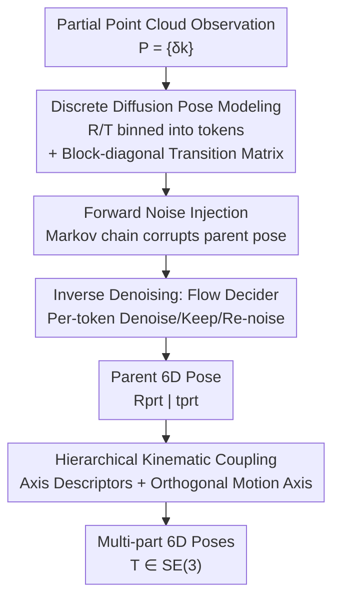

# DICArt: Advancing Category-level Articulated Object Pose Estimation in Discrete State-Spaces

**Conference**: CVPR 2026  
**Paper**: [CVF Open Access](https://openaccess.thecvf.com/content/CVPR2026/html/Zhang_DICArt_Advancing_Category-level_Articulated_Object_Pose_Estimation_in_Discrete_State-Spaces_CVPR_2026_paper.html)  
**Code**: [Project Page](https://sites.google.com/view/dicartpub) (Project page only, source code not yet available)  
**Area**: 3D Vision  
**Keywords**: Articulated object pose estimation, category-level 6D pose, discrete diffusion, kinematic constraints, embodied AI

## TL;DR
DICArt reformulates category-level 6D articulated object pose estimation as a **conditional discrete diffusion** process. Specifically, it discretizes rotation and translation into tokens, utilizes a "flow decider" for step-by-step denoising, and couples the estimation of each part according to the parent-child kinematic hierarchy. It significantly outperforms existing methods on synthetic, semi-synthetic, and real-world robotic arm data.

## Background & Motivation
**Background**: Category-level 6D pose estimation requires predicting the 3D rotation and translation of **unseen instances** given partial point cloud observations. While mature solutions like NOCS and CASS exist for rigid bodies, research on articulated objects (e.g., laptops, eyeglasses, drawers, robotic arms)—which consist of multiple rigid parts connected by joints—has lagged behind despite being central to robotic manipulation and scene understanding.

**Limitations of Prior Work**: Current mainstream approaches treat pose estimation as **regression in continuous space**. This leads to two specific issues: ① Precision is limited because accurate estimation requires exhaustive searching in a vast, complex space, while input point clouds are **discretely and non-uniformly sampled**. This fundamental mapping mismatch between discrete inputs and continuous outputs hinders accuracy. ② Most articulated pose methods adopt a **part-wise** strategy (independent estimation for each part), ignoring the kinematic constraints imposed by joints and showing poor robustness when large parts obscure smaller moving parts (self-occlusion).

**Key Challenge**: The search space for continuous regression is too large and misaligned with discrete point cloud inputs, while independent part modeling loses the strong prior that "child part motion is locked by joints."

**Goal**: (1) Replace the massive continuous search space with a **pre-configured discrete state-space** to ensure the generation process naturally falls within physically plausible pose intervals; (2) Explicitly inject kinematic structures to mitigate self-occlusion.

**Core Idea**: Use **discrete diffusion** instead of continuous regression for pose estimation. Each part's rotation and translation are discretized into sequences of tokens, and the ground truth pose is recovered from noise through a learned reverse diffusion process. This is combined with a **hierarchical kinematic coupling** mechanism to constrain child part poses to trajectories defined by the joints.

## Method

### Overall Architecture
Input consists of partial point cloud observations $P=\{\delta_k\}_{k=1}^{K}$ for $K$ rigid parts, and output consists of 6D poses $T=\{R^{(k)}, t^{(k)}\}_{k=1}^{K}\in SE(3)$ for each part. DICArt formulates this as conditional generation $p_\theta(T\mid P)$.

The pipeline consists of three sequential stages: ① **Pose Discretization + Forward Diffusion**: Rotation matrices are converted to three Euler angles and translations to three-axis coordinates, which are uniformly binned into integers in $[1,K]$. Each pose element thus becomes a sequence of 6 discrete tokens $e_i=\{l_i,m_i,n_i,x_i,y_i,z_i\}$. The forward process corrupts the GT tokens into noise via a fixed Markov chain. ② **Reconstructed Reverse Denoising**: Starting from pure noise, a "flow decider" determines per token whether to denoise, keep, or re-noise to recover the 6D pose of the **parent part**. ③ **Hierarchical Kinematic Coupling**: Using the parent part as the reference frame, MLPs predict the joint axis descriptors and motion axes for each **child part**. Child poses are then derived following the kinematic rules of revolute/prismatic joints to assemble the final articulated pose.

### Key Designs

**1. Discrete Diffusion Pose Modeling: Replacing Continuous Regression with Denoising in Discrete Space**

To address the mapping mismatch and large search space, DICArt no longer regresses continuous poses. Instead, 6D poses are discretized into tokens and generated via **conditional discrete diffusion**. Rotation matrices are decomposed into Euler angles binned in the $[0°, 360°)$ periodic domain, and translation axes are binned similarly. This results in two semantic categories of tokens: rotation-related $\{l,m,n\}$ and translation-related $\{x,y,z\}$. Forward corruption is defined as $q(x_t\mid x_{t-1})=x_t Q_t x_{t-1}$, and the learned posterior $p_\theta(x_{t-1}\mid x_t)$ recovers the signal.

Two crucial transition matrix designs are introduced. First, **Block-diagonal Constraints**: Standard discrete diffusion might cause tokens to jump between semantic categories (e.g., a rotation token becoming a translation token). The transition matrix is restricted to be block-diagonal to allow transitions only **within the same semantic category**:

$$Q^{pose}_t = \begin{pmatrix} Q^{rot}_t & \\ & Q^{tsl}_t \end{pmatrix}$$

Second, **Smooth Classification**: Unlike standard classification, adjacent bins in pose space are geometrically continuous. The state space is expanded from $K$ to $K+1$ by introducing a special `[MASK]` token. $Q_t\in\mathbb{R}^{(K+1)\times(K+1)}$ encodes $K$ quantized pose classes and a dynamic mask state, allowing the reverse process to correct uncertain tokens more flexibly.

**2. Reconstructed Inverse Process & Flow Decider: Synchronized Convergence for Coupled Tokens**

When rotation is decomposed into three Euler angles, they are semantically related yet independent. Traditional discrete diffusion struggles with **asynchronous convergence**—where some tokens converge early while others remain noisy—which destroys semantic consistency. DICArt introduces a **flexible flow decider** that allows each token to adaptively choose between "denoise," "keep," or "re-noise" at each step.

The reverse transition is conditioned on whether $x_t$ equals $x_0$:

$$q(x_{t-1}\mid x_t, x_0)=\begin{cases}\lambda^{(1)}_{t-1}x_t+(1-\lambda^{(1)}_{t-1})x_T, & x_t=x_0\\ \lambda^{(2)}_{t-1}x_0+(1-\lambda^{(2)}_{t-1})q_{noise}(x_t), & x_t\neq x_0\end{cases}$$

Binary flow indicators $\{v_{t-1}\}$ (sampled via Gumbel-Softmax) unify this into a differentiable sampler. By marginalizing $v_{t-1}$, the reverse transition $q(x_{t-1}\mid x_t,x_0)=\mathbb{E}_{v_{t-1}\sim GS(\lambda_{t-1})}[\cdot]$ provides an adaptive denoising pace, preventing aggressive early convergence and ensuring stable pose prediction.

**3. Hierarchical Kinematic Coupling: Combating Self-occlusion with Joint Priors**

Instead of independent part estimation, DICArt classifies parts into **parent parts** (the global reference moving freely in 3D) and **child parts** (motion strictly dependent on the parent and joints). Poses are expressed as a **coupled state**, which is easier to learn than independent 6D poses. Even with sparse child part observations, the limited visibility is often sufficient to infer the coupled state relative to the parent.

Two joint types are parameterized: **revolute joints** $\phi_r=(u_r, q_r)$ (unit direction $u_r$ and rotation center $q_r$) and **prismatic joints** $\phi_p=(u_p)$ (sliding direction). Two MLPs predict: ① **Axis descriptors** to determine direction $u$ and alignment with the child part $a^{(k)}$; ② **Motion axis $b^{(k)}$** with an **orthogonal constraint** $b^{(k)}\perp a^{(k)}$ to ensure trajectories strictly follow kinematic laws.

## Key Experimental Results

### Main Results

Comparison on the ArtImage synthetic dataset against four SOTA methods (A-NCSH / GenPose / OP-Align / ShapePose). Representative categories (lower rotation error is better, in degrees):

| Category | Metric | A-NCSH | GenPose | ShapePose | DICArt |
|------|------|--------|---------|-----------|--------|
| Laptop | Part Rot Err (°) | 5.3, 5.4 | 5.3, 6.1 | 5.0, 4.6 | **3.2, 3.9** |
| Eyeglasses | Tsl Err (m) | 0.049,0.313,0.324 | 0.063,0.113,0.301 | 0.049,0.106,0.108 | **0.041,0.091,0.083** |
| Dishwasher | Part Rot Err (°) | 4.0, 4.8 | 6.1, 6.3 | 3.9, 4.3 | **2.9, 3.7** |
| Scissors | Part Rot Err (°) | 2.0, 2.9 | 4.1, 3.5 | 2.3, 2.9 | **1.7, 2.2** |

On the real-world 7-part RobotArm dataset, DICArt significantly reduces average rotation error compared to A-NCSH (e.g., from 7.8~23.5° across parts down to 1.6~15.1°), with the most pronounced gains at the distal parts where self-occlusion is highest.

### Ablation Study

Conducted on the "Drawer" category:

| Configuration | Rot Err (°) | Tsl Err (m) | Description |
|------|-----------|-----------|------|
| Continuous Diffusion | 3.1 | 0.143 | Discrete → Continuous, significant drop |
| **Discrete Diffusion (Ours)** | **1.7** | **0.072** | Validates discrete state-space efficiency |
| w/o Reconstructed Denoising | 4.0 | 0.128 | Without flow decider, error doubles |
| **w/ Reconstructed Denoising** | **1.7** | **0.072** | Flow decider is critical for precision |

**Self-occlusion Robustness**: Under visibility ratios of 0–40% / 40–80% / 80–100%, rotation error remained stable at 1.8 / 1.9 / 1.9°, showing almost no degradation under heavy occlusion.

### Key Findings
- **Discrete vs. Continuous is a major gain source**: Switching the diffusion process from continuous to discrete reduced Drawer rotation error from 3.1° to 1.7°, validating that the pre-configured discrete space is easier to search.
- **Flow Decider is essential**: Removing it increased rotation error from 1.7° to 4.0°, proving that synchronized convergence is vital for coupled Euler angle tokens.
- **Kinematic coupling ensures robustness**: Stable rotation error across all occlusion levels (1.8→1.9°) confirms that the coupled state representation can infer obscured part poses from limited visibility.

## Highlights & Insights
- **Pose Regression as Discrete Token Denoising**: Reformulating the task aligns the "discreteness" of point clouds with the output space, bypassing the pitfalls of continuous exhaustive search.
- **Block-diagonal Transition Matrix**: A simple yet effective trick to preserve structural integrity by preventing rotation and translation tokens from corrupting each other.
- **Solving Asynchronous Convergence**: The flow decider uses a differentiable Gumbel-Softmax gate to manage denoising pace, offering a general improvement for discrete diffusion on various tasks.
- **Coupled States vs. Self-occlusion**: By locking child parts to joint axes, the model turns "visible inference" into a structural guarantee, which is invaluable for complex articulated hierarchies like robotic arms.

## Limitations & Future Work
- **Code availability**: The source code is not yet public, making reproduction difficult.
- **Dependency on known hierarchy**: The method assumes a known number of parts and parent-child hierarchy. Handling unknown part counts or cyclic joint loops remains unaddressed.
- **Inference Latency**: With $T=100$ diffusion steps, the iterative reverse process may be too slow for real-time robotics; latency data was not reported.
- **Quantization Limits**: Accuracy is theoretically capped by the binning resolution. The trade-off between precision (finer bins) and efficiency (state space size) requires further analysis.

## Related Work & Insights
- **vs. GenPose (Continuous Diffusion)**: Both use diffusion, but DICArt operates in discrete token space. Ablation shows that DICArt's discrete approach is significantly more effective given the same architecture.
- **vs. A-NCSH / ReArtNet (Part-wise estimation)**: These methods fail under self-occlusion because they ignore joint constraints. DICArt's hierarchical coupling provides superior robustness.
- **vs. D3PM (Discrete Diffusion)**: While borrowing structured corruption and the `[MASK]` token from D3PM, DICArt introduces task-specific innovations like block-diagonal transitions and the flow decider.

## Rating
- Novelty: ⭐⭐⭐⭐⭐ First to model category-level articulated pose as discrete diffusion with task-specific innovations.
- Experimental Thoroughness: ⭐⭐⭐⭐ Coverage of synthetic and real data is strong, though missing latency and binning sensitivity analysis.
- Writing Quality: ⭐⭐⭐⭐ Clear motivation and complete formulations, though the Gumbel-Softmax derivation is dense.
- Value: ⭐⭐⭐⭐ Provides a robust new paradigm for articulated 6D pose estimation in occluded robotic environments.

<!-- RELATED:START -->

## Related Papers

- [\[CVPR 2026\] ComPose: A Unified Completion-Pose Framework for Robust Category-Level Object Pose Estimation](compose_a_unified_completion-pose_framework_for_robust_category-level_object_pos.md)
- [\[CVPR 2026\] EmbodMocap: In-the-Wild 4D Human-Scene Reconstruction for Embodied Agents](embodmocap_in-the-wild_4d_human-scene_reconstruction_for_embodied_agents.md)
- [\[CVPR 2026\] Cov2Pose: Leveraging Spatial Covariance for Direct Manifold-aware 6-DoF Object Pose Estimation](cov2pose_leveraging_spatial_covariance_for_direct_manifold-aware_6-dof_object_po.md)
- [\[CVPR 2026\] Breaking the 3D Dataset Bottleneck: Fast Scalable Generation of Aligned 3D Assets from Scratch for Category 6D Pose Estimation and Robotic Grasping](breaking_the_3d_dataset_bottleneck_fast_scalable_generation_of_aligned_3d_assets.md)
- [\[CVPR 2026\] CARI4D: Category Agnostic 4D Reconstruction of Human-Object Interaction](cari4d_category_agnostic_4d_reconstruction_of_human_object_interaction.md)

<!-- RELATED:END -->
