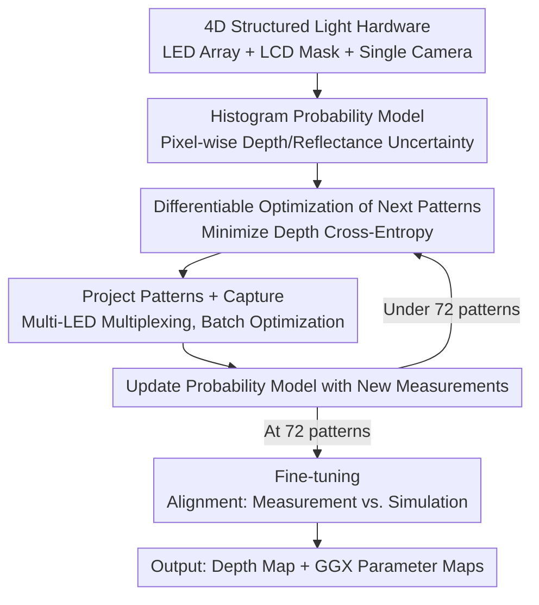

# Differentiable Adaptive 4D Structured Illumination for Joint Capture of Shape and Reflectance

**Conference**: CVPR2026  
**arXiv**: [2605.06214](https://arxiv.org/abs/2605.06214)  
**Code**: TBD  
**Area**: 3D Vision / Appearance Capture (structured light / SVBRDF)  
**Keywords**: 4D Structured Light, Differentiable Capture, Adaptive Illumination, Depth Uncertainty, GGX SVBRDF

## TL;DR
Using a unified "spatial-angular 4D structured light" hardware (LED array + LCD mask + single camera), this work **differentiably optimizes the next set of light/mask patterns in real-time** during the capture process to minimize pixel-wise depth uncertainty. This enables efficient joint reconstruction of object shape (depth map) and reflectance (GGX SVBRDF) from a single viewpoint, reducing exposure time by up to 100$\times$ and total acquisition time by 2$\times$.

## Background & Motivation
**Background**: Active structured light is a mainstream method for high-quality geometry or reflectance capture—spatial patterns are projected for triangulation to obtain shape, while angular patterns (illumination multiplexing) are used to convolve with the BRDF for appearance. Recently, Xu et al. [43] proposed a unified spatial-angular **4D structured light** system, compressing both illumination types into a single compact hardware setup using an LED array and an LCD mask.

**Limitations of Prior Work**: Although [43] can capture spatial and angular information simultaneously in hardware, its efficiency is poor—scanning a single viewpoint takes **24 minutes**. Most of the time is spent on geometry capture, where only **one LED** is lit at a time. Limited single-lamp power leads to exposures as long as 20s. Crucially, its illumination patterns are **pre-optimized offline** and are not optimal for a specific object.

**Key Challenge**: Illumination patterns are either "universal but inefficient" (pre-optimized, single-lamp, slow) or "efficient but requiring adaptation." Pre-optimized patterns cannot allocate the capture budget to the "most uncertain" regions based on the current object's shape and material, leading to wasted exposure on already determined areas.

**Goal**: (1) Enable simultaneous multi-LED illumination to shorten exposure; (2) Make illumination patterns **adapt online** to the object during capture, concentrating measurements on pixels where depth is hardest to determine; (3) Obtain both shape and reflectance in a single acquisition session.

**Key Insight**: Modeling the decision of "what pattern to project next" as a **differentiable optimization** problem. If the chain of "pattern $\to$ measurement $\to$ uncertainty" can be connected differentiably, gradients can be used to solve for the most informative next pattern. The authors further observe that reflectance can be reliably recovered even with very few varying illumination images; thus, the optimization objective is **focused solely on the more difficult depth uncertainty**, with reflectance obtained as a byproduct.

**Core Idea**: A histogram-based probability model is used to quantify depth/reflectance uncertainty for each pixel. The "next set of light/mask patterns" is then **differentiably linked to a loss that reduces depth uncertainty**. Optimization occurs during capture, followed by a joint fine-tuning of the depth map and GGX parameters.

## Method

### Overall Architecture
The pipeline consists of two stages. **Stage 1 (Differentiable Adaptive Capture)**: For each valid pixel, a histogram-based depth/reflectance probability model is established to quantify current uncertainty. Next, the **next batch of light/mask patterns is differentiably optimized** to minimize total depth uncertainty. The patterns are projected, images are captured, and the probability model is updated with new measurements. This loop continues for 72 patterns. **Stage 2 (Fine-tuning)**: Using the initial estimates from Stage 1, the difference between "physical measurements vs. simulated measurements" is minimized to jointly refine the depth map and GGX reflectance parameter maps. The final output is a depth map and several texture maps storing GGX BRDF parameters.

The foundation of this chain is a **forward imaging model** (Eq. 1): The measurement $I_{j,k}$ of pixel $k$ under the $j$-th pattern set is $I_{j,k}=\sum_l f_{k,l}\,F\,L_j(l)\,\Psi(-\omega^i_k)\int_A L(\mathbf{x}_l)M_{j}(\mathbf{x}_l\leftrightarrow\mathbf{x}_k)\,dA$. This model differentiably couples LED intensity $L_j(l)$, mask values $M_j$, BRDF $f_{k,l}$, and shape factor $F$, providing the basis for computing gradients with respect to the patterns.

### Key Designs

**1. Histogram Probability Model: Quantifying uncertainty as an optimizable metric**

To achieve adaptive capture, a metric for "remaining uncertainty" is required. The authors build a **histogram-based probability mass function** for the depth of each valid pixel and each BRDF parameter, assuming independence between parameters. For depth: the camera ray is intersected with the effective volume (a $15\text{cm}^3$ cube) to determine the range $[z_{\min},z_{\max}]$, which is uniformly divided into $n_{\text{bin}}=100$ bins. Each bin stores the highest ZNCC score among all random candidates falling within that bin. ZNCC is computed between physical measurements and Eq. 1 simulated measurements. The reflectance model follows a similar principle, with ranges derived from OpenSVBRDF [28] statistics and $1/L_1$ distance replacing ZNCC. Updates use Monte Carlo sampling: $n_{\text{sample}}=600$ candidates per round are scored, the highest score is written back to the corresponding bin, and the distribution is normalized. As measurements increase under adaptive illumination, the distribution **converges toward the ground truth** (becoming sharper/more certain).

**2. Differentiable Optimization of Next Patterns: Guiding hardware with gradients**

The core is connecting "next patterns" to the "uncertainty reduction" loss. Depth estimation is treated as a **multi-class classification problem**. Candidates are sampled from the current probability distribution, each forming a class. Pixel-wise uncertainty is expressed as cross-entropy $-\sum_{a,b}y_{a,b}\log(\hat y_{a,b})$, where the predicted likelihood $\hat y_{a,b}=\dfrac{e^{\mathrm{ZNCC}(\{I_{j,a}\},\{I_{j,b}\})}}{\sum_b e^{\mathrm{ZNCC}(\{I_{j,a}\},\{I_{j,b}\})}}$ is calculated from simulated measurements under "existing + next" patterns. Intuitively, this loss encourages **different candidates to produce as distinguishable measurements as possible under the optimized pattern**—focusing on patterns that differentiate between "unresolved depth candidates." Since Eq. 1 is differentiable, gradient descent is applied directly to the next set of light/mask patterns. For physical realizability, pattern pixels pass through a sigmoid to $[0,1]$. Mask pixels are multiplied by a large scalar ($10^8$) before the sigmoid to approximate binary 0/1 values. The loss **targets only depth uncertainty**, as reflectance is reliably recovered with fewer images.

**3. Multi-LED Multiplexing + Batch Pattern Optimization: Eliminating single-lamp inefficiency**

[43] projects one LED at a time with 20s exposures, creating a bottleneck. This work allows **multiple LEDs to be lit simultaneously**, forming multiplexed illumination. Single exposure time drops to 0.2s, reducing total exposure time by up to **100$\times$**. To amortize optimization overhead, **$n_{\text{batch}}=3$ patterns are optimized per batch**. Another speedup is candidate pruning: indices with ZNCC significantly lower than the current optimum are unlikely to be the solution, and candidates too close in depth to the optimum exceed LCD resolution. Thus, only the **top $n_{\text{peak}}=3$** peaks in the ZNCC distribution are used for cross-entropy (using a local maxima filter with adaptive thresholds), accelerating convergence without losing the true solution.

**4. Two-step Fine-tuning: Circumventing GGX optimization difficulty**

Adaptive capture provides coarse histogram-level estimates. Stage 2 refines these. First, **Initialization**: Each histogram bin is subdivided into 5 parts, and the coarse depth/GGX values from the highest-scoring bin are used as initials. Second, **Joint Fine-tuning**: Minimize the difference between physical and simulated measurements. Since direct optimization of raw GGX parameters is difficult [43], the BRDF is **re-parameterized into a 16-D neural latent vector + 5 MLPs**. Each MLP maps the latent vector to one GGX parameter for easier differentiable optimization. Resolution-wise, patterns are computed at $127\times64$, while fine-tuning progressively upsamples from low resolution to the original resolution (approx. $1024\times1024$).

### Loss & Training
- **Capture Phase Loss**: Sum of depth cross-entropy (Eq. 3) for all valid pixels, optimizing only depth uncertainty.
- **Fine-tuning Phase Loss**: Difference between physical and simulated measurements (Eq. 1), jointly optimizing depth + GGX latent vectors.
- Adam optimizer, learning rate $10^{-3}$, weight decay $10^{-6}$, PyTorch implementation.
- Termination: Capture ends after 72 ($3\times24$) light/mask patterns are projected.

## Key Experimental Results

Experiments were conducted on 10 real objects (9–15cm) with appearances ranging from diffuse clay/wood to specular metallic paint. Single exposure was 0.2s using LDR input; hardware included an RTX 3090. Adaptive capture took approx. **10 minutes** (mostly pattern optimization, total exposure only **15 seconds**), and joint fine-tuning took approx. 2 hours. Geometry quality was measured by RMSE, inlier ratio (error < 3mm), and inlier RMSE, with ground truth from a commercial 3D scanner.

### Main Results (Geometry, selected from Fig. 6)

| Object | Method | Global RMSE | inlier RMSE (Ratio) |
|------|------|-----------|--------------------|
| Pig | Ours (Adaptive) | **3.75mm** | 0.31mm (97%) |
| Pig | Ours (Non-adaptive) | 4.68mm | 0.47mm (94%) |
| Pig | Xu et al. [43] | 12.12mm | 0.60mm (81%) |
| Pig | MPS [16] | 66.39mm | 1.13mm (60%) |
| Rabbit | Ours (Adaptive) | **2.26mm** | 0.28mm (99%) |
| Rabbit | Xu et al. [43] | 4.21mm | 0.52mm (94%) |
| Rabbit | MPS [16] | 8.99mm | 1.04mm (95%) |
| Hedgehog | Ours (Adaptive) | **7.30mm** | 0.50mm (91%) |
| Hedgehog | Xu et al. [43] | 11.66mm | 0.61mm (82%) |
| Hedgehog | MPS [16] | 44.05mm | 1.32mm (77%) |

For reflectance, the method achieved results comparable to [43] and close to real photos, e.g., Pig (SSIM=0.96 / LPIPS=0.036 / PSNR=34.03), validating the assumption that reflectance is recovered with high quality as a byproduct.

### Ablation Study

| Ablation Dimension | Configuration | Global RMSE | inlier RMSE (Ratio) | Conclusion |
|----------|------|-----------|--------------------|------|
| Adaptive vs. Fixed | Adaptive (Pig) | 3.75mm | 0.31mm (97%) | Adaptation significantly outperforms fixed patterns |
| Adaptive vs. Fixed | Non-adaptive (Pig) | 4.68mm | 0.47mm (94%) | |
| Pattern Count | 36 / 54 / 72 | 4.95 / 4.94 / 4.78mm | 93/93/94% | Accuracy increases with pattern count |
| Sample Count $n_{\text{sample}}$ | 100 / 300 / 600 | 1.87 / 1.79 / 1.75mm | 98.6/98.7/99.1% | More samples improve precision |
| Batch Size $n_{\text{batch}}$ | 2 / 3 / 6 | 3.57 / 3.54 / 3.59mm | 97.9/98.3/97.6% | 3 is the optimal trade-off for capture time |
| Peak Count $n_{\text{peak}}$ | 2 / 3 / 6 | 2.40 / 2.30 / 2.40mm | 97.4/97.9/96.9% | 3 provides the best balance |
| Bin Count $n_{\text{bin}}$ | 50 / 75 / 100 | 7.58 / 7.53 / 7.30mm | 90.2/90.3/91.0% | Finer bins improve accuracy |

Multi-LED lighting reduces RMSE and increases completeness by filling shadows from different lighting directions (Fig. 7).

### Key Findings
- **Adaptation is the Core Gain**: Under 72 patterns, adaptive capture reduced Pig RMSE from 4.68mm to 3.75mm; compared to [43]'s 12.12mm, it is an order-of-magnitude improvement.
- **Efficiency from Multi-LED Multiplexing**: Total exposure is only 15s (compared to 20s for a single shot in [43]), reducing exposure time by 100$\times$ and acquisition time by 2$\times$.
- **Reflectance "For Free"**: Optimizing only depth uncertainty yields reflectance quality comparable to [43].

## Highlights & Insights
- **Turning "Capture Strategy" into Differentiable Optimization**: While previous adaptive capture relied on heuristics or discrete selection, this work performs gradient descent on continuous high-dimensional patterns, representing true end-to-end differentiable capture.
- **Optimizing the Bottleneck**: By recognizing that reflectance is "easy" and depth is "hard," the computational budget is focused on depth while obtaining reflectance as a byproduct.
- **Differentiable Discretization Trick**: Multiplying by $10^8$ before the sigmoid to force 0/1 binary masks while maintaining differentiability is a reusable trick for physical hardware constraints.
- **Physically Grounded Pruning**: Eliminating candidates based on LCD resolution or low probability focuses the cross-entropy loss on valid peaks, improving stability and speed.

## Limitations & Future Work
- **Indirect Light**: The model ignores inter-reflections, which may limit accuracy in scenes with strong mutual reflections.
- **Representation Limits**: Depth maps + parameterized GGX are insufficient for translucent or anisotropic materials; future work could integrate Gaussian Splatting for better relighting.
- **Single Viewport**: The focus is on high-quality single-view reconstruction; full 3D scanning requires multi-view merging.
- **Fine-tuning Speed**: 2 hours of fine-tuning is computationally expensive; pattern optimization (10 mins) also dominates capture time.

## Related Work & Insights
- **vs. Xu et al. [43]**: Shares hardware but [43] is a two-stage "geometry then appearance" approach using single-lamp, pre-optimized 2D patterns. This work is the first **spatial-angular multiplexing with online adaptation**, achieving superior efficiency and quality.
- **vs. MPS [16]**: Traditional phase-shifting patterns underperform significantly in RMSE (e.g., Pig 3.75mm vs. 66.39mm) and do not capture reflectance.
- **vs. Adaptive Capture**: Previous works used discrete selection or specialized in single modalities; this work uses **continuous differentiation** for joint shape and reflectance capture across high-dimensional structured light.

## Rating
- Novelty: ⭐⭐⭐⭐⭐ First 4D spatial-angular learned multiplexing with differentiable online adaptation.
- Experimental Thoroughness: ⭐⭐⭐⭐ Solid testing on 10 real objects with SOTA comparisons and extensive ablation.
- Writing Quality: ⭐⭐⭐⭐ Clear derivation of the imaging model and optimization.
- Value: ⭐⭐⭐⭐ Strong potential for transfer to other active sensing/computational imaging tasks.

<!-- RELATED:START -->

## Related Papers

- [\[CVPR 2026\] D-Prism: Differentiable Primitives for Structured Dynamic Modeling](d-prism_differentiable_primitives_for_structured_dynamic_modeling.md)
- [\[CVPR 2026\] Illumination-Consistent Human-Scene Reconstruction from Monocular Video](illumination-consistent_human-scene_reconstruction_from_monocular_video.md)
- [\[CVPR 2026\] Color-Encoded Illumination for High-Speed Volumetric Scene Reconstruction](color-encoded_illumination_for_high-speed_volumetric_scene_reconstruction.md)
- [\[CVPR 2026\] JRM: Joint Reconstruction Model for Multiple Objects without Alignment](jrm_joint_reconstruction_model_for_multiple_objects_without_alignment.md)
- [\[CVPR 2026\] Hermite Radial Basis Function for Surface Reconstruction via Differentiable Rendering](hermite_radial_basis_function_for_surface_reconstruction_via_differentiable_rend.md)

<!-- RELATED:END -->
