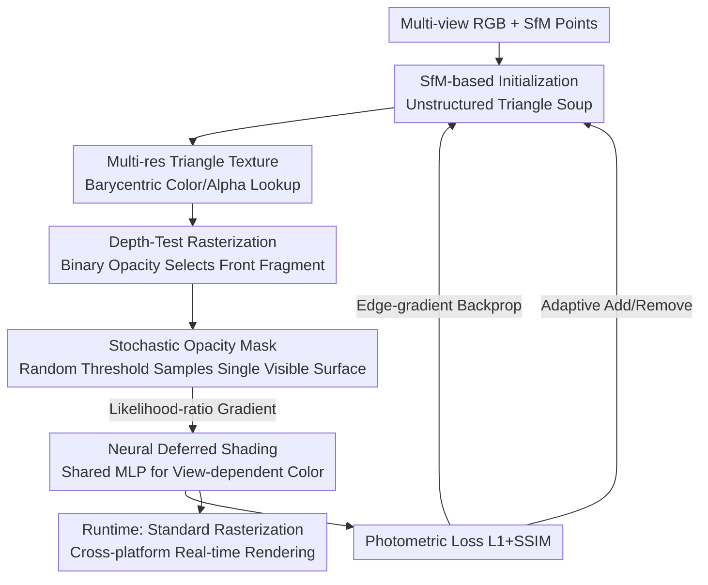

# DiffSoup: Direct Differentiable Rasterization of Triangle Soup for Extreme Radiance Field Simplification

**Conference**: CVPR 2026  
**Paper**: [CVF Open Access](https://openaccess.thecvf.com/content/CVPR2026/html/Tojo_DiffSoup_Direct_Differentiable_Rasterization_of_Triangle_Soup_for_Extreme_Radiance_CVPR_2026_paper.html)  
**Code**: https://github.com/kenjitojo/diffsoup  
**Area**: 3D Vision  
**Keywords**: Radiance field simplification, Differentiable rasterization, Triangle soup, Stochastic opacity mask, Cross-platform rendering  

## TL;DR
DiffSoup represents radiance fields as an unstructured triangle soup (fewer than 20,000 primitives) with neural textures and binary opacity. It introduces a "stochastic opacity mask" to make opaque triangle rasterization directly differentiable, enabling real-time rendering on laptops and mobile devices using standard depth-testing pipelines with quality exceeding 3DGS or triangle splatting under equivalent budgets.

## Background & Motivation
**Background**: Dominant methods for reconstructing radiance fields from multi-view RGB images include volume rendering (NeRF) and point-based splatting (3DGS). While offering high visual quality, they require millions of primitives and rely on alpha blending and depth sorting, creating a strong dependency on specialized GPUs.

**Limitations of Prior Work**: Targeted platforms like mobile phones, VR headsets, and web browsers require "extreme simplification" of primitives by several orders of magnitude. Existing methods fail under low budgets: 3DGS lacks a mechanism to control the final primitive count, leading to blurred details and boundaries; TriangleSplatting uses untextured triangles, lacking representative power at low poly counts; TexturedGaussians adds textures but still fails to produce clean, sharp boundaries. MobileNeRF can be converted to meshes but does not optimize the final opaque mesh directly; it trains a NeRF first, causing uncontrolled face counts (often >150k) and loss of high-frequency details.

**Key Challenge**: Traditional graphics pipelines are optimized for "textured opaque triangles," but opaque triangles are the hardest to train—they fully occlude surfaces behind them and produce discontinuous color jumps at silhouettes, preventing gradient propagation. Researchers often resort to mollifiers (smoothing rasterization into soft rasterization) for differentiability, but this suppresses high-frequency appearance details and requires careful scheduling of blur intensity. This creates a deadlock between "differentiability" and "detail/sharpness preservation."

**Goal**: Define and solve the "Extreme Radiance Field Simplification" problem—using a small set (typically <20k) of triangles with compact neural textures and binary opacity to directly reconstruct scenes compatible with traditional real-time rendering pipelines.

**Key Insight**: The authors adopt the "Stochastic Surface" idea from implicit surface reconstruction (Zhang et al.), viewing every point in space as an infinitesimal opaque surface appearing with a probability equal to its opacity. This allows binary opacity to converge naturally and accurately reproduce opaque rendering colors without mollifiers. However, this concept is built on continuous space sampling, which is inherently incompatible with discrete rasterization using "explicit primitives + depth sorting."

**Core Idea**: Integrate the "stochastic surface process" into standard depth-testing rasterization by injecting a random threshold for each fragment to select visible surfaces (stochastic opacity mask). This turns pixel color into a random variable. Using the likelihood-ratio gradient identity, unbiased gradients for binary opacity are obtained without sorting. Edge-gradients are extended to handle implicit occlusion boundaries introduced by texture opacity, achieving "direct differentiability" for opaque triangle soups.

## Method

### Overall Architecture
The input consists of multi-view RGB images, and the output is a collection of unstructured triangles with neural textures and binary opacity, renderable by standard depth-testing rasterizers. The pipeline follows two logics: **Runtime** is pure "opaque triangle rasterization with binary opacity + a shared MLP for deferred shading" running on standard vertex/fragment shaders; **Training** additionally introduces stochastic opacity masks and edge-gradients to make the discrete rasterization process differentiable, allowing photometric Loss to be backpropagated to optimize vertex positions, neural textures, and opacity.

Specifically, color and opacity within a triangle are retrieved via barycentric coordinates from "multi-resolution triangle textures" (super-parameterized with multiple grid scales for optimization stability). Rasterization produces high-dimensional feature maps, which are processed pixel-wise by a lightweight shared MLP to output final view-dependent colors; opacity is stored independently as a scalar texture. Training initializes triangles around SfM keypoints, using stochastic masks for opacity gradients and edge-gradients for vertex motion gradients, with periodic subdivision of large edges and pruning of low-coverage triangles to strictly control the primitive budget.

### Key Designs

**1. Stochastic Opacity Mask: Porting "Stochastic Surfaces" to Discrete Rasterization for Unsorted Opacity Differentiability**

This addresses the inability to calculate gradients for the binary opacity of opaque triangles. Standard object-order rasterization does not provide depth-sorted fragments per pixel, so stochastic surface losses based on continuous sampling cannot be directly applied. The authors replace the fixed 0.5 opacity threshold with an independently sampled random threshold $\tau_f \sim U[0,1]$. The selected frontmost visible fragment becomes $f^*_\tau = \arg\min_{f:\,\alpha(b_f)>\tau_f} D_f$, and the pixel color $\hat{C}_\tau = C_{f^*_\tau}(b_{f^*_\tau})$ becomes a random variable: fragments with higher opacity are more likely to pass the threshold. The key identity is that the probability of fragment $f$ being selected as the frontmost one exactly equals the volumetric rendering weight $p(f;\theta)=w_f$, where $w_f=\bar\alpha_f\,\alpha_f$ and $\bar\alpha_i=\prod_{j=1}^{i-1}(1-\alpha_j)$ is the accumulated transmittance. This $\arg\min$ can be calculated with a z-buffer **without sorting fragments**. Thus, the radiance field loss is written as an expectation:

$$\mathcal{L}_{\exp} = \mathbb{E}_{p(f;\theta)}\big[L_1(\hat{C})\big].$$

By treating rasterization as a discrete stochastic process, the likelihood-ratio gradient identity yields an unbiased gradient:

$$\partial_\theta \mathbb{E}_{p(f;\theta)}[L_1(\hat{C})] = \mathbb{E}_{p}[\partial_\theta L_1(\hat{C})] + \mathbb{E}_{p}\big[L_1(\hat{C})\,\partial_\theta \log p(f;\theta)\big].$$

The first term is the standard gradient for the sampled fragment's color; the second term propagates the "gradient for opacity" weighted by pixel color loss. The score term simplifies into local expressions: $1/\alpha_f$ for $f'=f$, and $-1/(1-\alpha_{f'})$ for front-side occluders ($D_{f'}<D_f$). Fragments further back produce no gradient. This sorting-free gradient estimator runs entirely inside the depth-testing rasterizer. Unlike MobileNeRF's straight-through estimator (unstable geometry optimization, requires pre-training), this has theoretical guarantees and converges directly to binary opacity.

**2. Edge-gradient for Implicit Occlusion Boundaries: Adding Motion Gradients to "Texture-cut" Sub-triangle Contours**

The stochastic mask solves opacity gradients but not vertex motion gradients. Traditional differentiable rasterization edge-gradients detect visibility boundaries via "triangle ID changes in adjacent pixels." In DiffSoup, binary opacity textures create visibility discontinuities **inside** triangles (sub-triangle contours), which do not change triangle IDs and are thus missed. The authors compute edge-gradient expressions for all horizontally and vertically adjacent pixel pairs on stochastic intermediate images, naturally extending edge-gradients to these opacity-induced implicit boundaries. Averaging over iterations yields stable motion gradients aligned with effective silhouettes, accurately optimizing triangle geometry.

**3. Multi-resolution Triangle Texture + Neural Deferred Shading: High-frequency Details and View-dependency in Minimal Primitives**

At low budgets, details depend on textures. Standard atlas-based textures break multi-resolution optimization by placing unrelated triangles together. The authors extend "mesh color" into learnable features: placing features on recursively subdivided triangle grid vertices. Level $R$ contains $(2^{R-1}+1)(2^R+1)$ feature vertices, with barycentric interpolation within micro-triangles. During training, low-res grids $R_{\min}\dots R_{\max-1}$ are accumulated onto the finest grid (super-parameterization) and limited to $[0,1]$ via sigmoid; at runtime, only the finest layer is kept (8-bit PNG). For color, a shared lightweight MLP processes $N_{\text{feat}}=7$ dimensional per-pixel features and view directions to output final color, modeling view-dependency without spherical harmonics or increased storage.

**4. Adaptive Primitive Control + Coarse-to-fine Optimization: Strict Budget Constraints with Uniform Detail**

To maintain a target face count while preserving fidelity, the authors periodically (every 100 iterations) subdivide edges exceeding 1/5 of the image height in screen space and prune triangles with low pixel coverage until the target budget is met. Screen-space lengths are calculated across 20 randomly sampled views. Training starts with coarse textures ($R=3$) for 5000 steps and switches to fine textures ($R_{\min}=2, R_{\max}=5$) to stabilize geometry and color convergence.

## Loss & Training
The photometric objective is a weighted sum: $\lambda L_1 + (1-\lambda)\mathcal{L}_{\text{SSIM}}$ with $\lambda=0.8$ (following 3DGS). Losses are evaluated on stochastic renderings. Initialization uses Farthest Point Sampling (FPS) for 2/3 of target points from SfM points and random uniform sampling for the rest. Vertex positions utilize VectorAdam, while other parameters use Adam. Training runs for 10,000 iterations, processing gradients from 4 views per step.

## Key Experimental Results

### Main Results
On MipNeRF360 datasets, all methods were unified to a strict 15K primitive budget:

| Method | PSNR ↑ | SSIM ↑ | LPIPS ↓ | Primitives |
|------|--------|--------|---------|--------|
| 3DGS | 23.72 | 0.664 | 0.420 | 15K |
| TriangleSplatting | 22.81 | 0.634 | 0.430 | 15K |
| TexturedGaussians | 24.80 | 0.697 | 0.270 | 15K |
| **Ours** | 24.76 | **0.748** | **0.204** | 15K |

PSNR is comparable to TexGS (24.76 vs 24.80), but SSIM and LPIPS are significantly better, confirming the claim that the stochastic mask pushes opacity to binary, creating the sharpest boundaries and detail preservation. 3DGS struggles under low budgets as it cannot strictly control primitive counts without compromising adaptive densification.

Synthetic scene comparison with MobileNeRF (PSNR, Ours fixed at 15K faces, MobileNeRF much higher):

| Method | SHIP | CHAIR | Shelly KHADY | KITTEN | Faces ↓ |
|------|------|------|------|------|------|
| MobileNeRF | 26.06 | 31.02 | 26.22 | 30.05 | 159K–275K |
| MobileNeRF + QEM | 8.44 | 16.34 | 11.21 | 14.42 | 15K |
| Ours w/ QEM Init | **26.68** | **32.11** | 26.55 | **31.23** | 15K |
| Ours w/ Rand Init | 25.29 | 31.71 | **26.67** | 30.68 | 15K |

MobileNeRF fails when decimated to 15K faces via QEM. Ours outperforms full-budget MobileNeRF in most scenes with only 15K faces and trains in ~8m 40s (vs MobileNeRF's >6h).

### Efficiency
Rendering FPS on RTX 4090 (Primitves unified):

| Method | Full | 1/2 | 1/4 | Params |
|------|------|------|------|--------|
| 3DGS | 115 | 482 | 1.32K | 88.5K |
| TriangleSplatting | 88.8 | 370 | 1.00K | 88.5K |
| TexturedGaussians | 16.8 | 49.1 | 94.8 | 15.1M |
| **Ours (CUDA)** | **1.96K** | **6.11K** | **13.7K** | 6.75M |
| Ours (laptop) | 146 | 447 | 879 | 6.75M |

Hardware-accelerated opaque rasterization is ~10x faster than CUDA-based 3DGS by eliminating alpha sorting. The same shader runs at 146 FPS on a MacBook.

### Ablation Study

| Configuration | Observation | Description |
|------|------|------|
| Full model | Sharp boundaries + clean geometry | Full Model |
| w/o Opacity learning | Unable to represent sub-triangle boundaries | Loss of internal detail boundaries |
| w/o Multi-res texture | Noisier geometry | Color optimization instability |

### Key Findings
- **Opacity learning is vital for high-frequency details**: Without it, sub-triangle silhouettes cannot be formed.
- **Primitive count vs. Texture detail**: TexGS uses 170x more parameters than 3DGS but is only 10x slower, validating that "adding details via textures" is more efficient than "adding primitives."
- **Initialization Impact**: QEM initialization is generally superior, but random initialization remains robust.

## Highlights & Insights
- **Probabilistic Equivalence**: The insight that "fragment selection probability equals volumetric weight $w_f$" allows z-buffer sampling to equate to volumetric rendering without sorting.
- **Likelihood-ratio for Discrete Operations**: Rather than smoothing into soft rasterization, treating the discrete process as a sampler and estimating gradients via score functions is a transferable insight.
- **Decoupled Training and Runtime**: All stochasticity and edge-gradients are training-only. Runtime is standard rasterization, enabling seamless integration into mobile/web pipelines.

## Limitations & Future Work
- The opaque, single-layer model struggles with transparent objects and thin structures like hair.
- Pixel color is determined by a single primitive, leading to anti-aliasing challenges compared to SOTA volumetric pipelines (e.g., AdaptiveShells).
- Adaptive control thresholds (e.g., 1/5 image height) are empirical and their cross-scene robustness needs further study.

## Related Work & Insights
- **vs 3DGS**: Both target real-time radiance fields. 3DGS uses semi-transparent splatting (requires sorting, uncontrolled budget). DiffSoup uses opaque triangles (no sorting, strict budget), resulting in sharper boundaries and ~10x faster rendering under low budgets.
- **vs MobileNeRF**: MobileNeRF requires NeRF pre-training and fails under QEM simplification. DiffSoup optimizes the triangle soup directly and outperforms it at 15K faces with much faster training.
- **vs Soft Rasterization**: Soft rasterization suppresses details via blurring and requires scheduling. DiffSoup maintains precise opaque colors without mollifiers.
- **vs Zhang et al. Stochastic Surfaces**: Zhang et al. sample implicit fields in continuous space. DiffSoup adapts this to discrete rasterization and adds edge-gradients for motion.

## Rating
- **Novelty**: ⭐⭐⭐⭐⭐ Porting stochastic surface processes to discrete depth-test rasterization via likelihood-ratio is a fundamental new solution for differentiable rendering.
- **Experimental Thoroughness**: ⭐⭐⭐⭐ Comprehensive data across real/synthetic, efficiency, and ablation, though ablations are mostly qualitative.
- **Writing Quality**: ⭐⭐⭐⭐⭐ Clear probabilistic derivation and well-explained equivalence to volumetric weights.
- **Value**: ⭐⭐⭐⭐⭐ Directly addresses the need for "extreme simplification + cross-platform real-time" rendering for production environments.

<!-- RELATED:START -->

## Related Papers

- [\[CVPR 2026\] Dense Metric Depth Completion from Sparse Direct Time-of-Flight Sensors](dense_metric_depth_completion_from_sparse_direct_time-of-flight_sensors.md)
- [\[CVPR 2026\] GLINT: Modeling Scene-Scale Transparency via Gaussian Radiance Transport](glint_modeling_scene-scale_transparency_via_gaussian_radiance_transport.md)
- [\[CVPR 2026\] Consistent Instance Field for Dynamic Scene Understanding](consistent_instance_field_for_dynamic_scene_understanding.md)
- [\[CVPR 2026\] Cov2Pose: Leveraging Spatial Covariance for Direct Manifold-aware 6-DoF Object Pose Estimation](cov2pose_leveraging_spatial_covariance_for_direct_manifold-aware_6-dof_object_po.md)
- [\[CVPR 2026\] Hermite Radial Basis Function for Surface Reconstruction via Differentiable Rendering](hermite_radial_basis_function_for_surface_reconstruction_via_differentiable_rend.md)

<!-- RELATED:END -->
