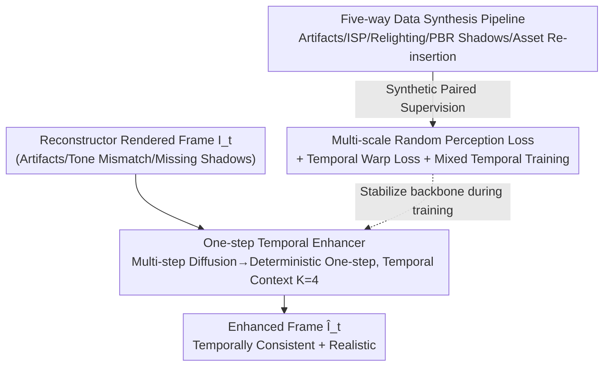

# DiffusionHarmonizer: Bridging Neural Reconstruction and Photorealistic Simulation with Online Diffusion Enhancer

**Conference**: CVPR 2026  
**Paper**: [CVF Open Access](https://openaccess.thecvf.com/content/CVPR2026/html/Zhang_DiffusionHarmonizer_Bridging_Neural_Reconstruction_and_Photorealistic_Simulation_with_Online_Diffusion_CVPR_2026_paper.html)  
**Code**: Not disclosed  
**Area**: 3D Vision / Diffusion Models / Neural Reconstruction Simulation  
**Keywords**: Neural Reconstruction, Online Simulation, One-step Diffusion, Temporal Consistency, Shadow Synthesis, Data Synthesis Pipeline

## TL;DR
The authors transform a pre-trained multi-step image diffusion model into a "single-step, deterministic, temporally-conditioned" enhancer. Combined with a five-way data pipeline specializing in "artifact-ridden rendering ↔ realistic photo" pairs, it enhances simulation frames reconstructed via NeRF/3DGS (characterized by artifacts and lighting mismatches) into temporally coherent, high-realism visuals in real-time. In user studies, 84.28% of participants preferred this method.

## Background & Motivation
**Background**: Closed-loop simulation for autonomous driving and robotics increasingly relies on "neural reconstruction"—using NeRF or 3D Gaussian Splatting (3DGS) to recover editable 3D scenes directly from real sensor data. By decomposing scenes into static backgrounds and movable foreground assets (vehicles, pedestrians), diverse driving scenarios can be generated automatically and scalably.

**Limitations of Prior Work**: This workflow suffers from two persistent issues. First are **new-view artifacts**: when rendering from viewpoints far from the training trajectory, reconstructions exhibit blurring, holes, ghosting, and incorrect geometry; similar issues occur when moving foreground assets. Second are **insertion artifacts**: placing foreground objects (synthetic or reconstructed elsewhere) into a scene often results in mismatched tones, missing contact shadows, and lighting inconsistencies, making composites look artificial.

**Key Challenge**: While generative models could serve as "post-rendering enhancers," existing models do not meet the constraints of **online simulation**. Video diffusion models offer good temporal quality but are too slow for online use on a single H100 (e.g., WAN V2V takes 2827ms per frame). Image editing models are fast but independent per frame, causing flickering, and struggle to model contact shadows or unintentionally alter correctly reconstructed regions, violating physical plausibility.

**Goal**: Develop an online, single-GPU enhancer that simultaneously: ① fixes new-view reconstruction artifacts; ② harmonizes foreground/background appearance; ③ synthesizes realistic shadows for inserted objects—all while **preserving scene geometry and structure** with **temporal consistency**.

**Key Insight**: The authors observe that pre-trained image diffusion models already contain powerful image-translation priors and do not require full retraining. The challenges lie in: (1) compressing multi-step denoising into a "single-step deterministic" process without degradation; (2) obtaining paired supervision of "artifact-ridden rendering ↔ clean real photo," which does not exist in the real world.

**Core Idea**: Utilize a "single-step temporal conditional enhancer + five-way synthetic paired data + stabilization loss for single-step training" to transform multi-step image diffusion into a real-time simulation harmonizer.

## Method

### Overall Architecture
DiffusionHarmonizer treats harmonization as an image-to-image translation task: given a degraded rendering $I_t$ at time $t$, it outputs an improved frame $\hat{I}_t$. The formula is $\hat{I}_t = D_\phi\big(F_\theta\big(E_\eta(I_t)\big)\big)$, where the latent encoder $E_\eta$ and decoder $D_\phi$ are from a pre-trained diffusion model and remain **frozen**, while only the diffusion backbone $F_\theta$ is fine-tuned.

The framework consists of two pipelines: the **offline training side** uses a "five-way data synthesis pipeline" to generate paired supervision (degraded input ↔ clean target), covering artifacts, ISP color differences, lighting, shadows, and asset insertion. The **online inference side** adapts the backbone $F_\theta$ into a one-step deterministic enhancer, consuming the previous $K$ enhanced frames as temporal context for streaming output. Training employs a "multi-scale random perception loss + temporal warp loss + mixed temporal training" to stabilize the single-step model and suppress checkerboard artifacts caused by the "multi-step pre-training vs. single-step inference" mismatch.

### Key Designs

**1. One-step Temporal Conditional Enhancer: Compressing Multi-step Diffusion to Deterministic One-step without Flickering**

To address the "slow video diffusion vs. flickering image diffusion" dilemma, the standard backbone $F_\theta$ (usually a denoiser operating on random noise across multiple timesteps) is **repurposed as a deterministic one-step enhancer**. The clean latent $E_\eta(I_t)$ is fed directly into the network **without injecting noise**, and the timestep and text condition tokens are fixed to a "null" constant during both training and inference. This results in a stable mapping from input latent to enhanced latent, improving frame-to-frame structural consistency with a single forward pass (212ms/frame, $\ge$1.8× faster than image editing baselines and 10× faster than video baselines).

To resolve independent flickering, **temporal conditioning** is added: with a context length $K=4$, the current degraded frame and up to the previous $K$ **already enhanced** results are encoded as $Z_t = \big(E_\eta(I_t), E_\eta(\hat{I}_{t-1}), \dots, E_\eta(\hat{I}_{t-K})\big)$. This is fed into the backbone featuring interleaved temporal and spatial attention layers. This allows the model to utilize historical context while preserving per-frame structure.

**2. Multi-scale Random Perception Loss: The "Antidote" for Single-step Artifacts**

Using a multi-step pre-trained model for single-step inference causes **noise-trajectory mismatch**, often resulting in high-frequency checkerboard artifacts. The solution is to calculate the perceptual loss on **randomly sampled patches of various sizes**. Given random side lengths $k \in [128, 512]$ and random positions for patches $\hat{P}^{(k)}_t$ and $P^{(k)}_{gt}$:

$$\mathcal{L}_{perc} = \mathbb{E}_k\Big[\sum_l \lambda_l \big\| \phi_l(\hat{P}^{(k)}_t) - \phi_l(P^{(k)}_{gt}) \big\|_2^2\Big]$$

where $\phi_l(\cdot)$ represents VGG features at layer $l$. Randomly scaled patches cause boundary fluctuations relative to the network's receptive field, **amplifying high-frequency inconsistencies and suppressing periodic aliasing**. Ablations show this version outperforms standard LPIPS in balancing smoothness and detail.

**3. Five-way Data Synthesis Pipeline: Creating Paired Supervision**

Since real-world paired data for "degraded rendering ↔ clean real photo" is unavailable, the authors use five complementary streams:

- **New-view Artifact Correction**: Follows DIFIX3D+ degradations (sparse, cycle, cross-reference, underfitting) to generate frames with blur/holes/ghosting paired with clean renderings.
- **ISP Modification**: Simulates tone mismatches by re-rendering original images $I_{orig}$ with sampled ISP parameters (tone mapping, exposure, white balance) to get $I_{ISP}$, then compositing $I_{mix} = M \odot I_{ISP} + (1-M) \odot I_{orig}$ using SAM2 masks.
- **Relighting**: Uses a relighting diffusion model to re-render foreground objects under random lighting, supervising the model to resolve lighting inconsistencies.
- **PBR Shadow Simulation**: Uses a physical renderer to generate "shadow vs. no-shadow" pairs in synthetic scenes for pixel-level contact shadow supervision.
- **Asset Re-insertion**: Uses 3DGUT to reconstruct backgrounds and extract dynamic foregrounds, then re-inserts foregrounds **without shadows** to create "realistic but unharmonized" frames paired with the original sequences containing correct shadows.

**4. Temporal Warp Loss + Mixed Temporal Training: Locking Inter-frame Continuity**

A flow-based warp loss is added: RAFT estimates optical flow $F_{t \to t-1}$ between ground truth frames $I^{gt}_{t-1}, I^{gt}_t$. The enhanced frame at $t-1$ is warped to $t$, restricting consistency on valid pixels $\Omega$:

$$\mathcal{L}_{temp} = \frac{1}{|\Omega|}\sum_{x \in \Omega}\big\| \hat{I}_t(x) - \mathrm{Warp}(\hat{I}_{t-1}, F_{t\to t-1})(x) \big\|^2$$

This is computationally feasible because the single-step formulation requires only one forward pass per frame. The total loss is $\mathcal{L}_{total} = \lambda_{l2}\mathcal{L}_{l2} + \lambda_{perc}\mathcal{L}_{perc} + \lambda_{temp}\mathcal{L}_{temp}$. **Mixed temporal training** alternates between temporal and non-temporal batches to prevent over-reliance on neighboring frames when context is noisy or missing.

### Loss & Training
The model is based on the Cosmos 0.6B text-to-image diffusion model. The VAE is frozen, and only the diffusion backbone is tuned. Training involves 10k non-temporal pre-training steps followed by 4k temporal steps at $1024 \times 576$ resolution with bf16 precision ($\lambda_{l2}=1, \lambda_{perc}=1$).

## Key Experimental Results

### Main Results
Evaluated on new-trajectory simulation (In-domain) and object insertion (Out-of-domain) against image/video editing baselines. Metrics include FID/FVD (lower is better), DINO-Struct (higher is better), and VBench++ (higher is better):

| Dataset | Metric | Ours | Sub-optimal Baseline | Note |
|--------|------|------|----------|------|
| New Traj (In-domain) | FID↓ | **120.23** | 134.98 (WAN V2V) | Best perception |
| New Traj (In-domain) | DINO-Struct↑ | **0.9215** | 0.8289 (WAN V2V) | Significant structural lead |
| Object Insert (OOD) | FID↓ | **101.27** | 104.42 (WAN V2V) | Best generalized |
| Object Insert (OOD) | Temp. Consist↑ | 0.9670 | 0.9675 (WAN V2V) | Comparable to video diff. |
| Inference Speed | ms/frame↓ | **212** | 398 (SDEdit) / 2827 (WAN V2V) | 10× faster than video edit |

On holdout sets with ground truth (Relighting/PBR Shadows/ISP):

| Holdout Set | Metric | Ours | Sub-optimal Baseline |
|--------|------|------|----------|
| Relighting | PSNR↑ | **23.93** | 15.35 (IP2P) |
| PBR Shadows | PSNR↑ | **26.31** | 16.46 (IP2P) |
| ISP Mod | PSNR↑ | **28.10** | 17.46 (SDEdit) |

User preference rate over SDEdit/IP2P/WAN V2V was **84.28% / 90.10% / 90.11%** respectively.

### Ablation Study

| Config | Metric (In-domain Temp) | Note |
|------|---------|------|
| Full Model | 0.9827 | |
| w/o Temporal Loss $\mathcal{L}_{temp}$ | 0.9806 | Consistency drops |
| w/o Temporal Module | 0.9714 | Significant drop (OOD 0.967→0.950) |
| w/o Perception Loss | — | Outputs are over-smoothed |
| Multi-scale Patch vs. LPIPS | — | Multi-scale suppresses checkerboarding |

### Key Findings
- **Temporal Module > Temporal Loss**: Removing the module (0.9714) results in a larger drop than removing the loss (0.9806), indicating architectural temporal encoding is the primary driver of consistency.
- **Multi-scale patch is critical for one-step success**: Only the random multi-scale strategy suppresses checkerboard artifacts while preserving detail.
- **Artifact correction is the most important data stream**: Removing the artifactCorrection stream causes the largest drop (FID 105.29), highlighting its role in neural simulation harmonization.

## Highlights & Insights
- **One-step efficiency enables temporal supervision**: Compressing to one step allows for the warp loss calculation, which would be memory-prohibitive with multi-step denoising trajectories.
- **Deterministic Transformation**: By nulling timesteps/text and freezing the VAE, the authors turn diffusion into a deterministic translator, achieving high DINO-Struct scores (0.92).
- **Factorized Data Synthesis**: The strategy of decomposing the harmonization task into five controllable sub-tasks (ISP, lightning, shadows, etc.) serves as a blueprint for other tasks lacking paired real-world data.

## Limitations & Future Work
- **Domain Gap**: PBR shadow data still differs from real statistics, necessitating the asset re-insertion stream.
- **Speed**: While 10× faster than video models, the 212ms latency is still slower than dedicated lightweight harmonizers (e.g., VHTT's 63ms).
- **Dependency**: The pipeline depends on multiple external models (SAM2, 3DGUT, RAFT, etc.), increasing complexity and error propagation risks.

## Related Work & Insights
- **vs. DIFIX3D+**: This work extends artifact correction to a full online harmonization task including shadows and lighting.
- **vs. VHTT / Ke et al.**: These specialize in foreground appearance but do not fix reconstruction artifacts or synthesize contact shadows.
- **vs. Wan-Video V2V**: While video diffusion has slightly better consistency, it is 13× slower and often hallucinates or over-edits static regions.

## Rating
- Novelty: ⭐⭐⭐⭐ 
- Experimental Thoroughness: ⭐⭐⭐⭐ 
- Writing Quality: ⭐⭐⭐⭐ 
- Value: ⭐⭐⭐⭐ High engineering value for autonomous driving and robotics simulation.

<!-- RELATED:START -->

## Related Papers

- [\[CVPR 2026\] Sparse-View Localization via Online Neural 3D Regression](sparse-view_localization_via_online_neural_3d_regression.md)
- [\[CVPR 2026\] FluidGaussian: Propagating Simulation-Based Uncertainty Toward Functionally-Intelligent 3D Reconstruction](fluidgaussian_propagating_simulation-based_uncertainty_toward_functionally-intel.md)
- [\[CVPR 2026\] WorldStereo: Bridging Camera-Guided Video Generation and Scene Reconstruction via 3D Geometric Memories](worldstereo_bridging_camera-guided_video_generation_and_scene_reconstruction_via.md)
- [\[CVPR 2026\] Online3R: Online Learning for Consistent Sequential Reconstruction Based on Geometry Foundation Model](online3r_online_learning_for_consistent_sequential_reconstruction_based_on_geome.md)
- [\[CVPR 2026\] ReWeaver: Towards Simulation-Ready and Topology-Accurate Garment Reconstruction](reweaver_towards_simulation-ready_and_topology-accurate_garment_reconstruction.md)

<!-- RELATED:END -->
